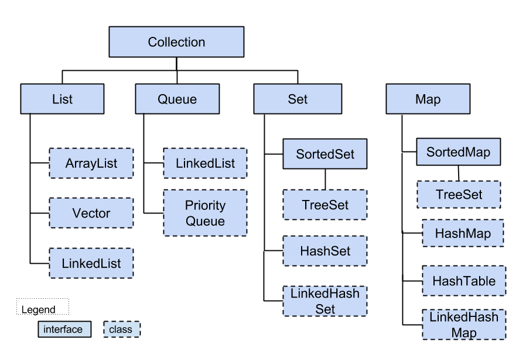
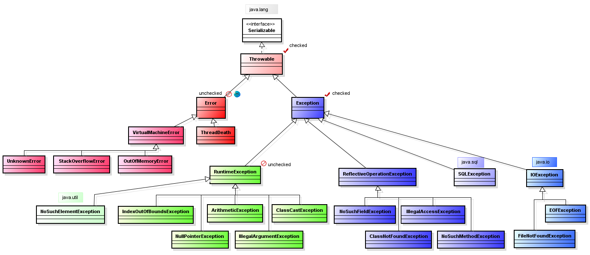

# Cобеседование по Java. Разбор вопросов и ответов.


<a href="https://mc.yandex.ru/pixel/8711235002931986822?rnd=%aw_random%">
    
  </a>&nbsp;&nbsp;
<a href="https://mc.yandex.ru/watch/92801430">
    
  </a>&nbsp;&nbsp;


1606 вопросов 677 ответов


Нажмите ★, если вам нравится проект. Ваш вклад сердечно ♡ приветствуется.

Если вам интересно мое резюме: https://github.com/DEBAGanov


# 1 Блок вопросов


Junior

Общие


## 1. `Какие знаете шаблоны проектирования? Расскажите о двух шаблонах, используемых в работе.`

Существует множество шаблонов проектирования, которые используются в различных областях программирования. Расскажу о двух наиболее распространенных шаблонах:

`Фабричный метод (Factory method)` - это шаблон проектирования, который предоставляет интерфейс для создания объектов некоторого класса, но позволяет подклассам выбирать классы, которые должны быть созданы. То есть данный шаблон делегирует ответственность за создание объектов своим подклассам.
Пример использования фабричного метода может быть следующим: у вас есть базовый класс "Фигура", от которого наследуются классы "Круг", "Прямоугольник" и т.д. Каждый из этих классов должен уметь создавать объекты своего типа. В этом случае можно воспользоваться фабричным методом, чтобы вынести логику создания объектов в отдельный класс.


`Одиночка (Singleton)` - это шаблон проектирования, который гарантирует, что у класса есть только один экземпляр, а также предоставляет глобальную точку доступа к этому экземпляру.
Пример использования шаблона Одиночка может быть следующим: у вас есть класс, который предоставляет доступ к базе данных. В этом случае можно сделать этот класс Одиночкой, чтобы гарантировать, что у нас будет только один экземпляр класса, который будет работать с базой данных, и избежать проблем с несогласованными изменениями данных в разных экземплярах класса.

Core Java


<DIV ALIGN="RIGHT">
    <B><A HREF="#">↥ ВЕРНУТЬСЯ К НАЧАЛУ</A></B> <br>
    <B><A HREF="https://github.com/DEBAGanov"> если вам понравилось поставьте пожалуйста ★ </A></B>
</DIV>

## 2. `Какие типы данных в Java? Чем отличается объект от простых типов данных?`
В Java существует 8 простых типов данных:

+ `byte` - 8-битное целое число со знаком (-128 до 127)
+ `short` - 16-битное целое число со знаком (-32,768 до 32,767)
+ `int` - 32-битное целое число со знаком (-2,147,483,648 до 2,147,483,647)
+ `long` - 64-битное целое число со знаком (-9,223,372,036,854,775,808 to 9,223,372,036,854,775,807)
+ `float` - 32-битное число с плавающей точкой (1.4E-45 до 3.4028235E+38)
+ `double` - 64-битное число с плавающей точкой (4.9E-324 до 1.7976931348623157E+308)
+ `char` - 16-битный символ Unicode ('\u0000' до '\uffff')
+ `boolean` - логическое значение (true или false)

Также в Java есть объектные типы данных, которые являются экземплярами классов, и могут хранить некоторые данные и иметь методы. Объекты могут хранить данные разных типов, даже простых типов данных. Например, объект типа Integer может хранить целое число типа int.

Разница между простыми типами данных и объектами заключается в способе хранения данных и доступе к ним. Простые типы данных хранятся в стеке, в то время как объекты - в куче. Объекты также могут иметь методы для обработки своих данных, тогда как простые типы данных этого не могут.


<DIV ALIGN="RIGHT">
    <B><A HREF="#">↥ ВЕРНУТЬСЯ К НАЧАЛУ</A></B> <BR>
    <B><A HREF="HTTPS://GITHUB.COM/DEBAGANOV"> если вам понравилось поставьте пожалуйста ★ </A></B>
</DIV>

## 3. `В чем разница передачи параметров по ссылке и значению?`

В Java все аргументы метода передаются по значению, то есть копируется значение переменной (даже если она ссылочного типа). Однако у ссылочных переменных копируется лишь значение ссылки, а не объекта, на который она ссылается. Поэтому, если произойдет изменение состояния объекта, на который ссылается переданная ссылка, то эти изменения будут отражены на объекте, на который ссылается исходная переменная. Таким образом, то, что большинство людей называют "передачей по ссылке", на самом деле называется "передачей значения ссылки".

Пример:
```java
public class Test {
    public static void main(String[] args) {
        StringBuffer str = new StringBuffer("hello");
        change(str);
        System.out.println(str);
    }

    public static void change(StringBuffer newStr) {
        newStr.append(" world");
    }
}
```
В этом примере метод change() принимает ссылку на объект StringBuffer и модифицирует его, добавляя к нему строку " world". В методе main() переменная str также ссылается на этот же самый объект StringBuffer, поэтому после вызова метода change() будет выведена строка "hello world".


<DIV ALIGN="RIGHT">
    <B><A HREF="#">↥ ВЕРНУТЬСЯ К НАЧАЛУ</A></B> <BR>
    <B><A HREF="HTTPS://GITHUB.COM/DEBAGANOV"> если вам понравилось поставьте пожалуйста ★ </A></B>
</DIV>

## 4. `Что такое JVM, JDK, JRE?`

JVM, JDK и JRE - это три основных понятия в мире Java-разработки.

`JVM (Java Virtual Machine)` - виртуальная машина Java , которая выполняет Java-байткод. Все программы на Java компилируются в байткод, который может быть выполнен на любой платформе, на которую установлена JVM.

`JDK (Java Development Kit)` - это пакет разработчика Java , который включает в себя всё необходимое для разработки Java-приложений, включая компилятор javac, библиотеки классов, документацию, примеры кода и JVM.

`JRE (Java Runtime Environment)` - это пакет для запуска Java-приложений, который включает в себя JVM, библиотеки классов и другие необходимые компоненты для запуска Java-приложений.

Кратко говоря, если вы планируете разработку Java-приложений, то вам нужна JDK. Если же вы планируете только запускать Java-приложения, то вам достаточно установить JRE, которая включает в себя JVM.


<DIV ALIGN="RIGHT">
    <B><A HREF="#">↥ ВЕРНУТЬСЯ К НАЧАЛУ</A></B> <BR>
    <B><A HREF="HTTPS://GITHUB.COM/DEBAGANOV"> если вам понравилось поставьте пожалуйста ★ </A></B>
</DIV>

## 6. `Зачем используют JVM?`

`JVM (виртуальная машина Java)` — важнейший компонент языка программирования Java. Это абстрактная машина, предоставляющая среду выполнения, в которой может выполняться скомпилированный код Java. Вот несколько причин, почему JVM важна и широко используется в разработке программного обеспечения:

+ `Переносимость`: код Java можно написать один раз и запустить на любой платформе, на которой установлена ​​JVM, независимо от базового оборудования и операционной системы. Это делает Java-программы легко переносимыми и уменьшает количество кода, необходимого для конкретной платформы.
+ `Управление памятью`: JVM управляет распределением памяти и автоматически освобождает неиспользуемую память посредством сборки мусора. Это освобождает разработчиков от утомительной и чреватой ошибками задачи ручного управления памятью.
+ `Безопасность`. Поскольку JVM выполняет код Java в изолированной среде, это предотвращает причинение вреда базовой системе вредоносным кодом. Это делает Java популярным выбором для создания безопасных и надежных приложений.
+ `Производительность`: JVM создана для оптимизации выполнения кода Java и использует передовые методы, такие как своевременная компиляция, для достижения высокой производительности.

В целом, JVM играет критическую роль в языке программирования Java, предоставляя многочисленные преимущества, которые делают его популярным выбором для создания надежных, безопасных и переносимых приложений.


<DIV ALIGN="RIGHT">
    <B><A HREF="#">↥ ВЕРНУТЬСЯ К НАЧАЛУ</A></B> <BR>
    <B><A HREF="HTTPS://GITHUB.COM/DEBAGANOV"> если вам понравилось поставьте пожалуйста ★ </A></B>
</DIV>

## 7. `Что такое bytecode?`

`Bytecode` в Java - это набор инструкций, разработанных для исполнения на виртуальной машине Java (JVM). Он представляет собой низкоуровневый, но переносимый по архитектуре набор инструкций, который может быть выполняем на любой машине Java. Java-программы компилируются в байт-код, который может быть распространен и загружен на любой машине, на которой установлено соответствующее окружение выполнения Java. После того как байт-код загружается в виртуальную машину, он транслируется в машинный код и исполняется. Это позволяет программам Java быть переносимыми между различными платформами без необходимости перекомпилировать их на каждой платформе.


<DIV ALIGN="RIGHT">
    <B><A HREF="#">↥ ВЕРНУТЬСЯ К НАЧАЛУ</A></B> <BR>
    <B><A HREF="HTTPS://GITHUB.COM/DEBAGANOV"> если вам понравилось поставьте пожалуйста ★ </A></B>
</DIV>

## 8. `Какие признаки JavaBean?`
`JavaBeans` - это классы в языке Java, которые следуют определенным правилам и используются для управления объектами в приложениях. Вот некоторые основные признаки JavaBean:

+ Класс должен иметь стандартный конструктор без параметров.
+ Свойства должны быть доступны через геттеры (get) и сеттеры (set) методы.
+ Имена геттеров и сеттеров должны соответствовать стандартной схеме: для свойства "foo" геттер должен иметь имя "getFoo", а сеттер - "setFoo".
+ Класс должен реализовывать java.io.Serializable интерфейс, чтобы его можно было сериализовать.

Некоторые другие признаки включают использование аннотации `@ManagedBean`, наличие методов добавления и удаления для свойств типа коллекций и поддержку событий с помощью методов с именами типа `add<EventListenerType>Listener` и `remove<EventListenerType>Listener`.


<DIV ALIGN="RIGHT">
    <B><A HREF="#">↥ ВЕРНУТЬСЯ К НАЧАЛУ</A></B> <BR>
    <B><A HREF="HTTPS://GITHUB.COM/DEBAGANOV"> если вам понравилось поставьте пожалуйста ★ </A></B>
</DIV>

## 9. `Что такое OutOfMemoryError?`

`OutOfMemoryError` — это ошибка времени выполнения в языке программирования Java, которая возникает, когда виртуальная машина Java (JVM) не может выделить память для создания новых объектов, поскольку пространство кучи заполнено и больше нет места для хранения новых объектов.
`Куча space` — это пространство памяти, используемое JVM для выделения и освобождения объектов, созданных во время выполнения. Важно эффективно управлять использованием памяти в Java, чтобы избежать исключений OutOfMemoryError. Этого можно добиться путем оптимизации кода, сокращения потребления памяти и использования соответствующих методов управления памятью, таких как сборка мусора, эффективные структуры данных и шаблоны проектирования. Кроме того, вы можете увеличить максимальный размер кучи, доступный для JVM, используя такие параметры командной строки, как -Xmx, чтобы избежать нехватки памяти.


<DIV ALIGN="RIGHT">
    <B><A HREF="#">↥ ВЕРНУТЬСЯ К НАЧАЛУ</A></B> <BR>
    <B><A HREF="HTTPS://GITHUB.COM/DEBAGANOV"> если вам понравилось поставьте пожалуйста ★ </A></B>
</DIV>

## 10. `Что такое стектрейс? Как его получить?`

`Стек-трейс (stack trace)` - это список вызовов методов, которые привели к возникновению исключения (exception) в программе на языке Java. С помощью стек-трейса можно определить, в какой части программы произошла ошибка, и узнать, как программа пришла к этому месту.

Для получения стек-трейса в Java вы можете воспользоваться методом printStackTrace() класса Throwable. Пример использования:
```java
try {
  // some code that may throw an exception
} catch (Exception e) {
  e.printStackTrace();
}
```
Этот код вызовет метод printStackTrace() для исключения, которое было поймано в блоке catch, и выведет стек-трейс в консоль.

Также в Java есть возможность получить объект типа StackTraceElement[], который представляет собой список элементов стека вызовов. Пример использования:
```java
try {
  // some code that may throw an exception
} catch (Exception e) {
  StackTraceElement[] stackTraceElements = e.getStackTrace();
  // do something with the array of stack trace elements
}
```
Этот код вызовет метод getStackTrace() для исключения, которое было поймано в блоке catch, и получит список элементов стека вызовов в виде массива объектов типа StackTraceElement. Далее этот массив можно использовать для анализа и отладки ошибок в программе.


<DIV ALIGN="RIGHT">
    <B><A HREF="#">↥ ВЕРНУТЬСЯ К НАЧАЛУ</A></B> <BR>
    <B><A HREF="HTTPS://GITHUB.COM/DEBAGANOV"> если вам понравилось поставьте пожалуйста ★ </A></B>
</DIV>

## 11. `Назовите все методы класса object.`

В Java все классы наследуются от класса Object. Некоторые методы, определенные в классе Object, включают в себя:

+ `getClass()`: возвращает объект Class, который представляет класс объекта
+ `hashCode()`: возвращает хэш-код объекта
+ `equals(Object obj)`: определяет, равен ли данный объект указанному объекту
+ `clone()`: создает и возвращает копию данного объекта
+ `toString()`: возвращает строковое представление объекта
+ `notify()`: возобновляет выполнение потока, заблокированного на объекте
+ `notifyAll()`: возобновляет выполнение всех потоков, заблокированных на данном объекте
+ `wait()`: ожидает до тех пор, пока другой поток не уведомит о возможности продолжения выполнения
+ `finalize()`: вызывается сборщиком мусора перед тем, как объект будет удален

Важно отметить, что эти методы могут быть переопределены в производных классах, если необходимо изменить их реализацию для совместимости с конкретными требованиями приложения.


<DIV ALIGN="RIGHT">
    <B><A HREF="#">↥ ВЕРНУТЬСЯ К НАЧАЛУ</A></B> <BR>
    <B><A HREF="HTTPS://GITHUB.COM/DEBAGANOV"> если вам понравилось поставьте пожалуйста ★ </A></B>
</DIV>

## 12. `В чем разница между try-with-resources и try-catch-finally при работе с ресурсами?`

В Java `try-with-resources` - это новый способ работы с ресурсами, введенный в версии JDK 7. Он автоматически закрывает используемые ресурсы после того, как выполнение блока try завершится. Таким образом, вы можете избежать вручную закрытия ресурсов в блоке finally.

Пример с try-with-resources:
```java
try (InputStream in = new FileInputStream("file.txt")) {
    // считывание данных из потока
} catch (IOException e) {
    // обработка ошибок ввода/вывода
} // здесь in будет автоматически закрыт
```
В то время как в блоке `try-catch-finally`, блок finally выполняется после того, как выполнение блока try завершилось, но перед тем, как управление передается дальше по стеку вызовов. Это означает, что блок finally может использоваться для закрытия ресурсов, открытых в блоке try.

Пример с try-catch-finally:
```java
InputStream in = null;
try {
    in = new FileInputStream("file.txt");
    // считывание данных из потока
} catch (IOException e) {
    // обработка ошибок ввода/вывода
} finally {
    if (in != null) {
        try {
            in.close();
        } catch (IOException e) {
            // обработка ошибок ввода/вывода
        }
    }
}
```
Таким образом, try-with-resources упрощает и уменьшает количество кода при работе с ресурсами и обеспечивает безопасное закрытие использованных ресурсов, в то время как try-catch-finally позволяет закрыть ресурсы, если они были открыты в блоке try и выполнен блок catch, и выполняется в любом случае.

<DIV ALIGN="RIGHT">
    <B><A HREF="#">↥ ВЕРНУТЬСЯ К НАЧАЛУ</A></B> <BR>
    <B><A HREF="HTTPS://GITHUB.COM/DEBAGANOV"> если вам понравилось поставьте пожалуйста ★ </A></B>
</DIV>

## 13. `Что такое конструкторы? Какие типы знаете?`

`Конструкторы` - это методы класса в Java, которые вызываются при создании нового объекта этого класса. Их основная задача - инициализировать поля нового объекта.

Существует два типа конструкторов в Java:

+ `Конструктор по умолчанию` - это конструктор без параметров, который создается компилятором, если в классе не определен ни один конструктор. Он просто инициализирует все поля значениями по умолчанию.

+ `Пользовательский конструктор` - это конструктор, который создается программистом и который может иметь параметры. Он может выполнять любой код и инициализировать поля объекта значениями, переданными в параметрах.

Пример создания пользовательского конструктора в Java:
```java
public class MyClass {
    int x;

    // Пользовательский конструктор с одним параметром
    public MyClass(int x) {
        this.x = x;
    }
}
```
Этот конструктор принимает один параметр x и инициализирует поле класса значением этого параметра. Ключевое слово this используется для ссылки на текущий объект класса. Вы можете создавать любое количество пользовательских конструкторов с разными параметрами.


<DIV ALIGN="RIGHT">
    <B><A HREF="#">↥ ВЕРНУТЬСЯ К НАЧАЛУ</A></B> <BR>
    <B><A HREF="HTTPS://GITHUB.COM/DEBAGANOV"> если вам понравилось поставьте пожалуйста ★ </A></B>
</DIV>

## 14. `Что такое побитовые операции?`
Побитовые операции в Java позволяют работать с двоичным представлением чисел на уровне отдельных битов. В Java доступны следующие побитовые операции:
+ `& (побитовое AND)`: возвращает 1 в каждом разряде двоичного представления, если оба операнда содержат 1, в противном случае - 0.
+ `| (побитовое OR)`: возвращает 1 в каждом разряде двоичного представления, если хотя бы один операнд содержит 1, в противном случае - 0.
+ `^ (побитовое исключающее OR)`: возвращает 1 в каждом разряде двоичного представления, если только один из операндов содержит 1, в противном случае - 0.
+ `~ (побитовое NOT)`: инвертирует каждый бит операнда. 1 становится 0 и наоборот.
+ `<< (сдвиг влево)`: сдвигает биты левого операнда на указанное количество разрядов влево. Недостающие биты заполняются нулями.
+ `>> (сдвиг вправо)`: сдвигает биты левого операнда на указанное количество разрядов вправо. Недостающие биты заполняются нулями. Оставшиеся биты соответствуют знаку операнда.
+ `>>> (беззнаковый сдвиг вправо)`: сдвигает биты левого операнда на указанное количество разрядов вправо. Недостающие биты заполняются

<DIV ALIGN="RIGHT">
    <B><A HREF="#">↥ ВЕРНУТЬСЯ К НАЧАЛУ</A></B> <BR>
    <B><A HREF="HTTPS://GITHUB.COM/DEBAGANOV"> если вам понравилось поставьте пожалуйста ★ </A></B>
</DIV>

## 15. `Объекты каких стандартных классов immutable в Java?`

В языке Java объекты классов String, Integer, Byte, Character, Short, Boolean, Long, Double и Float являются immutable. Это означает, что значения их полей не могут быть изменены после создания объекта. Таким образом, любые операции с ними, которые изменяют значение, на самом деле создают новый объект. Примером может быть метод substring() в классе String, который создает новый объект строки, содержащий подстроку из исходной строки. Кроме того, вы также можете создавать свои собственные immutable классы в Java, объявляя поля и устанавливая им значения только в конструкторе, а затем делая их final. Это гарантирует, что их значения не могут быть изменены после создания объекта.

<DIV ALIGN="RIGHT">
    <B><A HREF="#">↥ ВЕРНУТЬСЯ К НАЧАЛУ</A></B> <BR>
    <B><A HREF="HTTPS://GITHUB.COM/DEBAGANOV"> если вам понравилось поставьте пожалуйста ★ </A></B>
</DIV>

## 16. `Дайте краткую характеристику immutable object. Зачем они нужны?`

Неизменяемые объекты `(immutable objects)` в Java - это объекты, которые нельзя изменить после их создания. Объекты, такие как строки (String) или числа (Integer), являются неизменяемыми. Когда вы создаете новое значение для такого объекта, на самом деле создается новый объект, и старый объект остается неизменяемым.

Основное преимущество неизменяемых объектов - это их надежность и защита от изменений со стороны других частей программы. Также они обеспечивают безопасность многопоточного программирования, поскольку неизменяемые объекты могут быть разделены между несколькими потоками без риска изменений и ошибок.

Также неизменяемые объекты помогают улучшить производительность программы, потому что их не нужно копировать или клонировать для сохранения неизменным.

Например, вместо создания нового массива при изменении элемента в массиве, вы можете создать новый массив, который копирует все элементы и изменить нужный элемент в нем. Это будет более эффективным по времени и памяти, чем изменение изначального массива.

В целом, неизменяемые объекты помогают упростить разработку и обеспечить надежность программы за счет уменьшения риска ошибок в результате непреднамеренных изменений объектов.

<DIV ALIGN="RIGHT">
    <B><A HREF="#">↥ ВЕРНУТЬСЯ К НАЧАЛУ</A></B> <BR>
    <B><A HREF="HTTPS://GITHUB.COM/DEBAGANOV"> если вам понравилось поставьте пожалуйста ★ </A></B>
</DIV>

## 17. `Как сделать immutable object?`

В Java вы можете сделать объект неизменяемым `(immutable)`, задав его поля как final. `Неизменяемый объект` - это объект, который не может быть изменен после своего создания. Это обычно рекомендуется для создания объектов, которые должны оставаться постоянными во время жизни программы, такие как уникальные идентификаторы или настройки приложения.

Вот пример класса Person, который является неизменяемым:
```java
public final class Person {
    private final String name;
    private final Date birthDate;

    public Person(String name, Date birthDate) {
        this.name = name;
        this.birthDate = new Date(birthDate.getTime());
    }

    public String getName() {
        return name;
    }

    public Date getBirthDate() {
        return new Date(birthDate.getTime());
    }
}
```
В этом примере оба поля name и birthDate помечены как final, что делает их неизменяемыми. Конструктор класса создает новый объект Person с заданными именем и датой рождения. Обратите внимание, что для даты рождения создается новый объект Date, чтобы можно было избежать ее изменения после создания объекта Person.

В целом, чтобы сделать объект неизменяемым, все его поля должны быть объявлены как final и не должны иметь сеттеры для изменения значений после создания объекта.

<DIV ALIGN="RIGHT">
    <B><A HREF="#">↥ ВЕРНУТЬСЯ К НАЧАЛУ</A></B> <BR>
    <B><A HREF="HTTPS://GITHUB.COM/DEBAGANOV"> если вам понравилось поставьте пожалуйста ★ </A></B>
</DIV>

## 18. `Каковы преимущества immutable object перед обычными объектами?`
Преимущества неизменяемых (immutable) объектов перед обычными объектами в Java включают в себя:

+ `Безопасность потоков`: неизменяемые объекты могут быть безопасно использованы в многопоточной среде, так как они не могут быть изменены другим потоком.
+ `Простота`: неизменяемые объекты проще в использовании, так как их значения не могут быть изменены. Это уменьшает количество ошибок и делает программу проще для понимания.
+ `Повторное использование`: неизменяемые объекты могут быть повторно использованы в разных контекстах, так как их значения не изменяются.
+ `Кешеруемость`: неизменяемые объекты могут быть безопасно закэшированы, так как их значения не изменяются.
+ `Сравнение`: неизменяемые объекты могут быть сравнены просто по их значениям, а не по их ссылкам, так как их значения всегда остаются неизменными.
+ `Безопасность`: неизменяемые объекты обеспечивают надежность программы путем предотвращения изменения их значений после создания объекта.

Некоторые из классов Java, такие как String и BigInteger, являются неизменяемыми. Вы можете создать свой собственный класс неизменяемости, объявив все поля как final, а конструктор только со значениями полей. Это защищает поля от изменений и делает объект неизменяемым.


<DIV ALIGN="RIGHT">
    <B><A HREF="#">↥ ВЕРНУТЬСЯ К НАЧАЛУ</A></B>
</DIV>

ООП


<DIV ALIGN="RIGHT">
    <B><A HREF="#">↥ ВЕРНУТЬСЯ К НАЧАЛУ</A></B> <BR>
    <B><A HREF="HTTPS://GITHUB.COM/DEBAGANOV"> если вам понравилось поставьте пожалуйста ★ </A></B>
</DIV>

## 19. `Что такое ООП? Назовите принципы с примерами.`
ООП (объектно-ориентированное программирование) - это методология программирования, в которой программа строится на основе объектов, которые имеют свойства и поведение. Основные принципы ООП включают инкапсуляцию, наследование и полиморфизм.

`Инкапсуляция` - это принцип, который позволяет скрыть детали реализации объекта от других объектов. Таким образом, объект может предоставить только необходимый интерфейс для работы с ним. Например, класс "Человек" может иметь свойство "Возраст", но этот возраст может быть доступен только через метод получения.

`Наследование` - это принцип, который позволяет создавать новые классы на основе уже существующих. Новый класс наследует свойства и методы родительского класса и может добавить свои собственные свойства и методы. Например, класс "Сотрудник" может наследовать свойства и методы от класса "Человек".

`Полиморфизм` - это принцип, который позволяет объектам с одинаковым интерфейсом иметь различную реализацию. Такой подход позволяет использовать один и тот же метод для работы с разными типами объектов. Например, метод "рисовать" может иметь различную реализацию для объектов "Круг", "Прямоугольник" и "Треугольник".

В Java эти принципы используются везде - от создания классов до работы с наследованием и полиморфизмом. Например, в классе "Автомобиль" могут быть инкапсулированы свойства, такие как скорость и количество топлива, а метод "двигаться" может использовать полиморфизм, чтобы вызвать различные способы движения для разных типов автомобилей.

<DIV ALIGN="RIGHT">
    <B><A HREF="#">↥ ВЕРНУТЬСЯ К НАЧАЛУ</A></B> <BR>
    <B><A HREF="HTTPS://GITHUB.COM/DEBAGANOV"> если вам понравилось поставьте пожалуйста ★ </A></B>
</DIV>

## 20. `В чем преимущества ООП перед процедурным программированием?`

ООП имеет ряд преимуществ перед процедурным программированием:

+ `Инкапсуляция`: объекты в ООП скрывают свои детали реализации от других объектов, что уменьшает сложность кода и делает его более понятным. Это также обеспечивает более легкое тестирование и модификацию кода.
+ `Наследование`: наследование позволяет создавать новые классы, которые могут наследовать свойства и методы от родительских классов. Это позволяет избежать дублирования кода и уменьшить количество ошибок при изменении кода.
+ `Полиморфизм`: полиморфизм позволяет использовать один и тот же интерфейс для работы с разными типами объектов. Это увеличивает гибкость кода и позволяет повторно использовать уже написанный код.
+ `Безопасность`: ООП позволяет контролировать доступ к свойствам и методам объекта. Таким образом, возможность ошибки в программе сокращается, а ее безопасность увеличивается.
+ `Модульность`: ООП позволяет разбить программу на модули, каждый из которых может быть независимо разработан и тестирован. Это позволяет повысить эффективность разработки и сопровождения программного обеспечения.

В целом, ООП предоставляет ряд методов и инструментов для создания более гибких, масштабируемых и безопасных приложений. Однако, в зависимости от конкретной задачи, процедурное программирование также может быть достаточным и эффективным способом разработки.

<DIV ALIGN="RIGHT">
    <B><A HREF="#">↥ ВЕРНУТЬСЯ К НАЧАЛУ</A></B> <BR>
    <B><A HREF="HTTPS://GITHUB.COM/DEBAGANOV"> если вам понравилось поставьте пожалуйста ★ </A></B>
</DIV>

## 21. `В чем состоит главная особенность ООП?`

Главная особенность ООП (объектно-ориентированного программирования) заключается в том, что программа строится на основе объектов, которые имеют свойства и поведение. В этом подходе данные и функции для их обработки объединены в одном компоненте - классе. Классы могут наследоваться друг от друга, и таким образом создавать дополнительные классы с более сложным поведением.

Это отличается от процедурного программирования, где данные и функции для их обработки могут быть разбиты на отдельные функции, которые работают независимо друг от друга. В ООП, данные и функции для их обработки упаковываются в объекты, которые затем могут использоваться в других частях программы.

Таким образом, ООП позволяет создавать более гибкие и модульные приложения, которые могут быть легко изменены и расширены. Кроме того, ООП позволяет создавать более понятный и читаемый код, так как он базируется на концепции реального мира, что облегчает процесс разработки.

<DIV ALIGN="RIGHT">
    <B><A HREF="#">↥ ВЕРНУТЬСЯ К НАЧАЛУ</A></B> <BR>
    <B><A HREF="HTTPS://GITHUB.COM/DEBAGANOV"> если вам понравилось поставьте пожалуйста ★ </A></B>
</DIV>

## 22. `Расскажите, какие преимущества мы получаем с использованием ООП?`

Использование ООП (объектно-ориентированного программирования) предоставляет множество преимуществ:

+ `Инкапсуляция` - объекты в ООП скрывают свою реализацию от других объектов, что уменьшает сложность кода и делает его более понятным. Это также обеспечивает более легкое тестирование и модификацию кода.
+ `Наследование` - наследование позволяет создавать новые классы, которые могут наследовать свойства и методы от родительских классов. Это позволяет избежать дублирования кода и уменьшить количество ошибок при изменении кода.
+ `Полиморфизм` - полиморфизм позволяет использовать один и тот же интерфейс для работы с разными типами объектов. Это увеличивает гибкость кода и позволяет повторно использовать уже написанный код.
+ `Безопасность` - ООП позволяет контролировать доступ к свойствам и методам объекта. Таким образом, возможность ошибки в программе сокращается, а ее безопасность увеличивается.
+ `Модульность` - ООП позволяет разбить программу на модули, каждый из которых может быть независимо разработан и тестирован. Это позволяет повысить эффективность разработки и сопровождения программного обеспечения.
+ `Улучшенное переиспользование кода` - ООП позволяет создавать гибкие и многократно используемые компоненты, что уменьшает время и затраты на разработку новых приложений.
+ `Повышенная производительность` - ООП-приложения могут быть более производительными, чем их процедурные аналоги, благодаря тому, что объекты могут работать параллельно и использовать локальные кеш-памяти.
+ `Более удобное масштабирование` - ООП позволяет разрабатывать программное обеспечение для сложных систем, которые могут быть масштабированы и модифицированы без необходимости изменения всей программы.

В целом, ООП предоставляет разработчикам ряд методов и инструментов для создания более гибких, масштабируемых и безопасных приложений.

<DIV ALIGN="RIGHT">
    <B><A HREF="#">↥ ВЕРНУТЬСЯ К НАЧАЛУ</A></B> <BR>
    <B><A HREF="HTTPS://GITHUB.COM/DEBAGANOV"> если вам понравилось поставьте пожалуйста ★ </A></B>
</DIV>

## 23. `Расскажите какие недостатки в ООП?`
Как и любой подход к программированию, ООП имеет свои недостатки:

+ `Сложность` - ООП может быть сложным для понимания и использования начинающими разработчиками, особенно если они не имеют опыта работы с объектно-ориентированными языками программирования.
+ `Избыточность` - ООП может приводить к избыточности кода, что увеличивает размер программа и затрудняет ее понимание и сопровождение.
+ `Производительность` - ООП-приложения могут потреблять больше ресурсов, чем процедурные аналоги, благодаря тому, что объекты могут работать параллельно и использовать локальные кеш-памяти.
+ `Наследование` - наследование может вызывать проблемы, если оно не правильно используется. В некоторых случаях наследование может приводить к созданию излишне сложных иерархий классов.
+ `Полиморфизм` - полиморфизм может привести к ошибкам во время выполнения программы, если тип переменной не соответствует ожидаемому типу объекта.
+ `Тестирование` - тестирование ООП-приложений может быть сложнее, чем тестирование процедурных приложений, потому что объекты могут взаимодействовать друг с другом и создавать сложные зависимости.
+ `Ресурсоемкость` - ООП может потреблять больше памяти, чем процедурное программирование, из-за дополнительной информации, которая хранится в каждом объекте.

В целом, ООП имеет свои недостатки, но они не являются серьезными проблемами, если использовать ООП с умом и оптимизировать код.

<DIV ALIGN="RIGHT">
    <B><A HREF="#">↥ ВЕРНУТЬСЯ К НАЧАЛУ</A></B> <BR>
    <B><A HREF="HTTPS://GITHUB.COM/DEBAGANOV"> если вам понравилось поставьте пожалуйста ★ </A></B>
</DIV>

## 24. `Расскажите о принципе наследования в ООП? Зачем он нужен?`

Принцип наследования является одним из основных принципов объектно-ориентированного программирования (ООП). С помощью наследования один класс может наследовать свойства и методы другого класса (родительского класса), что позволяет избежать дублирования кода и повысить его переиспользуемость.

Наследование нужно для уменьшения дублирования кода и повторного использования кода, что позволяет сократить время разработки и упростить сопровождение программного обеспечения. Если у нескольких классов есть общие свойства или методы, то можно выделить эти общие элементы в базовый класс и наследовать их в других классах.

Когда новый класс наследует свойства и методы родительского класса, он может изменять их или добавлять свои собственные свойства и методы. Таким образом, наследование позволяет создавать дополнительные классы с более сложным поведением на основе уже существующих классов.

В Java наследование осуществляется с помощью ключевого слова extends. Например, если хотим создать класс Cat, который наследует свойства и методы класса Animal, код может выглядеть так:
```java
public class Animal {
    public void eat() {
        System.out.println("Animal is eating");
    }
}

public class Cat extends Animal {
    public void meow() {
        System.out.println("Cat is meowing");
    }
}

// Использование класса Cat
Cat cat = new Cat();
cat.eat(); // Выводит "Animal is eating"
cat.meow(); // Выводит "Cat is meowing"
```
Класс Cat наследует метод eat() от класса Animal, и также имеет собственный метод meow().

Также можно использовать ключевое слово super для обращения к родительскому классу. Например, если мы хотим передать параметр конструктора класса Cat в конструктор класса Animal, код может выглядеть так:
```java
public class Animal {
    private String name;

    public Animal(String name) {
        this.name = name;
    }

    public void eat() {
        System.out.println(name + " is eating");
    }
}

public class Cat extends Animal {
    public Cat(String name) {
        super(name);
    }

    public void meow() {
        System.out.println("Cat is meowing");
    }
}

// Использование класса Cat
Cat cat = new Cat("Whiskers");
cat.eat(); // Выводит "Whiskers is eating"
cat.meow(); // Выводит "Cat is meowing"
```

<DIV ALIGN="RIGHT">
    <B><A HREF="#">↥ ВЕРНУТЬСЯ К НАЧАЛУ</A></B> <BR>
    <B><A HREF="HTTPS://GITHUB.COM/DEBAGANOV"> если вам понравилось поставьте пожалуйста ★ </A></B>
</DIV>

## 25. `Дайте определение принципа полиморфизма в ООП? Как работает полиморфизм?`

`Принцип полиморфизма в ООП (объектно-ориентированном программировании)` предполагает использование одного и того же имени метода или свойства для объектов разных классов. Иными словами, полиморфизм позволяет обращаться к объектам разных классов с помощью одних и тех же методов или свойств.

Работа полиморфизма основывается на наследовании и переопределении методов в наследниках. Когда мы создаем новый класс, наследующий свойства и методы от родительского класса, мы можем переопределить некоторые методы в наследнике. Таким образом, если у нас есть переменная с типом родительского класса, то ее можно использовать для хранения экземпляра любого из наследников этого класса. При вызове метода через эту переменную будет вызываться метод из соответствующего наследника.


Еще один способ реализации полиморфизма - это использование интерфейсов. Интерфейс определяет набор методов, которые должны быть реализованы всеми классами, которые реализуют этот интерфейс. Это позволяет использовать объекты разных классов, которые реализуют один и тот же интерфейс, как если бы это были объекты одного класса.

Пример использования полиморфизма в Java:
```java
public class Animal {
   public void makeSound() {
      System.out.println("Animal is making a sound");
   }
}

public class Dog extends Animal {
   public void makeSound() {
      System.out.println("Dog is barking");
   }
}

public class Cat extends Animal {
   public void makeSound() {
      System.out.println("Cat is meowing");
   }
}

public class Main {
   public static void main(String[] args) {
      Animal animal1 = new Dog();
      Animal animal2 = new Cat();
      animal1.makeSound();
      animal2.makeSound();
   }
}
```
Этот код использует наследование и переопределение методов для реализации полиморфизма. Объекты animal1 и animal2 имеют тип Animal, но на самом деле являются объектами производных классов Dog и Cat соответственно.

<DIV ALIGN="RIGHT">
    <B><A HREF="#">↥ ВЕРНУТЬСЯ К НАЧАЛУ</A></B> <BR>
    <B><A HREF="HTTPS://GITHUB.COM/DEBAGANOV"> если вам понравилось поставьте пожалуйста ★ </A></B>
</DIV>

## 26. `Что такое статический и динамический полиморфизм?`

Статический и динамический полиморфизм - это два типа полиморфизма в объектно-ориентированном программировании.

`Статический полиморфизм` - это механизм, при котором выбор вызываемой функции происходит на этапе компиляции, основываясь на типах аргументов. Это означает, что функция будет вызвана согласно своей сигнатуре без учета того, какой объект на самом деле находится за ссылкой. Примерами статического полиморфизма могут служить перегрузка функций и шаблоны функций.

`Динамический полиморфизм` - это механизм, при котором выбор вызываемой функции происходит во время выполнения программы, основываясь на реальном типе объекта находящегося за ссылкой. Это означает, что функция будет вызвана согласно типу объекта, который находится за ссылкой. Примерами динамического полиморфизма могут служить виртуальные функции и наследование классов.

<DIV ALIGN="RIGHT">
    <B><A HREF="#">↥ ВЕРНУТЬСЯ К НАЧАЛУ</A></B> <BR>
    <B><A HREF="HTTPS://GITHUB.COM/DEBAGANOV"> если вам понравилось поставьте пожалуйста ★ </A></B>
</DIV>

## 27. `Дайте определение принципу абстракции в ООП.`
Принцип абстракции в объектно-ориентированном программировании означает, что объекты должны быть спроектированы таким образом, чтобы они представляли собой абстрактные концептуальные модели реальных объектов и процессов, которые могут взаимодействовать друг с другом. Он подразумевает, что каждый объект имеет свои собственные свойства и функциональность, которые могут быть использованы другими объектами без необходимости знать, как эта функциональность была реализована.

Другими словами, принцип абстракции означает, что детали реализации объектов должны быть скрыты от других объектов, которые используют эти объекты, и доступны только через интерфейсы. Это позволяет создавать более гибкие, расширяемые и переносимые системы, которые могут изменяться без влияния на остальную часть программы.

Принцип абстракции является одним из основных принципов ООП и обеспечивает более высокий уровень абстракции в программировании.

<DIV ALIGN="RIGHT">
    <B><A HREF="#">↥ ВЕРНУТЬСЯ К НАЧАЛУ</A></B> <BR>
    <B><A HREF="HTTPS://GITHUB.COM/DEBAGANOV"> если вам понравилось поставьте пожалуйста ★ </A></B>
</DIV>

## 28. `Какие элементы речи отвечают за инкапсуляцию?`

Элементы речи, отвечающие за инкапсуляцию в объектно-ориентированном программировании - это классы и методы.

`Классы` - это основные единицы инкапсуляции в ООП. Класс определяет состояние и поведение объектов. Состояние объекта представляет собой набор свойств или переменных, которые хранят данные объекта. Поведение объекта определяется набором методов, которые могут изменять состояние объекта и выполнять операции с данными.

`Методы` - это функции, определенные внутри класса, которые предоставляют интерфейс для работы с объектом. Методы обычно работают с закрытыми (private) свойствами объекта и скрывают детали реализации объекта от внешнего мира. Это позволяет изменять реализацию объекта без изменения кода, который использует этот объект.

Таким образом, классы и методы служат основными элементами инкапсуляции в ООП, обеспечивая защиту данных объекта и поддерживая его целостность.

<DIV ALIGN="RIGHT">
    <B><A HREF="#">↥ ВЕРНУТЬСЯ К НАЧАЛУ</A></B> <BR>
    <B><A HREF="HTTPS://GITHUB.COM/DEBAGANOV"> если вам понравилось поставьте пожалуйста ★ </A></B>
</DIV>

## 29. `Какие элементы речи отвечают за наследоввание?`

`Наследование` - это один из основных принципов объектно-ориентированного программирования, который позволяет создавать иерархию классов на основе общих характеристик. В Java наследование реализуется с помощью ключевого слова extends, которое позволяет создавать подклассы на основе родительских классов.

В терминах элементов речи, ключевое слово extends относится к глаголам, поскольку оно описывает действие, которое выполняется подклассом. Кроме того, в Java для реализации наследования также используются классы - существительные, поля - существительные, методы - глаголы, параметры методов и аргументы - существительные и т.д.

При создании подкласса, мы указываем, какой родительский класс мы наследуем, что позволяет подклассу использовать все поля и методы родительского класса. Подкласс может добавлять свои собственные поля и методы, а также переопределять методы родительского класса.

Например, рассмотрим следующий код:

```java
public class Animal {
    private String name;

    public Animal(String name) {
        this.name = name;
    }

    public void eat() {
        System.out.println(name + " is eating");
    }
}

public class Dog extends Animal {
    public Dog(String name) {
        super(name);
    }

    public void bark() {
        System.out.println("Woof!");
    }

    @Override
    public void eat() {
        System.out.println(getName() + " is eating like a dog");
    }

    private String getName() {
        return super.name;
    }
}
```

В данном примере класс Dog наследует класс Animal. Класс Dog добавляет свой метод bark() и переопределяет метод eat(), который был унаследован от класса Animal. При этом в методе eat() используется метод getName(), который получает значение поля name из класса Animal.

Таким образом, в Java для реализации наследования используются различные элементы речи, которые позволяют создавать иерархии классов на основе общих характеристик и переиспользовать код.


<DIV ALIGN="RIGHT">
    <B><A HREF="#">↥ ВЕРНУТЬСЯ К НАЧАЛУ</A></B> <BR>
    <B><A HREF="HTTPS://GITHUB.COM/DEBAGANOV"> если вам понравилось поставьте пожалуйста ★ </A></B>
</DIV>

## 30. `Какие элементы языка отвечают за полиморфизм?`

В языке Java полиморфизм реализуется с помощью элементов объектно-ориентированного программирования, таких как классы, интерфейсы, абстрактные классы и методы.

В частности, полиморфизм в Java может быть достигнут через использование следующих элементов:

+ `Наследование`: классы могут наследовать свойства и методы других классов, что позволяет им использовать их функциональность. При этом дочерний класс может переопределять методы родительского класса для более точной настройки поведения.
+ `Интерфейсы`: интерфейсы определяют набор методов, которые должны быть реализованы в любом классе, который реализует интерфейс. Это позволяет создавать общие контракты для классов, которые могут использоваться в общем коде.
+ `Абстрактные классы`: абстрактные классы похожи на интерфейсы, за исключением того, что они могут содержать реализацию методов. Классы, которые наследуются от абстрактных классов, должны реализовывать все абстрактные методы, а также могут использовать реализацию, предоставленную абстрактным классом.
+ `Полиморфные методы`: методы могут быть переопределены в дочерних классах, что позволяет им использовать свою собственную реализацию метода вместо реализации родительского класса. Это обеспечивает возможность более точной настройки поведения в зависимости от конкретного класса объекта.

<DIV ALIGN="RIGHT">
    <B><A HREF="#">↥ ВЕРНУТЬСЯ К НАЧАЛУ</A></B> <BR>
    <B><A HREF="HTTPS://GITHUB.COM/DEBAGANOV"> если вам понравилось поставьте пожалуйста ★ </A></B>
</DIV>

## 31. `Что такое SOLID? Приведите примеры.`

SOLID - это аббревиатура, используемая для описания пяти основных принципов объектно-ориентированного программирования (ООП), которые помогают разработчикам создавать более поддерживаемый и расширяемый код.

+ `Принцип единственной ответственности (Single Responsibility Principle, SRP)` - класс должен иметь только одну ответственность. Например, класс, отвечающий за работу с базой данных, не должен также заниматься обработкой пользовательского ввода или выводом на экран.
+ `Принцип открытости/закрытости (Open/Closed Principle, OCP)` - классы должны быть открыты для расширения, но закрыты для модификации. Это означает, что новый функционал должен добавляться через добавление новых классов или методов, а не изменение существующих.
+ `Принцип подстановки Барбары Лисков (Liskov Substitution Principle, LSP)` - объекты одного класса могут быть заменены объектами другого класса, производного от него, не нарушая работоспособность программы. Например, класс "фрукт" может быть заменен производными классами "яблоко", "груша", "апельсин" и т. д.
+ `Принцип разделения интерфейса (Interface Segregation Principle, ISP)` - клиенты не должны зависеть от интерфейсов, которые они не используют. Интерфейсы должны быть маленькими и специфическими для конкретных задач.
+ `Принцип инверсии зависимостей (Dependency Inversion Principle, DIP)` - модули верхнего уровня не должны зависеть от модулей нижнего уровня. Их зависимости должны быть инвертированы через абстракции. Например, класс, который использует базу данных, должен зависеть от абстрактного интерфейса базы данных, а не от конкретной реализации базы данных.

Примеры применения этих принципов:

+ `SRP`: класс UserService отвечает только за работу с пользователями, а не занимается другими функциями, такими как работа с базой данных или обработка ввода/вывода.
+ `OCP`: вместо изменения класса UserService при добавлении новой функциональности связанной с пользователями, создается новый класс, например, UserPermissionsService.
+ `LSP`: производный класс Apple является полноценной заменой базового класса Fruit. Таким образом, метод, который ожидает объект типа Fruit, может использовать объект типа Apple без изменения своей работы.
+ `ISP`: интерфейс UserService содержит только методы, относящиеся к пользователям. Таким образом, клиентский код, который использует UserService, не зависит от других, неиспользуемых интерфейсов.
+ `DIP`: класс UserService зависит от абстрактного интерфейса UserDatabase, а не от конкретной реализации базы данных. Это позволяет легко заменять одну реализацию базы данных на другую без изменения UserService.

<DIV ALIGN="RIGHT">
    <B><A HREF="#">↥ ВЕРНУТЬСЯ К НАЧАЛУ</A></B> <BR>
    <B><A HREF="HTTPS://GITHUB.COM/DEBAGANOV"> если вам понравилось поставьте пожалуйста ★ </A></B>
</DIV>

## 32. `Что такое перегрузка (overloading) метода?`

`Перегрузка метода (method overloading)` в Java - это возможность определения нескольких методов с одним и тем же именем, но с разными параметрами. Компилятор определяет, какой из перегруженных методов нужно вызвать на основе типов аргументов, переданных в вызове.

При определении перегруженных методов важно учитывать следующие правила:

+ Имена методов должны быть одинаковыми.
+ Число и тип параметров должны отличаться.
+ Тип возвращаемого значения может отличаться, но это не является обязательным условием.

Например, рассмотрим следующий код для класса Calculator:
```java
public class Calculator {
    public int add(int a, int b) {
        return a + b;
    }

    public double add(double a, double b) {
        return a + b;
    }
}
```
В этом примере мы определили два метода add с одним и тем же именем, но с разными параметрами. Первый метод принимает два целых числа и возвращает их сумму, второй метод принимает два числа с плавающей точкой и также возвращает их сумму.

При вызове метода add компилятор будет определять, какой метод нужно использовать, основываясь на типах аргументов. Например, если мы вызываем метод add с двумя целыми числами:
```java
Calculator calc = new Calculator();
int sum = calc.add(2, 3);
```
то будет использован первый метод, который принимает два целых числа и возвращает целое число.

Если бы мы вызывали метод add с двумя числами с плавающей точкой:
```java
Calculator calc = new Calculator();
double sum = calc.add(2.5, 3.7);
```
то был бы использован второй метод, который принимает два числа с плавающей точкой и возвращает число с плавающей точкой.

Перегрузка метода позволяет программистам создавать более гибкий и удобный интерфейс для работы с классом, позволяя использовать одно имя метода для различных операций с разными типами данных.

<DIV ALIGN="RIGHT">
    <B><A HREF="#">↥ ВЕРНУТЬСЯ К НАЧАЛУ</A></B> <BR>
    <B><A HREF="HTTPS://GITHUB.COM/DEBAGANOV"> если вам понравилось поставьте пожалуйста ★ </A></B>
</DIV>

## 33. `Что такое переопределение (override) метода?`

`Переопределение метода (method overriding)` в Java - это возможность заменить реализацию метода из базового класса (или интерфейса), который уже определен в производном классе, с тем же именем, списком аргументов и типом возвращаемого значения. Переопределение метода позволяет производному классу изменять поведение унаследованного метода без необходимости изменять его имя или сигнатуру.

Для успешного переопределения метода нужно учитывать следующие правила:

Имя метода, список аргументов и тип возвращаемого значения должны быть точно такими же, как у метода в базовом классе (или интерфейсе).
Модификаторы доступа для переопределяемого метода должны быть такими же или менее строгими, чем в базовом классе (или интерфейсе). Например, если метод в базовом классе имеет модификатор доступа "public", то метод в производном классе может иметь такой же модификатор или более ограничивающий модификатор доступа, например, "protected" или "package-private".
Тип возвращаемого значения должен быть совместим с типом, указанным в базовом классе (или интерфейсе). Например, если метод в базовом классе возвращает объект типа Animal, то метод в производном классе должен также возвращать объект типа Animal или его производный класс.
Например, рассмотрим следующий код для классов Animal и Cat:
```java
public class Animal {
    public void makeSound() {
        System.out.println("Animal is making a sound");
    }
}

public class Cat extends Animal {
    @Override
    public void makeSound() {
        System.out.println("Meow!");
    }
}
```
В этом примере мы переопределили метод makeSound из базового класса Animal в классе Cat. Метод makeSound в классе Animal выводит сообщение "Animal is making a sound", а метод makeSound в классе Cat выводит сообщение "Meow!".

При вызове метода makeSound для экземпляра класса Cat будет использована переопределенная реализация метода, а не реализация из базового класса. Например, если мы создаем экземпляр класса Cat и вызываем его метод makeSound:
```java
Cat cat = new Cat();
cat.makeSound();
```
то на консоль будет выведено сообщение "Meow!".

Переопределение метода позволяет производным классам изменять поведение унаследованных методов и адаптироваться к своим потребностям. Однако при переопределении методов нужно учитывать правила, чтобы избежать ошибок и неожиданного поведения программы.

<DIV ALIGN="RIGHT">
    <B><A HREF="#">↥ ВЕРНУТЬСЯ К НАЧАЛУ</A></B> <BR>
    <B><A HREF="HTTPS://GITHUB.COM/DEBAGANOV"> если вам понравилось поставьте пожалуйста ★ </A></B>
</DIV>

## 34. `Что такое класс, объект, интерфейс?`
`Класс` - это шаблон, определяющий состояние и поведение объектов. Он содержит переменные экземпляра (состояние) и методы (поведение), которые определяют, что объекты могут делать.

`Объект` - это экземпляр класса. Когда вы создаете объект, он получает свою собственную копию переменных экземпляра класса. Вы можете вызывать методы класса на этом объекте, чтобы изменить его состояние или получить информацию из него.

`Интерфейс` - это контракт, который гарантирует, что класс, который реализует интерфейс, будет иметь определенные методы. Он определяет только имена методов, а не их реализацию. Класс должен реализовать все методы интерфейса, чтобы соответствовать контракту.

В Java вы можете использовать классы для определения объектов, интерфейсы для создания контрактов и объекты для выполнения кода, определенного в классах и интерфейсах.

<DIV ALIGN="RIGHT">
    <B><A HREF="#">↥ ВЕРНУТЬСЯ К НАЧАЛУ</A></B> <BR>
    <B><A HREF="HTTPS://GITHUB.COM/DEBAGANOV"> если вам понравилось поставьте пожалуйста ★ </A></B>
</DIV>

## 35. `Что такое класс POJO? Приведите пример такого класса.`

`Класс POJO` - это простой Java-класс, который не зависит от каких-либо фреймворков или библиотек и следует определенным правилам. POJO означает "Plain Old Java Object" (Простой старый Java-объект) и используется для передачи данных между различными слоями приложения.

Правила для POJO класса включают в себя:

+ Класс должен быть public и иметь пустой конструктор.
+ Переменные экземпляра класса должны быть private и иметь геттеры и сеттеры для доступа к ним.
+ Должны быть реализованы методы toString(), equals() и hashCode().
+ Класс не должен реализовывать никаких интерфейсов или наследоваться от других классов, которые не являются также POJO.


Вот пример POJO класса в Java для представления пользователя:

```java
public class User {
    private Long id;
    private String name;
    private int age;

    public User() {}

    public Long getId() {
        return id;
    }

    public void setId(Long id) {
        this.id = id;
    }

    public String getName() {
        return name;
    }

    public void setName(String name) {
        this.name = name;
    }

    public int getAge() {
        return age;
    }

    public void setAge(int age) {
        this.age = age;
    }

    @Override
    public String toString() {
        return "User{" +
                "id=" + id +
                ", name='" + name + '\'' +
                ", age=" + age +
                '}';
    }

    @Override
    public boolean equals(Object o) {
        if (this == o) return true;
        if (o == null || getClass() != o.getClass()) return false;
        User user = (User) o;
        return age == user.age && Objects.equals(id, user.id) && Objects.equals(name, user.name);
    }

    @Override
    public int hashCode() {
        return Objects.hash(id, name, age);
    }
}
```
Обратите внимание, что переменные класса private и имеют геттеры и сеттеры для доступа к ним. Также класс имеет пустой конструктор, методы toString(), equals() и hashCode(). Класс также не наследуется от других классов или не реализует интерфейсы, которые не являются POJO.


<DIV ALIGN="RIGHT">
    <B><A HREF="#">↥ ВЕРНУТЬСЯ К НАЧАЛУ</A></B> <BR>
    <B><A HREF="HTTPS://GITHUB.COM/DEBAGANOV"> если вам понравилось поставьте пожалуйста ★ </A></B>
</DIV>

## 36. `Какие элементы могут содержать класс?`
Класс в Java может содержать следующие элементы:

+ `Переменные класса (fields)` - это переменные, определенные внутри класса, которые используются для хранения данных. Они могут быть объявлены с модификатором доступа public, private, protected или без модификатора доступа.
+ `Конструкторы (constructors)` - это специальные методы, которые используются для создания объектов класса. Они имеют тот же идентификатор, что и имя класса и могут принимать аргументы.
+ `Методы (methods)` - это функции, определенные внутри класса, которые могут выполнять различные действия. Они также могут принимать аргументы и возвращать значения.
+ `Вложенные классы (nested classes)` - это классы, определенные внутри других классов. Они могут быть объявлены как static или неstatic и могут использоваться для организации кода и управления доступом к данным.
+ `Интерфейсы (interfaces)` - это абстрактные классы, определяющие набор методов, которые должны быть реализованы классами, которые реализуют данный интерфейс.
+ `Перечисления (enumerations)` - это специальный тип классов, который позволяет определять константы, которые могут быть использованы в качестве значений переменных.
+ `Аннотации (annotations)` - это специальные маркеры или описания, которые могут быть добавлены к классам, методам и переменным для предоставления дополнительной информации для компилятора или других инструментов.
+ `Статические блоки инициализации (static initialization blocks)` - это блоки кода, которые выполняются, когда класс загружается в память. Они могут быть использованы для инициализации статических переменных.

В целом, классы в Java используются для определения объектов, которые могут хранить данные и выполнять действия в программе. Они являются основными строительными блоками для создания приложений на Java.

<DIV ALIGN="RIGHT">
    <B><A HREF="#">↥ ВЕРНУТЬСЯ К НАЧАЛУ</A></B> <BR>
    <B><A HREF="HTTPS://GITHUB.COM/DEBAGANOV"> если вам понравилось поставьте пожалуйста ★ </A></B>
</DIV>

## 37. `Дайте определение объекта?`
`Объект` - это экземпляр класса в объектно-ориентированном программировании (ООП). Он содержит данные и методы, которые могут использоваться для выполнения определенных задач. Например, класс "Автомобиль" может быть использован для создания объектов-автомобилей с разными характеристиками, такими как цвет, скорость и количество мест. Каждый объект-автомобиль будет иметь свои уникальные значения этих характеристик. Объекты позволяют организовать код в модули, которые могут быть легко переиспользованы и расширены.

<DIV ALIGN="RIGHT">
    <B><A HREF="#">↥ ВЕРНУТЬСЯ К НАЧАЛУ</A></B> <BR>
    <B><A HREF="HTTPS://GITHUB.COM/DEBAGANOV"> если вам понравилось поставьте пожалуйста ★ </A></B>
</DIV>

## 38. `Расскажите о подражании Java. Каковы особенности использования ключевого слова super?`

`Подражание (наследование)` — это механизм, позволяющий создавать новый класс на основе существующего, заимствуя его свойства и методы. В Java подражание реализуется с помощью ключевого слова "extends".

Например, если у нас есть класс "Фрукт", мы можем создать другой класс, который наследует свойства и методы класса "Фрукт". Например:
```java
class Apple extends Fruit {
  // ...
}
```
В этом примере класс "Apple" будет иметь все свойства и методы класса "Fruit". Мы также можем переопределить методы класса "Fruit" в классе "Apple", чтобы изменить или расширить их функциональность.

Особенностью использования ключевого слова "super" является то, что оно позволяет обращаться к методам и свойствам родительского класса из дочернего класса. Например, если мы переопределяем метод "toString()" в классе "Apple", но хотим сохранить функциональность метода "toString()" родительского класса, мы можем использовать ключевое слово "super":
```java
class Apple extends Fruit {
  @Override
  public String toString() {
    return super.toString() + ", type: Apple";
  }
}
```
Здесь метод "toString()" класса "Apple" вызывает метод "toString()" класса "Fruit" с помощью "super.toString()", а затем добавляет строку ", type: Apple". Таким образом, мы сохраняем функциональность метода "toString()" родительского класса и расширяем ее в классе "Apple".

<DIV ALIGN="RIGHT">
    <B><A HREF="#">↥ ВЕРНУТЬСЯ К НАЧАЛУ</A></B> <BR>
    <B><A HREF="HTTPS://GITHUB.COM/DEBAGANOV"> если вам понравилось поставьте пожалуйста ★ </A></B>
</DIV>

## 39. `Что такое сигнатура метода? Приведите примеры правильных и неправильных сигнатур.`

`Сигнатура метода` - это уникальная строка, которая описывает типы и порядок аргументов, а также возвращаемый тип метода. Сигнатура используется компилятором Java для различения методов с одинаковым именем, но отличающихся по своим параметрам.

Пример правильной сигнатуры метода:

```java
public int addNumbers(int a, int b) {
    return a + b;
}
```
В этом примере addNumbers - имя метода, int - возвращаемый тип, a и b - типы и порядок параметров. Сигнатура метода будет выглядеть следующим образом:
```java
addNumbers(int, int) -> int
```
Пример неправильной сигнатуры метода:

```java
public String addNumbers(int a, float b) {
    return "Result: " + (a + b);
}
```
В этом примере мы изменили тип второго параметра на float. Сигнатура метода будет выглядеть следующим образом:
```java
addNumbers(int, float) -> String
```
Эта сигнатура отличается от первой, что значит, что это уже другой метод с тем же именем addNumbers.

<DIV ALIGN="RIGHT">
    <B><A HREF="#">↥ ВЕРНУТЬСЯ К НАЧАЛУ</A></B> <BR>
    <B><A HREF="HTTPS://GITHUB.COM/DEBAGANOV"> если вам понравилось поставьте пожалуйста ★ </A></B>
</DIV>

## 40. `Можно ли в конструкторе использовать return?`

В Java конструкторы обычно не возвращают значения, так как они создают новый объект и заполняют его поля. Если вы попытаетесь использовать оператор return в конструкторе, компилятор выдаст ошибку.

Однако, есть две ситуации, когда можно использовать оператор return в конструкторе:

+ В конструкторе класса-наследника, если он вызывает конструктор родительского класса с помощью ключевого слова super и передает ему аргументы, то после этого может использовать оператор return. Например:
```java
public class ChildClass extends ParentClass {
    public ChildClass(int arg) {
        super(arg);
        // дальнейшие инструкции
        return;
    }
}
```
+ В конструкторе для инициализации статических полей, например:
```java
public class MyClass {
    private static int x;
    static {
        x = 10;
        return;
    }
}
```
Но в целом, использование оператора return в конструкторе нежелательно, так как это может привести к непредсказуемому поведению вашего кода.

<DIV ALIGN="RIGHT">
    <B><A HREF="#">↥ ВЕРНУТЬСЯ К НАЧАЛУ</A></B> <BR>
    <B><A HREF="HTTPS://GITHUB.COM/DEBAGANOV"> если вам понравилось поставьте пожалуйста ★ </A></B>
</DIV>

## 41. `Можно ли в конструкторе выполнить исключение (exception)?`

Да, в конструкторе можно сгенерировать исключение (exception). Если при создании объекта возникает ошибка, которая не может быть обработана внутри конструктора, то можно выбросить исключение, чтобы сообщить об ошибке вызывающему коду.

Для выбрасывания исключения из конструктора можно использовать ключевое слово throw, за которым следует экземпляр класса исключения. Например:
```java
public class MyClass {
    public MyClass(int value) throws IllegalArgumentException {
        if (value < 0) {
            throw new IllegalArgumentException("Значение не может быть отрицательным");
        }
        // дальнейшие инструкции
    }
}
```
В этом примере мы проверяем передаваемый аргумент на отрицательность и если он отрицательный, выбрасываем исключение IllegalArgumentException с указанным текстом ошибки.

Также, как и в других методах, в конструкторе можно указать с помощью ключевого слова throws, какие исключения могут быть выброшены из конструктора.

<DIV ALIGN="RIGHT">
    <B><A HREF="#">↥ ВЕРНУТЬСЯ К НАЧАЛУ</A></B> <BR>
    <B><A HREF="HTTPS://GITHUB.COM/DEBAGANOV"> если вам понравилось поставьте пожалуйста ★ </A></B>
</DIV>

## 42. `Из каких элементов состоит название класса? Напишите пример.`

Название класса в Java состоит из идентификатора, который может содержать символы латинского алфавита (a-z, A-Z), цифры (0-9) и знак $. Название класса должно начинаться с буквы верхнего или нижнего регистра.

Примеры правильных названий классов:
```java
public class MyClass {
    // тело класса
}

class MyOtherClass {
    // тело класса
}

public class MyExampleClass$InnerClass {
    // тело вложенного класса
}
```
Примеры неправильных названий классов:
```java
public class 123Class { // использование цифр в начале названия
    // тело класса
}

class my-bad-class { // использование дефиса в названии
    // тело класса
}

public class Bad Class { // использование пробела в названии
    // тело класса
}
```
Важно придерживаться этих правил, чтобы ваш код был понятным и легко читаемым.

<DIV ALIGN="RIGHT">
    <B><A HREF="#">↥ ВЕРНУТЬСЯ К НАЧАЛУ</A></B> <BR>
    <B><A HREF="HTTPS://GITHUB.COM/DEBAGANOV"> если вам понравилось поставьте пожалуйста ★ </A></B>
</DIV>

## 43. `Из каких элементов состоит название метода? Напишите пример.`
В языке программирования Java название метода обычно состоит из имени метода и списка его параметров. Например, рассмотрим следующий метод:

```java
public int sum(int a, int b) {
    return a + b;
}
```

Этот метод называется "sum", что указывает на его назначение - вычисление суммы двух целых чисел. В скобках после имени метода перечислены его параметры: "int a" и "int b". Эти параметры определяют тип данных, которые принимает метод для обработки. В данном случае метод "sum" принимает два целых числа и возвращает их сумму также в виде целого числа. Таким образом, название метода "sum" включает в себя информацию о его назначении и используемых параметрах.

<DIV ALIGN="RIGHT">
    <B><A HREF="#">↥ ВЕРНУТЬСЯ К НАЧАЛУ</A></B> <BR>
    <B><A HREF="HTTPS://GITHUB.COM/DEBAGANOV"> если вам понравилось поставьте пожалуйста ★ </A></B>
</DIV>

## 44. `Создайте в объекте-наследнике конструктор по умолчанию, если в базовом классе он не определен (но определен другой конструктор).`

Если в базовом классе определен конструктор, то конструктор по умолчанию создается автоматически. Однако, если базовый класс не имеет конструктора по умолчанию и в нем определен другой конструктор, то в объекте-наследнике можно создать конструктор по умолчанию с помощью ключевого слова super.

Вот пример такого конструктора:

```java
public class MyBaseClass {
    private int value;

    public MyBaseClass(int value) {
        this.value = value;
    }

    public int getValue() {
        return value;
    }
}

public class MyDerivedClass extends MyBaseClass {
    public MyDerivedClass() {
        super(0);
    }
}
```
Здесь класс MyBaseClass имеет только один конструктор, который принимает целочисленный параметр. В классе MyDerivedClass определен конструктор по умолчанию, который вызывает конструктор базового класса с помощью super(0). Конструктор класса MyDerivedClass создает объект MyDerivedClass со значением value, равным 0.

<DIV ALIGN="RIGHT">
    <B><A HREF="#">↥ ВЕРНУТЬСЯ К НАЧАЛУ</A></B> <BR>
    <B><A HREF="HTTPS://GITHUB.COM/DEBAGANOV"> если вам понравилось поставьте пожалуйста ★ </A></B>
</DIV>

## 45. `Когда используется ключевое слово this?`
В Java ключевое слово "this" используется для ссылки на текущий объект внутри класса.

Конкретно, это может быть использовано в следующих случаях:

+ Для ссылки на переменные экземпляра класса, чтобы различать их от локальных переменных или параметров метода, имеющих тот же самый идентификатор.
+ Для вызова другого конструктора в текущем классе (с помощью ключевого слова this), что позволяет избежать дублирования кода и повторения инициализации полей.
+ Для передачи ссылки на текущий объект другому методу или конструктору в качестве аргумента.
Например, в следующем фрагменте кода мы используем ключевое слово "this", чтобы получить доступ к переменной экземпляра "name":
```java
public class Person {
    private String name;

    public Person(String name) {
        this.name = name;
    }

    public void printName() {
        System.out.println("My name is " + this.name);
    }
}
```
Здесь мы можем использовать "this.name" вместо просто "name", чтобы указать, что мы обращаемся к переменной экземпляра класса "Person", а не к параметру конструктора "name".

<DIV ALIGN="RIGHT">
    <B><A HREF="#">↥ ВЕРНУТЬСЯ К НАЧАЛУ</A></B> <BR>
    <B><A HREF="HTTPS://GITHUB.COM/DEBAGANOV"> если вам понравилось поставьте пожалуйста ★ </A></B>
</DIV>

## 46. `Что такое инициализатор?`
В Java `инициализатор` - это блок кода внутри класса, который выполняется при создании объекта класса.

Программист может добавить инициализаторы в свой класс, чтобы выполнить некоторые действия перед тем, как объект будет использоваться. Это может быть полезно, например, для инициализации переменных экземпляра, создания новых объектов или установки начального состояния.

Существует два типа инициализаторов в Java:

+ `Статический (static) инициализатор` - это блок кода, который выполняется при первой загрузке класса в память JVM. Он используется для инициализации статических переменных класса. Статический инициализатор можно определить с помощью ключевого слова "static" перед блоком кода:
```java
public class MyClass {
    static {
        // static initialization code here
    }
}
```

+ `Нестатический (instance) инициализатор` - это блок кода, который выполняется каждый раз при создании нового объекта класса. Он используется для инициализации переменных экземпляра класса. Нестатический инициализатор можно определить без ключевого слова "static":
```java
public class MyClass {
    {
        // instance initialization code here
    }
}
```
Например, следующий код содержит оба типа инициализаторов:
```java
public class MyClass {
    static int staticVar;
    int instanceVar;

    static {
        // static initialization code here
        staticVar = 10;
    }

    {
        // instance initialization code here
        instanceVar = 20;
    }
}
```
Здесь статический инициализатор устанавливает значение статической переменной "staticVar" в 10, а нестатический инициализатор устанавливает значение переменной экземпляра "instanceVar" в 20 при каждом создании объекта класса.


<DIV ALIGN="RIGHT">
    <B><A HREF="#">↥ ВЕРНУТЬСЯ К НАЧАЛУ</A></B> <BR>
    <B><A HREF="HTTPS://GITHUB.COM/DEBAGANOV"> если вам понравилось поставьте пожалуйста ★ </A></B>
</DIV>

## 47. `Для наследования класса public class Child extends Parent напишите порядок инициализации объекта.`

Порядок инициализации объекта при наследовании класса в Java следующий:

+ Статические поля класса Parent инициализируются в порядке их объявления и вызова статических блоков кода.
+ Статические поля класса Child инициализируются аналогично - в порядке объявления и вызова статических блоков, если они есть.
+ Создается объект класса Parent.
+ Конструктор класса Parent выполняется и инициализирует его поля.
+ Создается объект класса Child.
+ Конструктор класса Child выполняется и инициализирует его поля.

Более точно, порядок инициализации объекта выглядит следующим образом:
```
1. Выполнение статического блока кода класса Parent, если такой есть.
2. Выполнение статического блока кода класса Child, если такой есть.
3. Вызов конструктора класса Parent.
4. Инициализация полей класса Parent.
5. Вызов конструктора класса Child.
6. Инициализация полей класса Child.
```
Важно помнить, что конструкторы вызываются только для создания новых экземпляров объектов, а статические блоки кода - при первом обращении к классу (или при загрузке класса в память JVM). Кроме того, при наследовании класса конструкторы инициализируются сначала в родительском классе, а потом в дочернем.

<DIV ALIGN="RIGHT">
    <B><A HREF="#">↥ ВЕРНУТЬСЯ К НАЧАЛУ</A></B> <BR>
    <B><A HREF="HTTPS://GITHUB.COM/DEBAGANOV"> если вам понравилось поставьте пожалуйста ★ </A></B>
</DIV>

## 48. `Какие ассоциативные связи между объектами вы знаете?`

В объектно-ориентированном программировании существует несколько видов ассоциативных связей между объектами. Некоторые из них:

+ `Агрегация` - это отношение целое-часть, где один объект является "контейнером" для другого объекта, и включает его в свой состав. Объекты могут существовать независимо друг от друга.
+ `Композиция` - это также отношение целое-часть, но здесь объекты жестко связаны друг с другом, при этом родительский объект создает и управляет жизненным циклом дочернего объекта. Если родительский объект уничтожается, то дочерний объект также уничтожается.
+ `Ассоциация` - это обобщенное отношение между двумя объектами, которые могут взаимодействовать друг с другом. Один объект может иметь ссылку на другой объект, но это не означает, что они являются частями друг друга или зависят друг от друга.
+ `Наследование` - это отношение, при котором класс наследует свойства и методы другого класса (родительского класса). Это позволяет создавать более специализированные версии классов на основе базовых классов.
+ `Реализация` - это отношение, при котором класс реализует (или выполняет) методы интерфейса. Это позволяет использовать объекты различных классов с единым интерфейсом.

Кроме того, в рамках ассоциативных связей могут использоваться и другие термины, такие как "зависимость", "агрегация с разделением", "ассоциация с квалификацией" и т.д. Однако вышеперечисленные виды связей - наиболее распространенные и широко используемые в объектно-ориентированном программировании.

<DIV ALIGN="RIGHT">
    <B><A HREF="#">↥ ВЕРНУТЬСЯ К НАЧАЛУ</A></B> <BR>
    <B><A HREF="HTTPS://GITHUB.COM/DEBAGANOV"> если вам понравилось поставьте пожалуйста ★ </A></B>
</DIV>

## 49. `Что такое модификаторы доступа в Java? Назовите их. Для чего используются?`
`Модификаторы доступа` в Java - это ключевые слова, которые определяют уровень доступа к классам, переменным и методам.

Существует четыре модификатора доступа в Java:

+ `Private` - ограничивает доступ к членам класса только внутри самого класса. Другие классы не могут получить доступ к приватным членам.
+ `Protected` - предоставляет доступ к членам класса внутри самого класса, а также дочерним классам. Члены с модификатором protected также могут быть доступны и для классов из того же пакета.
+ `Package-private (также называемый default)` - ограничивает доступ к членам класса только внутри того же пакета. Это является наиболее ограничительным уровнем доступа в Java.
+ `Public` - предоставляет доступ к членам класса из любого места программы, включая другие классы и пакеты.

Модификаторы доступа используются для обеспечения безопасности и контроля доступа к классам, переменным и методам. Они также помогают избежать ошибок и конфликтов имён при использовании одного и того же имени для разных классов или переменных в разных частях программы. Также модификаторы доступа дают возможность скрыть детали реализации класса от других частей программы, что позволяет более гибко управлять кодом и изменять его при необходимости.

<DIV ALIGN="RIGHT">
    <B><A HREF="#">↥ ВЕРНУТЬСЯ К НАЧАЛУ</A></B> <BR>
    <B><A HREF="HTTPS://GITHUB.COM/DEBAGANOV"> если вам понравилось поставьте пожалуйста ★ </A></B>
</DIV>

## 50. `Назовите основную особенность статических переменных и методов.`

Основной особенностью статических переменных и методов в Java является то, что они принадлежат классу, а не конкретному объекту класса. Это означает, что все объекты этого класса будут использовать одно и то же значение для статических переменных и методов.

Конкретно, статические переменные используются для хранения общей информации, которая доступна всем объектам класса, независимо от их состояния. Статические методы используются для выполнения действий, которые не зависят от состояния объектов, например, для обработки данных или выполнения служебных задач, связанных с классом.

Ещё одной особенностью статических методов и переменных является то, что они могут быть вызваны без создания экземпляра класса. Доступ к статическим элементам класса можно получить через имя класса, например, MyClass.staticVar или MyClass.staticMethod(). Это удобно при работе с классами утилитами, когда не требуется создание новых объектов, а нужно только использовать методы и переменные класса.

Важно помнить, что из-за того, что статические переменные и методы принадлежат классу, они имеют общее состояние и могут использоваться в многопоточной среде с осторожностью. Неправильное использование статических переменных и методов может привести к неожиданному поведению программы и ошибкам выполнения.


<DIV ALIGN="RIGHT">
    <B><A HREF="#">↥ ВЕРНУТЬСЯ К НАЧАЛУ</A></B> <BR>
    <B><A HREF="HTTPS://GITHUB.COM/DEBAGANOV"> если вам понравилось поставьте пожалуйста ★ </A></B>
</DIV>

## 51. `Какие основные ограничения действуют на статические переменные и методы?`

В Java статические переменные и методы имеют некоторые ограничения, которые важно учитывать при использовании этого механизма:

+ Нельзя обращаться к нестатическим (инстанс) переменным и методам из статических методов или блоков кода. Так как статический метод принадлежит классу, он может использовать только другие статические переменные и методы, а не инстанс переменные и методы, которые относятся к конкретному объекту класса.
+ Статические переменные и методы наследуются дочерними классами, но не переопределяются. Это значит, что если дочерний класс определяет свою статическую переменную или метод с тем же именем, что и в родительском классе, то эта переменная или метод будет скрытой версией родительской.
+ Статические переменные и методы находятся в общем доступе для всех экземпляров данного класса и для всех классов, которые имеют доступ к данному классу. Это может привести к конфликту имён, если два разных класса имеют одноимённую статическую переменную или метод.
+ Статические переменные и методы могут использоваться без создания объекта класса, что означает, что эти переменные и методы всегда будут иметь общее состояние для всех объектов данного класса.
+ Из-за общего состояния статических переменных и методов рекомендуется использовать их только в тех случаях, когда это необходимо, и с осторожностью при работе с многопоточностью.
+ Нельзя переопределить статический метод в дочернем классе, но можно создать метод с таким же именем в дочернем классе, который будет скрывать родительский статический метод.
+ Статические переменные и методы доступны из любого места программы, поэтому следует быть осторожным при работе со статическими переменными и методами и устанавливать правильные модификаторы доступа, чтобы обеспечить безопасность программы.

<DIV ALIGN="RIGHT">
    <B><A HREF="#">↥ ВЕРНУТЬСЯ К НАЧАЛУ</A></B> <BR>
    <B><A HREF="HTTPS://GITHUB.COM/DEBAGANOV"> если вам понравилось поставьте пожалуйста ★ </A></B>
</DIV>

## 52. `Что означает ключевое слово? Может ли статический метод быть переопределенным или перегруженным?`

Ключевые слова в языке программирования используются для указания определенной семантики, свойств и функций. Ключевое слово является зарезервированным словом, которое имеет специальный смысл в контексте языка программирования, и не может использоваться как имя переменной, класса, метода или другого символа.

Относительно статических методов, в Java они могут быть только перегружены, но не переопределены. При наследовании класса дочерний класс может создать метод со своим же именем, что и статический метод родительского класса с тем же именем, чтобы объединить его принципиально новой реализацией. Эта возможность расширения статического поведения называется перегрузкой методов.

Статические методы не могут быть переопределены, потому что они относятся к классу, а не объекту. В Java концепция переопределения методов подразумевает замену реализации метода в дочернем классе на реализацию из родительского класса, при условии, что метод имеет одинаковый набор параметров. Но поскольку статические методы принадлежат классу, а не экземпляру класса, то переопределение не имеет смысла.

Однако статические методы могут быть перегружены, то есть класс-наследник может определить свой собственный статический метод с тем же именем, но другими параметрами. При вызове метода для каждого типа параметров будет выбран соответствующий перегруженный метод.

Итак, можно сказать, что статические методы в Java могут быть только перегружены, но не переопределены.

<DIV ALIGN="RIGHT">
    <B><A HREF="#">↥ ВЕРНУТЬСЯ К НАЧАЛУ</A></B> <BR>
    <B><A HREF="HTTPS://GITHUB.COM/DEBAGANOV"> если вам понравилось поставьте пожалуйста ★ </A></B>
</DIV>

## 53. `Может ли быть метод статическим и абстрактным одновременно?`

Да, в Java метод может быть как статическим, так и абстрактным одновременно. Однако этот метод должен быть определен в абстрактном классе.

`Абстрактный класс` - это класс, который не может быть создан непосредственно, то есть он не может иметь объектов. Он используется для определения общих свойств и методов для группы подклассов. `Абстрактные методы` - это методы, которые объявляются без реализации, они используются для определения сигнатуры метода и типов возвращаемых значений, но не могут содержать тело метода.

`Статический метод` - это метод класса, поэтому он может быть вызван без создания экземпляра класса. Но также статический метод может быть использован с объектом класса.

Поэтому, если вы определяете статический метод в абстрактном классе, то этот метод будет доступен для всех подклассов, а также может быть использован без создания экземпляра любого объекта этого класса. Если этот метод объявлен абстрактным, то каждый подкласс должен реализовать его самостоятельно, независимо от того, является ли указанный метод статическим или нет.

Таким образом, метод может быть как статическим, так и абстрактным одновременно в контексте абстрактного класса.

<DIV ALIGN="RIGHT">
    <B><A HREF="#">↥ ВЕРНУТЬСЯ К НАЧАЛУ</A></B> <BR>
    <B><A HREF="HTTPS://GITHUB.COM/DEBAGANOV"> если вам понравилось поставьте пожалуйста ★ </A></B>
</DIV>

## 54. `Можно ли использовать статические методы внутри обычных? Напротив? Почему?`

Да, в Java можно использовать статические методы внутри обычных методов. Кроме того, обычные методы могут быть вызваны из статических методов, но только если они принадлежат к экземпляру класса.

Статические методы могут быть использованы внутри обычных методов без каких-либо проблем. Это может быть полезно, когда вы хотите использовать общую функциональность или константы в нескольких методах класса. Вы можете определить статический метод, который решает общую задачу и затем вызывать его из разных методов класса.

Однако, если вы пытаетесь вызвать обычный метод из статического метода, это возможно только в случае, если вы создали экземпляр класса, а затем вызываете метод этого экземпляра. Статический метод не имеет доступа к объекту, поэтому он не может вызвать обычный метод, который требует доступа к полям или методам объекта.

В целом, использование статических методов внутри обычных методов является распространенной практикой в Java, но следует помнить, что статические методы могут иметь побочные эффекты на глобальные переменные и могут быть более сложными в тестировании. Однако, правильно используя статические методы, можно существенно упростить код и уменьшить повторение кода.


<DIV ALIGN="RIGHT">
    <B><A HREF="#">↥ ВЕРНУТЬСЯ К НАЧАЛУ</A></B> <BR>
    <B><A HREF="HTTPS://GITHUB.COM/DEBAGANOV"> если вам понравилось поставьте пожалуйста ★ </A></B>
</DIV>

## 55. `Что означает ключевое слово final?`

В Java ключевое слово final может использоваться для определения констант, переменных, методов и классов. Константы, объявленные с помощью ключевого слова final, не могут изменять свои значения после инициализации. Переменные, объявленные с помощью ключевого слова final, могут быть инициализированы только один раз и их значение не может быть изменено после этого.

Ключевое слово final может также использоваться для определения методов, которые не могут быть переопределены подклассами. В этом случае ключевое слово final следует перед модификатором доступа и типом возвращаемого значения.

Ключевое слово final также может использоваться для определения классов, которые не могут быть наследованы. Если класс объявлен как final, то его методы автоматически становятся final, и их переопределение невозможно.

Некоторые примеры:

+ `Константа`:

```java
final int MAX_VALUE = 100;
```
+ `Переменная`:

```java
final String name = "John";
```
+ `Метод`:

```java
public final void printMessage() {
    System.out.println("Hello, world!");
}
```
+ `Класс`:

```java
public final class MyFinalClass {
    // implementation code
}
```
Использование ключевого слова final позволяет создавать более безопасный и надежный код, который легче поддерживать и тестировать. например, если переменная объявлена как final, то она не может быть случайно изменена в другой части программы, что упрощает отладку и обеспечивает более стабильную работу приложения.

<DIV ALIGN="RIGHT">
    <B><A HREF="#">↥ ВЕРНУТЬСЯ К НАЧАЛУ</A></B> <BR>
    <B><A HREF="HTTPS://GITHUB.COM/DEBAGANOV"> если вам понравилось поставьте пожалуйста ★ </A></B>
</DIV>

## 56. `Что такое abstract? Абстрактный класс? aбстрактный метод?`
Ключевое слово "abstract" в Java используется для определения абстрактных классов и абстрактных методов.

`Абстрактный класс` - это класс, который не может быть создан непосредственно экземпляром. Он служит только для описания интерфейса для классов-наследников. Абстрактный класс содержит хотя бы один абстрактный метод (метод без тела), который должен быть реализован в каждом классе-наследнике. Абстрактные классы могут также содержать обычные методы с конкретной реализацией.

`Абстрактный метод` - это метод, который объявлен, но не реализован в абстрактном классе. Он не имеет тела и используется для определения сигнатуры метода и типа возвращаемого значения. Это означает, что любой класс, который наследует абстрактный класс, должен реализовать все его абстрактные методы, предоставляя свою собственную реализацию.

Пример абстрактного класса:

```java
public abstract class Animal {
    public abstract void makeSound();
    public void eat() {
        System.out.println("I am eating");
    }
}
```
В этом примере класс Animal объявлен как абстрактный, потому что он содержит абстрактный метод makeSound(). Этот метод должен быть реализован в каждом конкретном классе наследнике. Метод eat() является обычным методом, который имеет конкретную реализацию и не требует переопределения.

Абстрактные классы используются для создания общего интерфейса или шаблона для группы связанных классов, но не могут существовать как самостоятельные объекты. Они предоставляют удобный способ определения основных методов и свойств, которые должны присутствовать во всех классах-наследниках. Абстрактные классы позволяют разработчикам избежать дублирования кода и повторного использования функциональности в различных частях программы, что упрощает ее разработку и поддержку.

<DIV ALIGN="RIGHT">
    <B><A HREF="#">↥ ВЕРНУТЬСЯ К НАЧАЛУ</A></B> <BR>
    <B><A HREF="HTTPS://GITHUB.COM/DEBAGANOV"> если вам понравилось поставьте пожалуйста ★ </A></B>
</DIV>

## 57. `Что такое interface? Может быть final interface?`

В Java, `интерфейс (interface)` является типом данных, описывающим набор абстрактных методов без их реализации. Интерфейсы позволяют определить контракты для классов, которые реализуют эти интерфейсы, обеспечивая таким образом более гибкое проектирование программного обеспечения.

Нет, нельзя использовать ключевое слово final для интерфейса в Java. Ключевое слово final используется для указания, что переменная, метод или класс не может быть изменен после их определения. Таким образом, если бы мы могли использовать ключевое слово final для интерфейса, то это противоречило бы концепции интерфейсов, которые предоставляют шаблоны для реализации методов в классах, которые реализуют интерфейс.

<DIV ALIGN="RIGHT">
    <B><A HREF="#">↥ ВЕРНУТЬСЯ К НАЧАЛУ</A></B> <BR>
    <B><A HREF="HTTPS://GITHUB.COM/DEBAGANOV"> если вам понравилось поставьте пожалуйста ★ </A></B>
</DIV>

## 58. `В чем разница между абстрактным классом и интерфейсом Java?`

Абстрактный класс и интерфейс являются основными концепциями для реализации полиморфизма в Java. Вот некоторые ключевые отличия между абстрактным классом и интерфейсом:

+ `Реализация методов`: Абстрактные классы могут содержать как абстрактные, так и конкретные методы, тогда как интерфейсы могут содержать только абстрактные методы (без реализации). Также, начиная с версии Java 8, интерфейсы могут иметь реализацию методов по умолчанию (default methods).
+ `Наследование`: Класс может наследоваться только от одного абстрактного класса, но он может реализовывать несколько интерфейсов.
+ `Использование`: Абстрактные классы обычно используются там, где у нас есть общие атрибуты и поведение для группы классов, а интерфейсы используются там, где мы хотим обеспечить общую функциональность для разных классов без привязки к их иерархии наследования.
+ `Наличие конструктора`: Абстрактные классы могут иметь конструкторы, тогда как интерфейсы не могут иметь конструкторов.
+ `Модификаторы доступа`: Абстрактные классы могут иметь модификаторы доступа (public, protected, private и default), тогда как методы интерфейса по умолчанию являются public, а переменные интерфейса - public static final.

Общим для абстрактных классов и интерфейсов является то, что они используются для определения общих свойств и методов, которые могут быть использованы во многих классах и подклассах.

<DIV ALIGN="RIGHT">
    <B><A HREF="#">↥ ВЕРНУТЬСЯ К НАЧАЛУ</A></B> <BR>
    <B><A HREF="HTTPS://GITHUB.COM/DEBAGANOV"> если вам понравилось поставьте пожалуйста ★ </A></B>
</DIV>

## 59. `Где можно инициализировать статические поля?`

Статические поля в Java могут быть инициализированы в различных местах, например:

+ `Прямо при объявлении`: статическое поле может быть объявлено и проинициализировано в одной строке:
```java
public static int myInt = 10;
```
+ `В блоке статической инициализации`: статический блок инициализации - это блок кода, который выполняется только один раз, когда класс загружается в память JVM. Можно использовать этот блок для инициализации статических переменных.
```java
static {
    myInt = 20;
}
```
+ `В статическом методе`: можно также использовать статический метод для инициализации статических переменных:
```java
public static void init() {
    myInt = 30;
}
```
+ `С помощью обычного метода, вызываемого через конструктор`: такой подход менее распространен, но возможен. Например:
```java
public class MyClass {
   public static int myInt;

   public MyClass() {
      init();
   }

   public static void init() {
      myInt = 40;
   }
}
```
Важно понимать, что статические поля инициализируются только один раз при загрузке класса в память JVM и сохраняют свое значение до конца работы программы.

<DIV ALIGN="RIGHT">
    <B><A HREF="#">↥ ВЕРНУТЬСЯ К НАЧАЛУ</A></B> <BR>
    <B><A HREF="HTTPS://GITHUB.COM/DEBAGANOV"> если вам понравилось поставьте пожалуйста ★ </A></B>
</DIV>

## 60. `Что такое анонимные классы?`

`Анонимные классы` в Java - это специальный вид классов, которые не имеют явного имени и создаются непосредственно в месте использования. Они могут быть полезны для реализации интерфейсов или классов-абстракций "на лету", т.е. без необходимости определения нового класса.

Синтаксис анонимных классов представляет собой объявление класса на основе интерфейса или абстрактного класса, после которого следуют фигурные скобки с определением методов. Пример использования анонимного класса для реализации интерфейса ActionListener:
```java
button.addActionListener(new ActionListener() {
    public void actionPerformed(ActionEvent e) {
        System.out.println("Button clicked!");
    }
});
```
В этом примере мы создаем экземпляр анонимного класса, который реализует интерфейс ActionListener, и передаем его в качестве аргумента методу addActionListener(). При нажатии на кнопку будет вызван метод actionPerformed() анонимного класса, который выведет сообщение в консоль.

Анонимные классы могут быть очень удобны в некоторых случаях, но требуют осторожности при использовании из-за своей неявной природы.

<DIV ALIGN="RIGHT">
    <B><A HREF="#">↥ ВЕРНУТЬСЯ К НАЧАЛУ</A></B> <BR>
    <B><A HREF="HTTPS://GITHUB.COM/DEBAGANOV"> если вам понравилось поставьте пожалуйста ★ </A></B>
</DIV>

## 61. `Что такое примитивные классы?`

В Java `примитивные классы` - это встроенные типы данных, которые не являются объектами и имеют фиксированный размер.

Список примитивных классов включает в себя:

+ `byte`: целочисленный тип данных, который используется для хранения значений от -128 до 127.
+ `short`: целочисленный тип данных, который используется для хранения значений от -32 768 до 32 767.
+ `int`: целочисленный тип данных, который используется для хранения значений от -2 147 483 648 до 2 147 483 647.
+ `long`: целочисленный тип данных, который используется для хранения значений от -9 223 372 036 854 775 808 до 9 223 372 036 854 775 807.
+ `float`: тип данных с плавающей точкой одинарной точности, который используется для хранения действительных чисел с точностью до 6-7 знаков после запятой.
+ `double`: тип данных с плавающей точкой двойной точности, который используется для хранения действительных чисел с точностью до 15 знаков после запятой.
+ `boolean`: логический тип данных, который может принимать только значения true или false.
+ `char`: символьный тип данных, который используется для хранения одиночного символа Unicode.
Примитивные классы в Java имеют маленький размер и хранятся непосредственно в памяти, что делает их более эффективными для работы с большими объемами данных. Однако, они не поддерживают методов или свойств объекта, которые доступны в классах-объектах. Для работы с примитивными типами данных в Java есть специальные классы-обертки (wrapper classes), такие как Integer, Double, Boolean и др., которые предоставляют методы и свойства объекта для работы с примитивными значениями.

<DIV ALIGN="RIGHT">
    <B><A HREF="#">↥ ВЕРНУТЬСЯ К НАЧАЛУ</A></B> <BR>
    <B><A HREF="HTTPS://GITHUB.COM/DEBAGANOV"> если вам понравилось поставьте пожалуйста ★ </A></B>
</DIV>

## 62. `Что такое класс «обертка» (wrapper)?`

В Java `классы-обертки (wrapper classes)` - это специальные классы, которые позволяют работать с примитивными типами данных как с объектами. Такие классы представлены в стандартной библиотеке Java и используются для трансформации значений примитивных типов данных в объекты и обратно.

Список классов-оберток включает в себя:

+ `Byte`: для работы с примитивным типом byte.
+ `Short`: для работы с примитивным типом short.
+ `Integer`: для работы с примитивным типом int.
+ `Long`: для работы с примитивным типом long.
+ `Float`: для работы с примитивным типом float.
+ `Double`: для работы с примитивным типом double.
+ `Boolean`: для работы с примитивным типом boolean.
+ `Character`: для работы с примитивным типом char.

Классы-обертки обеспечивают несколько преимуществ при работе с примитивными типами данных. В частности, они предоставляют методы и свойства объекта для работы с примитивами, такие как возможность преобразования значения в строку, выполнение математических операций, а также проверка на равенство или сравнение с другими объектами. Кроме того, использование классов-оберток может быть полезно при работе с некоторыми библиотеками, которые требуют передачи параметров в виде объектов.

<DIV ALIGN="RIGHT">
    <B><A HREF="#">↥ ВЕРНУТЬСЯ К НАЧАЛУ</A></B> <BR>
    <B><A HREF="HTTPS://GITHUB.COM/DEBAGANOV"> если вам понравилось поставьте пожалуйста ★ </A></B>
</DIV>

## 63. `Что такое Nested class? Когда используется?`

Nested class (вложенный класс) в Java - это класс, который определен внутри другого класса. Он может быть объявлен как статический или нестатический, и может иметь различные уровни доступа (public, private, protected).

Nested class используется для группировки связанных классов вместе и облегчения доступа к ним друг другу. Вложенные классы могут использоваться для реализации сложных алгоритмов, для представления компонентов пользовательского интерфейса, для создания логически связанных классов-оберток и т.д.

В Java есть четыре типа вложенных классов:

+ `Nested Inner Class (внутренний вложенный класс)` - это нестатический вложенный класс, который определен внутри другого класса. Он имеет доступ ко всем полям и методам внешнего класса, а также может иметь свои собственные поля и методы.
+ `Static Nested Class (статический вложенный класс)` - это вложенный класс, который объявлен со словом ключевым static. Он не имеет доступа к нестатическим полям и методам внешнего класса, но может иметь собственные статические поля и методы.
+ `Local Inner Class (локальный внутренний класс)` - это вложенный класс, который определен внутри метода. Он имеет доступ к переменным и параметрам метода, а также может иметь доступ к нестатическим полям и методам внешнего класса.
+ `Anonymous Inner Class (анонимный внутренний класс)` - это класс без имени, который создается непосредственно в месте использования. Он обычно используется для реализации интерфейсов или классов-абстракций "на лету" без необходимости определения нового класса.

Nested class является мощным механизмом в Java для организации и структурирования кода, но следует использовать его с осторожностью, чтобы избежать излишней сложности и путаницы в коде.

<DIV ALIGN="RIGHT">
    <B><A HREF="#">↥ ВЕРНУТЬСЯ К НАЧАЛУ</A></B> <BR>
    <B><A HREF="HTTPS://GITHUB.COM/DEBAGANOV"> если вам понравилось поставьте пожалуйста ★ </A></B>
</DIV>

## 64. `Какие модификаторы доступа могут быть у класса?`

В Java есть три модификатора доступа, которые могут применяться к классам:

+ `public` - класс с модификатором доступа public может быть доступен из любого другого класса в любом пакете.
+ `package-private (default)` - если класс не имеет явного модификатора доступа, то он считается package-private или default. Классы с таким модификатором доступа могут быть доступны только из других классов в том же пакете.
+ `private` - класс с модификатором доступа private может быть доступен только внутри того же класса, где он был объявлен.

Модификаторы доступа управляют видимостью и доступностью класса для других классов и пакетов. Они используются для обеспечения безопасности и контроля доступа к классам и их членам.

Библиотеки и стандарты


<DIV ALIGN="RIGHT">
    <B><A HREF="#">↥ ВЕРНУТЬСЯ К НАЧАЛУ</A></B> <BR>
    <B><A HREF="HTTPS://GITHUB.COM/DEBAGANOV"> если вам понравилось поставьте пожалуйста ★ </A></B>
</DIV>

## 65. `Что такое Hibernate? В чем разница между JPA и Hibernate?`

`Hibernate` - это фреймворк для работы с реляционными базами данных в Java. Он предоставляет объектно-ориентированный подход к работе с базами данных, что позволяет разработчикам избежать написания большого количества SQL-запросов и упрощает взаимодействие между приложениями и базой данных.

`JPA (Java Persistence API)` - это стандарт для работы с объектно-реляционным отображением (ORM) в Java. Он определяет API для работы с базами данных через ORM. JPA не является конкретной реализацией ORM, а скорее стандартизирует работу с ним.

Hibernate - одна из самых популярных реализаций JPA. Hibernate реализует спецификацию JPA и добавляет дополнительные функциональные возможности и расширения. В частности, Hibernate имеет свой язык запросов HQL (Hibernate Query Language), который позволяет разработчикам писать запросы на высоком уровне абстракции, а также его собственный кэш второго уровня, который улучшает производительность приложения.

Разница между JPA и Hibernate заключается в том, что JPA является стандартом, который имеет несколько реализаций, включая Hibernate, EclipseLink и OpenJPA. Hibernate - одна из самых популярных реализаций JPA и предоставляет наиболее широкий набор функциональных возможностей и расширений. Однако, использование JPA позволяет создавать более переносимый код между различными ORM-фреймворками, а также повышает уровень абстракции взаимодействия с базой данных.

<DIV ALIGN="RIGHT">
    <B><A HREF="#">↥ ВЕРНУТЬСЯ К НАЧАЛУ</A></B> <BR>
    <B><A HREF="HTTPS://GITHUB.COM/DEBAGANOV"> если вам понравилось поставьте пожалуйста ★ </A></B>
</DIV>

## 66. `Что такое каскадность? Как она используется в Hibernate?`

`Каскадность (Cascade)` - это механизм в Hibernate, позволяющий автоматически распространять операции сохранения, обновления или удаления сущности на связанные с ней объекты.

Каскадность используется в Hibernate для управления связями между сущностями и уменьшения количества кода, необходимого для выполнения операций CRUD (Create, Read, Update, Delete) с базой данных. Без каскадности при изменении состояния одной сущности, например ее удалении, разработчику пришлось бы явно удалять все связанные сущности вручную.

Hibernate поддерживает несколько типов каскадности:

+ `CascadeType.ALL` - операция каскадного удаления, сохранения и обновления применяется ко всем связанным сущностям.
+ `CascadeType.PERSIST` - каскадное сохранение применяется ко всем связанным сущностям.
+ `CascadeType.MERGE` - каскадное обновление применяется ко всем связанным сущностям.
+ `CascadeType.REMOVE` - каскадное удаление применяется ко всем связанным сущностям.
+ `CascadeType.DETACH` - каскадное отсоединение применяется ко всем связанным сущностям.
+ `CascadeType.REFRESH` - каскадное обновление применяется ко всем связанным сущностям.
+ `CascadeType.NONE` - каскадность не применяется ни к одной связанной сущности.

Каскадность позволяет управлять изменениями в базе данных через ORM, а также уменьшает количество кода, необходимого для выполнения операций CRUD. Однако следует использовать ее осторожно, чтобы избежать нежелательных побочных эффектов и неожиданных изменений в базе данных.

<DIV ALIGN="RIGHT">
    <B><A HREF="#">↥ ВЕРНУТЬСЯ К НАЧАЛУ</A></B> <BR>
    <B><A HREF="HTTPS://GITHUB.COM/DEBAGANOV"> если вам понравилось поставьте пожалуйста ★ </A></B>
</DIV>

## 67. `Может ли entity-класс быть абстрактным классом?`

Да, entity-класс может быть абстрактным классом в Hibernate.

Абстрактный класс является классом, у которого не реализованы некоторые методы и который не может быть инстанцирован напрямую. Вместо этого он может быть использован только как базовый класс для других классов, которые должны реализовать его абстрактные методы.

В Hibernate entity-класс представляет отображение таблицы из базы данных на Java-объект. Абстрактный класс может определять общие поля и методы для сущностей, которые наследуют его, что может быть полезным в случае, когда несколько сущностей имеют общие свойства.

Таким образом, entity-класс может быть абстрактным классом, если это имеет смысл для конкретной модели данных и будет соответствовать логике приложения.

<DIV ALIGN="RIGHT">
    <B><A HREF="#">↥ ВЕРНУТЬСЯ К НАЧАЛУ</A></B> <BR>
    <B><A HREF="HTTPS://GITHUB.COM/DEBAGANOV"> если вам понравилось поставьте пожалуйста ★ </A></B>
</DIV>

## 68. `Что такое entity manager? За что отвечает?`

`Entity Manager` - это интерфейс в JPA, который предоставляет API для управления жизненным циклом сущностей. Entity Manager отвечает за управление связью между объектами Java и базой данных, что позволяет разработчикам использовать объектно-ориентированный подход при работе с базой данных.

Основные задачи Entity Manager включают:

+ Создание, удаление и обновление сущностей в базе данных.
+ Поиск и выборка сущностей из базы данных.
+ Контроль жизненного цикла сущностей, таких как управление их состоянием (managed, detached, transient).
+ Кэширование и оптимизация запросов к базе данных.
+ Управление транзакциями.
+ Работа с ленивой загрузкой (lazy loading) и Eager-загрузкой (Eager loading).

Entity Manager может быть получен через EntityManagerFactory, который создает и конфигурирует соединение с базой данных. Объект EntityManager привязывается к определенной транзакции и управляет делегированием инструкций SQL в базу данных. Также он используется для работы с контекстом персистентности сущностей, что позволяет сохранять изменения объектов Java в базу данных и извлекать данные из нее.

В целом, Entity Manager является важным компонентом JPA, который отвечает за управление связью между объектами Java и базой данных, что делает работу с базой данных более простой и гибкой.

<DIV ALIGN="RIGHT">
    <B><A HREF="#">↥ ВЕРНУТЬСЯ К НАЧАЛУ</A></B> <BR>
    <B><A HREF="HTTPS://GITHUB.COM/DEBAGANOV"> если вам понравилось поставьте пожалуйста ★ </A></B>
</DIV>

## 69. `Что такое класс Assert? Зачем и как его использовать?`

`Класс Assert` - это класс в Java, который позволяет проверять утверждения (assertions) и генерировать ошибку AssertionError в случае нарушения этих утверждений.

Assert используется для тестирования кода и обнаружения ошибок во время разработки приложений. Он предоставляет простой способ проверки соблюдения определенных правил и условий в вашем коде, что помогает отлавливать ошибки еще до запуска приложения.

Пример использования Assert:

```java
int x = 5;
assert x == 10 : "Ошибка: x не равен 10";
```
В этом примере мы проверяем, что значение переменной x равно 10. Если это не так, то будет выброшено исключение AssertionError с сообщением "Ошибка: x не равен 10".

Assert может быть использован для проверки различных условий, таких как проверка диапазона значений, наличия объектов, корректности данных и других правил, которые должны соблюдаться в вашем коде.

Однако, следует использовать Assert осторожно и только для проверки предполагаемых условий, которые не могут быть изменены во время выполнения программы. Важно не злоупотреблять его использованием и не забывать выключать assertions в релизной версии приложения, чтобы не снижать производительность.

<DIV ALIGN="RIGHT">
    <B><A HREF="#">↥ ВЕРНУТЬСЯ К НАЧАЛУ</A></B> <BR>
    <B><A HREF="HTTPS://GITHUB.COM/DEBAGANOV"> если вам понравилось поставьте пожалуйста ★ </A></B>
</DIV>

## 70. `Дайте характеристику String в Java.`

`String` в Java - это класс, который представляет последовательность символов. Он является неизменяемым (immutable) объектом, что означает, что его значение не может быть изменено после создания.

Характеристики String в Java:

+ `Неизменяемость` - значения объекта String нельзя изменить после его создания. Это делает его безопасным для использования в многопоточном окружении и обеспечивает более простое управление памятью.
+ `Unicode-кодировка` - в Java строки хранятся в формате Unicode, что позволяет использовать различные символы из разных языковых наборов.
+ `Методы работы со строками` - класс String имеет много методов для работы со строками, таких как сравнение, поиск, замена, разделение, конкатенация строк и другие.
+ `Пул строк` - Java использует пул строк (string pool), что позволяет экономить память и повышает производительность при работе со строками.
+ `Использование в качестве ключей Map` - String часто используется в качестве ключей для Map, благодаря своей неизменяемости и возможности реализации методов hashCode() и equals().
+ `Создание объекта String` - объект String можно создать, используя литералы, конструкторы и методы.

В целом, String - это очень важный и широко используемый класс в Java, который предоставляет много возможностей для работы со строками и облегчает разработку приложений. Его неизменяемость и поддержка Unicode-кодировки делают его безопасным и удобным для использования в любых проектах.

<DIV ALIGN="RIGHT">
    <B><A HREF="#">↥ ВЕРНУТЬСЯ К НАЧАЛУ</A></B> <BR>
    <B><A HREF="HTTPS://GITHUB.COM/DEBAGANOV"> если вам понравилось поставьте пожалуйста ★ </A></B>
</DIV>

## 71. `Какие способы создания объекта String? Где он создается?`

В Java объект String можно создать несколькими способами:

+ `С помощью литералов` - это самый простой способ создания объекта String в Java. Литералы представляются как последовательность символов, заключенных в двойные кавычки. Например:
```java
String str = "Hello, World!";
```
+ `С помощью конструктора` - класс String имеет несколько конструкторов, которые могут использоваться для создания новых объектов String. Например:
```java
String str1 = new String(); // пустая строка
String str2 = new String("Hello"); // строка со значением "Hello"
```
+ `С помощью методов` - String также имеет множество методов, которые могут быть использованы для создания новых объектов String. Например:
```java
String str1 = String.valueOf(123); // "123"
String str2 = "Hello, ".concat("World!"); // "Hello, World!"
```
Объект String создается в куче (heap) - области памяти, в которой хранятся динамические объекты в Java. Когда вы создаете новый объект String, он размещается в куче и может быть управляем сборщиком мусора.

Также стоит отметить, что в Java существует pool строк (string pool), который хранит все уникальные строки, созданные с помощью литералов. При создании новой строки с помощью литерала, JVM сначала проверяет, есть ли уже строка с таким же значением в пуле строк. Если она уже там есть, то возвращается ссылка на эту строку, а не создается новый объект. Это может быть полезно при работе со строками, чтобы не создавать дубликаты и экономить память.


<DIV ALIGN="RIGHT">
    <B><A HREF="#">↥ ВЕРНУТЬСЯ К НАЧАЛУ</A></B> <BR>
    <B><A HREF="HTTPS://GITHUB.COM/DEBAGANOV"> если вам понравилось поставьте пожалуйста ★ </A></B>
</DIV>

## 72. `Как сравнить две строки в Java и/или отсортировать их?`


Для сравнения строк в Java можно использовать методы equals() и compareTo().

Метод equals() сравнивает содержимое двух строк и возвращает значение true, если они равны, и false - в противном случае. Например:

```java
String str1 = "Hello";
String str2 = "hello";

if (str1.equals(str2)) {
    System.out.println("Строки равны");
} else {
    System.out.println("Строки не равны");
}
```
Результат выполнения программы: Строки не равны

Метод compareTo() сравнивает две строки лексикографически и возвращает целое число, которое показывает, какая из строк больше или меньше. Если результат сравнения равен 0, это значит, что строки равны. Например:

```java
String str1 = "Hello";
String str2 = "World";

int result = str1.compareTo(str2);

if (result == 0) {
    System.out.println("Строки равны");
} else if (result < 0) {
    System.out.println("Строка str1 меньше строки str2");
} else {
    System.out.println("Строка str1 больше строки str2");
}
```
Результат выполнения программы: Строка str1 меньше строки str2

Для сортировки массива строк в Java можно использовать метод Arrays.sort(). Например:

```java
String[] arr = {"apple", "banana", "orange", "pear"};
Arrays.sort(arr); // сортировка в алфавитном порядке

for (String s : arr) {
    System.out.println(s);
}
```
Результат выполнения программы:
```
apple
banana
orange
pear
```
Обратите внимание, что метод sort() сортирует массив строк в алфавитном порядке по умолчанию. Если нужна другая сортировка, например, по длине строк, можно использовать свой компаратор и передать его как дополнительный аргумент методу sort().


<DIV ALIGN="RIGHT">
    <B><A HREF="#">↥ ВЕРНУТЬСЯ К НАЧАЛУ</A></B> <BR>
    <B><A HREF="HTTPS://GITHUB.COM/DEBAGANOV"> если вам понравилось поставьте пожалуйста ★ </A></B>
</DIV>

## 73. `Предложите алгоритм преобразования строки в символ. Напишите соответствующий код.`


Для преобразования строки в символ можно использовать метод charAt() класса String.

Алгоритм:

+ Создать строку str.
+ Получить длину строки length.
+ Если length равен 0, вернуть null.
+ Если length больше 1, вывести сообщение об ошибке и вернуть null.
+ Получить символ из строки с помощью метода charAt().
+ Вернуть полученный символ.


Пример кода на Java:

```java
public static Character stringToChar(String str) {
    int length = str.length();
    if (length == 0) {
        return null;
    }
    if (length > 1) {
        System.out.println("Ошибка: в строке должен быть только один символ.");
        return null;
    }
    return str.charAt(0);
}
```
Пример использования:

```java
String str = "H";
Character ch = stringToChar(str);
if (ch != null) {
    System.out.println("Символ: " + ch);
} else {
    System.out.println("Ошибка!");
}
```
Результат выполнения программы: Символ: H

<DIV ALIGN="RIGHT">
    <B><A HREF="#">↥ ВЕРНУТЬСЯ К НАЧАЛУ</A></B> <BR>
    <B><A HREF="HTTPS://GITHUB.COM/DEBAGANOV"> если вам понравилось поставьте пожалуйста ★ </A></B>
</DIV>

## 74. `Как превратить строку в массив байтов и обратно? Напишите соответствующий код.`

В Java для преобразования строки в массив байтов можно использовать метод getBytes() из класса String. Для обратного преобразования массива байтов в строку можно использовать конструктор String(byte[]). Вот пример кода:

```java
// преобразование строки в массив байтов
String myString = "Hello, world!";
byte[] myBytes = myString.getBytes();
System.out.println(Arrays.toString(myBytes));

// обратное преобразование массива байтов в строку
String myStringBack = new String(myBytes);
System.out.println(myStringBack);
```
В этом примере мы создаем строку "Hello, world!", затем преобразуем ее в массив байтов с помощью метода getBytes(). Мы выводим этот массив байтов на экран, чтобы убедиться, что он был создан правильно.

Затем мы обратно преобразуем массив байтов в строку с помощью конструктора String(byte[]), и выводим эту строку на экран, чтобы убедиться, что она равна исходной строке.

<DIV ALIGN="RIGHT">
    <B><A HREF="#">↥ ВЕРНУТЬСЯ К НАЧАЛУ</A></B> <BR>
    <B><A HREF="HTTPS://GITHUB.COM/DEBAGANOV"> если вам понравилось поставьте пожалуйста ★ </A></B>
</DIV>

## 75. `Что такое пул строк и для чего он нужен?`

В Java пул строк (String Pool) - это механизм, который используется для управления объектами типа String. Этот пул представляет собой специальный область в памяти, где хранятся все уникальные строки, созданные в приложении. При создании новой строки Java автоматически проверяет наличие уже созданной строки с таким же содержимым в пуле строк, и если она там уже есть, то возвращается ссылка на существующий объект String, а не создается новый.

Использование пула строк имеет следующие преимущества:

+ `Экономия памят`и: благодаря использованию пула строк, несколько строк с одинаковым значением будут использовать только один и тот же объект в памяти.
+ `Быстродействие`: поиск в пуле строк занимает меньше времени, чем создание нового объекта, что может быть полезно в приложениях с большой нагрузкой.
+ `Гарантированное поведение`: строковые литералы, которые объявлены в программе, всегда будут использовать пул строк и будут сравниваться между собой по значению, а не по ссылке.

Однако, следует помнить, что пул строк может привести к утечке памяти, когда строки попадают в пул, но не удаляются из него, даже если на них нет ссылок. Поэтому, при работе с большим количеством строк, следует обращать внимание на использование пула строк и правильно управлять памятью вашего приложения.

<DIV ALIGN="RIGHT">
    <B><A HREF="#">↥ ВЕРНУТЬСЯ К НАЧАЛУ</A></B> <BR>
    <B><A HREF="HTTPS://GITHUB.COM/DEBAGANOV"> если вам понравилось поставьте пожалуйста ★ </A></B>
</DIV>

## 76. `Какие GOF-шаблоны используются в пуле строк?`

В Java используется шаблон проектирования "Пул объектов" (Object Pool), который позволяет повторно использовать уже созданные объекты, вместо того чтобы создавать новые. В случае пула строк в Java, при создании новой строки происходит проверка на наличие такой же строки в пуле строк, и если она там уже существует, то возвращается ссылка на существующий объект строки из пула, что позволяет избежать необходимости создания нового объекта строки и уменьшает нагрузку на сборщик мусора.

Шаблон проектирования "Пул объектов" не является частью GOF-шаблонов, однако он может быть реализован при помощи некоторых других шаблонов, таких как "Одиночка" (Singleton) и "Фабрика" (Factory).

<DIV ALIGN="RIGHT">
    <B><A HREF="#">↥ ВЕРНУТЬСЯ К НАЧАЛУ</A></B> <BR>
    <B><A HREF="HTTPS://GITHUB.COM/DEBAGANOV"> если вам понравилось поставьте пожалуйста ★ </A></B>
</DIV>

## 77. `Как разделить строку на две части? Напишите соответствующий код.`

Для разделения строки на две части можно использовать метод substring() класса String. Метод substring() возвращает подстроку, начинающуюся с указанного индекса и заканчивающуюся перед указанным конечным индексом.

Алгоритм:

+ Создать строку str.
+ Получить длину строки length.
+ Вычислить индекс середины строки (если длина нечетная, то округлить до целого).
+ Получить первую половину строки с помощью метода substring().
+ Получить вторую половину строки с помощью метода substring().
+ Вернуть полученные строки.

Пример кода на Java:

```java
public static String[] splitString(String str) {
    int length = str.length();
    int middleIndex = length / 2;
    String firstHalf = str.substring(0, middleIndex);
    String secondHalf = str.substring(middleIndex);
    return new String[] {firstHalf, secondHalf};
}
```
Пример использования:

```java
String str = "Hello, world!";
String[] halves = splitString(str);
System.out.println("Первая половина: " + halves[0]);
System.out.println("Вторая половина: " + halves[1]);
```
Результат выполнения программы:
```
Первая половина: Hello,
Вторая половина:  world!
```
Обратите внимание, что если длина строки нечетная, то первая половина будет содержать один символ больше, чем вторая половина.

<DIV ALIGN="RIGHT">
    <B><A HREF="#">↥ ВЕРНУТЬСЯ К НАЧАЛУ</A></B> <BR>
    <B><A HREF="HTTPS://GITHUB.COM/DEBAGANOV"> если вам понравилось поставьте пожалуйста ★ </A></B>
</DIV>

## 78. `Почему массив символов лучше строки для хранения пароля?`

Массив символов может быть предпочтительнее для хранения пароля в сравнении со строкой по нескольким причинам:

+ `Безопасность`: Содержимое массива символов может быть очищено после использования, делая его более безопасным в случае злоумышленного доступа к памяти. При работе со строками, они могут быть сохранены в системе за пределами контроля программы, что может привести к риску компрометации безопасности приложения.
+ `Неизменяемость данных`: В отличие от строк, которые являются изменяемыми объектами, массивы символов не могут быть изменены после создания, что обеспечивает дополнительный уровень безопасности.
+ `Способность к удалению`: Массив символов можно очистить после использования, чтобы гарантировать, что пароль не будет доступен после завершения работы с ним. В некоторых языках программирования такой подход не работает с типом данных строк.
+ `Производительность`: Работа с массивом символов может быть быстрее, чем со строками, особенно если имеется большой объем данных. Размер массива символов известен и фиксирован, что позволяет избежать дополнительных расходов на выделение дополнительной памяти.

Однако, стоит отметить, что массив символов не может быть использован везде, где используются строки. Также необходимо учитывать, что использование массива символов для хранения паролей не является панацеей и не обеспечивает полной безопасности. Безопасность приложения зависит от многих факторов, таких как криптографические методы шифрования, защита данных при передаче, хранение паролей в безопасном виде и другие меры защиты.

<DIV ALIGN="RIGHT">
    <B><A HREF="#">↥ ВЕРНУТЬСЯ К НАЧАЛУ</A></B> <BR>
    <B><A HREF="HTTPS://GITHUB.COM/DEBAGANOV"> если вам понравилось поставьте пожалуйста ★ </A></B>
</DIV>

## 79. `Какая разница между String, StringBuffer и StringBuilder?`

 Java имеется три класса, позволяющих работать со строками: String, StringBuffer и StringBuilder.

Основное отличие между этими классами заключается в том, что String является неизменяемым классом, то есть каждая операция над объектом String приводит к созданию нового объекта. В свою очередь, классы StringBuffer и StringBuilder используются для работы с изменяемыми символьными последовательностями.

Класс StringBuffer был создан для того, чтобы решить проблему производительности при работе с изменяемыми строками. Он обеспечивает потокобезопасность, что позволяет использовать его в многопоточных приложениях. Однако, этот класс является менее эффективным по сравнению с StringBuilder.

Класс StringBuilder был добавлен в Java 5 как альтернатива StringBuffer. Он также обеспечивает возможность работы с изменяемыми строками, однако не является потокобезопасным. Зато он более эффективен по скорости выполнения операций.

Вот основные различия между классами String, StringBuffer и StringBuilder:

+ `String - неизменяемый класс`, предназначенный для работы со строками. Каждый раз, когда выполняется операция над объектом String, создается новый объект, что может привести к ухудшению производительности.

+ `StringBuffer - изменяемый класс для работы со строками`. Он обеспечивает потокобезопасность и более медленный, чем StringBuilder.

+ `StringBuilder - также изменяемый класс для работы со строками`. Он не обеспечивает потокобезопасность, но при этом более быстрый по сравнению с StringBuffer.

Использование того или иного класса зависит от конкретной задачи. Если нужно работать со строками в многопоточном окружении, то лучше использовать StringBuffer. Если же нет необходимости в потокобезопасности, то для повышения производительности рекомендуется использовать StringBuilder. Наконец, если нужно работать с неизменяемой строкой, то используйте String.


Перечисление


<DIV ALIGN="RIGHT">
    <B><A HREF="#">↥ ВЕРНУТЬСЯ К НАЧАЛУ</A></B> <BR>
    <B><A HREF="HTTPS://GITHUB.COM/DEBAGANOV"> если вам понравилось поставьте пожалуйста ★ </A></B>
</DIV>

## 80. `Дайте краткую характеристику Enum в Java.`

Enum в Java - это перечислимый тип данных, который представляет собой набор именованных констант. Каждая константа представляет определенное значение из заданного списка значений. С помощью Enum можно создавать коллекции констант, которые могут использоваться в качестве аргументов для методов или свойств объектов. Кроме того, Enum обеспечивает безопасность типов, что означает, что используя константы Enum, можно избежать ошибок ввода-вывода и других ошибок, связанных с типами данных.

Пример кода создания Enum в Java:
```java
public enum DayOfWeek {
    MONDAY,
    TUESDAY,
    WEDNESDAY,
    THURSDAY,
    FRIDAY,
    SATURDAY,
    SUNDAY;
}
```
Здесь мы создаем Enum с именем "DayOfWeek", который содержит 7 констант: "MONDAY", "TUESDAY", "WEDNESDAY", "THURSDAY", "FRIDAY", "SATURDAY" и "SUNDAY". Константы перечислены через запятую, заключенные в скобки { }.

<DIV ALIGN="RIGHT">
    <B><A HREF="#">↥ ВЕРНУТЬСЯ К НАЧАЛУ</A></B> <BR>
    <B><A HREF="HTTPS://GITHUB.COM/DEBAGANOV"> если вам понравилось поставьте пожалуйста ★ </A></B>
</DIV>

## 81. `Может ли Enum реализовывать (implement) интерфейс?`

Да, в Java Enum может реализовывать (implement) интерфейс. Это означает, что каждая константа Enum будет иметь реализацию методов этого интерфейса.

Рассмотрим следующий пример кода:
```java
public interface MyInterface {
   void myMethod();
}

public enum MyEnum implements MyInterface {
   CONSTANT1 {
      @Override
      public void myMethod() {
         System.out.println("Constant 1 implementation");
      }
   },
   CONSTANT2 {
      @Override
      public void myMethod() {
         System.out.println("Constant 2 implementation");
      }
   };

   // общие методы для всех констант
   public void someMethod() {
      System.out.println("Some method implementation");
   }
}
```
Здесь мы создаем интерфейс "MyInterface", который содержит метод "myMethod()". Далее мы создаем Enum "MyEnum", который реализует этот интерфейс. Внутри Enum мы создаем две константы - "CONSTANT1" и "CONSTANT2", которые обе реализуют метод "myMethod()" интерфейса "MyInterface".

Также в Enum мы можем определять свои собственные методы, которые будут доступны для всех констант.

В данном примере при вызове метода "myMethod()" для константы "CONSTANT1" будет выведено сообщение "Constant 1 implementation", а для "CONSTANT2" - "Constant 2 implementation". Вызов метода "someMethod()" для любой из констант Enum выведет сообщение "Some method implementation".

<DIV ALIGN="RIGHT">
    <B><A HREF="#">↥ ВЕРНУТЬСЯ К НАЧАЛУ</A></B> <BR>
    <B><A HREF="HTTPS://GITHUB.COM/DEBAGANOV"> если вам понравилось поставьте пожалуйста ★ </A></B>
</DIV>

## 82. `Может ли Enum расширить (extends) класс?`

В Java Enum не может расширять (extends) классы, так как Enum уже является конечной реализацией класса. В Java каждый Enum наследуется от класса java.lang.Enum, который уже содержит реализацию методов, свойств и функциональности, необходимых для работы перечислений.

Также если мы попытаемся объявить перечисление, которое наследует другой класс, то компилятор выдаст ошибку. Например:
```java
public class MyClass {
  // some code
}

public enum MyEnum extends MyClass { // ОШИБКА КОМПИЛЯЦИИ!
  // some code
}
```
Компилятор сообщит об ошибке при объявлении Enum, наследующего MyClass, так как это не допустимо в Java.

Однако, класс может реализовать интерфейс, который уже реализован в Enum, чтобы добавить дополнительный функционал к Enum, но это будет реализация интерфейса, а не расширение класса.

<DIV ALIGN="RIGHT">
    <B><A HREF="#">↥ ВЕРНУТЬСЯ К НАЧАЛУ</A></B> <BR>
    <B><A HREF="HTTPS://GITHUB.COM/DEBAGANOV"> если вам понравилось поставьте пожалуйста ★ </A></B>
</DIV>

## 83. `Можно ли создать Enum без экземпляров объектов?`

Да, в Java можно создать перечисление (enum) без экземпляров объектов. Для этого нужно создать пустой список аргументов в определении перечисления, например:
```java
public enum MyEnum {
  INSTANCE;
  // остальной код
}
```
Но у этого перечисления всё равно будет один экземпляр, INSTANCE. Этот подход используется часто при реализации паттерна Singleton.

<DIV ALIGN="RIGHT">
    <B><A HREF="#">↥ ВЕРНУТЬСЯ К НАЧАЛУ</A></B> <BR>
    <B><A HREF="HTTPS://GITHUB.COM/DEBAGANOV"> если вам понравилось поставьте пожалуйста ★ </A></B>
</DIV>

## 84. `Можем ли мы переопределить метод toString() для Enum?`

Да, вы можете переопределить метод toString() для Enum в Java. По умолчанию вызов toString() для экземпляра Enum возвращает значение его поля имени. Однако вы можете определить собственный метод toString() для класса Enum, чтобы возвращать другое строковое представление экземпляра. Вот пример:
```java
public enum Day {
  MONDAY("Monday"), TUESDAY("Tuesday"), WEDNESDAY("Wednesday"),
  THURSDAY("Thursday"), FRIDAY("Friday"), SATURDAY("Saturday"), SUNDAY("Sunday");

  private String displayName;

  private Day(String displayName) {
    this.displayName = displayName;
  }

  @Override
  public String toString() {
    return displayName;
  }
}
```
В этом примере перечисление Day имеет настраиваемое поле displayName и конструктор, который задает это поле для каждой константы перечисления. Затем метод toString() переопределяется, чтобы возвращать значение displayName вместо имени. Теперь вызов toString() для любого экземпляра Day вернет соответствующее отображаемое имя вместо постоянного имени.

Имейте в виду, что классы enum неизменяемы, а это означает, что вы не можете изменить существующий экземпляр или создать новые экземпляры во время выполнения. Таким образом, когда вы переопределяете метод toString() или любой другой метод, вы должны определить его в исходном определении класса перечисления, а не в подклассе или экземпляре класса перечисления.


<DIV ALIGN="RIGHT">
    <B><A HREF="#">↥ ВЕРНУТЬСЯ К НАЧАЛУ</A></B> <BR>
    <B><A HREF="HTTPS://GITHUB.COM/DEBAGANOV"> если вам понравилось поставьте пожалуйста ★ </A></B>
</DIV>

## 85. `Что будет, если не будем переопределять метод toString() для Enum?`

Если не переопределить метод toString() для Enum, то при вызове этого метода будет возвращаться строковое представление элемента Enum по умолчанию. По умолчанию toString() возвращает имя элемента Enum, которое задается в объявлении константы.

Например, для следующего объявления Enum:
```java
enum Day {
    MONDAY, TUESDAY, WEDNESDAY, THURSDAY, FRIDAY, SATURDAY, SUNDAY;
}
```
При вызове метода toString() для элемента Day.MONDAY будет возвращаться строка "MONDAY".

Однако, если поведение метода toString() для элементов Enum не соответствует требованиям вашей программы, то вы можете переопределить его и задать нужное поведение. Например, вы можете определить, что для каждого элемента Enum должно возвращаться уникальное значение или что метод toString() должен возвращать более информативную строку.

<DIV ALIGN="RIGHT">
    <B><A HREF="#">↥ ВЕРНУТЬСЯ К НАЧАЛУ</A></B> <BR>
    <B><A HREF="HTTPS://GITHUB.COM/DEBAGANOV"> если вам понравилось поставьте пожалуйста ★ </A></B>
</DIV>

## 86. `Можем ли мы указать конструктор внутри Enum?`

Да, в Java вы можете указывать конструкторы внутри перечислений (Enum). Конструкторы в Enum используются для инициализации значений элементов перечисления.

Конструктор Enum вызывается автоматически при создании каждого элемента перечисления. При определении конструктора следует учесть, что конструктор Enum всегда приватный (private) и не может быть объявлен как public или protected. Это означает, что конструктор Enum не может быть вызван снаружи класса перечисления.

Вот пример использования консруктора внутри Enum:
```java
enum Day {
    MONDAY("Monday"),
    TUESDAY("Tuesday"),
    WEDNESDAY("Wednesday"),
    THURSDAY("Thursday"),
    FRIDAY("Friday"),
    SATURDAY("Saturday"),
    SUNDAY("Sunday");

    private String displayName;

    private Day(String displayName) {
        this.displayName = displayName;
    }

    public String getDisplayName() {
        return displayName;
    }
}
```
В этом примере мы определяем перечисление Day, которое имеет поле displayName и конструктор, который инициализирует это поле. Мы также определяем метод getDisplayName(), который позволяет получить значение поля displayName.

Теперь, при создании каждого элемента перечисления Day, нам нужно указывать значение поля displayName. Например, чтобы создать элемент MONDAY со значением Monday, мы можем использовать следующий код:
```java
Day monday = Day.MONDAY;
System.out.println(monday.getDisplayName()); // выведет "Monday"
```
<DIV ALIGN="RIGHT">
    <B><A HREF="#">↥ ВЕРНУТЬСЯ К НАЧАЛУ</A></B> <BR>
    <B><A HREF="HTTPS://GITHUB.COM/DEBAGANOV"> если вам понравилось поставьте пожалуйста ★ </A></B>
</DIV>

## 87. `В чем разница между == и equals()?`

 Java == и equals() - это два разных оператора.

Оператор == сравнивает ссылки на объекты, то есть проверяет, указывают ли две переменные на один и тот же объект в памяти. Если две переменные указывают на один и тот же объект, то оператор == вернет true. В противном случае, если две переменные указывают на разные объекты, то оператор == вернет false.

Например:
```java
String s1 = "hello";
String s2 = "hello";
String s3 = new String("hello");
System.out.println(s1 == s2); // true
System.out.println(s1 == s3); // false
```
В этом примере две переменные s1 и s2 указывают на один и тот же объект в пуле строк, поэтому оператор == возвращает true. А переменная s3 указывает на новый объект, созданный с помощью ключевого слова new, поэтому оператор == возвращает false.

Метод equals(), с другой стороны, сравнивает содержимое объектов, а не ссылки на них. Реализация метода equals() может быть переопределена для классов, чтобы определить, как должно быть выполнено сравнение содержимого.

Например:
```java
String s1 = "hello";
String s2 = "hello";
String s3 = new String("hello");
System.out.println(s1.equals(s2)); // true
System.out.println(s1.equals(s3)); // true (как только переопределено для String)
```
Здесь вызов метода equals() вернет true, так как содержимое всех трех строк одинаково, несмотря на то, что две переменные (s1 и s2) указывают на один и тот же объект в пуле строк, а переменная s3 указывает на новый объект.

Таким образом, если вам нужно сравнить ссылки на объекты, используйте оператор ==. Если вам нужно сравнить содержимое объектов, используйте метод equals().

<DIV ALIGN="RIGHT">
    <B><A HREF="#">↥ ВЕРНУТЬСЯ К НАЧАЛУ</A></B> <BR>
    <B><A HREF="HTTPS://GITHUB.COM/DEBAGANOV"> если вам понравилось поставьте пожалуйста ★ </A></B>
</DIV>

## 88. `Что делает метод ordinal() в Enum?`

`Метод ordinal()` в Enum возвращает порядковый номер константы перечисления (enum), начиная с 0. Порядковый номер - это позиция элемента перечисления в списке значений этого перечисления.

Например, если у вас есть перечисление Season со значениями WINTER, SPRING, SUMMER и FALL, то вызов метода WINTER.ordinal() вернет 0, метода SPRING.ordinal() вернет 1, метода SUMMER.ordinal() вернет 2 и метода FALL.ordinal() вернет 3.

Заметьте, что порядковый номер элемента может измениться, если новые элементы добавляются или удалены из перечисления. Поэтому порядковый номер не должен использоваться в качестве постоянных идентификаторов для элементов перечисления.

<DIV ALIGN="RIGHT">
    <B><A HREF="#">↥ ВЕРНУТЬСЯ К НАЧАЛУ</A></B> <BR>
    <B><A HREF="HTTPS://GITHUB.COM/DEBAGANOV"> если вам понравилось поставьте пожалуйста ★ </A></B>
</DIV>

## 89. `Можно ли использовать Enum из TreeSet или TreeMap в Java?`

Да, Enum можно использовать как ключи (keys) в TreeMap и как элементы (elements) в TreeSet в Java. Это возможно, потому что Enum реализует java.lang.Comparable интерфейс. Одним из преимуществ использования Enum в качестве ключей в TreeMap является то, что Enum константы определены и упорядочены по порядку определения, что обеспечивает естественный порядок сортировки элементов в TreeMap. Например:
```java
enum Color {
    RED, GREEN, BLUE
}

Map<Color, String> colorCodes = new TreeMap<>();
colorCodes.put(Color.RED, "FF0000");
colorCodes.put(Color.GREEN, "00FF00");
colorCodes.put(Color.BLUE, "0000FF");

System.out.println(colorCodes);
```
Результат будет выводиться в отсортированном порядке, как: {RED=FF0000, GREEN=00FF00, BLUE=0000FF}

<DIV ALIGN="RIGHT">
    <B><A HREF="#">↥ ВЕРНУТЬСЯ К НАЧАЛУ</A></B> <BR>
    <B><A HREF="HTTPS://GITHUB.COM/DEBAGANOV"> если вам понравилось поставьте пожалуйста ★ </A></B>
</DIV>

## 90. `Как связаны методы ordinal() и compareTo() в Enum?`

Метод ordinal() в Java Enum возвращает порядковый номер элемента Enum, начиная с 0. То есть, если у вас есть перечисление (enum) с именами "MONDAY", "TUESDAY", "WEDNESDAY" и т.д., то метод MONDAY.ordinal() вернет 0, TUESDAY.ordinal() вернет 1, и т.д.

Метод compareTo() определен в интерфейсе java.lang.Comparable<T>, который реализуется всеми перечислениями (enums) в Java. Он используется для сравнения значений этих перечислений с другими значениями того же типа.

Для перечисления (enum) MyEnum метод compareTo() будет выглядеть примерно так:
```java
public int compareTo(MyEnum other) {
    return this.ordinal() - other.ordinal();
}
```
Этот метод сравнивает порядковые номера двух элементов перечисления (enums) и возвращает отрицательное значение, если вызывающий элемент находится раньше аргумента метода в перечислении, положительное значение, если вызывающий элемент находится позже аргумента метода в перечислении, и ноль, если они находятся в одном и том же месте.

Таким образом, ordinal() используется для получения порядкового номера элемента Enum, а compareTo() используется для сравнения порядковых номеров двух элементов Enum. Оба метода работают вместе для обеспечения правильной работы перечислений (enums) в Java.

<DIV ALIGN="RIGHT">
    <B><A HREF="#">↥ ВЕРНУТЬСЯ К НАЧАЛУ</A></B> <BR>
    <B><A HREF="HTTPS://GITHUB.COM/DEBAGANOV"> если вам понравилось поставьте пожалуйста ★ </A></B>
</DIV>

## 91. `Напишите пример Enum.`

Конечные перечисления (Enum) - это тип данных в Java, который представляет собой набор ограниченных значений. Они используются для создания списков констант с фиксированными значениями, которые не могут изменяться во время выполнения программы.

Пример Enum в Java:

```java
public enum Day {
    MONDAY,
    TUESDAY,
    WEDNESDAY,
    THURSDAY,
    FRIDAY,
    SATURDAY,
    SUNDAY
}
```
В этом примере мы создаем Enum Day, который содержит 7 значений - дни недели от понедельника до воскресенья. Каждое значение представляет отдельный элемент этого Enum.

Вы можете использовать значения Enum, как и любые другие константы в Java. Например, чтобы получить день недели, можно использовать следующий код:

```java
Day today = Day.MONDAY;
System.out.println("Today is " + today); // выведет "Today is MONDAY"
```
Также Enum может иметь поля, методы и конструкторы.

<DIV ALIGN="RIGHT">
    <B><A HREF="#">↥ ВЕРНУТЬСЯ К НАЧАЛУ</A></B> <BR>
    <B><A HREF="HTTPS://GITHUB.COM/DEBAGANOV"> если вам понравилось поставьте пожалуйста ★ </A></B>
</DIV>

## 92. `Можно ли использовать Enum в switch case?`


Да, в Java можно использовать перечисления (Enum) в операторе switch case.

Пример:

```java
enum DayOfWeek {
    MONDAY,
    TUESDAY,
    WEDNESDAY,
    THURSDAY,
    FRIDAY,
    SATURDAY,
    SUNDAY
}

public class Main {
    public static void main(String[] args) {
        DayOfWeek day = DayOfWeek.FRIDAY;
        switch(day) {
            case MONDAY:
                System.out.println("It's Monday");
                break;
            case TUESDAY:
                System.out.println("It's Tuesday");
                break;
            case WEDNESDAY:
                System.out.println("It's Wednesday");
                break;
            case THURSDAY:
                System.out.println("It's Thursday");
                break;
            case FRIDAY:
                System.out.println("It's Friday");
                break;
            case SATURDAY:
                System.out.println("It's Saturday");
                break;
            case SUNDAY:
                System.out.println("It's Sunday");
                break;
            default:
                System.out.println("Invalid day of week.");
                break;
        }
    }
}
```
Здесь мы создали перечисление DayOfWeek и используем его значениe в операторе switch case. Если значение day равно одному из значений перечисления, соответствующий код будет выполнен. Если значение day не совпадает ни со одним значением в switch case, то код в блоке default будет выполнен.

<DIV ALIGN="RIGHT">
    <B><A HREF="#">↥ ВЕРНУТЬСЯ К НАЧАЛУ</A></B> <BR>
    <B><A HREF="HTTPS://GITHUB.COM/DEBAGANOV"> если вам понравилось поставьте пожалуйста ★ </A></B>
</DIV>

## 93. `Как получить все имеющиеся значения в экземпляре Enum?`

Для того чтобы получить все значения перечисления (enum) в Java, можно использовать метод values() класса перечисления. Например:
```java
public enum Fruit {
    APPLE,
    BANANA,
    ORANGE
}
```
// Получение всех значений перечисления Fruit
Fruit[] fruits = Fruit.values();
Метод values() возвращает массив всех значений перечисления в том порядке, в котором они были объявлены.


Потоковое API


<DIV ALIGN="RIGHT">
    <B><A HREF="#">↥ ВЕРНУТЬСЯ К НАЧАЛУ</A></B> <BR>
    <B><A HREF="HTTPS://GITHUB.COM/DEBAGANOV"> если вам понравилось поставьте пожалуйста ★ </A></B>
</DIV>

## 94. `Что такое Stream в Java?`

`Stream (поток)` в Java - это объект, который представляет собой последовательность элементов данных и позволяет выполнять операции над этими элементами. Потоки предоставляют декларативный способ обработки данных без использования циклов.

Stream API добавлено в Java 8 и предоставляет множество операций для работы с потоками данных. Операции можно разделить на промежуточные и терминальные.

`Промежуточные операции` выполняются над элементами данных и возвращают новый поток. Примеры таких операций: filter(), map(), distinct(), sorted().

`Терминальные операции` завершают обработку потока данных и возвращают результат. Примеры таких операций: forEach(), toArray(), reduce(), collect().

Вместе с лямбда-выражениями Stream API позволяет работать с коллекциями и другими структурами данных более удобным и выразительным способом.

<DIV ALIGN="RIGHT">
    <B><A HREF="#">↥ ВЕРНУТЬСЯ К НАЧАЛУ</A></B> <BR>
    <B><A HREF="HTTPS://GITHUB.COM/DEBAGANOV"> если вам понравилось поставьте пожалуйста ★ </A></B>
</DIV>

## 95. `Назовите главные характеристики транзакций. Каковы уровни изоляции транзакций?`

`Транзакция (transaction)` - это последовательность операций, которые выполняются как единое целое и либо успешно завершаются, либо откатываются к начальному состоянию в случае возникновения ошибки.

Главные характеристики транзакций:

ACID-свойства - транзакции должны быть атомарными, согласованными, изолированными и долговечными.

+ `Атомарность (Atomicity)` - все операции транзакции должны быть выполнены или не выполнены вообще.
+ `Согласованность (Consistency)` - транзакция должна приводить базу данных в согласованное состояние.
+ `Изолированность (Isolation)` - каждая транзакция должна работать в изолированном режиме, т.е. изменения, внесенные одной транзакцией, не должны видны другим транзакциям до тех пор, пока первая транзакция не будет завершена.
+ `Долговечность (Durability)` - после успешного завершения транзакции изменения должны сохраняться в базе данных.


Уровень изоляции (isolation level) - определяет, насколько транзакции должны быть изолированы друг от друга. В Java есть четыре уровня изоляции:

+ `READ UNCOMMITTED (чтение незафиксированных данных)`
+ `READ COMMITTED (чтение зафиксированных данных)`
+ `REPEATABLE READ (повторяемое чтение)`
+ `SERIALIZABLE (сериализуемость)`


Уровень изоляции READ UNCOMMITTED позволяет одной транзакции видеть изменения, которые еще не были зафиксированы другой транзакцией. Уровень изоляции SERIALIZABLE обеспечивает полную изоляцию транзакций, при которой они ведут себя как будто выполняются последовательно, хотя фактически могут выполняться параллельно.

<DIV ALIGN="RIGHT">
    <B><A HREF="#">↥ ВЕРНУТЬСЯ К НАЧАЛУ</A></B> <BR>
    <B><A HREF="HTTPS://GITHUB.COM/DEBAGANOV"> если вам понравилось поставьте пожалуйста ★ </A></B>
</DIV>

## 96. `Какая разница между Statement и PreparedStatement?`

`Statement и PreparedStatement` - это два класса, которые используются для выполнения запросов к базе данных в Java. Основная разница между ними заключается в том, как они обрабатывают параметры запроса.

`Statement` используется для создания статического SQL-запроса без параметров. Такой запрос выполняется каждый раз при вызове метода execute() объекта Statement. Например:
```java
Statement stmt = connection.createStatement();
String sql = "SELECT * FROM users WHERE name = 'John'";
ResultSet rs = stmt.executeQuery(sql);
```
PreparedStatement же позволяет создавать динамический SQL-запрос с параметрами. Этот запрос компилируется только один раз, а затем может быть многократно выполнен с разными значениями параметров. Параметры указываются в виде плейсхолдеров "?" в SQL-запросе. Например:
```java
PreparedStatement pstmt = connection.prepareStatement("SELECT * FROM users WHERE name = ?");
pstmt.setString(1, "John");
ResultSet rs = pstmt.executeQuery();
```
При использовании PreparedStatement значительно повышается производительность запросов, особенно если нужно выполнить множество запросов с одним и тем же шаблоном, но с разными значениями параметров. Кроме того, PreparedStatement защищает от SQL-инъекций, так как параметры автоматически экранируются при выполнении запроса.

Коллекции


<DIV ALIGN="RIGHT">
    <B><A HREF="#">↥ ВЕРНУТЬСЯ К НАЧАЛУ</A></B> <BR>
    <B><A HREF="HTTPS://GITHUB.COM/DEBAGANOV"> если вам понравилось поставьте пожалуйста ★ </A></B>
</DIV>

## 97. `Расскажите об итераторах и их применении.`
В Java итераторы используются для перебора элементов коллекции. Итератор предоставляет универсальный способ обхода элементов в коллекции, независимо от типа коллекции.

Основные методы, которые реализуются в итераторах:

+ `hasNext()` - проверяет, есть ли еще элементы в коллекции для перебора.
+ `next()` - возвращает следующий элемент в коллекции.
+ `remove()` - удаляет текущий элемент из коллекции.


Пример использования итератора для перебора элементов списка:
```java
List<String> myList = Arrays.asList("apple", "banana", "orange");

Iterator<String> iterator = myList.iterator();
while (iterator.hasNext()) {
    String element = iterator.next();
    System.out.println(element);
}
```
Итераторы также используются в цикле for-each, который позволяет более компактно записывать код для перебора коллекций:
```java
List<String> myList = Arrays.asList("apple", "banana", "orange");

for (String element : myList) {
    System.out.println(element);
}
```
Итераторы могут быть применены к любым классам, реализующим интерфейс Iterable, например, к спискам, множествам и отображениям. Использование итераторов может существенно упростить код, связанный с перебором элементов коллекций, и сделать его более универсальным.

<DIV ALIGN="RIGHT">
    <B><A HREF="#">↥ ВЕРНУТЬСЯ К НАЧАЛУ</A></B> <BR>
    <B><A HREF="HTTPS://GITHUB.COM/DEBAGANOV"> если вам понравилось поставьте пожалуйста ★ </A></B>
</DIV>

## 98. `Какова иерархия коллекций Java Collection Framework?`




Иерархия коллекций в Java Collection Framework выглядит следующим образом:

+ `Collection` - базовый интерфейс, предоставляющий методы для работы с группами объектов.
+ `List` - интерфейс, представляющий упорядоченную коллекцию элементов, которые могут дублироваться.
+ `Set` - интерфейс, представляющий неупорядоченную коллекцию уникальных элементов.
+ `Queue` - интерфейс, представляющий коллекцию элементов, расположенных по порядку.
+ `Deque` - интерфейс, представляющий двустороннюю очередь, в которой элементы могут добавляться и удаляться как с конца, так и с начала.
+ `Map` - интерфейс, представляющий ассоциативную коллекцию пар "ключ-значение".
+ `SortedSet` - интерфейс, представляющий отсортированное множество уникальных элементов.
+ `SortedMap` - интерфейс, представляющий отсортированную ассоциативную коллекцию пар "ключ-значение".

Реализации этих интерфейсов можно найти в стандартной библиотеке Java. Например, ArrayList и LinkedList реализуют интерфейс List, HashSet и TreeSet - интерфейс Set, HashMap и TreeMap - интерфейс Map и т.д.


<DIV ALIGN="RIGHT">
    <B><A HREF="#">↥ ВЕРНУТЬСЯ К НАЧАЛУ</A></B> <BR>
    <B><A HREF="HTTPS://GITHUB.COM/DEBAGANOV"> если вам понравилось поставьте пожалуйста ★ </A></B>
</DIV>

## 99. `Каково внутреннее строение ArrayList?`

Внутреннее строение ArrayList в Java основано на массиве (array). Принцип работы заключается в создании массива определенной длины и последующей его заполнении элементами. Если массив становится недостаточно большим для хранения новых элементов, то создается новый массив большего размера и все элементы копируются в него. При этом, когда происходит добавление или удаление элементов из середины списка, все элементы после изменяемого сдвигаются вправо или влево соответственно.

Класс ArrayList имеет следующие поля:

+ `elementData` - это массив, который используется для хранения элементов.
+ `size` - это количество элементов в списке.
+ `DEFAULT_CAPACITY` - это начальная емкость списка по умолчанию (10).
+ `EMPTY_ELEMENTDATA` - это пустой массив, который используется при создании списка без указания начальной емкости.
+ `MAX_ARRAY_SIZE` - это максимальный размер массива, который может быть создан в Java (2^31 - 1).

ArrayList предоставляет различные методы для добавления, удаления, поиска и обновления элементов списка. При использовании методов для добавления элементов, список автоматически увеличивает свою емкость при необходимости. Однако, при работе с большими объемами данных, необходимо следить за использованием памяти и настраивать начальную емкость списка для достижения лучшей производительности.

<DIV ALIGN="RIGHT">
    <B><A HREF="#">↥ ВЕРНУТЬСЯ К НАЧАЛУ</A></B> <BR>
    <B><A HREF="HTTPS://GITHUB.COM/DEBAGANOV"> если вам понравилось поставьте пожалуйста ★ </A></B>
</DIV>

## 100. `Каково внутреннее строение LinkedList?`

В Java, `LinkedList` - это класс, который представляет связанный список элементов. Внутренне LinkedList реализован как двусвязный список узлов, каждый из которых содержит ссылки на следующий и предыдущий узлы в списке, а также данные, хранящиеся в этом узле.

Когда элемент добавляется в LinkedList, он создает новый узел, содержащий данные и ссылки на предыдущий и следующий узлы. Этот узел затем добавляется в список путем обновления ссылок на соседние узлы в этих узлах.

Таким образом, LinkedList имеет следующую структуру:

```java
class Node<E> {
    E item;
    Node<E> next;
    Node<E> prev;
}

public class LinkedList<E> {
    int size;
    Node<E> first;
    Node<E> last;
}
```
Здесь Node<E> представляет узел в списке, а LinkedList<E> представляет сам список. Каждый узел содержит элемент типа E (то есть хранит данные), а также ссылки на следующий и предыдущий узлы. Первый узел списка хранится в поле first, а последний - в поле last. Общее количество элементов в списке хранится в поле size.

<DIV ALIGN="RIGHT">
    <B><A HREF="#">↥ ВЕРНУТЬСЯ К НАЧАЛУ</A></B> <BR>
    <B><A HREF="HTTPS://GITHUB.COM/DEBAGANOV"> если вам понравилось поставьте пожалуйста ★ </A></B>
</DIV>

## 101. `Каково внутреннее устройство HashMap?`

Внутреннее устройство HashMap в Java основано на хэш-таблицах. Хэш-таблица - это структура данных, которая позволяет быстро и эффективно хранить пары ключ-значение и обеспечивает доступ к этим значениям за константное (O(1)) время в среднем случае.

Как работает HashMap:

+ Каждый объект в HashMap имеет свой уникальный ключ.
+ При добавлении элемента в HashMap, вычисляется хэш-код ключа с помощью метода hashCode() у ключа.
+ Затем, для каждого хэш-кода вычисляется индекс массива, где будет храниться значение.
+ Если два ключа имеют одинаковый хэш-код, они могут быть сохранены в одной ячейке массива, но будут храниться в односвязном списке в этой ячейке.
+ Когда происходит запрос на получение значения по ключу, сначала вычисляется хэш-код ключа, затем определяется индекс массива, где может быть найдено значение. Если в этой ячейке есть список, пробегаем по списку, чтобы найти нужное значение.
+ Важно отметить, что при использовании HashMap необходимо правильно переопределить методы equals() и hashCode() класса ключа, чтобы обеспечить правильное функционирование хэш-таблицы. Кроме того, когда количество элементов в HashMap достигает определенного порога, размер массива увеличивается автоматически для поддержания эффективности хранения и доступа к данным.

<DIV ALIGN="RIGHT">
    <B><A HREF="#">↥ ВЕРНУТЬСЯ К НАЧАЛУ</A></B> <BR>
    <B><A HREF="HTTPS://GITHUB.COM/DEBAGANOV"> если вам понравилось поставьте пожалуйста ★ </A></B>
</DIV>

## 102. `Чем отличается ArrayList от LinkedList?`

ArrayList и LinkedList являются двумя разными имплементациями интерфейса List в Java.

Основное отличие между ArrayList и LinkedList заключается в том, как они хранят элементы.

`ArrayList` использует массив для хранения элементов. Когда вы добавляете новый элемент в ArrayList, он добавляется в конец массива, если есть свободное место, или создается новый массив большего размера и все существующие элементы копируются в него. Это позволяет быстро получать элементы по индексу, потому что индекс соответствует индексу массива. Однако это может занимать дополнительное время при добавлении или удалении элементов из середины списка, потому что нужно перемещать все элементы за измененным элементом, чтобы освободить или занять место.

`LinkedList` хранит элементы в виде узлов, каждый из которых содержит ссылку на следующий узел в списке. Это означает, что при добавлении или удалении элементов нет необходимости перемещать другие элементы, только нужно обновить ссылки на узлы. Однако доступ к элементам по индексу выполняется медленнее, потому что для этого нужно пройти всю цепочку узлов до нужного индекса.

Итак, если вы часто получаете элементы по индексу и редко добавляете или удаляете элементы в середине списка, ArrayList может быть лучшим выбором. Если же вы часто добавляете или удаляете элементы (в том числе в середине списка), LinkedList может работать быстрее.

<DIV ALIGN="RIGHT">
    <B><A HREF="#">↥ ВЕРНУТЬСЯ К НАЧАЛУ</A></B> <BR>
    <B><A HREF="HTTPS://GITHUB.COM/DEBAGANOV"> если вам понравилось поставьте пожалуйста ★ </A></B>
</DIV>

## 103. `Чем отличается ArrayList от HashSet?`

ArrayList и HashSet - это две разные реализации коллекций в Java.

`ArrayList` является списком, который хранит элементы по индексам в порядке добавления. Он поддерживает операции добавления элементов, удаления элементов, получения элементов по индексу и т.д. По умолчанию ArrayList может содержать дубликаты элементов, то есть одинаковые значения могут быть добавлены несколько раз.

`HashSet` же является множеством, которое хранит элементы в случайном порядке. Он также поддерживает операции добавления, удаления и получения элементов, но не имеет индексов. Кроме того, в отличие от ArrayList, HashSet не может содержать повторяющиеся элементы, то есть каждый элемент в множестве должен быть уникальным.

Таким образом, основное отличие между ArrayList и HashSet заключается в том, что ArrayList упорядочен, позволяет дубликаты и подходит для работы с последовательностями данных, а HashSet неупорядочен, не позволяет дубликаты и подходит для проверки присутствия элемента в коллекции.

<DIV ALIGN="RIGHT">
    <B><A HREF="#">↥ ВЕРНУТЬСЯ К НАЧАЛУ</A></B> <BR>
    <B><A HREF="HTTPS://GITHUB.COM/DEBAGANOV"> если вам понравилось поставьте пожалуйста ★ </A></B>
</DIV>

## 104. `Зачем в Java такое разнообразие имплементации динамического массива?`

В Java есть различные имплементации динамических массивов, таких как ArrayList, LinkedList, Vector, которые предоставляют различные возможности и выбор зависит от конкретной задачи и требований к производительности и использованию памяти.

`ArrayList и Vector` - это реализации динамического массива, которые позволяют хранить объекты в упорядоченном списке. Разница между ними заключается в том, что Vector является потокобезопасной имплементацией списка, в то время как ArrayList не является потокобезопасным. Таким образом, если требуется обращаться к списку из нескольких потоков, то следует использовать Vector.

`LinkedList` - это имплементация списка, который является двунаправленным, что позволяет эффективно добавлять и удалять элементы в середине списка. Однако, если требуется часто производить доступ к элементу по индексу, то ArrayList может быть более эффективным выбором.

Также есть множество других структур данных, которые можно использовать в зависимости от конкретных потребностей, такие как HashSet, TreeSet, HashMap, TreeMap и т.д.

В общем, разнообразие имплементаций динамического массива в Java предоставляет различные возможности для работы с коллекциями данных в зависимости от требований к производительности, потокобезопасности и использованию памяти.

<DIV ALIGN="RIGHT">
    <B><A HREF="#">↥ ВЕРНУТЬСЯ К НАЧАЛУ</A></B> <BR>
    <B><A HREF="HTTPS://GITHUB.COM/DEBAGANOV"> если вам понравилось поставьте пожалуйста ★ </A></B>
</DIV>

## 105. `Зачем в Java такое разнообразие имплементации key-value storage?`


В Java есть различные имплементации key-value хранилищ, такие как HashMap, TreeMap, LinkedHashMap, и т.д. Каждый из них имеет свои преимущества и недостатки, и выбор того, какую имплементацию использовать, зависит от конкретной задачи.

Например, если нужно быстро добавлять и извлекать элементы без учета порядка, можно использовать HashMap. Если нужно сохранять элементы в порядке их добавления, можно использовать LinkedHashMap. Если нужно сохранять элементы в отсортированном порядке ключей, можно использовать TreeMap.

Также, в Java существует стандартный интерфейс Map, который используется для реализации key-value хранилищ. Этот интерфейс определяет общие методы для работы со всеми имплементациями, такие как put(key, value), get(key), containsKey(key), и т.д.

Такое разнообразие имплементаций дает возможность выбрать наиболее подходящую имплементацию для конкретной задачи, что может привести к более эффективному и оптимизированному коду.


<DIV ALIGN="RIGHT">
    <B><A HREF="#">↥ ВЕРНУТЬСЯ К НАЧАЛУ</A></B> <BR>
    <B><A HREF="HTTPS://GITHUB.COM/DEBAGANOV"> если вам понравилось поставьте пожалуйста ★ </A></B>
</DIV>

## 106. `Как сортировать коллекцию элементов? Объект класса. Равно и HashCode`

В Java можно отсортировать коллекцию элементов путем реализации интерфейса Comparable в классе элементов коллекции или путем передачи объекта Comparator в метод сортировки коллекции.

`Comparable` - это интерфейс, который позволяет классу элементов коллекции задать естественный порядок сортировки. Класс элементов должен реализовать метод compareTo(), который возвращает отрицательное число, ноль или положительное число, в зависимости от того, должен ли текущий объект сравниваться с другим объектом как меньший, равный или больший. Например:
```java
public class MyObject implements Comparable<MyObject> {
    private int id;
    private String name;

    // constructor, getters, setters

    @Override
    public int compareTo(MyObject o) {
        return this.id - o.getId();
    }
}
```
В этом примере MyObject реализует интерфейс Comparable и определяет естественный порядок сортировки по свойству id.

`Comparator` - это интерфейс, который позволяет определить порядок сортировки для класса элементов коллекции без необходимости реализовывать интерфейс Comparable или изменять исходный класс элементов. Класс, который вы хотите использовать для сравнения элементов, должен реализовать интерфейс Comparator и передаваться в метод сортировки коллекции. Например:
```java
public class MyComparator implements Comparator<MyObject> {
    @Override
    public int compare(MyObject o1, MyObject o2) {
        return o1.getName().compareTo(o2.getName());
    }
}
```
В этом примере MyComparator реализует интерфейс Comparator и определяет порядок сортировки по свойству name.


<DIV ALIGN="RIGHT">
    <B><A HREF="#">↥ ВЕРНУТЬСЯ К НАЧАЛУ</A></B> <BR>
    <B><A HREF="HTTPS://GITHUB.COM/DEBAGANOV"> если вам понравилось поставьте пожалуйста ★ </A></B>
</DIV>

## 107. `Дайте краткую характеристику class object в Java.`

В Java class object - это объект, который представляет собой метаданные класса. То есть он содержит информацию о том, каким образом был определен класс, какие поля и методы он содержит, а также другие данные, необходимые для работы программы с этим классом во время выполнения. Кроме того, class object можно использовать для создания новых объектов данного класса и вызова его методов. Это делает class object важным элементом объектно-ориентированной модели программирования Java.


<DIV ALIGN="RIGHT">
    <B><A HREF="#">↥ ВЕРНУТЬСЯ К НАЧАЛУ</A></B> <BR>
    <B><A HREF="HTTPS://GITHUB.COM/DEBAGANOV"> если вам понравилось поставьте пожалуйста ★ </A></B>
</DIV>

## 108. `Для чего используют Equals and HashCode в Java? Расскажите о контракте между Equals and HashCode в Java?`

Equals и HashCode в Java используются для работы с объектами в коллекциях и для поддержания уникальности объектов.

`Метод equals()` используется для проверки равенства двух объектов. Для классов, которые не переопределили этот метод, он проверяет, являются ли два объекта ссылками на один и тот же объект в памяти. При переопределении метода equals() следует определить, какие поля объекта должны быть учтены при сравнении на равенство.

`Метод hashCode()` используется при работе с хеш-таблицами и другими алгоритмами, основанными на хеш-функциях. Он должен генерировать уникальный целочисленный код для каждого объекта класса. Это помогает быстро находить объекты в коллекции, используя хеш-функцию для поиска.

Контракт между методами equals() и hashCode() заключается в том, что если два объекта равны согласно методу equals(), то они должны иметь одинаковый hashCode(). Обратное правило не всегда верно: два объекта с одинаковым hashCode() могут быть не равными согласно методу equals(). Если этот контракт не выполняется, то объекты могут быть неправильно обрабатываться в хеш-таблицах и других алгоритмах, основанных на хеш-функциях.

При переопределении методов equals() и hashCode() следует придерживаться следующих правил:

+ Если два объекта равны согласно методу equals(), то они должны иметь одинаковый hashCode().
+ Для двух любых объектов класса, для которых equals() возвращает false, не требуется, чтобы их hashCode() были разными, но это может увеличить эффективность работы с хеш-таблицами.

<DIV ALIGN="RIGHT">
    <B><A HREF="#">↥ ВЕРНУТЬСЯ К НАЧАЛУ</A></B> <BR>
    <B><A HREF="HTTPS://GITHUB.COM/DEBAGANOV"> если вам понравилось поставьте пожалуйста ★ </A></B>
</DIV>

## 109. `Какие условия выдвигаются по поводу переопределения сделки при переопределении Equals?`

При переопределении метода equals() в Java следует соблюдать несколько условий:

+ `Рефлексивность`: a.equals(a) должно вернуть true. То есть объект всегда равен самому себе.
+ `Симметричность`: если a.equals(b) вернуло true, то и b.equals(a) должно вернуть true.
+ `Транзитивность`: если a.equals(b) и b.equals(c) вернули true, то и a.equals(c) должно вернуть true.
+ `Консистентность`: повторные вызовы метода equals() для одного объекта должны возвращать одинаковый результат, при условии, что никакие поля, используемые при проверке на равенство, не были изменены.
+ `Несравнимость с null`: a.equals(null) должно вернуть false.

Кроме того, переопределяя метод equals(), нужно учитывать тип передаваемого аргумента и использовать оператор instanceof для проверки. Если тип аргумента отличается от типа текущего объекта, метод должен вернуть false. Если же типы совпадают, необходимо выполнить сравнение всех полей, которые определяют равенство объектов.

Некорректное переопределение метода equals() может привести к непредсказуемому поведению программы при использовании коллекций, таких как HashSet или HashMap. В этих коллекциях метод equals() используется для определения равенства объектов и поиска элементов. Если метод не соблюдает перечисленные условия, то возможны неправильные результаты поиска или дублирование элементов в коллекции.

<DIV ALIGN="RIGHT">
    <B><A HREF="#">↥ ВЕРНУТЬСЯ К НАЧАЛУ</A></B> <BR>
    <B><A HREF="HTTPS://GITHUB.COM/DEBAGANOV"> если вам понравилось поставьте пожалуйста ★ </A></B>
</DIV>

## 110. `Что будет, если не переопределить Equals and HashCode?`

Если в Java не переопределить методы equals и hashCode, то объекты будут сравниваться по ссылке (адресу памяти), а не по содержимому. Это означает, что даже если два объекта имеют одинаковые значения своих полей, при сравнении они будут не равны друг другу, если они находятся в разных местах в памяти. Таким образом, для корректной работы коллекций, таких как HashMap и HashSet, необходимо переопределять методы equals и hashCode.  Если этого не делать, то при добавлении объектов в коллекции возможно некорректное поведение, например, дублирование элементов или потеря элементов при запросе.

<DIV ALIGN="RIGHT">
    <B><A HREF="#">↥ ВЕРНУТЬСЯ К НАЧАЛУ</A></B> <BR>
    <B><A HREF="HTTPS://GITHUB.COM/DEBAGANOV"> если вам понравилось поставьте пожалуйста ★ </A></B>
</DIV>

## 111. `Какие значения мы получим, если у нас не перераспределены Equals and HashCode?`

Если методы equals и hashCode не переопределены в классе, то объекты этого класса будут сравниваться по умолчанию, используя реализации, определенные в классе Object. В частности, метод equals будет проверять равенство объектов по ссылке (адресу памяти), а метод hashCode будет возвращать уникальный идентификатор объекта на основе его адреса в памяти.

Таким образом, если два объекта типа этого класса будут иметь разные адреса в памяти, то они будут считаться неравными, даже если содержат одинаковые данные. А если мы добавим эти объекты в коллекцию, например, в HashSet, то она может считать их разными элементами, даже если они содержат одинаковые данные, что приведет к некорректной работе коллекции.

<DIV ALIGN="RIGHT">
    <B><A HREF="#">↥ ВЕРНУТЬСЯ К НАЧАЛУ</A></B> <BR>
    <B><A HREF="HTTPS://GITHUB.COM/DEBAGANOV"> если вам понравилось поставьте пожалуйста ★ </A></B>
</DIV>

## 112. `Почему симметричность выполняется только если x.equals(y) возвращает значение true?`
В Java метод equals() используется для сравнения двух объектов на равенство. При реализации этого метода в классе необходимо учитывать, что если x.equals(y) возвращает true, то и y.equals(x) также должен возвращать true. Это свойство называется симметричностью.

Если бы симметричность выполнялась без учета значения, возвращаемого методом equals(), то могли бы возникнуть проблемы. Например, представьте, что у нас есть два объекта x и y. Если x.equals(y) возвращает false, а y.equals(x) возвращает true, это привело бы к несогласованности.

Поэтому следует убедиться, что при реализации метода equals() оба вызова x.equals(y) и y.equals(x) возвращают одинаковое значение, чтобы гарантировать симметричность.

<DIV ALIGN="RIGHT">
    <B><A HREF="#">↥ ВЕРНУТЬСЯ К НАЧАЛУ</A></B> <BR>
    <B><A HREF="HTTPS://GITHUB.COM/DEBAGANOV"> если вам понравилось поставьте пожалуйста ★ </A></B>
</DIV>

## 113. `Что такое коллизия в HashCode? Как с ней бороться?`

Коллизия в HashCode происходит, когда два разных значения имеют одинаковый хэш-код при использовании функции хэширования. Это может привести к тому, что разные элементы будут сохранены в одной и той же ячейке таблицы хешей, что может вызвать конфликты при поиске элементов.

Существует несколько способов борьбы с коллизиями.

+ Один из них - это использование метода цепочек. В этом случае каждая ячейка таблицы хешей содержит связанный список всех элементов, которые получаются с помощью той же функции хэширования. Если возникает коллизия, новый элемент добавляется в этот связанный список.
+ Другой способ - это использование метода открытой адресации. При использовании этого метода, если возникает коллизия, новый элемент добавляется в следующую доступную ячейку таблицы хешей. Этот процесс повторяется до тех пор, пока не будет найдена свободная ячейка, в которую можно поместить элемент.
+ Третий способ - это изменение функции хэширования таким образом, чтобы она как можно меньше порождала коллизии. Например, можно использовать более сложную функцию хэширования или увеличить размер таблицы хешей.


<DIV ALIGN="RIGHT">
    <B><A HREF="#">↥ ВЕРНУТЬСЯ К НАЧАЛУ</A></B> <BR>
    <B><A HREF="HTTPS://GITHUB.COM/DEBAGANOV"> если вам понравилось поставьте пожалуйста ★ </A></B>
</DIV>

## 114. `Что будет, если элемент, участвующий в контракте с HashCode, изменяет значение?`

Если элемент, участвующий в контракте с HashCode, изменяет свое значение после того, как был добавлен в хэш-таблицу, то это может привести к неверным результатам, когда происходит поиск элемента в таблице.

Контракт с HashCode требует, чтобы если два объекта равны (то есть метод equals возвращает true), то их хэш-коды также должны быть равными. Если элемент изменяет свое значение, то его хэш-код, который используется для определения его положения в хэш-таблице, также изменится. Это может привести к ситуации, когда поиск элемента по хэш-коду не будет давать ожидаемый результат, потому что элемент может находиться в другом месте в таблице.

Чтобы избежать этой проблемы, элементы, участвующие в контракте с HashCode, должны быть иммутабельными (несменяемыми). Если элемент является изменяемым, его существенные значения должны быть защищены от изменений.

В Java классы String и Integer являются примерами иммутабельных объектов, которые можно использовать безопасно в контракте с HashCode, потому что их значения нельзя изменить после создания объекта.

<DIV ALIGN="RIGHT">
    <B><A HREF="#">↥ ВЕРНУТЬСЯ К НАЧАЛУ</A></B> <BR>
    <B><A HREF="HTTPS://GITHUB.COM/DEBAGANOV"> если вам понравилось поставьте пожалуйста ★ </A></B>
</DIV>

## 115. `Напишите методы Equals and HashCode для класса Student, состоящего из полей String name и int age.`

Kонечный код для класса Student, с реализованными методами equals() и hashCode(), может выглядеть следующим образом:

```java
public class Student {
    private String name;
    private int age;

    public Student(String name, int age) {
        this.name = name;
        this.age = age;
    }

    @Override
    public boolean equals(Object o) {
        if (this == o) return true;
        if (!(o instanceof Student)) return false;
        Student student = (Student) o;
        return age == student.age &&
                Objects.equals(name, student.name);
    }

    @Override
    public int hashCode() {
        return Objects.hash(name, age);
    }
}
```
Метод equals() сравнивает два объекта класса Student на основании их имен и возрастов. Он переопределяет метод equals() из класса Object, который по умолчанию сравнивает ссылки на объекты.

Метод hashCode() вычисляет хеш-код объекта класса Student на основании его имени и возраста. Он также используется в методах работы с коллекциями, например, при использовании объектов типа HashSet, HashMap и т.д.

<DIV ALIGN="RIGHT">
    <B><A HREF="#">↥ ВЕРНУТЬСЯ К НАЧАЛУ</A></B> <BR>
    <B><A HREF="HTTPS://GITHUB.COM/DEBAGANOV"> если вам понравилось поставьте пожалуйста ★ </A></B>
</DIV>

## 116. `В чем разница применения if(obj instanceof Student) и if(getClass() == obj.getClass())?`

Оба выражения, obj instanceof Student и getClass() == obj.getClass(), используются для проверки типа объекта в Java.

Однако есть различия между ними:

+ obj instanceof Student позволяет проверить, является ли объект obj экземпляром класса Student или его подклассов. Это означает, что если obj является экземпляром класса, производного от Student, то условие также будет выполнено.
Например, если у нас есть классы Person и Student, и класс Student наследуется от класса Person, то выражение obj instanceof Student вернет true как для объектов класса Student, так и для объектов класса Person, если они были созданы с использованием ключевого слова new для класса Student.

+ getClass() == obj.getClass() проверяет, является ли тип объекта obj точно таким же, как тип класса, в котором выполняется код. Если это условие истинно, это означает, что объект obj был создан с использованием ключевого слова new для этого класса (или его подкласса), и он не является объектом другого класса или его подкласса.

Таким образом, если нам нужно проверить тип объекта без учета его подклассов, мы можем использовать getClass() == obj.getClass(). Использование instanceof подходит, когда мы хотим проверить, является ли объект экземпляром класса или его подкласса.

<DIV ALIGN="RIGHT">
    <B><A HREF="#">↥ ВЕРНУТЬСЯ К НАЧАЛУ</A></B> <BR>
    <B><A HREF="HTTPS://GITHUB.COM/DEBAGANOV"> если вам понравилось поставьте пожалуйста ★ </A></B>
</DIV>

## 117. `Дайте краткую характеристику метода clone().`

Метод clone() в Java предназначен для создания копии объекта. Клонированный объект является новым объектом, который содержит те же значения полей, что и исходный объект, но при этом является отдельным экземпляром класса.

Однако не все классы поддерживают метод clone(), поскольку он зависит от реализации интерфейса Cloneable. Если класс не реализует интерфейс Cloneable и попытаться вызвать метод clone(), то будет выброшено исключение CloneNotSupportedException.

Кроме этого, следует учитывать, что клонирование объектов может быть глубоким или поверхностным. В случае глубокого клонирования копируются также все ссылки на другие объекты, а при поверхностном клонировании копируются только значения примитивных типов и ссылки на другие объекты сохраняются как ссылки на оригинальные объекты.

Также стоит заметить, что метод clone() является защищенным методом, поэтому его можно вызвать только изнутри класса или его наследников.

<DIV ALIGN="RIGHT">
    <B><A HREF="#">↥ ВЕРНУТЬСЯ К НАЧАЛУ</A></B> <BR>
    <B><A HREF="HTTPS://GITHUB.COM/DEBAGANOV"> если вам понравилось поставьте пожалуйста ★ </A></B>
</DIV>

## 118. `В чем состоит особенность работы метода clone() с полями объекта типа-ссылки?`

Метод clone() в Java используется для создания копии объекта. При работе метода clone() с полями объекта типа-ссылки, происходит клонирование ссылок на объекты, на которые эти поля ссылаются. То есть, если у исходного объекта было поле типа-ссылки, которое ссылалось на другой объект, то у его клонированной копии будет также поле типа-ссылки, но уже с новой ссылкой, которая указывает на новый клонированный объект, а не на оригинальный объект.

Важно понимать, что при клонировании объекта с помощью метода clone(), не происходит клонирование самого объекта, на который ссылаются поля типа-ссылки. Если это необходимо, то нужно выполнить глубокое клонирование объекта, в котором будут скопированы не только ссылки на объекты, но и сами объекты, на которые они ссылаются.


Исключения


<DIV ALIGN="RIGHT">
    <B><A HREF="#">↥ ВЕРНУТЬСЯ К НАЧАЛУ</A></B> <BR>
    <B><A HREF="HTTPS://GITHUB.COM/DEBAGANOV"> если вам понравилось поставьте пожалуйста ★ </A></B>
</DIV>

## 119. `Дайте определение понятию exception (исключительная ситуация).`

Exception (исключительная ситуация) - это объект, который представляет ошибку или исключительную ситуацию во время выполнения программы. Исключения могут возникать при обращении к данным, работе с файлами, сетевых операциях, неправильном использовании API и других ситуациях.

Когда возникает исключение, оно "бросается" (throws) из текущего метода, и программа ищет подходящий "обработчик" (handler), который может обработать это исключение. Если обработчик не найден, то программа завершает свою работу.

В Java исключения объединены в иерархическую структуру классов, начиная с класса Throwable. Два основных типа исключений в Java - это checked и unchecked исключения. Checked исключения должны быть обработаны в коде программы, иначе код не будет скомпилирован. Unchecked исключения (наследники класса RuntimeException) могут возникнуть в любой части кода и не требуют явной обработки.

Хорошая практика при работе с исключениями - это определить обработчики исключений для каждого метода, который может вызывать исключения, и обрабатывать их в соответствующем блоке try-catch. Также можно создавать пользовательские исключения для более точного определения ситуаций, которые могут возникнуть в программе.

<DIV ALIGN="RIGHT">
    <B><A HREF="#">↥ ВЕРНУТЬСЯ К НАЧАЛУ</A></B> <BR>
    <B><A HREF="HTTPS://GITHUB.COM/DEBAGANOV"> если вам понравилось поставьте пожалуйста ★ </A></B>
</DIV>

## 120. `Какие особенности использования оператора try...catch знаете?`

Оператор try-catch используется в Java для обработки исключений. Вот некоторые его особенности:

+ Блок try содержит код, который может породить исключение.
+ Блок catch содержит код, который будет выполняться при возникновении исключения. Мы можем указать тип исключения, которое мы хотим обработать, и обрабатывать их по отдельности.
+ Один блок try может иметь несколько блоков catch, каждый из которых обрабатывает определенный тип исключения.
+ Можно использовать блок finally, который содержит код, который нужно выполнить в любом случае после завершения блока try-catch. Например, можно закрыть файл или соединение с базой данных в блоке finally.
+ Если исключение не было обработано в блоке try-catch, оно передается в более высокий уровень иерархии вызовов, где может быть обработано в другом блоке try-catch.
Пример использования оператора try-catch:

```java
try {
    // some code that might throw an exception
} catch (IOException e) {
    // handle IOException specifically
} catch (Exception e) {
    // handle any other exception
} finally {
    // code that will always be executed, even if there is an exception or a return statement in the try or catch block
}
```


<DIV ALIGN="RIGHT">
    <B><A HREF="#">↥ ВЕРНУТЬСЯ К НАЧАЛУ</A></B> <BR>
    <B><A HREF="HTTPS://GITHUB.COM/DEBAGANOV"> если вам понравилось поставьте пожалуйста ★ </A></B>
</DIV>

## 121. `В чем разница между error и exception?`
В Java классы Exception и Error являются потомками класса Throwable и представляют разные типы проблем, которые могут возникнуть в программе.

Exception обычно возникает из-за ошибок в коде программы или некоторых внешних условий, таких как некорректный ввод пользователя, проблемы с соединением или файловой системой. Исключения должны быть обработаны программным кодом при помощи блока try-catch или выброса исключения для более высокого уровня.

С другой стороны, Error обычно возникает в критических ситуациях, связанных с работой JVM. Это могут быть проблемы с памятью, отказ жесткого диска, невозможность загрузки класса и т.д. Стандартная рекомендация для программирования на Java - не пытаться обрабатывать ошибки (Error), так как они обычно не поддаются коррекции на уровне программного кода.

Класс Error и его подклассы не требуют перехвата и обработки, поскольку они обычно возникают в критических ситуациях, когда дальнейшее выполнение программы может быть проблематичным. Обычно лучшим решением будет прервать выполнение программы и сообщить об ошибке пользователю или администратору системы.

<DIV ALIGN="RIGHT">
    <B><A HREF="#">↥ ВЕРНУТЬСЯ К НАЧАЛУ</A></B> <BR>
    <B><A HREF="HTTPS://GITHUB.COM/DEBAGANOV"> если вам понравилось поставьте пожалуйста ★ </A></B>
</DIV>

## 122. `Какая разница между checked и unchecked, exception, throw, throws.`

В Java исключения делятся на две категории: checked (проверяемые) и unchecked (непроверяемые).

`Checked исключения` - это те, которые должны быть обработаны программистом. Когда метод выбрасывает checked исключение, программа не скомпилируется, если не указано, как обработать это исключение. Это обеспечивает более надежную обработку ошибок в приложении и гарантирует, что любые потенциальные проблемы будут устранены до запуска кода.

`Unchecked исключения` - это те, которые не обязательно должны быть обработаны программистом. Unchecked исключения могут быть вызваны программой, но их отлавливание не обязательно. Некоторые примеры unchecked исключений включают в себя NullPointerException или ArrayIndexOutOfBoundsException.

Ключевые слова throw и throws используются для работы с исключениями в Java. Throw используется для выброса исключения в блоке кода, а throws используется в объявлении метода, чтобы указать, что метод может выбросить определенный тип исключения.

Ключевое слово exception используется для создания нового объекта исключения в Java. Любой класс, который наследуется от класса Exception, может быть использован в качестве типа исключения.

Использование checked и unchecked исключений, а также использование ключевых слов throw и throws являются важными инструментами при проектировании надежных и безопасных приложений на Java.

<DIV ALIGN="RIGHT">
    <B><A HREF="#">↥ ВЕРНУТЬСЯ К НАЧАЛУ</A></B> <BR>
    <B><A HREF="HTTPS://GITHUB.COM/DEBAGANOV"> если вам понравилось поставьте пожалуйста ★ </A></B>
</DIV>

## 123. `Какова иерархия исключений?`

В Java, иерархия исключений начинается с класса Throwable. Throwable имеет два подкласса: Error и Exception.

Error представляет собой ошибки, которые происходят во время выполнения приложения, которые не могут быть обработаны программистом. Некоторые примеры таких ошибок включают в себя OutOfMemoryError, StackOverflowError и InternalError.

`Exception` - это класс, который представляет исключения, которые могут быть обработаны программистом. Он имеет несколько подклассов, включая RuntimeException и IOException.

`RuntimeException` является подклассом Exception, который описывает ошибки, которые могут быть обнаружены только во время выполнения программы, такие как NullPointerException или ArrayIndexOutOfBoundsException.

`IOException` - это подкласс Exception, который описывает ошибки, связанные с вводом/выводом, такие как FileNotFoundException.

`Throwable` также имеет два дополнительных подкласса: Checked и Unchecked. Checked является подклассом Exception и представляет проверяемые исключения, которые должны быть обработаны программистом, а Unchecked - это RuntimeException и его подклассы, которые не требуют обработки при компиляции кода.

При создании своих собственных классов исключений, вы можете наследовать как от класса Exception, так и от класса RuntimeException, чтобы создавать свои собственные типы исключений в Java.

<DIV ALIGN="RIGHT">
    <B><A HREF="#">↥ ВЕРНУТЬСЯ К НАЧАЛУ</A></B> <BR>
    <B><A HREF="HTTPS://GITHUB.COM/DEBAGANOV"> если вам понравилось поставьте пожалуйста ★ </A></B>
</DIV>

## 124. `Что такое checked и unchecked exception?`

В Java исключения делятся на две категории: checked (проверяемые) и unchecked (непроверяемые).

`Checked исключения` - это те, которые должны быть обработаны программистом. Когда метод выбрасывает checked исключение, программа не скомпилируется, если не указано, как обработать это исключение. Это обеспечивает более надежную обработку ошибок в приложении и гарантирует, что любые потенциальные проблемы будут устранены до запуска кода.

`Unchecked исключения` - это те, которые не обязательно должны быть обработаны программистом. Unchecked исключения могут быть вызваны программой, но их отлавливание не обязательно. Некоторые примеры unchecked исключений включают в себя NullPointerException или ArrayIndexOutOfBoundsException.

Примеры проверяемых исключений в Java включают в себя IOException и InterruptedException. Например, если вы открываете файл для чтения, то вам нужно обязательно обработать возможное исключение IOException, которое может быть выброшено, если файл не существует или его нельзя прочитать по другим причинам. Аналогично, если вы работаете с многопоточностью, то вы должны обрабатывать InterruptedException, который может быть выброшен при прерывании потока.

Общее правило заключается в том, что если исключение может быть обработано в коде приложения, то это должно быть проверяемым исключением. Если же исключение вызвано ошибкой в программе или не может быть устранено в рамках самого приложения, то это должно быть непроверяемым исключением.


<DIV ALIGN="RIGHT">
    <B><A HREF="#">↥ ВЕРНУТЬСЯ К НАЧАЛУ</A></B> <BR>
    <B><A HREF="HTTPS://GITHUB.COM/DEBAGANOV"> если вам понравилось поставьте пожалуйста ★ </A></B>
</DIV>

## 125. `Нужно ли проверять checked exception?`

Да, в Java необходимо проверять проверяемые (checked) исключения. Проверяемые исключения являются исключениями, которые должны быть обработаны программистом, иначе код не скомпилируется.

При вызове метода, который может выбросить проверяемое исключение, вы должны либо обработать это исключение с помощью блока try-catch, либо указать, что метод может выбросить это исключение с помощью ключевого слова throws в объявлении метода. Если вы не обрабатываете проверяемое исключение и не указываете, что метод может выбросить это исключение, то компилятор Java выдаст ошибку.

Например, если вы открываете файл для чтения, то может возникнуть исключение IOException. В этом случае, вы должны определить блок try-catch, чтобы обработать это исключение:
```java
try {
    FileReader f = new FileReader("file.txt");
    // some code that may throw an IOException
} catch (IOException e) {
    // handle the exception
}
```

Если вы не хотите обрабатывать исключение в блоке try-catch, вы можете передать его наверх по стеку вызовов с помощью ключевого слова throws в объявлении метода:
```java
public void readFile() throws IOException {
    FileReader f = new FileReader("file.txt");
    // some code that may throw an IOException
}
```
Таким образом, при вызове метода readFile() из другого метода, вам также нужно будет обработать или передать исключение дальше с помощью блока try-catch или ключевого слова throws.

Короче говоря, проверяемые исключения необходимо проверять и обрабатывать, чтобы обеспечить надежную работу вашего приложения.

<DIV ALIGN="RIGHT">
    <B><A HREF="#">↥ ВЕРНУТЬСЯ К НАЧАЛУ</A></B> <BR>
    <B><A HREF="HTTPS://GITHUB.COM/DEBAGANOV"> если вам понравилось поставьте пожалуйста ★ </A></B>
</DIV>

## 126. `О чем говорит и как использовать ключевое слово throws?`

Ключевое слово throws используется в Java для объявления того, что метод может выбросить исключение определенного типа. Это ключевое слово позволяет программисту указать возможные исключения, которые могут быть выброшены из метода при его выполнении.

Формат использования ключевого слова throws выглядит следующим образом:
```java
public void someMethod() throws SomeException {
    // some code that may throw a SomeException
}
```
Здесь SomeException - это класс исключения, который может быть выброшен из метода someMethod(). Если при выполнении кода метода будет выброшено исключение SomeException, то это исключение будет передано вызывающему методу или обработано с помощью блока try-catch.

Ключевое слово throws применяется в случаях, когда метод не может обработать возможное исключение самостоятельно и должен передать его наверх по стеку вызовов. Например, если метод выполняет операции с файлами, то он может быть объявлен со следующим ключевым словом throws:
```java
public void readFile() throws FileNotFoundException, IOException {
    FileReader file = new FileReader("file.txt");
    BufferedReader reader = new BufferedReader(file);
    String line = reader.readLine();
    // some code that may throw an IOException
}
```
В этом случае, метод readFile() может выбросить два исключения: FileNotFoundException и IOException. Таким образом, если другой метод вызовет метод readFile() и не обработает эти исключения, то он должен будет объявить ключевое слово throws в своем объявлении метода.

Ключевое слово throws является одним из инструментов, которые позволяют обработать исключения в Java. Оно помогает программисту определить возможные проблемы, которые могут возникнуть при выполнении кода, и позволяет обрабатывать их наиболее эффективным способом.

<DIV ALIGN="RIGHT">
    <B><A HREF="#">↥ ВЕРНУТЬСЯ К НАЧАЛУ</A></B> <BR>
    <B><A HREF="HTTPS://GITHUB.COM/DEBAGANOV"> если вам понравилось поставьте пожалуйста ★ </A></B>
</DIV>

## 127. `Какие возможные способы обработки исключений вы знаете?`

В Java есть несколько способов обработки исключений.

+ `Блок try-catch`: Это наиболее распространенный способ обработки исключений в Java. Вы можете использовать блок try-catch для отлавливания возможного исключения при выполнении блока кода, и затем обработать это исключение в блоке catch. Пример:
```java
try {
    // code that may throw an exception
} catch (Exception e) {
    // handle the exception here
}
```
+ `Ключевое слово throws`: Если вы не хотите обрабатывать исключение в блоке try-catch, вы можете передать его наверх по стеку вызовов с помощью ключевого слова throws. Например:
```java
public void someMethod() throws SomeException {
    // some code that may throw a SomeException
}
```
+ `Блок finally`: Блок finally используется для выполнения кода независимо от того, было ли выброшено исключение или нет. Пример:
```java
try {
    // some code that may throw an exception
} catch (Exception e) {
    // handle the exception here
} finally {
    // code that will always be executed
}
```
+ `Конструкция try-with-resources`: Это новый способ обработки исключений, который был добавлен в Java 7. Он позволяет автоматически закрыть ресурсы (например, файлы, базы данных), которые были открыты в блоке try, после того как блок выполнится. Пример:
```java
try (FileReader file = new FileReader("file.txt");
     BufferedReader reader = new BufferedReader(file)) {
    // some code that may throw an exception
} catch (Exception e) {
    // handle the exception here
}
```
+ `Ключевое слово throw`: Если вы хотите выбросить исключение в своем коде, вы можете использовать ключевое слово throw. Например:
```java
if (value < 0) {
    throw new IllegalArgumentException("Value cannot be negative");
}
```
+ `Обработка с помощью методов классов`: Некоторые классы, такие как Arrays или Collections, имеют методы для обработки исключений. Например, метод Arrays.copyOfRange() выбрасывает исключение IndexOutOfBoundsException, если указанный диапазон выходит за пределы массива.

+ `Создание пользовательских исключений`: Вы также можете создавать свои собственные пользовательские исключения с помощью ключевого слова throw и наследуясь от класса Exception. Это позволяет определять свои типы ошибок и управлять обработкой этих ошибок в вашем приложении.

Это некоторые из возможных способов обработки исключений в Java. Выбор определенного способа зависит от вашего конкретного случая и требований к вашему приложению.


<DIV ALIGN="RIGHT">
    <B><A HREF="#">↥ ВЕРНУТЬСЯ К НАЧАЛУ</A></B> <BR>
    <B><A HREF="HTTPS://GITHUB.COM/DEBAGANOV"> если вам понравилось поставьте пожалуйста ★ </A></B>
</DIV>

## 128. `Напишите пример перехвата и обработки исключения в блоке метода try-catch.`

Конструкция try-catch в Java используется для перехвата и обработки исключений. Пример использования блока try-catch приведен ниже:
```java
public void readFromFile(String fileName) {
    try (FileReader fileReader = new FileReader(fileName);
         BufferedReader bufferedReader = new BufferedReader(fileReader)) {
        String line;
        while((line = bufferedReader.readLine()) != null) {
            System.out.println(line);
        }
    } catch (FileNotFoundException e) {
        System.out.println("Файл не найден: " + e.getMessage());
    } catch (IOException e) {
        System.out.println("Ошибка чтения файла: " + e.getMessage());
    }
}
```
В этом примере мы считываем данные из файла, используя классы FileReader и BufferedReader. Метод readFromFile() может выбросить два типа проверяемых исключений - FileNotFoundException и IOException.

Чтобы перехватить и обработать эти исключения, мы помещаем код, который может вызвать исключение, в блок try. Затем мы указываем блок catch для каждого типа исключения, которые могут быть выброшены в блоке try.

Если при выполнении кода в блоке try будет выброшено исключение, то управление передается соответствующему блоку catch. Внутри блока catch мы можем обработать ошибку, например, вывести сообщение об ошибке или записать ее в лог файл.

Таким образом, блок try-catch позволяет нам определить возможные ошибки, которые могут возникнуть при выполнении кода, и обрабатывать эти ошибки в соответствии с требованиями нашего приложения.


<DIV ALIGN="RIGHT">
    <B><A HREF="#">↥ ВЕРНУТЬСЯ К НАЧАЛУ</A></B> <BR>
    <B><A HREF="HTTPS://GITHUB.COM/DEBAGANOV"> если вам понравилось поставьте пожалуйста ★ </A></B>
</DIV>

## 129. `Напишите пример перехвата и обработки исключения в секции throws-метода и передачи вызывающего метода.`

Вот пример кода на Java:
```java
public class ExceptionExample {
    public void method1() throws NullPointerException {
        String s = null;
        System.out.println(s.length());
    }

    public void method2() {
        try {
            method1();
        } catch (NullPointerException e) {
            System.err.println("Caught an exception: " + e);
        }
    }

    public static void main(String[] args) {
        ExceptionExample example = new ExceptionExample();
        example.method2();
    }
}
```
В этом примере у метода method1 есть секция throws, указывающая на возможность выброса исключения типа NullPointerException. В методе method2 мы вызываем method1, но оборачиваем его в блок try-catch, чтобы перехватить исключение в случае его возникновения. Если method1 действительно выбросит исключение, то программа продолжит работу после блока catch, а не завершится аварийно.


<DIV ALIGN="RIGHT">
    <B><A HREF="#">↥ ВЕРНУТЬСЯ К НАЧАЛУ</A></B> <BR>
    <B><A HREF="HTTPS://GITHUB.COM/DEBAGANOV"> если вам понравилось поставьте пожалуйста ★ </A></B>
</DIV>

## 130. `Приведите пример перехвата и обработки исключения с использованием собственных исключений.`

Вот пример перехвата и обработки исключения с использованием собственных исключений на языке Java:
```java
public class CustomException extends Exception {
    public CustomException(String errorMessage) {
        super(errorMessage);
    }
}

public class Main {
    public static void main(String[] args) {
        int numerator = 10;
        int denominator = 0;

        try {
            if (denominator == 0) {
                throw new CustomException("Denominator cannot be zero");
            }
            int result = numerator / denominator;
            System.out.println("Result: " + result);
        } catch (CustomException e) {
            System.out.println("Error: " + e.getMessage());
        } catch (Exception e) {
            System.out.println("Unhandled exception occurred" + e.getMessage());
        }
    }
}
```
В этом примере мы определили собственное исключение CustomException, которое можно бросить при попытке деления на ноль. Затем мы используем конструкцию try-catch, чтобы перехватить это исключение и вывести сообщение об ошибке. Если происходит другое необработанное исключение, мы также выводим сообщение об ошибке.

Примерный вывод:
```
Error: Denominator cannot be zero
```

<DIV ALIGN="RIGHT">
    <B><A HREF="#">↥ ВЕРНУТЬСЯ К НАЧАЛУ</A></B> <BR>
    <B><A HREF="HTTPS://GITHUB.COM/DEBAGANOV"> если вам понравилось поставьте пожалуйста ★ </A></B>
</DIV>

## 131. `Каковы правила проверки исключений во время наследования?`

Проверка исключений во время наследования в Java происходит в соответствии с несколькими правилами:

+ Подклассы могут выбрасывать только подклассы исключений, объявленные в суперклассе метода.
+ Подклассы не могут выбрасывать новые проверяемые исключения, которые не упоминаются в суперклассе метода.
+ Подклассы могут выбрасывать непроверяемые исключения любого типа, даже если этот тип не упоминается в сигнатуре метода суперкласса.
+ Суперклассы не являются обязательными для выброса всех возможных исключений, указанных в сигнатуре метода.
+ Если подкласс переопределяет метод, который не выбрасывает исключение, то подкласс может выбрасывать только непроверяемые исключения в этом методе.
+ Если суперкласс выбрасывает несколько проверяемых исключений, то подкласс может выбрасывать любой из этих исключений или его подкласс.
+ Когда метод переопределяется подклассом, он не может выбрасывать больше исключений, чем метод суперкласса, но может выбрасывать меньше или те же исключения, что и метод суперкласса.

Эти правила позволяют обеспечить безопасное использование исключений при работе с наследованием классов в Java.

<DIV ALIGN="RIGHT">
    <B><A HREF="#">↥ ВЕРНУТЬСЯ К НАЧАЛУ</A></B> <BR>
    <B><A HREF="HTTPS://GITHUB.COM/DEBAGANOV"> если вам понравилось поставьте пожалуйста ★ </A></B>
</DIV>

## 132. `Могли бы вы написать код, если блок finally не будет выполнен?`

Да, конечно. Вот пример кода, в котором блок finally не будет выполнен:
```java
public class Main {
    public static void main(String[] args) throws Exception {
        try {
            System.out.println("Внутри блока try");
            throw new Exception();
        } catch (Exception e) {
            System.out.println("Внутри блока catch");
            throw e;
        } finally {
            System.out.println("Внутри блока finally");
        }
    }
}
```
В этом примере мы бросаем исключение в блоке try, затем перехватываем его в блоке catch и вновь бросаем. Поскольку мы не обрабатываем это исключение с помощью оператора throws и не ловим его во внешнем блоке, программа завершится до того, как блок finally будет выполнен.

Примерный вывод:
```
Внутри блока try
Внутри блока catch
Exception in thread "main" java.lang.Exception
	at Main.main(Main.java:7)
```
Обратите внимание, что это не рекомендуется использовать в качестве стандартной практики программирования, так как блок finally может выполнять важные действия по очистке ресурсов, таких как закрытие файлов или соединений с базой данных.

<DIV ALIGN="RIGHT">
    <B><A HREF="#">↥ ВЕРНУТЬСЯ К НАЧАЛУ</A></B> <BR>
    <B><A HREF="HTTPS://GITHUB.COM/DEBAGANOV"> если вам понравилось поставьте пожалуйста ★ </A></B>
</DIV>

## 133. `Напишите пример обработки нескольких исключений в одном блоке catch.`

Конечно, вот пример обработки нескольких исключений в одном блоке catch в Java:
```java
public class Main {
    public static void main(String[] args) {
        try {
            int a = Integer.parseInt("not an integer");
            String s = null;
            System.out.println(s.length());
        } catch (NumberFormatException | NullPointerException e) {
            System.out.println("Обнаружено исключение: " + e.getMessage());
        }
    }
}
```
В этом примере мы пытаемся преобразовать строку, которая не является целым числом, в переменную типа int. Затем мы пытаемся вызвать метод length() для переменной типа String, которой было присвоено значение null. Оба этих действия могут привести к выбросу различных исключений, таких как NumberFormatException или NullPointerException.

Мы перехватываем оба исключения в блоке catch с помощью оператора | (или), который позволяет указывать несколько типов исключений через запятую. Затем мы выводим сообщение об ошибке.

Примерный вывод:
```
Обнаружено исключение: For input string: "not an integer"
```

<DIV ALIGN="RIGHT">
    <B><A HREF="#">↥ ВЕРНУТЬСЯ К НАЧАЛУ</A></B> <BR>
    <B><A HREF="HTTPS://GITHUB.COM/DEBAGANOV"> если вам понравилось поставьте пожалуйста ★ </A></B>
</DIV>

## 133. `Какой оператор позволяет принудительно выбросить исключение? Напишите пример.`

В Java для принудительного выброса исключения используется оператор throw. Он позволяет бросить объект-исключение, указанный после ключевого слова throw, в текущем методе или блоке кода.

Вот пример, который демонстрирует использование оператора throw для выброса исключения:
```java
public class Main {
    public static void main(String[] args) {
        try {
            int a = 10;
            int b = 0;

            if (b == 0) {
                throw new ArithmeticException("Деление на ноль недопустимо");
            }

            int result = a / b;
            System.out.println(result);
        } catch (ArithmeticException e) {
            System.out.println("Ошибка: " + e.getMessage());
        }
    }
}
```
В этом примере мы проверяем делитель на равенство нулю и, если он равен нулю, бросаем исключение типа ArithmeticException с сообщением "Деление на ноль недопустимо". Затем мы ловим это исключение в блоке catch и выводим соответствующее сообщение.

Примерный вывод:
```
Ошибка: Деление на ноль недопустимо
```

<DIV ALIGN="RIGHT">
    <B><A HREF="#">↥ ВЕРНУТЬСЯ К НАЧАЛУ</A></B> <BR>
    <B><A HREF="HTTPS://GITHUB.COM/DEBAGANOV"> если вам понравилось поставьте пожалуйста ★ </A></B>
</DIV>

## 134. `Может ли метод main выбросить throws-исключение? Если да – куда передаст?`
Да, метод main может объявить и выбросить исключение при помощи ключевого слова throws. Однако, если никакой другой код не перехватывает это исключение, то оно будет передано в систему, которая занимается управлением выполнением программы (runtime system).

Когда исключение выбрасывается в методе, его можно либо перехватить и обработать (try-catch блоком), либо объявить его в сигнатуре метода (throws), чтобы передать его выше по стеку вызовов методов. Если исключение не перехватывается и не объявляется в сигнатуре метода, оно будет передано дальше по стеку вызовов, пока оно не будет перехвачено или пока программа не завершится аварийно.

Приложение может определить свой собственный класс исключения для более точного определения причин возникновения ошибок в программе.

<DIV ALIGN="RIGHT">
    <B><A HREF="#">↥ ВЕРНУТЬСЯ К НАЧАЛУ</A></B> <BR>
    <B><A HREF="HTTPS://GITHUB.COM/DEBAGANOV"> если вам понравилось поставьте пожалуйста ★ </A></B>
</DIV>

## 135. `Приведите пример try with resources.`


Конструкция try-with-resources позволяет использовать ресурсы, которые должны быть закрыты после их использования, такие как потоки ввода-вывода (I/O streams) или соединения с базой данных, и автоматически закрывает их после завершения блока try. Пример использования try-with-resources в Java выглядит следующим образом:
```java
try (BufferedReader reader = new BufferedReader(new FileReader("file.txt"))) {
    String line = reader.readLine();
    while (line != null) {
        System.out.println(line);
        line = reader.readLine();
    }
} catch (IOException e) {
    System.err.println("Error reading file: " + e.getMessage());
}
```
В этом примере мы создаем экземпляр класса BufferedReader, который является ресурсом, и передаем его в конструкцию try-with-resources. После выполнения блока try, экземпляр BufferedReader будет автоматически закрыт, независимо от того, успешно ли прошло его использование. Если во время чтения файла возникнет ошибка, исключение типа IOException будет перехвачено и обработано в блоке catch.

Если бы мы не использовали try-with-resources, код для закрытия ресурса мог бы выглядеть так:

```java
BufferedReader reader = null;
try {
    reader = new BufferedReader(new FileReader("file.txt"));
    String line = reader.readLine();
    while (line != null) {
        System.out.println(line);
        line = reader.readLine();
    }
} catch (IOException e) {
    System.err.println("Error reading file: " + e.getMessage());
} finally {
    if (reader != null) {
        try {
            reader.close();
        } catch (IOException e) {
            System.err.println("Error closing reader: " + e.getMessage());
        }
    }
}
```
Такой код требует больше усилий для написания, а также является более подверженным ошибкам. Кроме того, конструкция try-with-resources может использоваться не только для одного ресурса, но и для нескольких, что делает ее еще более удобной.

Многопоточность


<DIV ALIGN="RIGHT">
    <B><A HREF="#">↥ ВЕРНУТЬСЯ К НАЧАЛУ</A></B> <BR>
    <B><A HREF="HTTPS://GITHUB.COM/DEBAGANOV"> если вам понравилось поставьте пожалуйста ★ </A></B>
</DIV>

## 136. `Какие средства для работы с многопоточностью знаете?`

В Java есть несколько средств для работы с многопоточностью. Они позволяют запускать код в разных потоках и синхронизировать доступ к общим ресурсам, чтобы избежать гонок данных. Некоторые из этих средств:

+ `Класс Thread` - предоставляет самый базовый способ создания и управления потоками в Java.
+ `Интерфейс Runnable` - позволяет определить задачу, которую может выполнить поток.
+ `Класс Executor` - предоставляет удобный способ управления группой потоков
+ `Классы Lock и Condition из пакета java.util.concurrent.locks` - предоставляют механизмы блокировки и синхронизации доступа к общим ресурсам.
+ `Классы Semaphore и CyclicBarrier из пакета java.util.concurrent` - предоставляют дополнительные средства для управления поведением параллельного кода.
+ `Классы AtomicBoolean, AtomicInteger и AtomicReference из пакета java.util.concurrent.atomic` - предоставляют безопасные атомарные операции над примитивными типами данных и объектами.
+ `Классы CountDownLatch и Exchanger из пакета java.util.concurrent` - предоставляют дополнительные возможности для синхронизации потоков.

В целом, Java предлагает широкий набор средств для работы с многопоточностью, позволяющих создавать безопасный и эффективный параллельный код.

<DIV ALIGN="RIGHT">
    <B><A HREF="#">↥ ВЕРНУТЬСЯ К НАЧАЛУ</A></B> <BR>
    <B><A HREF="HTTPS://GITHUB.COM/DEBAGANOV"> если вам понравилось поставьте пожалуйста ★ </A></B>
</DIV>

## 137. `Что такое процесс и поток? Чем отличается процесс от потока?`
В контексте операционных систем, процесс и поток — это два основных понятия, связанных с выполнением программы.

`Процесс` - это программа во время выполнения. Он является экземпляром программы, которая запускается на компьютере. Каждый процесс имеет свое состояние, которое включает данные, код и другие системные ресурсы, используемые программой.

`Поток` - это легковесный подпроцесс, который работает внутри процесса. Потоки выполняются параллельно, как будто они являются отдельными программами, но все еще могут обмениваться данными и доступом к ресурсам процесса. Каждый поток имеет свой стек вызовов и может выполнять некоторую часть главной программы.

Основное отличие между процессом и потоком заключается в том, что процесс - это независимый исполняемый объект, который имеет свою собственную область памяти, а поток - это легковесный подпроцесс, который разделяет ресурсы (память, файлы и т.д.) с другими потоками в рамках одного процесса. Один и тот же процесс может иметь несколько потоков, которые могут параллельно выполняться в рамках этого процесса.

Кроме того, потоки могут использоваться для повышения производительности программы и увеличения отзывчивости пользовательского интерфейса. Они позволяют разделять работу на несколько меньших задач, которые могут выполняться параллельно, что может значительно сократить время выполнения программы.

<DIV ALIGN="RIGHT">
    <B><A HREF="#">↥ ВЕРНУТЬСЯ К НАЧАЛУ</A></B> <BR>
    <B><A HREF="HTTPS://GITHUB.COM/DEBAGANOV"> если вам понравилось поставьте пожалуйста ★ </A></B>
</DIV>

## 138. `Расскажите о синхронизации между потоками. Для чего используют методы wait(), notify() – notifyAll(), join()?`

`Синхронизация между потоками` - это процесс координации выполнения кода в нескольких потоках для предотвращения гонок данных и обеспечения корректного доступа к общим ресурсам. В Java синхронизация между потоками может быть осуществлена с помощью одновременного доступа к общему объекту монитора.

+ `Методы wait(), notify() и notifyAll()` используются для координации выполнения кода во время ожидания некоторого условия или события, связанного с общим ресурсом. Они могут вызываться только из синхронизированного блока кода, который блокирует доступ к общему ресурсу, и используются для управления исполнением потоков.
+ `Метод wait()` приостанавливает выполнение текущего потока и освобождает монитор, связанный с текущим объектом, на котором вызывается метод. Это позволяет другим потокам получить доступ к этому объекту и использовать его. Поток остается заблокированным до тех пор, пока другой поток не вызовет метод notify() или notifyAll() на том же мониторе.
+ `Метод notify()` разблокирует один из потоков, ожидающих этот монитор. Если есть несколько потоков, ожидающих монитор, то не определено, какой из них будет разблокирован. Если нет ожидающих потоков, вызов метода notify() не приводит к никаким эффектам.
+ `Метод notifyAll()` разблокирует все потоки, ожидающие этот монитор. Это дает возможность каждому потоку обновить свое состояние и перепроверить условия для продолжения работы.
+ `Метод join()` используется для ожидания завершения выполнения другого потока. Когда поток вызывает метод join() на другом потоке, он блокируется до тех пор, пока поток, на котором был вызван метод join(), не завершится.

В целом, методы wait(), notify() (notifyAll()) и join() позволяют управлять выполнением параллельного кода и предотвращать гонки данных, что делает их полезными инструментами в программировании с использованием многопоточности.

<DIV ALIGN="RIGHT">
    <B><A HREF="#">↥ ВЕРНУТЬСЯ К НАЧАЛУ</A></B> <BR>
    <B><A HREF="HTTPS://GITHUB.COM/DEBAGANOV"> если вам понравилось поставьте пожалуйста ★ </A></B>
</DIV>

## 139. `Как остановить поток?`

Остановка потока в Java может быть достигнута различными способами. Но стоит отметить, что не все из них являются безопасными и рекомендуются к использованию.

+ `Вызов метода interrupt() на экземпляре класса Thread` - это устанавливает у потока флаг прерывания, который можно проверять в коде потока с помощью метода isInterrupted(). Поток может продолжать выполнение, если он не вызывал блокирующие операции (например, методы wait(), sleep() или join()) или не проверял состояние флага прерывания.
+ `Использование флагов volatile или AtomicBoolean для управления циклом выполнения потока`. Метод run() должен проверять значение флага и завершать свое выполнение, если он установлен.
+ `Использование метода stop() для принудительной остановки потока`. Однако этот метод не рекомендуется к использованию, так как он может оставить системные ресурсы в непредсказуемом состоянии.
+ `Использование метода System.exit()` для завершения всей программы, которая содержит потоки.
+ `Использование метода Thread.interrupt()`, захваченного блокировкой, которая вызывает InterruptedException. Это позволяет обработать исключение и корректно завершить выполнение потока.

Надо отметить, что остановка потоков является чувствительной операцией и должна выполняться с осторожностью. Рекомендуется использовать безопасные и осознанные методы для завершения выполнения потоков в Java.

<DIV ALIGN="RIGHT">
    <B><A HREF="#">↥ ВЕРНУТЬСЯ К НАЧАЛУ</A></B> <BR>
    <B><A HREF="HTTPS://GITHUB.COM/DEBAGANOV"> если вам понравилось поставьте пожалуйста ★ </A></B>
</DIV>

## 140. `Как между потоками обмениваться данными?`

Обмен данными между потоками в Java может быть достигнут с помощью общих ресурсов, таких как переменные или объекты. Однако при доступе к общим ресурсам необходима синхронизация для предотвращения гонок данных и других проблем с параллельным выполнением кода.

Некоторые из способов обмена данными между потоками:

+ `Общие переменные` - каждый поток может иметь доступ к общим переменным, которые используются для передачи информации между потоками. Но при использовании общих переменных нужно учитывать, что они должны быть атомарными или синхронизированными, чтобы избежать гонок данных.
+ `Механизмы блокировки` - блокировки, такие как класс Lock или инструкция synchronized, могут использоваться для синхронизации доступа к общим ресурсам и предотвращения гонок данных. Обычно блокировки используются вокруг критических секций кода, где происходит доступ к общим ресурсам.
+ `Использование очередей` - очереди можно использовать для передачи сообщений между потоками. Каждый поток может читать из очереди или записывать в нее, чтобы передавать данные другому потоку.
+ `Объекты типа Semaphore` - семафоры позволяют ограничивать количество потоков, которые могут получить доступ к общим ресурсам. С помощью методов tryAcquire() и release() можно управлять доступом к общим ресурсам.
+ `Объекты типа CountDownLatch и CyclicBarrier` - это классы, позволяющие синхронизировать выполнение нескольких потоков. Они могут использоваться для координации выполнения каждого потока в определенный момент времени.
+ `Использование объектов типа BlockingQueue` - это интерфейс, который реализуется классами, такими как ArrayBlockingQueue и LinkedBlockingQueue. Он позволяет использовать блокирующие операции для чтения или записи данных в очередь, что делает его безопасным для параллельной работы.

Обмен данными между потоками должен выполняться с осторожностью и с учетом особенностей конкретной задачи и решения. Важно убедиться, что код безопасен и эффективен при работе в многопоточной среде.

<DIV ALIGN="RIGHT">
    <B><A HREF="#">↥ ВЕРНУТЬСЯ К НАЧАЛУ</A></B> <BR>
    <B><A HREF="HTTPS://GITHUB.COM/DEBAGANOV"> если вам понравилось поставьте пожалуйста ★ </A></B>
</DIV>

## 141. `В чем отличие класса Thread от интерфейса Runnable?`

Класс Thread и интерфейс Runnable - это два основных способа создания потоков в Java.

`Класс Thread` - это класс, который предоставляет базовые функциональные возможности для работы с потоками. При создании экземпляра этого класса, он наследует все методы и свойства объекта Thread, такие как start(), run() и другие. Создание потока через наследование от класса Thread позволяет проще управлять жизненным циклом потока и его состоянием.

`Интерфейс Runnable` - это интерфейс, который определяет только один метод run(). Для использования этого интерфейса необходимо создать новый объект, реализующий данный интерфейс и передать его в качестве параметра конструктору класса Thread. Использование интерфейса Runnable позволяет более гибко организовать код при работе с множеством потоков и упрощает процесс наследования и разделения кода между несколькими потоками.

Основное отличие между классом Thread и интерфейсом Runnable заключается в том, что класс Thread предоставляет большую гибкость при управлении потоками и их жизненным циклом, а интерфейс Runnable обеспечивает большую гибкость в организации кода и его структурировании при работе с множеством потоков.

Обычно, для создания потока в Java рекомендуется использовать интерфейс Runnable, так как это позволяет лучше разграничить отдельные задачи и избежать проблем с наследованием. Однако, класс Thread может быть полезен в тех случаях, когда требуется более сложная логика управления потоками.

<DIV ALIGN="RIGHT">
    <B><A HREF="#">↥ ВЕРНУТЬСЯ К НАЧАЛУ</A></B> <BR>
    <B><A HREF="HTTPS://GITHUB.COM/DEBAGANOV"> если вам понравилось поставьте пожалуйста ★ </A></B>
</DIV>

## 142. `Есть потоки Т1, Т2 и Т3. Как реализовать их последовательное исполнение?`

Для реализации последовательного исполнения потоков Т1, Т2 и Т3 можно использовать различные подходы, в зависимости от конкретной задачи и требований.

+ Один из подходов может быть основан на использовании метода join() класса Thread. Метод join() блокирует вызывающий поток до тех пор, пока поток, на котором вызван метод join(), не завершится. В данном случае, можно создать объекты Thread для каждого потока Т1, Т2 и Т3, запустить их с помощью метода start() и затем вызвать метод join() для каждого из них в порядке выполнения Т1, Т2 и Т3. Например:
```java
Thread t1 = new Thread(() -> {
    // Код для потока Т1
});
Thread t2 = new Thread(() -> {
    // Код для потока Т2
});
Thread t3 = new Thread(() -> {
    // Код для потока Т3
});

t1.start();
t1.join(); // Блокировка текущего потока до завершения Т1
t2.start();
t2.join(); // Блокировка текущего потока до завершения Т2
t3.start();
t3.join(); // Блокировка текущего потока до завершения Т3
```
Если нужно, чтобы потоки выполнялись в определенном порядке, можно изменять порядок вызовов методов join(). Например, если нужно сначала выполнить Т2, а затем Т1 и Т3, то необходимо сначала вызвать join() для Т2, а затем для Т1 и Т3 в любом порядке.

+ Другой подход может быть основан на использовании синхронизации потоков. Например, можно использовать объект типа CountDownLatch, чтобы ожидать завершения предыдущего потока перед запуском следующего. При создании объекта CountDownLatch нужно указать количество ожидаемых событий - в данном случае это количество выполняемых потоков (3). В каждом потоке нужно вызвать метод countDown() для уменьшения значения счетчика на 1. Когда значение счетчика достигнет нуля, произойдет разблокирование всех потоков. Например:
```java
CountDownLatch latch = new CountDownLatch(3);

Thread t1 = new Thread(() -> {
    // Код для потока Т1
    latch.countDown();
});
Thread t2 = new Thread(() -> {
    // Код для потока Т2
    latch.countDown();
});
Thread t3 = new Thread(() -> {
    // Код для потока Т3
    latch.countDown();
});

t1.start();
latch.await(); // Блокировка текущего потока до достижения значения счетчика 0
t2.start();
latch.await();
t3.start();
latch.await();
```
Данный подход более гибкий, так как позволяет менять порядок выполнения потоков. Однако, он требует большего количества кода и может быть менее эффективным, чем использование метода join().


Практические задачи


<DIV ALIGN="RIGHT">
    <B><A HREF="#">↥ ВЕРНУТЬСЯ К НАЧАЛУ</A></B> <BR>
    <B><A HREF="HTTPS://GITHUB.COM/DEBAGANOV"> если вам понравилось поставьте пожалуйста ★ </A></B>
</DIV>

## 143. `Matrix Diagonal Sum (задача из Leetcode).`
Дана квадратная матрица. Найти сумму элементов на ее диагонали.

Пример:
```
Input:
matrix =
[[1,2,3],
[4,5,6],
[7,8,9]]

Output: 15
```
```
Input:
matrix =
[[1,1,1,1],
[1,1,1,1],
[1,1,1,1],
[1,1,1,1]]
Output: 4
```
Решение на Java:
```java
public int diagonalSum(int[][] matrix) {
    int sum = 0;
    int n = matrix.length;
    for (int i = 0; i < n; i++) {
        sum += matrix[i][i]; // добавляем элементы главной диагонали
        sum += matrix[i][n - i - 1]; // добавляем элементы побочной диагонали
    }
    if (n % 2 == 1) { // если размерность матрицы нечетная, вычитаем серединный элемент один раз, чтобы избежать двойного подсчета
        sum -= matrix[n / 2][n / 2];
    }
    return sum;
}
```
В данном решении мы проходимся по каждому элементу главной диагонали и побочной диагонали, добавляя значения в переменную sum. Затем, если размерность матрицы нечетная, мы вычитаем центральный элемент один раз, чтобы избежать двойного подсчета. В конце метод возвращает сумму элементов на диагоналях.

Это решение имеет временную сложность O(n), где n - размерность матрицы, и пространственную сложность O(1), так как мы не создаем дополнительных массивов или структур данных.

<DIV ALIGN="RIGHT">
    <B><A HREF="#">↥ ВЕРНУТЬСЯ К НАЧАЛУ</A></B> <BR>
    <B><A HREF="HTTPS://GITHUB.COM/DEBAGANOV"> если вам понравилось поставьте пожалуйста ★ </A></B>
</DIV>

## 144. `Move Zeroes (задача из Leetcode).`

Дан целочисленный массив nums. Необходимо переместить все нулевые элементы в конец массива, сохраняя относительный порядок элементов, не являющихся нулем. Решение должно производиться на месте, без использования дополнительного массива, а также должно иметь минимальную сложность по времени и пространству.

Пример:
```
Input: [0,1,0,3,12]
Output: [1,3,12,0,0]
```

```java
public void moveZeroes(int[] nums) {
    int index = 0;
    for (int i = 0; i < nums.length; i++) {
        if (nums[i] != 0) {
            nums[index++] = nums[i];
        }
    }
    while (index < nums.length) {
        nums[index++] = 0;
    }
}
```
Описание алгоритма:
Мы будем использовать два указателя: i и index. Сначала мы будем проходить по массиву nums с помощью указателя i и каждый раз, когда мы найдем ненулевой элемент, мы будем переносить его на место индекса index и увеличивать значение index. Затем мы заполняем оставшиеся позиции нулями. В результате все нули будут перемещены в конец массива, а все ненулевые элементы будут находиться в начале массива в том же порядке, что и в исходном массиве.

Данный алгоритм работает за линейное время O(n), где n - это длина массива nums.

<DIV ALIGN="RIGHT">
    <B><A HREF="#">↥ ВЕРНУТЬСЯ К НАЧАЛУ</A></B> <BR>
    <B><A HREF="HTTPS://GITHUB.COM/DEBAGANOV"> если вам понравилось поставьте пожалуйста ★ </A></B>
</DIV>

## 145. `Given List<String> names . Удалите первую букву из каждого имени и поверните отсортированный список.`

Для решения этой задачи можно использовать методы Stream API, которые предоставляет Java.

Вот решение:

```java
List<String> names = Arrays.asList("John", "Mary", "Peter", "Alice");

List<String> modifiedNames = names.stream()
        .map(name -> name.substring(1)) // удаление первой буквы из каждого имени
        .sorted() // сортировка списка
        .collect(Collectors.toList());

System.out.println(modifiedNames); // [Alice, ohn, ary, eter]
```
Здесь мы создаем поток из списка имен, применяем к каждому элементу операцию map, которая удаляет первую букву из имени. Затем мы сортируем список и собираем его обратно в список с помощью операции collect.

<DIV ALIGN="RIGHT">
    <B><A HREF="#">↥ ВЕРНУТЬСЯ К НАЧАЛУ</A></B> <BR>
    <B><A HREF="HTTPS://GITHUB.COM/DEBAGANOV"> если вам понравилось поставьте пожалуйста ★ </A></B>
</DIV>

## 146. `Перевернуть массив.`
Для переворачивания массива в Java можно использовать цикл for, меняя местами элементы массива.

Вот пример кода, который переворачивает массив типа int:

```java
int[] arr = {1, 2, 3, 4, 5};

for (int i = 0; i < arr.length / 2; i++) {
    int temp = arr[i];
    arr[i] = arr[arr.length - 1 - i];
    arr[arr.length - 1 - i] = temp;
}

System.out.println(Arrays.toString(arr)); // [5, 4, 3, 2, 1]
```
Здесь мы проходим половину массива с помощью цикла for. На каждой итерации мы меняем местами элементы, находящиеся на противоположных концах массива, используя переменную temp для временного хранения значения. После выполнения цикла массив будет перевернут, и мы можем вывести его на экран с помощью метода Arrays.toString().

<DIV ALIGN="RIGHT">
    <B><A HREF="#">↥ ВЕРНУТЬСЯ К НАЧАЛУ</A></B> <BR>
    <B><A HREF="HTTPS://GITHUB.COM/DEBAGANOV"> если вам понравилось поставьте пожалуйста ★ </A></B>
</DIV>

## 147. `Проверить, является ли строка палиндромом.`

Для проверки, является ли строка палиндромом в Java, можно сравнить каждый символ строки с его зеркальным отражением.

Вот пример кода для проверки, является ли строка палиндромом:

```java
public static boolean isPalindrome(String str) {
    int length = str.length();
    for (int i = 0; i < length / 2; i++) {
        if (str.charAt(i) != str.charAt(length - 1 - i)) {
            return false;
        }
    }
    return true;
}
```
Здесь мы создаем метод isPalindrome, который принимает на вход строку str. В цикле for мы сравниваем символы строки str с их зеркальными отражениями. Если символы не совпадают, то строка не является палиндромом, и мы возвращаем значение false. Если же все символы совпадают, то строка является палиндромом, и мы возвращаем значение true.

Пример использования метода:

```java
String str = "level";
boolean isPalindrome = isPalindrome(str);
System.out.println(isPalindrome); // true
```
Здесь мы создаем строку str со значением "level", вызываем метод isPalindrome, передавая ему эту строку в качестве аргумента, и выводим результат на экран.

<DIV ALIGN="RIGHT">
    <B><A HREF="#">↥ ВЕРНУТЬСЯ К НАЧАЛУ</A></B> <BR>
    <B><A HREF="HTTPS://GITHUB.COM/DEBAGANOV"> если вам понравилось поставьте пожалуйста ★ </A></B>
</DIV>

## 148. `Написать простой алгоритм сортировки (Bubble, Selection или Shuttle). Как его можно улучшить?`


+ Пример `алгоритма сортировки пузырьком (Bubble sort)` :

```java
public static void bubbleSort(int[] arr) {
    int n = arr.length;
    for (int i = 0; i < n - 1; i++) {
        for (int j = 0; j < n - i - 1; j++) {
            if (arr[j] > arr[j + 1]) {
                int temp = arr[j];
                arr[j] = arr[j + 1];
                arr[j + 1] = temp;
            }
        }
    }
}
```
Здесь мы используем два вложенных цикла for, чтобы перебрать все элементы массива и сравнить их между собой. Если элементы стоят в неправильном порядке, то мы меняем их местами с помощью временной переменной temp.

Данный алгоритм можно улучшить следующими способами:

+ Добавить проверку, отсортирован ли уже массив. Если на какой-то итерации не происходит обмена, значит массив уже отсортирован, и можно завершить сортировку.
+ Вместо двойного цикла использовать один цикл и флаг, который будет указывать, были ли за последний проход обмены. Если обменов не было, то сортировка завершена.
Пример улучшенного алгоритма сортировки пузырьком:

```java
public static void improvedBubbleSort(int[] arr) {
    int n = arr.length;
    boolean swapped = true;
    for (int i = 0; i < n - 1 && swapped; i++) {
        swapped = false;
        for (int j = 0; j < n - i - 1; j++) {
            if (arr[j] > arr[j + 1]) {
                int temp = arr[j];
                arr[j] = arr[j + 1];
                arr[j + 1] = temp;
                swapped = true;
            }
        }
    }
}
```
Здесь мы добавили переменную swapped, которая указывает, были ли за последний проход обмены. Если обменов не было, то переменная swapped остается равной false, цикл завершается, и сортировка заканчивается. Также мы упростили внешний цикл и избавились от проверки уже отсортированных элементов при помощи формулы n - i - 1.
<DIV ALIGN="RIGHT">
    <B><A HREF="#">↥ ВЕРНУТЬСЯ К НАЧАЛУ</A></B> <BR>
    <B><A HREF="HTTPS://GITHUB.COM/DEBAGANOV"> если вам понравилось поставьте пожалуйста ★ </A></B>
</DIV>


+ `Алгоритм сортировки выбором (Selection sort)` работает следующим образом:

+ Находим минимальный элемент в массиве.
+ Меняем его местами с первым элементом.
+ Повторяем шаги 1 и 2 для оставшейся части массива, начиная со второго элемента и до конца.
Вот пример реализации этого алгоритма на Java:

```java
public static void selectionSort(int[] arr) {
    int n = arr.length;
    for (int i = 0; i < n - 1; i++) {
        int minIdx = i;
        for (int j = i + 1; j < n; j++) {
            if (arr[j] < arr[minIdx]) {
                minIdx = j;
            }
        }
        int temp = arr[i];
        arr[i] = arr[minIdx];
        arr[minIdx] = temp;
    }
}
```
Для улучшения этого алгоритма можно использовать следующие оптимизации:

Добавить проверку, нужно ли менять элементы местами. Если элементы уже стоят в правильном порядке, то нет нужды менять их местами.
Оптимизировать поиск минимального элемента. Вместо того, чтобы каждый раз проходить по всему неотсортированному массиву, можно сохранить индекс минимального элемента на предыдущих шагах сортировки и начинать следующий поиск от следующего элемента.
Пример улучшенной реализации сортировки выбором:

```java
public static void improvedSelectionSort(int[] arr) {
    int n = arr.length;
    for (int i = 0; i < n - 1; i++) {
        int minIdx = i;
        for (int j = i + 1; j < n; j++) {
            if (arr[j] < arr[minIdx]) {
                minIdx = j;
            }
        }
        if (i != minIdx) {
            int temp = arr[i];
            arr[i] = arr[minIdx];
            arr[minIdx] = temp;
        }
    }
}
```
Здесь мы добавили проверку на равенство i и minIdx, чтобы не менять элементы местами, если они уже стоят в правильном порядке. Мы также сохраняем индекс минимального элемента на предыдущих шагах сортировки, чтобы начинать следующий поиск минимального элемента от следующего элемента.


+ `Aлгоритм сортировки шаттле (shuttle sort)` работает следующим образом:

Проходим по массиву с начала до конца, и при нахождении элемента, который меньше предыдущего элемента, меняем их местами.
Затем проходим от конца массива к началу и при нахождении элемента, который больше предыдущего элемента, меняем их местами.
Это повторяется до тех пор, пока массив не будет полностью отсортирован.

Пример кода на Java:
```java
public static void shuttleSort(int[] arr) {
    boolean swapped = true;
    int start = 0;
    int end = arr.length - 1;

    while (swapped) {
        swapped = false;

        // Первый проход по массиву
        for (int i = start; i < end; i++) {
            if (arr[i] > arr[i + 1]) {
                int temp = arr[i];
                arr[i] = arr[i + 1];
                arr[i + 1] = temp;
                swapped = true;
            }
        }

        // Если ничего не поменялось, то выходим из цикла
        if (!swapped) {
            break;
        }

        swapped = false;

        // Второй проход по массиву
        for (int i = end - 1; i >= start; i--) {
            if (arr[i] > arr[i + 1]) {
                int temp = arr[i];
                arr[i] = arr[i + 1];
                arr[i + 1] = temp;
                swapped = true;
            }
        }

        // Смещаем границы массива
        start++;
        end--;
    }
}
```
Одним из способов улучшения алгоритма является оптимизация его производительности. Например, можно использовать более эффективный алгоритм сортировки, такой как быстрая сортировка (quicksort) или сортировка слиянием (merge sort).

Также можно оптимизировать алгоритм путем добавления дополнительных проверок на каждой итерации, чтобы избежать лишних перестановок, если массив уже отсортирован.

Использование параллельного программирования может ускорить работу алгоритма на многопроцессорных системах.

## 149. `Напишите алгоритм (последовательность действий) составления литерала типа int и литерала типа byte. Объясните, что происходит с памятью.`

Литералы типа int и byte - это константы, которые представляют числовые значения в двоичном формате.

Для составления литерала типа int, мы можем использовать один из следующих способов:

+ `Десятичный литерал`: пишем число в десятичной системе счисления без префикса. Например: int x = 10;.
+ `Бинарный литерал`: пишем число в двоичной системе счисления с префиксом 0b. Например: int x = 0b1010;.
+ `Шестнадцатеричный литерал`: пишем число в шестнадцатеричной системе счисления с префиксом 0x. Например: int x = 0xA;.
Для составления литерала типа byte, мы можем использовать любой из вышеперечисленных способов, только необходимо явно указать, что значение должно быть типа byte. Например: byte b = (byte) 10; или byte b = 0b1010;.

В памяти для переменных типа int отводится 4 байта, а для переменных типа byte - 1 байт. Если мы объявляем переменную и присваиваем ей литерал соответствующего типа, то выделяется соответствующий объем памяти под эту переменную. Например, если мы объявляем int x = 10;, то выделяется 4 байта в памяти под переменную x. Если мы объявляем byte b = 10;, то выделяется 1 байт в памяти под переменную b.

Если значение литерала не может быть представлено в указанном типе, то происходит потеря данных - если мы присваиваем int-литерал больше, чем может поместиться в byte, то на выходе получим некорректное значение типа byte, которое будет содержать только младший байт изначального значения int.


Middle

Общие


<DIV ALIGN="RIGHT">
    <B><A HREF="#">↥ ВЕРНУТЬСЯ К НАЧАЛУ</A></B> <BR>
    <B><A HREF="HTTPS://GITHUB.COM/DEBAGANOV"> если вам понравилось поставьте пожалуйста ★ </A></B>
</DIV>

## 150. `В чем преимущества и недостатки ООП, если сравнивать с процедурным/функциональным программированием?`

Объектно-ориентированное программирование (ООП) имеет ряд преимуществ по сравнению с процедурным и функциональным программированием:

+ Классы и объекты позволяют создавать более структурированный и организованный код, благодаря чему он легче читать, понимать и поддерживать.
+ Наследование позволяет повторно использовать код и создавать новые классы на основе существующих, что упрощает разработку и поддержку приложений.
+ Инкапсуляция позволяет скрыть детали реализации от пользователя, обеспечивая лучшую защиту данных и большую безопасность кода.
+ Полиморфизм позволяет работать с объектами разных классов через единый интерфейс, упрощая разработку и повышая гибкость приложения.

Однако, ООП также имеет свои недостатки:

+ Разработка объектно-ориентированных приложений может быть сложнее и затратнее по времени, чем процедурная или функциональная разработка.
+ В некоторых случаях ООП может привести к избыточности кода и лишней абстракции, что усложняет его понимание и поддержку.
+ Из-за большего количества абстракций и сложности объектных структур, могут возникать проблемы с производительностью приложений.
+ Некоторые задачи лучше решаются с помощью процедурного или функционального программирования, например, математические вычисления или обработка больших объемов данных.

<DIV ALIGN="RIGHT">
    <B><A HREF="#">↥ ВЕРНУТЬСЯ К НАЧАЛУ</A></B> <BR>
    <B><A HREF="HTTPS://GITHUB.COM/DEBAGANOV"> если вам понравилось поставьте пожалуйста ★ </A></B>
</DIV>

## 151. `Чем отличается агрегация от композиции?`

Агрегация и композиция - это два разных подхода к организации классов и объектов в объектно-ориентированном программировании.

`Композиция` - это отношение, при котором один объект состоит из других объектов. Объект, который содержит другие объекты, называется контейнером или композитом, а объекты, которые содержит контейнер, называются его компонентами. Композиция является частным случаем агрегации, где компоненты не могут существовать без контейнера и образуют с ним жесткую связь.

`Агрегация` - это более слабое отношение, когда объект может содержать другой объект, но тот может также существовать и самостоятельно. Связь между объектами в агрегации более свободная, чем в композиции, и компоненты могут быть легко добавлены или удалены из контейнера.

В целом, основное различие между композицией и агрегацией заключается в том, насколько тесной является связь между контейнером и его компонентами.


<DIV ALIGN="RIGHT">
    <B><A HREF="#">↥ ВЕРНУТЬСЯ К НАЧАЛУ</A></B> <BR>
    <B><A HREF="HTTPS://GITHUB.COM/DEBAGANOV"> если вам понравилось поставьте пожалуйста ★ </A></B>
</DIV>

## 152. `Какие паттерны GoF вы использовали на практике? Приведите примеры.`

+ `Паттерн "Фабричный метод" (Factory Method)` - использовался для создания объектов определенного типа, в зависимости от параметров. Например, если требуется создать экземпляр класса, который может иметь различные реализации, то фабричный метод обеспечивает гибкость и удобство при создании объектов.
+ `Паттерн "Абстрактная фабрика" (Abstract Factory)` - использовался для создания семейств связанных объектов. Например, если требуется создать объекты, которые зависят друг от друга и должны быть созданы вместе, то абстрактная фабрика предоставляет механизм для этого.
+ `Паттерн "Одиночка" (Singleton)` - использовался для создания объекта, который может быть создан только один раз. Например, если требуется создать объект, который используется множество раз в приложении, то с помощью паттерна Одиночка можно гарантировать, что он будет создан только один раз.
+ `Паттерн "Стратегия" (Strategy)` - использовался для определения алгоритма, который может быть заменен на другой алгоритм без изменения интерфейса. Например, если требуется реализовать алгоритм сортировки, то можно использовать паттерн Стратегия для того, чтобы выбирать различные методы сортировки в зависимости от конкретных требований.
+ `Паттерн "Наблюдатель" (Observer)` - использовался для создания механизма, который позволяет объектам-наблюдателям получать оповещения об изменении состояния других объектов. Например, если требуется создать систему, которая обрабатывает события, то паттерн Наблюдатель может быть использован для того, чтобы отправлять уведомления о событиях всем заинтересованным объектам.
+ `Паттерн "Декоратор" (Decorator)` - использовался для динамического добавления функциональности к объекту без изменения его класса. Например, если требуется добавить дополнительное поведение к объекту, то можно использовать паттерн Декоратор, который позволяет обернуть объект в другой объект с дополнительным поведением.
+ `Паттерн "Адаптер" (Adapter)` - использовался для преобразования интерфейса одного класса в интерфейс другого класса. Например, если имеется класс с неподходящим интерфейсом для использования в приложении, то можно создать адаптер, который преобразует интерфейс класса в нужный интерфейс.
+ `Паттерн "Итератор" (Iterator)` - использовался для последовательного доступа к элементам коллекции без раскрытия ее внутреннего представления. Например, если требуется перебрать элементы коллекции в порядке их добавления, то можно использовать паттерн Итератор, который предоставляет методы для доступа к элементам коллекции.
+ `Паттерн "Шаблонный метод" (Template Method)` - использовался для определения основных шагов алгоритма, оставляя подклассам возможность переопределения некоторых шагов. Например, если требуется реализовать алгоритм, который имеет схожие шаги, но различную реализацию для каждого шага, то можно использовать паттерн Шаблонный метод, чтобы предоставить базовую реализацию алгоритма и дать возможность подклассам переопределять отдельные шаги.
+ `Паттерн "Фасад" (Facade)` - использовался для предоставления упрощенного интерфейса для сложной системы. Например, если имеется сложная система, которая состоит из многих классов и компонентов, то можно создать фасад, который скрывает сложность системы и предоставляет простой интерфейс для взаимодействия с ней.
+ `Паттерн "Компоновщик" (Composite)` - использовался для создания иерархических древовидных структур объектов, которые могут быть обработаны единообразно. Например, если требуется представить структуру файловой системы, то можно использовать паттерн Компоновщик для создания древовидной структуры, где папки и файлы являются узлами дерева.
+ `Паттерн "Прототип" (Prototype)` - использовался для создания новых объектов путем клонирования существующих объектов. Например, если требуется создать множество объектов с одинаковыми свойствами, то можно использовать паттерн Прототип, чтобы создать первоначальный объект и затем клонировать его для создания остальных объектов.
+ `Паттерн "Цепочка обязанностей" (Chain of Responsibility)` - использовался для построения цепочки объектов, которые могут обрабатывать запросы последовательно до тех пор, пока один из объектов не обработает запрос. Например, если имеется система обработки запросов и каждый запрос может быть обработан несколькими объектами, то можно использовать паттерн Цепочка обязанностей, чтобы создать цепочку объектов, которые будут обрабатывать запросы последовательно.
+ `Паттерн "Состояние" (State)` - использовался для изменения поведения объекта в зависимости от его состояния. Например, если имеется объект, который может находиться в различных состояниях, то можно использовать паттерн Состояние, чтобы определить различное поведение объекта в зависимости от его текущего состояния.
+ `Паттерн "Посетитель" (Visitor)` - использовался для добавления новых операций к классам, не изменяя их исходного кода. Например, если имеется множество классов и требуется добавить новую операцию, которая будет выполняться для каждого класса, то можно использовать паттерн Посетитель, чтобы добавить эту операцию без изменения исходного кода классов.
+ `Паттерн "Мост" (Bridge)` - использовался для разделения абстракции и реализации, чтобы они могли изменяться независимо друг от друга. Например, если имеется класс, который представляет графический объект, то можно использовать паттерн Мост, чтобы разделить абстракцию графического объекта и его реализацию.
+ `Паттерн "Легковес" (Flyweight)` - использовался для оптимизации работы с большим количеством мелких объектов, которые могут быть разделены на общие и уникальные части. Например, если требуется работать с большим количеством объектов, каждый из которых имеет много общих идентификаторов, то можно использовать паттерн Легковес, чтобы разделить общие и уникальные части объектов и оптимизировать использование памяти.
+ `Паттерн "Прокси" (Proxy)` - использовался для создания объекта-заместителя, который может контролировать доступ к другому объекту. Например, если имеется объект, к которому нужно предоставить доступ только определенным пользователям, то можно использовать паттерн Прокси, который будет контролировать доступ к этому объекту.
+ `Паттерн "Команда" (Command)` - использовался для инкапсуляции запроса в виде объекта, что позволяет отделить источник запроса от его исполнения. Например, если требуется реализовать систему, которая обрабатывает запросы, то можно использовать паттерн Команда, чтобы инкапсулировать запрос в виде объекта и передавать его на обработку.
+ `Паттерн "Интерпретатор" (Interpreter)` - использовался для определения грамматики языка и создания интерпретатора для выполнения заданных операций. Например, если имеется язык, который нужно интерпретировать, то можно использовать паттерн Интерпретатор, который предоставляет механизм для описания грамматики языка и выполнения заданных операций.
+ `Паттерн "Снимок" (Memento)` - использовался для сохранения состояния объекта и его восстановления в будущем. Например, если требуется сохранить состояние объекта перед выполнением каких-то действий, то можно использовать паттерн Снимок, чтобы сохранить его состояние и восстановить его в будущем.
+ `Паттерн "Строитель" (Builder)` - использовался для создания сложных объектов путем последовательного добавления их компонентов. Например, если требуется создать объекты, которые имеют много параметров и зависят друг от друга, то можно использовать паттерн Строитель, который позволяет последовательно добавлять компоненты объекта.
+ `Паттерн "Инкапсуляция состояния" (Encapsulated State)` - использовался для инкапсуляции изменений состояния объекта в соответствующие классы. Например, если требуется реализовать систему, которая обработает изменения состояний объектов, то можно использовать паттерн Инкапсуляция состояния, который позволяет инкапсулировать изменения состояния объекта в соответствующие классы.
+ `Паттерн "Соблюдение интерфейса" (Interface Compliance)` - использовался для создания классов, которые соответствуют определенному интерфейсу. Например, если требуется реализовать систему, которая работает с объектами, то можно использовать паттерн Соблюдение интерфейса, который обеспечивает соответствие класса заданному интерфейсу.
+ `Паттерн "Реестр" (Registry)` - использовался для хранения ссылок на объекты в централизованном месте. Например, если требуется иметь доступ к объектам из разных частей приложения, то можно использовать паттерн Реестр, который позволяет хранить ссылки на объекты в централизованном месте и давать доступ к ним из разных частей приложения.

<DIV ALIGN="RIGHT">
    <B><A HREF="#">↥ ВЕРНУТЬСЯ К НАЧАЛУ</A></B> <BR>
    <B><A HREF="HTTPS://GITHUB.COM/DEBAGANOV"> если вам понравилось поставьте пожалуйста ★ </A></B>
</DIV>

## 153. `Что такое прокси-объект? Приведите примеры.`

Прокси-объект (Proxy Object) - это объект, который выступает в качестве заменителя другого объекта и контролирует доступ к нему. Прокси-объект может использоваться для передачи запросов к оригинальному объекту через промежуточный уровень, что позволяет выполнять дополнительную обработку или проверку перед выполнением запроса.

В Java прокси-объекты создаются с помощью интерфейсов. Если у нас есть интерфейс, который определяет методы, которые должны вызываться на оригинальном объекте, мы можем создать прокси-объект, который реализует этот интерфейс и перенаправляет вызовы методов к оригинальному объекту. При этом мы можем выполнять нужные операции до или после вызова методов на оригинальном объекте.

Примеры использования прокси-объектов в Java:

+ `Кэширование данных`: если мы хотим кэшировать результаты вызовов методов на объекте, мы можем создать прокси-объект, который будет хранить результаты предыдущих вызовов и возвращать их без вызова методов на оригинальном объекте.
+ `Логирование`: мы можем создать прокси-объект, который будет записывать информацию о вызовах методов на оригинальном объекте в лог-файл, чтобы отслеживать его работу.
+ `Удаленный доступ`: прокси-объекты могут использоваться для организации удаленного доступа к объектам через сеть. При этом прокси-объект на клиентской стороне будет передавать запросы на вызов методов на сервер, а прокси-объект на серверной стороне уже будет вызывать методы на реальном объекте и возвращать результат клиенту.

<DIV ALIGN="RIGHT">
    <B><A HREF="#">↥ ВЕРНУТЬСЯ К НАЧАЛУ</A></B> <BR>
    <B><A HREF="HTTPS://GITHUB.COM/DEBAGANOV"> если вам понравилось поставьте пожалуйста ★ </A></B>
</DIV>

## 154. `Какие нововведения анонсированы в Java 8?`

Java 8 была одним из самых значительных релизов в истории языка Java. Вот несколько нововведений, которые были анонсированы в Java 8:

+ `Лямбда-выражения и функциональное программирование`: добавлено синтаксическое сахар для написания лямбда-выражений, что облегчает написание кода в функциональном стиле. Также были добавлены новые функциональные интерфейсы для работы с лямбда-выражениями.
+ `Stream API`: это новый API, который позволяет работать со списками данных в функциональном стиле. Он предоставляет методы для фильтрации, преобразования и агрегации данных в потоке.
+ `Новые методы в классах String и Integer`: были добавлены новые методы для работы с символами в строках и для преобразования чисел в двоичную систему счисления.
+ `Новые методы для работы с датой и временем`: классы Date и Calendar были заменены на новый API, который позволяет работать с датой и временем в более удобном формате. Новые классы LocalDate, LocalTime и LocalDateTime предоставляют методы для работы с датой и временем без учета часового пояса.
+ `Новый инструмент Nashorn`: это новый движок JavaScript, который был разработан для работы с Java 8. Он позволяет запускать JavaScript-код на JVM и взаимодействовать с Java-кодом.
+ `Параллельные операции`: Java 8 предоставляет новые методы для параллельного выполнения операций над коллекциями, что позволяет ускорить выполнение операций в многопоточных приложениях.
+ `Улучшения в JVM`: были проведены оптимизации в работе сборщика мусора и улучшена производительность JVM.

В целом, Java 8 значительно расширила возможности языка и упростила написание кода в функциональном стиле.

<DIV ALIGN="RIGHT">
    <B><A HREF="#">↥ ВЕРНУТЬСЯ К НАЧАЛУ</A></B> <BR>
    <B><A HREF="HTTPS://GITHUB.COM/DEBAGANOV"> если вам понравилось поставьте пожалуйста ★ </A></B>
</DIV>

## 155. `Что такое High Cohesion и Low Coupling? Приведите примеры.`


High Cohesion и Low Coupling - это два принципа объектно-ориентированного программирования, которые направлены на улучшение качества кода и его поддержки.

`High Cohesion (Высокая связность)` - это принцип, в соответствии с которым каждый модуль должен иметь только одну ответственность и все его элементы должны быть тесно связаны между собой. Это означает, что каждый модуль должен быть структурирован таким образом, чтобы его элементы выполняли только свои задачи, без лишних действий и зависимостей от других модулей. Это позволяет легко поддерживать код и изменять его без риска нарушения работы других модулей.

Пример High Cohesion: класс для работы с базой данных должен содержать только методы для работы с базой данных, а не методы для работы с интерфейсом пользователя.

`Low Coupling (Низкая связность)` - это принцип, в соответствии с которым модули программы должны быть слабо связаны друг с другом. Это означает, что каждый модуль должен иметь минимальные зависимости от других модулей, чтобы можно было легко менять, удалять или заменять его без изменения других модулей. Это также позволяет легче тестировать и поддерживать код.

Пример Low Coupling: класс для работы с базой данных не должен содержать зависимости от интерфейса пользователя или других модулей, чтобы можно было легко заменить его на другую реализацию базы данных.

Общий принцип High Cohesion и Low Coupling заключается в том, что каждый модуль должен иметь только одну ответственность и минимально зависеть от других модулей, чтобы код был легко читаемым, понятным и поддерживаемым. Это позволяет создавать более эффективные, надежные и масштабируемые программы.

ООП


<DIV ALIGN="RIGHT">
    <B><A HREF="#">↥ ВЕРНУТЬСЯ К НАЧАЛУ</A></B> <BR>
    <B><A HREF="HTTPS://GITHUB.COM/DEBAGANOV"> если вам понравилось поставьте пожалуйста ★ </A></B>
</DIV>

## 156. `Как можно реализовать множественное наследование в Java?`

`Множественное наследование` - это возможность создания класса на основе нескольких базовых классов. В Java множественное наследование классов не поддерживается. Однако, можно реализовать множественное наследование интерфейсов.

В Java 8 и более поздних версиях была добавлена поддержка методов с реализацией по умолчанию в интерфейсы, что позволяет имитировать некоторые аспекты множественного наследования.

Для реализации множественного наследования интерфейсов в Java используется ключевое слово implements, которое позволяет классу реализовать несколько интерфейсов. Например:

```java
public interface InterfaceA {
    public void methodA();
}

public interface InterfaceB {
    public void methodB();
}

public class MyClass implements InterfaceA, InterfaceB {
    public void methodA() {
        // реализация метода А
    }

    public void methodB() {
        // реализация метода В
    }
}
```
В данном примере класс MyClass реализует два интерфейса InterfaceA и InterfaceB. При этом он должен предоставить реализацию всех методов, объявленных в этих интерфейсах.

Также в Java 8 было добавлено ключевое слово default, которое позволяет определять методы с реализацией по умолчанию в интерфейсах. Это позволяет создавать общую реализацию методов, которые могут быть переопределены в классах, реализующих интерфейс. Например:

```java
public interface InterfaceA {
    public default void method() {
        // реализация метода по умолчанию
    }
}

public interface InterfaceB {
    public default void method() {
        // реализация метода по умолчанию
    }
}

public class MyClass implements InterfaceA, InterfaceB {
    public void method() {
        // реализация метода для класса MyClass
    }
}
```
В данном примере интерфейсы InterfaceA и InterfaceB имеют методы с реализацией по умолчанию. Класс MyClass реализует оба этих интерфейса и переопределяет метод method(). При этом реализация метода по умолчанию не используется, а используется реализация из класса MyClass.

Таким образом, множественное наследование интерфейсов и методы с реализацией по умолчанию позволяют имитировать некоторые аспекты множественного наследования классов в Java.

<DIV ALIGN="RIGHT">
    <B><A HREF="#">↥ ВЕРНУТЬСЯ К НАЧАЛУ</A></B> <BR>
    <B><A HREF="HTTPS://GITHUB.COM/DEBAGANOV"> если вам понравилось поставьте пожалуйста ★ </A></B>
</DIV>

## 157. `Какая разница между методами final, finally и finalize()?`
Методы final, finally и finalize() - это три разных понятия в Java.

+ `Метод final` - это модификатор доступа, который можно применять к методам, полям и классам. Когда метод объявлен как final, он не может быть переопределен в подклассах. Когда поле объявлено как final, его значение не может быть изменено после инициализации. Когда класс объявлен как final, он не может быть наследован другими классами.

Пример метода final:

```java
public class MyClass {
    public final void myMethod() {
        // реализация метода
    }
}
```
+ `Метод finally` - это блок кода в конструкции try-catch-finally, который выполняется всегда после выполнения блока try или catch. Этот блок часто используется для освобождения ресурсов, например, закрытия файлов или сетевых соединений.

Пример метода finally:

```java
public class MyClass {
    public void myMethod() {
        try {
            // код, который может выбросить исключение
        } catch (Exception e) {
            // обработка исключения
        } finally {
            // блок, который выполнится всегда
            // например, закрытие файла или сетевого соединения
        }
    }
}
```
+ `Метод finalize()` - это метод, который вызывается сборщиком мусора при удалении объекта из памяти. Этот метод может быть переопределен в классе для выполнения каких-либо действий перед удалением объекта, например, освобождение ресурсов или запись данных в файл.

Пример метода finalize():

```java
public class MyClass {
    @Override
    protected void finalize() throws Throwable {
        // код, который будет выполнен перед удалением объекта из памяти
        // например, закрытие файла или сетевого соединения
    }
}
```
Таким образом, методы final, finally и finalize() являются разными понятиями в Java, которые выполняют различные задачи.


Core Java


<DIV ALIGN="RIGHT">
    <B><A HREF="#">↥ ВЕРНУТЬСЯ К НАЧАЛУ</A></B> <BR>
    <B><A HREF="HTTPS://GITHUB.COM/DEBAGANOV"> если вам понравилось поставьте пожалуйста ★ </A></B>
</DIV>

## 158. `В чем разница между статическим и динамическим связыванием Java?`

`Статическое и динамическое связывание` - это два концепта, которые используются в объектно-ориентированном программировании для определения того, какой метод будет вызван во время выполнения программы. В Java используется оба типа связывания.

`Статическое связывание` происходит во время компиляции кода и определяет, какой метод будет вызван на основе типа переменной или ссылки на объект, которая содержит метод. Если тип переменной или ссылки заранее известен, то компилятор может точно определить, какой метод будет вызван, и связать его с этой переменной или ссылкой.

`Динамическое связывание` происходит во время выполнения программы и определяет, какой метод будет вызван на основе фактического типа объекта, на который ссылается переменная или ссылка. Если тип объекта не известен заранее, то компилятор не может точно определить, какой метод будет вызван, и связь происходит только во время выполнения программы.

Пример статического связывания:

```java
public class Animal {
    public void makeSound() {
        System.out.println("Animal makes a sound");
    }
}

public class Dog extends Animal {
    public void makeSound() {
        System.out.println("Dog barks");
    }
}

public class Main {
    public static void main(String[] args) {
        Animal animal = new Animal();
        Dog dog = new Dog();

        animal.makeSound(); // вызывается метод из класса Animal
        dog.makeSound();    // вызывается метод из класса Dog

        Animal animal1 = new Dog();
        animal1.makeSound(); // вызывается метод из класса Dog, хотя переменная объявлена как тип Animal
    }
}
```
В данном примере переменная animal ссылается на объект класса Animal, а переменная dog ссылается на объект класса Dog. Вызов метода makeSound() через переменную animal приведет к вызову метода из класса Animal, а вызов метода через переменную dog - к вызову метода из класса Dog.

Кроме того, переменная animal1 объявлена как тип Animal, но ссылается на объект класса Dog. При вызове метода makeSound() через эту переменную будет вызван метод из класса Dog.

Пример динамического связывания:

```java
public class Animal {
    public void makeSound() {
        System.out.println("Animal makes a sound");
    }
}

public class Dog extends Animal {
    public void makeSound() {
        System.out.println("Dog barks");
    }

    public void wagTail() {
        System.out.println("Dog wags its tail");
    }
}

public class Main {
    public static void main(String[] args) {
        Animal animal = new Dog();
        animal.makeSound(); // вызывается метод из класса Dog, так как переменная ссылается на объект класса Dog
        //animal.wagTail(); // ошибка компиляции, так как метод wagTail() определен только в классе Dog
    }
}
```
В данном примере переменная animal объявлена как тип Animal, но ссылается на объект класса Dog. При вызове метода makeSound() через эту переменную будет вызван метод из класса Dog. Однако, при попытке вызова метода wagTail() будет ошибка компиляции, так как этот метод определен только в классе Dog.

Таким образом, статическое и динамическое связывание используются в Java для определения того, какой метод будет вызван во время выполнения программы. Статическое связывание происходит во время компиляции кода на основе типа переменной или ссылки, а динамическое связывание происходит во время выполнения программы

<DIV ALIGN="RIGHT">
    <B><A HREF="#">↥ ВЕРНУТЬСЯ К НАЧАЛУ</A></B> <BR>
    <B><A HREF="HTTPS://GITHUB.COM/DEBAGANOV"> если вам понравилось поставьте пожалуйста ★ </A></B>
</DIV>

## 159. `Можно ли использовать private или protected переменные в interface?`

В Java переменные, объявленные с модификаторами private или protected, не могут быть использованы непосредственно в интерфейсах (interfaces).

Интерфейсы содержат только абстрактные методы, константы и методы по умолчанию (default methods), которые все являются public. Поэтому любая переменная в интерфейсе также должна быть объявлена как public и static и иметь значение, которое не может быть изменено.

Например, следующий код корректно определяет интерфейс с публичной статической константой:

```java
public interface MyInterface {
    public static final int MY_CONSTANT = 10;
}
```
Если вы хотите создать интерфейс с переменными, которые должны быть использованы другими классами, то можно использовать ключевое слово public вместо private или protected.

Например, следующий код определяет интерфейс с публичной переменной myVariable:

```java
public interface MyInterface {
    public int myVariable = 20;
}
```
Таким образом, в интерфейсах в Java не могут быть использованы переменные с модификаторами доступа private или protected. Вместо этого любые переменные в интерфейсах должны быть объявлены как public и static.

<DIV ALIGN="RIGHT">
    <B><A HREF="#">↥ ВЕРНУТЬСЯ К НАЧАЛУ</A></B> <BR>
    <B><A HREF="HTTPS://GITHUB.COM/DEBAGANOV"> если вам понравилось поставьте пожалуйста ★ </A></B>
</DIV>

## 160. `Что такое Classloader и зачем используется?`

`Classloader (загрузчик классов)` - это механизм в Java, который загружает классы в память и связывает их друг с другом для выполнения программы. В Java каждый класс должен быть загружен в память перед его использованием. Классы могут быть загружены из файлов на диске, из сети или созданы динамически во время выполнения программы.

Когда JVM запускается, она создает три встроенных загрузчика классов:

+ `Bootstrap Classloader` - загружает стандартные библиотечные классы из папки JRE/lib.
+ `Extension Classloader` - загружает расширения Java из папки JRE/lib/ext.
+ `System Classloader` - загружает классы из переменной окружения CLASSPATH.
Кроме того, в Java можно создавать пользовательские загрузчики классов, которые могут загружать классы из любых других источников, например, из базы данных или из сети.

Загрузчики классов используются в Java для следующих целей:

+ `Разделение классов` - различные загрузчики классов могут загружать классы из разных источников и иметь свою собственную область видимости, что позволяет избежать конфликтов имен классов.
+ `Динамическая загрузка классов` - загрузчики классов позволяют загружать классы во время выполнения программы, что может быть полезно при создании расширяемых приложений.
+ `Изоляция кода` - загрузчики классов могут загружать классы в изолированной среде, что предотвращает несанкционированный доступ к чувствительным данным и защищает систему от ошибок в коде.
Таким образом, Classloader (загрузчик классов) является важным механизмом в Java для загрузки и связывания классов в памяти во время выполнения программы. Он позволяет разделять классы, динамически загружать классы и изолировать код в безопасных средах.

<DIV ALIGN="RIGHT">
    <B><A HREF="#">↥ ВЕРНУТЬСЯ К НАЧАЛУ</A></B> <BR>
    <B><A HREF="HTTPS://GITHUB.COM/DEBAGANOV"> если вам понравилось поставьте пожалуйста ★ </A></B>
</DIV>

## 161. `Что такое Run-Time Data Areas?`

`Run-Time Data Areas` - это области памяти, которые выделяются для хранения данных во время выполнения Java-программы. В Java существует несколько Run-Time Data Areas:

+ `Method Area` - область памяти, которая хранит описания классов, методов и других метаданных.
+ `Heap` - область памяти, которая хранит объекты, созданные во время выполнения программы.
+ `Java Stack` - область памяти, которая хранит данные локальных переменных и стек вызовов для каждого потока исполнения.
+ `Native Method Stack` - область памяти, которая хранит данные для вызова методов на языке, отличном от Java (например, C или C++).
+ `PC Register` - регистр, который содержит текущую инструкцию JVM для каждого потока исполнения.
+ `Direct Memory` - область памяти, которая используется для работы с прямой буферизацией данных.


Каждая из этих областей памяти имеет свои особенности и используется различными компонентами JVM во время выполнения программы.

`Method Area` содержит информацию о классах, интерфейсах, методах, полях и других метаданных. Эта область памяти разделяется между всеми потоками исполнения и не освобождается до завершения работы JVM.

`Heap` используется для создания и хранения объектов, которые создаются во время выполнения программы. Эта область памяти также разделяется между всеми потоками исполнения и автоматически управляется сборщиком мусора.

`Java Stack` содержит данные локальных переменных и стек вызовов для каждого потока исполнения. Каждый метод вызова имеет свой собственный фрейм данных в Java Stack.

`Native Method Stack` содержит данные для вызова методов на языке, отличном от Java (например, C или C++).

`PC Register` содержит текущую инструкцию JVM для каждого потока исполнения. Эта область памяти используется для управления потоками и переключения между ними.

`Direct Memory` используется для работы с прямой буферизацией данных. Эта область памяти не управляется сборщиком мусора и может быть освобождена только явным образом.

Таким образом, Run-Time Data Areas - это различные области памяти, которые выделяются для хранения данных во время выполнения Java-программы. Каждая из этих областей имеет свои особенности и используется различными компонентами JVM для выполнения своих функций.

<DIV ALIGN="RIGHT">
    <B><A HREF="#">↥ ВЕРНУТЬСЯ К НАЧАЛУ</A></B> <BR>
    <B><A HREF="HTTPS://GITHUB.COM/DEBAGANOV"> если вам понравилось поставьте пожалуйста ★ </A></B>
</DIV>

## 162. `Что такое immutable object?`

`Immutable object (неизменяемый объект)` - это объект, чье состояние не может быть изменено после создания. В Java неизменяемые объекты обычно реализуются путем объявления класса с final модификатором и установкой всех полей класса как final.

Неизменяемые объекты имеют следующие особенности:

+ `Immutable object` не может быть изменен после создания. Это означает, что все поля объектов должны быть устанавливаемыми только один раз в конструкторе объекта, а затем уже недоступны для модификации.
+  Из-за того, что неизменяемые объекты не могут быть изменены, они более безопасны и предсказуемы, чем изменяемые объекты.
+ `Immutable object` может использоваться в качестве ключа в Map, так как его хеш-код будет неизменным, что гарантирует корректную работу HashMap и других коллекций.
Пример неизменяемого класса:

```java
public final class ImmutableClass {
    private final int value;

    public ImmutableClass(int value) {
        this.value = value;
    }

    public int getValue() {
        return value;
    }
}
```
В этом примере класс ImmutableClass является неизменяемым, потому что его поле value объявлено как final. После создания объекта этого класса значение value не может быть изменено.

Использование неизменяемых объектов может улучшить безопасность и предсказуемость кода, так как они не могут быть модифицированы после создания. Однако следует иметь в виду, что каждый раз, когда требуется изменить значение неизменяемого объекта, необходимо создать новый объект, что может привести к некоторому дополнительному расходу памяти и времени на создание нового объекта.

<DIV ALIGN="RIGHT">
    <B><A HREF="#">↥ ВЕРНУТЬСЯ К НАЧАЛУ</A></B> <BR>
    <B><A HREF="HTTPS://GITHUB.COM/DEBAGANOV"> если вам понравилось поставьте пожалуйста ★ </A></B>
</DIV>

## 163. `В чем особенность класса String?`

Класс String в Java представляет собой неизменяемую (immutable) последовательность символов Unicode. Он является одним из самых используемых классов в Java и имеет несколько уникальных особенностей:

+ `Неизменяемость`: объекты класса String не могут быть изменены после создания. Это означает, что любые операции, которые изменяют строку, на самом деле создают новый объект String, а не модифицируют существующий.
+ `Пул строк`: в Java есть пул строк, который содержит все уникальные строки, созданные в программе. Если вы создаете новую строку, которая уже существует в пуле строк, то будет возвращен существующий экземпляр строки, а не создан новый объект.
+ `Использование StringBuilder и StringBuffer`: для выполнения множественных операций над строками рекомендуется использовать StringBuilder или StringBuffer, так как они позволяют изменять значения строк вместо создания новых объектов.
+ `Кодировка UTF-16`: класс String хранит символы Unicode в кодировке UTF-16. Это означает, что каждый символ может занимать от 2 до 4 байт в памяти.
+ `Методы для работы со строками`: класс String предоставляет множество методов для работы со строками, таких как substring(), toLowerCase(), toUpperCase() и многих других.
+ `Использование оператора "+" для конкатенации строк`: класс String поддерживает оператор + для конкатенации строк. Однако это не самый эффективный способ объединения строк, особенно если нужно объединить большое количество строк.

Таким образом, класс String в Java представляет собой неизменяемую последовательность символов Unicode и имеет уникальные особенности, такие как пул строк, использование StringBuilder и StringBuffer для выполнения множественных операций над строками, кодировку UTF-16 и множество методов для работы со строками.

<DIV ALIGN="RIGHT">
    <B><A HREF="#">↥ ВЕРНУТЬСЯ К НАЧАЛУ</A></B> <BR>
    <B><A HREF="HTTPS://GITHUB.COM/DEBAGANOV"> если вам понравилось поставьте пожалуйста ★ </A></B>
</DIV>

## 164. `Что такое ковариантность типов?`

`Ковариантность типов` - это свойство некоторых языков программирования, которое позволяет использовать производный тип вместо базового типа в контексте, где ожидается базовый тип. Другими словами, ковариантность позволяет использовать объекты производных классов там, где требуется объект базового класса.

В Java ковариантность типов используется в отношении наследования и переопределения методов. Когда метод в подклассе имеет возвращаемый тип, который является производным от возвращаемого типа метода в суперклассе, то этот тип считается ковариантным.

Пример:

```java
class Animal {
    public Animal reproduce() {
        return new Animal();
    }
}

class Dog extends Animal {
    @Override
    public Dog reproduce() {
        return new Dog();
    }
}
```
Здесь класс Dog наследует класс Animal. Метод reproduce() в классе Animal возвращает объект типа Animal, а в классе Dog этот же метод переопределен и возвращает объект типа Dog. Таким образом, тип возвращаемого значения стал ковариантным.

Ковариантность типов полезна, когда нужно работать с коллекциями. Например, можно объявить переменную типа List<Animal> и добавлять в нее объекты типа Dog и других производных классов. Без ковариантности это было бы невозможно.

`Ковариантность типов` - это мощный механизм, который позволяет уменьшить повторение кода и более эффективно использовать наследование классов в Java. Важно помнить, что ковариантность применима только в том случае, если производный тип является подтипом базового типа.

<DIV ALIGN="RIGHT">
    <B><A HREF="#">↥ ВЕРНУТЬСЯ К НАЧАЛУ</A></B> <BR>
    <B><A HREF="HTTPS://GITHUB.COM/DEBAGANOV"> если вам понравилось поставьте пожалуйста ★ </A></B>
</DIV>

## 165. `Какие методы в классе Object?`

Класс Object является родительским классом для всех остальных классов в Java. В этом классе определены некоторые методы, которые доступны для всех объектов Java. Некоторые из этих методов:

+ `equals(Object obj)`: определяет, равен ли текущий объект переданному объекту в качестве параметра. Этот метод обычно переопределяют в подклассах для сравнения конкретных полей объектов.
+ `hashCode()`: возвращает хеш-код для текущего объекта. Хеш-код - это целочисленное значение, которое используется для быстрого поиска объектов в коллекциях.
+ `toString()`: возвращает строковое представление текущего объекта. По умолчанию этот метод возвращает имя класса и хеш-код объекта.
+ `getClass()`: возвращает объект типа Class, который представляет собой класс текущего объекта.
+ `wait()`: заставляет текущий поток исполнения ожидать до тех пор, пока другой поток не вызовет метод notify() или notifyAll().
+ `notify()`: возобновляет ожидающий поток исполнения, выбранный из очереди ожидания на основании приоритета.
+ `notifyAll()`: возобновляет все ожидающие потоки исполнения.
+ `clone()`: создает новый объект, который является копией текущего объекта.
+ `finalize()`: вызывается перед уничтожением объекта сборщиком мусора.

Кроме того, класс Object содержит еще несколько методов, которые используются для блокировки и синхронизации потоков исполнения. Эти методы включают wait(long timeout), notifyAll(), notify(), synchronized void wait(long timeout) и другие.

Методы класса Object являются основой для всех остальных классов в Java и предоставляют базовую функциональность, общую для всех объектов.

<DIV ALIGN="RIGHT">
    <B><A HREF="#">↥ ВЕРНУТЬСЯ К НАЧАЛУ</A></B> <BR>
    <B><A HREF="HTTPS://GITHUB.COM/DEBAGANOV"> если вам понравилось поставьте пожалуйста ★ </A></B>
</DIV>

## 166. `Приведите примеры успешного и неудачного использования Optional.`

`Optional` - это класс в Java, который используется для работы с возможно отсутствующими значениями. Он помогает избежать NullPointerException и делает код более читаемым.

Пример успешного использования Optional:

```java
Optional<String> optionalName = getName();
String name = optionalName.orElse("Unknown");
```
Здесь вызывается метод getName(), который возвращает значение типа Optional<String>. Затем используется метод orElse(), чтобы получить значение строки name из объекта Optional. Если значение не присутствует, то будет использовано значение по умолчанию "Unknown".

Еще один пример успешного использования Optional:

```java
public Optional<Animal> findAnimal(String name) {
    // Поиск животного в базе данных
    if (animalExists(name)) {
        return Optional.of(new Animal(name));
    } else {
        return Optional.empty();
    }
}
```
Здесь метод findAnimal() возвращает объект типа Optional<Animal>. Если животное с заданным именем найдено в базе данных, то будет создан новый объект типа Animal, который будет содержаться в объекте Optional. В противном случае будет возвращен пустой объект Optional.

Пример неудачного использования Optional:

```java
public Optional<String> getName() {
    String name = null;
    // Получение имени из базы данных
    return Optional.ofNullable(name);
}
```
Здесь метод getName() всегда возвращает объект типа Optional<String>, но он может содержать значение null. Хотя этот код будет работать, он неэффективен, потому что метод ofNullable() создает объект Optional независимо от того, содержит ли переменная name значение или нет. В этом случае следует использовать метод empty(), чтобы вернуть пустой объект Optional.

В целом, использование Optional может сделать код более безопасным и читаемым, но необходимо быть осторожными при его применении, чтобы избежать ненужного усложнения кода и неправильного использования.

<DIV ALIGN="RIGHT">
    <B><A HREF="#">↥ ВЕРНУТЬСЯ К НАЧАЛУ</A></B> <BR>
    <B><A HREF="HTTPS://GITHUB.COM/DEBAGANOV"> если вам понравилось поставьте пожалуйста ★ </A></B>
</DIV>

## 167. `Можно ли объявлять main method как final?`

Да, можно объявлять метод main как final в Java. Однако это не рекомендуется, так как это может затруднить тестирование кода и понимание его работы другими разработчиками.

Объявление метода main как final означает, что этот метод не может быть переопределен в подклассах. Однако это не имеет смысла, так как метод main должен быть статическим и не связан с объектом класса.

Пример:

```java
public class Main {
    public static final void main(String[] args) {
        System.out.println("Hello, world!");
    }
}
```
Здесь метод main объявлен как final, и он выводит строку "Hello, world!" при запуске программы. Однако это не имеет никакого значения для работы программы.

Таким образом, хотя объявление метода main как final допустимо, это не рекомендуется, так как это может усложнить разработку и понимание кода.

<DIV ALIGN="RIGHT">
    <B><A HREF="#">↥ ВЕРНУТЬСЯ К НАЧАЛУ</A></B> <BR>
    <B><A HREF="HTTPS://GITHUB.COM/DEBAGANOV"> если вам понравилось поставьте пожалуйста ★ </A></B>
</DIV>

## 168. `Можно ли импортировать те же package/class дважды? Какие последствия?`

В Java нельзя импортировать те же пакеты и классы дважды, используя один и тот же оператор импорта. Если такое происходит, компилятор выдает ошибку компиляции.

Однако в Java можно импортировать один и тот же класс из разных пакетов. Например, если есть два класса с одним и тем же именем MyClass, принадлежащие разным пакетам com.example.package1 и com.example.package2, то их можно импортировать отдельно:

```java
import com.example.package1.MyClass;
import com.example.package2.MyClass;
```
Однако это может привести к конфликтам и неоднозначностям при использовании классов, особенно если они имеют одно и то же имя и одинаковые методы. В этом случае необходимо явно указывать путь к нужному классу при его использовании.

Например:

```java
com.example.package1.MyClass myClass1 = new com.example.package1.MyClass();
com.example.package2.MyClass myClass2 = new com.example.package2.MyClass();
```
Таким образом, в Java нельзя импортировать те же пакеты и классы дважды, используя один и тот же оператор импорта, но можно импортировать один и тот же класс из разных пакетов. Однако это может привести к конфликтам и неоднозначностям при использовании классов, поэтому необходимо быть внимательным при импорте.

<DIV ALIGN="RIGHT">
    <B><A HREF="#">↥ ВЕРНУТЬСЯ К НАЧАЛУ</A></B> <BR>
    <B><A HREF="HTTPS://GITHUB.COM/DEBAGANOV"> если вам понравилось поставьте пожалуйста ★ </A></B>
</DIV>

## 169. `Что такое Casting? Когда мы можем получить исключение ClassCastException?`

`Casting (преобразование типа)` - это процесс преобразования значения одного типа в значение другого типа. В Java есть два типа приведения, которые могут быть использованы для преобразования типов - явное и неявное.

`Неявное приведение выполняется автоматически компилятором, когда значения одного типа используются в контексте, где ожидается другой тип`. Например:

```java
int x = 5;
double y = x; // Неявное приведение int к double
```
`Явное приведение выполняется с помощью оператора приведения (type)value. Эта операция используется, когда необходимо преобразовать значение одного типа в другой тип явным образом`. Например:

```java
double y = 4.5;
int x = (int)y; // Явное приведение double к int
```
Исключение ClassCastException возникает, когда происходит попытка привести объект к неверному типу во время выполнения программы. Например:

```java
Animal animal = new Dog();
Cat cat = (Cat)animal; // Ошибка времени выполнения: ClassCastException
```
Здесь создается объект типа Dog, который сохраняется в переменной типа Animal. Затем происходит явное приведение типа Animal к типу Cat, что не является допустимым, так как объект типа Dog нельзя привести к типу Cat. При выполнении этого кода возникнет исключение ClassCastException.

Чтобы избежать ClassCastException, необходимо убедиться, что приведение типов выполняется только тогда, когда это действительно необходимо, и что объект может быть безопасно приведен к требуемому типу. В случае сомнений следует использовать оператор instanceof, чтобы проверить тип объекта перед его приведением к другому типу.

<DIV ALIGN="RIGHT">
    <B><A HREF="#">↥ ВЕРНУТЬСЯ К НАЧАЛУ</A></B> <BR>
    <B><A HREF="HTTPS://GITHUB.COM/DEBAGANOV"> если вам понравилось поставьте пожалуйста ★ </A></B>
</DIV>

## 170. `Почему современные фреймворки используют в основном только unchecked exceptions?`

Современные фреймворки в Java, такие как Spring и Hibernate, используют в основном unchecked exceptions, потому что это позволяет разработчикам сосредоточиться на бизнес-логике приложения, а не на обработке ошибок.

Unchecked exceptions не требуют перехвата исключений или объявления их в списке throws метода. Это означает, что разработчики могут использовать исключения без необходимости обрабатывать их в каждом методе, что может упростить код.

Кроме того, unchecked exceptions обычно связаны с проблемами, которые сложно предвидеть и корректно обработать в программе. Например, NullPointerException возникает, когда программа попытается обратиться к объекту, который имеет значение null, что может произойти в разных местах программы. Такие типы исключений часто указывают на ошибки программиста, которые должны быть исправлены.

Наконец, unchecked exceptions могут быть выброшены из любого метода без объявления их в списке throws, что позволяет изолировать обработку ошибок от бизнес-логики приложения и упрощает код.

Однако, следует учитывать, что использование только unchecked exceptions может привести к трудностям при отладке и тестировании программы, так как ошибки могут быть не замечены до запуска программы. Поэтому необходимо сбалансировать использование checked и unchecked exceptions в зависимости от требований конкретного проекта.

<DIV ALIGN="RIGHT">
    <B><A HREF="#">↥ ВЕРНУТЬСЯ К НАЧАЛУ</A></B> <BR>
    <B><A HREF="HTTPS://GITHUB.COM/DEBAGANOV"> если вам понравилось поставьте пожалуйста ★ </A></B>
</DIV>

## 171. `Что такое static import?`

`Static Import` - это нововведение, добавленное в Java 5, которое позволяет импортировать статические методы и поля класса без необходимости использования полного имени класса каждый раз при вызове.

Например, если у нас есть класс Math, содержащий статический метод sqrt(), мы можем использовать его следующим образом:

```java
double result = Math.sqrt(25);
```
Однако при использовании Static Import мы можем импортировать метод sqrt() напрямую из класса Math и использовать его без указания имени класса:

```java
import static java.lang.Math.sqrt;

double result = sqrt(25);
```
В этом случае компилятор ищет статический метод sqrt() непосредственно в классе Math.

Мы также можем импортировать статические поля класса с помощью Static Import. Например, если у нас есть класс Constants, содержащий статическое поле PI, мы можем использовать его следующим образом:

```java
double result = Constants.PI * radius * radius;
```
Использование Static Import:

```java
import static com.example.Constants.PI;

double result = PI * radius * radius;
```
Это может сделать код более читаемым и упростить его написание, особенно если мы используем много статических методов или полей из одного класса.

Однако следует быть осторожным при использовании Static Import, так как это может привести к конфликтам и неоднозначностям при использовании методов и полей из разных классов с одинаковыми именами. Поэтому рекомендуется использовать его только при импорте часто используемых статических методов и полей из одного класса.

<DIV ALIGN="RIGHT">
    <B><A HREF="#">↥ ВЕРНУТЬСЯ К НАЧАЛУ</A></B> <BR>
    <B><A HREF="HTTPS://GITHUB.COM/DEBAGANOV"> если вам понравилось поставьте пожалуйста ★ </A></B>
</DIV>

## 172. `Какова связь между методами hashCode() и equals()?`

Методы hashCode() и equals() в Java используются для работы с объектами, и связаны друг с другом.

`Метод equals()` определяет, равны ли два объекта друг другу. Если два объекта равны, то их hashCode() должны быть равными.

`Метод hashCode()` вычисляет числовое значение, которое идентифицирует объект. Это значение может быть использовано при работе с коллекциями, такими как HashMap или HashSet, чтобы быстро найти нужный элемент.

При реализации метода equals() необходимо убедиться, что он соответствует общепринятым правилам, описанным в документации Java. В частности, метод equals() должен быть симметричным (если объект А равен объекту Б, то объект Б также должен быть равен объекту А), транзитивным (если объект А равен объекту Б и объект Б равен объекту С, то объект А также должен быть равен объекту С) и рефлексивным (объект должен быть равен самому себе).

Когда переопределяется метод equals(), также необходимо переопределить метод hashCode(). Это нужно потому, что если два объекта равны, то их хеш-коды должны быть равными, чтобы они могли быть корректно добавлены в коллекцию, такую как HashMap или HashSet.

Кроме того, хеш-код должен быть вычислен на основе полей объекта, которые используются в методе equals(). Это гарантирует, что если два объекта равны с точки зрения метода equals(), то их хеш-коды будут равными. Если этого не происходит, то может возникнуть проблема некорректного использования критических коллекций, например, HashMap.

Таким образом, методы hashCode() и equals() взаимосвязаны между собой, и при их реализации следует соблюдать определенные правила, чтобы обеспечить корректную работу кода.

<DIV ALIGN="RIGHT">
    <B><A HREF="#">↥ ВЕРНУТЬСЯ К НАЧАЛУ</A></B> <BR>
    <B><A HREF="HTTPS://GITHUB.COM/DEBAGANOV"> если вам понравилось поставьте пожалуйста ★ </A></B>
</DIV>

## 173. `Когда используют классы BufferedInputStream и BufferedOutputStream?`

Классы BufferedInputStream и BufferedOutputStream в Java используются для увеличения производительности при чтении и записи данных из/в потока.

`BufferedInputStream` обеспечивает буферизацию данных при чтении из потока. Он читает данные из потока порциями и хранит их в буфере, чтобы уменьшить количество обращений к физическому устройству ввода-вывода. Это увеличивает производительность, особенно при работе с медленными вводо-выводными устройствами, такими как диски или сеть. Кроме того, BufferedInputStream позволяет использовать методы mark() и reset(), что обеспечивает возможность повторного чтения данных из потока.

`BufferedOutputStream` обеспечивает буферизацию данных при записи в поток. Он записывает данные в буфер и отправляет их на устройство ввода-вывода со скоростью, которая оптимизирована для устройства. Это также уменьшает количество обращений к устройству ввода-вывода, что повышает производительность.

При использовании BufferedInputStream и BufferedOutputStream следует учитывать, что они добавляют некоторую задержку в работу программы, связанную с буферизацией данных. Эта задержка может быть незначительной, но может оказать влияние на производительность при обработке больших объемов данных или при работе с медленными устройствами ввода-вывода.

Таким образом, BufferedInputStream и BufferedOutputStream рекомендуется использовать для повышения производительности при чтении и записи данных из/в потока. Однако перед их использованием следует учитывать особенности конкретной задачи и оценивать возможные преимущества и недостатки.

<DIV ALIGN="RIGHT">
    <B><A HREF="#">↥ ВЕРНУТЬСЯ К НАЧАЛУ</A></B> <BR>
    <B><A HREF="HTTPS://GITHUB.COM/DEBAGANOV"> если вам понравилось поставьте пожалуйста ★ </A></B>
</DIV>

## 174. `Какая разница между классами java.util.Collection и java.util.Collections?`

`Класс java.util.Collection` является интерфейсом, определяющим базовый функционал для всех коллекций в Java. Он содержит основные методы для работы с коллекциями, такие как добавление, удаление и проверка наличия элемента, а также методы для получения размера коллекции и ее итерации.

`Класс java.util.Collections`, с другой стороны, является утилитарным классом, предоставляющим статические методы для работы с коллекциями. Он содержит методы для создания неизменяемых коллекций, синхронизации доступа к коллекции и сортировки элементов коллекции.

Таким образом, разница между двумя классами заключается в том, что Collection - это интерфейс, который определяет базовый функционал для всех коллекций в Java, а Collections - это утилитарный класс, который предоставляет набор статических методов для работы с коллекциями.

Использование Collection позволяет определить общий функционал для всех коллекций, а использование Collections позволяет легко работать с различными видами коллекций без необходимости писать дополнительный код для общих операций, таких как сортировка или синхронизация.

Обратите внимание, что Collection и Collections не являются взаимозаменяемыми классами, а скорее дополняют друг друга. Вы можете использовать интерфейс Collection для определения общего функционала коллекций и статические методы класса Collections для выполнения операций над коллекциями.

<DIV ALIGN="RIGHT">
    <B><A HREF="#">↥ ВЕРНУТЬСЯ К НАЧАЛУ</A></B> <BR>
    <B><A HREF="HTTPS://GITHUB.COM/DEBAGANOV"> если вам понравилось поставьте пожалуйста ★ </A></B>
</DIV>

## 175. `Какая разница между Enumeration и Iterator?`

Enumeration и Iterator - это интерфейсы в Java, которые используются для перебора элементов коллекций.

Основная разница между ними заключается в том, что Enumeration доступен только для чтения и предоставляет меньше методов для работы с коллекциями, чем Iterator.

Enumeration был добавлен в Java 1.0 и содержит два метода: hasMoreElements() и nextElement(). Метод hasMoreElements() возвращает true, если есть следующий элемент в коллекции, а метод nextElement() возвращает следующий элемент в коллекции.

С другой стороны, Iterator появился в Java 1.2 и содержит больше методов для работы с коллекциями. Он содержит три основных метода: hasNext(), next() и remove(). Метод hasNext() также возвращает true, если есть следующий элемент в коллекции, а метод next() возвращает следующий элемент в коллекции. Метод remove() удаляет текущий элемент из коллекции.

Кроме того, Iterator позволяет использовать метод forEachRemaining(), который выполняет заданное действие для каждого оставшегося элемента в коллекции.

Таким образом, основная разница между Enumeration и Iterator заключается в том, что Iterator является более функциональным и позволяет выполнить больше операций с коллекцией, чем Enumeration. Поэтому в современном коде обычно используется Iterator, а Enumeration используется только в старых API, которые не были обновлены для использования Iterator.

<DIV ALIGN="RIGHT">
    <B><A HREF="#">↥ ВЕРНУТЬСЯ К НАЧАЛУ</A></B> <BR>
    <B><A HREF="HTTPS://GITHUB.COM/DEBAGANOV"> если вам понравилось поставьте пожалуйста ★ </A></B>
</DIV>

## 176. `В чем разница между итераторами fail-fast и fail-safe?`

Fail-fast и fail-safe представляют две разные стратегии обработки ошибок, применяемые при работе с коллекциями в Java.

`Итераторы fail-fast` были добавлены в Java для обеспечения безопасности при работе с многопоточными коллекциями. Они основаны на модели "чистого" итератора, который не позволяет изменять список, пока он перебирается. Если во время перебора элементов коллекции происходит изменение структуры коллекции (например, добавление или удаление элемента), то итератор быстро завершает работу и выбрасывает исключение ConcurrentModificationException, чтобы предотвратить возможные ошибки в работе программы.

`Итераторы fail-safe` предоставляют альтернативный подход для работы с коллекциями. Они не используют блокировку при доступе к коллекции и не генерируют исключение ConcurrentModificationException при изменении коллекции во время итерации. Вместо этого они работают с копией коллекции, которая создается перед началом итерации, и гарантируют, что оригинальная коллекция не будет изменена никаким другим потоком во время итерации. Это обеспечивает более предсказуемое поведение итератора, но может приводить к неожиданному поведению в случае изменения коллекции другим потоком.

Таким образом, основная разница между fail-fast и fail-safe заключается в том, что fail-fast выбрасывает исключение при обнаружении изменений в коллекции, а fail-safe работает с копией коллекции, чтобы избежать конфликтов при изменении коллекции другим потоком. Решение о том, какой тип итератора использовать, зависит от требований проекта и особенностей работы с коллекцией. Если коллекция используется только в одном потоке или изменения происходят редко, то можно использовать итераторы fail-fast. Если же коллекция используется в многопоточной среде или изменения происходят часто, то следует использовать итераторы fail-safe.

<DIV ALIGN="RIGHT">
    <B><A HREF="#">↥ ВЕРНУТЬСЯ К НАЧАЛУ</A></B> <BR>
    <B><A HREF="HTTPS://GITHUB.COM/DEBAGANOV"> если вам понравилось поставьте пожалуйста ★ </A></B>
</DIV>

## 177. `Зачем нужен модификатор transient?`

Модификатор transient используется в Java для указания, что определенное поле объекта не должно быть сериализовано при сохранении объекта в файл или передаче по сети.

При сериализации объекта все его поля также сериализуются и сохраняются в формате байтов. Однако в некоторых случаях необходимо исключить определенные поля объекта из процесса сериализации. Например, если в классе есть поле, содержащее конфиденциальную информацию, то его не следует сохранять в файлы или передавать по сети в открытом виде.

Использование модификатора transient позволяет исключить определенные поля из процесса сериализации. Когда объект сериализуется, поля, помеченные как transient, не будут переводиться в байты и не будут сохраняться в файле или передаваться по сети. При десериализации такие поля будут инициализированы значениями по умолчанию, соответствующими их типам.

Например, если у нас есть класс Person, содержащий поле socialSecurityNumber, которое хранит конфиденциальную информацию, мы можем пометить это поле как transient, чтобы оно не было сохранено при сериализации объекта:

```java
public class Person implements Serializable {
    private String name;
    private transient String socialSecurityNumber;

    // constructors, methods, etc.
}
```
Таким образом, использование модификатора transient позволяет обеспечить безопасность конфиденциальной информации при сохранении или передаче объектов в Java.

<DIV ALIGN="RIGHT">
    <B><A HREF="#">↥ ВЕРНУТЬСЯ К НАЧАЛУ</A></B> <BR>
    <B><A HREF="HTTPS://GITHUB.COM/DEBAGANOV"> если вам понравилось поставьте пожалуйста ★ </A></B>
</DIV>

## 178. `Как влияют на сериализацию модификаторы static и final?`

Модификаторы static и final влияют на сериализацию объектов в Java.

Когда вы сериализуете объект, то сохраняются его поля. Если поле помечено модификатором static, то оно не будет сериализовано. Это связано с тем, что статические поля не принадлежат объекту, а классу, и если бы они сериализовались, то при десериализации эти поля были бы инициализированы значениями по умолчанию, а не значениями, которые были до сериализации.

Поля, помеченные модификатором final, могут быть сериализованы, но только если они имеют значение до момента сериализации и это значение может быть восстановлено при десериализации. Если же поле final не проинициализировано или его значение не может быть сохранено, то сериализация завершится ошибкой.

Таким образом, при сериализации объекта в Java, поля со значением static не участвуют в этом процессе, а поля со значением final могут быть сериализованы, но только если их значения могут быть восстановлены при десериализации.

<DIV ALIGN="RIGHT">
    <B><A HREF="#">↥ ВЕРНУТЬСЯ К НАЧАЛУ</A></B> <BR>
    <B><A HREF="HTTPS://GITHUB.COM/DEBAGANOV"> если вам понравилось поставьте пожалуйста ★ </A></B>
</DIV>

## 179. `Каковы особенности использования интерфейса Cloneable?`

Интерфейс Cloneable в Java используется для указания того, что объект может быть клонирован. Когда объект реализует интерфейс Cloneable, он может использоваться с методом clone(), который создает и возвращает копию этого объекта.

Однако при использовании интерфейса Cloneable следует учитывать несколько особенностей:

+ Реализация интерфейса Cloneable не гарантирует, что объект будет успешно склонирован. Если класс не содержит метода clone() или метод clone() не переопределен в классе-потомке, то вызов метода clone() приведет к возникновению исключения CloneNotSupportedException.
+ Метод clone() возвращает поверхностную копию объекта, то есть создает новый объект, но оставляет ссылки на объекты, на которые ссылается клонируемый объект. Если объект содержит ссылки на другие объекты, то изменение этих объектов в одном экземпляре класса может повлечь за собой изменения в другом.
+ При клонировании объекта можно использовать различные стратегии. Например, можно создать глубокую копию объекта, которая создаст новые экземпляры всех объектов, на которые ссылается клонируемый объект. Для этого нужно переопределить метод clone() в соответствующем классе.
+ Классы, которые не реализуют интерфейс Cloneable, могут быть клонированы при помощи сериализации. Для этого объект должен быть преобразован в байты и затем снова восстановлен из этих байтов.

Таким образом, использование интерфейса Cloneable может быть полезным в некоторых случаях для создания копий объектов. Однако необходимо учитывать особенности работы метода clone() и возможность изменения ссылок на другие объекты при клонировании. Если требуется создать глубокую копию объекта, то следует переопределить метод clone() и реализовать соответствующую логику.

<DIV ALIGN="RIGHT">
    <B><A HREF="#">↥ ВЕРНУТЬСЯ К НАЧАЛУ</A></B> <BR>
    <B><A HREF="HTTPS://GITHUB.COM/DEBAGANOV"> если вам понравилось поставьте пожалуйста ★ </A></B>
</DIV>

## 180. `Каковы особенности использования интерфейса AutoCloseable?`

Интерфейс AutoCloseable в Java используется для указания того, что объект может быть автоматически закрыт при завершении работы с ним. Объекты, реализующие этот интерфейс, могут использоваться в блоке try-with-resources, который гарантирует, что все ресурсы будут закрыты после окончания работы с ними.

Однако при использовании интерфейса AutoCloseable следует учитывать несколько особенностей:

+ Для реализации интерфейса AutoCloseable нужно определить метод close(), который выполняет закрытие ресурсов, занятых объектом. Метод close() вызывается автоматически при выходе из блока try-with-resources.
+ Объекты, реализующие интерфейс AutoCloseable, могут использоваться только в блоках try-with-resources. Если объект будет использоваться вне этого блока, то не гарантируется, что он будет закрыт корректно.
+ При использовании нескольких объектов в блоке try-with-resources их можно объединить через символ точка с запятой (;). В этом случае они будут закрыты в порядке, обратном порядку их объявления в блоке.
+ Если объект уже был закрыт при выполнении метода close(), то повторный вызов метода close() должен быть безвредным. Так, например, повторный вызов метода close() на объекте, реализующем интерфейс AutoCloseable, не должен привести к возникновению исключений.

Таким образом, использование интерфейса AutoCloseable может быть полезным для автоматического закрытия ресурсов, занятых объектами. Но следует учитывать ограничения по использованию этого интерфейса, связанные с необходимостью определения метода close() и использованием только в блоках try-with-resources.

<DIV ALIGN="RIGHT">
    <B><A HREF="#">↥ ВЕРНУТЬСЯ К НАЧАЛУ</A></B> <BR>
    <B><A HREF="HTTPS://GITHUB.COM/DEBAGANOV"> если вам понравилось поставьте пожалуйста ★ </A></B>
</DIV>

## 181. `Что такое FunctionInterface и чем он отличается от обычного интерфейса?`

`FunctionInterface` - это функциональный интерфейс в Java. Он представляет собой интерфейс, который содержит только один абстрактный метод. Этот метод может иметь любое количество параметров и тип возвращаемого значения, но он должен быть единственным абстрактным методом в этом интерфейсе.

Одним из примеров функционального интерфейса является интерфейс java.util.function.Function<T, R>, который представляет функцию, которая принимает объект типа T и возвращает объект типа R.

Отличие FunctionInterface от обычного интерфейса заключается в том, что функциональный интерфейс может быть использован как лямбда-выражение. Это означает, что вы можете создать анонимную реализацию функционального интерфейса без необходимости создавать новый класс. Например, следующий код создает лямбда-выражение для функции, которая возвращает квадрат числа:
```java
Function<Integer, Integer> square = x -> x * x;
```
Это эквивалентно созданию нового класса, реализующего интерфейс Function:
```java
class Square implements Function<Integer, Integer> {
    public Integer apply(Integer x) {
        return x * x;
    }
}

Function<Integer, Integer> square = new Square();
```

<DIV ALIGN="RIGHT">
    <B><A HREF="#">↥ ВЕРНУТЬСЯ К НАЧАЛУ</A></B> <BR>
    <B><A HREF="HTTPS://GITHUB.COM/DEBAGANOV"> если вам понравилось поставьте пожалуйста ★ </A></B>
</DIV>

## 182. `Что такое и для чего нужны Atomic types?`

`Atomic types` - это классы в Java, которые обеспечивают атомарность операций чтения и записи для определенных типов данных. Они предоставляют методы для выполнения операций над значениями типа, таких как целочисленные идентификаторы или счетчики, без необходимости использовать блокировки или другие механизмы синхронизации.

В многопоточной среде, когда несколько потоков одновременно пытаются читать или записывать значение переменной, возникает проблема "гонки данных" (data race), что может привести к непредсказуемому поведению программы. Использование атомарных типов предотвращает эту проблему, поскольку все операции чтения и записи осуществляются атомарно, то есть состояние переменной всегда находится в конкретном корректном состоянии, и каждый поток работает с актуальной версией переменной.

Например, при использовании обычного целочисленного типа int, если два потока одновременно пытаются увеличить его значение, результат может быть непредсказуемым из-за гонки данных. Атомарный счетчик AtomicInteger решает эту проблему, предоставляя методы для выполнения операции инкремента, которые выполняются атомарно.

В целом, использование атомарных типов позволяет улучшить производительность и надежность программы в многопоточной среде.

<DIV ALIGN="RIGHT">
    <B><A HREF="#">↥ ВЕРНУТЬСЯ К НАЧАЛУ</A></B> <BR>
    <B><A HREF="HTTPS://GITHUB.COM/DEBAGANOV"> если вам понравилось поставьте пожалуйста ★ </A></B>
</DIV>

## 183. `Что такое Happens-before? Каковы особенности использования ключевого слова volatile?`

`Happens-before` - это концепция в Java Memory Model, которая определяет отношения порядка между операциями чтения и записи в многопоточном приложении. Happens-before гарантирует, что если операция A happens-before операции B, то любое изменение значения, выполненное в операции A, будет видно операции B.

Например, если один поток записывает значение в переменную, а затем другой поток прочитывает это значение, выражение "запись happens-before чтение" гарантирует, что второй поток увидит актуальное значение, записанное первым потоком.

Ключевое слово volatile используется для обозначения переменных, которые могут быть доступны нескольким потокам одновременно. Особенностью использования volatile является то, что он обеспечивает не только видимость значений в разных потоках, но также гарантирует обновление значений переменных для всех потоков.

Кроме того, ключевое слово volatile может использоваться для предотвращения переупорядочивания операций компилятором или процессором. Без использования volatile, компилятор и процессор могут переупорядочивать операции чтения и записи переменной в целях оптимизации кода. Но с использованием volatile, все операции чтения и записи выполняются в том порядке, в котором они написаны в коде программы.

Однако, необходимо помнить, что использование ключевого слова volatile не решает всех проблем многопоточности. Например, если значение переменной зависит от ее предыдущего значения, то использование volatile может не гарантировать правильного поведения программы. В таких случаях необходимо использовать другие механизмы синхронизации, такие как блокировки или атомарные типы.

<DIV ALIGN="RIGHT">
    <B><A HREF="#">↥ ВЕРНУТЬСЯ К НАЧАЛУ</A></B> <BR>
    <B><A HREF="HTTPS://GITHUB.COM/DEBAGANOV"> если вам понравилось поставьте пожалуйста ★ </A></B>
</DIV>

## 184. `Расскажите о Heap и Stack памяти в Java. В чем разница между ними? Где хранятся примитивы?`

Heap и Stack - это две области памяти, используемые в Java для хранения разных типов данных.

`Heap (куча)` - это область памяти, где хранятся объекты, созданные во время выполнения программы. Объекты в куче могут быть созданы динамически во время выполнения программы, а также могут передаваться между методами в качестве параметров или возвращаться из методов в виде результата. В куче хранятся все объекты Java, включая массивы и строки.

`Stack (стэк)` - это область памяти, где хранятся переменные метода и ссылки на объекты в куче, а также информация о вызовах методов. Каждый поток имеет свой собственный стек, который используется для хранения временных данных во время выполнения метода. Когда метод выполняется, его локальные переменные и аргументы помещаются на вершину стека. Когда метод завершается, эти данные удаляются из стека.

Примитивные типы данных, такие как int, boolean, double и другие, хранятся на стеке. Это происходит потому, что примитивы не являются объектами и не нуждаются в дополнительной памяти для хранения информации о них. Вместо этого значения примитивных типов можно быстро сохранять и получать из стека.

Разница между Heap и Stack заключается в том, что на стеке хранятся данные методов, которые имеют короткий жизненный цикл, а на куче - долгоживущие объекты. Кроме того, размер стека обычно ограничен, тогда как размер кучи может быть увеличен по мере необходимости с помощью опции JVM -Xmx.

<DIV ALIGN="RIGHT">
    <B><A HREF="#">↥ ВЕРНУТЬСЯ К НАЧАЛУ</A></B> <BR>
    <B><A HREF="HTTPS://GITHUB.COM/DEBAGANOV"> если вам понравилось поставьте пожалуйста ★ </A></B>
</DIV>

## 185. `Чем отличается stack от heap памяти? Когда и какая область памяти резервируется? Зачем такое разделение нужно?`

Стек (stack) и куча (heap) — это две различные области памяти, используемые при выполнении программы.

`Стек` - это область памяти, которая используется для хранения локальных переменных, вызовов функций и других данных, связанных с текущим контекстом выполнения программы. Он управляется автоматически: когда функция вызывается, её локальные переменные создаются на вершине стека, а когда функция завершается, они удаляются из стека. Стек работает по принципу "последним вошел - первым вышел" (LIFO).

`Куча` - это область памяти, которая используется для динамического выделения памяти под объекты или данные, которые не могут быть сохранены на стеке (например, массивы переменной длины). Куча управляется явно: программа должна запросить память для создания объекта и освободить её после того, как объект больше не нужен.

Разделение памяти на стек и кучу имеет ряд преимуществ. Во-первых, использование стека позволяет быстро создавать и удалять локальные переменные и вызывать функции, что делает код более эффективным. Во-вторых, использование кучи дает программистам большую гибкость в управлении памятью и возможность создавать переменные произвольного размера. В третьих, разделение памяти на стек и кучу помогает избежать ошибок, связанных с переполнением стека или "утечками" памяти, когда объекты не удалены после того, как они больше не нужны.

Области стека и кучи резервируются при запуске программы, и их размер может быть указан явно или определяться автоматически.

<DIV ALIGN="RIGHT">
    <B><A HREF="#">↥ ВЕРНУТЬСЯ К НАЧАЛУ</A></B> <BR>
    <B><A HREF="HTTPS://GITHUB.COM/DEBAGANOV"> если вам понравилось поставьте пожалуйста ★ </A></B>
</DIV>

## 186. `Каков принцип работы и области памяти Garbage Collector?`

`Garbage Collector (сборщик мусора)` - это компонент, отвечающий за автоматическое управление памятью в программе. Он работает по принципу обнаружения и удаления объектов, которые больше не нужны программе.

Принцип работы Garbage Collector заключается в том, что он периодически сканирует области памяти программы, определяя, какие объекты больше не используются. Объекты, на которые нет ссылок или на которые существуют только циклические ссылки, считаются мусором и удаляются из памяти.

Область памяти, управляемая Garbage Collector, называется кучей (heap). Куча делится на две части: молодую поколение и старшее поколение. Новые объекты помещаются в молодую поколение. При достижении определенного порога заполнения молодой поколения происходит сборка мусора (young GC), при которой все объекты, которые еще используются, перемещаются в старшее поколение. Старшее поколение подвергается сборке мусора реже, но при этом происходит более глубокое сканирование всей кучи.

Таким образом, Garbage Collector позволяет программисту избавиться от необходимости вручную управлять памятью. Он автоматически определяет, какие объекты больше не нужны и освобождает память для других объектов. Это упрощает разработку программ и повышает безопасность, так как снижается вероятность ошибок, связанных с утечками памяти.

<DIV ALIGN="RIGHT">
    <B><A HREF="#">↥ ВЕРНУТЬСЯ К НАЧАЛУ</A></B> <BR>
    <B><A HREF="HTTPS://GITHUB.COM/DEBAGANOV"> если вам понравилось поставьте пожалуйста ★ </A></B>
</DIV>

## 187. `Как работает Garbage Collector? Расскажите о Reference counting и Tracing.`

`Garbage Collector (сборщик мусора)` - это компонент, который автоматически управляет памятью в программе. Он работает по принципу обнаружения и удаления объектов, которые больше не нужны программе. Существует два основных подхода к реализации Garbage Collector: Reference counting и Tracing.

`Reference counting` - это метод, при котором каждый объект в программе имеет счетчик ссылок. Когда создается новый объект, его счетчик ссылок устанавливается в 1. Каждый раз, когда объект используется, его счетчик ссылок увеличивается на 1. Когда объект больше не нужен, его счетчик ссылок уменьшается на 1. Когда счетчик ссылок становится равным нулю, объект удаляется из памяти. Этот метод хорошо работает в простых программах, но может приводить к проблемам в сложных программах, так как счетчики ссылок могут быть циклическими.

`Tracing` - это метод, при котором Garbage Collector сканирует память программы и определяет, какие объекты больше не нужны программе. Для этого он использует алгоритмы маркировки и освобождения. В алгоритме маркировки Garbage Collector проходит по всем объектам в памяти и маркирует их как "живые" или "мертвые". Затем Garbage Collector освобождает память, занятую "мертвыми" объектами. Таким образом, Tracing позволяет автоматически удалять объекты, на которые больше нет ссылок, даже если они связаны циклическими ссылками.

Tracing является более эффективным методом, чем Reference counting, так как он позволяет избежать проблем с циклическими ссылками и автоматически определяет, какие объекты больше не нужны программе. Однако он также требует больших ресурсов компьютера для сканирования памяти и может приводить к задержкам в работе программы.

<DIV ALIGN="RIGHT">
    <B><A HREF="#">↥ ВЕРНУТЬСЯ К НАЧАЛУ</A></B> <BR>
    <B><A HREF="HTTPS://GITHUB.COM/DEBAGANOV"> если вам понравилось поставьте пожалуйста ★ </A></B>
</DIV>

## 188. `Расскажите о механизме работы autoboxing в Java. `

`Autoboxing` - это автоматическое преобразование между примитивными типами данных и соответствующими им классами-обертками в Java (например, int и Integer). Это означает, что вы можете использовать переменные примитивных типов в контекстах, где ожидается объект класса-обертки, и наоборот, без явного вызова конструктора класса-обертки или методов упаковки/распаковки.

Например, чтобы присвоить значение переменной типа int объекту типа Integer, вам не нужно выполнять явное преобразование. Вместо этого вы можете написать:
```java
int i = 42;
Integer integer = i; // Autoboxing
```
Автоматическое преобразование работает в обратном направлении:
```java
Integer integer = 42;
int i = integer; // Autounboxing
```
Autoboxing упрощает код и повышает его читаемость, так как позволяет избежать необходимости явно вызывать методы упаковки и распаковки. Однако это также может приводить к ненужным аллокациям памяти, особенно если используются большие циклы.

Кроме того, autoboxing не поддерживается во всех версиях Java, и его использование не рекомендуется в приложениях, где производительность имеет решающее значение.

<DIV ALIGN="RIGHT">
    <B><A HREF="#">↥ ВЕРНУТЬСЯ К НАЧАЛУ</A></B> <BR>
    <B><A HREF="HTTPS://GITHUB.COM/DEBAGANOV"> если вам понравилось поставьте пожалуйста ★ </A></B>
</DIV>

## 189. `Как реализована сериализация в Java? Где мы можем ее увидеть?`

`Сериализация` - это процесс преобразования объекта Java в поток байтов, который может быть сохранен в файл или передан по сети. Обратный процесс называется десериализацией, при которой поток байтов преобразуется обратно в объект.

В Java сериализация реализована с помощью интерфейса Serializable. Чтобы сделать класс сериализуемым, необходимо реализовать этот интерфейс и определить специальную переменную-маркер serialVersionUID. Также можно использовать аннотации для настройки процесса сериализации/десериализации.

Пример класса, который реализует Serializable:
```java
import java.io.Serializable;

public class MyClass implements Serializable {
    private int value;
    private String name;

    public MyClass(int value, String name) {
        this.value = value;
        this.name = name;
    }

    // Getters and setters
    public int getValue() {
        return value;
    }

    public void setValue(int value) {
        this.value = value;
    }

    public String getName() {
        return name;
    }

    public void setName(String name) {
        this.name = name;
    }
}
```
Чтобы выполнить сериализацию объекта MyClass, можно использовать следующий код:
```java
try (ObjectOutputStream outputStream = new ObjectOutputStream(new FileOutputStream("myclass.ser"))) {
    MyClass myClass = new MyClass(42, "Hello world");
    outputStream.writeObject(myClass);
} catch (IOException e) {
    e.printStackTrace();
}
```
Данный код создает объект ObjectOutputStream, который записывает объект MyClass в файл "myclass.ser".

Чтобы выполнить десериализацию объекта MyClass, можно использовать следующий код:
```java
try (ObjectInputStream inputStream = new ObjectInputStream(new FileInputStream("myclass.ser"))) {
    MyClass myClass = (MyClass) inputStream.readObject();
    System.out.println("Value: " + myClass.getValue());
    System.out.println("Name: " + myClass.getName());
} catch (IOException | ClassNotFoundException e) {
    e.printStackTrace();
}
```
Данный код создает объект ObjectInputStream, который считывает объект MyClass из файла "myclass.ser" и выводит его поля на экран.

Сериализация может быть использована для сохранения состояния объектов в базах данных, передачи данных между процессами или реализации удаленных вызовов методов.

<DIV ALIGN="RIGHT">
    <B><A HREF="#">↥ ВЕРНУТЬСЯ К НАЧАЛУ</A></B> <BR>
    <B><A HREF="HTTPS://GITHUB.COM/DEBAGANOV"> если вам понравилось поставьте пожалуйста ★ </A></B>
</DIV>

## 190. `Расскажите, в чем разница между WeakReference и SoftReference?`

В Java существует два типа ссылок на объекты: WeakReference и SoftReference. Оба типа ссылок позволяют избежать утечек памяти в приложениях, где объекты должны быть сохранены только до тех пор, пока они нужны.

Однако между этими двумя типами ссылок есть различия в поведении при работе с Garbage Collector (сборщиком мусора) в JVM.

`WeakReference` - это тип ссылки, который указывает на объект, который может быть удален из памяти JVM, когда он больше не используется в программе, даже если у него есть активные ссылки. Таким образом, объект, на который указывает WeakReference, может быть удален GC в любой момент времени.

`SoftReference` - это тип ссылки, который указывает на объект, который будет удален из памяти JVM только в том случае, если системе необходимо освободить место в куче. Это означает, что объект, на который указывает SoftReference, будет удален только в том случае, если память в куче заканчивается и других свободных ресурсов нет.

Таким образом, SoftReference более "мягкая" ссылка, чем WeakReference, поскольку объект, на который указывает SoftReference, не будет удален из памяти JVM до тех пор, пока это не станет абсолютно необходимым.

В приложениях SoftReference используется обычно для кэширования и хранения временных данных, в то время как WeakReference - для хранения слабых ссылок на объекты, которые могут быть удалены GC в любой момент времени.

<DIV ALIGN="RIGHT">
    <B><A HREF="#">↥ ВЕРНУТЬСЯ К НАЧАЛУ</A></B> <BR>
    <B><A HREF="HTTPS://GITHUB.COM/DEBAGANOV"> если вам понравилось поставьте пожалуйста ★ </A></B>
</DIV>

## 191. `Что такое generics? Зачем они нужны? Какую проблему решают?`

`Generics` - это механизм в Java, который позволяет создавать обобщенные типы данных. Он позволяет определять классы, интерфейсы и методы, которые работают с различными типами объектов, не указывая точный тип данных заранее.

Generics были добавлены в Java 5 с целью повышения безопасности типов и повышения переиспользуемости кода. Они позволяют создавать более универсальные классы и методы, не прибегая к приведению типов и другим хакам.

Основная проблема, которую решают generics, - это избежание ошибок связанных с типами данных (Type Safety). Без использования generics, классы могут работать только с конкретным типом данных, что может привести к ошибкам, если мы случайно используем другой тип данных. Использование generics позволяет указывать тип данных, с которыми мы работаем, непосредственно в момент создания экземпляра класса или вызова метода, что делает наш код более безопасным.

Кроме того, generics также помогают повысить читаемость кода, так как они позволяют программисту указать, какие типы данных предполагаются для использования в классе или методе, что делает код более понятным и предсказуемым.

Пример использования generics:
```java
public class MyClass<T> {
    private T value;

    public void setValue(T value) {
        this.value = value;
    }

    public T getValue() {
        return value;
    }
}
```
В данном примере мы используем обобщенный тип данных T, который может быть заменен на любой другой тип данных в момент создания экземпляра класса. Это позволяет нам создавать экземпляры класса MyClass для любого типа данных и использовать его без необходимости описывать новый класс для каждого отдельного типа данных.

<DIV ALIGN="RIGHT">
    <B><A HREF="#">↥ ВЕРНУТЬСЯ К НАЧАЛУ</A></B> <BR>
    <B><A HREF="HTTPS://GITHUB.COM/DEBAGANOV"> если вам понравилось поставьте пожалуйста ★ </A></B>
</DIV>

## 192. `Что такое PECS и как используется? Приведите примеры.`

`PECS (Producer Extends Consumer Super)` - это принцип, который используется при работе с generics в Java. Он определяет, какие типы wildcards ("?" символ) следует использовать для обобщенных типов данных, когда мы работаем с производителями (producer) и потребителями (consumer).

`Производители` - это объекты, которые генерируют значения типа T. Например, если у нас есть список фруктов, то производителем будет метод, который возвращает элементы списка.

`Потребители` - это объекты, которые используют значения типа T. Например, если у нас есть список фруктов, то потребителем может быть метод, который выводит элементы списка на экран или сохраняет их в файл.

Согласно принципу PECS, если мы хотим использовать обобщенный тип данных, как производитель, то следует использовать wildcard "extends", а если мы хотим использовать его в качестве потребителя, то следует использовать wildcard "super".

Пример использования wildcard "extends":
``` java
public void printList(List<? extends Fruit> list) {
    for (Fruit fruit : list) {
        System.out.println(fruit.getName());
    }
}
```
В данном примере мы можем передавать список любых типов фруктов, которые наследуются от класса Fruit. Это позволяет нам использовать этот метод для работы со списками различных типов фруктов, например, Apple или Orange.

Пример использования wildcard "super":
``` java
public void addFruit(List<? super Fruit> list, Fruit fruit) {
    list.add(fruit);
}
```
В данном примере мы можем передавать список любых типов, которые являются супертипами класса Fruit. Это позволяет нам добавлять элементы в список различных типов фруктов, например, Fruit или Object.

Таким образом, принцип PECS помогает нам правильно выбирать wildcard при работе с generics в Java, что позволяет нам создавать более универсальный и безопасный код.

<DIV ALIGN="RIGHT">
    <B><A HREF="#">↥ ВЕРНУТЬСЯ К НАЧАЛУ</A></B> <BR>
    <B><A HREF="HTTPS://GITHUB.COM/DEBAGANOV"> если вам понравилось поставьте пожалуйста ★ </A></B>
</DIV>

## 193. `Для чего на практике могут понадобиться immutable объекты?`

`Immutable объекты` - это объекты, которые не могут быть изменены после создания. Такие объекты имеют ряд преимуществ в использовании в программах:

+`Безопасность потоков`: Immutable объекты могут быть безопасно использованы в многопоточных приложениях, так как они не могут быть изменены одним потоком во время использования другим потоком.
+`Устойчивость к ошибкам`: Immutable объекты предотвращают случайную или нежелательную модификацию значений данных, что помогает избежать ошибок и упрощает отладку программ.
+`Кэширование`: Immutable объекты могут быть легко кэшированы и повторно использованы по несколько раз, так как они всегда имеют одно и то же состояние.
+`Передача значений методами`: Immutable объекты могут быть переданы в методы без опасности изменения их значений, что позволяет создавать более безопасные и чистые интерфейсы.

Примеры использования immutable объектов:

+ `Строки (String) в Java являются immutable объектами`. Это позволяет безопасно использовать строки в многопоточных приложениях и создавать безопасные методы для работы со строками.
+ `Класс java.math.BigDecimal также является immutable объектом`. Это обеспечивает безопасность в многопоточной среде и предотвращает ошибки, связанные с модификацией значений данных.
+ `Класс java.time.LocalDate в Java 8 также является immutable объектом`. Это обеспечивает безопасную передачу объектов LocalDate между потоками и упрощает использование объектов LocalDate в различных частях приложения.

Таким образом, immutable объекты имеют ряд преимуществ и могут быть полезными во многих приложениях, особенно в многопоточных средах или в случаях, когда необходимо гарантировать стабильность значения данных.


Библиотеки и инструменты


<DIV ALIGN="RIGHT">
    <B><A HREF="#">↥ ВЕРНУТЬСЯ К НАЧАЛУ</A></B> <BR>
    <B><A HREF="HTTPS://GITHUB.COM/DEBAGANOV"> если вам понравилось поставьте пожалуйста ★ </A></B>
</DIV>

## 189. `Чем полезны инструменты Maven, Ant, Gradle?`

`Maven, Ant и Gradle` - это инструменты для автоматизации сборки и управления проектами на Java. Они предоставляют множество функций, которые помогают упростить и ускорить процесс разработки программного обеспечения.

Вот несколько преимуществ, которые предоставляют эти инструменты:

Автоматическая сборка и зависимости: Maven, Ant и Gradle могут автоматически собирать и компилировать исходный код, а также управлять зависимостями проекта. Это значительно упрощает процесс разработки и позволяет сосредоточиться на написании кода, а не на управлении проектом.

+ `Управление конфигурацией`: Эти инструменты также позволяют управлять конфигурацией проекта, включая настройки сборки, запуск тестов, управление версиями и т.д. Это дает возможность легко изменять и переносить проекты между различными средами.
+ `Поддержка CI/CD`: Maven, Ant и Gradle часто используются вместе с системами непрерывной интеграции (CI) и непрерывной доставки (CD) для автоматизации процессов разработки и упрощения процесса развертывания приложений.
+ `Независимость от IDE`: Использование этих инструментов позволяет разрабатывать программное обеспечение без зависимости от конкретной среды разработки (IDE), что дает возможность использовать любую среду разработки на ваш выбор.
+ `Эффективная работа в команде`: Maven, Ant и Gradle помогают управлять большими проектами и работать в команде более эффективно, так как они облегчают управление кодом и упрощают процесс сборки и зависимостей.
+ `Поддержка множества языков программирования`: Некоторые из этих инструментов поддерживают не только Java, но и другие языки программирования, такие как C++, Python, Ruby и т.д.

Таким образом, инструменты Maven, Ant и Gradle предоставляют множество преимуществ для управления проектами на Java и используются в большинстве проектов на Java.

<DIV ALIGN="RIGHT">
    <B><A HREF="#">↥ ВЕРНУТЬСЯ К НАЧАЛУ</A></B> <BR>
    <B><A HREF="HTTPS://GITHUB.COM/DEBAGANOV"> если вам понравилось поставьте пожалуйста ★ </A></B>
</DIV>

## 190. `Что такое Unit Tests? Чем класс JUnit.Assert отличается от ключевого слова assert?`

`Unit Tests` - это тесты, которые проверяют работу отдельных модулей (юнитов) программного обеспечения. Они позволяют выявить ошибки в коде и убедиться, что каждый модуль работает правильно.

`JUnit` - это фреймворк для написания автоматических тестов на Java. Он предоставляет множество классов и методов для создания и запуска Unit Tests.

Класс JUnit.Assert является частью фреймворка JUnit и используется для проверки условий в Unit Tests. Он содержит набор методов, таких как assertEquals(), assertTrue(), assertFalse() и т.д., которые позволяют проверять различные условия в коде.

Например, метод assertEquals() сравнивает ожидаемое значение с фактическим значением и генерирует исключение, если значения не совпадают:
```java
@Test
public void testAddition() {
    int a = 2;
    int b = 3;
    int expected = 5;
    int actual = Calculator.add(a, b);
    assertEquals(expected, actual);
}
```
Здесь мы тестируем метод add() из класса Calculator, который складывает два числа. Метод assertEquals() проверяет, что результат сложения равен ожидаемому значению.

С другой стороны, ключевое слово assert - это оператор языка Java, который используется для проверки условий в коде. Он позволяет проверять различные условия и генерировать исключения, если условие не выполняется.

Например, можно использовать оператор assert для проверки, что значение переменной a больше 0:
```java
int a = -1;
assert a > 0 : "a должно быть больше нуля";
```
Здесь мы используем оператор assert для проверки значения переменной a. Если значение меньше или равно 0, то будет сгенерировано исключение с сообщением "a должно быть больше нуля".

Однако, использование ключевого слова assert в Unit Tests не является хорошей практикой, так как он может быть отключен в настройках JVM и не будет работать в определенных условиях. Поэтому лучше использовать класс JUnit.Assert для написания тестовых проверок в Unit Tests.

<DIV ALIGN="RIGHT">
    <B><A HREF="#">↥ ВЕРНУТЬСЯ К НАЧАЛУ</A></B> <BR>
    <B><A HREF="HTTPS://GITHUB.COM/DEBAGANOV"> если вам понравилось поставьте пожалуйста ★ </A></B>
</DIV>

## 191. `Что такое и для чего нужен Spring core? Раскройте понятия Inversion of Control и Dependency Injection.`

`Spring Core` - это базовый модуль Spring Framework, который предоставляет функциональность Inversion of Control (IoC) и Dependency Injection (DI).

`Inversion of Control (IoC)` - это принцип проектирования программного обеспечения, при котором контроль за созданием и жизненным циклом объектов переходит от приложения к контейнеру. Это означает, что вместо того, чтобы явно создавать объекты в коде, мы определяем конфигурацию объектов в контейнере IoC, который затем создает и управляет этими объектами.

`Dependency Injection (DI)` - это конкретный механизм реализации принципа IoC в Spring Framework. Он позволяет внедрять зависимости объектов в другие объекты, не создавая их явно в коде. В Spring DI, зависимости определяются в конфигурационных файлах, а Spring контейнер автоматически внедряет эти зависимости в нужные объекты.

Spring Core предоставляет много возможностей для работы с IoC и DI. С помощью Spring Core вы можете создавать и управлять объектами приложения, внедрять зависимости, решать проблему с избыточной сложности кода, связанной с созданием и настройкой объектов.

Пример конфигурации Spring DI с использованием XML файла:
```java
<bean id="customerService" class="com.example.CustomerServiceImpl">
    <property name="customerDao" ref="customerDao"/>
</bean>

<bean id="customerDao" class="com.example.CustomerDaoImpl"/>
```
Здесь мы создаем два объекта - customerService и customerDao. Объект customerService зависит от объекта customerDao, который внедряется в customerService через метод setCustomerDao(). Мы определяем объекты и их зависимости в конфигурационном XML файле, а Spring Контейнер автоматически создает и управляет этими объектами.

Таким образом, Spring Core предоставляет мощную функциональность для работы с IoC и DI, что позволяет улучшать качество и упрощать процесс разработки программного обеспечения.

<DIV ALIGN="RIGHT">
    <B><A HREF="#">↥ ВЕРНУТЬСЯ К НАЧАЛУ</A></B> <BR>
    <B><A HREF="HTTPS://GITHUB.COM/DEBAGANOV"> если вам понравилось поставьте пожалуйста ★ </A></B>
</DIV>

## 192. `Как «под капотом» работает @Transactional?`

Аннотация @Transactional в Spring Framework предоставляет абстракцию управления транзакциями базы данных. Она позволяет гарантировать целостность данных при выполнении операций в базе данных и обеспечивает откат изменений в случае возникновения ошибок.

Когда метод помечен аннотацией @Transactional, Spring создает прокси-объект для этого метода, который обеспечивает управление транзакцией. При вызове метода, Spring начинает новую транзакцию в базе данных и выполняет код метода в рамках этой транзакции.

Если метод успешно выполняется, Spring закрывает транзакцию и сохраняет изменения в базе данных. Если же возникает ошибка, Spring откатывает транзакцию и отменяет все изменения в базе данных.

В рамках одной транзакции могут выполняться несколько методов с аннотацией @Transactional. В этом случае, все эти методы будут выполняться в контексте одной транзакции. Если один из методов завершается неудачно, то все изменения в базе данных, выполненные в рамках этой транзакции, будут отменены.

Для работы с транзакциями Spring использует объект PlatformTransactionManager, который предоставляет унифицированный интерфейс для управления транзакциями баз данных, таких как JDBC, Hibernate, JPA и другие.

Таким образом, аннотация @Transactional в Spring Framework является мощным инструментом для управления транзакциями баз данных. Она позволяет гарантировать целостность данных при выполнении операций в базе данных и обеспечивает удобный и безопасный способ работы с транзакциями.

<DIV ALIGN="RIGHT">
    <B><A HREF="#">↥ ВЕРНУТЬСЯ К НАЧАЛУ</A></B> <BR>
    <B><A HREF="HTTPS://GITHUB.COM/DEBAGANOV"> если вам понравилось поставьте пожалуйста ★ </A></B>
</DIV>

## 193. `Как "под капотом" работает Spring?`

`Spring Framework` - это мощный и гибкий фреймворк для разработки приложений на Java, который предоставляет ряд функциональных возможностей, таких как управление транзакциями, управление жизненным циклом объектов, внедрение зависимостей и т.д.

Вот краткий обзор того, как "под капотом" работает Spring Framework:

+ `Контейнер`: Основой Spring Framework является контейнер IoC (Inversion of Control), который управляет созданием, настройкой и жизненным циклом объектов приложения. В контейнере IoC объекты создаются и настраиваются на основе конфигурационных данных, которые могут быть определены с помощью XML, Java-аннотаций или Java-кода.
+ `Внедрение зависимостей`: Spring Framework предоставляет механизм DI (Dependency Injection), который позволяет внедрять зависимости объектов в другие объекты без явного создания их экземпляров в коде. В Spring DI, зависимости определяются в конфигурационных файлах, а Spring контейнер автоматически внедряет эти зависимости в нужные объекты.
+ `АОП`: Spring Framework также поддерживает АОП (Aspect Oriented Programming), который позволяет выносить общую функциональность, такую как логирование или аудит, в отдельные объекты-аспекты. Аспекты определяются с помощью конфигурационных файлов и могут применяться к коду приложения.
+ `ORM`: Spring Framework предоставляет поддержку работы с ORM (Object-Relational Mapping) фреймворками, такими как Hibernate или JPA. Spring упрощает настройку и использование ORM, включая работу с транзакциями и управление сессиями.
+ `Web-приложения`: Spring Framework предоставляет поддержку разработки веб-приложений, включая интеграцию со сторонними фреймворками, такими как Struts и JSF. Spring также предоставляет свой собственный MVC (Model-View-Controller) фреймворк - Spring MVC, который является гибким и расширяемым решением для создания веб-приложений.
+ `Тестирование`: Spring Framework облегчает написание и запуск Unit Tests для приложений, включая поддержку интеграционного тестирования с базой данных и другими внешними системами.

В целом, Spring Framework представляет собой комплексное решение для создания приложений на Java, которое позволяет упростить и ускорить процесс разработки. Он предоставляет широкие возможности для работы с технологиями, включая базы данных, ORM, веб-серверы, а также инструментарий для тестирования и отладки приложений.

<DIV ALIGN="RIGHT">
    <B><A HREF="#">↥ ВЕРНУТЬСЯ К НАЧАЛУ</A></B> <BR>
    <B><A HREF="HTTPS://GITHUB.COM/DEBAGANOV"> если вам понравилось поставьте пожалуйста ★ </A></B>
</DIV>

## 194. `Что такое и зачем нужен Hibernate? Раскройте понятие ORM.`

`Hibernate` - это фреймворк для работы с базами данных, который обеспечивает прозрачный доступ к данным и упрощает работу с базами данных. Hibernate предоставляет инструменты для работы с СУБД на более высоком уровне абстракции, что позволяет разработчикам избежать написания сложного SQL-кода и сосредоточиться на разработке приложения.

Одной из ключевых функций Hibernate является ORM (Object-Relational Mapping), которая позволяет связывать объекты в Java со структурами данных в реляционных базах данных. ORM позволяет работать с данными на уровне объектов, обеспечивая более простой и наглядный код, а также возможность управления транзакциями и кэширования.

ORM работает следующим образом:

+ `Определение модели данных`: Сначала необходимо определить модель данных, которую хранит приложение. Эта модель может быть описана с помощью классов Java, которые могут содержать поля, методы и другие характеристики.
+ `Маппинг объектов на таблицы БД`: Затем, необходимо связать эти классы с таблицами в базе данных. Это делается с помощью механизма маппинга, который описывает отображение между классами Java и таблицами БД.
+ `Создание запросов`: После того, как модель данных определена и объекты связаны с таблицами, можно выполнять запросы к базе данных при помощи стандартных операций CRUD (Create, Read, Update, Delete).

Hibernate предоставляет API для выполнения запросов к базе данных, а также инструменты для управления транзакциями и кэширования данных. Он позволяет разработчикам упростить работу с базой данных и сократить время на разработку приложения.

Таким образом, Hibernate - это мощный фреймворк для работы с базами данных, который позволяет использовать ORM для более простой и наглядной работы с данными в Java-приложениях. Он предоставляет широкие возможности для работы с базами данных, включая управление транзакциями и кэшированием, что делает его одним из самых популярных фреймворков для работы с базами данных в экосистеме Java.

<DIV ALIGN="RIGHT">
    <B><A HREF="#">↥ ВЕРНУТЬСЯ К НАЧАЛУ</A></B> <BR>
    <B><A HREF="HTTPS://GITHUB.COM/DEBAGANOV"> если вам понравилось поставьте пожалуйста ★ </A></B>
</DIV>

## 195. `Что такое и когда возникает LazyLoadingException?`

`LazyLoadingException` - это исключение, которое возникает в Hibernate при попытке доступа к свойству или коллекции объекта, которая не была инициализирована из базы данных.

В Hibernate существует два режима загрузки объектов: lazy loading (ленивая загрузка) и eager loading (жадная загрузка). Ленивая загрузка означает, что свойства объекта или элементы коллекции будут загружаться только по мере непосредственного доступа к ним. Жадная загрузка, напротив, означает, что все свойства объекта или коллекции будут загружены одновременно с основным объектом.

Когда происходит ленивая загрузка, свойства объекта или элементы коллекции не загружаются до тех пор, пока к ним явно не обратятся. Если попытаться получить доступ к свойству или коллекции до её инициализации, то возникнет исключение LazyInitializationException.

Пример кода, который может вызвать LazyInitializationException:
```java
Session session = sessionFactory.openSession();
Transaction tx = session.beginTransaction();

// Загружаем объект из базы
User user = (User) session.load(User.class, 1L);

tx.commit();
session.close();

// Попытка получить доступ к коллекции до её инициализации
System.out.println(user.getOrders().size()); // вызовет LazyInitializationException
```
В данном примере мы получаем объект User из базы данных в режиме ленивой загрузки. Затем, мы закрываем сессию Hibernate и пытаемся получить доступ к коллекции заказов пользователя до её инициализации. Это вызовет исключение LazyInitializationException.

Чтобы избежать этой ошибки, необходимо либо использовать жадный режим загрузки, либо явно инициализировать свойства объекта или элементы коллекции до того, как к ним обратятся.

<DIV ALIGN="RIGHT">
    <B><A HREF="#">↥ ВЕРНУТЬСЯ К НАЧАЛУ</A></B> <BR>
    <B><A HREF="HTTPS://GITHUB.COM/DEBAGANOV"> если вам понравилось поставьте пожалуйста ★ </A></B>
</DIV>

## 196. `Как "под капотом" работает Hibernate? Как бы вы написали свой Hibernate?`
`Hibernate` - это ORM-фреймворк, который облегчает работу с базами данных в Java-приложениях. Hibernate предоставляет механизмы для маппинга объектов на таблицы в базе данных, для выполнения запросов к базе данных и для управления транзакциями.

Если бы я писал свой собственный Hibernate, я бы реализовал его следующим образом:

+ `Механизм маппинга`: Начал бы с создания механизма маппинга, который позволяет связывать классы Java с таблицами базы данных. Для этого я бы использовал аннотации или XML-описания, которые определяют отображение между классами и таблицами, а также связи между таблицами.
+ `Сессии`: Создание механизма сессий, который позволяет управлять жизненным циклом объектов и выполнением операций CRUD с базой данных. Я бы создал интерфейс Session, который содержит методы для сохранения, удаления, обновления и получения объектов из базы данных.
+ `Кэширование`: Реализация механизмов кэширования для ускорения работы с базой данных. Я бы создал кэш первого и второго уровня, который хранил бы результаты запросов и объектов, полученных из базы данных.
+ `Транзакции`: Реализация механизма управления транзакциями для обеспечения целостности данных. Я бы создал интерфейс Transaction, который содержит методы для начала, фиксации и отката транзакций.
+ `Поддержка различных баз данных`: Для поддержки различных баз данных я бы написал драйверы для доступа к базам данных, которые реализовывали бы стандартный JDBC-интерфейс.

Интеграция с Spring: В конце я бы добавил интеграцию с Spring Framework, чтобы облегчить настройку и использование Hibernate в Java-приложениях.

Таким образом, написание своего собственного Hibernate - это сложная задача, которая требует глубокого понимания работы с базами данных и основных принципов ORM. Однако, благодаря различным открытым исходным кодам проектам можно найти много полезной информации и примеров, которые помогут лучше понять, как работает Hibernate.


Многопоточность


<DIV ALIGN="RIGHT">
    <B><A HREF="#">↥ ВЕРНУТЬСЯ К НАЧАЛУ</A></B> <BR>
    <B><A HREF="HTTPS://GITHUB.COM/DEBAGANOV"> если вам понравилось поставьте пожалуйста ★ </A></B>
</DIV>

## 197. `Расскажите о четырех способах работы со многими потоками и чем отличается wait...notify...notifyAll от synchronized? От Future?`

`Работа с многопоточностью` - это важный аспект при разработке приложений, который позволяет использовать ресурсы компьютера более эффективно. В Java существует несколько способов работы со многими потоками, вот четыре наиболее распространенных:

+ `Synchronized`: Ключевое слово "synchronized" используется для синхронизации доступа к общим данным в многопоточной среде. Он гарантирует, что только один поток будет иметь доступ к общим данным в любой момент времени, что предотвращает возможные конфликты.
+ `wait...notify...notifyAll`: Методы "wait", "notify" и "notifyAll" используются для ожидания, уведомления и пробуждения потоков в Java. Эти методы являются инструментом для синхронизации между потоками, где метод "wait" заставляет поток ждать, пока другой поток уведомит его, а методы "notify" и "notifyAll" уведомляют другие потоки, что условие монитора изменилось.
+ `Executors и Callable/Future`: Этот подход позволяет создавать пул потоков, которые могут выполнять задачи в фоновом режиме. Интерфейс Callable позволяет выполнить задачу в отдельном потоке, а класс Future предоставляет способ получения результата выполнения этой задачи.
+ `Lock и Condition`: Этот подход является более гибкой альтернативой synchronized блоку. Lock представляет собой объект, который может быть захвачен одним потоком, а другие потоки будут ждать освобождения этого объекта. Condition представляет собой условие, которое поток может ожидать или пробудить другие потоки при необходимости.


Ключевое слово "synchronized" и методы "wait", "notify" и "notifyAll" используются для синхронизации доступа к общим данным. Они обеспечивают доступ только одного потока к общим данным в любой момент времени. Методы wait/notify могут использоваться только внутри синхронизированного блока.

Интерфейс Callable и класс Future позволяют выполнить задачу в отдельном потоке и получить результат её выполнения в основном потоке.

Synchronized гарантирует, что только один поток имеет доступ к общим данным в любой момент времени, тогда как Future - это интерфейс, который предоставляет возможность получения результата выполнения задачи в отдельном потоке.

Lock и Condition - это более гибкий подход, который предоставляет больше возможностей для управления выполнением потоков и синхронизации доступа к общим ресурсам. Они могут использоваться, когда требуется более точная или гибкая синхронизация между потоками.

В целом, выбор способа работы со многими потоками зависит от конкретных условий и требований приложения.

<DIV ALIGN="RIGHT">
    <B><A HREF="#">↥ ВЕРНУТЬСЯ К НАЧАЛУ</A></B> <BR>
    <B><A HREF="HTTPS://GITHUB.COM/DEBAGANOV"> если вам понравилось поставьте пожалуйста ★ </A></B>
</DIV>

## 198. `Каковы преимущества и недостатки использования многопоточности?`

Многопоточность - это способность программы выполнять несколько потоков/задач одновременно.

`Преимущества многопоточности`:

+ `Увеличение производительности`: Многопоточные приложения могут эффективно использовать доступные ресурсы, такие как центральный процессор (CPU) и память. Если один поток заблокирован на выполнении длительной операции, другой поток может выполнить другую задачу, что увеличит общую скорость выполнения.
+ `Отзывчивость`: Многопоточные приложения могут быть более отзывчивыми, поскольку пользователь может продолжать работу с приложением, в то время как другой поток выполняет длительную операцию.
+ `Распределение задач`: Многопоточные приложения могут распределить задачи между несколькими потоками, что позволяет эффективно использовать доступные ресурсы и уменьшить нагрузку на один поток.

`Недостатки многопоточности`:

+ `Сложность разработки`: Разработка многопоточных приложений требует большого количества дополнительного кода для управления потоками, а также может привести к сложностям в отладке.
+ `Сложность синхронизации`: В многопоточных приложениях доступ к общим ресурсам, таким как переменные и файлы, должен быть синхронизирован между потоками. Это может привести к проблемам с производительностью и сложности в управлении ошибками.
+ `Неопределенное поведение`: Многопоточные приложения могут проявлять неопределенное поведение при использовании несинхронизированных ресурсов или при неправильном управлении потоками. Это может привести к ошибкам и неожиданному поведению приложения.

<DIV ALIGN="RIGHT">
    <B><A HREF="#">↥ ВЕРНУТЬСЯ К НАЧАЛУ</A></B> <BR>
    <B><A HREF="HTTPS://GITHUB.COM/DEBAGANOV"> если вам понравилось поставьте пожалуйста ★ </A></B>
</DIV>

## 199. `Что такое и зачем нужен ThreadLocal?`

`ThreadLocal` - это класс в Java, который предоставляет способ создания переменных, которые могут быть доступны только в контексте одного потока. Эти переменные хранятся внутри объекта ThreadLocal и не видны другим потокам.

ThreadLocal может быть полезен, когда необходимо создать переменную, которая должна быть локальной для каждого потока, например, когда нужно сохранять состояние при обработке запросов от разных клиентов в многопоточном сервере.

Основное преимущество ThreadLocal заключается в том, что он позволяет безопасно использовать изменяемые объекты в многопоточной среде, так как каждый поток имеет свой экземпляр объекта ThreadLocal и никакие другие потоки не могут получить доступ к этому экземпляру.

Также ThreadLocal можно использовать для улучшения производительности, поскольку это может избежать лишних блокировок при доступе к ресурсам, которые могут быть безопасно использованы локально внутри каждого потока.

Пример использования ThreadLocal:
```java
public class UserContext {
    private static final ThreadLocal<User> userThreadLocal = new ThreadLocal<>();

    public static void setUser(User user) {
        userThreadLocal.set(user);
    }

    public static User getUser() {
        return userThreadLocal.get();
    }
}
```
Здесь мы создаем класс UserContext с ThreadLocal переменной userThreadLocal, которая хранит объект типа User. Методы setUser() и getUser() используют ThreadLocal для установки и получения текущего пользователя для каждого потока.

<DIV ALIGN="RIGHT">
    <B><A HREF="#">↥ ВЕРНУТЬСЯ К НАЧАЛУ</A></B> <BR>
    <B><A HREF="HTTPS://GITHUB.COM/DEBAGANOV"> если вам понравилось поставьте пожалуйста ★ </A></B>
</DIV>

## 200. `В чем разница между Thread.sleep() и Thread.yield()?`

`Метод Thread.sleep()` заставляет текущий поток "уснуть" на указанное количество миллисекунд. Во время этого состояния поток не будет выполняться.

`Метод Thread.yield()` сообщает планировщику потоков, что поток готов освободить процессор и переключиться на другой поток с более высоким приоритетом или на тот же самый поток. Однако, планировщик может проигнорировать этот вызов, если другие потоки не готовы к выполнению.

Таким образом, Thread.sleep() заставляет текущий поток безусловно перейти в заблокированное состояние на заданный период времени, а Thread.yield() позволяет потоку объявить, что он готов поделиться ресурсами процессора с другими потоками, но не обязательно переключается на другой поток.

<DIV ALIGN="RIGHT">
    <B><A HREF="#">↥ ВЕРНУТЬСЯ К НАЧАЛУ</A></B> <BR>
    <B><A HREF="HTTPS://GITHUB.COM/DEBAGANOV"> если вам понравилось поставьте пожалуйста ★ </A></B>
</DIV>

## 201. `Как работает Thread.join()?`

Метод Thread.join() блокирует текущий поток до тех пор, пока указанный поток не завершится.

Когда вызывается метод join() для потока A ссылающегося на поток B, то поток A будет заблокирован и ожидать завершения потока B. Как только поток B завершится, поток A продолжит выполнение со следующей инструкции после вызова join().

Например, если в главном потоке созданы и запущены два дочерних потока (назовем их поток А и поток В), и главный поток вызывает метод join() для потока А и потока B, то главный поток будет ждать, пока эти два потока не завершат свою работу. Затем главный поток продолжит свое выполнение.

Общий синтаксис метода join() выглядит так: thread.join(), где thread - это ссылка на поток, который нужно дождаться завершения.


<DIV ALIGN="RIGHT">
    <B><A HREF="#">↥ ВЕРНУТЬСЯ К НАЧАЛУ</A></B> <BR>
    <B><A HREF="HTTPS://GITHUB.COM/DEBAGANOV"> если вам понравилось поставьте пожалуйста ★ </A></B>
</DIV>

## 202. `Что такое deadlock?`

`Deadlock (зависание)` - это состояние программы, в котором два или более потока не могут продвинуться дальше из-за блокировки необходимых ресурсов. То есть каждый поток ожидает освобождения ресурса, который занят другим потоком, и ни один из потоков не может продолжить свою работу.

Причины deadlock могут быть различными, например:

+ `Взаимная блокировка (deadlock)`, когда два или более потоков ждут освобождения других ресурсов, которые заняты другими потоками.
+ `Неправильная синхронизация приложения`: когда потоки работают с общими данными, но не правильно синхронизируют доступ к ним, что может привести к deadlock.
+ `Неправильное управление потоками`: когда потоки не корректно запускаются, останавливаются или завершаются, что также может привести к deadlock.


Deadlock может привести к серьезным проблемам, таким как зависание всей программы, повышенное использование ресурсов процессора и памяти, а также ухудшение производительности. Поэтому очень важно избегать создания deadlock при проектировании многопоточных приложений.


<DIV ALIGN="RIGHT">
    <B><A HREF="#">↥ ВЕРНУТЬСЯ К НАЧАЛУ</A></B> <BR>
    <B><A HREF="HTTPS://GITHUB.COM/DEBAGANOV"> если вам понравилось поставьте пожалуйста ★ </A></B>
</DIV>

## 203. `Что такое race condition?`

`Race condition` - это состояние в многопоточной среде, когда два или более потока пытаются изменить одно и то же общее состояние программы одновременно. Конечный результат зависит от того, какие потоки будут выполняться быстрее и в каком порядке. Такая ситуация может привести к непредсказуемому поведению программы, ошибкам и неожиданным результатам. Для избежания race condition необходимо использовать механизмы синхронизации, такие как блокировки, мьютексы и семафоры, которые гарантируют правильный порядок выполнения операций с общими данными.

<DIV ALIGN="RIGHT">
    <B><A HREF="#">↥ ВЕРНУТЬСЯ К НАЧАЛУ</A></B> <BR>
    <B><A HREF="HTTPS://GITHUB.COM/DEBAGANOV"> если вам понравилось поставьте пожалуйста ★ </A></B>
</DIV>

## 204. `Для чего использовать volatile, synchronized, transient, native?`

+ `volatile` - это ключевое слово в Java, которое применяется к переменным для обеспечения видимости изменений в многопоточной среде. Переменная, помеченная как volatile, гарантирует, что ее значение всегда будет считываться из памяти, а не из локального кэша процессора, что помогает избежать race condition.
+ `synchronized` - это ключевое слово, используемое в Java для создания блока кода, который может быть выполнен только одним потоком в данный момент времени. Это позволяет предотвратить race condition, когда несколько потоков пытаются обратиться к одному и тому же ресурсу (например, переменной) одновременно.
+ `transient` - это ключевое слово, которое используется в Java для указания, что поле класса не должно быть сериализовано при сохранении объекта класса на диск или передаче по сети. Например, если в классе есть поля, содержащие конфиденциальную информацию, то их можно пометить как transient, чтобы они не были сохранены в открытом виде.
+ `native` - это ключевое слово в Java, которое используется для указания, что метод не реализован в Java, а написан на другом языке программирования, таком как C или C++. Такой метод называется "нативным". Код нативного метода выполняется за пределами виртуальной машины Java и может использовать функции, недоступные на Java.

Каждый из этих ключевых слов имеет свое применение в конкретных ситуациях и используется для разных целей.

<DIV ALIGN="RIGHT">
    <B><A HREF="#">↥ ВЕРНУТЬСЯ К НАЧАЛУ</A></B> <BR>
    <B><A HREF="HTTPS://GITHUB.COM/DEBAGANOV"> если вам понравилось поставьте пожалуйста ★ </A></B>
</DIV>

## 205. `Расскажите о приоритетах потоков.`

`Приоритеты потоков` - это числовые значения, которые указывают на относительную важность потока для планировщика потоков. В Java есть 10 уровней приоритетов, пронумерованных от 1 до 10, где 1 - это самый низкий уровень приоритета, а 10 - самый высокий.

По умолчанию все потоки имеют средний приоритет (5). Однако при необходимости можно изменить приоритет потока с помощью метода setPriority(int priority).

Приоритеты потоков используются планировщиком потоков для определения порядка выполнения потоков. Однако не следует полагаться на приоритеты потоков для точного управления временем выполнения потоков, так как они зависят от реализации планировщика и могут быть различны на разных платформах.

При работе с приоритетами потоков необходимо учитывать, что потоки с более высоким приоритетом могут захватывать процессорное время чаще, чем потоки с более низким приоритетом, что может приводить к исключению из сети потоков с более низким приоритетом. Это может привести к deadlock'ам. Поэтому, при использовании приоритетов потоков, необходимо быть осторожным и учитывать возможные последствия.

<DIV ALIGN="RIGHT">
    <B><A HREF="#">↥ ВЕРНУТЬСЯ К НАЧАЛУ</A></B> <BR>
    <B><A HREF="HTTPS://GITHUB.COM/DEBAGANOV"> если вам понравилось поставьте пожалуйста ★ </A></B>
</DIV>

## 206. `Что такое и зачем устанавливать потоки-демоны?`

`Поток-демон в Java` - это специальный тип потока, который работает в фоновом режиме и не мешает завершению программы. Если все оставшиеся потоки в программе являются демонами, то JVM автоматически завершит программу и выйдет.

Установка потока как демона происходит с помощью метода setDaemon(boolean on) класса Thread. Поток должен быть установлен как демон до его запуска, иначе будет вызвано исключение IllegalThreadStateException.

Демоны используются для выполнения задач, которые могут быть прерваны в любой момент без последствий для целостности данных или состояния программы. Они могут использоваться для регулярного выполнения определенных задач (например, очистка временных файлов), отправки отчетов на серверы мониторинга или обновления кэшей.

Одним из примеров использования потоков-демонов может быть реализация сервера, который выполняет работу постоянно, но должен завершиться, когда все пользовательские потоки завершены. В этом случае основной поток приложения может быть установлен как недемонический, а все потоки-обработчики запросов должны быть установлены как демоны. Как только все пользовательские потоки завершены, JVM автоматически завершит приложение, завершив все демонические потоки.

Важно понимать, что демонические потоки могут быть непредсказуемыми и опасными, если они работают с общими ресурсами (например, файловой системой или базой данных), поэтому их следует использовать с осторожностью.


<DIV ALIGN="RIGHT">
    <B><A HREF="#">↥ ВЕРНУТЬСЯ К НАЧАЛУ</A></B> <BR>
    <B><A HREF="HTTPS://GITHUB.COM/DEBAGANOV"> если вам понравилось поставьте пожалуйста ★ </A></B>
</DIV>

## 207. `Почему не желательно использовать Thread.stop()?`

`Метод Thread.stop ()` не рекомендуется к использованию, потому что он может привести к непредсказуемым результатам и ошибкам в работе программы.

Когда вызывается метод Thread.stop (), это может прервать выполнение потока в любой точке. Это может произойти даже внутри блока synchronized, который захвачен данным потоком. Это может привести к оставлению объекта в неконсистентном состоянии или даже к возникновению deadlock-ситуации (взаимной блокировки).

Кроме того, вызов Thread.stop () может привести к утечкам ресурсов, таких как незакрытые файлы и сетевые соединения.

Вместо использования Thread.stop () рекомендуется использовать другие механизмы для остановки потоков, такие как флаги остановки, InterruptedException или реализация Callable с использованием Future.

<DIV ALIGN="RIGHT">
    <B><A HREF="#">↥ ВЕРНУТЬСЯ К НАЧАЛУ</A></B> <BR>
    <B><A HREF="HTTPS://GITHUB.COM/DEBAGANOV"> если вам понравилось поставьте пожалуйста ★ </A></B>
</DIV>

## 208. `Как реализовать пул потоков?`

Реализация пула потоков может быть достаточно простой, если использовать стандартный Java-интерфейс ExecutorService. Вот пример реализации простого пула потоков:
```java
import java.util.concurrent.ExecutorService;
import java.util.concurrent.Executors;

public class ThreadPoolExample {
    public static void main(String[] args) {
        // Создаем ExecutorService с фиксированным количеством потоков (например, 5)
        ExecutorService executor = Executors.newFixedThreadPool(5);

        // Подаем задания на выполнение
        for (int i = 0; i < 10; i++) {
            executor.execute(new Task(i));
        }

        // Завершаем работу пула потоков после того, как все задания выполнены
        executor.shutdown();
    }
}

class Task implements Runnable {
    private int taskId;

    public Task(int id) {
        this.taskId = id;
    }

    @Override
    public void run() {
        System.out.println("Task #" + taskId + " is running");
    }
}
```
В этом примере мы создаем ExecutorService с фиксированным количеством потоков (5) и подаем ему задания на выполнение в цикле. Каждое задание представлено объектом класса Task, который реализует интерфейс Runnable. В данном примере каждое задание просто выводит сообщение в консоль.

После того, как все задания выполнены, мы вызываем метод shutdown () у ExecutorService, чтобы завершить работу пула потоков.

Конечно, это только базовый пример реализации пула потоков. В зависимости от требований проекта можно использовать различные стратегии управления потоками, например, изменять количество потоков в пуле в зависимости от загрузки системы или использовать различные методы обработки ошибок и т.д.


Коллекции


<DIV ALIGN="RIGHT">
    <B><A HREF="#">↥ ВЕРНУТЬСЯ К НАЧАЛУ</A></B> <BR>
    <B><A HREF="HTTPS://GITHUB.COM/DEBAGANOV"> если вам понравилось поставьте пожалуйста ★ </A></B>
</DIV>

## 209. `В чем разница между HashSet, LinkedHashSet и TreeSet?`

В Java есть три основных класса, которые реализуют интерфейс Set: HashSet, LinkedHashSet и TreeSet. Разница между ними заключается в порядке хранения элементов и времени доступа к элементам.

+ `HashSet` - это наиболее распространенный класс, который использует хэш-таблицу для хранения элементов. Элементы в HashSet не упорядочены и могут храниться в произвольном порядке. HashSet обеспечивает самое быстрое время доступа (O(1)) к элементам, но при этом не гарантирует сохранения порядка элементов.
+ `LinkedHashSet` - это класс, который расширяет функциональность HashSet, добавляя ссылки на предыдущий и следующий элементы. LinkedHashSet сохраняет порядок вставки элементов, что означает, что элементы будут получаться в том порядке, в котором они были вставлены. LinkedHashSet обеспечивает более медленное время доступа (O(1)), чем HashSet, но порядок элементов будет сохранен.
+ `TreeSet` - это класс, который хранит элементы в отсортированном порядке. TreeSet использует красно-черное дерево для хранения элементов, что обеспечивает быстрое время доступа (O(log n)) к элементам. Как и в LinkedHashSet, элементы в TreeSet хранятся в порядке вставки.

Таким образом, выбор между HashSet, LinkedHashSet и TreeSet зависит от вашей конкретной ситуации. Если вам нужен быстрый доступ к элементам и порядок не имеет значения, то лучше использовать HashSet. Если вам нужно сохранять порядок вставки элементов и быстрый доступ к элементам, то следует использовать LinkedHashSet. Если вам нужно сохранять элементы в отсортированном порядке, то использование TreeSet может быть наиболее подходящим решением.

<DIV ALIGN="RIGHT">
    <B><A HREF="#">↥ ВЕРНУТЬСЯ К НАЧАЛУ</A></B> <BR>
    <B><A HREF="HTTPS://GITHUB.COM/DEBAGANOV"> если вам понравилось поставьте пожалуйста ★ </A></B>
</DIV>

## 210. `Чем отличается List от Set?`

List и Set - это два основных интерфейса, предоставляемых в Java для хранения коллекций объектов. Они отличаются друг от друга в нескольких аспектах.

+ `Дубликаты`: List может содержать дубликаты элементов, в то время как Set гарантирует уникальность элементов в коллекции.
+ `Порядок элементов`: В List порядок элементов сохраняется и можно получить доступ к элементам по индексу. В Set порядок элементов не гарантируется, и обращение к элементам происходит через методы Iterator или forEach.
+ `Методы`: List предоставляет дополнительные методы для работы с элементами списка, такие как get (получить элемент по индексу), add (добавить элемент в конец списка) и remove (удалить элемент из списка). Set, с другой стороны, предоставляет только методы, которые необходимы для добавления, удаления и проверки наличия элементов.

Таким образом, если вы работаете с коллекцией объектов, в которой важен порядок элементов и допустимы дубликаты, следует использовать List. Если же вам нужно гарантировать уникальность элементов и порядок не имеет значения, то лучше использовать Set.

<DIV ALIGN="RIGHT">
    <B><A HREF="#">↥ ВЕРНУТЬСЯ К НАЧАЛУ</A></B> <BR>
    <B><A HREF="HTTPS://GITHUB.COM/DEBAGANOV"> если вам понравилось поставьте пожалуйста ★ </A></B>
</DIV>

## 211. `Какова внутренняя структура HashMap?`

`HashMap` - это реализация интерфейса Map в Java, который использует хэш-таблицу для хранения ключей и соответствующих им значений. Внутренняя структура HashMap состоит из массива бакетов (buckets), которые содержат список связанных узлов (Node).

Каждый элемент в HashMap представлен объектом Node, который содержит ключ, значение и ссылку на следующий элемент списка. При добавлении нового элемента в HashMap вычисляется хэш-код ключа, и на основании этого хэш-кода определяется индекс бакета, в который будет добавлен элемент.

Если два ключа имеют одинаковый хэш-код, то они будут добавлены в один и тот же бакет и будут связаны друг с другом в виде списка. Каждый элемент списка связан со следующим элементом через ссылку на объект Node.

При поиске элемента в HashMap сначала вычисляется хэш-код ключа и определяется соответствующий ему бакет. Затем производится поиск элемента в списке узлов, связанных в данном бакете. Если находится элемент с запрашиваемым ключом, то он возвращается, в противном случае метод вернет null.

Когда количество элементов в HashMap достигает определенного порога, размер массива бакетов увеличивается. Это позволяет увеличить количество бакетов и, следовательно, уменьшить среднее количество элементов в каждом бакете, что повышает производительность поиска.

Важно отметить, что порядок элементов в HashMap не гарантируется и может меняться при изменении размера массива бакетов или при коллизии хэш-кодов ключей.

<DIV ALIGN="RIGHT">
    <B><A HREF="#">↥ ВЕРНУТЬСЯ К НАЧАЛУ</A></B> <BR>
    <B><A HREF="HTTPS://GITHUB.COM/DEBAGANOV"> если вам понравилось поставьте пожалуйста ★ </A></B>
</DIV>

## 212. `Какое время поиск элемента в ArrayList, HashSet?`

Время поиска элемента в ArrayList и HashSet зависит от размера коллекции и количества элементов, которые нужно просмотреть, чтобы найти нужный элемент.

Для ArrayList время поиска элемента зависит от индекса элемента, который нужно найти. В лучшем случае (когда элемент находится в начале списка) время поиска будет O(1), т.е. константное время. В худшем случае (когда элемент находится в конце списка или его там нет) время поиска может достигать O(n), где n - количество элементов в списке.

Для HashSet время поиска элемента не зависит от его позиции в коллекции, а зависит от количества элементов в коллекции и от использования хэш-функции. В среднем, время поиска в HashSet равняется O(1), т.е. константному времени, за исключением случаев коллизий хэш-функций, когда время поиска может быть больше. Однако, в худшем случае время поиска в HashSet также может достигать O(n).

Таким образом, если требуется частый поиск элементов в коллекции, то HashSet будет быстрее, чем ArrayList, потому что время поиска в HashSet не зависит от индекса элемента. Если же известен индекс элемента, то для быстрого доступа к этому элементу лучше использовать ArrayList.

<DIV ALIGN="RIGHT">
    <B><A HREF="#">↥ ВЕРНУТЬСЯ К НАЧАЛУ</A></B> <BR>
    <B><A HREF="HTTPS://GITHUB.COM/DEBAGANOV"> если вам понравилось поставьте пожалуйста ★ </A></B>
</DIV>

## 213. `Как реализовать свой Stack?`


`Stack` - это простая структура данных, которая работает по принципу "последний вошел - первый вышел" (LIFO). Реализовать свой Stack можно с помощью массива или списка (LinkedList).

Вот пример реализации Stack с использованием массива:
```java
public class MyStack<T> {
    private T[] stackArray;
    private int top;

    public MyStack(int capacity) {
        stackArray = (T[]) new Object[capacity];
        top = -1;
    }

    public void push(T item) {
        if (top == stackArray.length - 1) {
            throw new IllegalStateException("Stack overflow");
        }
        stackArray[++top] = item;
    }

    public T pop() {
        if (top == -1) {
            throw new IllegalStateException("Stack underflow");
        }
        return stackArray[top--];
    }

    public T peek() {
        if (top == -1) {
            throw new IllegalStateException("Stack is empty");
        }
        return stackArray[top];
    }

    public boolean isEmpty() {
        return (top == -1);
    }

    public int size() {
        return (top + 1);
    }
}
```
В этом примере мы создаем обобщенный класс MyStack, который хранит элементы типа T. Внутри класса мы объявляем массив stackArray для хранения элементов и переменную top для отслеживания индекса последнего элемента. Метод push добавляет элемент в вершину стека, метод pop удаляет и возвращает элемент из вершины стека, метод peek возвращает элемент, находящийся в вершине стека, без его удаления. Методы isEmpty и size используются для проверки наличия элементов в стеке и получения количества элементов в стеке соответственно.

Пример использования MyStack:
```java
MyStack<Integer> stack = new MyStack<>(10);
stack.push(10);
stack.push(20);
stack.push(30);
System.out.println(stack.pop()); // 30
System.out.println(stack.peek()); // 20
System.out.println(stack.isEmpty()); // false
System.out.println(stack.size()); // 2
```
В этом примере мы создаем объект MyStack с начальной емкостью 10, добавляем в него три элемента и выполняем несколько операций со стеком.

<DIV ALIGN="RIGHT">
    <B><A HREF="#">↥ ВЕРНУТЬСЯ К НАЧАЛУ</A></B> <BR>
    <B><A HREF="HTTPS://GITHUB.COM/DEBAGANOV"> если вам понравилось поставьте пожалуйста ★ </A></B>
</DIV>

## 214. `Как работает метод put в HashMap? Почему нам нужно высчитывать позицию бакета? В чем преимущества такой операции?`

Метод put в HashMap производит добавление нового элемента в коллекцию. Он работает следующим образом:

+ Вычисляется хэш-код ключа элемента с помощью метода hashCode(). Этот хэш-код используется для определения индекса бакета, в котором будет храниться элемент.
+ Вычисляется индекс бакета с помощью формулы index = hash & (n-1), где hash - вычисленный хэш-код ключа, n - количество бакетов в HashMap.
+ Если в указанном бакете еще нет элементов, то создается новый объект Node и добавляется в этот бакет.
+ Если в указанном бакете уже есть элементы, то производится поиск элемента с тем же ключом. Если элемент найден, то его значение обновляется, в противном случае создается новый объект Node и добавляется в конец списка.

Теперь к вопросу о позиции бакета. Определение позиции бакета позволяет быстро находить нужный бакет и получать доступ к элементам, хранящимся в нем. Если бы мы использовали список для хранения всех элементов HashMap, то при поиске элемента нам пришлось бы просматривать все элементы в списке, что занимало бы много времени.

Использование хэш-кода и позиции бакета обеспечивает быстрый поиск элементов в HashMap, что является преимуществом такой операции. Однако, если количество элементов в коллекции становится большим, может произойти коллизия хэш-кодов, тогда элементы будут распределены по нескольким бакетам, что может снизить производительность поиска.


<DIV ALIGN="RIGHT">
    <B><A HREF="#">↥ ВЕРНУТЬСЯ К НАЧАЛУ</A></B> <BR>
    <B><A HREF="HTTPS://GITHUB.COM/DEBAGANOV"> если вам понравилось поставьте пожалуйста ★ </A></B>
</DIV>

## 215. `В чем разница между HashMap и TreeMap? Когда и где их нужно использовать?`

HashMap и TreeMap - это две реализации интерфейса Map в Java, которые предоставляют аналогичный функционал по хранению ключ-значение. Однако они имеют ряд отличий.

Разница между HashMap и TreeMap:

+ `Упорядоченность элементов`: В HashMap порядок элементов не гарантируется, тогда как TreeMap автоматически упорядочивает элементы в соответствии с естественным порядком или с помощью компаратора.
+ `Производительность`: Вставка, удаление и поиск элементов происходят быстрее в HashMap, чем в TreeMap, потому что HashMap использует хэш-таблицу для хранения элементов, в то время как TreeMap использует красно-черное дерево.
+ `Дополнительные методы`: TreeMap предоставляет дополнительные методы для работы с элементами в порядке их ключей, такие как firstKey(), lastKey() и subMap(). HashMap не имеет этих методов.

`Когда использовать HashMap?`

HashMap лучше использовать, если не требуется сохранять элементы в определенном порядке и когда требуется высокая скорость выполнения операций вставки, удаления и поиска элементов. В HashMap можно использовать любые объекты в качестве ключей, но для лучшей производительности следует использовать ключи, которые имеют хорошо распределенные хэш-коды.

`Когда использовать TreeMap?`

TreeMap лучше использовать, когда необходимо сохранять элементы в отсортированном порядке или в порядке, заданном компаратором. TreeMap также может использоваться для выполнения дополнительных операций, связанных с упорядочением элементов, таких как поиск первого или последнего элемента в дереве или получение поддерева элементов в заданном диапазоне ключей.

В целом, выбор между HashMap и TreeMap зависит от конкретных требований к приложению. Если необходимо сохранять элементы в определенном порядке, то следует использовать TreeMap. В остальных случаях рекомендуется использовать HashMap из-за его более высокой производительности.

<DIV ALIGN="RIGHT">
    <B><A HREF="#">↥ ВЕРНУТЬСЯ К НАЧАЛУ</A></B> <BR>
    <B><A HREF="HTTPS://GITHUB.COM/DEBAGANOV"> если вам понравилось поставьте пожалуйста ★ </A></B>
</DIV>

## 216. `Каково внутреннее строение TreeMap? Рассказать о RBT.`

`TreeMap` - это реализация интерфейса Map в Java, которая использует красно-черное дерево для хранения пар ключ-значение. Внутреннее строение TreeMap состоит из узлов, каждый из которых содержит ключ, значение, ссылки на левого и правого потомков, а также цвет узла. Каждый узел может быть либо чёрным, либо красным.

Красно-черное дерево (RBT) - это бинарное дерево поиска, в котором каждый узел помечен красным или чёрным цветом. Свойства RBT:

+ Каждый узел является либо красным, либо чёрным.
+ Корень дерева всегда чёрный.
+ Если узел красный, то его потомки - чёрные.
+ Для каждого узла все простые пути от него до листьев дерева содержат одинаковое количество чёрных узлов.


Рассмотрим как работает TreeMap при добавлении нового элемента:

+ Новый элемент добавляется в дерево, как если бы TreeMap была обычным бинарным деревом поиска.
+ Затем производится перебалансировка дерева с помощью поворотов и изменения цвета узлов, чтобы сохранить свойства RBT.


`Повороты` - это операции, при которых узел дерева перемещается в другое место. Существуют два типа поворотов: левый и правый. При левом повороте правый потомок узла становится его родителем, а сам узел становится левым потомком своего правого потомка. При правом повороте левый потомок узла становится его родителем, а сам узел становится правым потомком своего левого потомка.

При добавлении нового элемента и перебалансировке дерева TreeMap сохраняет свою высокую производительность поиска и доступа к элементам, так как каждый узел имеет максимальное число потомков, равное двум. Красно-черное дерево также обеспечивает быстрый поиск и удаление элементов.

Таким образом, благодаря использованию RBT, TreeMap обладает преимуществами перед другими коллекциями, которые не поддерживают сложные операции сравнения (например, LinkedList и HashSet), и может быть использована в сценариях, где требуется хранение данных в отсортированном порядке и быстрый доступ к элементам.


Потоковое API


<DIV ALIGN="RIGHT">
    <B><A HREF="#">↥ ВЕРНУТЬСЯ К НАЧАЛУ</A></B> <BR>
    <B><A HREF="HTTPS://GITHUB.COM/DEBAGANOV"> если вам понравилось поставьте пожалуйста ★ </A></B>
</DIV>

## 217. `Какие методы в интерфейсе Stream?`

Интерфейс Stream в Java предоставляет ряд методов, которые позволяют выполнять операции над элементами потока данных. Некоторые из этих методов:

+ `filter(Predicate<T> predicate)`: фильтрует элементы потока на основе заданного условия, передаваемого в качестве аргумента в виде объекта типа Predicate<T>.
+ `map(Function<T, R> mapper)`: преобразует каждый элемент потока с помощью функции, передаваемой в качестве аргумента в виде объекта типа Function<T, R>.
+ `flatMap(Function<T, Stream<R>> mapper)`: принимает функцию, которая преобразует каждый элемент потока в другой поток, и возвращает объединенный поток из всех полученных потоков.
+ `distinct()`: удаляет повторяющиеся элементы из потока.
+ `sorted()`: сортирует элементы потока по умолчанию в естественном порядке или с помощью компаратора.
+ `limit(long maxSize)`: ограничивает количество элементов в потоке до указанного числа.
+ `skip(long n)`: пропускает n элементов в потоке.
+ `forEach(Consumer<T> action)`: выполняет действие для каждого элемента потока.
+ `toArray()`: возвращает массив, содержащий элементы потока.
+ `reduce(BinaryOperator<T> accumulator)`: сворачивает элементы потока в один объект с помощью заданной функции, передаваемой в качестве аргумента в виде объекта типа BinaryOperator<T>.
+ `collect(Collector<T, A, R> collector)`: выполняет сбор элементов потока с помощью заданного коллектора, передаваемого в качестве аргумента в виде объекта типа Collector<T, A, R>.

Кроме этих методов, интерфейс Stream также содержит ряд дополнительных методов для работы с числами, строками, датами и временем, а также для преобразования данных в параллельный поток или обратно.

<DIV ALIGN="RIGHT">
    <B><A HREF="#">↥ ВЕРНУТЬСЯ К НАЧАЛУ</A></B> <BR>
    <B><A HREF="HTTPS://GITHUB.COM/DEBAGANOV"> если вам понравилось поставьте пожалуйста ★ </A></B>
</DIV>

## 218. `Чем отличается метод map от flatMap?`

Метод map и метод flatMap являются функциями высшего порядка в языке программирования, которые используются для манипулирования коллекциями данных.

`Метод map` принимает функцию, которая преобразует каждый элемент коллекции, возвращает новую коллекцию с тем же числом элементов. Например:
```java
val numbers = listOf(1, 2, 3)
val squaredNumbers = numbers.map { it * it }
// squaredNumbers == [1, 4, 9]
```
`Метод flatMap`, с другой стороны, принимает функцию, которая возвращает коллекцию для каждого элемента входной коллекции, а затем объединяет эти коллекции в одну выходную коллекцию. Например:
```java
val words = listOf("hello", "world")
val letters = words.flatMap { it.toList() }
// letters == ['h', 'e', 'l', 'l', 'o', 'w', 'o', 'r', 'l', 'd']
```
Таким образом, основное отличие между map и flatMap заключается в том, что map преобразует каждый элемент входной коллекции в единственный элемент выходной коллекции, тогда как flatMap может генерировать любое количество элементов выходной коллекции для каждого элемента входной коллекции.

<DIV ALIGN="RIGHT">
    <B><A HREF="#">↥ ВЕРНУТЬСЯ К НАЧАЛУ</A></B> <BR>
    <B><A HREF="HTTPS://GITHUB.COM/DEBAGANOV"> если вам понравилось поставьте пожалуйста ★ </A></B>
</DIV>

## 219. `Какой функциональный интерфейс употребляет способ filter?`

Метод filter является функцией высшего порядка в языке программирования, который используется для фильтрации элементов коллекции на основе заданного условия. Он принимает предикатную функцию - функцию, которая принимает элемент и возвращает булево значение, указывающее, должен ли элемент быть включен в выходную коллекцию.

Таким образом, для метода filter используется функциональный интерфейс Predicate<T>, определенный в пакете java.util.function. Этот интерфейс имеет один метод test, который принимает объект типа T и возвращает булево значение.

Пример использования метода filter с функциональным интерфейсом Predicate:
```java
val numbers = listOf(1, 2, 3, 4, 5)
val evenNumbers = numbers.filter { it % 2 == 0 }
// evenNumbers == [2, 4]
```
Здесь переданный лямбда-выражение { it % 2 == 0 } является предикатной функцией, которая проверяет, является ли число четным или нет.


Базы данных


<DIV ALIGN="RIGHT">
    <B><A HREF="#">↥ ВЕРНУТЬСЯ К НАЧАЛУ</A></B> <BR>
    <B><A HREF="HTTPS://GITHUB.COM/DEBAGANOV"> если вам понравилось поставьте пожалуйста ★ </A></B>
</DIV>

## 220. `В чем разница между реляционными и нереляционными базами данных?`

Реляционные и нереляционные базы данных (NoSQL) - это два основных типа баз данных, используемых в разработке программного обеспечения. Основные отличия между ними заключаются в способе организации и хранения данных.

`Реляционные базы данных (RDBMS) являются структурированными базами данных, которые хранят данные в таблицах с предопределенными полями, каждое поле имеет определенный тип данных`. Каждая строка таблицы представляет отдельную запись, а столбцы таблицы представляют собой атрибуты записи. Реляционные базы данных используют язык SQL (Structured Query Language) для работы с данными. Они обладают строгой схемой данных, что означает, что они требуют заранее определенной структуры таблиц и соответствующих связей между ними.

`Нереляционные базы данных (NoSQL) - это базы данных, которые не используют табличную структуру для хранения данных, а вместо этого используют другие форматы хранения, такие как документы, графы или ключ-значение`. Нереляционные базы данных могут хранить и обрабатывать большие объемы неструктурированных данных, таких как данные социальных сетей, системы рекомендаций и IoT (интернет вещей). Они обладают гибкой схемой данных, что означает, что они не требуют заранее определенной структуры таблиц и связей между ними. Вместо этого данные хранятся в документах или других форматах без установленной структуры.

Таким образом, основное отличие между реляционными и нереляционными базами данных заключается в способе организации данных - реляционные базы данных используют табличную структуру с заранее определенными полями, а нереляционные базы данных хранят данные в других форматах без установленной структуры.

<DIV ALIGN="RIGHT">
    <B><A HREF="#">↥ ВЕРНУТЬСЯ К НАЧАЛУ</A></B> <BR>
    <B><A HREF="HTTPS://GITHUB.COM/DEBAGANOV"> если вам понравилось поставьте пожалуйста ★ </A></B>
</DIV>

## 221. `Как сохраняются соотношения one-to-one, one-to-many и many-to-many в виде таблиц?`

Соотношения между таблицами в реляционных базах данных могут быть выражены как one-to-one (один-к-одному), one-to-many (один-ко-многим) или many-to-many (многие-ко-многим).

Для хранения соотношения один-к-одному между двумя сущностями можно использовать одну из двух стратегий:

+ В первой стратегии каждая таблица содержит ссылку на другую таблицу по первичному ключу. Таким образом, каждая строка в одной таблице имеет только одну связанную строку в другой таблице.

+ Во второй стратегии одна из таблиц содержит первичный ключ, который также является внешним ключом для связанной таблицы. Таким образом, каждая строка в одной таблице связана с одной строкой в другой таблице, а каждая строка во второй таблице может быть связана с несколькими строками в первой таблице.

Для хранения соотношения один-ко-многим между двумя сущностями используется вторая стратегия, упомянутая выше.

Для хранения соотношения многие-ко-многим между двумя сущностями требуется создание дополнительной таблицы-связки, которая содержит первичные ключи обеих таблиц. Таким образом, каждая строка в таблице-связке связывает одну строку из первой таблицы с одной строкой из второй таблицы, а каждая из этих таблиц может быть связана с несколькими строками в другой таблице.

Например, предположим, что есть две таблицы - "Пользователи" и "Заказы". Каждый пользователь может иметь несколько заказов, а каждый заказ может быть связан только с одним пользователем. В этом случае мы можем использовать вторую стратегию для хранения соотношения один-ко-многим между таблицами "Пользователи" и "Заказы". Для хранения соотношения многие-ко-многим, нам необходимо создать дополнительную таблицу-связку "ПользователиЗаказы", которая будет содержать первичные ключи обеих таблиц.


<DIV ALIGN="RIGHT">
    <B><A HREF="#">↥ ВЕРНУТЬСЯ К НАЧАЛУ</A></B> <BR>
    <B><A HREF="HTTPS://GITHUB.COM/DEBAGANOV"> если вам понравилось поставьте пожалуйста ★ </A></B>
</DIV>

## 222. `Что такое нормализация базы данных? Приведите примеры реального проекта.`

Нормализация базы данных - это процесс проектирования базы данных с целью устранения избыточных, повторяющихся или несогласованных данных. Цель нормализации базы данных состоит в том, чтобы минимизировать размер базы данных и обеспечить целостность данных, предотвращая дублирование информации.

Существует несколько стадий нормализации, которые описывают отношение между таблицами и атрибутами, и каждый уровень нормализации имеет свои правила, которые определяют, какие типы данных должны быть вынесены в отдельные таблицы и как они должны быть связаны друг с другом.

Примеры реального проекта включают в себя любую базу данных, используемую в приложениях, таких как системы управления контентом (CMS), системы управления заказами (OMS), системы управления кастомер-реляшенз (CRM), системы управления отношениями с поставщиками (SRM) и другие подобные системы.

Например, пусть есть база данных для онлайн-магазина, которая включает в себя таблицы "Клиенты", "Заказы", "Товары" и "Отзывы". В этом случае мы можем применить следующие принципы нормализации:

+ `Первый уровень нормализации`: каждая таблица должна иметь уникальный идентификатор, то есть первичный ключ. В таблице "Клиенты", например, первичным ключом может быть ID клиента, а в таблице "Заказы" - номер заказа.
+ `Второй уровень нормализации`: выделение зависимых данных в отдельную таблицу. Например, для таблицы "Заказы" мы можем выделить отдельную таблицу "Детали заказов", которая будет содержать информацию о количестве и цене каждого заказанного товара.
+ `Третий уровень нормализации`: выделение повторяющихся данных в отдельную таблицу. Например, если у нас есть несколько клиентов с одним и тем же адресом доставки, мы можем выделить отдельную таблицу "Адреса доставки", которая будет содержать информацию об адресах доставки и связываться с таблицей "Клиенты".

Обычно в реальных проектах базы данных проходят несколько стадий нормализации, чтобы гарантировать эффективность, точность и безопасность хранения информации.

<DIV ALIGN="RIGHT">
    <B><A HREF="#">↥ ВЕРНУТЬСЯ К НАЧАЛУ</A></B> <BR>
    <B><A HREF="HTTPS://GITHUB.COM/DEBAGANOV"> если вам понравилось поставьте пожалуйста ★ </A></B>
</DIV>

## 223. `Какие виды индексов в БД?`

`Индекс в базе данных (БД)` - это структура данных, которая ускоряет поиск и доступ к данным в таблицах БД. Существует несколько видов индексов, используемых в БД:

+ `Индексы B-Tree`: Это самый распространенный тип индекса в БД. Он используется для быстрого поиска данных по ключу. Примерами таких индексов являются индексы UNIQUE и PRIMARY KEY.
+ `Bitmap-индексы`: Эти индексы используются для быстрого поиска в больших таблицах с низкой выборкой. Они работают путем создания битовых карт, которые указывают на значения строки, соответствующие определенному условию.
+ `Индексы хэш-таблиц`: Эти индексы используются для поиска данных по точному значению ключа. Они работают путем хэширования значений ключа и сохранением ссылок на соответствующие данные в БД.
+ `Индексы полнотекстового поиска`: Эти индексы используются для поиска текстовых данных в БД. Они обрабатывают запросы, содержащие слова или фразы, и возвращают результаты в порядке их релевантности.
+ `Составные индексы`: Эти индексы используются для оптимизации поиска, состоящего из нескольких полей. Они работают путем объединения значений нескольких полей в одно значение и создания индекса на основе этого значения.
+ `Индексы пространственных данных`: Эти индексы используются для работы с данными географического типа или с картами. Они позволяют быстро и эффективно выполнять запросы, связанные с геоспатиальными данными.

Выбор определенного типа индекса зависит от специфики БД, ее размера и доступных ресурсов.


Практические задачи


<DIV ALIGN="RIGHT">
    <B><A HREF="#">↥ ВЕРНУТЬСЯ К НАЧАЛУ</A></B> <BR>
    <B><A HREF="HTTPS://GITHUB.COM/DEBAGANOV"> если вам понравилось поставьте пожалуйста ★ </A></B>
</DIV>

## 224. `Valid parentheses (задача из LeetCode).`

Условие задачи:
дана строка, содержащая только символы '(', ')', '{', '}', '[' и ']', определить, является ли последовательность скобок правильной.

Последовательность скобок считается правильной, если:

+ каждая открывающая скобка имеет соответствующую закрывающую скобку,
+ последовательность скобок может быть пустой,
+ скобки должны закрываться в правильном порядке.

Примеры:
Вход: "()", Выход: true
Вход: "()[]{}", Выход: true
Вход: "(]", Выход: false
Вход: "([)]", Выход: false
Вход: "{[]}", Выход: true

Решение:

```java
import java.util.Stack;

class Solution {
    public boolean isValid(String s) {
        Stack<Character> stack = new Stack<>();
        for(char c : s.toCharArray()) {
            if(c=='(' || c=='{' || c=='[') { // если символ - открывающая скобка, помещаем его в стек
                stack.push(c);
            } else if(!stack.isEmpty() && ((c==')' && stack.peek()=='(') || (c=='}' && stack.peek()=='{') || (c==']' && stack.peek()=='['))) { // если символ - закрывающая скобка и она соответствует верхней скобке в стеке, удаляем верхнюю скобку из стека
                stack.pop();
            } else { // иначе последовательность неправильная
                return false;
            }
        }
        return stack.isEmpty(); // если стек пустой, то последовательность правильная
    }
}
```
Идея алгоритма заключается в использовании стека для хранения открывающих скобок. При каждом обнаружении символа скобки мы определяем, является ли он открывающей скобкой или закрывающей. Если это открывающая скобка, мы помещаем его в стек. Если это закрывающая скобка, мы удаляем соответствующую открывающую скобку из стека. Если стек оказывается пустым в конце строки, это означает, что последовательность была правильной.

<DIV ALIGN="RIGHT">
    <B><A HREF="#">↥ ВЕРНУТЬСЯ К НАЧАЛУ</A></B> <BR>
    <B><A HREF="HTTPS://GITHUB.COM/DEBAGANOV"> если вам понравилось поставьте пожалуйста ★ </A></B>
</DIV>

## 225. `Reverse Linked List (задача из LeetCode).`

Условие задачи:
дан связный список (linked list), поменять порядок элементов на противоположный.

Примеры:
Вход: 1->2->3->4->5, Выход: 5->4->3->2->1
Вход: 1, Выход: 1

Решение на Java:
```java
class Solution {
    public ListNode reverseList(ListNode head) {
        ListNode prev = null; // предыдущий узел
        ListNode curr = head; // текущий узел
        while(curr != null) { // пока не достигнем конца списка
            ListNode nextTemp = curr.next; // сохраняем ссылку на следующий узел
            curr.next = prev; // меняем ссылку у текущего узла на предыдущий узел
            prev = curr; // перемещаем указатель на предыдущий узел на текущий узел
            curr = nextTemp; // перемещаем указатель на текущий узел на следующий узел
        }
        return prev; // возвращаем новую голову списка (бывший последний элемент)
    }
}
```
Идея алгоритма заключается в итеративном переборе элементов связного списка с помощью указателей. В начале мы устанавливаем указатель на предыдущий узел равным null, а указатель на текущий узел равным голове списка. Затем мы перебираем каждый узел, меняем ссылку на следующий узел на ссылку на предыдущий узел, перемещаем указатель на предыдущий узел на текущий узел и перемещаем указатель на текущий узел на следующий узел. Когда мы доходим до конца списка, возвращаем новую голову списка (бывший последний элемент).

<DIV ALIGN="RIGHT">
    <B><A HREF="#">↥ ВЕРНУТЬСЯ К НАЧАЛУ</A></B> <BR>
    <B><A HREF="HTTPS://GITHUB.COM/DEBAGANOV"> если вам понравилось поставьте пожалуйста ★ </A></B>
</DIV>

## 226. `Даны String s, найти длину максимального substring без повтора символов.`

Для решения данной задачи можно использовать алгоритм двух указателей (sliding window). Идея заключается в создании окна, которое будет представлять собой текущий подстроку без повтора символов. Мы будем продвигать правый указатель по строке и добавлять новые символы в наше окно, пока не найдем повторяющийся символ. Когда мы обнаруживаем повторяющийся символ, мы продвигаем левый указатель до тех пор, пока удаляем все повторяющиеся символы из нашего окна.

Вот как это может быть реализовано на Java:
```java
public int lengthOfLongestSubstring(String s) {
    Set<Character> set = new HashSet<>(); // множество для хранения уникальных символов
    int left = 0; // левый указатель
    int right = 0; // правый указатель
    int maxLen = 0; // длина максимальной подстроки без повтора символов
    while (right < s.length()) { // пока правый указатель не достиг конца строки
        // если символ не повторяется, добавляем его в множество и расширяем окно
        if (!set.contains(s.charAt(right))) {
            set.add(s.charAt(right));
            right++;
            maxLen = Math.max(maxLen, set.size()); // обновляем максимальную длину подстроки при необходимости
        } else { // если символ уже есть в множестве, сужаем окно
            set.remove(s.charAt(left));
            left++;
        }
    }
    return maxLen;
}
```
Здесь мы используем множество для хранения уникальных символов в текущей подстроке. При каждом шаге мы будем проверять, содержит ли множество новый символ. Если да, то мы его добавляем и расширяем наше окно. Если нет, мы сужаем окно, удаляя символы слева до тех пор, пока не уберем дубликат.

Алгоритм работает за время O(n), где n - длина строки s.

<DIV ALIGN="RIGHT">
    <B><A HREF="#">↥ ВЕРНУТЬСЯ К НАЧАЛУ</A></B> <BR>
    <B><A HREF="HTTPS://GITHUB.COM/DEBAGANOV"> если вам понравилось поставьте пожалуйста ★ </A></B>
</DIV>

## 227. `Определить, является ли односвязный LinkedList палиндромом.`


Для определения, является ли односвязный LinkedList палиндромом, можно использовать два указателя (следующий и предыдущий) и преобразование списка в массив.

Алгоритм будет заключаться в следующих шагах:

+ Преобразовать список в массив для упрощения работы с данными.
+ Использовать два указателя - левый и правый, указывающие на начало и конец массива соответственно.
+ Сравнивать элементы, на которые указывают левый и правый указатели. Если они не равны, то список не может быть палиндромом. Если они равны, двигаем левый указатель вправо, а правый - влево, и продолжаем сравнивать элементы до тех пор, пока указатели не пересекутся.
Вот как это может быть реализовано на Java:
```java
public boolean isPalindrome(ListNode head) {
    List<Integer> list = new ArrayList<>(); // преобразуем список в массив
    while(head != null) {
        list.add(head.val);
        head = head.next;
    }
    int left = 0; // левый указатель
    int right = list.size() - 1; // правый указатель
    while(left < right) { // пока указатели не пересекутся
        if(!list.get(left).equals(list.get(right))) { // если элементы не равны, список не палиндром
            return false;
        }
        left++; // двигаем левый указатель вправо
        right--; // двигаем правый указатель влево
    }
    return true; // если список палиндром, возвращаем true
}
```
Здесь мы сначала преобразуем список в массив для упрощения работы с данными. Затем мы используем два указателя - левый и правый, указывающие на начало и конец массива соответственно. Мы будем перемещать левый указатель вправо и правый - влево, сравнивая элементы, на которые они указывают. Если они не равны, список не является палиндромом. Если они равны, мы продолжаем сравнивать элементы до тех пор, пока указатели не пересекутся.

Алгоритм работает за время O(n), где n - длина списка.

Senior
Общие


<DIV ALIGN="RIGHT">
    <B><A HREF="#">↥ ВЕРНУТЬСЯ К НАЧАЛУ</A></B> <BR>
    <B><A HREF="HTTPS://GITHUB.COM/DEBAGANOV"> если вам понравилось поставьте пожалуйста ★ </A></B>
</DIV>

## 227. `Когда лучше использовать наследование, а не агрегацию`


В объектно-ориентированном программировании наследование и агрегация являются двумя важными методами для организации кода. Оба подхода позволяют создавать связи между классами и повторно использовать код. Однако, выбор между наследованием и агрегацией зависит от конкретной ситуации.

`Наследование` - это процесс создания нового класса на основе существующего класса, называемого базовым классом или суперклассом. Новый класс, называемый производным классом или подклассом, наследует все свойства и методы базового класса, что делает его более специализированным.

`Агрегация` - это процесс создания нового класса через комбинирование других классов, которые представляют собой его части. Объекты-части могут существовать независимо от объекта-владельца и могут быть использованы другими объектами.

Следует использовать наследование, если:

+ производный класс имеет тот же тип, что и базовый класс;
+ производный класс расширяет функциональность базового класса;
+ производный класс представляет уникальный случай базового класса и может использовать и переопределять его методы.

Следует использовать агрегацию, если:

+ объект нуждается в более сложной структуре данных, которая состоит из нескольких других объектов;
+ это позволяет упростить код и сделать его более модульным;
+ объекты могут быть использованы другими объектами и должны быть независимыми.

Некоторые примеры использования наследования:

+ классы животных (классы кошек, собак, птиц и т.д.), где общие свойства можно вынести в базовый класс Animal;
+ классы фигур (классы круга, квадрата, треугольника и т.д.), где общие методы для работы с геометрическими фигурами можно вынести в базовый класс Shape.

Некоторые примеры использования агрегации:

+ класс компьютера, который может содержать другие объекты (монитор, клавиатуру, мышь и т.д.);
+ класс автомобиля, который может содержать другие объекты (двигатель, колеса, тормоза и т.д.);
+ класс заказа, который может содержать другие объекты (товары, адрес доставки, данные клиента и т.д.).


<DIV ALIGN="RIGHT">
    <B><A HREF="#">↥ ВЕРНУТЬСЯ К НАЧАЛУ</A></B> <BR>
    <B><A HREF="HTTPS://GITHUB.COM/DEBAGANOV"> если вам понравилось поставьте пожалуйста ★ </A></B>
</DIV>


## 228. `Расскажите о принципах работы Kubernetes.`


`Kubernetes (K8s)` - это открытая система управления контейнерами, которая позволяет автоматизировать развертывание, масштабирование и управление приложениями в контейнерах. Она была разработана компанией Google и сейчас поддерживается Cloud Native Computing Foundation.

Основные принципы работы Kubernetes:

+ `Контейнеризация`: Kubernetes работает с Docker-контейнерами для управления их созданием, развертыванием и уничтожением.
+ `Микросервисная архитектура`: Kubernetes поддерживает модель микросервисов, где приложение состоит из нескольких независимых сервисов, каждый из которых работает в своем контейнере.
+ `Декларативное управление`: Kubernetes использует YAML-файлы для описания конфигурации приложения и его компонентов. Это позволяет декларативно определять желаемое состояние приложения и автоматически развертывать его на основе этой конфигурации.
+ `Самоисцеление`: Kubernetes обеспечивает высокую доступность и отказоустойчивость приложений благодаря возможности перезапуска контейнеров при их аварийном завершении, а также переноса работающих контейнеров на другие узлы кластера в случае отказа.
+ `Масштабирование`: Kubernetes позволяет масштабировать приложение горизонтально путем добавления или удаления реплик подсистемы (Deployment) в зависимости от нагрузки.
+ `Сетевое взаимодействие`: Kubernetes обеспечивает возможность взаимодействия между сервисами, используя сетевые протоколы и механизмы Service Discovery.

Кubernetes использует концепцию узлов (Node), которые являются компьютерами или виртуальными машинами, на которых работают контейнеры. Узлы объединяются в кластер, который управляется мастер-узлом (Master Node). Мастер-узел управляет состоянием кластера, выполняет планирование задач и координирует работу узлов кластера.

Приложения в Kubernetes представлены как подсистемы (Pods), каждая из которых содержит один или несколько контейнеров. `Pod` - это самая маленькая единица развертывания в Kubernetes, и он является базовой единицей масштабирования и управления доступностью для приложений.

Для управления приложениями в Kubernetes используются объекты API, такие как Deployment, Service, ConfigMap, Secret и другие. `Deployment` - это объект, который определяет желаемое состояние приложения и управляет его развертыванием и масштабированием. `Service` - это объект, который обеспечивает доступность к подам и балансировку нагрузки между ними.

Kubernetes имеет широкий спектр возможностей для управления контейнеризованными приложениями, и его принципы работы позволяют легко масштабировать и управлять приложениями в условиях высоконагруженной среды.

Core Java


<DIV ALIGN="RIGHT">
    <B><A HREF="#">↥ ВЕРНУТЬСЯ К НАЧАЛУ</A></B> <BR>
    <B><A HREF="HTTPS://GITHUB.COM/DEBAGANOV"> если вам понравилось поставьте пожалуйста ★ </A></B>
</DIV>

## 229. `В чем разница между Java NIO и Java IO?`

Java IO и Java NIO - это два разных подхода к работе с вводом/выводом (I/O) данных в Java.

`Java IO (Input/Output)` - это традиционная библиотека Java для работы с потоками ввода-вывода. Она представляет собой набор классов, предоставляющих множество методов для чтения и записи данных из файлов, сетевых соединений и других источников данных. Java IO работает с блокирующими операциями ввода-вывода, что означает, что приложение будет блокироваться на выполнении операции чтения/записи до ее завершения.

`Java NIO (New Input/Output)` - это новый API для работы с I/O, появившийся в Java 1.4. Он был создан для улучшения производительности при работе с большим количеством клиентов и операций ввода/вывода. Java NIO использует неблокирующие операции ввода/вывода, которые позволяют одному потоку обслуживать несколько клиентов. Это достигается за счет использования каналов (Channels) и буферов (Buffers). Каналы представляют собой абстрактный интерфейс для взаимодействия с источником данных (например, файл или сетевое соединение), а буферы - это область памяти, куда можно записывать и из которой можно читать данные.

Основные различия между Java IO и Java NIO:

+ Блокирующие/неблокирующие операции ввода/вывода: Java IO использует блокирующие операции I/O, в то время как Java NIO использует неблокирующие операции I/O.
+ Организация данных: Java IO использует потоки (Streams) для чтения и записи данных, в то время как Java NIO использует буферы (Buffers) для работы с данными.
+ API: Java IO предоставляет более простой и интуитивно понятный API, в то время как Java NIO имеет более сложный API, который требует более высокого уровня знаний и опыта разработки.

Java NIO может быть полезен при работе с большим количеством клиентов или приложений, где производительность является критическим фактором. Java IO, с другой стороны, может быть удобным выбором для простых операций ввода/вывода или для приложений, где производительность не является первостепенной задачей.

<DIV ALIGN="RIGHT">
    <B><A HREF="#">↥ ВЕРНУТЬСЯ К НАЧАЛУ</A></B> <BR>
    <B><A HREF="HTTPS://GITHUB.COM/DEBAGANOV"> если вам понравилось поставьте пожалуйста ★ </A></B>
</DIV>

## 230. `Чем отличается Lambda от анонимного класса?`

Lambda-выражение и анонимный класс в Java - это два способа создания объектов, которые могут быть использованы для реализации интерфейсов или абстрактных классов.

Основные различия между Lambda-выражением и анонимным классом:

+ `Синтаксис`: Лямбда-выражения имеют более компактный синтаксис, чем анонимные классы. Они выглядят как краткие методы без имени, которые принимают параметры и возвращают значение. Анонимные классы требуют объявления класса и метода, даже если они будут использоваться только один раз.
+ `Тип переменных`: В лямбда-выражениях типы параметров могут быть неявными, тогда как в анонимных классах типы всех переменных должны быть указаны явно.
+ `Использование переменных из внешнего контекста`: В лямбда-выражениях можно использовать переменные из внешнего контекста, но при этом эти переменные должны быть объявлены как final или effectively final. В анонимных классах также можно использовать переменные из внешнего контекста, но при этом их значения должны быть переданы через параметры конструктора.
+ `Размер кода`: Лямбда-выражения обычно занимают меньше строк кода, чем анонимные классы.

Преимущества использования лямбда-выражений:

+ Более компактный и лаконичный синтаксис.
+ Простая передача функциональности между методами и объектами.
+ Возможность использования переменных из внешнего контекста без необходимости передачи их через параметры.


Хотя лямбда-выражения и анонимные классы имеют много общего, лямбда-выражения являются более простым и лаконичным способом реализации интерфейсов или абстрактных классов в Java. Они упрощают код, делая его более читаемым, понятным и компактным.

<DIV ALIGN="RIGHT">
    <B><A HREF="#">↥ ВЕРНУТЬСЯ К НАЧАЛУ</A></B> <BR>
    <B><A HREF="HTTPS://GITHUB.COM/DEBAGANOV"> если вам понравилось поставьте пожалуйста ★ </A></B>
</DIV>

## 231. `Расскажите о Java Memory Model.  Какие типы памяти у JVM?`

`Java Memory Model (JMM)` - это модель памяти, описывающая способ, которым потоки в Java могут обращаться к переменным и обмениваться данными. Она определяет правила, которые гарантируют корректность синхронизации и доступа к переменным в разных потоках исполнения.

В JVM есть несколько типов памяти:

+ `Heap` – это регион памяти, где хранятся объекты Java. Куча управляется сборщиком мусора и является общей для всех потоков.
+ `Stack` – это область памяти, где хранятся локальные переменные и стек вызовов методов. Для каждого потока в JVM создается отдельный стек.
+ `Method Area` – это область памяти, где хранятся информация о классах и методах JVM. Здесь также хранятся константы и статические переменные.
+ `Program Counter Register` – это регистр, который указывает на следующую инструкцию, которую нужно выполнить в текущем потоке.
+ `Native Method Stack` – это стек, используемый для выполнения нативного кода.

JMM определяет, каким образом потоки взаимодействуют с памятью, доступной им на чтение и запись. JMM гарантирует атомарность операций чтения и записи для переменных типов, размер которых не превышает 32 бита (int, float, boolean). Однако для переменных большего размера (long, double) операции чтения и записи могут быть атомарными только при использовании ключевого слова volatile или синхронизации.

JMM также определяет порядок операций чтения/записи для переменных, что позволяет гарантировать правильное взаимодействие потоков в условиях многопоточности. Например, если один поток изменяет значение переменной, то другой поток, обращаясь к этой переменной, всегда получит новое измененное значение, даже если доступ к переменной происходит без синхронизации.

Использование JMM позволяет разработчикам Java создавать многопоточные программы, которые корректно работают в условиях конкурентного доступа к разделяемым ресурсам и переменным. Она устанавливает правила взаимодействия потоков с памятью и определяет порядок выполнения операций чтения/записи для обеспечения правильной синхронизации.

<DIV ALIGN="RIGHT">
    <B><A HREF="#">↥ ВЕРНУТЬСЯ К НАЧАЛУ</A></B> <BR>
    <B><A HREF="HTTPS://GITHUB.COM/DEBAGANOV"> если вам понравилось поставьте пожалуйста ★ </A></B>
</DIV>

## 232. `Опишите жизненный цикл Java-объекта. Как объект переходит из одной области памяти Garbage Collector в другую? Что является триггером такого перехода?`

Жизненный цикл Java-объекта начинается с его создания и заканчивается, когда на него больше нет ссылок и он становится доступным для сборки мусора.

+ `Создание объекта` - объект создается оператором new или другим способом создания экземпляров.
+ `Начальное состояние` - после создания объект находится в начальном состоянии, его поля неинициализированы.
+ `Инициализация объекта` - поля объекта инициализируются значениями по умолчанию или заданными значениями.
+ `Использование объекта` - объект используется в программе как требуется.
+ `Выход из области видимости` - если ссылка на объект выходит за пределы блока, метода или класса, где был создан объект, то объект становится доступен для сборки мусора.
+ `Сборка мусора` - когда на объект больше нет ссылок, он становится доступным для сборки мусора JVM. Сборщик мусора удаляет объект из памяти JVM, освобождая занимаемое им пространство.

Когда объект становится доступным для сборки мусора, он может быть перемещен из одной области памяти в другую. Это делается с помощью Garbage Collector (GC), который периодически проходит по всей памяти JVM и удаляет неиспользуемые объекты, освобождая занимаемую ими память.

GC использует различные алгоритмы для определения, какие объекты можно удалить, и когда это делать. Основной триггером для перехода объекта на сборку мусора является отсутствие ссылок на этот объект. Если объект больше не доступен никаким частям программы, то он будет помечен как "ненужный" и может быть удален из памяти JVM в следующий раз, когда запустится GC.

Объект может также быть перемещен из одной области памяти в другую, если она была выделена для другого поколения объектов. Например, если объект переживает первый цикл сборки мусора и ему присваивается более долгосрочное существование, то его можно переместить в область памяти поколения, где объекты живут подольше.

<DIV ALIGN="RIGHT">
    <B><A HREF="#">↥ ВЕРНУТЬСЯ К НАЧАЛУ</A></B> <BR>
    <B><A HREF="HTTPS://GITHUB.COM/DEBAGANOV"> если вам понравилось поставьте пожалуйста ★ </A></B>
</DIV>

## 233. `Как можно заставить JVM запустить Garbage Collector?`

В Java нельзя явно вызвать Garbage Collector напрямую, но можно попросить JVM запустить его с помощью метода System.gc() или Runtime.getRuntime().gc().

Вызов этих методов не гарантирует немедленного запуска GC. Фактический запуск и время выполнения GC зависят от многих факторов, включая настройки JVM, размер кучи и количество объектов, находящихся в памяти.

Кроме того, не рекомендуется вызывать GC в приложении без серьезной причины, поскольку это может привести к замедлению работы приложения. Garbage Collector работает достаточно эффективно самостоятельно, и обычно нет необходимости вручную запускать его.

Если же в процессе тестирования или оптимизации приложения вы хотите проверить, как GC удаляет объекты из памяти, то можете использовать метод System.gc(), чтобы попросить JVM запустить GC и вывести сводку о работе Garbage Collector в логи или на консоль. Например:
```java
long before = Runtime.getRuntime().totalMemory() - Runtime.getRuntime().freeMemory();
System.gc();
long after = Runtime.getRuntime().totalMemory() - Runtime.getRuntime().freeMemory();
System.out.println("Garbage Collector freed " + (after - before) + " bytes of memory.");
```
Этот код выведет сколько байт памяти было освобождено после запуска GC. Однако, еще раз подчеркну, что использование метода System.gc() должно быть ограничено только тестированием и оптимизацией, и не рекомендуется для применения в производственных приложениях.

<DIV ALIGN="RIGHT">
    <B><A HREF="#">↥ ВЕРНУТЬСЯ К НАЧАЛУ</A></B> <BR>
    <B><A HREF="HTTPS://GITHUB.COM/DEBAGANOV"> если вам понравилось поставьте пожалуйста ★ </A></B>
</DIV>

## 234. `Какие существуют Garbage Collectors в JVM и зачем их столько?`

В JVM существует несколько различных алгоритмов сборки мусора, которые называются Garbage Collectors (GC). Каждый тип GC оптимизирован для конкретного вида нагрузки и характеристик приложения, поэтому их так много.

Существующие типы Garbage Collectors в Java:

+ `Serial GC` – последовательный сборщик мусора, который работает в одном потоке. Этот GC используется по умолчанию на малых системах и в режиме разработки.
+ `Parallel GC` – параллельный сборщик мусора, который использует несколько потоков для выполнения операций сборки мусора. Он эффективен для крупных приложений и многопроцессорных систем.
+ `CMS GC` – Concurrent Mark Sweep GC, который выполняет сборку мусора без блокировки всех потоков приложения. Он эффективен для приложений, где высокая производительность является критическим фактором.
+ `G1 GC` – Garbage First GC, который основан на принципе разделения кучи на несколько регионов и использовании эвристических методов для определения регионов, подлежащих очистке. Он подходит для крупных приложений с большим объемом данных и обеспечивает высокую производительность.
Каждый GC имеет свои сильные и слабые стороны, поэтому выбор определенного типа зависит от характеристик приложения и требований к его производительности. Например, если важна быстрая загрузка приложения на маленьких системах, то Serial GC может быть лучшим выбором. Если же приложение запущено на крупной системе с многопроцессорностью и многопоточностью, то Parallel GC или G1 GC могут работать более эффективно.

Определенный тип GC можно задать при запуске JVM с помощью аргументов командной строки. Например, для использования G1 GC нужно указать флаг -XX:+UseG1GC. Однако, в большинстве случаев не требуется явно выбирать тип GC, так как JVM использует оптимальный GC для конкретных условий работы приложения.

<DIV ALIGN="RIGHT">
    <B><A HREF="#">↥ ВЕРНУТЬСЯ К НАЧАЛУ</A></B> <BR>
    <B><A HREF="HTTPS://GITHUB.COM/DEBAGANOV"> если вам понравилось поставьте пожалуйста ★ </A></B>
</DIV>

## 235. `Какие разновидности Garbage Collector есть в HotSpot? Как работают?`

В JVM HotSpot существует несколько различных алгоритмов сборки мусора - Garbage Collector (GC), которые оптимизированы для конкретных типов приложений и нагрузок. Каждый GC работает по-разному и имеет свои преимущества и недостатки.

Разновидности Garbage Collector в HotSpot:

+ `Serial GC` – это последовательный сборщик мусора, который работает в одном потоке и используется по умолчанию на малых системах и в режиме разработки. Он проходит по всей куче и освобождает память блоками, что может привести к задержкам в работе приложения.
+ `Parallel GC` – это параллельный сборщик мусора, который использует несколько потоков для выполнения операций сборки мусора. Он эффективен для крупных приложений и многопроцессорных систем. Этот GC делает сборку мусора в фоновом режиме, что позволяет приложению продолжать работу без задержек.
+ `CMS GC` – Concurrent Mark Sweep GC, который выполняет сборку мусора без блокировки всех потоков приложения. Он эффективен для приложений, где высокая производительность является критическим фактором. Он осуществляет сборку мусора в несколько этапов, что позволяет приложению продолжать работу без задержек.
+ `G1 GC` – это Garbage First GC, который основан на принципе разделения кучи на несколько регионов и использовании эвристических методов для определения регионов, подлежащих очистке. Он подходит для крупных приложений с большим объемом данных и обеспечивает высокую производительность.
Кроме того, в HotSpot существует комбинированный GC, который сочетает в себе Parallel GC и CMS GC. Этот алгоритм называется G1 и использует принципы, описанные в G1 GC.

В целом, все GC в HotSpot работают похожим образом: они следят за объектами, созданными в куче, и удаляют те, на которые больше нет ссылок. Однако каждый GC использует свой набор алгоритмов для оптимальной работы в различных условиях. Например, Parallel GC делит кучу на несколько параллельных областей, чтобы быстрее выполнять сборку мусора, а CMS GC использует специальный алгоритм, чтобы избежать блокировки приложения во время выполнения сборки мусора.

В целом, выбор определенного типа GC зависит от характеристик приложения и требований к его производительности.

<DIV ALIGN="RIGHT">
    <B><A HREF="#">↥ ВЕРНУТЬСЯ К НАЧАЛУ</A></B> <BR>
    <B><A HREF="HTTPS://GITHUB.COM/DEBAGANOV"> если вам понравилось поставьте пожалуйста ★ </A></B>
</DIV>

## 236. `Что будет с Garbage Collector, если finalize() будет долго выполняться или в процессе выполнения получим исключение?`

Метод finalize() вызывается JVM перед удалением объекта из памяти, и можно использовать его для выполнения некоторых операций "после жизни" объекта. Однако, существует несколько проблем, связанных с использованием метода finalize().

Если метод finalize() занимает длительное время для выполнения или бросает исключение, это может привести к задержкам в работе Garbage Collector и, в конечном итоге, к замедлению работы приложения. Кроме того, если метод finalize() не завершится успешно (как, например, если он бросает исключение), объект может остаться в памяти, что может привести к утечке памяти.

В Java 9 метод finalize() был помечен как устаревший и рекомендуется избегать его использования. Вместо этого рекомендуется использовать интерфейс AutoCloseable и блок try-with-resources для управления ресурсами, которые нужно освободить после использования объекта.

Если метод finalize() все еще используется, то следует следующим образом обрабатывать возможные задержки или ошибки:

+ Предотвращение длительного выполнения: метод finalize() должен выполнять только небольшие операции, иначе это может вызвать задержки в работе Garbage Collector. Если необходимо выполнить более сложные операции, лучше сделать это в отдельном потоке.
+ Предотвращение исключений: если метод finalize() может бросить исключение, необходимо убедиться, что он обрабатывает все возможные исключения и завершается правильно, даже если произошла ошибка.
+ Использование try-finally блока: для предотвращения утечек памяти или повторного выполнения метода finalize(), необходимо использовать try-finally блок и освободить ресурсы объекта, независимо от того, было ли удаление объекта успешным или нет.

В целом, использование метода finalize() должно быть минимальным и осторожным, чтобы избежать задержек в работе Garbage Collector и проблем с утечками памяти.

<DIV ALIGN="RIGHT">
    <B><A HREF="#">↥ ВЕРНУТЬСЯ К НАЧАЛУ</A></B> <BR>
    <B><A HREF="HTTPS://GITHUB.COM/DEBAGANOV"> если вам понравилось поставьте пожалуйста ★ </A></B>
</DIV>

## 237. `Чем отличается ForkJoinPool от ScheduledThreadPoolExecutor и ThreadPoolExcutor?`

ForkJoinPool, ScheduledThreadPoolExecutor и ThreadPoolExecutor - это все реализации Executor Framework в Java, которые используются для управления потоками и выполнения асинхронных задач. Каждый из них предназначен для определенного типа задач и имеет свои особенности.


+ `ForkJoinPool` является специальной реализацией Executor Framework, который поддерживает параллельную обработку больших задач, которые могут быть разделены на более мелкие подзадачи. Он используется в основном для выполнения вычислительных и CPU-интенсивных задач. ForkJoinPool использует алгоритм "разделяй и властвуй", который позволяет распределять задачи на несколько потоков, чтобы достичь максимальной производительности. Это позволяет использовать все ядра процессора и эффективно использовать ресурсы системы.
+ `ScheduledThreadPoolExecutor` является реализацией Executor Framework, которая используется для выполнения периодических или отложенных задач в фиксированных временных интервалах. Он может использоваться для запуска задач по расписанию или с задержкой во времени, таких как отправка email-уведомлений или резервное копирование данных. ScheduledThreadPoolExecutor предоставляет возможность установить начальную задержку и интервал между выполнениями задач.
+ `ThreadPoolExecutor` является реализацией Executor Framework, которая используется для запуска нескольких асинхронных задач в одном или нескольких потоках. Он может использоваться для выполнения различных задач, таких как чтение и запись данных в файлы, выполнение сетевых операций и обработка запросов от клиентов. ThreadPoolExecutor предоставляет настраиваемое количество потоков и очередь задач, чтобы обеспечить максимальную производительность приложения.

В целом, ForkJoinPool подходит для вычислительных и CPU-интенсивных задач, ScheduledThreadPoolExecutor - для запуска периодических или отложенных задач, а ThreadPoolExecutor - для запуска нескольких асинхронных задач в одном или нескольких потоках. Какую реализацию Executor Framework использовать, зависит от типа задач, которые нужно выполнить.

<DIV ALIGN="RIGHT">
    <B><A HREF="#">↥ ВЕРНУТЬСЯ К НАЧАЛУ</A></B> <BR>
    <B><A HREF="HTTPS://GITHUB.COM/DEBAGANOV"> если вам понравилось поставьте пожалуйста ★ </A></B>
</DIV>

## 238. `Какая разница между HashMap, WeakHashMap, Hashtable, IdentityHashMap?`

В Java есть несколько различных реализаций Map, каждая из которых представляет собой коллекцию пар ключ-значение. Они имеют свои особенности и применяются для разных целей.


+ `HashMap` является наиболее популярной реализацией интерфейса Map в Java. Он использует хеш-таблицу для хранения объектов и быстро находит элементы по ключу. Ключи должны быть уникальными и они могут быть любого типа (кроме null). Эта реализация не является потокобезопасной и не гарантирует порядок элементов.
+ `WeakHashMap` - это реализация интерфейса Map, которая использует слабые ссылки на ключи. Если ключ не имеет сильных ссылок, он может быть удален из карты GC в любое время. Это делает эту реализацию полезной для кэширования или хранения временных данных, которые могут быть удалены в случае нехватки памяти.
+ `Hashtable` - это старая реализация Map, которая была добавлена в Java в версии 1.0. Она также использует хеш-таблицу для хранения элементов, но гарантирует потокобезопасность благодаря синхронизации методов. Однако, из-за синхронизации этот класс может работать медленно в приложениях с высокой нагрузкой.
+ `IdentityHashMap` - это реализация интерфейса Map, которая использует проверку идентичности объектов вместо метода equals() при сравнении ключей. Это означает, что два объекта, которые равны по значению, но не по ссылке, будут рассматриваться как разные ключи. Эта реализация полезна для определения точных совпадений объектов в приложениях с высокой производительностью.

В целом, выбор конкретной реализации Map зависит от требований приложения и характеристик данных, которые нужно хранить. Если нужно быстро находить элементы по ключу, лучше использовать HashMap. Если нужно хранить данные, которые могут быть удалены GC, то лучше использовать WeakHashMap. Hashtable лучше использовать только в старых приложениях или при необходимости обеспечить потокобезопасность. IdentityHashMap следует использовать только в тех случаях, когда необходима более точная проверка идентичности объектов.

<DIV ALIGN="RIGHT">
    <B><A HREF="#">↥ ВЕРНУТЬСЯ К НАЧАЛУ</A></B> <BR>
    <B><A HREF="HTTPS://GITHUB.COM/DEBAGANOV"> если вам понравилось поставьте пожалуйста ★ </A></B>
</DIV>

## 239. `Что такое LinkedHashMap?`

`LinkedHashMap` - это реализация интерфейса Map в Java, которая расширяет функциональность HashMap. Похоже на HashMap, но поддерживает порядок вставки элементов, что означает, что элементы хранятся в том же порядке, в котором были добавлены в карту.

Она использует двусвязный список для хранения элементов и хеш-таблицу для быстрого доступа к ним. Ключи должны быть уникальными и могут быть любого типа (кроме null). Эта реализация не является потокобезопасной.

LinkedHashMap бывает двух видов - с сохранением порядка вставки и с сохранением порядка доступа. Зависит от того, какой конструктор использовался при создании объекта LinkedHashMap.

Сохранение порядка вставки делает LinkedHashMap полезным для определенных алгоритмических задач, где порядок элементов имеет значение. Сохранение порядка доступа позволяет использовать LinkedHashMap для реализации LRU (Least Recently Used) кэша, где наименее используемые элементы удаляются из карты, когда она достигает определенного размера.

В целом, LinkedHashMap является полезной реализацией Map, которая сочетает в себе преимущества HashMap и сохранения порядка элементов. Она может использоваться как для общих целей хранения ключей и значений, так и для реализации специфических алгоритмов.

<DIV ALIGN="RIGHT">
    <B><A HREF="#">↥ ВЕРНУТЬСЯ К НАЧАЛУ</A></B> <BR>
    <B><A HREF="HTTPS://GITHUB.COM/DEBAGANOV"> если вам понравилось поставьте пожалуйста ★ </A></B>
</DIV>

## 240. `Что такое EnumSet? Зачем использовать? Как реализовать?`

`EnumSet` - это реализация интерфейса Set в Java, которая может использоваться только с перечислениями (enum). Она представляет собой компактное битовое множество, которое использует эффективные алгоритмы для хранения и обработки элементов типа enum.

В EnumSet перечисления хранятся в порядке их объявления в коде, что делает его полезным в таких случаях, когда нужно обеспечить определенный порядок элементов. EnumSet также поддерживает все стандартные операции над множествами, такие как добавление, удаление, проверка наличия элемента и т.д.

Использование EnumSet имеет несколько преимуществ:

+ `Эффективность`: EnumSet использует битовые маски для хранения элементов, что делает его очень эффективным по памяти и быстрым в выполнении операций.
+ `Безопасность типов`: EnumSet является типобезопасной коллекцией и гарантирует, что в него могут быть добавлены только элементы из соответствующего перечисления.
+ `Наглядность кода`: Использование EnumSet упрощает и читаемость кода, так как оно декларирует, какие значения могут иметь множества.

Пример реализации EnumSet:
```java
enum DaysOfWeek {
    MONDAY,
    TUESDAY,
    WEDNESDAY,
    THURSDAY,
    FRIDAY,
    SATURDAY,
    SUNDAY
}

public class Example {
    public static void main(String[] args) {
        EnumSet<DaysOfWeek> weekend = EnumSet.of(DaysOfWeek.SATURDAY, DaysOfWeek.SUNDAY);
        EnumSet<DaysOfWeek> weekdays = EnumSet.complementOf(weekend);

        System.out.println("Weekends: " + weekend);
        System.out.println("Weekdays: " + weekdays);
    }
}
```
В этом примере мы создаем два множества - выходные дни и будние дни, используя методы of() и complementOf() класса EnumSet. Метод of() создает набор из одного или нескольких элементов, а метод complementOf() создает набор из всех элементов перечисления, кроме заданных.

Как видно из кода, использование EnumSet делает код более понятным и компактным, облегчая работу с перечислениями в Java.

<DIV ALIGN="RIGHT">
    <B><A HREF="#">↥ ВЕРНУТЬСЯ К НАЧАЛУ</A></B> <BR>
    <B><A HREF="HTTPS://GITHUB.COM/DEBAGANOV"> если вам понравилось поставьте пожалуйста ★ </A></B>
</DIV>

## 241. `Расскажите об особенностях сериализации в Java. Зачем serialVersionUID и InvalidClassException?`

`Сериализация` - это процесс сохранения объекта в поток байтов для последующей передачи или хранения. В Java сериализация обеспечивается механизмом Object Serialization, который позволяет сохранять и загружать объекты Java в двоичном виде.

Одним из основных компонентов при сериализации объектов в Java является serialVersionUID - статическое поле класса, которое используется для определения версии сериализованного объекта. Он генерируется компилятором Java на основе имени класса, полей и методов, а также может быть задан явно в коде класса. Если serialVersionUID не указан явно, он будет автоматически сгенерирован компилятором.

Когда объект сериализуется, его serialVersionUID сохраняется вместе с остальными данными объекта. При десериализации объекта JVM использует serialVersionUID для проверки того, что версия класса, используемая при десериализации, совпадает с той, которая использовалась при сериализации. Если serialVersionUID отличается, то возникает InvalidClassException - исключение, говорящее о том, что класс в процессе сериализации был изменен, и не может быть десериализован.

Преимущества использования serialVersionUID:

+ `Обеспечивает совместимость`: Использование serialVersionUID гарантирует, что объекты могут быть десериализованы независимо от того, какой компилятор был использован для создания класса.
+ `Управление версиями`: serialVersionUID позволяет контролировать версии классов при сериализации и десериализации объектов.
+ `Обеспечение безопасности`: serialVersionUID может помочь предотвратить эксплойты, связанные с сериализацией.

В целом, использование serialVersionUID в классах, которые могут быть сериализованы, является хорошей практикой программирования в Java, так как это обеспечивает совместимость и контроль версий. Однако, необходимо помнить, что изменение состава класса после его сериализации может привести к InvalidClassException при десериализации.

<DIV ALIGN="RIGHT">
    <B><A HREF="#">↥ ВЕРНУТЬСЯ К НАЧАЛУ</A></B> <BR>
    <B><A HREF="HTTPS://GITHUB.COM/DEBAGANOV"> если вам понравилось поставьте пожалуйста ★ </A></B>
</DIV>

## 242. `В чем проблема сериализации Singleton?`

`Singleton` - это шаблон проектирования, который обеспечивает создание только одного экземпляра класса в рамках одной JVM. Он достигается путем применения закрытого конструктора и статической переменной экземпляра класса.

Проблема с сериализацией Singleton в Java заключается в том, что при десериализации объекта, который является Singleton-ом, может быть создан новый экземпляр, что нарушает инварианты Singleton-а. Другими словами, после десериализации может оказаться, что у нас есть два экземпляра Singleton-а вместо одного, что не соответствует предназначению шаблона.

Есть два способа решения этой проблемы:

+ Переопределить методы readResolve() и writeReplace() в классе Singleton, чтобы гарантировать, что при десериализации всегда будет возвращаться единственный экземпляр Singleton-а.
Например:
```java
private Object readResolve() {
    return INSTANCE;
}

private Object writeReplace() {
    return INSTANCE;
}
```
Эти методы гарантируют, что при десериализации будет возвращен тот же экземпляр Singleton-а, что и при сериализации, то есть INSTANCE.

+ Использовать Enum для реализации Singleton-а вместо класса. ENUM Singleton не имеет проблем с сериализацией, поскольку JVM гарантирует, что каждый элемент перечисления создается только один раз.
Например:
```java
public enum Singleton {
    INSTANCE;
}
```
В целом, использование Enum и переопределение методов readResolve() и writeReplace() - это два способа решения проблемы сериализации Singleton-а в Java.

<DIV ALIGN="RIGHT">
    <B><A HREF="#">↥ ВЕРНУТЬСЯ К НАЧАЛУ</A></B> <BR>
    <B><A HREF="HTTPS://GITHUB.COM/DEBAGANOV"> если вам понравилось поставьте пожалуйста ★ </A></B>
</DIV>

## 243. `Какие алгоритмы обхода деревьев бывают и почему они разные?`

В Java существует несколько алгоритмов обхода деревьев, каждый из которых подходит для определенных задач и имеет свои преимущества и недостатки. Рассмотрим наиболее распространенные из них.

+ `Прямой обход (pre-order traversal)` - при этом обходе сначала посещается корень дерева, затем левое поддерево, затем правое поддерево. Этот алгоритм используют для копирования дерева, сохранения его структуры и для вычисления выражений в польской записи.
+ `Обратный обход (post-order traversal)` - при данном обходе сначала посещаются листья, затем правое поддерево, затем левое поддерево и в конце корень дерева. Этот алгоритм используется для вычисления выражений в обратной польской записи, а также при удалении узлов дерева.
+ `Симметричный обход (in-order traversal)` - при данном обходе сначала посещается левое поддерево, затем корень дерева, затем правое поддерево. Этот алгоритм используется для получения элементов дерева в отсортированном порядке.

Каждый из этих алгоритмов имеет свои особенности и применяется в различных ситуациях. Например, если нужно найти наименьший или наибольший элемент в дереве, то лучше использовать симметричный обход. Если же нужно вычислить значение выражения, записанного в польской записи, то можно использовать прямой обход. И в случае удаления узлов дерева, обратный обход будет наиболее эффективным.

<DIV ALIGN="RIGHT">
    <B><A HREF="#">↥ ВЕРНУТЬСЯ К НАЧАЛУ</A></B> <BR>
    <B><A HREF="HTTPS://GITHUB.COM/DEBAGANOV"> если вам понравилось поставьте пожалуйста ★ </A></B>
</DIV>

## 244. `Что такое deadlock? Какие типы есть? Нарисуйте схематически, как это может произойти.`

`Deadlock (взаимная блокировка)` - это ситуация, которая возникает в многопоточных приложениях, когда два или более потоков заблокированы и ждут друг друга, чтобы завершить выполнение определенных действий. В результате ни один из этих потоков не может продолжить свое выполнение, что приводит к задержке работы всего приложения.

В Java есть два типа deadlock-а:

+ `Resource deadlock (deadlock ресурсов)` - происходит, когда два или более потока ждут доступа к ресурсам, которые находятся в другом потоке и которые они сами удерживают. Например, если поток A заблокировал ресурс 1 и пытается получить доступ к ресурсу 2, который заблокировал поток B, в то время как поток B пытается получить доступ к ресурсу 1, заблокированному потоком A, то оба потока будут заблокированы, ожидая освобождения ресурсов.

+ `Thread deadlock (deadlock потоков)` - происходит, когда два или более потока ждут друг друга, чтобы завершить выполнение определенных действий. Например, поток A заблокировал ресурс 1 и ждет, когда поток B освободит ресурс 2, в то время как поток B заблокировал ресурс 2 и ждет, когда поток A освободит ресурс 1.

Вот пример схематического изображения deadlocks:
```
Thread deadlock
-----------------------
Thread A -> resource 1 -> resource 2
            \             /
             \           /
              v         v
              Thread B -> resource 2 -> resource 1

Resource deadlock
------------------------
Thread A -> resource 1 -> Thread B
Thread B -> resource 2 -> Thread A
```
На диаграмме "Thread deadlock" поток A ждет, чтобы поток B освободил доступ к ресурсу 2, в то время как поток B ждет, чтобы поток A освободил доступ к ресурсу 1.

На диаграмме "Resource deadlock" поток A удерживает доступ к ресурсу 1, который нужен для работы потока B, тогда как поток B удерживает доступ к ресурсу 2, которым нужно пользоваться потоку A.


Базы данных


<DIV ALIGN="RIGHT">
    <B><A HREF="#">↥ ВЕРНУТЬСЯ К НАЧАЛУ</A></B> <BR>
    <B><A HREF="HTTPS://GITHUB.COM/DEBAGANOV"> если вам понравилось поставьте пожалуйста ★ </A></B>
</DIV>

## 244. `Что такое ACID?`

`ACID (Atomicity, Consistency, Isolation, Durability)` - это набор свойств, которые описывают транзакционные системы и гарантируют, что транзакции выполняются надежно и безопасно.

+ `Atomicity (Атомарность)` - гарантирует, что транзакция выполнится целиком или не выполнится вовсе. Если транзакция не может быть завершена полностью, то все изменения, произведенные до этого момента, отменяются (rollback).
+ `Consistency (Согласованность)` - гарантирует, что после завершения транзакции база данных находится в согласованном состоянии. То есть, если данные были согласованными до начала транзакции, то они должны быть согласованными и после ее завершения.
+ `Isolation (Изолированность)` - гарантирует, что каждая транзакция выполняется независимо от других транзакций. Другими словами, транзакции не должны влиять друг на друга, а любые результаты других транзакций не должны быть видны внутри данной транзакции до ее завершения.
+ `Durability (Долговечность)` - гарантирует, что результаты выполненных транзакций сохраняются навсегда, даже в случае сбоя системы. Это достигается путем записи результатов транзакции на постоянные носители информации.

Несоблюдение хотя бы одного из свойств ACID может привести к ошибкам и потере целостности данных, поэтому они являются важными для любой транзакционной системы.

<DIV ALIGN="RIGHT">
    <B><A HREF="#">↥ ВЕРНУТЬСЯ К НАЧАЛУ</A></B> <BR>
    <B><A HREF="HTTPS://GITHUB.COM/DEBAGANOV"> если вам понравилось поставьте пожалуйста ★ </A></B>
</DIV>

## 245. `Что означает CAP-теорема?`

`CAP-теорема` - это теорема, которая утверждает, что в распределенных компьютерных системах невозможно одновременно обеспечить следующие три свойства (CAP): согласованность данных (Consistency), доступность системы (Availability) и устойчивость к разделению сети (Partition tolerance).

Согласованность данных (Consistency) - гарантирует, что при чтении или записи данных все узлы системы будут иметь одинаковую информацию. Для поддержания этого свойства система должна быть сконфигурирована таким образом, чтобы любая операция чтения или записи была выполнена только после полной передачи изменений от других узлов.
Доступность системы (Availability) - гарантирует, что каждый запрос к системе будет получать ответ, даже если какой-то узел отказал или пропал из сети. Для обеспечения доступности системы, она должна быть спроектирована таким образом, чтобы запросы могли быть отправлены и обработаны любым доступным узлом.
Устойчивость к разделению сети (Partition tolerance) - гарантирует, что система продолжит работу, даже если часть ее узлов станет недоступной или изолированной от остальной части сети. Это достигается путем дублирования данных на разных узлах системы, чтобы каждый узел мог продолжать работу независимо от остальных.

По теореме CAP, распределенные системы могут обеспечить только два из трех свойств: согласованность и доступность (CA), согласованность и устойчивость к разделению сети (CP) или доступность и устойчивость к разделению сети (AP). Требования к конкретной системе могут определяться необходимостью приложения и его способностью работать в условиях потенциальных сбоев, что может привести к выбору одного из двух возможных режимов работы, CA или AP.

<DIV ALIGN="RIGHT">
    <B><A HREF="#">↥ ВЕРНУТЬСЯ К НАЧАЛУ</A></B> <BR>
    <B><A HREF="HTTPS://GITHUB.COM/DEBAGANOV"> если вам понравилось поставьте пожалуйста ★ </A></B>
</DIV>

## 246. `Каковы уровни изоляции транзакций?`

Уровни изоляции транзакций определяют, как одна транзакция может видеть изменения базы данных, произведенные другими транзакциями. Всего существует четыре уровня изоляции транзакций в стандарте SQL:

+ `Read Uncommitted (Чтение неподтвержденных данных)` - это самый низкий уровень изоляции, при котором транзакция может просматривать изменения, которые были сделаны другой транзакцией, но еще не подтверждены. Это может привести к ошибкам чтения "грязных" данных, так как другая транзакция может откатиться.
+ `Read Committed (Чтение подтвержденных данных)` - при этом уровне изоляции транзакция может видеть только те данные, которые были подтверждены другими транзакциями. Таким образом, транзакция не будет видеть "грязных" данных, но может увидеть "неповторяемые чтения".
+ `Repeatable Read (Повторяемое чтение)` - это уровень изоляции, при котором транзакция может повторять чтение данных многократно и каждый раз получать один и тот же результат, независимо от изменений, производимых другими транзакциями. Однако, в этом уровне изоляции могут возникать "фантомные чтения".
+ `Serializable (Сериализуемое выполнение)` - это самый высокий уровень изоляции, при котором транзакции выполняются последовательно, как будто они выполняются одна за другой. Этот уровень изоляции гарантирует полную изоляцию транзакций, но может привести к серьезным задержкам в выполнении.

Выбор уровня изоляции зависит от требований к надежности и производительности базы данных. Если данные не очень чувствительны к изменениям и скорость работы является приоритетом, то можно использовать более низкий уровень изоляции. Если же данные очень важны и не должны меняться без подтверждения, то следует выбрать высший уровень изоляции.

<DIV ALIGN="RIGHT">
    <B><A HREF="#">↥ ВЕРНУТЬСЯ К НАЧАЛУ</A></B> <BR>
    <B><A HREF="HTTPS://GITHUB.COM/DEBAGANOV"> если вам понравилось поставьте пожалуйста ★ </A></B>
</DIV>

## 247. `Есть ли смысл отказываться от использования ORM?`

Отказ от использования ORM (Object-Relational Mapping) может быть обоснованным, если у вас есть особые требования к производительности или сложность приложения не оправдывает затрат на ORM.

В некоторых случаях ручное написание SQL запросов может быть более эффективным и оптимизированным, поскольку позволяет более точно управлять выполнением запросов и работать с базой данных без дополнительного слоя абстракции. Более того, для сложных запросов ORM иногда создает избыточные запросы к базе данных, что может снижать производительность приложения.

Однако, использование ORM имеет свои преимущества, такие как упрощение кода и повышение скорости разработки. ORM может облегчить работу разработчиков за счет автоматического создания SQL запросов и маппинга данных между объектами и таблицами базы данных.

Также, ORM может помочь в поддержке кода и изменениях в структуре базы данных. При использовании ORM изменения в базе данных могут быть отражены в коде автоматически, что упрощает сопровождение приложения.

Кроме того, ORM позволяет использовать объектно-ориентированный подход при работе с базой данных, что может быть более естественным и интуитивно понятным для разработчиков.

Таким образом, каждый случай выбора использования ORM должен быть рассмотрен индивидуально в зависимости от требований к приложению и производительности.

<DIV ALIGN="RIGHT">
    <B><A HREF="#">↥ ВЕРНУТЬСЯ К НАЧАЛУ</A></B> <BR>
    <B><A HREF="HTTPS://GITHUB.COM/DEBAGANOV"> если вам понравилось поставьте пожалуйста ★ </A></B>
</DIV>

## 248. `Что такое n+1 проблема?`

Проблема n+1 (или проблема "жадной" загрузки) - это частое явление при использовании ORM, когда при попытке загрузить данные из связанных таблиц происходит множественный запрос к базе данных вместо одного оптимизированного запроса.

Такая ситуация возникает тогда, когда модель данных имеет связь один ко многим или многие ко многим. Например, предположим, что у нас есть модель, описывающая клиентов и заказы, где каждый клиент может иметь несколько заказов. Если мы используем ORM для загрузки списка клиентов и решаем получить список всех заказов каждого клиента, то в результате будет выполнено n + 1 запросов к базе данных, где n - количество клиентов, а 1 - запрос на загрузку списка клиентов. Таким образом, если у нас есть 1000 клиентов, то для загрузки списка всех заказов мы будем выполнять 1001 запрос.

Это может стать серьезной проблемой при работе с большими объемами данных и негативно сказаться на производительности приложения. Кроме того, постоянные запросы к базе данных могут привести к перегрузке сервера и превышению лимитов на количества запросов к базе данных.

Чтобы избежать проблемы n+1, можно использовать ORM-функции для загрузки связанных объектов сразу или использовать более оптимальные запросы к базе данных. Также можно использовать инструменты для профилирования и анализа производительности приложения, чтобы выявлять и оптимизировать медленные участки кода.

<DIV ALIGN="RIGHT">
    <B><A HREF="#">↥ ВЕРНУТЬСЯ К НАЧАЛУ</A></B> <BR>
    <B><A HREF="HTTPS://GITHUB.COM/DEBAGANOV"> если вам понравилось поставьте пожалуйста ★ </A></B>
</DIV>

## 249. `Что такое cartesian product проблема?`

Проблема декартового произведения (или cartesian product проблема) возникает в SQL запросах, когда неявно выполняется соединение всех строк из двух или более таблиц без указания условий объединения. В результате получается огромное количество строк, что может привести к серьезным проблемам производительности и потреблению ресурсов.

Например, предположим, что у нас есть две таблицы: "Клиенты" и "Заказы", которые связаны между собой по полю "id_клиента". Если мы хотим получить список клиентов и количество заказов для каждого клиента, то мы можем написать запрос, который будет выглядеть примерно так:

SELECT Клиенты.*, COUNT(Заказы.id_заказа) AS 'Количество заказов' FROM Клиенты, Заказы WHERE Клиенты.id_клиента = Заказы.id_клиента GROUP BY Клиенты.id_клиента

Однако, в данном случае мы неявно используем операцию декартова произведения между таблицами "Клиенты" и "Заказы", так как не указываем явно условие соединения. Это значит, что для каждой строки в таблице "Клиенты" будет выполнено соединение со всеми строками в таблице "Заказы", что может привести к огромному количеству строк в результате запроса и серьезным проблемам производительности.

Чтобы избежать проблемы декартова произведения, необходимо явно указывать условия соединения между таблицами. Для этого можно использовать операторы JOIN или INNER JOIN, которые позволяют объединить строки из двух таблиц на основании совпадения значений в определенных столбцах.


Библиотеки и инструменты


<DIV ALIGN="RIGHT">
    <B><A HREF="#">↥ ВЕРНУТЬСЯ К НАЧАЛУ</A></B> <BR>
    <B><A HREF="HTTPS://GITHUB.COM/DEBAGANOV"> если вам понравилось поставьте пожалуйста ★ </A></B>
</DIV>

## 250. `Как построить monitoring в Java? Расскажите об особенностях использования Java micrometrics или DropWizard или Prometheus frameworks.`

Для построения мониторинга в Java можно использовать различные фреймворки и библиотеки, такие как micrometrics, DropWizard или Prometheus.

+ `Micrometer` - это библиотека для сбора метрик в приложении Java. Она имеет простой API, который позволяет легко создавать и регистрировать метрики, а также интегрироваться с различными системами мониторинга, такими как Prometheus.
+ `Dropwizard` - это набор библиотек, который содержит инструменты для быстрой и простой разработки веб-приложений в Java. Он также включает в себя поддержку мониторинга, в том числе с помощью библиотеки Metrics, которая позволяет собирать и отображать метрики приложения.
+ `Prometheus` - это система мониторинга и оповещения, которая позволяет собирать, хранить и анализировать временные ряды данных. Он использует механизмы экспорта метрик, которые могут быть использованы для сбора метрик из приложения на Java.

При использовании этих фреймворков необходимо учитывать особенности каждого из них:

+ Micrometer прост в использовании и имеет широкий выбор интеграций, но может иметь небольшой накладные расходы на сбор метрик.
+ Dropwizard обеспечивает простоту разработки и поддержку приложений Java, но возможно потребуется дополнительная работа по интеграции с другими инструментами мониторинга.
+ Prometheus предоставляет мощный функционал для сбора и анализа метрик, но может быть более сложным в использовании, особенно для начинающих пользователей.

В целом, выбор фреймворка для мониторинга зависит от требований к проекту и опыта команды разработчиков.

<DIV ALIGN="RIGHT">
    <B><A HREF="#">↥ ВЕРНУТЬСЯ К НАЧАЛУ</A></B> <BR>
    <B><A HREF="HTTPS://GITHUB.COM/DEBAGANOV"> если вам понравилось поставьте пожалуйста ★ </A></B>
</DIV>

## 251. `Опишите механизм работы ORM.`

ORM (Object-Relational Mapping) - это технология, которая позволяет связывать объектно-ориентированный код с реляционными базами данных. Она обеспечивает автоматическую конвертацию данных между объектами в приложении и таблицами базы данных.

Механизм работы ORM состоит из нескольких шагов:

+ `Определение модели данных` - ORM использует классы в приложении для представления таблиц базы данных. Каждый класс представляет таблицу в базе данных, а поля класса соответствуют столбцам этой таблицы.
+ `Сопоставление объектов и таблиц` - ORM создает отображение между объектами в приложении и таблицами в базе данных. Она определяет, какие поля классов соответствуют каким столбцам таблицы.
+ `Создание запросов к базе данных` - ORM создает SQL запросы на основе операций CRUD (Create, Read, Update, Delete), которые выполняются над объектами в приложении. Например, при вызове метода сохранения объекта в базе данных, ORM генерирует SQL-запрос для вставки записи в соответствующую таблицу.
+ `Выполнение запросов к базе данных` - ORM выполняет SQL запросы к базе данных и получает результаты. Затем она преобразует эти результаты в объекты в приложении и возвращает их пользователю.
+ `Отслеживание изменений` - ORM отслеживает изменения в объектах в приложении и автоматически обновляет соответствующие записи в базе данных. Например, если пользователь изменяет значение поля в объекте, то ORM автоматически создает SQL-запрос на обновление записи в соответствующей таблице.
+ `Управление транзакциями` - ORM предоставляет удобный способ управления транзакциями в приложении. Она позволяет начинать, коммитить или откатывать транзакции с помощью простых методов.

В целом, ORM упрощает работу с базами данных в приложении, позволяя разработчикам использовать объектно-ориентированный подход к работе с данными. Она обеспечивает более высокую производительность и улучшенную безопасность приложения.

<DIV ALIGN="RIGHT">
    <B><A HREF="#">↥ ВЕРНУТЬСЯ К НАЧАЛУ</A></B> <BR>
    <B><A HREF="HTTPS://GITHUB.COM/DEBAGANOV"> если вам понравилось поставьте пожалуйста ★ </A></B>
</DIV>

## 252. `Какие способы выборки данных в Hibernate вы знаете?`

Hibernate - это один из самых популярных фреймворков ORM для Java. Он предоставляет различные способы выборки данных из базы данных, включая:

+ `HQL (Hibernate Query Language)` - это язык запросов, аналогичный SQL, но использующий объекты и свойства классов в приложении, а не таблицы и столбцы в базе данных. HQL позволяет создавать более высокоуровневые запросы, чем прямой SQL.
+ `Criteria API` - это программный интерфейс, который позволяет создавать запросы в Java коде без необходимости написания строковых запросов на HQL или SQL. Он обеспечивает типобезопасное создание запросов с помощью методов и объектов, что делает код более читаемым и удобным для сопровождения.
+ `Native SQL` - это возможность написания и выполнения отдельных запросов на языке SQL, которые могут быть более оптимизированными по сравнению с запросами, созданными с помощью HQL или Criteria API. Однако, использование Native SQL может усложнить код и затруднить поддержку приложения.
+ `Named Queries` - это предопределенные запросы, которые могут быть вызваны с помощью имени вместо написания всего запроса каждый раз. Они могут быть определены как HQL-запросы, так и запросы на языке SQL.

Кроме того, Hibernate поддерживает различные способы загрузки связанных объектов, включая Eager Loading и Lazy Loading. Eager Loading позволяет загрузить все связанные объекты сразу, а Lazy Loading загружает объекты по требованию, что может уменьшить количество запросов к базе данных и повысить производительность приложения.

Определенный способ выборки данных зависит от требований к приложению и предпочтений разработчика.

<DIV ALIGN="RIGHT">
    <B><A HREF="#">↥ ВЕРНУТЬСЯ К НАЧАЛУ</A></B> <BR>
    <B><A HREF="HTTPS://GITHUB.COM/DEBAGANOV"> если вам понравилось поставьте пожалуйста ★ </A></B>
</DIV>

## 253. `Какие изоляции транзакций есть в Hibernate?`

Hibernate поддерживает четыре уровня изоляции транзакций, которые могут быть заданы с помощью аннотаций или XML-конфигурации:

+ `READ_UNCOMMITTED` - это наименьший уровень изоляции, который позволяет одной транзакции видеть изменения, внесенные другой транзакцией до их фиксации. Этот уровень может привести к "грязному чтению", когда транзакция видит данные, которые могут быть отменены.
+ `READ_COMMITTED` - это уровень изоляции по умолчанию в Hibernate. Он гарантирует, что транзакция видит только изменения, зафиксированные другими транзакциями. Это предотвращает "грязное чтение", но может привести к "неповторяемому чтению" при повторном чтении данных, которые были изменены другой транзакцией между двумя чтениями.
+ `REPEATABLE_READ` - это уровень изоляции, который гарантирует, что транзакция видит одни и те же данные при повторном чтении в рамках той же самой транзакции. Транзакция не видит изменения, внесенные другими транзакциями после начала текущей транзакции.
+ `SERIALIZABLE` - это наивысший уровень изоляции, который гарантирует, что транзакция видит данные в том же самом состоянии, что и при начале транзакции. Он предотвращает "грязное чтение", "неповторяемое чтение" и "фантомное чтение", но может привести к замедлению производительности.

Выбор уровня изоляции зависит от требований к приложению и конкретных сценариев использования.


Spring


<DIV ALIGN="RIGHT">
    <B><A HREF="#">↥ ВЕРНУТЬСЯ К НАЧАЛУ</A></B> <BR>
    <B><A HREF="HTTPS://GITHUB.COM/DEBAGANOV"> если вам понравилось поставьте пожалуйста ★ </A></B>
</DIV>

## 254. `Что такое IoC и DI?`

`IoC (Inversion of Control) и DI (Dependency Injection)` - это понятия, связанные с организацией кода в приложении и управлением зависимостями между классами.

`IoC` - это принцип проектирования, который переносит ответственность за создание и управление объектами из вызывающего кода в среду исполнения. При использовании IoC контейнер управляет жизненным циклом объектов и определяет, какие классы должны быть созданы и когда. Таким образом, IoC отделяет создание объектов от их использования.

`DI` - это конкретная реализация принципа IoC, которая использует механизмы, такие как конструкторы или методы, для внедрения зависимостей в объекты. Это означает, что зависимости передаются в виде параметров в конструктор или метод объекта, вместо того чтобы объект сам создавал эти зависимости. Таким образом, DI позволяет избавиться от жестких зависимостей между классами и сделать код более гибким и модульным.

Пример использования DI может выглядеть так:
```java
public class OrderService {
    private final OrderRepository orderRepository;

    public OrderService(OrderRepository orderRepository) {
        this.orderRepository = orderRepository;
    }

    public void createOrder(Order order) {
        orderRepository.save(order);
    }
}
```
В этом примере OrderService зависит от OrderRepository, который передается в конструкторе. Таким образом, OrderService не знает, как создавать объект OrderRepository и не зависит от конкретной реализации этого класса.

Использование DI позволяет сделать код более гибким и расширяемым, упрощает тестирование и делает приложение менее связанным и более модульным.

<DIV ALIGN="RIGHT">
    <B><A HREF="#">↥ ВЕРНУТЬСЯ К НАЧАЛУ</A></B> <BR>
    <B><A HREF="HTTPS://GITHUB.COM/DEBAGANOV"> если вам понравилось поставьте пожалуйста ★ </A></B>
</DIV>

## 255. `Каков жизненный цикл объектов, создаваемых Spring?`

Spring Framework управляет жизненным циклом объектов в приложении, создавая и уничтожая их. Жизненный цикл объектов в Spring зависит от того, как они создаются и интегрируются в контейнер приложения.

Объекты, созданные в Spring, могут иметь следующие состояния:

+ `Configuration` - это состояние, когда объект еще не создан, но его конфигурация была определена в файле XML или аннотациях.
+ `Instantiation` - это состояние, когда объект был создан с помощью вызова конструктора.
+ `Initialization` - это состояние, когда объект проходит инициализацию после создания. В этой фазе выполняются все настройкии инъекции зависимостей.
+ `Use` - это состояние, когда объект используется в приложении. В этой фазе объект выполняет свою работу.
+ `Destruction` - это состояние, когда объект удаляется из памяти. В этой фазе выполняются все действия по освобождению ресурсов, которые были выделены объекту.

В Spring Framework есть два типа контейнеров, которые управляют жизненным циклом объектов: BeanFactory и ApplicationContext. BeanFactory является основным интерфейсом для управления объектами, а ApplicationContext предоставляет дополнительные функции, такие как поддержка межпоточной безопасности и событий приложения.

Spring создает объекты в контейнере и управляет их жизненным циклом. Когда контейнер запускается, он определяет все объекты, которые должны быть созданы и настроены. Затем контейнер создает эти объекты, выполняет все необходимые настройки и инъекции зависимостей. Когда объект больше не нужен, контейнер удаляет его из памяти.

Жизненный цикл объектов Spring может быть дополнительно управляемым с помощью различных методов, таких как аннотация @PostConstruct и интерфейсы InitializingBean и DisposableBean.


<DIV ALIGN="RIGHT">
    <B><A HREF="#">↥ ВЕРНУТЬСЯ К НАЧАЛУ</A></B> <BR>
    <B><A HREF="HTTPS://GITHUB.COM/DEBAGANOV"> если вам понравилось поставьте пожалуйста ★ </A></B>
</DIV>

## 256. `Какие виды контекстов?`

`Контексты Spring` - это объекты, которые хранят информацию о конфигурации и состоянии всех бинов (объектов), созданных в приложении. Spring поддерживает три вида контекстов:

+ `ApplicationContext` - это основной контекст Spring, который предоставляет полный набор функций для управления бинами, таких как поддержка аспектно-ориентированного программирования, межпоточной безопасности и событий приложения.
+ `WebApplicationContext` - это контекст, специализированный для обработки запросов веб-приложений. Он расширяет функциональность ApplicationContext, добавляя возможность использования BeanPostProcessors, связанных с Servlet API.
+ `TestContext` - это контекст, который предоставляет инфраструктуру для тестирования Spring-приложений. Он позволяет создавать тесты, которые загружают конфигурацию Spring и проверяют работу бинов в изолированном окружении.

Контексты Spring позволяют управлять жизненным циклом объектов, создаваемых в приложении, и предоставляют дополнительную функциональность, такую как поддержка транзакций, кэширование данных и работа с базами данных.

<DIV ALIGN="RIGHT">
    <B><A HREF="#">↥ ВЕРНУТЬСЯ К НАЧАЛУ</A></B> <BR>
    <B><A HREF="HTTPS://GITHUB.COM/DEBAGANOV"> если вам понравилось поставьте пожалуйста ★ </A></B>
</DIV>

## 257. `Как создать и поднять контекст для тестирования приложения?`

Создание и поднятие контекста для тестирования приложения в Spring Framework можно осуществить с помощью класса org.springframework.test.context.junit.jupiter.SpringJUnitJupiterConfig и аннотации @ContextConfiguration.

Вот пример:

+ Добавьте зависимости в файл pom.xml:
```xml
<dependency>
    <groupId>org.springframework</groupId>
    <artifactId>spring-test</artifactId>
    <version>${spring.version}</version>
    <scope>test</scope>
</dependency>
```
+ Создайте Java-класс, который будет представлять ваш тест:
```java
import org.junit.jupiter.api.Test;
import org.junit.jupiter.api.extension.ExtendWith;
import org.springframework.beans.factory.annotation.Autowired;
import org.springframework.test.context.ContextConfiguration;
import org.springframework.test.context.junit.jupiter.SpringExtension;

@ExtendWith(SpringExtension.class)
@ContextConfiguration(classes = {MyConfig.class})
public class MyTest {

    @Autowired
    private MyService myService;

    @Test
    public void testMyService() {
        // Тестирование методов MyService
    }
}
```
+ Создайте класс конфигурации MyConfig, который определит бины для вашего тестирования:
```java
import org.springframework.context.annotation.Bean;
import org.springframework.context.annotation.Configuration;

@Configuration
public class MyConfig {

    @Bean
    public MyService myService() {
        return new MyServiceImpl();
    }
}
```
+ Запустите ваш тест.
В этом примере мы определяем класс MyConfig, который создает бин MyService. В тестовом классе MyTest мы используем аннотацию @ContextConfiguration для указания, какой класс конфигурации необходимо использовать для загрузки контекста Spring. Затем мы используем аннотацию @Autowired, чтобы внедрить зависимость MyService в наш тест.

Когда мы запускаем этот тест, Spring создаст контекст с бином MyService и автоматически внедрит его в наш тест. Таким образом, мы можем легко тестировать наш сервис, используя Spring-контекст.

<DIV ALIGN="RIGHT">
    <B><A HREF="#">↥ ВЕРНУТЬСЯ К НАЧАЛУ</A></B> <BR>
    <B><A HREF="HTTPS://GITHUB.COM/DEBAGANOV"> если вам понравилось поставьте пожалуйста ★ </A></B>
</DIV>

## 258. `Какие возможности Spring предоставляет для коммуникации с базой данных?`

Spring Framework предоставляет несколько способов взаимодействия с базами данных, в том числе:

+ `JDBC (Java Database Connectivity)` - это стандартный инструмент для взаимодействия с базами данных в языке Java. Spring предоставляет удобные абстракции над JDBC, такие как JdbcTemplate, NamedParameterJdbcTemplate и SimpleJdbcInsert, которые значительно упрощают работу с базами данных.
+ `ORM (Object-Relational Mapping)` - это подход к взаимодействию с базами данных, при котором объекты Java могут быть преобразованы в строки таблицы базы данных и наоборот. Spring поддерживает несколько ORM-фреймворков, таких как Hibernate, JPA и MyBatis.
+ `NoSQL` - это тип баз данных, который не использует SQL для запросов и хранения данных. Spring поддерживает несколько NoSQL-баз данных, таких как MongoDB, Couchbase и Redis.

В Spring Framework есть набор модулей, которые обеспечивают интеграцию с различными базами данных. Например, модуль Spring Data предоставляет абстракции над различными базами данных, что позволяет уменьшить количество кода, необходимого для работы с каждой базой данных. Также Spring предоставляет поддержку транзакций, кэширования данных и возможности для работы с базами данных в многопоточной среде.

<DIV ALIGN="RIGHT">
    <B><A HREF="#">↥ ВЕРНУТЬСЯ К НАЧАЛУ</A></B> <BR>
    <B><A HREF="HTTPS://GITHUB.COM/DEBAGANOV"> если вам понравилось поставьте пожалуйста ★ </A></B>
</DIV>

## 259. `Каковы признаки того, что класс Java Bean? Чем POJO отличается от Java Bean?`

`Java Bean` - это класс, который соответствует определенным стандартам, которые позволяют использовать его в различных библиотеках и фреймворках Java. Класс Java Bean имеет следующие признаки:

+ Имеет конструктор без аргументов.
+ Имеет доступные для чтения и записи свойства (поля) с помощью геттеров и сеттеров.
+ Реализует интерфейс Serializable, чтобы объекты этого класса можно было сериализовать.
+ Может поддерживать события, т.е. иметь методы-обработчики, вызываемые при возникновении определенных событий.
POJO (Plain Old Java Object) - это обычный Java-класс, который не зависит от каких-либо фреймворков или библиотек. Он не обязан следовать каким-либо стандартам, но может содержать любое количество свойств, методов и конструкторов. POJO может использоваться в качестве простого контейнера данных или служить элементом сложной бизнес-логики.

Основное отличие между Java Bean и POJO заключается в том, что Java Bean является специальным типом POJO, который соответствует определенным стандартам. Java Bean обычно используется в качестве компонента, который можно переиспользовать в разных частях приложения. POJO же может иметь любую структуру и использоваться для решения специфических задач.

Пример Java Bean:

```java
public class User implements Serializable {
    private String name;
    private int age;

    public User() {}

    public String getName() { return name; }
    public void setName(String name) { this.name = name; }

    public int getAge() { return age; }
    public void setAge(int age) { this.age = age; }
}
```
В этом примере класс User соответствует стандартам Java Bean: у него есть конструктор без аргументов, доступные для чтения и записи свойства (name и age), реализован интерфейс Serializable.

Пример POJO:

```java
public class Calculator {
    public int add(int a, int b) { return a + b; }
    public int subtract(int a, int b) { return a - b; }
}
```
В этом примере класс Calculator не соответствует стандартам Java Bean (нет геттеров/сеттеров и конструктора без аргументов), но все еще может использоваться для выполнения конкретного задания - математических операций.

<DIV ALIGN="RIGHT">
    <B><A HREF="#">↥ ВЕРНУТЬСЯ К НАЧАЛУ</A></B> <BR>
    <B><A HREF="HTTPS://GITHUB.COM/DEBAGANOV"> если вам понравилось поставьте пожалуйста ★ </A></B>
</DIV>

## 260. `Опишите механизм инъекции зависимости в Spring.`

Механизм инъекции зависимости (Dependency Injection - DI) в Spring Framework предназначен для управления зависимостями между компонентами приложения. С помощью DI можно создавать слабые связи между классами и конфигурировать их поведение без изменения кода.

DI в Spring работает следующим образом:

+ `Создание бинов` - Spring создает объекты, называемые бинами, которые будут использоваться в приложении. Бины создаются на основе конфигурации, которая может быть представлена в виде XML-файла, аннотаций или кода на Java.
+ `Инъекция зависимостей` - после создания бинов, Spring ищет зависимости каждого бина и пытается найти другие бины, которые могли бы удовлетворить эти зависимости. Если необходимые зависимости найдены, то они внедряются в данный бин.
+ `Жизненный цикл бинов` - Spring управляет жизненным циклом бинов, что позволяет выполнять дополнительные действия до и после создания бина, например, проводить валидацию данных или установку значений по умолчанию.
+ `Обработка событий` - Spring поддерживает обработку событий, которые могут возникать при создании или уничтожении бинов. Например, можно определить методы-обработчики для событий инициализации или уничтожения объектов.

Существуют различные способы осуществления инъекции зависимостей в Spring Framework:

+ `Конструктор` - используется для передачи зависимостей через параметры конструктора.
+ `Сеттер` - используется для передачи зависимостей через вызовы соответствующих сеттеров.
+ `Аннотации` - используются для указания Spring, какие поля или методы должны быть внедрены.
+ `Интерфейсы` - используются для реализации интерфейсов, например, JDBC Template или JPA EntityManager.

С помощью DI в Spring Framework можно легко управлять зависимостями между компонентами приложения и делать код более гибким и модульным.

<DIV ALIGN="RIGHT">
    <B><A HREF="#">↥ ВЕРНУТЬСЯ К НАЧАЛУ</A></B> <BR>
    <B><A HREF="HTTPS://GITHUB.COM/DEBAGANOV"> если вам понравилось поставьте пожалуйста ★ </A></B>
</DIV>

## 261. `Почему все зависимости Spring есть Java Beans? Возможно ли использовать Spring для управления зависимостями между не Java Beans классами?`

Spring не требует, чтобы все зависимости были Java Beans, но Spring в основном использует Java Beans для управления зависимостями. Это связано с тем, что Spring предоставляет аннотации и XML-конфигурацию для определения бинов, которые могут быть созданы и использованы в приложении. Классы, которые соответствуют Java Bean, легче конфигурировать и инъектировать в другие компоненты, так как они имеют стандартную структуру.

Однако Spring также позволяет использовать альтернативные способы создания и конфигурирования бинов. Например, можно использовать фабрики объектов или настраиваемые фабрики, чтобы создавать нестандартные объекты или объекты, которые не могут быть сконфигурированы с помощью стандартной аннотации @Bean.

Также можно использовать специальные адаптеры для подключения к другим типам компонентов, например, EJB, JMS, JNDI и др. Такие адаптеры могут обеспечить доступ к таким компонентам, как сервисы, ресурсы и т.д.

Кроме того, Spring Framework не ограничен только Java-кодом. Он может быть использован для управления зависимостями между компонентами любого языка, который может быть выполнен внутри JVM, таких как Groovy, Kotlin и Scala. Для этого нужно просто подключить соответствующие библиотеки и использовать специальные аннотации или XML-конфигурацию для определения бинов.

Таким образом, можно использовать Spring для управления зависимостями между различными классами и компонентами, в том числе не Java Beans. Однако использование Java Beans по-прежнему остается наиболее распространенным и рекомендуется для большинства приложений на основе Spring.

<DIV ALIGN="RIGHT">
    <B><A HREF="#">↥ ВЕРНУТЬСЯ К НАЧАЛУ</A></B> <BR>
    <B><A HREF="HTTPS://GITHUB.COM/DEBAGANOV"> если вам понравилось поставьте пожалуйста ★ </A></B>
</DIV>

## 262. `Чем Spring singleton отличается от prototype?`

В Spring Framework есть два основных типа области видимости бинов - singleton и prototype.

`Singleton` - это область видимости, при которой Spring создает единственный экземпляр бина для всего приложения. Это означает, что при каждом запросе на получение бина будет возвращаться один и тот же объект. Singleton является областью видимости по умолчанию в Spring.

Например, если определить следующий бин:

```java
@Component
public class MySingletonBean {
    // ...
}
то Spring создаст только один экземпляр этого класса и использует его во всех местах, где потребуется этот бин.

`Prototype` - это область видимости, при которой Spring создает новый экземпляр бина каждый раз, когда он запрашивается. Это означает, что каждый раз, когда мы запрашиваем бин, мы получаем новый объект, а не повторно используем существующий.

Например, если определить следующий бин:

```java
@Component
@Scope(value="prototype")
public class MyPrototypeBean {
    // ...
}
```
то каждый раз, когда будет запрошен этот бин, Spring создаст новый экземпляр класса.

Основное отличие между singleton и prototype заключается в том, что singleton создает только один экземпляр бина для всего приложения, в то время как prototype создает новый экземпляр при каждом запросе.

Выбор между singleton и prototype зависит от конкретных требований приложения. Если бин должен быть общедоступным и использоваться в разных частях приложения, то лучше использовать singleton. Если же бин используется только в определенной части приложения и не должен быть общедоступным, то лучше использовать prototype, чтобы избежать накопления ресурсов.

Некоторые другие типы области видимости, которые поддерживаются Spring Framework, - request, session и global session. Они позволяют ограничить область видимости бина до определенного HTTP-запроса или сессии.

<DIV ALIGN="RIGHT">
    <B><A HREF="#">↥ ВЕРНУТЬСЯ К НАЧАЛУ</A></B> <BR>
    <B><A HREF="HTTPS://GITHUB.COM/DEBAGANOV"> если вам понравилось поставьте пожалуйста ★ </A></B>
</DIV>

## 263. `Есть ли смысл отказываться от использования Dependency Injection?`

Использование Dependency Injection (DI) в приложениях имеет многие преимущества, такие как уменьшение связности компонентов, более гибкая конфигурация и возможность легкого модульного тестирования.

Однако в некоторых случаях может быть смысл отказаться от использования DI. Например:

+ `Простые или маленькие приложения` - для небольших проектов может быть излишним использовать DI, поскольку это может привести к необоснованной сложности кода.
+ `Код, написанный до появления DI` - если Вы работаете с приложением, которое было написано до широкого распространения DI, то может потребоваться много работы для перевода его на использование DI.
+ `Ограниченный доступ к API` - в некоторых случаях может быть ограничен доступ к API, что затруднит использование DI.
+ `Необходимость быстрого выполнения задачи - если у Вас есть срочная задача, которую нужно выполнить как можно скорее, то использование DI может замедлить процесс разработки и увеличить время, необходимое для выполнения задачи.
+ `Разработка прототипов` - при разработке прототипов приложений может не быть необходимости использовать DI, так как основной упор делается на быстром создании прототипа с минимальными затратами.

Однако в большинстве случаев использование DI имеет множество преимуществ, которые перевешивают возможные недостатки. Поэтому рекомендуется использовать DI для большинства проектов, особенно тех, которые должны быть гибкими, поддерживаемыми и развиваемыми в будущем.


Многопоточность


<DIV ALIGN="RIGHT">
    <B><A HREF="#">↥ ВЕРНУТЬСЯ К НАЧАЛУ</A></B> <BR>
    <B><A HREF="HTTPS://GITHUB.COM/DEBAGANOV"> если вам понравилось поставьте пожалуйста ★ </A></B>
</DIV>

## 264. `Что такое race-condition?`

`Race condition (гонка состояний)` - это ситуация в многопоточной среде, когда два или более потока пытаются изменить общее состояние приложения одновременно и порядок выполнения операций не определен. При наличии race condition можно получить непредсказуемые результаты или ошибки.

Например, предположим, что имеется общий ресурс - переменная count, которая увеличивается на единицу при каждом обращении. Если два потока одновременно выполняют инструкцию count++, то может произойти следующее:

+ `Первый поток читает текущее значение переменной count (например, 2).`
+ `Второй поток также читает текущее значение переменной count (также 2).`
+ `Первый поток увеличивает значение переменной count на единицу (3).`
+ `Второй поток также увеличивает значение переменной count на единицу (3).`


После этого значение переменной count будет равно 3, хотя должно было быть равно 4. Это происходит из-за того, что оба потока считали старое значение переменной до того, как она была обновлена первым потоком.

Чтобы избежать race conditions в многопоточных приложениях, можно использовать synchronized блоки или методы для предотвращения одновременного доступа к общим ресурсам. Также можно использовать другие механизмы синхронизации, такие как Lock или Semaphore, чтобы гарантировать правильный порядок выполнения операций в многопоточной среде.

<DIV ALIGN="RIGHT">
    <B><A HREF="#">↥ ВЕРНУТЬСЯ К НАЧАЛУ</A></B> <BR>
    <B><A HREF="HTTPS://GITHUB.COM/DEBAGANOV"> если вам понравилось поставьте пожалуйста ★ </A></B>
</DIV>

## 265. `Какие элементы содержатся в java.util.concurrent пакете?`

Пакет java.util.concurrent содержит реализации классов и интерфейсов для работы с многопоточностью и параллелизмом в Java. В частности, этот пакет предоставляет более эффективные и производительные альтернативы стандартным классам Java Collections API в многопоточном окружении.

Элементы, содержащиеся в java.util.concurrent пакете:

+ `Интерфейсы` - BlockingQueue, Executor, ExecutorService, Future, Callable, RunnableFuture, ScheduledExecutorService, ThreadFactory и др.
+ `Классы` - ConcurrentHashMap, CopyOnWriteArrayList, CountDownLatch, CyclicBarrier, Exchanger, Semaphore, ThreadPoolExecutor, FutureTask, RecursiveAction, RecursiveTask и др.
+ `Перечисления` - TimeUnit, LockSupport и др.
+ `Другие элементы` - AtomicBoolean, AtomicInteger, AtomicLong, AtomicReference, CompletionService и др.

Каждый из этих элементов предоставляет удобную и эффективную реализацию для работы с многопоточными приложениями. Например, классы из этого пакета позволяют создавать потокобезопасные коллекции, запускать задачи на выполнение в пулах потоков, использовать синхронизационные примитивы для контроля доступа к общим ресурсам, управлять временем выполнения операций и др.

Использование java.util.concurrent пакета может значительно повысить производительность и надежность многопоточных приложений в Java.

<DIV ALIGN="RIGHT">
    <B><A HREF="#">↥ ВЕРНУТЬСЯ К НАЧАЛУ</A></B> <BR>
    <B><A HREF="HTTPS://GITHUB.COM/DEBAGANOV"> если вам понравилось поставьте пожалуйста ★ </A></B>
</DIV>

## 266. `Что такое optimistic и pessimistic locking?`

Optimistic locking и pessimistic locking - это два подхода к управлению доступом к общим ресурсам в многопоточных приложениях. Они используются для предотвращения race condition и конфликтов при одновременном доступе к данным.

`Pessimistic locking` - это подход, при котором блокировка ресурса устанавливается на всё время, пока этот ресурс используется. То есть, если какой-либо поток получает доступ к ресурсу, то он блокирует его на все оставшееся время выполнения операции с этим ресурсом, пока не завершит свою работу. Это гарантирует, что другие потоки не смогут изменять данные во время выполнения операции. Недостатком является то, что этот подход может привести к задержкам и ухудшению производительности из-за большого количества блокировок.

`Optimistic locking`, наоборот, не блокирует ресурс, пока он доступен для работы другим потокам. Вместо этого каждый поток получает версию данных в начале операции. После того, как операция выполнена, данные сохраняются только в том случае, если версия данных не была изменена другим потоком за время выполнения операции. Если же версия данных была изменена другим потоком, то операция отменяется и повторяется с новой версией данных. Этот подход уменьшает количество блокировок, что улучшает производительность, но может привести к конфликтам, если несколько потоков попытаются изменять одни и те же данные одновременно.

Таким образом, pessimistic locking гарантирует, что другие потоки не смогут изменять данные во время выполнения операции, но может привести к задержкам и ухудшению производительности из-за большого количества блокировок. Optimistic locking, наоборот, уменьшает количество блокировок, что улучшает производительность, но может привести к конфликтам при одновременном доступе нескольких потоков к одним и тем же данным.

<DIV ALIGN="RIGHT">
    <B><A HREF="#">↥ ВЕРНУТЬСЯ К НАЧАЛУ</A></B> <BR>
    <B><A HREF="HTTPS://GITHUB.COM/DEBAGANOV"> если вам понравилось поставьте пожалуйста ★ </A></B>
</DIV>

## 267. `Каковы особенности многопоточности в Java EE и Spring?`

Многопоточность в Java EE и Spring основывается на стандартных средствах многопоточности языка Java, таких как классы из пакета java.util.concurrent и synchronized блоки. Однако есть несколько особенностей, связанных с использованием многопоточности в контексте Java EE и Spring:

+ `Контейнер управления` - в Java EE и Spring есть контейнеры управления, которые предоставляют более высокий уровень абстракции для управления потоками. Например, в контейнерах можно настроить параметры пула потоков (такие как максимальное количество потоков), чтобы оптимизировать использование ресурсов.
+ `Жизненный цикл` - в Java EE и Spring есть особенности жизненного цикла приложения, которые могут повлиять на многопоточность. Например, создание и уничтожение объектов может происходить в разных потоках, что может привести к возникновению race conditions и других проблем синхронизации.
+ `Аннотации` - в Spring используются аннотации для управления многопоточностью. Например, @Async аннотация позволяет запускать методы в отдельном потоке, а @Transactional аннотация обеспечивает синхронизацию доступа к базе данных в многопоточной среде.
+ `Использование EJB` - в Java EE можно использовать Enterprise Java Beans (EJB) для реализации многопоточных приложений. EJB предоставляет механизмы управления потоками, такие как контейнеры транзакций и пулы потоков.
+ `Безопасность` - многопоточные приложения должны быть разработаны с учетом безопасности. Например, в Java EE и Spring используются механизмы безопасности, такие как контроль доступа и аутентификация пользователей, чтобы предотвратить несанкционированный доступ к общим ресурсам.

В целом, многопоточность в Java EE и Spring имеет большое значение и широко используется для создания эффективных и отзывчивых приложений. Однако, важно хорошо понимать особенности и ограничения многопоточности в этих фреймворках и использовать соответствующие методы и инструменты для обеспечения безопасности и эффективности работы.

Потоковое API


<DIV ALIGN="RIGHT">
    <B><A HREF="#">↥ ВЕРНУТЬСЯ К НАЧАЛУ</A></B> <BR>
    <B><A HREF="HTTPS://GITHUB.COM/DEBAGANOV"> если вам понравилось поставьте пожалуйста ★ </A></B>
</DIV>

## 268. `Каковы основные принципы Stream API?`

Stream API - это новый функциональный интерфейс Java 8, который позволяет работать с коллекциями объектов в более функциональном стиле.

Основные принципы Stream API:

+ `Ленивость`: операции над потоком не выполняются немедленно, а откладываются до конечной операции.
+ `Поток данных`: поток представляет последовательность элементов и может поступать из коллекций, массивов, файлов и других источников.
+ `Функциональность`: операции над потоком реализуют функциональный подход программирования и могут быть скомбинированы для создания цепочек операций.
+ `Распараллеливание`: Stream API позволяет эффективно распараллеливать операции над потоком данных, что позволяет ускорить обработку больших объемов данных.
+ `Неизменяемость`: Stream API не изменяет исходную коллекцию при выполнении операций над потоком, а возвращает новый поток или определенное значение.
+ `Операции трансформации`: Stream API содержит много операций трансформации, таких как фильтрация, отображение, сортировка, слияние, разбиение и др., которые позволяют легко и эффективно обрабатывать поток данных.
+ `Операции редукции`: Stream API также содержит операции редукции, такие как суммирование, нахождение минимального и максимального значения, свертка и др., которые позволяют получить единственное значение из потока данных.


Практические задачи


<DIV ALIGN="RIGHT">
    <B><A HREF="#">↥ ВЕРНУТЬСЯ К НАЧАЛУ</A></B> <BR>
    <B><A HREF="HTTPS://GITHUB.COM/DEBAGANOV"> если вам понравилось поставьте пожалуйста ★ </A></B>
</DIV>

## 269. `Реализовать сервис, который на вход принимает url и возвращает краткую версию (вроде bit.ly/86gfr3 ).`

Для реализации такого сервиса можно использовать следующий подход:


+ Создать REST-контроллер, который будет принимать POST-запросы с JSON-объектом, содержащим поле "url".
+ Внутри контроллера получить оригинальный URL из JSON-объекта.
+ Сгенерировать случайную строку из букв и цифр, например, при помощи класса java.util.UUID.
+ Добавить эту строку в базу данных вместе с оригинальным URL.
+ Сформировать краткий URL, добавив сгенерированную строку к основному домену (например, myshortener.com).
+ Отправить клиенту JSON-объект с полем "shortUrl", содержащим сформированный краткий URL.

Пример кода для контроллера на Spring Boot:
```java
@RestController
public class ShortenerController {

    @Autowired
    private ShortenerService shortenerService;

    @PostMapping("/shorten")
    public ShortenResponse shortenUrl(@RequestBody ShortenRequest request) {
        String originalUrl = request.getUrl();
        String shortUrl = shortenerService.shorten(originalUrl);
        return new ShortenResponse(shortUrl);
    }
}

class ShortenRequest {
    private String url;

    public String getUrl() {
        return url;
    }

    public void setUrl(String url) {
        this.url = url;
    }
}

class ShortenResponse {
    private String shortUrl;

    public ShortenResponse(String shortUrl) {
        this.shortUrl = shortUrl;
    }

    public String getShortUrl() {
        return shortUrl;
    }

    public void setShortUrl(String shortUrl) {
        this.shortUrl = shortUrl;
    }
}

```

Пример кода для сервиса, который генерирует случайную строку и сохраняет URL в базу данных:
```java
@Service
public class ShortenerService {

    @Autowired
    private ShortUrlRepository shortUrlRepository;

    public String shorten(String originalUrl) {
        String shortId = UUID.randomUUID().toString().substring(0, 7);
        String shortUrl = "https://myshortener.com/" + shortId;
        ShortUrlEntity entity = new ShortUrlEntity(originalUrl, shortUrl);
        shortUrlRepository.save(entity);
        return shortUrl;
    }
}

@Entity
@Table(name = "short_urls")
class ShortUrlEntity {

    @Id
    @GeneratedValue(strategy = GenerationType.IDENTITY)
    private Long id;

    @Column(name = "original_url")
    private String originalUrl;

    @Column(name = "short_url")
    private String shortUrl;

    public ShortUrlEntity(String originalUrl, String shortUrl) {
        this.originalUrl = originalUrl;
        this.shortUrl = shortUrl;
    }

    public Long getId() {
        return id;
    }

    public void setId(Long id) {
        this.id = id;
    }

    public String getOriginalUrl() {
        return originalUrl;
    }

    public void setOriginalUrl(String originalUrl) {
        this.originalUrl = originalUrl;
    }

    public String getShortUrl() {
        return shortUrl;
    }

    public void setShortUrl(String shortUrl) {
        this.shortUrl = shortUrl;
    }
}

interface ShortUrlRepository extends JpaRepository<ShortUrlEntity, Long> {
}

```
Пример использования сервиса в тестовом клиенте на Java:
```java
public class ShortenerClient {

    public static void main(String[] args) {
        String longUrl = "https://www.google.com/search?q=java+shortener";
        String shortUrl = shorten(longUrl);
        System.out.println("Short URL for " + longUrl + " is " + shortUrl);
    }

    private static String shorten(String url) {
        RestTemplate restTemplate = new RestTemplate();
        HttpHeaders headers = new HttpHeaders();
        headers.setContentType(MediaType.APPLICATION_JSON);
        ShortenRequest request = new ShortenRequest();
        request.setUrl(url);
        HttpEntity<ShortenRequest> entity = new HttpEntity<>(request, headers);
        ResponseEntity<ShortenResponse> response = restTemplate.postForEntity(
                "http://localhost:8080/shorten", entity, ShortenResponse.class);
        return response.getBody().getShortUrl();
    }
}
```


# 2 Блок вопросов


<DIV ALIGN="RIGHT">
    <B><A HREF="#">↥ ВЕРНУТЬСЯ К НАЧАЛУ</A></B> <BR>
    <B><A HREF="HTTPS://GITHUB.COM/DEBAGANOV"> если вам понравилось поставьте пожалуйста ★ </A></B>
</DIV>

## 270. `Каковы основные особенности Java?`

+ `Объектно-ориентированный`: Java — это объектно-ориентированный язык, в котором все делается с учетом объектов (данных).

+ `Простота`: Java очень легко изучить и использовать. Его синтаксис очень прост. Любой программист, имеющий некоторые базовые знания о любых объектно-ориентированных языках, таких как C++, может легко освоить Java.

+ `Независимая от платформы`: Java — это язык для написания один раз, запускаемый везде. Это означает, что Java-программа, написанная на одной платформе, может быть запущена на любых других платформах без особых трудностей.

+ `Защищенный`: Java — это язык с высокой степенью защиты, с помощью которого вы можете разрабатывать безвирусные и высокозащищенные приложения.

+ `Надежность`: Java является надежной благодаря автоматической сборке мусора, улучшенному механизму обработки исключений и ошибок, отсутствию явного использования указателей и улучшенной системе управления памятью.

+ `Портативный`: Java является переносимым, потому что вы можете запускать байт-код Java на любом оборудовании, имеющем совместимую JVM, которая преобразует байт-код в соответствии с этим конкретным оборудованием.

+ `Многопоточность`: Java поддерживает многопоточное программирование, при котором несколько потоков выполняют свою задачу одновременно.

+ `Распределенной`: Java является распределенным, потому что вы можете разрабатывать распределенные большие приложения, используя такие концепции Java, как RMI и EJB.

+ `Динамический`: Java является динамическим языком, поскольку он поддерживает загрузку классов по запросу.

+ `Расширяемость`: вы можете разрабатывать новые классы, используя существующие интерфейсы, вы можете объявлять новые методы для существующих классов или вы можете разрабатывать новые подклассы для существующих классов. Это все из-за расширяемой природы Java.

+ `Программирование в функциональном стиле`: с введением лямбда-выражений, функциональных интерфейсов и Stream API в Java 8 вы также можете писать функциональный стиль программирования на Java.


<DIV ALIGN="RIGHT">
    <B><A HREF="#">↥ ВЕРНУТЬСЯ К НАЧАЛУ</A></B> <BR>
    <B><A HREF="HTTPS://GITHUB.COM/DEBAGANOV"> если вам понравилось поставьте пожалуйста ★ </A></B>
</DIV>

## 271. `Какая последняя версия Java?`

Java 17 или JDK 17 — это последняя версия Java, выпущенная 14 сентября 2021 г.


<DIV ALIGN="RIGHT">
    <B><A HREF="#">↥ ВЕРНУТЬСЯ К НАЧАЛУ</A></B> <BR>
    <B><A HREF="HTTPS://GITHUB.COM/DEBAGANOV"> если вам понравилось поставьте пожалуйста ★ </A></B>
</DIV>

## 272. `Каковы основные принципы объектно-ориентированного программирования?`

+ Наследование

+ Абстракция

+ полиморфизм

+ Инкапсуляция


<DIV ALIGN="RIGHT">
    <B><A HREF="#">↥ ВЕРНУТЬСЯ К НАЧАЛУ</A></B> <BR>
    <B><A HREF="HTTPS://GITHUB.COM/DEBAGANOV"> если вам понравилось поставьте пожалуйста ★ </A></B>
</DIV>

## 273. `Что вы подразумеваете под наследованием в Java?`

`В Java наследование` - это механизм, который позволяет классу (подклассу) наследовать свойства (поля) и методы другого класса (суперкласса). При этом подкласс может добавлять собственные поля и методы, а также переопределять унаследованные методы. Наследование в Java реализуется с помощью ключевого слова extends.

Например, если есть класс Animal, то можно создать подкласс Dog, который будет наследовать все свойства и методы класса Animal. В этом случае класс Dog будет расширять функциональность класса Animal. Если потребуется добавить дополнительные методы или поля только для класса Dog, то они будут добавлены в класс Dog и не будут доступны в классе Animal.


<DIV ALIGN="RIGHT">
    <B><A HREF="#">↥ ВЕРНУТЬСЯ К НАЧАЛУ</A></B> <BR>
    <B><A HREF="HTTPS://GITHUB.COM/DEBAGANOV"> если вам понравилось поставьте пожалуйста ★ </A></B>
</DIV>

## 274. `Какие существуют типы наследования?`
В Java существует три типа наследования:

+ `Одиночное наследование (Single inheritance)` - когда один подкласс наследует свойства и методы только у одного суперкласса.
```java
class Animal {
  // объявление свойств и методов
}

class Dog extends Animal {
  // объявление свойств и методов класса Dog,
  // которые могут использовать свойства и методы класса Animal
}
```
+ `Множественное наследование интерфейсов (Multiple inheritance of interfaces)` - когда подкласс может реализовывать несколько интерфейсов, но наследовать свойства и методы только от одного суперкласса.
```java
interface Walkable {
  void walk();
}

interface Swimmable {
  void swim();
}

class Dog implements Walkable, Swimmable {
  // реализация методов интерфейсов Walkable и Swimmable
}
```
+ `Использование интрефейсов для расширения функциональности классов (Interfaces to extend functionality)` - когда подкласс может реализовывать интерфейсы, чтобы добавить дополнительную функциональность к своим свойствам и методам.
```java
interface Trainable {
  void train();
}

class Dog implements Trainable {
  // реализация метода train() интерфейса Trainable
}
```
Важно отметить, что в Java отсутствует множественное наследование от классов (Multiple inheritance of classes), т.е. один подкласс не может наследовать свойства и методы сразу от нескольких суперклассов.


<DIV ALIGN="RIGHT">
    <B><A HREF="#">↥ ВЕРНУТЬСЯ К НАЧАЛУ</A></B> <BR>
    <B><A HREF="HTTPS://GITHUB.COM/DEBAGANOV"> если вам понравилось поставьте пожалуйста ★ </A></B>
</DIV>

## 275. `Поддерживает ли Java множественное наследование? Если нет, то почему?`
В Java отсутствует множественное наследование классов, т.е. один класс не может наследовать свойства и методы сразу от нескольких суперклассов. Однако, Java поддерживает множественное наследование интерфейсов, что позволяет классу реализовывать методы из нескольких интерфейсов.

Отсутствие множественного наследования классов в Java было решено ещё на этапе разработки языка, чтобы избежать проблем, связанных с таким наследованием. Например, если бы класс наследовал свойства и методы сразу от нескольких суперклассов, это могло бы привести к конфликтам имён, трудностям в использовании общих реализаций и сложной структуре кода в целом.

Вместо множественного наследования классов, в Java предлагается использовать композицию объектов - создание нового класса, который содержит в себе (в виде полей) объекты других классов. Это позволяет получить необходимую функциональность без таких негативных последствий, как например - неоднозначность вызова методов при наследовании от нескольких суперклассов.


<DIV ALIGN="RIGHT">
    <B><A HREF="#">↥ ВЕРНУТЬСЯ К НАЧАЛУ</A></B> <BR>
    <B><A HREF="HTTPS://GITHUB.COM/DEBAGANOV"> если вам понравилось поставьте пожалуйста ★ </A></B>
</DIV>

## 276. `Если Java не поддерживает множественное наследование, то как реализовать множественное наследование в Java?`

Через интерфейсы мы можем реализовать множественное наследование в Java. Класс в Java не может расширять более одного класса, но класс может реализовывать более одного интерфейса.

Действительно, в Java не поддерживается множественное наследование классов, то есть наследование от нескольких классов одновременно. Однако, можно использовать интерфейсы для реализации множественного наследования.

Интерфейс в Java представляет собой абстрактный тип данных, который определяет набор методов без их конкретной реализации. Классы могут реализовывать один или несколько интерфейсов, что позволяет им наследовать функциональность от нескольких источников.

Таким образом, чтобы реализовать множественное наследование в Java, достаточно создать несколько интерфейсов, которые будут содержать нужную функциональность, и затем реализовать эти интерфейсы в целевом классе. Например:
```java
interface Interface1 {
    void method1();
}

interface Interface2 {
    void method2();
}

class MyClass implements Interface1, Interface2 {
    public void method1() {
        // Реализация метода 1
    }

    public void method2() {
        // Реализация метода 2
    }
}
```
В этом примере класс MyClass реализует два интерфейса Interface1 и Interface2, и поэтому наследует функциональность от обоих интерфейсов. В результате, MyClass имеет реализации методов method1() и method2().


<DIV ALIGN="RIGHT">
    <B><A HREF="#">↥ ВЕРНУТЬСЯ К НАЧАЛУ</A></B> <BR>
    <B><A HREF="HTTPS://GITHUB.COM/DEBAGANOV"> если вам понравилось поставьте пожалуйста ★ </A></B>
</DIV>

## 277. `Что является родительским классом для всех классов в Java?`

java.lang.Object

В Java все классы наследуются от класса Object. Класс Object является корневым классом и предоставляет базовые методы, такие как toString(), hashCode() и equals(), которые доступны для всех объектов в Java. Если вы не указываете явно родительский класс при создании нового класса в Java, то он автоматически будет унаследован от класса Object.


<DIV ALIGN="RIGHT">
    <B><A HREF="#">↥ ВЕРНУТЬСЯ К НАЧАЛУ</A></B> <BR>
    <B><A HREF="HTTPS://GITHUB.COM/DEBAGANOV"> если вам понравилось поставьте пожалуйста ★ </A></B>
</DIV>

## 278. `Вы знаете, что все классы в Java унаследованы от класса java.lang.Object. Унаследованы ли интерфейсы от класса java.lang.Object?`

Нет, только классы в Java наследуются от класса java.lang.Object. Интерфейсы в Java не наследуются от класса java.lang.Object. Но классы, реализующие интерфейсы, наследуются от класса java.lang.Object.


<DIV ALIGN="RIGHT">
    <B><A HREF="#">↥ ВЕРНУТЬСЯ К НАЧАЛУ</A></B> <BR>
    <B><A HREF="HTTPS://GITHUB.COM/DEBAGANOV"> если вам понравилось поставьте пожалуйста ★ </A></B>
</DIV>

## 279. `Как вы ограничиваете член класса от наследования его подклассов?`

В Java существует ключевое слово final, которое позволяет ограничить наследование класса и переопределение его методов.

Чтобы запретить наследование класса, нужно использовать модификатор final перед объявлением класса. Например:
```java
public final class MyClass {
    // Код класса
}
```
Таким образом, класс MyClass не может быть наследован другими классами.

Чтобы запретить переопределение метода, нужно также использовать модификатор final перед объявлением метода. Например:
```java
public class MyClass {
    public final void myMethod() {
        // Реализация метода
    }
}
```
Таким образом, метод myMethod не может быть переопределен в производных классах.

Важно заметить, что модификатор final также может использоваться для полей класса. При этом значение поля можно установить только один раз, либо при его определении, либо в конструкторе класса. Если значение поля изменено, компилятор выдаст ошибку. Это позволяет создавать неизменяемые объекты или константы внутри класса.


<DIV ALIGN="RIGHT">
    <B><A HREF="#">↥ ВЕРНУТЬСЯ К НАЧАЛУ</A></B> <BR>
    <B><A HREF="HTTPS://GITHUB.COM/DEBAGANOV"> если вам понравилось поставьте пожалуйста ★ </A></B>
</DIV>

## 280. `Может ли класс расширяться?`

Да, в Java классы могут расширяться при помощи наследования. Класс, который наследует свойства и методы другого класса, называется подклассом или производным классом, а класс, от которого наследуются свойства и методы, называется суперклассом или базовым классом.

Синтаксис для создания производного класса в Java:
```java
public class Subclass extends Superclass {
    // Конструкторы, поля и методы подкласса
}
```
В этом примере класс Subclass наследует все свойства и методы класса Superclass. Таким образом, объекты типа Subclass будут иметь доступ ко всем полям и методам как Subclass, так и Superclass.

Важно заметить, что в Java класс может наследоваться только от одного суперкласса, то есть множественное наследование не поддерживается. Однако, класс может реализовать несколько интерфейсов, что дает возможность использовать функциональность из нескольких источников.


<DIV ALIGN="RIGHT">
    <B><A HREF="#">↥ ВЕРНУТЬСЯ К НАЧАЛУ</A></B> <BR>
    <B><A HREF="HTTPS://GITHUB.COM/DEBAGANOV"> если вам понравилось поставьте пожалуйста ★ </A></B>
</DIV>

## 281. `Конструкторы и инициализаторы также наследуются подклассами?`

Конструкторы и инициализаторы не наследуются подклассами в Java.

`Конструкторы` - это специальные методы класса, которые вызываются при создании нового объекта класса. Конструкторы не наследуются, поскольку они не являются членами класса, а скорее служат для его инициализации. Подкласс может вызывать конструкторы суперкласса, используя ключевое слово super, но он не наследует их.

`Инициализатор` - это блоки кода, которые выполняются при создании объектов класса или при загрузке класса. В

Java есть два типа инициализаторов: статические и нестатические.

`Статические инициализаторы` выполняются только один раз при загрузке класса, а `нестатические инициализаторы `выполняются каждый раз при создании нового объекта. Инициализаторы также не наследуются подклассами, поскольку они не относятся непосредственно к объектам класса, а скорее к его определению.

Однако, если суперкласс содержит конструкторы или инициализаторы с модификатором доступа protected или public, то они будут доступны подклассам и могут быть вызваны из них при помощи ключевого слова super.


<DIV ALIGN="RIGHT">
    <B><A HREF="#">↥ ВЕРНУТЬСЯ К НАЧАЛУ</A></B> <BR>
    <B><A HREF="HTTPS://GITHUB.COM/DEBAGANOV"> если вам понравилось поставьте пожалуйста ★ </A></B>
</DIV>

## 282. `Что произойдет, если оба, суперкласс и подкласс, имеют поле с одинаковым именем?`

Если суперкласс и подкласс имеют поле с одинаковым именем, то возможны два варианта поведения:

+ Поле в подклассе "затеняет" поле с тем же именем в суперклассе. В этом случае при обращении к полю из объекта подкласса будет использоваться его версия, а не версия из суперкласса.

+ Подкласс создает новое поле с тем же именем, но с другим значением или типом. В этом случае поля в суперклассе и подклассе будут различными полями, и при обращении к ним нужно указывать контекст - имя класса, в котором они находятся или ключевое слово super, чтобы отличить их друг от друга.

Пример:

```java
class SuperClass {
    int x = 10;
}

class SubClass extends SuperClass {
    int x = 20;

    void printX() {
        System.out.println(x); // Выведет значение 20, т.к. поле в подклассе затеняет поле в суперклассе
        System.out.println(super.x); // Выведет значение 10, т.к. обращение к полю через super указывает на версию из суперкласса
    }
}
```
Важно заметить, что затенение полей может быть источником ошибок в программе, поэтому необходимо быть осторожным при использовании одинаковых имен переменных в суперклассах и производных классах.


<DIV ALIGN="RIGHT">
    <B><A HREF="#">↥ ВЕРНУТЬСЯ К НАЧАЛУ</A></B> <BR>
    <B><A HREF="HTTPS://GITHUB.COM/DEBAGANOV"> если вам понравилось поставьте пожалуйста ★ </A></B>
</DIV>

## 283. `Наследуются ли статические члены подклассам?`

Да, статические члены класса также наследуются подклассами.

Статические члены класса наследуются подклассами в Java, но доступ к ним осуществляется через имя суперкласса.

Когда класс наследуется от другого класса, все статические методы и поля суперкласса также наследуются. Однако статические методы не могут быть переопределены в подклассе, поскольку они связаны с классом, а не с объектом. Это значит, что если подкласс определяет статический метод с тем же именем, что и в суперклассе, то это будет просто другой статический метод, а не переопределение.

При обращении к статическому члену класса из подкласса, можно использовать имя суперкласса, чтобы указать конкретный член:
```java
public class SuperClass {
    public static int staticField = 10;
}

public class SubClass extends SuperClass {
    public static void main(String[] args) {
        System.out.println(SuperClass.staticField); // Выведет значение 10
        System.out.println(SubClass.staticField); // Также выведет значение 10, т.к. поле унаследовано от суперкласса
    }
}
```
Также статические члены класса могут быть скрыты подклассом, создавая новый статический член с тем же именем. В этом случае для доступа к статическому члену суперкласса нужно использовать имя суперкласса.
```java
public class SuperClass {
    public static int staticField = 10;
}

public class SubClass extends SuperClass {
    public static int staticField = 20;

    public static void main(String[] args) {
        System.out.println(SuperClass.staticField); // Выведет значение 10
        System.out.println(SubClass.staticField); // Выведет значение 20
    }
}
```
Важно заметить, что при использовании статических методов и полей в классе-потомке не рекомендуется переопределять эти методы или изменять значения полей, поскольку это может привести к неожиданному поведению программы.


<DIV ALIGN="RIGHT">
    <B><A HREF="#">↥ ВЕРНУТЬСЯ К НАЧАЛУ</A></B> <BR>
    <B><A HREF="HTTPS://GITHUB.COM/DEBAGANOV"> если вам понравилось поставьте пожалуйста ★ </A></B>
</DIV>

## 284. `В чем разница между super() и this()?`


super() и this() - это вызовы конструкторов.

super() вызывает конструктор суперкласса, а this() вызывает другой конструктор того же класса. Обычно super() используется для выполнения общих инициализаций, определенных в суперклассе, в то время как this() используется для вызова других конструкторов текущего класса, обеспечивая возможность перегрузки конструкторов в классе. Если в классе нет явного конструктора, то Java автоматически создаст конструктор без параметров, в котором будет вызван конструктор суперкласса по умолчанию используя super(). Если в классе есть явный конструктор, то Java не создаст конструктор без параметров, и если такой конструктор вызывает super(), то это будет приводить к ошибке компиляции.

super() : это оператор вызова конструктора суперкласса.

this() : это оператор вызова конструктора того же класса.


<DIV ALIGN="RIGHT">
    <B><A HREF="#">↥ ВЕРНУТЬСЯ К НАЧАЛУ</A></B> <BR>
    <B><A HREF="HTTPS://GITHUB.COM/DEBAGANOV"> если вам понравилось поставьте пожалуйста ★ </A></B>
</DIV>

## 285. `В чем разница между статическими инициализаторами и инициализаторами экземпляра?`

Статические инициализаторы выполняются, когда класс загружается в память. Инициализаторы экземпляра выполняются каждый раз, когда создается новый объект класса.
Статические инициализаторы в основном используются для инициализации статических членов или членов класса класса. Инициализаторы экземпляров используются для инициализации нестатических членов или членов экземпляров класса.


<DIV ALIGN="RIGHT">
    <B><A HREF="#">↥ ВЕРНУТЬСЯ К НАЧАЛУ</A></B> <BR>
    <B><A HREF="HTTPS://GITHUB.COM/DEBAGANOV"> если вам понравилось поставьте пожалуйста ★ </A></B>
</DIV>

## 286. `Как вы создаете экземпляр класса, используя ссылки на методы Java 8?`
```
ClassName::new
```
Вы можете использовать ссылки на конструкторы для создания экземпляра класса в Java 8. Вот несколько примеров:

+ Ссылка на конструктор по умолчанию:
```java
Supplier<MyClass> supplier = MyClass::new;
MyClass instance = supplier.get();
```
+ Ссылка на конструктор с одним параметром:
```java
Function<String, MyClass> function = MyClass::new;
MyClass instance = function.apply("param value");
```
+ Ссылка на конструктор с несколькими параметрами:
```java
BiFunction<String, Integer, MyClass> biFunction = MyClass::new;
MyClass instance = biFunction.apply("param value", 123);
```
Здесь MyClass - это имя вашего класса, и new - это ключевое слово для создания нового экземпляра объекта. Обратите внимание, что вам нужно указать типы параметров конструктора, если их больше, чем один.


<DIV ALIGN="RIGHT">
    <B><A HREF="#">↥ ВЕРНУТЬСЯ К НАЧАЛУ</A></B> <BR>
    <B><A HREF="HTTPS://GITHUB.COM/DEBAGANOV"> если вам понравилось поставьте пожалуйста ★ </A></B>
</DIV>

## 287. `Можно ли создать объект без использования оператора new в Java?`

Да, в Java существует несколько способов создания объектов без использования оператора new:

+ С помощью метода Class.forName(String className).newInstance():
```java
MyClass obj = (MyClass) Class.forName("MyClass").newInstance();
```
+ Использование метода newInstance(). С помощью метода Constructor.newInstance(Object... initargs):
```java
Constructor<MyClass> constructor = MyClass.class.getConstructor();
MyClass obj = constructor.newInstance();
```
+ Использование метода clone(). С помощью метода clone(), если класс реализует интерфейс Cloneable:
```java
MyClass obj1 = new MyClass();
MyClass obj2 = (MyClass) obj1.clone();
```
+ С помощью рефлексии и метода sun.misc.Unsafe.allocateInstance(Class<?> cls), который является не рекомендованным к использованию:
```java
MyClass obj = (MyClass) sun.misc.Unsafe.getUnsafe().allocateInstance(MyClass.class);
```


+ Использование десериализации объекта
```java
ObjectInputStream inStream = new ObjectInputStream(anInputStream );
MyClass object = (MyClass) inStream.readObject();
```

+ Создание строковых и массивных объектов

```java
String s = "string object";

int[] a = {1, 2, 3, 4};
```

Есть и другие способы создания объектов, кроме использования оператора new. Но 95% создания объектов в Java выполняется только с помощью нового оператора.


<DIV ALIGN="RIGHT">
    <B><A HREF="#">↥ ВЕРНУТЬСЯ К НАЧАЛУ</A></B> <BR>
    <B><A HREF="HTTPS://GITHUB.COM/DEBAGANOV"> если вам понравилось поставьте пожалуйста ★ </A></B>
</DIV>

## 288.  `Что такое цепочка конструкторов?`

`Цепочка конструкторов` - это механизм, который позволяет вызывать один конструктор из другого конструктора того же класса при создании объекта. Это позволяет избежать дублирования кода при создании нескольких конструкторов, которые делают похожую работу. Цепочка конструкторов достигается с помощью ключевого слова this.

В примере ниже мы имеем два конструктора с разным количеством аргументов:
```java
public class MyClass {
   private String name;
   private int age;

   public MyClass() {
       this("John", 30);
   }

   public MyClass(String name, int age) {
       this.name = name;
       this.age = age;
   }
}
```
В этом примере, если мы создаем новый объект MyClass без аргументов, то будет вызван конструктор без аргументов, который использует this("John", 30) для вызова конструктора с аргументами. Это позволяет нам использовать общую логику для обоих конструкторов без повторения кода.

Обратите внимание, что вызов this() должен быть первым оператором в конструкторе. Если этого не сделать, то компилятор выдаст ошибку.


<DIV ALIGN="RIGHT">
    <B><A HREF="#">↥ ВЕРНУТЬСЯ К НАЧАЛУ</A></B> <BR>
    <B><A HREF="HTTPS://GITHUB.COM/DEBAGANOV"> если вам понравилось поставьте пожалуйста ★ </A></B>
</DIV>

## 289. `Можем ли мы вызвать конструктор подкласса из конструктора суперкласса?`

Нет. В Java нет способа вызвать конструктор подкласса из конструктора суперкласса.


<DIV ALIGN="RIGHT">
    <B><A HREF="#">↥ ВЕРНУТЬСЯ К НАЧАЛУ</A></B> <BR>
    <B><A HREF="HTTPS://GITHUB.COM/DEBAGANOV"> если вам понравилось поставьте пожалуйста ★ </A></B>
</DIV>

## 290. `Имеют ли конструкторы возвращаемый тип? Если нет, что произойдет, если вы сохраните возвращаемый тип для конструктора?`

Конструкторы возвращаемого типа не имеют. Если вы явно определите возвращаемый тип для конструктора, компилятор не будет считывать это как возвращаемое значение, а вместо этого рассматривает его как обычную функцию, что может привести к ошибкам компиляции.

Поэтому не следует явно указывать возвращаемый тип для конструктора. Конструктор выполняет инициализацию объекта с помощью установки значений полей. Обычно конструкторы не возвращают какие-либо значения, а создают новый объект и модифицируют его поля, чтобы соответствовать заданным значениям параметров конструктора.


<DIV ALIGN="RIGHT">
    <B><A HREF="#">↥ ВЕРНУТЬСЯ К НАЧАЛУ</A></B> <BR>
    <B><A HREF="HTTPS://GITHUB.COM/DEBAGANOV"> если вам понравилось поставьте пожалуйста ★ </A></B>
</DIV>

## 291. `Что такое конструктор без аргументов?`

Конструктор без аргументов - это специальный метод в классе, который не принимает аргументы при создании экземпляра (объекта) этого класса. Он может быть определен явно при написании класса, но если он не определен, то класс по умолчанию имеет конструктор без аргументов.
Конструктор по умолчанию в Java всегда является конструктором без аргументов.

Конструктор без аргументов часто используется для инициализации полей класса со значениями по умолчанию. Например, если у нас есть класс "Человек" (Person) с полями "Имя" (name) и "Возраст" (age), то мы можем использовать конструктор без аргументов для создания объекта "Человек" со значениями по умолчанию:
```java
class Person {
  constructor() {
    this.name = "John Doe";
    this.age = 30;
  }
}

// создаем объект person с помощью конструктора без аргументов
let person = new Person();
```
Это создаст объект "person" типа "Person" с именем "John Doe" и возрастом 30. Если мы хотим создать объект с другими значениями, мы можем использовать конструктор с аргументами, который мы определяем явно в классе, или изменить значения полей объекта после его создания.

Конструктор по умолчанию в Java всегда является конструктором без аргументов.


<DIV ALIGN="RIGHT">
    <B><A HREF="#">↥ ВЕРНУТЬСЯ К НАЧАЛУ</A></B> <BR>
    <B><A HREF="HTTPS://GITHUB.COM/DEBAGANOV"> если вам понравилось поставьте пожалуйста ★ </A></B>
</DIV>

## 292.  `Какая польза от частных конструкторов?`

Частные конструкторы в Java используются для запрета создания объектов класса извне этого класса. Они могут быть полезны, например, когда есть необходимость в том, чтобы объекты класса могли быть созданы только внутри этого класса или его наследников (например, при использовании паттерна проектирования Singleton).

Также использование частных конструкторов может обеспечить более строгую контрольную точку создания объектов конкретного класса, что позволяет избежать нарушения инкапсуляции и несанкционированного создания объектов. Однако следует учитывать, что объекты класса всегда можно создать изнутри класса, даже если у класса есть частные конструкторы.


<DIV ALIGN="RIGHT">
    <B><A HREF="#">↥ ВЕРНУТЬСЯ К НАЧАЛУ</A></B> <BR>
    <B><A HREF="HTTPS://GITHUB.COM/DEBAGANOV"> если вам понравилось поставьте пожалуйста ★ </A></B>
</DIV>

## 293. `Можем ли мы использовать this() и super() в методе?`
Нет, мы не можем использовать ключевые слова this() и super() в методе. Эти ключевые слова используются для вызова конструктора текущего класса или родительского класса соответственно, поэтому они могут быть использованы только в теле конструктора.

Внутри метода мы можем вызывать другие методы этого же класса с помощью ключевого слова this, например: this.methodName(). Мы также можем вызвать методы родительского класса с помощью ключевого слова super, например: super.methodName(). Однако, это возможно только если такой метод существует в родительском классе.


<DIV ALIGN="RIGHT">
    <B><A HREF="#">↥ ВЕРНУТЬСЯ К НАЧАЛУ</A></B> <BR>
    <B><A HREF="HTTPS://GITHUB.COM/DEBAGANOV"> если вам понравилось поставьте пожалуйста ★ </A></B>
</DIV>

## 294. `В чем разница между переменными класса и переменными экземпляра?`


Переменные класса и переменные экземпляра - это два вида переменных, определенных в рамках класса, которые используются для хранения данных.

`Переменные класса (static variables)` являются переменными, которые связаны с самим классом, а не с конкретным экземпляром этого класса. Они объявляются как static внутри класса и создаются при загрузке класса в память. Такие переменные доступны из любого метода или экземпляра класса, а также могут быть использованы без создания объекта данного класса.

Пример:
```java
public class MyClass {
    static int count = 0;
}

```
Здесь переменная count является переменной класса, которая будет иметь одно и то же значение для всех экземпляров этого класса.

`Переменные экземпляра (instance variables)`, с другой стороны, связаны с конкретным экземпляром класса и объявляются внутри класса, но за его пределами методов. Эти переменные инициализируются при создании экземпляра класса в памяти. Каждый экземпляр класса имеет свой собственный набор значений для переменных экземпляра.

Пример:
```java
public class Person {
    String name;
    int age;
}

```
Здесь переменные name и age являются переменными экземпляра, которые будут иметь разные значения для каждого объекта класса Person.

Таким образом, основная разница между переменными класса и переменными экземпляра заключается в том, что переменные класса относятся к самому классу, а переменные экземпляра - к его экземплярам.

<DIV ALIGN="RIGHT">
    <B><A HREF="#">↥ ВЕРНУТЬСЯ К НАЧАЛУ</A></B> <BR>
    <B><A HREF="HTTPS://GITHUB.COM/DEBAGANOV"> если вам понравилось поставьте пожалуйста ★ </A></B>
</DIV>

## 295. `Что перегружает конструктор? Какая польза от перегрузки конструктора?`

`Перегрузка конструктора `- это возможность определять несколько методов с одним именем, но разными параметрами внутри класса. Конструкторы используются для создания объектов класса и их инициализации.

`Перегруженные конструкторы` могут принимать разное количество и типы параметров, что позволяет создавать объекты класса с различными состояниями. При создании экземпляра класса вызывается соответствующий конструктор, который на основе переданных ему аргументов устанавливает нужные значения переменных экземпляра.

Пример:
```java
public class Person {
    String firstName;
    String lastName;
    int age;

    public Person(String firstName, String lastName) {
        this.firstName = firstName;
        this.lastName = lastName;
    }

    public Person(String firstName, String lastName, int age) {
        this.firstName = firstName;
        this.lastName = lastName;
        this.age = age;
    }
}
```
Здесь класс Person имеет два перегруженных конструктора: один принимает только имя и фамилию, а второй - имя, фамилию и возраст. Таким образом, мы можем создать объект Person с разными свойствами, в зависимости от того, какой конструктор мы вызываем.

Польза от перегрузки конструктора заключается в том, что она делает код более гибким и удобным в использовании. Пользователь может создавать объекты класса, передавая только те параметры, которые необходимы для их конкретного использования. Также перегрузка конструктора может сократить количество кода, который нужно написать, если требуется создать множество разных конструкторов с небольшими отличиями в параметрах.

<DIV ALIGN="RIGHT">
    <B><A HREF="#">↥ ВЕРНУТЬСЯ К НАЧАЛУ</A></B> <BR>
    <B><A HREF="HTTPS://GITHUB.COM/DEBAGANOV"> если вам понравилось поставьте пожалуйста ★ </A></B>
</DIV>

## 296. `В чем разница между конструктором и методом?`

`Конструктор` — это специальный член класса, который используется для создания объектов класса. Он особенный, потому что он будет иметь то же имя, что и класс. У него не будет возвращаемого типа.

`Метод` — это обычный член класса, который используется для реализации некоторого поведения класса. У него будет собственное имя и тип возвращаемого значения.
Конструктор и метод - это две основные концепции объектно-ориентированного программирования, которые используются для работы с классами и объектами.

Основная разница между конструктором и методом заключается в том, что конструкторы вызываются автоматически при создании нового объекта класса, а методы вызываются явным образом в коде программы.

`Конструкторы`:

+ Используются для создания и инициализации новых объектов класса.
+ Названия конструкторов всегда совпадают с названием класса.
+ Могут быть перегружены, то есть класс может иметь несколько конструкторов с различными параметрами.
+ Не возвращают значения.


Пример:
```java
public class Person {
    String name;
    int age;

    public Person(String name, int age) {
        this.name = name;
        this.age = age;
    }
}
```
Здесь конструктор Person создает новый объект класса Person и устанавливает значения его переменных экземпляра name и age.

`Методы`:

+ Используются для выполнения определенных операций над объектами класса.
+ Имеют уникальное имя, которое отличается от имени класса.
+ Могут иметь параметры или не иметь их вовсе.
+ Возвращают определенный результат или не возвращают ничего.


Пример:
```java
public class Calculator {
    public int add(int num1, int num2) {
        return num1 + num2;
    }
}

```
Здесь метод add определен в классе Calculator и используется для выполнения операции сложения двух чисел. Результатом выполнения метода является сумма чисел.

Таким образом, конструкторы и методы выполняют разные функции, но оба они являются важными элементами объектно-ориентированного программирования.


<DIV ALIGN="RIGHT">
    <B><A HREF="#">↥ ВЕРНУТЬСЯ К НАЧАЛУ</A></B> <BR>
    <B><A HREF="HTTPS://GITHUB.COM/DEBAGANOV"> если вам понравилось поставьте пожалуйста ★ </A></B>
</DIV>

## 297. `В чем разница между статическими и нестатическими методами?`
Разница между статическими и нестатическими методами заключается в том, как они связаны с классом и объектами.

`Статические методы` принадлежат классу, а не отдельным объектам. Они объявляются с использованием ключевого слова static. Такие методы могут быть вызваны без создания экземпляра класса и обычно используются для выполнения операций, которые не зависят от состояния конкретного объекта класса. К ним можно обращаться через имя класса, а не через объект класса.

Пример:
```java
public class Math {
    public static int sum(int num1, int num2) {
        return num1 + num2;
    }
}
```
Здесь метод sum является статическим методом класса Math и может быть вызван, используя имя класса: Math.sum(3, 5).

`Нестатические методы`, напротив, принадлежат отдельным объектам (экземплярам класса). Они могут иметь доступ к переменным экземпляра и изменять их состояние. Для вызова нестатического метода обычно требуется создать экземпляр класса.

Пример:
```java
public class Person {
    private String name;

    public void setName(String name) {
        this.name = name;
    }

    public String getName() {
        return name;
    }
}

```
Здесь методы setName и getName являются нестатическими методами класса Person, которые устанавливают и возвращают имя объекта класса Person. Чтобы вызвать эти методы, сначала нужно создать экземпляр класса:
```java
Person person = new Person();
person.setName("John Doe");
System.out.println(person.getName());
```
Таким образом, ключевое отличие между статическими и нестатическими методами заключается в том, что статические методы принадлежат классу, а нестатические - конкретным экземплярам класса.


<DIV ALIGN="RIGHT">
    <B><A HREF="#">↥ ВЕРНУТЬСЯ К НАЧАЛУ</A></B> <BR>
    <B><A HREF="HTTPS://GITHUB.COM/DEBAGANOV"> если вам понравилось поставьте пожалуйста ★ </A></B>
</DIV>

## 298.  `Можем ли мы перегрузить метод main()?`

Да, мы можем перегрузить метод main() в Java.

Однако, при запуске программы JVM (Java Virtual Machine) всегда ищет точку входа в программу - метод public static void main(String[] args). Это означает, что если метод main() не объявлен как public static void, то он не будет использоваться как точка входа в программу.

Если мы перегружаем метод main(), то это означает, что мы создаем новый метод с тем же именем, но с различными параметрами. Это не влияет на основной метод main(), который используется для запуска программы.

Пример:
```java
public class MainClass {
    public static void main(String[] args) {
        System.out.println("Main method invoked");
        MainClass.main("Hello");
        MainClass.main("John", "Doe");
    }

    public static void main(String arg1) {
        System.out.println("Overloaded main method with one argument invoked: " + arg1);
    }

    public static void main(String arg1, String arg2) {
        System.out.println("Overloaded main method with two arguments invoked: " + arg1 + ", " + arg2);
    }
}
```
Здесь мы определили три версии метода main(), каждый со своим списком параметров. Когда мы запускаем класс MainClass, основной метод main() будет вызван и напечатает «Main method invoked». Затем мы вызываем перегруженную версию метода main() с одним и двумя аргументами, которые будут напечатаны в консоли.

Таким образом, можно использовать перегруженный метод main(), но точкой входа в программу остается метод public static void main(String[] args).

<DIV ALIGN="RIGHT">
    <B><A HREF="#">↥ ВЕРНУТЬСЯ К НАЧАЛУ</A></B> <BR>
    <B><A HREF="HTTPS://GITHUB.COM/DEBAGANOV"> если вам понравилось поставьте пожалуйста ★ </A></B>
</DIV>

## 299. `Можем ли мы объявить метод main() закрытым?`
Мы не можем объявить метод main() закрытым (private) в Java, потому что он используется в качестве точки входа для запуска программы.

Когда мы запускаем приложение Java, JVM (Java Virtual Machine) ищет метод main() в классе, который указывается в качестве точки входа. Этот метод должен быть объявлен как public static void и принимать массив строк в качестве параметра.

Если мы объявим метод main() как private, то он не будет доступен из других классов, включая JVM, что сделает его невозможным использовать в качестве точки входа в программу.

Пример:
```java
public class MyClass {
   private static void main(String[] args) {
      System.out.println("Method main() is private");
   }
}
```
Здесь метод main() объявлен как private, что приводит к ошибке компиляции при попытке запустить этот класс, так как метод main() не доступен для использования извне.

Таким образом, метод main() должен быть объявлен как public и доступен для вызова из любого места программы, включая JVM, которая использует его в качестве точки входа для запуска программы.

<DIV ALIGN="RIGHT">
    <B><A HREF="#">↥ ВЕРНУТЬСЯ К НАЧАЛУ</A></B> <BR>
    <B><A HREF="HTTPS://GITHUB.COM/DEBAGANOV"> если вам понравилось поставьте пожалуйста ★ </A></B>
</DIV>

## 300. `Можем ли мы объявить метод main() нестатическим?`

Метод main() может быть объявлен как нестатический (instance), но в этом случае он не может использоваться в качестве точки входа для запуска программы.

Как было упомянуто ранее, при запуске приложения JVM ищет метод main() в классе, который указывается в качестве точки входа. Этот метод должен быть объявлен как public static void и принимать массив строк в качестве параметра.

Если мы объявим метод main() как нестатический, то это означает, что он будет связан с экземпляром класса, а не с классом в целом. Такой метод можно использовать только через созданный объект класса, что не соответствует требованиям для точки входа в программу.

Пример:
```java
public class MyClass {
   public void main(String[] args) {
      System.out.println("Method main() is not static");
   }
}
```
Здесь метод main() объявлен как нестатический, что приводит к ошибке компиляции при попытке запустить этот класс, так как метод main() не может быть использован в качестве точки входа.

Таким образом, чтобы использовать метод main() в качестве точки входа в программу, его нужно объявить как public static void. Если мы хотим создать нестатический метод с тем же именем, то мы можем перегрузить метод main() и использовать его для других целей внутри класса.


<DIV ALIGN="RIGHT">
    <B><A HREF="#">↥ ВЕРНУТЬСЯ К НАЧАЛУ</A></B> <BR>
    <B><A HREF="HTTPS://GITHUB.COM/DEBAGANOV"> если вам понравилось поставьте пожалуйста ★ </A></B>
</DIV>

## 301.  `Почему метод main() должен быть статическим?`

Метод main() должен быть статическим в Java, потому что он используется в качестве точки входа для запуска программы.

Статический метод связан с классом в целом, а не с конкретным экземпляром класса. Это означает, что мы можем вызвать статический метод, используя имя класса без необходимости создания объекта этого класса.

При запуске программы JVM ищет метод main() в классе, который указывается в качестве точки входа. Если метод main() не объявлен как статический, то он будет привязан к конкретному экземпляру класса. Это означает, что мы должны создать объект класса, чтобы вызвать метод main(), что не соответствует требованиям для точки входа в программу.

Пример:
```java
public class MyClass {
   public void main(String[] args) {
      System.out.println("Method main() is not static");
   }
}
```
Здесь метод main() объявлен как нестатический, что приводит к ошибке компиляции при попытке запустить этот класс, так как метод main() не может быть использован в качестве точки входа.

Следовательно, чтобы использовать метод main() в качестве точки входа в программу, его нужно объявить как public static void. В случае, если мы хотим использовать нестатические методы внутри класса, мы можем объявить их отдельно.


<DIV ALIGN="RIGHT">
    <B><A HREF="#">↥ ВЕРНУТЬСЯ К НАЧАЛУ</A></B> <BR>
    <B><A HREF="HTTPS://GITHUB.COM/DEBAGANOV"> если вам понравилось поставьте пожалуйста ★ </A></B>
</DIV>

## 302.  `Можем ли мы изменить возвращаемый тип метода main()?`

В Java с версии 5.0 можно изменить возвращаемый тип метода main(). Однако, для запуска программы JVM всё еще требуется метод с возвращаемым типом void.

Изменение типа возвращаемого значения метода main() может быть полезным в некоторых случаях, например, когда требуется передать информацию о статусе выполнения программы на следующую ступень обработки данных.

Для того чтобы изменить тип возвращаемого значения метода main(), нужно вместо типа void указать любой другой тип данных. Теперь возвращаемое значение будет иметь соответствующий тип.

Пример:
```java
public class MyClass {
   public static int main(String[] args) {
      System.out.println("Method main() with return value");
      return 42;
   }
}
```
Здесь мы изменяем тип возвращаемого значения метода main() на int и возвращаем число 42. Однако, при запуске этого класса произойдет ошибка компиляции, потому что тип возвращаемого значения не соответствует требованиям точки входа в программу.

Таким образом, хотя в Java можно изменить тип возвращаемого значения метода main(), это не рекомендуется, так как это приведет к ошибке при запуске программы. Метод main() должен всегда иметь возвращаемый тип void, чтобы быть использован в качестве точки входа для запуска программы.


<DIV ALIGN="RIGHT">
    <B><A HREF="#">↥ ВЕРНУТЬСЯ К НАЧАЛУ</A></B> <BR>
    <B><A HREF="HTTPS://GITHUB.COM/DEBAGANOV"> если вам понравилось поставьте пожалуйста ★ </A></B>
</DIV>

## 303.  `Сколько типов модификаторов существует в Java?`

В Java существует шесть типов модификаторов:

+ Модификаторы статического членства (static);
+ Модификаторы доступа (public, protected, private и отсутствие модификатора);
+ Модификаторы финальности (final);
+ Модификаторы абстрактности (abstract);
+ Модификаторы синхронизации (synchronized);
+ Модификаторы нативности (native).

`Модификаторы доступа` определяют область видимости класса, интерфейса, метода или переменной для других частей программы.

`Модификаторы статического членства` определяют принадлежность переменной или метода к классу в целом, а не к конкретному объекту класса.

`Модификаторы финальности` определяют, что переменная не может быть изменена после ее инициализации, а метод не может быть переопределен в подклассах.

`Модификаторы абстрактности` определяют, что класс или метод должны быть реализованы в подклассах.

`Модификаторы синхронизации` определяют, что метод может быть выполняться только одним потоком в определенный момент времени.

`Модификаторы нативности` определяют, что метод написан на языке, отличном от Java и реализован в нативной библиотеке.

## 304.  `Что такое модификаторы доступа в Java?`

В Java существует два типа модификаторов: модификаторы доступа и модификаторы других характеристик классов, методов и полей.

Модификаторы доступа определяют уровень доступности классов, методов и переменных для других классов и пакетов. В Java есть четыре модификатора доступа:

+ `public`: общедоступный модификатор, который позволяет обращаться к классам, методам и полям из любого места программы.
+ `protected`: модификатор, который разрешает доступ к классам, методам и полям только из текущего пакета и его подклассов.
+ `private`: модификатор, который ограничивает доступ к классам, методам и полям только в пределах текущего класса.
+ `default (по умолчанию)`: модификатор, который не указывается явно и который позволяет доступ к классам, методам и полям только из текущего пакета.

Модификаторы других характеристик определяют другие свойства классов, методов и полей, такие как статический или финальный. Вот некоторые из этих модификаторов:

+ `static`: модификатор, который используется для создания статических методов и переменных, которые принадлежат классу, а не экземпляру объекта.
+ `final`: модификатор, который делает переменные и методы неизменяемыми.
+ `abstract`: модификатор, который указывает, что класс или метод являются абстрактными и должны быть реализованы в подклассах.
+ `synchronized`: модификатор, который используется для синхронизации доступа к методам или блокам кода из нескольких потоков.


<DIV ALIGN="RIGHT">
    <B><A HREF="#">↥ ВЕРНУТЬСЯ К НАЧАЛУ</A></B> <BR>
    <B><A HREF="HTTPS://GITHUB.COM/DEBAGANOV"> если вам понравилось поставьте пожалуйста ★ </A></B>
</DIV>

## 305. `Что такое модификаторы отсутствия доступа в Java?`

Модификаторы отсутствия доступа (без модификатора) в Java используются для определения уровня доступа к классам, методам и переменным в пределах одного пакета.

Использование модификатора отсутствия доступа означает, что класс, метод или переменная будет видна только внутри пакета, в котором они находятся. Это значит, что они не могут быть использованы в других пакетах, даже если они являются public.

Если класс, метод или переменная объявлены без модификатора доступа, то они могут быть доступны всем другим элементам в том же пакете, но будут скрыты от всех остальных классов из других пакетов.

Например, рассмотрим два класса в одном пакете:

```java
package mypackage;

class MyClass {
    int x; // доступен только внутри пакета
}

public class Main {
    public static void main(String[] args) {
        MyClass obj = new MyClass();
        obj.x = 5; // корректно, MyClass в том же пакете, что и Main
    }
}
```
В этом примере мы объявили класс MyClass без модификатора доступа, поэтому он может быть доступен только внутри пакета mypackage. Класс Main также находится в том же пакете, поэтому он может использовать класс MyClass и его переменную x.

Но если бы классы находились в разных пакетах, например:

```java
package mypackage;

class MyClass {
    int x; // доступен только внутри пакета
}
java
package anotherpackage;

import mypackage.MyClass;

public class Main {
    public static void main(String[] args) {
        MyClass obj = new MyClass();
        obj.x = 5; // некорректно, MyClass находится в другом пакете
    }
}
```
Тогда класс Main не сможет обратиться к переменной x, так как класс MyClass находится в другом пакете, и его переменные доступны только в пределах этого пакета.


<DIV ALIGN="RIGHT">
    <B><A HREF="#">↥ ВЕРНУТЬСЯ К НАЧАЛУ</A></B> <BR>
    <B><A HREF="HTTPS://GITHUB.COM/DEBAGANOV"> если вам понравилось поставьте пожалуйста ★ </A></B>
</DIV>

## 306. `Может ли метод или класс быть окончательными и абстрактными одновременно?`

Нет, в Java метод или класс не могут быть одновременно окончательными (final) и абстрактными (abstract). Эти два модификатора являются взаимоисключающими.

Модификатор final указывает, что класс, метод или переменная не может быть изменен после его определения или объявления, тогда как модификатор abstract указывает на то, что класс или метод должен быть реализован в подклассах. Классы, объявленные как final, не могут иметь подклассов, так как они не могут быть расширены, а классы, объявленные как abstract, должны иметь подклассы, которые реализуют все абстрактные методы.

Попытка объявить метод или класс как final abstract приведет к ошибке компиляции.

Классы могут быть объявлены как abstract или final, а методы могут быть объявлены как abstract, final или static. Однако использование этих модификаторов должно быть осознанным и соответствовать требованиям дизайна и логики программы.


<DIV ALIGN="RIGHT">
    <B><A HREF="#">↥ ВЕРНУТЬСЯ К НАЧАЛУ</A></B> <BR>
    <B><A HREF="HTTPS://GITHUB.COM/DEBAGANOV"> если вам понравилось поставьте пожалуйста ★ </A></B>
</DIV>

## 307. `Можем ли мы объявить класс закрытым?`

Да, мы можем объявить класс закрытым (private) в Java. Класс, объявленный как private, будет виден только внутри того же файла, в котором он определен, и не будет доступен из других файлов или пакетов.

Обычно мы используем модификатор доступа private для скрытия реализации от других классов. Например, если у нас есть класс A со множеством методов и переменных, некоторые из которых должны быть скрыты от остальной части программы, но могут быть использованы только внутри класса A, мы можем объявить их как private.

Вот пример кода, в котором класс MyClass объявлен как private:

```java
public class Main {
    public static void main(String[] args) {
        MyClass obj = new MyClass();
        obj.method(); // недопустимо, MyClass является private
    }

    private static class MyClass {
        private void method() {
            System.out.println("Hello from private method");
        }
    }
}
```
В этом примере мы создали класс MyClass внутри класса Main и объявили его как private. Это означает, что он доступен только внутри класса Main, и мы не можем обращаться к его методу method() из метода main(). Также следует отметить, что мы объявили метод method() как private, поэтому он также не будет доступен извне класса MyClass.


<DIV ALIGN="RIGHT">
    <B><A HREF="#">↥ ВЕРНУТЬСЯ К НАЧАЛУ</A></B> <BR>
    <B><A HREF="HTTPS://GITHUB.COM/DEBAGANOV"> если вам понравилось поставьте пожалуйста ★ </A></B>
</DIV>

## 308. `Можем ли мы объявить абстрактный метод закрытым?`

Да, мы можем объявить абстрактный метод как закрытый (private) в Java. Однако, когда мы делаем это, такой метод будет доступен только внутри того же класса, где он был объявлен.

Объявление абстрактного метода как private может быть использовано для инкапсуляции реализации метода и скрытия его от других классов, которые могут наследовать этот абстрактный класс. Таким образом, мы можем предоставить интерфейс взаимодействия с классом через неабстрактные методы, одновременно скрывая имплементацию через абстрактные методы.

Например, рассмотрим следующий код:

```java
public abstract class MyClass {
    public void method1() {
        // some code here
        method2();
        // some other code here
    }

    private abstract void method2();
}

class MySubClass extends MyClass {
    @Override
    private void method2() {
        // implementation here
    }
}
```
В этом примере мы создали абстрактный класс MyClass, который содержит два метода: method1() и method2(). Метод method1() является неабстрактным и определяет некоторую логику, которая вызывает метод method2(). Метод method2(), с другой стороны, объявлен как private abstract, что означает, что его реализация должна быть предоставлена в подклассах, но он не будет доступен извне класса MyClass.

Затем мы создали подкласс MySubClass, который наследует класс MyClass и реализует метод method2(). Обратите внимание, что реализация метода method2() в MySubClass является закрытой (private), так что она не будет доступна извне класса MySubClass.

Таким образом, мы можем инкапсулировать реализацию методов в абстрактных классах и скрыть их от других классов, сохраняя интерфейс взаимодействия с классом через неабстрактные методы.


<DIV ALIGN="RIGHT">
    <B><A HREF="#">↥ ВЕРНУТЬСЯ К НАЧАЛУ</A></B> <BR>
    <B><A HREF="HTTPS://GITHUB.COM/DEBAGANOV"> если вам понравилось поставьте пожалуйста ★ </A></B>
</DIV>

## 309. `Можем ли мы использовать synchronized ключевое слово с классом?`

Да, мы можем использовать ключевое слово synchronized с классом в Java. Когда мы объявляем метод как synchronized, он становится потокобезопасным, и только один поток может выполнить его код в любой момент времени. Аналогично, когда мы используем synchronized с классом, мы блокируем доступ к всему классу для всех потоков, кроме одного.

Ключевое слово synchronized можно использовать с двумя различными типами блоков: синхронизированные методы и синхронизированные блоки кода. Если мы хотим сделать весь класс синхронизированным, мы можем использовать синхронизированный блок кода, который будет выполняться при доступе к классу.

Вот пример использования synchronized с классом:

```java
public class MyClass {
    public void method1() {
        synchronized(MyClass.class) {
            // блок кода, который нуждается в синхронизации
        }
    }

    public static synchronized void method2() {
        // синхронизированный метод, который нуждается в синхронизации
    }
}
```
В этом примере мы создали класс MyClass с двумя методами: method1() и method2(). Метод method1() содержит синхронизированный блок кода, который блокирует доступ к классу MyClass для всех потоков, кроме одного. Метод method2() синхронизирован на уровне класса, что означает, что только один поток может выполнить его в любой момент времени.

Таким образом, использование synchronized с классом может быть полезным, когда мы хотим защитить целый класс от параллельного доступа со стороны нескольких потоков. Однако мы должны быть осторожны при использовании этого подхода, так как он может привести к замедлению производительности программы и проблемам с блокировкой.


<DIV ALIGN="RIGHT">
    <B><A HREF="#">↥ ВЕРНУТЬСЯ К НАЧАЛУ</A></B> <BR>
    <B><A HREF="HTTPS://GITHUB.COM/DEBAGANOV"> если вам понравилось поставьте пожалуйста ★ </A></B>
</DIV>

## 310. `Класс не может быть объявлен с ключевым словом synchronized. Тогда почему мы называем такие классы, как Vector, StringBuffer, синхронизированными классами?`

Kласс не может быть объявлен с ключевым словом synchronized. Однако, некоторые классы в Java, такие как Vector, StringBuffer и Hashtable, иногда называются "синхронизированными" классами из-за особенностей их реализации.

Эти классы были созданы на более ранних этапах развития Java, когда программистам было труднее писать многопоточные приложения. Эти классы были разработаны для обеспечения безопасности при параллельном доступе к данным, предоставляя потокобезопасные методы и структуры данных для общего использования.

Классы, такие как Vector и Hashtable, имеют методы, которые были синхронизированы для управления доступом к общей структуре данных из нескольких потоков одновременно. При вызове этих методов объект блокируется, чтобы другие потоки не могли изменять его состояние в то время, как первый поток выполняет свою работу. Это гарантирует, что структура данных будет общаться корректно.

Однако, начиная с версии Java 1.5, были добавлены новые потокобезопасные коллекции, такие как ConcurrentHashMap и ConcurrentLinkedQueue, которые используют новые механизмы блокировки для более эффективной работы в многопоточных приложениях.

Таким образом, хотя классы, такие как Vector, StringBuffer и Hashtable, иногда называются "синхронизированными" классами из-за своей реализации, они не объявляются с ключевым словом synchronized.


<DIV ALIGN="RIGHT">
    <B><A HREF="#">↥ ВЕРНУТЬСЯ К НАЧАЛУ</A></B> <BR>
    <B><A HREF="HTTPS://GITHUB.COM/DEBAGANOV"> если вам понравилось поставьте пожалуйста ★ </A></B>
</DIV>

## 311. `Что такое приведение типов?`

`Приведение типов (type casting)` в Java - это процесс преобразования значения одного типа данных в значение другого типа данных. В Java есть два типа приведения:

Приведение типов от более узкого типа к более широкому типу, которое называется неявным приведением типов (implicit type casting). Это приведение выполняется автоматически компилятором Java и не требует явного указания типа.

Например, целочисленное значение int может быть автоматически приведено к типу long, который имеет больший диапазон значений:

```java
int x = 10;
long y = x; // неявное приведение int к long
```
Приведение типов от более широкого типа к более узкому типу, которое называется явным приведением типов (explicit type casting). Этот процесс должен быть выполнен явно программистом, поскольку он может привести к потере данных.
Например, значение типа double должно быть явно приведено к типу int перед его присваиванием переменной типа int:

```java
double d = 10.5;
int i = (int) d; // явное приведение double к int
```
В этом примере мы явно приводим значение типа double к типу int, чтобы его можно было присвоить переменной типа int. Обратите внимание, что десятичная часть числа 10.5 будет потеряна при явном приведении типов.

Приведение типов может быть очень полезным при работе с различными типами данных и при выполнении операций между ними. Однако, необходимо быть осторожными при использовании явного приведения типов, чтобы избежать ошибок и потери данных.


<DIV ALIGN="RIGHT">
    <B><A HREF="#">↥ ВЕРНУТЬСЯ К НАЧАЛУ</A></B> <BR>
    <B><A HREF="HTTPS://GITHUB.COM/DEBAGANOV"> если вам понравилось поставьте пожалуйста ★ </A></B>
</DIV>

## 312. `Сколько типов приведения существует в Java?`

В Java существует два типа приведения:

`Неявное приведение (implicit casting)`, также известное как расширение типов (widening conversion): это автоматическое приведение типов данных компилятором Java, когда значение одного типа данных автоматически приводится к другому типу данных без потери точности.
Например, когда значение типа int присваивается переменной типа long, происходит неявное приведение, так как тип long может содержать значение большего диапазона, чем int. Таким же образом, при присваивании значения типа float переменной типа double происходит неявное приведение, так как тип double может содержать значение большей точности, чем float.

`Явное приведение (explicit casting)`, также известное как сужение типов (narrowing conversion): это принудительное приведение типов данных программистом путем указания типа данных в скобках перед значением.
Например, если мы хотим присвоить значение типа double переменной типа int, нам нужно выполнить явное приведение, так как тип int может содержать только целочисленные значения, а тип double может содержать значения с плавающей запятой:

```java
double d = 3.14;
int i = (int) d; // явное приведение типов
```
В этом примере мы явно приводим значение типа double к типу int, чтобы его можно было присвоить переменной типа int. Обратите внимание, что десятичная часть числа 3.14 будет потеряна при явном приведении типов.

Таким образом, в Java существует только два типа приведения: неявное приведение и явное приведение.


<DIV ALIGN="RIGHT">
    <B><A HREF="#">↥ ВЕРНУТЬСЯ К НАЧАЛУ</A></B> <BR>
    <B><A HREF="HTTPS://GITHUB.COM/DEBAGANOV"> если вам понравилось поставьте пожалуйста ★ </A></B>
</DIV>

## 313.  `Что такое автоматическое расширение и явное сужение?`

Автоматическое расширение (implicit widening) и явное сужение (explicit narrowing) - это два типа приведения типов в Java.

`Автоматическое расширение (implicit widening)` происходит, когда значение одного типа данных автоматически приводится к другому типу данных без потери точности. Это происходит, когда мы присваиваем переменной значение меньшего размера, чем тип переменной, и компилятор автоматически преобразует тип.

Например, при присваивании значения типа int переменной типа long, компилятор автоматически расширяет тип до long. Аналогично, если мы присваиваем значение типа float переменной типа double, тип переменной автоматически расширяется до double.

Например:

```java
int i = 10;
long l = i; // автоматическое расширение int до long

float f = 3.14f;
double d = f; // автоматическое расширение float до double
```

`Явное сужение (explicit narrowing)` происходит, когда значение одного типа данных приводится к другому типу данных с потерей точности. Это происходит, когда мы присваиваем значению большего размера переменной меньшего размера, и программист должен выполнить явное приведение типов с помощью оператора (тип).

Например, если мы хотим присвоить значение типа double переменной типа int, нам нужно выполнить явное приведение, так как тип int может содержать только целочисленные значения:

```java
double d = 3.14;
int i = (int) d; // явное сужение double до int
```
В этом примере мы явно приводим значение типа double к типу int, чтобы его можно было присвоить переменной типа int. Обратите внимание, что десятичная часть числа 3.14 будет отброшена при явном приведении типов.

Таким образом, автоматическое расширение и явное сужение - это процессы приведения типов, которые могут быть полезными при работе с различными типами данных и при выполнении операций между ними. Однако, необходимо быть осторожными при использовании явного сужения типов, чтобы избежать ошибок и потери данных.


<DIV ALIGN="RIGHT">
    <B><A HREF="#">↥ ВЕРНУТЬСЯ К НАЧАЛУ</A></B> <BR>
    <B><A HREF="HTTPS://GITHUB.COM/DEBAGANOV"> если вам понравилось поставьте пожалуйста ★ </A></B>
</DIV>

## 314. `Что такое автоматическое приведение вверх и явное приведение вниз?`

Автоматическое приведение вверх (upcasting) и явное приведение вниз (downcasting) - это два типа приведения типов объектов в Java.

`Автоматическое приведение вверх` происходит, когда объект класса устанавливается в переменную типа его суперкласса. При этом происходит автоматическое приведение типа от потомка к суперклассу.

Например, если есть классы Animal и Dog, где класс Dog является подклассом класса Animal, то объект класса Dog может быть автоматически приведен к типу Animal.

```java
Animal animal = new Dog();
```
Здесь создается объект класса Dog, который затем автоматически приводится к типу Animal при установке в переменную animal.

`Явное приведение вниз`, наоборот, происходит, когда объект одного класса устанавливается в переменную другого класса, который является подклассом первого класса. Это происходит с помощью оператора (тип).

```java
Animal animal = new Dog(); // Приведение вверх
Dog dog = (Dog) animal; // Явное приведение вниз
```
Здесь создается объект класса Dog, который затем автоматически приводится к типу Animal при установке в переменную animal. Затем объект класса Animal явно приводится к типу Dog, чтобы можно было использовать методы и свойства класса Dog.

Однако, при явном приведении вниз необходимо быть осторожным, так как это может привести к ошибкам времени выполнения. Если объект не является экземпляром подкласса, то произойдет исключение ClassCastException.

```java
Animal animal = new Animal();
Dog dog = (Dog) animal; // ClassCastException
```
В этом примере объект класса Animal явно приводится к типу Dog, но так как объект не является экземпляром класса Dog, возникнет исключение ClassCastException.

Таким образом, автоматическое приведение вверх и явное приведение вниз - это два типа приведения типов объектов в Java, которые могут быть полезными при работе с наследованием. Однако, необходимо быть осторожными при использовании явного приведения вниз, чтобы избежать ошибок времени выполнения.


<DIV ALIGN="RIGHT">
    <B><A HREF="#">↥ ВЕРНУТЬСЯ К НАЧАЛУ</A></B> <BR>
    <B><A HREF="HTTPS://GITHUB.COM/DEBAGANOV"> если вам понравилось поставьте пожалуйста ★ </A></B>
</DIV>

## 315. `Может ли примитивный тип данных int неявно приводиться к производному типу Double?`

Нет, примитивный тип данных int не может неявно приводиться к производному типу Double. Это происходит потому, что int является примитивным типом данных, а Double - это класс-оболочка (wrapper class) для примитивного типа данных double.

Неявное приведение в Java работает только между совместимыми типами. Например, значение типа int может быть неявно приведено к типу long, так как long имеет больший диапазон значений, чем int.

Чтобы выполнить приведение значения типа int к типу Double, необходимо явно привести значение к типу double и затем создать объект класса Double с помощью конструктора:

```java
int i = 10;
Double d = new Double((double) i); // явное приведение int к double и создание объекта Double
```
Здесь мы явно приводим значение типа int к типу double, используя оператор приведения (double), а затем создаем объект класса Double, используя конструктор, который принимает значение типа double.

Таким образом, примитивный тип данных int не может неявно приводиться к производному типу Double, но его значение может быть явно приведено к типу double, а затем создан объект класса Double с помощью конструктора.


<DIV ALIGN="RIGHT">
    <B><A HREF="#">↥ ВЕРНУТЬСЯ К НАЧАЛУ</A></B> <BR>
    <B><A HREF="HTTPS://GITHUB.COM/DEBAGANOV"> если вам понравилось поставьте пожалуйста ★ </A></B>
</DIV>

## 316. `Что такое ClassCastException?`

`ClassCastException` - это исключение времени выполнения, которое возникает в Java при попытке выполнить неверное явное приведение типов (downcasting).

Когда мы выполняем явное приведение типа данных от одного класса к другому, который является подклассом первого класса, то это может привести к ошибке времени выполнения ClassCastException, если объект не является экземпляром подкласса.

Например, предположим, у нас есть классы Animal и Dog, где класс Dog является подклассом класса Animal. Мы можем создать объект класса Animal и затем явно привести его к типу Dog, чтобы использовать методы и свойства класса Dog.

```java
Animal animal = new Animal();
Dog dog = (Dog) animal;
```
Однако, если объект не является экземпляром класса Dog, то это приведет к ошибке времени выполнения ClassCastException.

```java
Animal animal = new Animal();
Dog dog = (Dog) animal; // ClassCastException
```
В этом случае объект класса Animal не может быть приведен к типу Dog, так как он не является экземпляром класса Dog.

Чтобы избежать ошибки ClassCastException, можно использовать оператор instanceof для проверки типа объекта перед выполнением явного приведения:

```java
if (animal instanceof Dog) {
    Dog dog = (Dog) animal;
}
```
Здесь мы проверяем, является ли объект animal экземпляром класса Dog, и только если это так, выполняем явное приведение типа данных.

Таким образом, ClassCastException - это исключение времени выполнения, которое возникает при попытке выполнить неверное явное приведение типов (downcasting), и может быть избежано с помощью оператора instanceof.


<DIV ALIGN="RIGHT">
    <B><A HREF="#">↥ ВЕРНУТЬСЯ К НАЧАЛУ</A></B> <BR>
    <B><A HREF="HTTPS://GITHUB.COM/DEBAGANOV"> если вам понравилось поставьте пожалуйста ★ </A></B>
</DIV>

## 317. `Что такое бокс и распаковка?`

Боксинг (Boxing) и распаковка (Unboxing) - это процессы преобразования между примитивными типами данных и их соответствующими классами-оболочками в Java.

`Боксинг (Boxing)` - это процесс преобразования примитивного типа данных в его соответствующий класс-оболочку. Например, int может быть автоматически преобразован в объект класса Integer.

```java
int i = 10;
Integer integer = i; // Автоматическое боксинг int в Integer
```
Здесь мы создали переменную типа int и затем присвоили ее переменной типа Integer. Компилятор автоматически преобразует значение типа int в соответствующий объект класса Integer.

`Распаковка (Unboxing)` - это обратный процесс, при котором объект класса-оболочки преобразуется в соответствующий примитивный тип данных. Например, Integer может быть автоматически преобразован в тип int.

```java
Integer integer = new Integer(10);
int i = integer; // Автоматическая распаковка Integer в int
```
Здесь мы создали объект класса Integer с помощью конструктора и затем присвоили его переменной типа int. Компилятор автоматически преобразует объект класса Integer в соответствующее значение типа int.

Боксинг и распаковка - это процессы, которые могут быть полезными при работе с различными типами данных в Java. Они позволяют использовать примитивные типы данных и их соответствующие классы-оболочки взаимозаменяемо. Однако, необходимо быть осторожными при использовании боксинга и распаковки, так как это может приводить к ненужному расходу ресурсов и повышению времени выполнения.


<DIV ALIGN="RIGHT">
    <B><A HREF="#">↥ ВЕРНУТЬСЯ К НАЧАЛУ</A></B> <BR>
    <B><A HREF="HTTPS://GITHUB.COM/DEBAGANOV"> если вам понравилось поставьте пожалуйста ★ </A></B>
</DIV>

## 318. `В чем разница между авто-расширением, авто-кастом и авто-боксом?`

Авто-расширение, авто-апкаст и авто-бокс - это три разных процесса преобразования типов данных в Java.

`Авто-расширение (Widening)` - это автоматическое преобразование значения одного примитивного типа данных в другой примитивный тип с большим диапазоном значений. Например, int может быть автоматически расширен до типа long.

```java
int i = 10;
long l = i; // Авто-расширение int до long
```
Здесь мы создали переменную типа int и затем присвоили ее переменной типа long. Компилятор автоматически расширил значение типа int до соответствующего значения типа long.

`Авто-кастом (Upcasting)` - это автоматическое преобразование объекта класса-наследника к его классу-предку. Например, Dog может быть автоматически приведен к типу Animal.

```java
Animal animal = new Dog();
```
Здесь мы создали объект класса Dog, который затем автоматически был приведен к типу Animal. Это возможно потому, что Dog является подклассом класса Animal.

`Авто-боксинг (Autoboxing)` - это автоматическое преобразование значения примитивного типа данных в соответствующий объект класса-оболочки. Например, int может быть автоматически преобразован в объект класса Integer.

```java
int i = 10;
Integer integer = i; // Авто-боксинг int в Integer
```
Здесь мы создали переменную типа int и затем присвоили ее переменной типа Integer. Компилятор автоматически преобразует значение типа int в соответствующий объект класса Integer.

Таким образом, авто-расширение, авто-апкаст и авто-бокс - это три разных процесса преобразования типов данных в Java, которые позволяют использовать типы данных взаимозаменяемо и упрощают работу с наследованием и классами-оболочками.


<DIV ALIGN="RIGHT">
    <B><A HREF="#">↥ ВЕРНУТЬСЯ К НАЧАЛУ</A></B> <BR>
    <B><A HREF="HTTPS://GITHUB.COM/DEBAGANOV"> если вам понравилось поставьте пожалуйста ★ </A></B>
</DIV>

## 319. `Что такое полиморфизм в Java?`

`Полиморфизм `- это концепция объектно-ориентированного программирования, которая позволяет использовать один интерфейс для представления различных классов. Он позволяет объектам разных классов обрабатываться одинаково в контексте использования общего интерфейса.

В Java полиморфизм может быть достигнут с помощью перегрузки методов, наследования и интерфейсов.

`Перегрузка методов (Method Overloading) `- это процесс создания нескольких методов с одним и тем же именем в одном классе, но с различными параметрами. При вызове метода компилятор выбирает подходящую версию метода, основываясь на типах переданных аргументов.

```java
public class Calculator {
    public int add(int a, int b) {
        return a + b;
    }

    public double add(double a, double b) {
        return a + b;
    }
}
```
Здесь мы определили две версии метода add, одну для целочисленных значений и другую для дробных чисел. Когда мы вызываем метод add, компилятор выбирает подходящую версию метода, основываясь на типах переданных аргументов.

`Наследование (Inheritance)` - это процесс создания нового класса на основе существующего класса, называемого родительским классом. Наследование позволяет создавать иерархии классов, где каждый подкласс наследует свойства и методы от своего родительского класса.

```java
public class Animal {
    public void makeSound() {
        System.out.println("Animal makes sound");
    }
}

public class Dog extends Animal {
    public void makeSound() {
        System.out.println("Dog barks");
    }
}
```
Здесь мы определили два класса Animal и Dog, где класс Dog является подклассом класса Animal. Класс Dog наследует метод makeSound от класса Animal, но переопределяет его, чтобы предоставить свою собственную реализацию.

`Интерфейсы (Interfaces)` - это абстрактные классы, которые определяют общие методы и свойства для нескольких классов. Классы, которые реализуют интерфейс, обязательно должны реализовать все его методы.

```java
public interface Drawable {
    public void draw();
}

public class Circle implements Drawable {
    public void draw() {
        System.out.println("Drawing Circle");
    }
}

public class Rectangle implements Drawable {
    public void draw() {
        System.out.println("Drawing Rectangle");
    }
}
```
Здесь мы определили интерфейс Drawable и два класса Circle и Rectangle, которые реализуют этот интерфейс. Оба класса должны реализовать метод draw из интерфейса.

Таким образом, `полиморфизм` - это концепция объектно-ориентированного программирования, которая позволяет использовать один интерфейс для представления различных классов в Java. Он может быть достигнут с помощью перегрузки методов, наследования и интерфейсов.


<DIV ALIGN="RIGHT">
    <B><A HREF="#">↥ ВЕРНУТЬСЯ К НАЧАЛУ</A></B> <BR>
    <B><A HREF="HTTPS://GITHUB.COM/DEBAGANOV"> если вам понравилось поставьте пожалуйста ★ </A></B>
</DIV>

## 320.  `Что такое перегрузка методов в Java?`

`Перегрузка методов (Method Overloading)` - это процесс создания нескольких методов с одним и тем же именем в одном классе, но с различными параметрами. При вызове метода компилятор выбирает подходящую версию метода, основываясь на типах переданных аргументов.

В Java перегрузка методов может быть достигнута путем изменения списка параметров, типов параметров или порядка следования параметров в определении метода.

```java
public class Calculator {
    public int add(int a, int b) {
        return a + b;
    }

    public double add(double a, double b) {
        return a + b;
    }

    public int add(int a, int b, int c) {
        return a + b + c;
    }
}
```
Здесь мы определили три версии метода add, одну для целочисленных значений, другую для дробных чисел и третью для трех целых чисел. Когда мы вызываем метод add, компилятор выбирает подходящую версию метода, основываясь на типах и количестве переданных аргументов.

Методы могут быть перегружены только если они имеют разные списки параметров. Возвращаемый тип, модификаторы доступа или имена параметров не учитываются при выборе подходящей версии метода.

Перегрузка методов позволяет создавать более гибкий и удобный интерфейс для работы с классами. Она также уменьшает количество повторяющегося кода в классе, что может улучшить его читаемость и поддерживаемость.


<DIV ALIGN="RIGHT">
    <B><A HREF="#">↥ ВЕРНУТЬСЯ К НАЧАЛУ</A></B> <BR>
    <B><A HREF="HTTPS://GITHUB.COM/DEBAGANOV"> если вам понравилось поставьте пожалуйста ★ </A></B>
</DIV>

## 321. `Что такое сигнатура метода? Из каких предметов он состоит?`

`Сигнатура метода (Method Signature)` - это уникальный идентификатор метода, который определяется его именем и списком параметров. Сигнатура метода используется компилятором для разрешения перегруженных методов и связывания вызовов методов с соответствующими реализациями.

В Java сигнатура метода состоит из следующих предметов:

`Имя метода` - это уникальное имя, которое идентифицирует метод в рамках класса.

`Тип возвращаемого значения` - это тип данных, который метод возвращает после своего выполнения. Если метод не возвращает значение, то используется ключевое слово void.

`Список параметров` - это список переменных, которые передаются методу при вызове. Каждый параметр имеет свой тип данных и имя переменной.
Например, рассмотрим следующий метод:

```java
public int calculateSum(int a, int b) {
    return a + b;
}
```
Здесь имя метода - calculateSum, тип возвращаемого значения - int, а список параметров содержит два целочисленных параметра a и b. Сигнатура этого метода будет выглядеть как calculateSum(int, int): int.

Когда мы пытаемся вызвать перегруженный метод, компилятор выбирает подходящую версию метода, основываясь на сигнатуре метода и типах переданных аргументов.

Таким образом, `сигнатура метода` - это уникальный идентификатор метода, который определяется его именем и списком параметров. Она используется компилятором для разрешения перегруженных методов и связывания вызовов методов с соответствующими реализациями.


<DIV ALIGN="RIGHT">
    <B><A HREF="#">↥ ВЕРНУТЬСЯ К НАЧАЛУ</A></B> <BR>
    <B><A HREF="HTTPS://GITHUB.COM/DEBAGANOV"> если вам понравилось поставьте пожалуйста ★ </A></B>
</DIV>

## 322. `Как компилятор отличает перегруженные методы от повторяющихся?`

Компилятор отличает перегруженные методы от повторяющихся по их сигнатуре метода, которая включает имя метода, список параметров и тип возвращаемого значения.

Перегруженные методы имеют одинаковое имя, но различные списки параметров или типы возвращаемых значений. Компилятор определяет, какой метод следует вызывать в зависимости от типов аргументов, переданных при вызове метода. Этот процесс называется разрешением перегрузки методов (Method Overload Resolution).

Например, рассмотрим следующий класс с двумя перегруженными методами calculateSum:

```java
public class Calculator {
    public int calculateSum(int a, int b) {
        return a + b;
    }

    public int calculateSum(int a, int b, int c) {
        return a + b + c;
    }
}
```
В этом классе есть два метода с одинаковым именем calculateSum, но разными списками параметров. Когда мы вызываем метод calculateSum, компилятор определяет, какой из этих методов следует вызвать, основываясь на типах переданных аргументов.

Если же методы имеют одинаковую сигнатуру (то есть одно и то же имя, список параметров и тип возвращаемого значения), то компилятор будет ругаться ошибкой компиляции, поскольку это будет означать, что в классе есть два одинаковых метода.

Таким образом, компилятор отличает перегруженные методы от повторяющихся по их сигнатуре метода, которая включает имя метода, список параметров и тип возвращаемого значения.


<DIV ALIGN="RIGHT">
    <B><A HREF="#">↥ ВЕРНУТЬСЯ К НАЧАЛУ</A></B> <BR>
    <B><A HREF="HTTPS://GITHUB.COM/DEBAGANOV"> если вам понравилось поставьте пожалуйста ★ </A></B>
</DIV>

## 323. `Можем ли мы объявить один перегруженный метод статическим, а другой — нестатическим?`

Да, мы можем объявить один перегруженный метод статическим, а другой - нестатическим.

Статические методы являются методами класса и могут вызываться без создания экземпляра класса. Нестатические методы, с другой стороны, являются методами экземпляра класса и могут вызываться только после создания экземпляра класса.

Различие между статическими и нестатическими методами связано с тем, как они используют память в Java. Статические методы разделяются между всеми экземплярами класса и обычно используются для реализации функций, которые не зависят от конкретных экземпляров класса. Нестатические методы, с другой стороны, работают со значениями, хранящимися в экземпляре класса, и обычно используются для реализации операций, зависящих от конкретного экземпляра класса.

Пример перегрузки методов, где один метод статический, а другой - нестатический:

```java
public class Calculator {
    public static int add(int a, int b) {
        return a + b;
    }

    public int add(int a, int b, int c) {
        return a + b + c;
    }
}
```
Здесь мы определили два метода с именем add, но первый метод является статическим, а второй - нестатическим. Оба метода принимают три целочисленных параметра, но компилятор разрешит вызов правильного метода на основе типов переданных аргументов.

Таким образом, мы можем объявить один перегруженный метод статическим, а другой - нестатическим, и это будет работать в Java.


<DIV ALIGN="RIGHT">
    <B><A HREF="#">↥ ВЕРНУТЬСЯ К НАЧАЛУ</A></B> <BR>
    <B><A HREF="HTTPS://GITHUB.COM/DEBAGANOV"> если вам понравилось поставьте пожалуйста ★ </A></B>
</DIV>

## 324. `Возможно ли иметь два метода в классе с одинаковой сигнатурой метода, но разными типами возвращаемого значения?`

Нет, нельзя иметь в классе два метода с одинаковой сигнатурой метода и разными типами возвращаемого значения.

Сигнатура метода включает имя метода, список параметров и тип возвращаемого значения. Два метода с одинаковой сигнатурой будут рассматриваться компилятором как один и тот же метод, даже если они имеют разные типы возвращаемых значений. Поэтому при попытке объявления двух методов с одинаковой сигнатурой и разными типами возвращаемых значений компилятор выдаст ошибку компиляции.

Например, следующий код является недопустимым, потому что два метода имеют одинаковое имя, список параметров и типы параметров, но разные типы возвращаемого значения:

```java
public class MyClass {
    public int myMethod(int a, int b) {
        return a + b;
    }

    public float myMethod(int a, int b) {
        return (float) (a + b);
    }
}
```
Здесь у нас есть два метода с именем myMethod и списком параметров (int, int), но разными типами возвращаемого значения int и float. Это приведет к ошибке компиляции.

Таким образом, невозможно иметь два метода в классе с одинаковой сигнатурой метода, но разными типами возвращаемых значений.


<DIV ALIGN="RIGHT">
    <B><A HREF="#">↥ ВЕРНУТЬСЯ К НАЧАЛУ</A></B> <BR>
    <B><A HREF="HTTPS://GITHUB.COM/DEBAGANOV"> если вам понравилось поставьте пожалуйста ★ </A></B>
</DIV>

## 325. `В MyClass есть метод myMethod с четырьмя различными перегруженными формами. Все четыре разные формы имеют разную видимость — частная, защищенная, общедоступная и стандартная. Правильно ли перегружен myMethod?`

Да, перегрузка метода в MyClass с различными видимостями (private, protected, public, default) является правильной и допустимой.

`Перегрузка методов` - это процесс создания нескольких методов в одном классе с одним и тем же именем, но различными списками параметров. Каждая из перегруженных форм может иметь свой уровень доступа, который определяет, кто может вызывать этот метод.

В случае MyClass, если мы объявляем метод myMethod с четырьмя различными перегруженными формами, каждый из которых имеет свой уровень доступа, то это будет корректно и допустимо. Например:

```java
public class MyClass {
    private void myMethod(int a) {
        // some code here
    }

    protected void myMethod(String s) {
        // some code here
    }

    void myMethod(float f) {
        // some code here
    }

    public void myMethod(boolean b) {
        // some code here
    }
}
```
Здесь мы создали четыре перегруженные формы метода myMethod, каждая из которых имеет свой уровень доступа. В данном примере у нас есть методы с доступом private, protected, по умолчанию и public.

Таким образом, перегрузка метода в MyClass с разными видимостями является допустимой и правильной. Однако, следует учитывать, что в зависимости от потребностей проектирования, такой подход может привести к усложнению кода и снижению его читаемости, поэтому необходимо оценить, насколько это необходимо в конкретном случае.


<DIV ALIGN="RIGHT">
    <B><A HREF="#">↥ ВЕРНУТЬСЯ К НАЧАЛУ</A></B> <BR>
    <B><A HREF="HTTPS://GITHUB.COM/DEBAGANOV"> если вам понравилось поставьте пожалуйста ★ </A></B>
</DIV>

## 326. `Можно ли синхронизировать перегруженные методы?`

Да, перегруженные методы могут быть синхронизированы в Java, но только если они объявлены внутри одного класса.

`Синхронизация методов` - это механизм, который позволяет избежать одновременного доступа к общим ресурсам из нескольких потоков. Когда метод синхронизирован, только один поток может получить доступ к этому методу в любой момент времени.

Когда мы говорим о перегруженных методах в Java, это означает, что мы имеем несколько методов с одним и тем же именем, но разными списками параметров. Если все эти методы находятся внутри одного класса и нам нужно синхронизировать их для предотвращения одновременного доступа из нескольких потоков, то мы можем сделать это, добавив слово synchronized перед каждым методом:

```java
public class MyClass {
    public synchronized void myMethod(int a) {
        // some code here
    }

    public synchronized void myMethod(String s) {
        // some code here
    }

    public synchronized void myMethod(float f) {
        // some code here
    }
}
```
Здесь мы добавили ключевое слово synchronized перед каждым методом. Это гарантирует, что только один поток будет иметь доступ к любому из этих методов в любой момент времени.

Однако, если мы говорим о перегрузке методов, которые находятся в разных классах и нам нужно синхронизировать их для предотвращения одновременного доступа из нескольких потоков, то нам нужно синхронизировать каждый метод отдельно в соответствующем классе.


<DIV ALIGN="RIGHT">
    <B><A HREF="#">↥ ВЕРНУТЬСЯ К НАЧАЛУ</A></B> <BR>
    <B><A HREF="HTTPS://GITHUB.COM/DEBAGANOV"> если вам понравилось поставьте пожалуйста ★ </A></B>
</DIV>

## 327. `Можем ли мы объявить перегруженные методы окончательными?`

Да, мы можем объявить перегруженные методы как окончательные (final) в Java.

Ключевое слово final используется для указания, что метод не может быть переопределен в подклассах. Если мы объявляем метод как final, то его реализация становится постоянной и не может быть изменена в дальнейшем. Таким образом, если мы объявляем перегруженные методы как окончательные, то мы запрещаем их переопределение любым классом-потомком.

Например, в следующем примере у нас есть класс MyClass, который содержит два перегруженных метода myMethod, один из которых является окончательным:

```java
public class MyClass {
    public void myMethod(int a) {
        // some code here
    }

    public final void myMethod(String s) {
        // some code here
    }
}
```
Здесь мы определили две перегруженные формы метода myMethod. Первый метод может быть переопределен в подклассах, а второй метод объявлен как окончательный, что означает, что он не может быть переопределен в подклассах MyClass.

Таким образом, мы можем объявить перегруженные методы как окончательные в Java, чтобы предотвратить их переопределение в подклассах.


<DIV ALIGN="RIGHT">
    <B><A HREF="#">↥ ВЕРНУТЬСЯ К НАЧАЛУ</A></B> <BR>
    <B><A HREF="HTTPS://GITHUB.COM/DEBAGANOV"> если вам понравилось поставьте пожалуйста ★ </A></B>
</DIV>

## 328. `В приведенном ниже классе перегружен конструктор или перегружен метод?`


<DIV ALIGN="RIGHT">
    <B><A HREF="#">↥ ВЕРНУТЬСЯ К НАЧАЛУ</A></B> <BR>
    <B><A HREF="HTTPS://GITHUB.COM/DEBAGANOV"> если вам понравилось поставьте пожалуйста ★ </A></B>
</DIV>

## 329. `Перегрузка — лучший пример динамического связывания. Правда или ложь?`

ЛОЖЬ.

`Перегрузка методов` - это пример компиляционного времени (статического) связывания, а не динамического связывания.

Статическое связывание происходит при компиляции программы и означает, что компилятор выбирает подходящий метод для вызова на основе типов переданных аргументов. При перегрузке методов компилятор выбирает правильный метод для вызова на основе сигнатуры метода во время компиляции.

Динамическое связывание, с другой стороны, происходит во время выполнения программы и означает, что выбор метода для вызова происходит во время выполнения программы на основе типа объекта, на котором метод вызывается.

Например, если у нас есть класс Animal и его подклассы Dog и Cat, и у каждого из этих классов есть переопределенный метод makeSound(), который выводит разные звуки, то при вызове метода makeSound() на объекте типа Animal, метод будет выбран во время выполнения программы на основе типа объекта, на котором он вызывается. Это является примером динамического связывания.

Таким образом, утверждение "перегрузка - лучший пример динамического связывания" является неверным. Перегрузка методов - это пример статического связывания, а динамическое связывание происходит при вызове переопределенных методов в подклассах.


<DIV ALIGN="RIGHT">
    <B><A HREF="#">↥ ВЕРНУТЬСЯ К НАЧАЛУ</A></B> <BR>
    <B><A HREF="HTTPS://GITHUB.COM/DEBAGANOV"> если вам понравилось поставьте пожалуйста ★ </A></B>
</DIV>

## 330. `Можно ли переопределить перегруженный метод?`

Да, в Java мы можем переопределить перегруженный метод.

`Перегрузка методов` - это процесс создания нескольких методов с одним и тем же именем, но различными списками параметров. При перегрузке методов типы и порядок параметров должны отличаться, что позволяет вызывать разные версии метода в зависимости от переданных аргументов.

`Переопределение методов` - это процесс создания новой реализации метода в подклассе, который уже был объявлен в его суперклассе. При переопределении метода в подклассе его сигнатура должна совпадать с сигнатурой метода в суперклассе.

Таким образом, если мы имеем перегруженный метод в суперклассе, то мы можем переопределить любую из его версий в подклассе. При этом важно помнить, что при переопределении метода в подклассе сигнатура метода должна совпадать с сигнатурой метода в суперклассе. То есть, только один метод с той же самой сигнатурой может быть переопределен в подклассе.

Например, у нас есть класс Animal, который содержит два перегруженных метода makeSound:

```java
public class Animal {
    public void makeSound() {
        System.out.println("Some sound");
    }

    public void makeSound(String sound) {
        System.out.println(sound);
    }
}
```
Затем мы создаем подкласс Dog, который наследует от Animal и переопределяет один из перегруженных методов makeSound:

```java
public class Dog extends Animal {
    @Override
    public void makeSound() {
        System.out.println("Woof!");
    }
}
```
В этом примере мы переопределили метод makeSound() в классе Dog, который был объявлен в суперклассе Animal. В то же время, в классе Dog мы также имеем доступ к другому перегруженному методу makeSound(String), который был унаследован от суперкласса.

Таким образом, можно переопределить перегруженный метод в Java, но только одну версию метода с той же самой сигнатурой.


<DIV ALIGN="RIGHT">
    <B><A HREF="#">↥ ВЕРНУТЬСЯ К НАЧАЛУ</A></B> <BR>
    <B><A HREF="HTTPS://GITHUB.COM/DEBAGANOV"> если вам понравилось поставьте пожалуйста ★ </A></B>
</DIV>

## 331. `Что такое переопределение методов в Java?`

Переопределение методов (Method Overriding) - это процесс создания новой реализации метода в подклассе, который уже был объявлен в его суперклассе. При переопределении метода в подклассе его сигнатура должна совпадать с сигнатурой метода в суперклассе.

Когда мы создаем объект подкласса и вызываем метод, который был унаследован от суперкласса, то будет использоваться реализация метода из подкласса, а не из суперкласса. Это происходит потому, что в Java методы, которые наследуются от суперкласса, могут быть переопределены в подклассе с помощью ключевого слова @Override.

Вот пример:

```java
class Animal {
    public void makeSound() {
        System.out.println("Some sound");
    }
}

class Dog extends Animal {
    @Override
    public void makeSound() {
        System.out.println("Woof!");
    }
}
```
В этом примере у нас есть класс Animal, который содержит метод makeSound(). Затем мы создаем подкласс Dog, который наследует этот метод от суперкласса и переопределяет его. При вызове метода makeSound() на экземпляре класса Dog будет использоваться реализация метода из класса Dog, а не из класса Animal.

Таким образом, переопределение методов позволяет подклассам изменять реализацию методов, унаследованных от суперклассов, чтобы адаптировать поведение объектов к своим потребностям.


<DIV ALIGN="RIGHT">
    <B><A HREF="#">↥ ВЕРНУТЬСЯ К НАЧАЛУ</A></B> <BR>
    <B><A HREF="HTTPS://GITHUB.COM/DEBAGANOV"> если вам понравилось поставьте пожалуйста ★ </A></B>
</DIV>

## 332. `Какие правила следует соблюдать при переопределении метода?`

При переопределении метода в Java необходимо следовать следующим правилам:

+ Имя и параметры метода в подклассе должны точно совпадать с именем и параметрами метода в суперклассе, который он переопределяет. Это называется сигнатурой метода.
+ Модификатор доступа метода в подклассе не должен быть менее ограничен, чем модификатор доступа метода в суперклассе. Например, если метод в суперклассе объявлен как public, то его переопределенная версия в подклассе также должна быть public или более ограничена.
+ Возвращаемый тип переопределенного метода должен быть одинаковым или являться подтипом возвращаемого типа в суперклассе.
+ Если метод в суперклассе объявлен как final, то его переопределение запрещено.
+ Если метод в суперклассе объявлен как static, то его переопределение не имеет смысла.
+ Конструкторы не могут быть переопределены, только скрыты (overloaded).
+ В переопределенном методе можно вызывать реализацию метода из суперкласса с помощью ключевого слова super.

Например, у нас есть класс Animal, который содержит метод makeSound():

```java
class Animal {
    public void makeSound() {
        System.out.println("Some sound");
    }
}
```
Затем мы создаем подкласс Dog, который наследует этот метод от суперкласса и переопределяет его:

```java
class Dog extends Animal {
    @Override
    public void makeSound() {
        System.out.println("Woof!");
    }
}
```
В этом примере мы переопределили метод makeSound() в классе Dog. Имя и параметры метода точно совпадают с методом из суперкласса Animal. Модификатор доступа метода в подклассе (public) является не менее ограниченным, чем модификатор доступа метода в суперклассе (public). Возвращаемый тип метода в подклассе (void) является одинаковым с возвращаемым типом метода в суперклассе (void), и поэтому правила переопределения метода в Java соблюдены.


<DIV ALIGN="RIGHT">
    <B><A HREF="#">↥ ВЕРНУТЬСЯ К НАЧАЛУ</A></B> <BR>
    <B><A HREF="HTTPS://GITHUB.COM/DEBAGANOV"> если вам понравилось поставьте пожалуйста ★ </A></B>
</DIV>

## 333. `Можем ли мы переопределить статические методы?`

В Java статические методы не могут быть переопределены, потому что они принадлежат классу, а не экземпляру класса. Поэтому при наследовании статические методы в подкласс не наследуются в прямом смысле слова, как это происходит с нестатическими методами. Вместо этого, если в подклассе определяется метод с тем же именем и сигнатурой (списком параметров) как у статического метода в суперклассе, то этот новый метод будет скрытым (overloaded), а не переопределенным.

Например, у нас есть класс Parent, который содержит статический метод staticMethod():

```java
class Parent {
    public static void staticMethod() {
        System.out.println("Static method in Parent class");
    }
}
```
Затем мы создаем подкласс Child, который перегружает статический метод staticMethod() из суперкласса:

```java
class Child extends Parent {
    public static void staticMethod() {
        System.out.println("Static method in Child class");
    }
}
```
В этом примере мы не переопределили статический метод staticMethod() в классе Child, а перегрузили его с тем же именем и сигнатурой, как в суперклассе. Это означает, что при вызове метода staticMethod() на объекте класса Child будет использоваться его перегруженная версия из класса Child, а не статический метод из суперкласса.

Таким образом, в Java мы не можем переопределить статические методы, а только перегрузить их.


<DIV ALIGN="RIGHT">
    <B><A HREF="#">↥ ВЕРНУТЬСЯ К НАЧАЛУ</A></B> <BR>
    <B><A HREF="HTTPS://GITHUB.COM/DEBAGANOV"> если вам понравилось поставьте пожалуйста ★ </A></B>
</DIV>

## 334. `Что произойдет, если мы изменим аргументы переопределяющего метода?`

Если мы изменим аргументы переопределяющего метода, то этот метод уже не будет считаться переопределенным, так как он не будет иметь той же сигнатуры, что и метод в суперклассе.

В Java, при вызове метода, компилятор выбирает метод на основе его сигнатуры, которая включает в себя имя метода и список его параметров. Если сигнатуры методов различаются, они рассматриваются как разные методы, даже если у них одно и то же имя.

Рассмотрим следующий пример:

```java
class Animal {
    public void makeSound() {
        System.out.println("Some sound");
    }
}

class Dog extends Animal {
    @Override
    public void makeSound(String bark) {
        System.out.println(bark);
    }
}
```
Здесь мы пытаемся переопределить метод makeSound() из суперкласса Animal в подклассе Dog. Однако, в классе Dog мы меняем список параметров метода makeSound() и добавляем параметр bark. Это означает, что метод makeSound(String bark) уже не будет считаться переопределенным, потому что его сигнатура отличается от сигнатуры метода в суперклассе.

При компиляции такого кода возникнет ошибка, сообщающая, что метод makeSound() в классе Dog не переопределяет метод из суперкласса, так как у него другая сигнатура.

Таким образом, если мы изменяем аргументы переопределяющего метода, то этот метод уже не будет считаться переопределенным, и компилятор выдаст ошибку.


<DIV ALIGN="RIGHT">
    <B><A HREF="#">↥ ВЕРНУТЬСЯ К НАЧАЛУ</A></B> <BR>
    <B><A HREF="HTTPS://GITHUB.COM/DEBAGANOV"> если вам понравилось поставьте пожалуйста ★ </A></B>
</DIV>

## 335. `Можем ли мы переопределить защищенный метод суперкласса как общедоступный метод в подклассе?`
Да, мы можем переопределить защищенный метод суперкласса как общедоступный метод в подклассе. При наследовании подкласс имеет доступ к защищенным методам и полям суперкласса.

Когда мы переопределяем защищенный метод в подклассе, мы можем изменить модификатор доступа этого метода на более ограниченный (например, на public). Таким образом, переопределенный метод становится доступным для вызова из любого места программы.

Вот пример:

```java
class Parent {
    protected void protectedMethod() {
        System.out.println("Protected method in Parent class");
    }
}

class Child extends Parent {
    @Override
    public void protectedMethod() {
        System.out.println("Public method in Child class");
    }
}
```
Здесь мы переопределили защищенный метод protectedMethod() суперкласса Parent в подклассе Child. Мы также изменили модификатор доступа метода на более ограниченный (public), что позволяет вызывать его из любого места программы.

Таким образом, мы можем переопределять защищенные методы суперкласса как общедоступные методы в подклассах, но при этом необходимо помнить, что при переопределении метода в подклассе его сигнатура должна совпадать с сигнатурой метода в суперклассе.


<DIV ALIGN="RIGHT">
    <B><A HREF="#">↥ ВЕРНУТЬСЯ К НАЧАЛУ</A></B> <BR>
    <B><A HREF="HTTPS://GITHUB.COM/DEBAGANOV"> если вам понравилось поставьте пожалуйста ★ </A></B>
</DIV>

## 336. `Можем ли мы изменить тип возвращаемого значения переопределяющего метода с числового на целочисленный?`

Если мы изменяем тип возвращаемого значения переопределяющего метода с числового на целочисленный, то это приведет к ошибке компиляции.

При переопределении метода его сигнатура должна быть точно такой же, как у метода в суперклассе. Это означает, что тип возвращаемого значения в переопределяющем методе должен быть тем же, что и в методе суперкласса или его подтипом.

Например, если в суперклассе у нас есть метод, который возвращает тип double, то в подклассе мы можем переопределить этот метод и вернуть значение типа double или подтип типа double, например, float. Однако, мы не можем вернуть значение типа int, потому что это не является подтипом типа double.

Рассмотрим следующий пример:

```java
class Parent {
    public double method() {
        return 0.0;
    }
}

class Child extends Parent {
    @Override
    public int method() {
        return 0;
    }
}

```
Здесь мы пытаемся переопределить метод method() из суперкласса Parent в подклассе Child и изменить тип возвращаемого значения с double на int. Однако, это приведет к ошибке компиляции, так как тип возвращаемого значения в переопределяющем методе должен быть тем же, что и в методе суперкласса или его подтипом.

Таким образом, мы не можем изменить тип возвращаемого значения переопределяющего метода на целочисленный, если тип возвращаемого значения в суперклассе является числовым.

<DIV ALIGN="RIGHT">
    <B><A HREF="#">↥ ВЕРНУТЬСЯ К НАЧАЛУ</A></B> <BR>
    <B><A HREF="HTTPS://GITHUB.COM/DEBAGANOV"> если вам понравилось поставьте пожалуйста ★ </A></B>
</DIV>

## 337. `Можем ли мы переопределить метод суперкласса без предложения throws как метод с предложением throws в подклассе?`

Мы можем переопределить метод суперкласса без предложения throws как метод с предложением throws в подклассе, если исключение, которое мы хотим выбросить в подклассе, является подтипом исключения, которое может быть выброшено в переопределяемом методе суперкласса.

Когда мы переопределяем метод в подклассе, мы можем расширить список исключений, которые могут быть выброшены этим методом. Таким образом, мы можем добавить новые проверяемые исключения (т.е. те, которые наследуют класс Exception), но не можем уменьшить количество или изменить тип исключений, которые может выбросить метод в суперклассе.

Вот пример:

```java
class Parent {
    public void method() throws IOException {
        // ...
    }
}

class Child extends Parent {
    @Override
    public void method() throws FileNotFoundException {
        // ...
    }
}
```
Здесь мы переопределили метод method() из суперкласса Parent в подклассе Child и добавили возможность выброса исключения FileNotFoundException. Это возможно, потому что FileNotFoundException является подтипом исключения IOException, которое может быть выброшено в методе суперкласса.

Однако, если мы попытаемся выбросить проверяемое исключение, которое не является подтипом исключения, объявленного в методе суперкласса, то это приведет к ошибке компиляции.

Таким образом, мы можем переопределить метод с предложением throws в подклассе, но только если список исключений, которые может выбросить метод в подклассе, содержит все исключения, которые могут быть выброшены в методе суперкласса.


<DIV ALIGN="RIGHT">
    <B><A HREF="#">↥ ВЕРНУТЬСЯ К НАЧАЛУ</A></B> <BR>
    <B><A HREF="HTTPS://GITHUB.COM/DEBAGANOV"> если вам понравилось поставьте пожалуйста ★ </A></B>
</DIV>

## 338. `Можем ли мы изменить исключение метода с предложением throws с SQLException на NumberFormatException при его переопределении?`

Мы не можем изменить исключение метода с предложением throws с SQLException на NumberFormatException при его переопределении, потому что NumberFormatException не является подтипом SQLException.

Когда мы переопределяем метод в подклассе, мы можем добавить новые проверяемые исключения (т.е. те, которые наследуют класс Exception), но не можем уменьшить количество или изменить тип исключений, которые может выбросить метод в суперклассе.

В данном случае, если метод в суперклассе имеет предложение throws SQLException, то метод в подклассе может объявлять только проверяемые исключения, которые являются подтипами SQLException. NumberFormatException не является подтипом SQLException, поэтому мы не можем использовать его в переопределенном методе в качестве нового исключения.

Вот пример:

```java
class Parent {
    public void method() throws SQLException {
        // ...
    }
}

class Child extends Parent {
    @Override
    public void method() throws NumberFormatException { // Ошибка компиляции!
        // ...
    }
}
```
Здесь мы пытаемся переопределить метод method() из суперкласса Parent в подклассе Child и изменить исключение с SQLException на NumberFormatException. Это приводит к ошибке компиляции, так как NumberFormatException не является подтипом SQLException.

Таким образом, мы не можем изменять исключения метода с предложением throws на исключения других типов при переопределении.


<DIV ALIGN="RIGHT">
    <B><A HREF="#">↥ ВЕРНУТЬСЯ К НАЧАЛУ</A></B> <BR>
    <B><A HREF="HTTPS://GITHUB.COM/DEBAGANOV"> если вам понравилось поставьте пожалуйста ★ </A></B>
</DIV>

## 339. `Можем ли мы изменить исключение метода с предложением throws с непроверенного на проверенное при его переопределении?`

Мы можем изменить исключение метода с предложением throws с непроверенного на проверенное при его переопределении, только если исключение является подтипом исключения, объявленного в методе суперкласса.

Непроверенные исключения (т.е. те, которые наследуют класс RuntimeException) не обязательно должны быть объявлены в списке исключений метода. Это означает, что мы можем выбрасывать новые непроверенные исключения в переопределяющем методе без потребности изменения списка исключений.

С другой стороны, проверенные исключения (т.е. те, которые наследуют класс Exception, за исключением RuntimeException и его подклассов) должны быть объявлены в списке исключений метода, чтобы вызывающий код мог обработать эти исключения или передать их выше по стеку вызовов.

При переопределении метода в подклассе мы можем добавить новые проверенные исключения, которые могут быть выброшены в переопределяющем методе. Однако мы не можем выбросить новое проверенное исключение, которое не является подтипом исключения, объявленного в методе суперкласса.

Вот пример:

```java
class Parent {
    public void method() throws IOException {
        // ...
    }
}

class Child extends Parent {
    @Override
    public void method() throws FileNotFoundException {
        // ...
    }
}
```
Здесь мы переопределили метод method() из суперкласса Parent в подклассе Child и добавили возможность выброса проверенного исключения FileNotFoundException. Это возможно, потому что FileNotFoundException является подтипом исключения IOException, объявленного в списке исключений метода суперкласса.

Таким образом, мы можем изменять исключения метода с предложением throws с непроверенных на проверенные при его переопределении, только если новое исключение является подтипом исключения, объявленного в методе суперкласса.


<DIV ALIGN="RIGHT">
    <B><A HREF="#">↥ ВЕРНУТЬСЯ К НАЧАЛУ</A></B> <BR>
    <B><A HREF="HTTPS://GITHUB.COM/DEBAGANOV"> если вам понравилось поставьте пожалуйста ★ </A></B>
</DIV>

## 340. `Как вы ссылаетесь на версию переопределенного метода суперкласса в подклассе?`

Для того чтобы вызвать переопределенный метод суперкласса в подклассе, мы можем использовать ключевое слово super с именем метода.

Ключевое слово super используется для ссылки на члены суперкласса из подкласса. Мы можем использовать его для вызова переопределенного метода суперкласса в подклассе.

Вот пример:

```java
class Parent {
    public void method() {
        System.out.println("Parent's method");
    }
}

class Child extends Parent {
    @Override
    public void method() {
        super.method(); // Вызов метода суперкласса
        System.out.println("Child's method");
    }
}
```
Здесь мы переопределили метод method() из суперкласса Parent в подклассе Child. Мы использовали ключевое слово super для вызова метода method() из суперкласса Parent. Этот вызов позволяет выполнить версию метода из суперкласса до того, как продолжить работу в переопределенной версии метода в подклассе.

Таким образом, мы можем использовать ключевое слово super для ссылки на версию переопределенного метода суперкласса в подклассе.

## 341. `Можем ли мы переопределить частные private методы?`

В языке программирования Java частные методы (private methods) не могут быть переопределены в дочернем классе, поскольку они не видны извне класса, в котором они определены.

Классификатор private указывает на то, что метод доступен только внутри класса, где он был объявлен, и не может быть изменен или переопределен в других классах. Это сделано для обеспечения принципов инкапсуляции и защиты конфиденциальных данных.

Если же вы хотите расширить функциональность частного метода в дочернем классе, вы можете использовать методы с более высоким уровнем доступа, такие как protected или public. Методы с более высоким уровнем доступа могут быть переопределены в дочернем классе.

Например, если у вас есть класс-родитель с защищенным методом, который нужно переопределить в дочернем классе, вы можете написать код следующим образом:
```java
public class Parent {
    protected void protectedMethod() {
        System.out.println("This is a protected method in the Parent class.");
    }
}

public class Child extends Parent {
    @Override
    protected void protectedMethod() {
        super.protectedMethod();
        System.out.println("This is a modified protected method in the Child class.");
    }
}
```
Здесь мы создаем класс Parent с защищенным методом protectedMethod(), который выводит сообщение. Затем мы создаем класс Child, который наследует от Parent и переопределяет метод protectedMethod(), используя ключевое слово @Override. В переопределенном методе мы вызываем метод protectedMethod() из родительского класса с помощью super.protectedMethod(), а затем добавляем дополнительное сообщение.

Таким образом, в Java нельзя переопределить частные методы, но можно переопределить методы с более высоким уровнем доступа, такие как protected или public.


<DIV ALIGN="RIGHT">
    <B><A HREF="#">↥ ВЕРНУТЬСЯ К НАЧАЛУ</A></B> <BR>
    <B><A HREF="HTTPS://GITHUB.COM/DEBAGANOV"> если вам понравилось поставьте пожалуйста ★ </A></B>
</DIV>

## 342. `Можем ли мы удалить предложение throws метода при его переопределении?`

Мы не можем удалить предложение throws метода при его переопределении в подклассе, если метод в суперклассе объявляет выбрасывание проверенного исключения.

Если метод в суперклассе объявляет выбрасывание проверенного исключения, то наследующий класс должен также объявить это исключение в списке throws своего переопределяющего метода. Это необходимо для обеспечения того, чтобы вызывающий код мог обработать это исключение или передать его выше по стеку вызовов.

При переопределении метода в подклассе мы можем добавить новые проверенные исключения в список throws, но мы не можем уменьшить количество или изменить тип исключений, которые может выбросить метод в суперклассе.

Вот пример:

```java
class Parent {
    public void method() throws IOException {
        // ...
    }
}

class Child extends Parent {
    @Override
    public void method() { // Ошибка компиляции!
        // ...
    }
}
```
Здесь мы пытаемся переопределить метод method() из суперкласса Parent в подклассе Child без предложения throws исключения IOException. Это приводит к ошибке компиляции, так как метод в суперклассе объявляет выбрасывание проверенного исключения IOException, и мы не можем удалить это предложение throws при переопределении метода в подклассе.

Таким образом, мы не можем удалить предложение throws метода при его переопределении в подклассе, если метод в суперклассе объявляет выбрасывание проверенного исключения.


<DIV ALIGN="RIGHT">
    <B><A HREF="#">↥ ВЕРНУТЬСЯ К НАЧАЛУ</A></B> <BR>
    <B><A HREF="HTTPS://GITHUB.COM/DEBAGANOV"> если вам понравилось поставьте пожалуйста ★ </A></B>
</DIV>

## 343.`Можно ли переопределить нестатические методы как статические?`

Нет, нельзя переопределить нестатические методы как статические в Java.

Статические методы относятся к классу, а не к экземпляру объекта класса. Они могут быть вызваны без создания объекта класса и существуют только в одном экземпляре для всего приложения. Нестатические методы, с другой стороны, относятся к конкретному экземпляру объекта класса и могут иметь различные значения для разных экземпляров.

Когда мы переопределяем метод в подклассе, мы изменяем реализацию метода в этом подклассе, но не его сигнатуру. Сигнатура метода определяется его именем, параметрами и типом возвращаемого значения. Таким образом, мы не можем изменить сигнатуру нестатического метода на сигнатуру статического метода, и наоборот.

При попытке объявления статического метода в подклассе с тем же именем и сигнатурой, что и нестатический метод в суперклассе, это будет рассматриваться как новый статический метод и не переопределение существующего нестатического метода.

Вот пример:

```java
class Parent {
    public void method() {
        System.out.println("Parent's method");
    }
}

class Child extends Parent {
    public static void method() { // Ошибка компиляции!
        System.out.println("Child's method");
    }
}
```
Здесь мы пытаемся переопределить нестатический метод method() из суперкласса Parent в статический метод method() в подклассе Child. Это приводит к ошибке компиляции, так как изменение нестатического метода на статический не является допустимым при переопределении.

Таким образом, мы не можем переопределить нестатические методы как статические в Java.


<DIV ALIGN="RIGHT">
    <B><A HREF="#">↥ ВЕРНУТЬСЯ К НАЧАЛУ</A></B> <BR>
    <B><A HREF="HTTPS://GITHUB.COM/DEBAGANOV"> если вам понравилось поставьте пожалуйста ★ </A></B>
</DIV>

## 344. `Можем ли мы изменить исключение метода с предложением throws с проверенного на непроверенное при его переопределении?`

Мы можем изменить исключение метода с предложением throws с проверенного на непроверенное при его переопределении в подклассе, если новое исключение является потомком класса RuntimeException или самим классом RuntimeException.

Непроверенные исключения (т.е. те, которые наследуют класс RuntimeException) не обязательно должны быть объявлены в списке исключений метода. Это означает, что мы можем выбрасывать новые непроверенные исключения в переопределяющем методе без потребности изменения списка исключений.

С другой стороны, проверенные исключения (т.е. те, которые наследуют класс Exception, за исключением RuntimeException и его подклассов) должны быть объявлены в списке исключений метода, чтобы вызывающий код мог обработать эти исключения или передать их выше по стеку вызовов.

Если мы хотим изменить тип проверенного исключения на непроверенное, то мы можем использовать только исключения-потомки класса RuntimeException. Такие исключения не требуют объявления в списке throws метода и могут быть выброшены из переопределяющего метода без дополнительных изменений.

Вот пример:

```java
class Parent {
    public void method() throws IOException {
        // ...
    }
}

class Child extends Parent {
    @Override
    public void method() throws RuntimeException {
        // ...
    }
}
```
Здесь мы переопределили метод method() из суперкласса Parent в подклассе Child и заменили выбрасываемое проверенное исключение IOException на непроверенное исключение RuntimeException. Это возможно, потому что RuntimeException является подтипом класса Exception, и мы можем выбрасывать его без объявления в списке throws метода.

Таким образом, мы можем изменять исключения метода с предложением throws с проверенных на непроверенные при его переопределении в подклассе, только если новое исключение является потомком класса RuntimeException или самим классом RuntimeException.


<DIV ALIGN="RIGHT">
    <B><A HREF="#">↥ ВЕРНУТЬСЯ К НАЧАЛУ</A></B> <BR>
    <B><A HREF="HTTPS://GITHUB.COM/DEBAGANOV"> если вам понравилось поставьте пожалуйста ★ </A></B>
</DIV>

## 345. `Можем ли мы изменить количество исключений, создаваемых методом с предложением throws, переопределяя его?`

При переопределении метода в подклассе мы можем изменить количество исключений, создаваемых методом с предложением throws, только если новый список исключений является подмножеством списка исключений суперкласса.

Методы с предложением throws указывают на возможность выброса исключений из метода. Когда мы переопределяем метод в подклассе, мы должны сохранить тот же список исключений или расширить его. Расширение списка исключений означает добавление новых проверенных исключений, которые могут быть выброшены в переопределяющем методе.

Если мы попытаемся сузить список исключений при переопределении метода, это приведет к ошибке компиляции, так как это может нарушить правила обработки исключений в вызывающем коде. Если список исключений в переопределяющем методе не является подмножеством списка исключений в методе суперкласса, это может привести к непредсказуемому поведению программы.

Вот пример:

```java
class Parent {
    public void method() throws IOException, InterruptedException {
        // ...
    }
}

class Child extends Parent {
    @Override
    public void method() throws IOException { // Ошибка компиляции!
        // ...
    }
}
```
Здесь мы пытаемся переопределить метод method() из суперкласса Parent в подклассе Child, уменьшив список исключений до IOException. Это приводит к ошибке компиляции, так как мы не можем сузить список исключений при переопределении метода.

Таким образом, мы можем изменять количество исключений, создаваемых методом с предложением throws, переопределяя его только если новый список исключений является подмножеством списка исключений суперкласса.


<DIV ALIGN="RIGHT">
    <B><A HREF="#">↥ ВЕРНУТЬСЯ К НАЧАЛУ</A></B> <BR>
    <B><A HREF="HTTPS://GITHUB.COM/DEBAGANOV"> если вам понравилось поставьте пожалуйста ★ </A></B>
</DIV>

## 346. `В чем разница между перегрузкой метода и переопределением метода?`

Перегрузка метода и переопределение метода - это две разные концепции в ООП.

`Перегрузка метода (method overloading)` - это создание нескольких методов с одинаковым именем, но разными параметрами в том же классе или его подклассах. При перегрузке методов можно использовать различные типы параметров, количество параметров и порядок параметров, но имя метода должно оставаться тем же. В Java, перегруженные методы разрешаются на основе сигнатуры метода (имя метода и типы его параметров).

Вот пример перегрузки методов:

```java
class MyClass {
    public void myMethod(int num) {
        //...
    }

    public void myMethod(String str) {
        //...
    }
}
```
Мы создали два метода с одинаковым именем myMethod, но разными параметрами типа int и String. При вызове метода компилятор определит, какой из методов должен быть вызван, основываясь на типе переданных аргументов.

`Переопределение метода (method overriding)` - это изменение реализации метода в подклассе, которая уже была определена в его суперклассе. При переопределении метода мы сохраняем ту же сигнатуру метода (имя метода и типы его параметров), но меняем реализацию метода. В Java, при вызове метода сначала проверяется его переопределенная версия в подклассе, а если такой версии нет, то вызывается реализация метода в суперклассе.

Вот пример переопределения метода:

```java
class Parent {
    public void myMethod() {
        System.out.println("Parent's method");
    }
}

class Child extends Parent {
    @Override
    public void myMethod() {
        System.out.println("Child's method");
    }
}
```
Мы переопределили метод myMethod из суперкласса Parent в подклассе Child. При вызове метода на объекте класса Child будет вызвана переопределенная версия метода myMethod, а не его реализация в суперклассе.

Таким образом, главная разница между перегрузкой метода и переопределением метода заключается в том, что перегрузка метода возможна в рамках одного класса или его подклассов и зависит от сигнатуры метода, а переопределение метода происходит только в подклассах и сохраняет ту же сигнатуру метода.


<DIV ALIGN="RIGHT">
    <B><A HREF="#">↥ ВЕРНУТЬСЯ К НАЧАЛУ</A></B> <BR>
    <B><A HREF="HTTPS://GITHUB.COM/DEBAGANOV"> если вам понравилось поставьте пожалуйста ★ </A></B>
</DIV>

## 347. `Что такое статическая и динамическая привязка в Java?`

Статическая и динамическая привязка - это два способа связывания методов с вызывающим кодом в Java.

`Статическая привязка (static binding)` происходит во время компиляции. Компилятор определяет, какой метод будет вызван на основе типа ссылки на объект, которая используется для вызова метода. Если тип ссылки на объект является классом или интерфейсом, то компилятор выберет метод этого класса или интерфейса. Если тип ссылки на объект является суперклассом, то компилятор выберет метод из этого суперкласса. Статическая привязка применяется к статическим методам и конечным (final) методам.

`Динамическая привязка (dynamic binding)` происходит во время выполнения программы и применяется к нестатическим методам (instance methods). Динамическая привязка использует тип объекта, на который ссылается переменная, а не ее тип объявления. Это означает, что если мы создали экземпляр подкласса с переопределенным методом, то при вызове этого метода будет использоваться его переопределенная версия, а не реализация в суперклассе.

Вот пример динамической привязки:

```java
class Parent {
    public void method() {
        System.out.println("Parent's method");
    }
}

class Child extends Parent {
    @Override
    public void method() {
        System.out.println("Child's method");
    }
}

public class Main {
    public static void main(String[] args) {
        Parent obj = new Child();
        obj.method(); // Выведет "Child's method"
    }
}
```
Здесь мы создали экземпляр класса Child и присвоили его переменной типа Parent. При вызове метода method() на объекте obj, который ссылается на экземпляр Child, будет вызвана переопределенная версия метода.

Таким образом, статическая привязка используется для статических методов и конечных методов во время компиляции, а динамическая привязка используется для нестатических методов во время выполнения программы.


<DIV ALIGN="RIGHT">
    <B><A HREF="#">↥ ВЕРНУТЬСЯ К НАЧАЛУ</A></B> <BR>
    <B><A HREF="HTTPS://GITHUB.COM/DEBAGANOV"> если вам понравилось поставьте пожалуйста ★ </A></B>
</DIV>

## 348. `Абстрактный класс должен иметь только абстрактные методы. Правда или ложь?`

ЛОЖЬ. Абстрактные методы также могут иметь конкретные методы.

Это утверждение - не совсем верно.

Абстрактный класс может содержать как абстрактные методы, так и некоторую реализацию в виде обычных (неабстрактных) методов. Абстрактные методы - это методы без тела, которые определяются в абстрактном классе, но не реализуются в нем, а оставляются для реализации в его подклассах.

С другой стороны, если класс содержит хотя бы один абстрактный метод, он должен быть объявлен как абстрактный класс. Это значит, что вы не можете создать экземпляр абстрактного класса напрямую, только его подклассы могут наследовать его методы и поля.

Вот пример абстрактного класса, который содержит как абстрактный, так и неабстрактный метод:

```java
abstract class Animal {
    protected String name;

    public Animal(String name) {
        this.name = name;
    }

    public void eat() {
        System.out.println(name + " is eating.");
    }

    public abstract void makeSound();
}

class Dog extends Animal {
    public Dog(String name) {
        super(name);
    }

    public void makeSound() {
        System.out.println(name + " says: Woof!");
    }
}

public class Main {
    public static void main(String[] args) {
        Dog dog = new Dog("Buddy");
        dog.eat();
        dog.makeSound();
    }
}
```
Здесь класс Animal объявлен как абстрактный, потому что он содержит абстрактный метод makeSound(). Он также содержит неабстрактный метод eat(), который имеет реализацию в этом классе. Класс Dog наследует Animal и реализует его абстрактный метод makeSound().

Таким образом, абстрактный класс может содержать как абстрактные методы, так и неабстрактные методы, но должен содержать хотя бы один абстрактный метод.


<DIV ALIGN="RIGHT">
    <B><A HREF="#">↥ ВЕРНУТЬСЯ К НАЧАЛУ</A></B> <BR>
    <B><A HREF="HTTPS://GITHUB.COM/DEBAGANOV"> если вам понравилось поставьте пожалуйста ★ </A></B>
</DIV>

## 349. `Обязательно ли для класса, который объявлен как абстрактный, иметь хотя бы один абстрактный метод?`

Да, класс, объявленный как абстрактный (abstract), должен иметь хотя бы один абстрактный метод в своем теле. Абстрактные методы - это методы без тела, которые определяются в абстрактном классе, но не реализуются в нем, а оставляются для реализации в его подклассах.

Ключевое слово abstract используется для объявления абстрактного класса или абстрактного метода внутри класса. Абстрактный класс может содержать как абстрактные методы, так и неабстрактные методы с реализацией. Но если класс содержит хотя бы один абстрактный метод, он должен быть объявлен как абстрактный класс.

Если класс не имеет никаких абстрактных методов, то нет смысла делать его абстрактным. Такой класс можно объявить обычным классом, который позволяет создавать экземпляры объектов и использовать их в коде.

Вот пример правильного использования абстрактного класса:

```java
abstract class Shape {
    protected String color;

    public Shape(String color) {
        this.color = color;
    }

    public abstract double area();
}

class Circle extends Shape {
    private double radius;

    public Circle(String color, double radius) {
        super(color);
        this.radius = radius;
    }

    public double area() {
        return Math.PI * Math.pow(radius, 2);
    }
}

public class Main {
    public static void main(String[] args) {
        Circle circle = new Circle("Red", 3.14);
        System.out.println("Circle's area is: " + circle.area());
    }
}
```
Здесь класс Shape объявлен как абстрактный, потому что он содержит абстрактный метод area(). Класс Circle наследует Shape и реализует его абстрактный метод area(), который вычисляет площадь круга. Таким образом, мы можем использовать абстрактный класс для определения общей структуры и поведения объектов, не определяя полную реализацию всех методов в этом классе.


<DIV ALIGN="RIGHT">
    <B><A HREF="#">↥ ВЕРНУТЬСЯ К НАЧАЛУ</A></B> <BR>
    <B><A HREF="HTTPS://GITHUB.COM/DEBAGANOV"> если вам понравилось поставьте пожалуйста ★ </A></B>
</DIV>

## 350. `Можем ли мы использовать ключевое слово abstract с конструкторами?`

Да, мы можем использовать ключевое слово abstract с конструкторами в абстрактном классе. Абстрактный конструктор - это конструктор, объявленный с ключевым словом abstract, который не может быть вызван напрямую из кода и не создает экземпляры объектов.

Однако, в отличие от обычных методов, абстрактные конструкторы не могут быть определены в Java, потому что конструктор не может быть переопределен или вызван непосредственно из кода подклассов. Вместо этого абстрактный класс может иметь только защищенный (protected) конструктор, который может быть вызван из конструкторов его подклассов.

Вот пример использования защищенного конструктора в абстрактном классе:

```java
abstract class Shape {
    protected String color;

    protected Shape(String color) {
        this.color = color;
    }

    public abstract double area();
}

class Circle extends Shape {
    private double radius;

    public Circle(String color, double radius) {
        super(color);
        this.radius = radius;
    }

    public double area() {
        return Math.PI * Math.pow(radius, 2);
    }
}

public class Main {
    public static void main(String[] args) {
        Circle circle = new Circle("Red", 3.14);
        System.out.println("Circle's area is: " + circle.area());
    }
}
```
Здесь класс Shape объявлен как абстрактный и имеет защищенный конструктор, который принимает параметр color. Класс Circle наследует Shape и вызывает его конструктор с помощью оператора super(color). Таким образом, мы можем использовать абстрактный класс для определения общей структуры и поведения объектов, не создавая экземпляры этого класса.


<DIV ALIGN="RIGHT">
    <B><A HREF="#">↥ ВЕРНУТЬСЯ К НАЧАЛУ</A></B> <BR>
    <B><A HREF="HTTPS://GITHUB.COM/DEBAGANOV"> если вам понравилось поставьте пожалуйста ★ </A></B>
</DIV>

## 351.` Почему нельзя использовать одновременно final и abstract?`

Ключевые слова final и abstract в Java представляют две противоположные концепции, которые не могут быть использованы вместе для одного элемента класса.

`Final` означает, что переменная может быть назначена только один раз, а метод или класс не могут быть изменены после их определения. Таким образом, переменная, метод или класс с модификатором final является окончательным и не может быть изменен другими частями программы.

С другой стороны, `abstract `используется для объявления абстрактных классов или методов, которые не имеют реализации в этом классе и должны быть переопределены в подклассах. Абстрактный класс или метод является неокончательным, потому что его реализация будет зависеть от подкласса.

Таким образом, попытка использовать одновременно ключевые слова final и abstract противоречит принципам этих ключевых слов. Если метод или класс является абстрактным, то это означает, что он не окончательный, так как его реализация зависит от подкласса. И если метод или класс является окончательным (final), то его нельзя переопределить в подклассах.

Например, следующий код является недопустимым и вызовет ошибку компиляции:

```java
public abstract final class MyClass {
    // Код класса
}
```
В этом примере мы пытаемся создать абстрактный класс с модификатором final, что противоречит принципам этих ключевых слов.


<DIV ALIGN="RIGHT">
    <B><A HREF="#">↥ ВЕРНУТЬСЯ К НАЧАЛУ</A></B> <BR>
    <B><A HREF="HTTPS://GITHUB.COM/DEBAGANOV"> если вам понравилось поставьте пожалуйста ★ </A></B>
</DIV>

## 352. `Можем ли мы создать экземпляр класса, который не имеет ни одного абстрактного метода, но объявлен как абстрактный?`

Нет, мы не можем создать экземпляр класса, который объявлен как абстрактный (abstract), даже если он не имеет ни одного абстрактного метода. Абстрактный класс - это класс, который не может быть использован для создания объекта напрямую, только для наследования его свойств и методов.

Для того чтобы создать объект класса, его нужно сначала расширить и реализовать все его абстрактные методы в своем подклассе. Объекты могут создаваться только из конкретных (не абстрактных) классов, которые имеют конструкторы и реализацию всех методов.

Вот пример правильного использования абстрактного класса:

```java
abstract class Shape {
    protected String color;

    public Shape(String color) {
        this.color = color;
    }

    public abstract double area();
}

class Circle extends Shape {
    private double radius;

    public Circle(String color, double radius) {
        super(color);
        this.radius = radius;
    }

    public double area() {
        return Math.PI * Math.pow(radius, 2);
    }
}

public class Main {
    public static void main(String[] args) {
        Circle circle = new Circle("Red", 3.14);
        System.out.println("Circle's area is: " + circle.area());
    }
}
```
Здесь класс Shape объявлен как абстрактный, потому что он содержит абстрактный метод area(). Класс Circle наследует Shape и реализует его абстрактный метод area(), который вычисляет площадь круга. Таким образом, мы можем использовать абстрактный класс для определения общей структуры и поведения объектов, но не создавать экземпляры этого класса напрямую.


<DIV ALIGN="RIGHT">
    <B><A HREF="#">↥ ВЕРНУТЬСЯ К НАЧАЛУ</A></B> <BR>
    <B><A HREF="HTTPS://GITHUB.COM/DEBAGANOV"> если вам понравилось поставьте пожалуйста ★ </A></B>
</DIV>

## 353. `Можем ли мы объявить абстрактные методы закрытыми? Обосновать ответ?`

Нет, мы не можем объявлять абстрактные методы закрытыми (private) в Java. Абстрактный метод должен быть доступен для переопределения в подклассах, и поэтому его модификатор доступа не может быть private.

Модификатор доступа private ограничивает доступ к членам класса только внутри этого класса, и он не может быть использован для наследуемых членов. Поэтому, если мы объявляем абстрактный метод как private, то он не будет доступен для переопределения в подклассах, что противоречит смыслу абстрактных методов.

Абстрактные методы могут иметь только модификаторы доступа public или protected. Модификатор доступа public делает абстрактный метод доступным для всех классов и подклассов, а модификатор доступа protected делает его доступным только для подклассов и других классов в том же пакете.

Вот пример кода, который вызовет ошибку компиляции при объявлении абстрактного метода как private:

```java
abstract class MyClass {
    private abstract void myMethod(); // Ошибка компиляции
}
```
Здесь мы пытаемся объявить абстрактный метод myMethod() как private, что вызовет ошибку компиляции, поскольку абстрактный метод не может иметь модификатор доступа private.


<DIV ALIGN="RIGHT">
    <B><A HREF="#">↥ ВЕРНУТЬСЯ К НАЧАЛУ</A></B> <BR>
    <B><A HREF="HTTPS://GITHUB.COM/DEBAGANOV"> если вам понравилось поставьте пожалуйста ★ </A></B>
</DIV>

## 354. `Мы не можем создать экземпляр абстрактного класса. Тогда почему конструкторы разрешены в абстрактном классе?`

В Java мы можем объявлять конструкторы в абстрактном классе, потому что конструкторы не создают экземпляры абстрактного класса, в отличие от обычных методов.

`Конструктор `- это специальный метод, который вызывается при создании нового объекта. Он инициализирует поля объекта и гарантирует, что объект находится в корректном состоянии перед использованием. Конструкторы не возвращают значения, они просто инициализируют объект.

Абстрактные классы не могут быть использованы для создания объектов напрямую, но они могут иметь подклассы, которые расширяют их и реализуют их абстрактные методы. Подклассы могут создавать объекты, используя свои собственные конструкторы и методы, а также наследованные методы из абстрактного класса.

Поэтому конструкторы разрешены в абстрактном классе, чтобы предоставить доступ к инициализации полей наследующих его классов, но они не могут быть использованы для создания объектов абстрактного класса самостоятельно.

Вот пример кода, показывающего, как использовать конструктор в абстрактном классе:

```java
abstract class Shape {
    protected String color;

    public Shape(String color) {
        this.color = color;
    }

    public abstract double area();
}

class Circle extends Shape {
    private double radius;

    public Circle(String color, double radius) {
        super(color);
        this.radius = radius;
    }

    public double area() {
        return Math.PI * Math.pow(radius, 2);
    }
}

public class Main {
    public static void main(String[] args) {
        Circle circle = new Circle("Red", 3.14);
        System.out.println("Circle's area is: " + circle.area());
    }
}
```
Здесь класс Shape объявлен как абстрактный, и он имеет конструктор, который принимает параметр color. Класс Circle наследует Shape и вызывает его конструктор с помощью оператора super(color). Таким образом, мы можем использовать конструктор в абстрактном классе для инициализации свойств объектов в наследниках.


<DIV ALIGN="RIGHT">
    <B><A HREF="#">↥ ВЕРНУТЬСЯ К НАЧАЛУ</A></B> <BR>
    <B><A HREF="HTTPS://GITHUB.COM/DEBAGANOV"> если вам понравилось поставьте пожалуйста ★ </A></B>
</DIV>

## 355. `Можем ли мы объявить абстрактные методы статическими?`

Нет, мы не можем объявить абстрактные методы статическими (static) в Java. Статические методы связаны с классом, а не с экземпляром объекта, и их нельзя переопределять. С другой стороны, абстрактный метод должен быть реализован в подклассах, которые могут переопределить его поведение.

Ключевое слово abstract используется для создания абстрактных классов и методов, которые не имеют реализации в этом классе и должны быть реализованы в подклассах. Абстрактный метод является неокончательным (неполным), так как его реализация будет зависеть от подкласса. Но если мы объявляем абстрактный метод как static, то он становится окончательным и нельзя переопределить его в подклассах.

Вот пример кода, который вызовет ошибку компиляции при попытке объявления абстрактного метода как static:

```java
abstract class MyClass {
    public static abstract void myMethod(); // Ошибка компиляции
}
```
Здесь мы пытаемся объявить абстрактный метод myMethod() как static, что вызовет ошибку компиляции, поскольку мы не можем объявлять абстрактные методы статическими.

Таким образом, ключевое слово abstract используется только для объявления методов или классов, которые должны быть реализованы в подклассах. Если метод должен быть статическим, то он может быть объявлен только как обычный метод с модификатором доступа static.


<DIV ALIGN="RIGHT">
    <B><A HREF="#">↥ ВЕРНУТЬСЯ К НАЧАЛУ</A></B> <BR>
    <B><A HREF="HTTPS://GITHUB.COM/DEBAGANOV"> если вам понравилось поставьте пожалуйста ★ </A></B>
</DIV>

## 356. `Может ли класс содержать абстрактный класс в качестве члена?`

Да, класс может содержать абстрактный класс в качестве члена. Абстрактные классы, так же как и обычные классы, могут быть использованы как типы данных в Java.

Классы могут содержать члены любого допустимого типа данных, включая другие классы, интерфейсы и абстрактные классы. При этом, если член объявлен как абстрактный, то его реализация должна быть предоставлена в подклассе.

Вот пример кода, показывающего, как класс может содержать абстрактный класс в качестве поля:

```java
abstract class Shape {
    public abstract double area();
}

class Rectangle {
    private String color;
    private Shape shape;

    public Rectangle(String color, Shape shape) {
        this.color = color;
        this.shape = shape;
    }

    public String getColor() {
        return color;
    }

    public void setColor(String color) {
        this.color = color;
    }

    public Shape getShape() {
        return shape;
    }

    public void setShape(Shape shape) {
        this.shape = shape;
    }

    public double area() {
        return shape.area();
    }
}

public class Main {
    public static void main(String[] args) {
        Shape shape = new Shape() {
            @Override
            public double area() {
                return 10 * 5;
            }
        };
        Rectangle rectangle = new Rectangle("Red", shape);
        System.out.println("Rectangle's area is: " + rectangle.area());
    }
}
```
Здесь абстрактный класс Shape объявлен как поле в классе Rectangle. Класс Rectangle имеет конструктор, который принимает объект типа Shape, и метод area(), который вызывает метод area() из объекта Shape. В методе main(), мы создаем анонимный класс, реализующий абстрактный метод area(), и передаем его в конструктор Rectangle. Таким образом, мы можем использовать абстрактный класс в качестве поля в другом классе.


<DIV ALIGN="RIGHT">
    <B><A HREF="#">↥ ВЕРНУТЬСЯ К НАЧАЛУ</A></B> <BR>
    <B><A HREF="HTTPS://GITHUB.COM/DEBAGANOV"> если вам понравилось поставьте пожалуйста ★ </A></B>
</DIV>

## 357. `Абстрактные классы могут быть вложенными. Правда или ложь?`

Да, абстрактные классы могут быть вложенными в другие классы. В Java мы можем определять классы внутри других классов, и такие классы называются вложенными классами или внутренними классами.

Абстрактный класс может быть объявлен как вложенный класс для того, чтобы ограничить его область видимости и скрыть его от других частей программы. Вложенные абстрактные классы могут иметь доступ к закрытым полям и методам внешнего класса, что делает их более гибкими в использовании.

Вот пример кода, показывающего, как абстрактный класс может быть вложенным в другой класс:

```java
public class Outer {
    private int x;

    abstract class Inner {
        public abstract void innerMethod();
    }

    public void outerMethod() {
        Inner inner = new Inner() {
            public void innerMethod() {
                x = 10;
            }
        };
        inner.innerMethod();
        System.out.println("X is: " + x);
    }
}

public class Main {
    public static void main(String[] args) {
        Outer outer = new Outer();
        outer.outerMethod();
    }
}
```
Здесь класс Inner объявлен как абстрактный, и он является вложенным классом в классе Outer. Класс Inner имеет абстрактный метод innerMethod(), который будет реализован в анонимном классе, создаваемом в методе outerMethod(). В этом же методе мы можем изменить значение поля x внешнего класса из анонимного класса, который реализует абстрактный метод innerMethod(). Таким образом, мы можем использовать вложенные абстрактные классы для более гибкого и удобного проектирования программного кода.


<DIV ALIGN="RIGHT">
    <B><A HREF="#">↥ ВЕРНУТЬСЯ К НАЧАЛУ</A></B> <BR>
    <B><A HREF="HTTPS://GITHUB.COM/DEBAGANOV"> если вам понравилось поставьте пожалуйста ★ </A></B>
</DIV>

## 358. `Можем ли мы объявить абстрактные методы синхронизированными?`

Да, мы можем объявлять абстрактные методы синхронизированными (synchronized) в Java. Однако, это может иметь некоторые ограничения и побочные эффекты, которые нужно учитывать.

Ключевое слово synchronized используется для обеспечения потокобезопасности при работе с общими ресурсами. Когда метод объявлен как синхронизированный, только один поток может выполнить его код в определенный момент времени, что исключает возможность конфликта за доступ к общим данным.

Абстрактный метод не имеет реализации в самом классе, поэтому его модификаторы доступа и другие спецификаторы, включая synchronized, наследуются подклассами, которые должны переопределить этот метод. Подкласс может переопределить синхронизированный абстрактный метод и добавить свои собственные дополнительные поведения.

Можно также объявлять методы, реализующие абстрактные методы, как синхронизированные, чтобы гарантировать, что только один поток будет выполнять код метода в определенный момент времени.

Вот пример кода, показывающего, как объявить синхронизированный абстрактный метод:

```java
abstract class MyAbstractClass {
    public synchronized abstract void myMethod();
}

class MyClass extends MyAbstractClass {
    public void myMethod() {
        // Реализация метода
    }
}
```
Здесь абстрактный класс MyAbstractClass содержит абстрактный метод myMethod(), который объявлен как синхронизированный. Класс MyClass наследует MyAbstractClass и реализует метод myMethod(). В этом случае, мы можем использовать ключевое слово synchronized в реализации метода myMethod() в классе MyClass, чтобы обеспечить потокобезопасность.

Однако, следует учитывать, что синхронизирование может негативно повлиять на производительность программы из-за снижения параллелизма выполнения. Поэтому, применяя синхронизацию, нужно оценить ее необходимость и возможные побочные эффекты.


<DIV ALIGN="RIGHT">
    <B><A HREF="#">↥ ВЕРНУТЬСЯ К НАЧАЛУ</A></B> <BR>
    <B><A HREF="HTTPS://GITHUB.COM/DEBAGANOV"> если вам понравилось поставьте пожалуйста ★ </A></B>
</DIV>

## 359. `Можем ли мы объявить локальный внутренний класс абстрактным?`

Да, мы можем объявлять локальный внутренний класс абстрактным (abstract) в Java. Локальные внутренние классы - это классы, определенные внутри методов или блоков кода.

Абстрактный класс является классом, который не имеет конкретной реализации и должен быть расширен подклассом. При объявлении абстрактного класса, мы оставляем один или несколько методов без определения, которые будут реализованы в подклассах.

Как правило, локальные внутренние классы используются для создания новых типов данных, которые не нужно делать доступными за пределами метода, в котором они определены. Абстрактные локальные внутренние классы могут использоваться для создания новых абстрактных типов данных, которые также можно реализовать внутри метода.

Вот пример кода, показывающего, как объявить локальный внутренний класс абстрактным:

```java
public class MyClass {
    public void myMethod() {
        abstract class MyAbstractClass {
            public abstract void abstractMethod();
        }

        // Реализация абстрактного класса в анонимном классе
        MyAbstractClass myObject = new MyAbstractClass() {
            public void abstractMethod() {
                System.out.println("Implementation of abstract method");
            }
        };

        myObject.abstractMethod();
    }
}
```
Здесь мы объявляем локальный внутренний класс MyAbstractClass как абстрактный и определяем в нем абстрактный метод abstractMethod(). Затем мы создаем новый объект этого класса в анонимном классе, реализуя недостающий метод abstractMethod(), и вызываем его через созданный объект.

Таким образом, абстрактные локальные внутренние классы могут быть полезны при проектировании программного кода, особенно когда нужно создать новые типы данных, которые не будут использоваться за пределами метода, в котором они определены.


<DIV ALIGN="RIGHT">
    <B><A HREF="#">↥ ВЕРНУТЬСЯ К НАЧАЛУ</A></B> <BR>
    <B><A HREF="HTTPS://GITHUB.COM/DEBAGANOV"> если вам понравилось поставьте пожалуйста ★ </A></B>
</DIV>

## 360. `Может ли объявление абстрактного метода включать предложение throws?`

Да, в объявлении абстрактного метода можно использовать предложение throws для указания исключений, которые могут быть сгенерированы при вызове этого метода.

Ключевое слово throws используется для обработки исключительных ситуаций, возникающих во время выполнения программы. Когда метод объявлен с предложением throws, это означает, что метод может генерировать определенные исключения, поэтому вызывающий код должен обрабатывать или передавать эти исключения дальше.

Абстрактный метод не имеет конкретной реализации в самом классе, поэтому его модификаторы доступа и другие спецификаторы, включая предложение throws, наследуются подклассами, которые должны переопределить этот метод. Подкласс может переопределить абстрактный метод и добавить свои собственные спецификаторы, включая предложения throws.

Например, если мы хотим объявить абстрактный метод, который выбрасывает исключение IOException, мы можем написать следующий код:

```java
public abstract void myMethod() throws IOException;
```
Здесь мы объявляем абстрактный метод myMethod() как метод, который может выкинуть исключение IOException. Этот метод может быть переопределен подклассом, который также должен объявить исключение IOException в своем сигнатурном методе.

Несмотря на то, что абстрактные методы не имеют реализации в самом классе, предложение throws позволяет указать какие исключения могут возникнуть в реализации метода в подклассе, что помогает обеспечить более безопасную работу программного кода.


<DIV ALIGN="RIGHT">
    <B><A HREF="#">↥ ВЕРНУТЬСЯ К НАЧАЛУ</A></B> <BR>
    <B><A HREF="HTTPS://GITHUB.COM/DEBAGANOV"> если вам понравилось поставьте пожалуйста ★ </A></B>
</DIV>

## 361. `Могут ли абстрактные классы иметь в себе интерфейсы?`

Да, абстрактные классы могут содержать в себе интерфейсы (interfaces) в Java.

Интерфейс - это набор абстрактных методов и констант, которые определяются без реализации. Интерфейсы используются для описания общих возможностей, которые должны предоставлять несколько классов.

Абстрактный класс является классом, который не может быть инициализирован и должен быть расширен подклассом. Он может содержать как абстрактные методы, так и методы с реализацией, что позволяет уменьшить дублирование кода.

Как правило, интерфейсы используются для описания общих возможностей, а абстрактные классы - для описания общих характеристик классов. Поэтому, объединение интерфейсов и абстрактных классов в одном классе может привести к улучшению модульности и повторному использованию кода.

Вот пример кода, показывающего, как абстрактный класс может содержать в себе интерфейс:

```java
public abstract class MyAbstractClass implements MyInterface {
    // Реализация абстрактных методов

    public void myMethod() {
        // Реализация метода из интерфейса
    }
}

public interface MyInterface {
    public void myMethod();
}
```
Здесь мы объявляем абстрактный класс MyAbstractClass, который реализует интерфейс MyInterface. Абстрактный класс может содержать как абстрактные методы, так и методы с реализацией. Интерфейс MyInterface определяет метод myMethod(), который должен быть реализован в классе, который его реализует.

Таким образом, объединение интерфейсов и абстрактных классов в одном классе может помочь улучшить модульность и повторное использование кода, что может привести к более гибкому и эффективному проектированию программного кода.


<DIV ALIGN="RIGHT">
    <B><A HREF="#">↥ ВЕРНУТЬСЯ К НАЧАЛУ</A></B> <BR>
    <B><A HREF="HTTPS://GITHUB.COM/DEBAGANOV"> если вам понравилось поставьте пожалуйста ★ </A></B>
</DIV>

## 362. `Могут ли интерфейсы иметь конструкторы, статические инициализаторы и инициализаторы экземпляров?`

В Java интерфейсы не могут иметь конструкторов, инициализаторов экземпляров или статических инициализаторов. Интерфейс определяет только методы (абстрактные или дефолтные) и переменные (константы), которые должны быть реализованы классами, которые реализуют этот интерфейс.

Конструкторы, инициализаторы экземпляров и статические инициализаторы используются для инициализации объектов и установки начальных значений переменных. Однако, в интерфейсах не может быть создано экземпляра, поэтому конструкторы и инициализаторы экземпляров не имеют смысла в контексте интерфейсов.

Статические инициализаторы используются для инициализации статических переменных, что также невозможно в интерфейсах. В интерфейсах мы можем объявлять только статические переменные с ключевым словом final, которые уже имеют значение и не нуждаются в инициализации.

Таким образом, интерфейсы в Java предоставляют только абстрактные методы и константы, и не поддерживают создание экземпляров объектов, поэтому конструкторы, инициализаторы экземпляров и статические инициализаторы не имеют смысла в контексте интерфейсов.


<DIV ALIGN="RIGHT">
    <B><A HREF="#">↥ ВЕРНУТЬСЯ К НАЧАЛУ</A></B> <BR>
    <B><A HREF="HTTPS://GITHUB.COM/DEBAGANOV"> если вам понравилось поставьте пожалуйста ★ </A></B>
</DIV>

## 363. `Можем ли мы переназначить значение поля интерфейсов?`

В Java поля в интерфейсах объявляются как константы и имеют модификатор public, static и final. Константы не могут быть изменены после инициализации, поэтому значение поля интерфейса не может быть переназначено в другом месте программы.

Кроме того, поля интерфейсов всегда являются static и final, что означает, что они принадлежат классу и не могут быть переопределены подклассами. Поэтому поля интерфейсов не могут быть изменены или переопределены ни в интерфейсах, ни в классах, которые реализуют эти интерфейсы.

Однако значения переменных интерфейса могут быть использованы для инициализации переменных при компиляции. Например, если мы объявим следующий интерфейс:

```java
public interface MyInterface {
    public static final int MY_CONSTANT = 42;
}
```
Значение поля MY_CONSTANT будет доступно другим частям программы в качестве константы с именем MyInterface.MY_CONSTANT.

Таким образом, поля интерфейсов являются константами и не могут быть переназначены. Однако их значения могут быть использованы другими частями программы в качестве констант.


<DIV ALIGN="RIGHT">
    <B><A HREF="#">↥ ВЕРНУТЬСЯ К НАЧАЛУ</A></B> <BR>
    <B><A HREF="HTTPS://GITHUB.COM/DEBAGANOV"> если вам понравилось поставьте пожалуйста ★ </A></B>
</DIV>

## 365. `Можем ли мы объявить интерфейс с ключевым словом abstract?`

Нет, в Java нельзя объявить интерфейс с ключевым словом abstract. Интерфейсы уже являются абстрактными по своей природе.

`Абстрактный класс `- это класс, который может содержать как абстрактные методы (методы без реализации), так и методы с реализацией. Абстрактный класс может быть расширен подклассами, которые должны реализовать все абстрактные методы.

`Интерфейс` - это набор абстрактных методов и констант, которые определяются без реализации. Интерфейсы используются для описания общих возможностей, которые должны предоставлять несколько классов. Классы могут реализовывать один или несколько интерфейсов и обеспечивать реализацию всех методов интерфейса.

Поскольку интерфейсы уже являются абстрактными, использование ключевого слова abstract для их объявления является избыточным и не допускается в Java. Если вы попытаетесь объявить интерфейс с модификатором abstract, компилятор Java выдаст ошибку.

Вот пример некорректного объявления интерфейса с ключевым словом abstract:

```java
public abstract interface MyInterface {
    // ...
}
```
Здесь мы пытаемся объявить интерфейс MyInterface как абстрактный с помощью модификатора abstract. Это не допускается в Java и приведет к ошибке компиляции.

Таким образом, интерфейсы уже являются абстрактными по своей природе, и использование ключевого слова abstract для их объявления не допускается в Java.


<DIV ALIGN="RIGHT">
    <B><A HREF="#">↥ ВЕРНУТЬСЯ К НАЧАЛУ</A></B> <BR>
    <B><A HREF="HTTPS://GITHUB.COM/DEBAGANOV"> если вам понравилось поставьте пожалуйста ★ </A></B>
</DIV>

## 366. `Для каждого интерфейса в java файл .class будет сгенерирован после компиляции. Правда или ложь?`

Нет, это не совсем верно. После компиляции каждого интерфейса в Java генерируется файл .class, но эти файлы могут быть сохранены в одном файле или в нескольких файлах.

При компиляции Java-файлов для каждого интерфейса компилятор создает файл байт-кода .class. Файл байт-кода содержит скомпилированный код, который может быть выполнен на виртуальной машине Java (JVM).

Однако, если в проекте есть несколько интерфейсов, то компилятор Java может сохранить файлы байт-кода всех интерфейсов в одном файле, известном как архив (jar-файл), чтобы обеспечить лучшую производительность и уменьшить количество файлов на диске.

Кроме того, при использовании некоторых средств сборки проектов, таких как Maven или Gradle, можно настроить процесс сборки таким образом, чтобы все файлы байт-кода интерфейсов были сохранены в одном файле или разделены на несколько файлов.

Таким образом, после компиляции каждого интерфейса в Java будет сгенерирован файл байт-кода .class, но эти файлы могут быть сохранены в одном файле или в нескольких файлах, в зависимости от настроек компилятора и средств сборки проектов.


<DIV ALIGN="RIGHT">
    <B><A HREF="#">↥ ВЕРНУТЬСЯ К НАЧАЛУ</A></B> <BR>
    <B><A HREF="HTTPS://GITHUB.COM/DEBAGANOV"> если вам понравилось поставьте пожалуйста ★ </A></B>
</DIV>

## 367. `Можем ли мы переопределить метод интерфейса с видимостью, отличной от общедоступной?`

В Java методы интерфейсов всегда объявляются с модификатором доступа public. Это означает, что они должны быть доступны для всех классов, которые реализуют этот интерфейс.

При переопределении метода интерфейса в классе его видимость не может быть сужена. То есть, переопределенный метод должен иметь модификатор доступа, который не менее открытый (public), чем у метода в интерфейсе.

Если мы попытаемся переопределить метод интерфейса с менее открытым модификатором доступа (например, с модификатором protected или private), то компилятор выдаст ошибку.

Например, рассмотрим следующий пример:

```java
public interface MyInterface {
    public void myMethod();
}

public class MyClass implements MyInterface {
    protected void myMethod() {
        // Попытка переопределения метода интерфейса с модификатором доступа "protected"
    }
}
```
Здесь класс MyClass пытается переопределить метод myMethod() из интерфейса MyInterface с модификатором доступа protected, что не допускается в Java и приведет к ошибке компиляции.

Таким образом, при переопределении метода интерфейса в классе мы не можем изменять его видимость и должны использовать модификатор доступа, который не менее открытый (public), чем у метода в интерфейсе.


<DIV ALIGN="RIGHT">
    <B><A HREF="#">↥ ВЕРНУТЬСЯ К НАЧАЛУ</A></B> <BR>
    <B><A HREF="HTTPS://GITHUB.COM/DEBAGANOV"> если вам понравилось поставьте пожалуйста ★ </A></B>
</DIV>

## 368. `Могут ли интерфейсы стать локальными членами методов?`

Начиная с версии Java 9, интерфейсы могут быть определены внутри методов класса и использоваться как локальные переменные или параметры методов. Такие интерфейсы называются локальными интерфейсами.

Однако, даже при использовании локальных интерфейсов, они не являются членами методов, а скорее вспомогательными типами данных, которые определены в контексте метода.

Локальный интерфейс может быть объявлен таким же образом, как и обычный интерфейс, за исключением того, что он определяется внутри тела метода. Локальный интерфейс может содержать любые методы, кроме статических методов или методов с модификатором доступа private.

Вот пример создания локального интерфейса внутри метода:

```java
public class MyClass {
    public void myMethod() {
        interface MyInterface {
            void doSomething();
        }

        // Создание экземпляра локального интерфейса
        MyInterface myInterface = new MyInterface() {
            public void doSomething() {
                System.out.println("Doing something...");
            }
        };

        myInterface.doSomething(); // Вызов метода локального интерфейса
    }
}
```
Здесь мы создаем локальный интерфейс MyInterface внутри метода myMethod(), который содержит один метод doSomething(). Затем мы создаем экземпляр локального интерфейса и вызываем его метод doSomething().

Таким образом, интерфейсы могут быть использованы в качестве локальных переменных или параметров методов начиная с Java 9. Однако даже при использовании локальных интерфейсов, они не являются членами методов, а скорее вспомогательными типами данных, определенными в контексте метода.


<DIV ALIGN="RIGHT">
    <B><A HREF="#">↥ ВЕРНУТЬСЯ К НАЧАЛУ</A></B> <BR>
    <B><A HREF="HTTPS://GITHUB.COM/DEBAGANOV"> если вам понравилось поставьте пожалуйста ★ </A></B>
</DIV>

## 369. `Может ли интерфейс расширять класс?`

 Java интерфейсы могут расширять другие интерфейсы, но не классы. Интерфейс может наследовать один или несколько других интерфейсов с помощью ключевого слова extends.

Классы в Java имеют иерархию наследования, которая определяется с помощью ключевого слова extends. Класс может расширять только один другой класс, но может реализовывать несколько интерфейсов.

Интерфейсы определяют набор методов и констант, которые должны быть реализованы классами, которые реализуют этот интерфейс. Расширение класса в интерфейсе не имеет смысла, так как класс уже определяет свое поведение и не нуждается в реализации дополнительных методов, как это делается в интерфейсах.

Например, следующий код не будет работать, поскольку мы пытаемся расширить класс в интерфейсе:

```java
public interface MyInterface extends MyClass {
    // Ошибка компиляции: "игнорирование модификатора; не возможно указать класс"
}
```
Здесь интерфейс MyInterface пытается расширить класс MyClass, что приводит к ошибке компиляции.

Таким образом, в Java интерфейсы не могут расширять классы, только другие интерфейсы.


<DIV ALIGN="RIGHT">
    <B><A HREF="#">↥ ВЕРНУТЬСЯ К НАЧАЛУ</A></B> <BR>
    <B><A HREF="HTTPS://GITHUB.COM/DEBAGANOV"> если вам понравилось поставьте пожалуйста ★ </A></B>
</DIV>

## 370. `Как и классы, интерфейсы также расширяют класс java.lang.Object по умолчанию?`

Да, в Java все интерфейсы по умолчанию расширяют класс java.lang.Object. Это означает, что любой интерфейс в Java наследует методы и поведение класса Object, такие как методы equals(), hashCode(), toString() и getClass().

Все классы в Java являются подклассами класса Object или его производных. В качестве базового класса, Object определяет некоторые общие методы для всех объектов в Java, такие как методы equals(), hashCode(), toString(), wait(), notify() и другие.

Интерфейсы в Java не могут иметь реализации методов, и все их методы по умолчанию являются абстрактными. Но поскольку интерфейсы наследуют класс Object, они наследуют также и его методы.

Например, если мы создадим следующий интерфейс:

```java
public interface MyInterface {
    void myMethod();
}
```
Этот интерфейс по умолчанию наследует класс Object, и следующие методы будут доступны для любых классов, которые реализуют этот интерфейс:

+ `equals(Object obj)`
+ `hashCode()`
+ `toString()`
+ `getClass()`

Таким образом, все интерфейсы в Java расширяют класс java.lang.Object по умолчанию, и наследуют его методы и поведение.


<DIV ALIGN="RIGHT">
    <B><A HREF="#">↥ ВЕРНУТЬСЯ К НАЧАЛУ</A></B> <BR>
    <B><A HREF="HTTPS://GITHUB.COM/DEBAGANOV"> если вам понравилось поставьте пожалуйста ★ </A></B>
</DIV>

## 371. `Могут ли интерфейсы иметь статические методы?`

Начиная с версии Java 8, интерфейсы могут иметь статические методы. Статические методы интерфейса представляют методы, которые можно вызывать непосредственно через имя интерфейса, а не через экземпляр класса.

Для объявления статического метода в интерфейсе используется ключевое слово static перед объявлением метода. Статический метод в интерфейсе не может быть переопределен в реализующих его классах или интерфейсах, но может быть перегружен в других статических методах этого же интерфейса.

Вот пример интерфейса с одним статическим методом:

```java
public interface MyInterface {
    static void myStaticMethod() {
        System.out.println("This is a static method in an interface");
    }
}
```
Здесь мы объявляем статический метод myStaticMethod() в интерфейсе MyInterface. В этом примере статический метод ничего не делает кроме того, что выводит сообщение на консоль.

Статические методы интерфейсов обычно используются для предоставления вспомогательных методов, которые связаны с интерфейсами, но не являются частью их основной функциональности. Например, методы для работы с коллекциями или конвертации данных.

Таким образом, начиная с версии Java 8, интерфейсы могут иметь статические методы, которые могут быть вызваны непосредственно через имя интерфейса.


<DIV ALIGN="RIGHT">
    <B><A HREF="#">↥ ВЕРНУТЬСЯ К НАЧАЛУ</A></B> <BR>
    <B><A HREF="HTTPS://GITHUB.COM/DEBAGANOV"> если вам понравилось поставьте пожалуйста ★ </A></B>
</DIV>

## 372. `Может ли интерфейс иметь в качестве членов класс или другой интерфейс?`

В Java интерфейс может иметь только методы, константы и статические методы. Он не может иметь в качестве членов класс или другой интерфейс.

Методы интерфейса определяют сигнатуры методов, которые должны быть реализованы классами, которые реализуют этот интерфейс. Константы интерфейса представляют общие константы, значения которых могут использоваться в коде, который использует этот интерфейс. Статические методы интерфейса предоставляют утилитарные методы, которые связаны с интерфейсами, но не являются частью их основной функциональности.

Например, следующий код не будет работать, поскольку мы пытаемся объявить класс MyClass внутри интерфейса:

```java
public interface MyInterface {
    class MyClass { // Ошибка компиляции: "interface expected here"
        // ...
    }
}
```
Здесь мы пытаемся объявить класс MyClass как член интерфейса MyInterface, что приводит к ошибке компиляции, так как класс не может быть объявлен внутри интерфейса.

Таким образом, в Java интерфейсы могут иметь только методы, константы и статические методы. Они не могут содержать классы или другие интерфейсы в качестве членов.


<DIV ALIGN="RIGHT">
    <B><A HREF="#">↥ ВЕРНУТЬСЯ К НАЧАЛУ</A></B> <BR>
    <B><A HREF="HTTPS://GITHUB.COM/DEBAGANOV"> если вам понравилось поставьте пожалуйста ★ </A></B>
</DIV>

## 373. `Что такое маркерные интерфейсы? Для чего используются маркерные интерфейсы?`


`Маркерные интерфейсы (Marker Interface)` - это интерфейсы, которые не содержат методов. Они используются для пометки классов в качестве имеющих какие-то особенности или свойства.

Классы, которые реализуют маркерный интерфейс, получают информацию о том, что объект этого класса обладает конкретным свойством, и могут быть обработаны соответствующим образом. Это позволяет использовать условные операторы или динамическое связывание для принятия решения об обработке объекта.

Маркерные интерфейсы не определяют никаких методов, потому что они служат только маркером, указывающим на наличие какого-то особенного свойства у класса. В языке Java существует ряд стандартных маркерных интерфейсов, таких как:

+ `java.io.Serializable` - для классов, которые могут быть сериализованы
+ `java.lang.Cloneable` - для классов, которые можно клонировать
+ `java.util.RandomAccess` - для классов, которые поддерживают быстрый доступ по индексу

Например, если мы хотим пометить класс как сериализуемый, мы можем реализовать маркерный интерфейс Serializable следующим образом:

```java
import java.io.Serializable;

public class MyClass implements Serializable {
    // Класс, который можно сериализовать
}
```
Здесь класс MyClass реализует маркерный интерфейс Serializable, который указывает на то, что объекты этого класса могут быть сериализованы.

Таким образом, маркерные интерфейсы используются для пометки классов в качестве имеющих какие-то особенности или свойства, без определения конкретного поведения. Они позволяют использовать условные операторы или динамическое связывание для принятия решений относительно обработки объектов.


<DIV ALIGN="RIGHT">
    <B><A HREF="#">↥ ВЕРНУТЬСЯ К НАЧАЛУ</A></B> <BR>
    <B><A HREF="HTTPS://GITHUB.COM/DEBAGANOV"> если вам понравилось поставьте пожалуйста ★ </A></B>
</DIV>

## 374. `Какие изменения внесены в интерфейсы по сравнению с Java 8?`

С версии Java 8 интерфейсы получили ряд новых возможностей, которые значительно расширяют их функциональность. Вот некоторые из изменений, внесенных в интерфейсы в Java 8:

+ `Добавление методов по умолчанию (default methods)`
В Java 8 была добавлена возможность определять методы по умолчанию в интерфейсах. Метод по умолчанию - это метод, который имеет реализацию в интерфейсе по умолчанию, но может быть переопределен в классе, который реализует этот интерфейс.

+ `Добавление статических методов`
В Java 8 также была добавлена возможность определять статические методы в интерфейсах. Статический метод - это метод, который можно вызывать непосредственно через имя интерфейса, а не через экземпляр класса.

+ `Введение лямбда-выражений`
Лямбда-выражения позволяют передавать функции как параметры, что облегчает написание более конкретного, читаемого и компактного кода. Интерфейсы с единственным абстрактным методом, такие как Runnable, могут использоваться для реализации лямбда-выражений.

+ `Добавление функциональных интерфейсов`
Функциональный интерфейс - это интерфейс, который содержит только один абстрактный метод, называемый функциональным интерфейсом. Использование функциональных интерфейсов упрощает работу с лямбда-выражениями и позволяет определять их более явно.

+ `Добавление метода forEach() в интерфейсы коллекций`
Метод forEach() используется для выполнения заданной операции над каждым элементом коллекции. Он добавлен во все интерфейсы коллекций и может использоваться для работы с лямбда-выражениями.

+ `Введение Stream API`
Stream API позволяет работать с коллекциями и другими данными как с потоками данных. С помощью Stream API можно выполнять различные манипуляции и фильтрацию данных, что облегчает написание более читаемого и эффективного кода.

Эти изменения значительно расширили возможности интерфейсов в Java и способствовали развитию новых технологий, таких как лямбда-выражения и Stream API.


<DIV ALIGN="RIGHT">
    <B><A HREF="#">↥ ВЕРНУТЬСЯ К НАЧАЛУ</A></B> <BR>
    <B><A HREF="HTTPS://GITHUB.COM/DEBAGANOV"> если вам понравилось поставьте пожалуйста ★ </A></B>
</DIV>

## 375. `Сколько типов вложенных классов существует в Java?`

В Java существует 4 типа вложенных классов:

+ `Внутренние классы (Inner Classes)` - это классы, которые определены внутри других классов. Они могут быть объявлены как статические или нестатические и иметь доступ к полям и методам родительского класса.
+ `Локальные классы (Local Classes)` - это классы, которые определены внутри методов или блоков кода. Они могут использоваться для создания объектов, которые могут быть использованы только внутри метода или блока кода.
+ `Анонимные классы (Anonymous Classes)` - это классы, которые не имеют имени и создаются непосредственно в месте их использования. Они часто используются для создания экземпляров интерфейсов и абстрактных классов.
+ `Статические вложенные классы (Static Nested Classes)` - это классы, которые объявлены внутри других классов, но являются статическими и не имеют доступа к полям и методам родительского класса.

Каждый из этих типов вложенных классов имеет свои преимущества и недостатки и может быть использован в соответствующих ситуациях. Например, внутренние классы могут использоваться для создания объектов, которые зависят от конкретных экземпляров родительского класса, а анонимные классы могут использоваться для создания объектов, которые реализуют только один метод интерфейса или абстрактного класса.


<DIV ALIGN="RIGHT">
    <B><A HREF="#">↥ ВЕРНУТЬСЯ К НАЧАЛУ</A></B> <BR>
    <B><A HREF="HTTPS://GITHUB.COM/DEBAGANOV"> если вам понравилось поставьте пожалуйста ★ </A></B>
</DIV>

## 377. `Можем ли мы получить доступ к нестатическим членам внешнего класса внутри статического вложенного класса?`

Нет, статический вложенный класс не имеет непосредственного доступа к нестатическим членам внешнего класса.

Статический вложенный класс является своим собственным классом и может быть создан независимо от объектов внешнего класса, поэтому он не имеет доступа к нестатическим членам внешнего класса без ссылки на экземпляр внешнего класса.

Однако, если у вас есть ссылка на экземпляр внешнего класса, вы можете использовать эту ссылку для доступа к нестатическим членам внешнего класса из статического вложенного класса. Например:

```java
public class OuterClass {
    private int value = 10;

    public static class StaticNestedClass {
        public void printValue(OuterClass outer) {
            System.out.println(outer.value);
        }
    }
}
```
Здесь мы определили статический вложенный класс StaticNestedClass, который имеет метод printValue(). Этот метод принимает экземпляр OuterClass в качестве аргумента и использует его для получения доступа к нестатическому члену value.

Таким образом, хотя статический вложенный класс не имеет непосредственного доступа к нестатическим членам внешнего класса, вы можете передать экземпляр внешнего класса в статический вложенный класс и использовать эту ссылку для доступа к нестатическим членам внешнего класса.


<DIV ALIGN="RIGHT">
    <B><A HREF="#">↥ ВЕРНУТЬСЯ К НАЧАЛУ</A></B> <BR>
    <B><A HREF="HTTPS://GITHUB.COM/DEBAGANOV"> если вам понравилось поставьте пожалуйста ★ </A></B>
</DIV>

## 378. `Что такое внутренние классы-члены в Java?`

`Внутренние классы-члены (Member Inner Classes)` в Java - это классы, которые определены внутри других классов и имеют доступ к нестатическим членам этого внешнего класса.

Они могут быть объявлены с модификатором доступа private, protected, public или default и иметь доступ к любому члену внешнего класса, даже если он является закрытым (private). Они также могут быть статическими или нестатическими.

Пример внутреннего класса-члена:

```java
public class Outer {
    private int x = 10;

    public class Inner {
        public void printX() {
            System.out.println(x);
        }
    }
}
```
Здесь класс Inner является внутренним классом-членом класса Outer. Он имеет доступ к нестатическому члену x класса Outer и может вызывать его метод printX() для печати значения x.

Для создания экземпляра внутреннего класса-члена внешнего класса сначала нужно создать экземпляр внешнего класса, а затем создать экземпляр внутреннего класса, используя ссылку на экземпляр внешнего класса. Например:

```java
Outer outer = new Outer();
Outer.Inner inner = outer.new Inner();
inner.printX(); // Выводит значение 10
```
Таким образом, внутренние классы-члены позволяют создавать классы, которые имеют полный доступ к нестатическим членам внешнего класса и могут использоваться для решения определенных задач, например, как помощник для определенной функциональности внешнего класса.


<DIV ALIGN="RIGHT">
    <B><A HREF="#">↥ ВЕРНУТЬСЯ К НАЧАЛУ</A></B> <BR>
    <B><A HREF="HTTPS://GITHUB.COM/DEBAGANOV"> если вам понравилось поставьте пожалуйста ★ </A></B>
</DIV>

## 379. `Могут ли внутренние классы-члены иметь статические члены?`

Да, внутренние классы-члены могут иметь статические члены, но только если они сами являются статическими. Внутренний класс-член не может объявить статический метод или поле, если сам он не объявлен как статический.

Статические поля и методы внутреннего класса-члена используются аналогично статическим полям и методам внешнего класса: они относятся к классу, а не к экземпляру класса, и могут быть использованы без создания экземпляра внутреннего класса-члена. Однако, как и в случае со статическими полями и методами внешнего класса, статические поля и методы внутреннего класса-члена могут обращаться только к другим статическим полям и методам этого класса.

Вот пример внутреннего класса-члена с статическим полем:

```java
public class Outer {
    private int x = 10;

    public static class Inner {
        public static int y = 20;

        public void printX() {
            System.out.println(y);
        }
    }
}
```
Здесь класс Inner объявлен как статический и имеет статическое поле y. Этот класс все еще имеет доступ к нестатическому члену x внешнего класса, но только через экземпляр внешнего класса.

Для создания экземпляра внутреннего класса-члена с статическим полем можно использовать следующий код:

```java
Outer.Inner inner = new Outer.Inner(); // Создание экземпляра внутреннего класса-члена
System.out.println(Outer.Inner.y); // Вывод значения статического поля y
```
Таким образом, внутренние классы-члены могут иметь статические члены, если они сами объявлены как статические.


<DIV ALIGN="RIGHT">
    <B><A HREF="#">↥ ВЕРНУТЬСЯ К НАЧАЛУ</A></B> <BR>
    <B><A HREF="HTTPS://GITHUB.COM/DEBAGANOV"> если вам понравилось поставьте пожалуйста ★ </A></B>
</DIV>

## 380. `Можем ли мы получить доступ ко всем членам внешнего класса внутри внутреннего класса?`

Да, внутренний класс имеет полный доступ ко всем членам внешнего класса, включая закрытые (private) и защищенные (protected) члены.

Внутренние классы создаются в контексте внешнего класса и являются своего рода членом внешнего класса. Как таковые, они могут свободно обращаться к нестатическим полям и методам внешнего класса, используя ключевое слово this. Они также могут использовать все другие модификаторы доступа, такие как private, protected и public, для получения доступа к членам внешнего класса.

Вот пример внутреннего класса, который обращается к закрытому полю внешнего класса:

```java
public class Outer {
    private int x = 10;

    public class Inner {
        public void printX() {
            System.out.println(x); // Обращение к закрытому полю внешнего класса
        }
    }
}
```
Здесь внутренний класс Inner может обращаться к закрытому полю x внешнего класса без каких-либо проблем.

Через экземпляр внешнего класса можно создать экземпляр внутреннего класса и использовать его методы:

```java
Outer outer = new Outer(); // Создание экземпляра внешнего класса
Outer.Inner inner = outer.new Inner(); // Создание экземпляра внутреннего класса
inner.printX(); // Выводит 10
```
Таким образом, внутренний класс имеет полный доступ ко всем членам внешнего класса и может использоваться для выполнения задачи, которую не удобно выполнять в самом внешнем классе.


<DIV ALIGN="RIGHT">
    <B><A HREF="#">↥ ВЕРНУТЬСЯ К НАЧАЛУ</A></B> <BR>
    <B><A HREF="HTTPS://GITHUB.COM/DEBAGANOV"> если вам понравилось поставьте пожалуйста ★ </A></B>
</DIV>

## 381. `Можем ли мы объявить локальные внутренние классы статическими?`

Нет, локальные внутренние классы не могут быть объявлены статическими. Только члены класса (inner classes) могут быть объявлены статическими.

`Локальные внутренние классы `- это классы, которые определены внутри методов или блоков кода, и они находятся в контексте выполнения метода. Они не могут иметь модификатор доступа public, protected или private, и по умолчанию имеют доступ только к финальным локальным переменным и параметрам метода, в котором они определены.

Локальные внутренние классы используются для создания объектов, которые могут быть использованы только внутри метода или блока кода, и их область видимости ограничена на уровне метода, где они определены.

Вот пример локального внутреннего класса:

```java
public class Outer {
    public void outerMethod() {
        final int x = 10;

        class LocalInner {
            public void printX() {
                System.out.println(x);
            }
        }

        LocalInner inner = new LocalInner();
        inner.printX(); // Выводит значение 10
    }
}
```
Здесь мы определили локальный внутренний класс LocalInner, который имеет доступ только к финальной переменной x внешнего метода outerMethod(). Экземпляр этого класса создается и используется только внутри этого метода.

Таким образом, локальные внутренние классы не могут быть статическими, так как их создание связано с контекстом выполнения метода.


<DIV ALIGN="RIGHT">
    <B><A HREF="#">↥ ВЕРНУТЬСЯ К НАЧАЛУ</A></B> <BR>
    <B><A HREF="HTTPS://GITHUB.COM/DEBAGANOV"> если вам понравилось поставьте пожалуйста ★ </A></B>
</DIV>

## 382. `Можем ли мы использовать локальные внутренние классы вне метода или блока, в котором они определены?`

Нет, локальные внутренние классы не могут быть использованы за пределами метода или блока кода, в котором они определены.

`Локальный внутренний класс` - это класс, который определяется внутри метода или блока кода и имеет доступ только к локальным переменным и параметрам этого метода или блока кода. Объекты таких классов создаются и используются только внутри метода или блока кода, в контексте, где они были определены.

После выполнения метода или выхода из блока кода объекты локальных внутренних классов становятся недоступными для дальнейшего использования. Они не могут быть переданы в другой метод или возвращены как результат из текущего метода.

Вот пример класса с локальным внутренним классом:

```java
public class Outer {
    public void outerMethod() {
        final int x = 10;

        class LocalInner {
            public void printX() {
                System.out.println(x);
            }
        }

        LocalInner inner = new LocalInner();
        inner.printX(); // Выводит значение 10
    }
}
```
Здесь мы определили локальный внутренний класс LocalInner внутри метода outerMethod(). Этот класс имеет доступ только к финальной переменной x, определенной внутри этого метода.

Поскольку объекты локальных внутренних классов создаются и используются только внутри метода или блока кода, в контексте, где они были определены, мы не можем использовать LocalInner за пределами метода outerMethod().

Таким образом, локальные внутренние классы являются локальными для метода или блока кода, в котором они определены, и не могут быть использованы за его пределами.


<DIV ALIGN="RIGHT">
    <B><A HREF="#">↥ ВЕРНУТЬСЯ К НАЧАЛУ</A></B> <BR>
    <B><A HREF="HTTPS://GITHUB.COM/DEBAGANOV"> если вам понравилось поставьте пожалуйста ★ </A></B>
</DIV>

## 383. `Можем ли мы объявить локальные внутренние классы как частные, защищенные или общедоступные?`

Нет, локальные внутренние классы не могут быть объявлены как частные (private), защищенные (protected) или общедоступные (public). Они автоматически имеют область видимости только внутри блока кода, в котором они определены.

Защищенные и общедоступные модификаторы доступа используются для определения уровня доступа к классам и членам классов из других классов и пакетов. Локальные внутренние классы не могут быть использованы за пределами метода или блока кода, в котором они определены, поэтому нет необходимости указывать модификаторы доступа для этих классов.

Что касается модификатора private, то он может использоваться только для доступа к членам класса из того же самого класса, в котором они были объявлены. Локальные внутренние классы не являются членами класса, а определяются внутри метода или блока кода, поэтому модификатор private бессмысленно использовать для них.

Итак, локальные внутренние классы не могут иметь модификаторы доступа private, protected или public и автоматически имеют область видимости только внутри метода или блока кода, в котором они определены.


<DIV ALIGN="RIGHT">
    <B><A HREF="#">↥ ВЕРНУТЬСЯ К НАЧАЛУ</A></B> <BR>
    <B><A HREF="HTTPS://GITHUB.COM/DEBAGANOV"> если вам понравилось поставьте пожалуйста ★ </A></B>
</DIV>

## 384. `Каково условие использования локальных переменных внутри локального внутреннего класса?`
Для использования локальных переменных внутри локального внутреннего класса они должны быть явно объявлены как final или неявно финализированы.

Это связано с тем, что локальные внутренние классы определены в контексте выполнения метода или блока кода, и объекты этих классов могут продолжать существовать, даже если их создающий метод или блок кода завершен. Если бы локальные переменные были доступны для изменения после завершения метода или блока кода, то это привело бы к непредсказуемому поведению, когда объекты локальных внутренних классов продолжали бы ссылаться на измененные значения.

Поэтому Java требует, чтобы любая локальная переменная, используемая из локального внутреннего класса, была объявлена как final. Это гарантирует, что значение переменной не будет изменено после создания объекта локального внутреннего класса.

Вот пример локального внутреннего класса, который использует локальную переменную:

```java
public class Outer {
    public void outerMethod() {
        final int x = 10; // Локальная переменная

        class LocalInner {
            public void printX() {
                System.out.println(x); // Использование локальной переменной
            }
        }

        LocalInner inner = new LocalInner();
        inner.printX(); // Выводит значение 10
    }
}
```
Здесь мы определили локальный внутренний класс LocalInner, который использует локальную переменную x из метода outerMethod(). Поскольку x объявлена как final, она может быть использована внутри класса без каких-либо проблем.

Если бы мы попытались изменить значение x после создания объекта LocalInner, это вызвало бы ошибку компиляции. Например, следующий код приведет к ошибке:

```java
public void outerMethod() {
    int x = 10;

    class LocalInner {
        public void printX() {
            System.out.println(x); // Ошибка компиляции: локальная переменная должна быть final или неизменяемой
        }
    }

    x = 20; // Попытка изменить значение x
    LocalInner inner = new LocalInner();
    inner.printX();
}
```
Таким образом, чтобы использовать локальные переменные внутри локального внутреннего класса, они должны быть объявлены как final или неявно финализированы.


<DIV ALIGN="RIGHT">
    <B><A HREF="#">↥ ВЕРНУТЬСЯ К НАЧАЛУ</A></B> <BR>
    <B><A HREF="HTTPS://GITHUB.COM/DEBAGANOV"> если вам понравилось поставьте пожалуйста ★ </A></B>
</DIV>

## 385. `Что такое анонимные внутренние классы в Java?`

`Анонимный внутренний класс` - это способ создания экземпляра класса без явного определения имени этого класса. Он может быть использован для реализации интерфейсов, наследования или расширения классов внутри других классов или методов.

Синтаксис анонимного внутреннего класса выглядит следующим образом:

```java
new SomeClassOrInterface() {
    // Тело класса
};
```
Здесь SomeClassOrInterface может быть либо классом, либо интерфейсом, который требуется реализовать. В фигурных скобках следует определение класса или интерфейса, включая его поля и методы.

Например, мы можем создать анонимный внутренний класс, чтобы реализовать интерфейс Runnable, используя следующий код:

```java
Thread thread = new Thread(new Runnable() {
    public void run() {
        System.out.println("Hello from an anonymous inner class!");
    }
});

thread.start(); // Запускает поток
```
Здесь мы создали новый объект типа Thread, передавая ему экземпляр анонимного внутреннего класса, который реализует интерфейс Runnable. В методе run() этого анонимного внутреннего класса мы просто выводим сообщение на консоль.

Анонимные внутренние классы также могут расширять существующий класс. Например, мы можем создать анонимный внутренний класс, который расширяет класс JButton и имеет свой собственный метод paintComponent(), используя следующий код:

```java
JButton button = new JButton("Click me!");

button.addActionListener(new ActionListener() {
    public void actionPerformed(ActionEvent e) {
        System.out.println("Button clicked!");
    }

    public void paintComponent(Graphics g) {
        // Реализация метода paintComponent
    }
});
```
Здесь мы создали новый объект типа JButton и добавили ему слушатель действия (ActionListener), реализованный в виде анонимного внутреннего класса. В этом классе мы переопределили метод paintComponent(), который есть в классе-родителе JButton.

Использование анонимных внутренних классов позволяет нам создавать простые классы на лету, не создавая отдельного файла для определения класса. Это может упростить код и облегчить его чтение, особенно если класс является простым и используется только в одном месте.


<DIV ALIGN="RIGHT">
    <B><A HREF="#">↥ ВЕРНУТЬСЯ К НАЧАЛУ</A></B> <BR>
    <B><A HREF="HTTPS://GITHUB.COM/DEBAGANOV"> если вам понравилось поставьте пожалуйста ★ </A></B>
</DIV>

## 386. `В чем основное различие между статическими и нестатическими вложенными классами?`

Основное различие между статическими и нестатическими вложенными классами заключается в том, что нестатические вложенные классы (также называемые внутренними классами) могут иметь доступ к нестатическим членам внешнего класса, в то время как статические вложенные классы не имеют такого доступа.

Нестатический внутренний класс связан с экземпляром внешнего класса. Это означает, что внутренний класс может получить доступ к нестатическим полям и методам внешнего класса, даже если они являются приватными. Например:

```java
public class Outer {
    private int x = 10;

    public class Inner {
        public void printX() {
            System.out.println(x);
        }
    }
}
```
Здесь мы определили нестатический внутренний класс Inner, который имеет доступ к полю x внешнего класса Outer.

Другое отличие состоит в том, что внутренние классы могут быть объявлены внутри любых блоков кода, включая методы и конструкторы. Статические же вложенные классы могут быть объявлены только внутри тела внешнего класса.

Статический вложенный класс, напротив, не связан с экземпляром внешнего класса. Он может получать доступ только к статическим полям и методам внешнего класса. Статические вложенные классы часто используются для группировки связанных классов в одном месте, как, например, в следующем примере:

```java
public class MyClass {
    private static int x = 10;

    public static class Inner {
        public void printX() {
            System.out.println(x);
        }
    }
}
```
Здесь мы определили статический вложенный класс Inner, который имеет доступ только к статическому полю x внешнего класса MyClass.

Таким образом, основное различие между статическими и нестатическими вложенными классами заключается в том, что нестатические вложенные классы имеют доступ к нестатическим полям и методам внешнего класса, а статические вложенные классы - только к статическим полям и методам.


<DIV ALIGN="RIGHT">
    <B><A HREF="#">↥ ВЕРНУТЬСЯ К НАЧАЛУ</A></B> <BR>
    <B><A HREF="HTTPS://GITHUB.COM/DEBAGANOV"> если вам понравилось поставьте пожалуйста ★ </A></B>
</DIV>

## 387. `Для чего используется ключевое слово final в Java?`

Kлючевое слово final в Java используется для указания, что значение переменной не может быть изменено после его инициализации.

Вот некоторые примеры того, как final может использоваться в Java:

+ `Объявление констант`
```java
public static final double PI = 3.14159265358979323846;
```
Здесь мы объявляем константу PI, которая является статической и финальной, что означает, что ее значение не может быть изменено после инициализации.

+ `Параметры метода`
```java
public void doSomething(final int x) {
    // ...
}
```
Здесь мы объявляем параметр метода x как final, что означает, что его значение не может быть изменено внутри метода.

+ `Локальные переменные`
```java
public void doSomething() {
    final int x = 10;
    // ...
}
```
Здесь мы объявляем локальную переменную x как final, что означает, что ее значение не может быть изменено после инициализации.

+ `Классы`
```java
public final class MyClass {
    // ...
}
```
Здесь мы объявляем класс MyClass как final, что означает, что он не может быть расширен другими классами.

Использование ключевого слова final может улучшить производительность и безопасность программы, поскольку компилятор и виртуальная машина Java могут выполнять оптимизации, зная, что значение переменной не может быть изменено. Кроме того, использование final может помочь предотвратить ошибки программирования, связанные с изменением значения переменных.


<DIV ALIGN="RIGHT">
    <B><A HREF="#">↥ ВЕРНУТЬСЯ К НАЧАЛУ</A></B> <BR>
    <B><A HREF="HTTPS://GITHUB.COM/DEBAGANOV"> если вам понравилось поставьте пожалуйста ★ </A></B>
</DIV>

## 388. `Что такое пустое финальное поле?`

`Пустое финальное поле` в Java - это финальное поле, которое не имеет начального значения и может быть установлено только в конструкторе класса.

Когда мы объявляем переменную как final, она должна быть проинициализирована перед ее первым использованием. В случае пустого финального поля, компилятор Java не требует явной инициализации, поскольку значение будет установлено в конструкторе.

Вот пример класса с пустым финальным полем:

```java
public class MyClass {
    private final int x;

    public MyClass(int x) {
        this.x = x;
    }

    // ...
}
```
Здесь мы объявляем поле x как final, но не инициализируем его при объявлении. Вместо этого мы устанавливаем его значение в конструкторе класса.

Заметьте, что если мы не инициализируем пустое финальное поле в конструкторе, то это вызовет ошибку компиляции. Также заметьте, что если класс имеет несколько конструкторов, все они должны инициализировать пустое финальное поле.

Пустое финальное поле может быть полезно, когда значение поля зависит от каких-то параметров или рассчитывается динамически, например, на основе других полей класса или значений, переданных в конструкторе класса.


<DIV ALIGN="RIGHT">
    <B><A HREF="#">↥ ВЕРНУТЬСЯ К НАЧАЛУ</A></B> <BR>
    <B><A HREF="HTTPS://GITHUB.COM/DEBAGANOV"> если вам понравилось поставьте пожалуйста ★ </A></B>
</DIV>

## 389. `Можем ли мы изменить состояние объекта, на который указывает конечная ссылочная переменная?`

Если объект, на который указывает конечная ссылочная переменная, является изменяемым объектом, то состояние этого объекта может быть изменено через эту переменную.

Конечная ссылочная переменная это такая переменная, которую мы объявляем с ключевым словом final. Это означает, что мы не можем изменить ссылку на объект, на который ссылается эта переменная, после ее инициализации. Однако, сам объект, на который ссылается переменная, может быть изменен, если он является изменяемым объектом.

Вот пример:

```java
public class MyClass {
    private int x;

    public MyClass(int x) {
        this.x = x;
    }

    public void incrementX() {
        x++;
    }

    public static void main(String[] args) {
        final MyClass obj = new MyClass(10);
        obj.incrementX();
        System.out.println(obj.x); // Выведет 11
    }
}
```
Здесь мы создаем объект класса MyClass и присваиваем его конечной ссылочной переменной obj. Затем мы вызываем метод incrementX(), который увеличивает поле x на 1. Хотя мы не можем изменить ссылку на obj, мы все же можем изменить значение поля объекта через эту переменную.

Таким образом, ответ на вопрос зависит от того, является ли объект на который ссылается конечная ссылочная переменная изменяемым. Если да, то состояние объекта может быть изменено через эту переменную.


<DIV ALIGN="RIGHT">
    <B><A HREF="#">↥ ВЕРНУТЬСЯ К НАЧАЛУ</A></B> <BR>
    <B><A HREF="HTTPS://GITHUB.COM/DEBAGANOV"> если вам понравилось поставьте пожалуйста ★ </A></B>
</DIV>

## 390. `В чем основное различие между абстрактными методами и конечными методами?`

Основное различие между абстрактными методами и конечными методами в Java заключается в том, что абстрактные методы не имеют реализации и должны быть переопределены в подклассах, в то время как конечные методы имеют реализацию и не могут быть переопределены.

Абстрактный метод объявляется с помощью ключевого слова abstract и не имеет тела. Он используется для указания интерфейса, который должен быть реализован всеми подклассами. Когда абстрактный метод вызывается из экземпляра класса-подкласса, он автоматически переопределяется в этом классе. Вот пример:

```java
public abstract class Shape {
    public abstract double area();
}

public class Rectangle extends Shape {
    private double length;
    private double width;

    public Rectangle(double length, double width) {
        this.length = length;
        this.width = width;
    }

    public double area() {
        return length * width;
    }
}
```
Здесь мы определяем абстрактный метод area() в абстрактном классе Shape. Затем мы создаем подкласс Rectangle, который наследует от Shape и реализует метод area() для расчета площади прямоугольника.

Конечный метод, напротив, имеет реализацию и не может быть переопределен в подклассах. Он объявляется с помощью ключевого слова final. Вот пример:

```java
public class MyClass {
    public final void printMessage() {
        System.out.println("Hello World!");
    }
}

public class MySubclass extends MyClass {
    // Этот метод не скомпилируется, потому что нельзя
    // переопределить конечный метод
    public void printMessage() {
        System.out.println("Hi there!");
    }
}
```
Здесь мы определяем класс MyClass с конечным методом printMessage(), который выводит сообщение на консоль. Затем мы создаем подкласс MySubclass, который пытается переопределить метод printMessage(). Это вызовет ошибку компиляции, потому что конечные методы не могут быть переопределены.

Таким образом, основное различие между абстрактными методами и конечными методами заключается в том, что абстрактные методы не имеют реализации и должны быть переопределены в подклассах, в то время как конечные методы имеют реализацию и не могут быть переопределены.


<DIV ALIGN="RIGHT">
    <B><A HREF="#">↥ ВЕРНУТЬСЯ К НАЧАЛУ</A></B> <BR>
    <B><A HREF="HTTPS://GITHUB.COM/DEBAGANOV"> если вам понравилось поставьте пожалуйста ★ </A></B>
</DIV>

## 391. `Какая польза от финального класса?`

`Финальный класс` в Java - это класс, который не может быть расширен (т.е. подклассы не могут быть созданы от него). Вот некоторые преимущества использования финальных классов:

+ `Защита от изменений`
Когда мы объявляем класс как final, мы защищаем его от изменений путем предотвращения создания подклассов и переопределения его методов. Это полезно, когда мы хотим сохранить определенное поведение класса или интерфейса, которое уже используется в других частях кода.

+ `Улучшение производительности`
Поскольку финальные классы не могут быть наследованы, компилятор может выполнить некоторые оптимизации во время компиляции, что может улучшить производительность программы.

+ `Гарантия безопасности`
Финальный класс имеет гарантированную безопасность, поскольку его поведение остается неизменным и не может быть изменено через подклассы.

+ `Упрощение проектирования`
Иногда проектирование классов может быть упрощено путем объявления некоторых классов как финальных, чтобы избежать сложностей, связанных с наследованием и переопределением методов.

+ `Использование в локальных переменных`
Когда мы объявляем локальную переменную как финальную, это позволяет использовать ее в анонимных классах и лямбда-выражениях.

Таким образом, финальный класс может быть полезным инструментом в проектировании Java-программ, позволяя упростить процесс проектирования, улучшить производительность программы и гарантировать безопасность кода.


<DIV ALIGN="RIGHT">
    <B><A HREF="#">↥ ВЕРНУТЬСЯ К НАЧАЛУ</A></B> <BR>
    <B><A HREF="HTTPS://GITHUB.COM/DEBAGANOV"> если вам понравилось поставьте пожалуйста ★ </A></B>
</DIV>

## 392. `Можем ли мы изменить значение поля интерфейса? Если нет, то почему?`

В Java поля интерфейса являются константами, их значения не могут быть изменены после компиляции. Если вы попытаетесь изменить значение поля интерфейса в коде, это вызовет ошибку компиляции.

Например, если у нас есть следующий интерфейс:

```java
public interface MyInterface {
    int MY_CONSTANT = 42;
}
```
Здесь мы объявляем поле MY_CONSTANT как константу в интерфейсе MyInterface. Это означает, что значение этой переменной не может быть изменено после компиляции.

Если мы попытаемся изменить значение MY_CONSTANT в классе или другом интерфейсе, это вызовет ошибку компиляции:

```java
public class MyClass {
    public static void main(String[] args) {
        MyInterface.MY_CONSTANT = 43; // Ошибка компиляции: cannot assign a value to final variable MY_CONSTANT
    }
}
```
Таким образом, ответ на вопрос заключается в том, что мы не можем изменить значение поля интерфейса, потому что оно является константой и его значение фиксируется во время компиляции. Использование констант в интерфейсах позволяет создавать унифицированный API для различных реализаций интерфейса и гарантирует, что эти значения остаются неизменными и доступными для всех подклассов, реализующих интерфейс.


<DIV ALIGN="RIGHT">
    <B><A HREF="#">↥ ВЕРНУТЬСЯ К НАЧАЛУ</A></B> <BR>
    <B><A HREF="HTTPS://GITHUB.COM/DEBAGANOV"> если вам понравилось поставьте пожалуйста ★ </A></B>
</DIV>

## 393. `Где вообще мы можем инициализировать final нестатическую глобальную переменную, если она не инициализирована в момент объявления?`

В Java, нестатическая глобальная переменная (также известная как поле экземпляра) должна быть проинициализирована перед ее использованием. Если такая переменная объявлена как final, то ее значение должно быть установлено один раз в момент инициализации.

Есть несколько способов инициализировать такую переменную в Java:

+ `В момент объявления`
```java
public class MyClass {
    private final int x = 10;
}
```
Здесь мы объявляем поле x как final и присваиваем ему начальное значение 10 в момент объявления.

+ `В конструкторе`
```java
public class MyClass {
    private final int x;

    public MyClass(int x) {
        this.x = x;
    }
}
```
Здесь мы объявляем поле x как final, но не инициализируем его при объявлении. Вместо этого мы устанавливаем его значение в конструкторе класса.

+ `В блоке инициализации экземпляра`
```java
public class MyClass {
    private final int x;

    {
        x = 10;
    }
}
```
Здесь мы объявляем поле x как final, но не инициализируем его при объявлении. Вместо этого мы устанавливаем его значение в блоке инициализации экземпляра.

+ `В методе`
```java
public class MyClass {
    private final int x;

    public void initX() {
        x = 10;
    }
}
```
Здесь мы объявляем поле x как final, но не инициализируем его при объявлении. Вместо этого мы устанавливаем его значение в методе initX().

Важно заметить, что если конструктор класса или метод инициализации переменной пытаются изменить значение поля final, это вызовет ошибку компиляции.


<DIV ALIGN="RIGHT">
    <B><A HREF="#">↥ ВЕРНУТЬСЯ К НАЧАЛУ</A></B> <BR>
    <B><A HREF="HTTPS://GITHUB.COM/DEBAGANOV"> если вам понравилось поставьте пожалуйста ★ </A></B>
</DIV>

## 394. `Что такое конечный класс, конечный метод и конечная переменная?`

В Java ключевое слово final может быть использовано для обозначения конечных классов, методов и переменных. Вот что они означают:

`Конечный класс (Final Class)`
`Конечный класс` - это класс, который не может быть наследован другими классами. Для объявления класса как конечного необходимо перед его определением добавить ключевое слово final. Пример:

```java
public final class MyClass {
    // ...
}
```

`Конечный метод (Final Method)`
`Конечный метод` - это метод, который не может быть переопределен в подклассах. Для объявления метода как конечного необходимо перед его определением добавить ключевое слово final. Пример:

```java
public class MyClass {
    public final void myMethod() {
        // ...
    }
}
```
`Конечная переменная (Final Variable)`
`Конечная переменная` - это переменная, значение которой не может быть изменено после ее первоначальной установки. Для объявления переменной как конечной необходимо перед ее определением добавить ключевое слово final. Пример:

```java
public class MyClass {
    public static final int MY_CONSTANT = 10;
}
```
Таким образом, использование ключевого слова final позволяет создавать элементы, которые не могут быть изменены или расширены, что может быть полезно в некоторых сценариях программирования.

<DIV ALIGN="RIGHT">
    <B><A HREF="#">↥ ВЕРНУТЬСЯ К НАЧАЛУ</A></B> <BR>
    <B><A HREF="HTTPS://GITHUB.COM/DEBAGANOV"> если вам понравилось поставьте пожалуйста ★ </A></B>
</DIV>

## 395. `Где вообще мы можем инициализировать финальную статическую глобальную переменную, если она не инициализирована в момент объявления?`

В Java, финальная статическая глобальная переменная (также известная как поле класса) должна быть проинициализирована перед ее использованием. Если такая переменная объявлена как final, то ее значение должно быть установлено один раз в момент инициализации.

Есть несколько способов инициализировать такую переменную в Java:

`В момент объявления`
```java
public class MyClass {
    public static final int MY_CONSTANT = 42;
}
```
Здесь мы объявляем переменную MY_CONSTANT как final и присваиваем ей начальное значение 42 в момент объявления.

`В статическом блоке инициализации`
```java
public class MyClass {
    public static final int MY_CONSTANT;

    static {
        MY_CONSTANT = 42;
    }
}
```
Здесь мы объявляем переменную MY_CONSTANT как final, но не инициализируем ее при объявлении. Вместо этого мы устанавливаем ее значение в статическом блоке инициализации.

`С помощью статического метода`
```java
public class MyClass {
    public static final int MY_CONSTANT;

    public static void init() {
        MY_CONSTANT = 42;
    }
}
```
Здесь мы объявляем переменную MY_CONSTANT как final, но не инициализируем ее при объявлении. Вместо этого мы устанавливаем ее значение в статическом методе init().

Важно заметить, что если переменная final не инициализирована при ее объявлении и не была проинициализирована в блоке инициализации или статическом методе до момента первого обращения к ней в программе, это вызовет ошибку компиляции.

Таким образом, финальная статическая переменная может быть инициализирована при объявлении, в статическом блоке инициализации или с помощью статического метода.


<DIV ALIGN="RIGHT">
    <B><A HREF="#">↥ ВЕРНУТЬСЯ К НАЧАЛУ</A></B> <BR>
    <B><A HREF="HTTPS://GITHUB.COM/DEBAGANOV"> если вам понравилось поставьте пожалуйста ★ </A></B>
</DIV>

## 396. `Можем ли мы объявить конструкторы окончательными?`

В Java конструкторы не могут быть объявлены как final. Это связано с тем, что конструкторы создают новый экземпляр объекта и должны вызываться при каждом создании нового объекта. Если бы конструкторы можно было объявить как final, это значило бы, что был бы запрещен вызов конструктора в подклассах, что противоречило бы основной цели наследования - созданию новых классов на основе существующих.

Однако, если класс объявлен как final, то нельзя наследоваться от него, а следовательно, не может быть определено подклассов, которые могли бы переопределить конструкторы этого класса. В этом смысле, конструкторы класса, объявленного как final, могут рассматриваться как имеющие финальную функциональность.

Например:

```java
public final class MyClass {
    private int myVar;

    public MyClass(int myVar) {
        this.myVar = myVar;
    }
}
```
Здесь мы объявляем класс MyClass как final, чтобы запретить наследование от него. Но конструктор не объявлен как final, так как он должен вызываться при создании каждого нового объекта класса.

Таким образом, в Java конструкторы не могут быть объявлены как final, но если класс объявлен как final, то созданные конструкторы не могут быть переопределены в подклассах.


<DIV ALIGN="RIGHT">
    <B><A HREF="#">↥ ВЕРНУТЬСЯ К НАЧАЛУ</A></B> <BR>
    <B><A HREF="HTTPS://GITHUB.COM/DEBAGANOV"> если вам понравилось поставьте пожалуйста ★ </A></B>
</DIV>

## 397. `Что такое ArrayStoreException в Java? Когда вы получите это исключение?`
`ArrayStoreException` - это исключение времени выполнения в Java, которое возникает, когда элемент, который не совместим с типом массива, пытается быть сохранен в массив.

Иными словами, ArrayStoreException возникает, когда мы пытаемся поместить объект несовместимого типа в массив. Например, если мы создадим массив целых чисел int[], мы не можем поместить туда объект другого типа, например строку String.

Вот пример кода, который вызывает ArrayStoreException:

```java
Object[] objectArray = new Integer[4];
objectArray[0] = "Hello"; // Вызовет ArrayStoreException
```
Здесь мы создаем массив objectArray типа Object[], но фактически используем его как Integer[]. Когда мы пытаемся сохранить строку "Hello" в первый элемент массива objectArray, это вызывает ArrayStoreException, так как тип строки не совместим с типом массива.

Часто ArrayStoreException возникает при неправильном использовании массивов в Java. Как правило, эту ошибку можно избежать, если мы заботливо следим за типами объектов, которые мы помещаем в массивы, и убеждаемся, что они совместимы с типом массива.

Важно отметить, что ArrayStoreException является подклассом RuntimeException, поэтому его можно не перехватывать в блоках try-catch. Если ArrayStoreException возникает, это означает, что в коде есть ошибки, которые нужно исправить.

<DIV ALIGN="RIGHT">
    <B><A HREF="#">↥ ВЕРНУТЬСЯ К НАЧАЛУ</A></B> <BR>
    <B><A HREF="HTTPS://GITHUB.COM/DEBAGANOV"> если вам понравилось поставьте пожалуйста ★ </A></B>
</DIV>

## 398. `Можно ли передать отрицательное число в качестве размера массива?`

В Java нельзя создавать массивы отрицательного размера. Попытка создания массива с отрицательным размером вызовет ошибку времени выполнения типа NegativeArraySizeException.

Например, следующий код вызовет NegativeArraySizeException:

```java
int[] arr = new int[-5]; // Вызовет NegativeArraySizeException
```
Здесь мы пытаемся создать массив целых чисел arr с размером -5. Это приводит к возникновению исключения NegativeArraySizeException, поскольку размер массива должен быть неотрицательным.

Если вам нужно создать массив переменного размера, который может изменяться в процессе выполнения программы, вы можете использовать коллекции, такие как ArrayList. Коллекции позволяют добавлять и удалять элементы динамически, без ограничений на размер.

<DIV ALIGN="RIGHT">
    <B><A HREF="#">↥ ВЕРНУТЬСЯ К НАЧАЛУ</A></B> <BR>
    <B><A HREF="HTTPS://GITHUB.COM/DEBAGANOV"> если вам понравилось поставьте пожалуйста ★ </A></B>
</DIV>

## 399. `Можно ли изменить размер массива после его определения? ИЛИ Можно ли вставлять или удалять элементы после создания массива?`

В Java размер массива определяется в момент его создания и не может быть изменен после этого. Попытка установить новый размер массива вызовет ошибку времени выполнения типа ArrayIndexOutOfBoundsException.

Например:

```java
int[] arr = new int[5]; // Создаем массив из 5 элементов
arr.length = 10; // Ошибка компиляции: length - это свойство, а не переменная
```
Здесь мы пытаемся изменить размер массива arr с помощью установки свойства length. Это вызывает ошибку компиляции, поскольку length является свойством и не может быть изменено.

Однако, вы можете использовать другие структуры данных, такие как списки (List), чтобы добавлять или удалять элементы динамически. Например, вы можете создать список ArrayList и добавлять или удалять элементы в нем в любой момент времени:

```java
List<Integer> list = new ArrayList<>();
list.add(1); // Добавляем элементы
list.add(2);
list.add(3);

list.remove(1); // Удаляем элемент со значением 2
```
Здесь мы создали список list типа ArrayList<Integer> и добавили три элемента. Затем мы удалили элемент со значением 2. Список ArrayList позволяет добавлять или удалять элементы в любое время без ограничений на размер, что делает его более гибким и удобным для использования, чем массивы.

<DIV ALIGN="RIGHT">
    <B><A HREF="#">↥ ВЕРНУТЬСЯ К НАЧАЛУ</A></B> <BR>
    <B><A HREF="HTTPS://GITHUB.COM/DEBAGANOV"> если вам понравилось поставьте пожалуйста ★ </A></B>
</DIV>

## 400. `Что такое анонимный массив? Приведите пример?`
В Java `анонимный массив` - это массив, который не имеет имени и создается как часть выражения. Мы можем использовать анонимные массивы в тех случаях, когда нам нужен временный массив для хранения данных, которые мы не планируем использовать в будущем.

Пример создания анонимного массива:

```java
int[] numbers = new int[]{1, 2, 3}; // Объявление и инициализация анонимного массива
```
Здесь мы объявляем переменную numbers типа int[] и сразу же инициализируем ее анонимным массивом, который содержит три элемента: 1, 2, 3.

Мы также можем создавать анонимные массивы без явного указания типа:

```java
// Объявление и инициализация анонимного массива без явного указания типа
String[] fruits = {"apple", "banana", "orange"};
```
Здесь мы объявляем переменную fruits типа String[] и сразу же инициализируем ее анонимным массивом строковых значений.

Анонимные массивы удобны в тех случаях, когда мы хотим выполнить операции над массивами, не сохраняя их в отдельной переменной. Они могут быть использованы в качестве аргументов методов, а также в других контекстах, где нам не нужен постоянный доступ к массиву.

<DIV ALIGN="RIGHT">
    <B><A HREF="#">↥ ВЕРНУТЬСЯ К НАЧАЛУ</A></B> <BR>
    <B><A HREF="HTTPS://GITHUB.COM/DEBAGANOV"> если вам понравилось поставьте пожалуйста ★ </A></B>
</DIV>

## 401. `В чем разница между int[] a и int a[]?`

В Java обе записи int[] a и int a[] используются для объявления массивов целых чисел. Обе формы являются корректными и эквивалентны друг другу, так как они описывают тот же тип данных - массив целых чисел.

Однако, стандартное правило в Java состоит в том, что скобки [] должны помещаться после имени переменной, а не после типа данных. По этой причине более распространенной и рекомендуемой формой является использование int[] a, где [] следуют за именем переменной a.

Таким образом, запись int a[] является допустимой и может быть использована для объявления массивов, но она менее распространена и рекомендуется избегать ее в пользу более читаемой и понятной формы int[] a.

<DIV ALIGN="RIGHT">
    <B><A HREF="#">↥ ВЕРНУТЬСЯ К НАЧАЛУ</A></B> <BR>
    <B><A HREF="HTTPS://GITHUB.COM/DEBAGANOV"> если вам понравилось поставьте пожалуйста ★ </A></B>
</DIV>

## 402. `Есть два объекта массива типа int. один содержит 100 элементов, а другой содержит 10 элементов. Можете ли вы присвоить массив из 100 элементов массиву из 10 элементов?`

Нет, нельзя присвоить массив из 100 элементов массиву из 10 элементов в Java. Это вызовет ошибку компиляции, так как типы массивов не совместимы.

Каждый массив в Java имеет фиксированный размер, который определяется при его создании. При попытке присвоения массива большего размера массиву меньшего размера, мы получаем ошибку компиляции типа incompatible types, поскольку типы массивов несовместимы.

Например:

```java
int[] arr1 = new int[100];
int[] arr2 = new int[10];

arr2 = arr1; // Ошибка компиляции: incompatible types
```
Здесь мы создаем два массива целых чисел arr1 и arr2. Массив arr1 содержит 100 элементов, а массив arr2 содержит 10 элементов. Попытка присвоения массива arr1 массиву arr2 вызывает ошибку компиляции, потому что типы массивов несовместимы.

Чтобы скопировать значения одного массива в другой, нужно использовать методы копирования массивов, такие как System.arraycopy() или Arrays.copyOf(). Например, чтобы скопировать первые 10 элементов массива arr1 в массив arr2, мы можем использовать следующий код:

```java
System.arraycopy(arr1, 0, arr2, 0, 10);
```
Этот код скопирует первые 10 элементов массива arr1 в начало массива arr2.

<DIV ALIGN="RIGHT">
    <B><A HREF="#">↥ ВЕРНУТЬСЯ К НАЧАЛУ</A></B> <BR>
    <B><A HREF="HTTPS://GITHUB.COM/DEBAGANOV"> если вам понравилось поставьте пожалуйста ★ </A></B>
</DIV>

## 403. `«int a[] = new int[ 3 ]{1, 2, 3}» — это законный способ определения массивов в Java?`

Нет, это неправильный способ определения массива в Java. В данном случае использованы как форма обьявления массива, которая рекомендуется избегать (т.е. int a[]), так и синтаксис инициализации значений при создании массива, который не соответствует правилам языка.

В Java для объявления массивов мы используем скобки [] после типа данных или после имени переменной. Оба способа являются корректными, но более распространенной и рекомендуемой формой является использование скобок после типа данных, например: int[] a.

Для инициализации массива значений в момент создания, мы можем использовать следующую форму:

```java
int[] a = {1, 2, 3};
```
Здесь мы объявляем массив целых чисел a и инициализируем его значениями 1, 2 и 3.

Если мы хотим задать размер массива при его создании и заполнить его значениями, мы можем использовать следующий код:

```java
int[] a = new int[]{1, 2, 3};
```
Здесь мы создаем массив целых чисел a, который содержит три элемента со значениями 1, 2 и 3.

Таким образом, правильный способ определения массива в Java с использованием инициализации значений в момент создания будет выглядеть так:

```java
int[] a = {1, 2, 3};
```

<DIV ALIGN="RIGHT">
    <B><A HREF="#">↥ ВЕРНУТЬСЯ К НАЧАЛУ</A></B> <BR>
    <B><A HREF="HTTPS://GITHUB.COM/DEBAGANOV"> если вам понравилось поставьте пожалуйста ★ </A></B>
</DIV>

## 404. `В чем разница между Array и ArrayList в Java?`

В Java Array и ArrayList представляют два различных способа хранения и управления коллекциями элементов.

Array представляет простой, статический массив фиксированного размера, который создается при компиляции и не может быть изменен во время выполнения. Это означает, что размер массива задается заранее и не может быть изменен в процессе выполнения программы. Кроме того, Array может содержать элементы только одного типа данных.

Пример объявления массива в Java:

```java
int[] arr = new int[5]; // Создание массива целых чисел длиной 5 элементов
```
ArrayList, с другой стороны, представляет реализацию интерфейса List, который является частью java.util пакета. Это динамический список, который может увеличиваться или уменьшаться в размерах по мере необходимости. Кроме того, ArrayList может содержать элементы любого типа данных.

Пример работы с ArrayList в Java:

```java
ArrayList<Integer> numbers = new ArrayList<Integer>();
numbers.add(1); // Добавление элементов в список
numbers.add(2);
numbers.add(3);

numbers.remove(1); // Удаление элемента списка со значением 2

System.out.println(numbers); // Вывод списка на экран: [1, 3]
```
Таким образом, основная разница между Array и ArrayList заключается в том, что Array представляет статический массив фиксированного размера, который создается при компиляции, а ArrayList представляет динамический список, который может изменять свой размер по мере необходимости. ArrayList также обеспечивает более широкий выбор методов для работы с коллекцией, таких как добавление, удаление, поиск элементов, сортировка и т.д.

<DIV ALIGN="RIGHT">
    <B><A HREF="#">↥ ВЕРНУТЬСЯ К НАЧАЛУ</A></B> <BR>
    <B><A HREF="HTTPS://GITHUB.COM/DEBAGANOV"> если вам понравилось поставьте пожалуйста ★ </A></B>
</DIV>

## 405. `Какие существуют способы копирования массива в другой массив?`

В Java есть несколько способов копирования массива в другой массив:

`System.arraycopy()`: статический метод arraycopy() класса System, который позволяет копировать элементы из одного массива в другой массив с помощью указания индекса начала и конца обоих массивов.
```java
int[] src = {1, 2, 3, 4, 5};
int[] dest = new int[5];

System.arraycopy(src, 0, dest, 0, src.length);
```
Здесь мы создаем массив src с пятью элементами и массив dest с нулевыми значениями. Затем мы используем arraycopy() для копирования всех элементов из массива src в массив dest.

`Метод clone()`: каждый массив в Java имеет метод clone(), который создает и возвращает копию массива.
```java
int[] src = {1, 2, 3, 4, 5};
int[] dest = src.clone();
```
Здесь мы создаем массив src с пятью элементами и используем метод clone() для создания нового массива dest, который является копией массива src.

`Использование цикла for`: можно использовать цикл for, чтобы перебрать элементы одного массива и скопировать их в другой массив.
```java
int[] src = {1, 2, 3, 4, 5};
int[] dest = new int[src.length];

for (int i = 0; i < src.length; i++) {
    dest[i] = src[i];
}
```
Здесь мы создаем массив src с пятью элементами и используем цикл for, чтобы скопировать все элементы из массива src в массив dest.

`Метод Arrays.copyOf()`: метод copyOf() класса Arrays позволяет копировать указанное количество элементов из одного массива в другой массив.
```java
int[] src = {1, 2, 3, 4, 5};
int[] dest = Arrays.copyOf(src, src.length);
```
Здесь мы создаем массив src с пятью элементами и используем метод copyOf() из класса Arrays, чтобы создать новый массив dest, который содержит копию всех элементов из массива src.

Таким образом, в Java есть несколько способов копирования массива в другой массив, каждый из которых может использоваться в зависимости от конкретной ситуации и требований.

<DIV ALIGN="RIGHT">
    <B><A HREF="#">↥ ВЕРНУТЬСЯ К НАЧАЛУ</A></B> <BR>
    <B><A HREF="HTTPS://GITHUB.COM/DEBAGANOV"> если вам понравилось поставьте пожалуйста ★ </A></B>
</DIV>

## 406. `Что такое зубчатые массивы в Java? Приведите пример?`

`Зубчатый массив (также известный как массив массивов или массив переменной длины)` в Java представляет собой массив массивов, где каждый подмассив может иметь разную длину. Это позволяет нам создавать двумерные массивы переменной длины, где количество элементов в каждом измерении может быть различным.

В Java зубчатые массивы объявляются следующим образом:

```java
int[][] jaggedArray = new int[3][];
jaggedArray[0] = new int[] {1, 2};
jaggedArray[1] = new int[] {3, 4, 5};
jaggedArray[2] = new int[] {6, 7, 8, 9};
```
Здесь мы создаем зубчатый массив jaggedArray размера 3xN (где N - это неизвестное значение), используя ключевое слово new. Затем мы инициализируем каждый подмассив через отдельное выражение.

Можно также создать зубчатый массив в одной строке, например:

```java
int[][] jaggedArray = {
    {1, 2},
    {3, 4, 5},
    {6, 7, 8, 9}
};
```
Этот код эквивалентен предыдущему примеру и создает тот же зубчатый массив.

Как и в случае с обычными двумерными массивами, мы можем получить доступ к элементам зубчатого массива, используя двойной индекс:

```java
int element = jaggedArray[1][2]; // Получение элемента с индексом [1][2]
```
Зубчатые массивы в Java полезны в тех случаях, когда нам нужно хранить коллекцию элементов одного типа, но количество элементов может быть различным для каждого измерения. Они также могут использоваться для представления структур данных переменной длины, таких как таблицы неупорядоченных данных или списки связанных объектов.

<DIV ALIGN="RIGHT">
    <B><A HREF="#">↥ ВЕРНУТЬСЯ К НАЧАЛУ</A></B> <BR>
    <B><A HREF="HTTPS://GITHUB.COM/DEBAGANOV"> если вам понравилось поставьте пожалуйста ★ </A></B>
</DIV>

## 407. `Как вы проверяете равенство двух массивов в java? ИЛИ Как вы сравниваете два массива в Java?`


Для сравнения двух массивов в Java можно использовать несколько подходов.

`Метод Arrays.equals()`: статический метод equals() класса Arrays позволяет проверять, равны ли значения в двух массивах. Он возвращает true, если оба массива имеют одинаковый размер и содержат одинаковые элементы в одинаковом порядке.
```java
int[] arr1 = {1, 2, 3};
int[] arr2 = {1, 2, 3};

boolean isEqual = Arrays.equals(arr1, arr2); // true
```
`Сравнение элементов массивов`: мы можем перебрать элементы двух массивов и сравнить каждый из них. Если все элементы двух массивов равны между собой, то массивы считаются равными.
```java
int[] arr1 = {1, 2, 3};
int[] arr2 = {1, 2, 3};

if (arr1.length == arr2.length) {
    boolean isEqual = true;
    for (int i = 0; i < arr1.length; i++) {
        if (arr1[i] != arr2[i]) {
            isEqual = false;
            break;
        }
    }
} else {
    isEqual = false;
}
```
`Метод Arrays.deepEquals()`: этот метод используется для сравнения многомерных массивов, которые могут содержать другие массивы. Он рекурсивно сравнивает элементы вложенных массивов, чтобы определить, равны ли два многомерных массива.
```java
int[][] arr1 = {{1, 2}, {3, 4}};
int[][] arr2 = {{1, 2}, {3, 4}};

boolean isEqual = Arrays.deepEquals(arr1, arr2); // true
```
Все три метода возвращают true, если два массива эквивалентны, и false в противном случае. В зависимости от случая можно выбрать один из этих подходов для проверки равенства двух массивов в Java.

<DIV ALIGN="RIGHT">
    <B><A HREF="#">↥ ВЕРНУТЬСЯ К НАЧАЛУ</A></B> <BR>
    <B><A HREF="HTTPS://GITHUB.COM/DEBAGANOV"> если вам понравилось поставьте пожалуйста ★ </A></B>
</DIV>

## 408. `Что такое ArrayIndexOutOfBoundsException в Java? Когда это происходит?`

`ArrayIndexOutOfBoundsException` - это исключение, выбрасываемое в Java в случае, когда мы пытаемся получить доступ к элементу массива по индексу, который находится за пределами размеров массива. Это может произойти при попытке обращения к:

+ `Отрицательному индексу`;
+ `Индексу, большему или равному размеру массива.`
Например, допустим, у нас есть массив из трех элементов, и мы пытаемся получить доступ к четвертому элементу:

```java
int[] arr = {1, 2, 3};
int x = arr[3]; // Выброс ArrayIndexOutOfBoundsException, так как индекс 3 выходит за границы массива
```
В этом примере мы пытаемся получить доступ к четвертому элементу массива arr, используя индекс 3. Так как индексация в массивах начинается с нуля, то фактический размер массива составляет три элемента (индексы 0, 1 и 2), поэтому при попытке получить доступ к четвертому элементу будет сгенерировано исключение ArrayIndexOutOfBoundsException.

Чтобы избежать этой ошибки, необходимо убедиться, что индексы, используемые для доступа к элементам массива, находятся в диапазоне от 0 до (размер массива - 1). Также следует убедиться, что размеры массивов задаются корректно при их создании, чтобы избежать попыток доступа к элементам, которых не существует. Если индекс находится за пределами допустимого диапазона, то лучше обработать исключение ArrayIndexOutOfBoundsException, чтобы программа продолжала работу в случае возникновения ошибки.
<DIV ALIGN="RIGHT">
    <B><A HREF="#">↥ ВЕРНУТЬСЯ К НАЧАЛУ</A></B> <BR>
    <B><A HREF="HTTPS://GITHUB.COM/DEBAGANOV"> если вам понравилось поставьте пожалуйста ★ </A></B>
</DIV>

## 409. `Как вы сортируете элементы массива?`
В Java есть несколько способов сортировки элементов массива. Рассмотрим наиболее популярные из них.

+ `Arrays.sort()`: это статический метод класса Arrays, который позволяет отсортировать элементы массива в порядке возрастания или убывания. Он работает с массивами любых примитивных типов данных и объектов, которые реализуют интерфейс Comparable.
```java
int[] arr = {3, 2, 1};
Arrays.sort(arr); // Сортировка массива в порядке возрастания

System.out.println(Arrays.toString(arr)); // [1, 2, 3]
```
+ `Collections.sort()`: этот метод из класса Collections используется для сортировки элементов любой коллекции, включая массивы, которые можно преобразовать в список. Этот метод также работает со списками объектов, которые реализуют интерфейс Comparable.
```java
Integer[] arr = {3, 2, 1};
List<Integer> list = Arrays.asList(arr);

Collections.sort(list); // Сортировка списка в порядке возрастания

System.out.println(list); // [1, 2, 3]
```
+ `Сортировка пузырьком (Bubble Sort)`: это алгоритм сортировки, который проходит по массиву многократно, сравнивая каждую пару соседних элементов и меняя их местами, если они находятся в неправильном порядке.
```java
int[] arr = {3, 2, 1};

for (int i = 0; i < arr.length - 1; i++) {
    for (int j = 0; j < arr.length - i - 1; j++) {
        if (arr[j] > arr[j + 1]) {
            int temp = arr[j];
            arr[j] = arr[j + 1];
            arr[j + 1] = temp;
        }
    }
}

System.out.println(Arrays.toString(arr)); // [1, 2, 3]
```
Сортировка пузырьком является простой и понятной, но не самой эффективной сортировкой для больших массивов данных.

В зависимости от конкретных требований и условий задачи можно выбрать один из этих подходов или использовать другие алгоритмы сортировки, такие как быстрая сортировка, сортировка слиянием и т.д.

<DIV ALIGN="RIGHT">
    <B><A HREF="#">↥ ВЕРНУТЬСЯ К НАЧАЛУ</A></B> <BR>
    <B><A HREF="HTTPS://GITHUB.COM/DEBAGANOV"> если вам понравилось поставьте пожалуйста ★ </A></B>
</DIV>

## 410. `Как найти пересечение двух массивов в Java?`

Чтобы найти пересечение двух массивов в Java, можно использовать различные подходы. Рассмотрим несколько из них.

+ `С помощью метода retainAll()`: этот метод используется для нахождения общих элементов между двумя коллекциями. Мы можем преобразовать каждый из двух массивов в коллекцию и затем использовать метод retainAll() для получения только тех элементов, которые являются общими для обоих массивов.
```java
Integer[] arr1 = {1, 2, 3, 4, 5};
Integer[] arr2 = {4, 5, 6, 7, 8};

Set<Integer> set1 = new HashSet<>(Arrays.asList(arr1));
Set<Integer> set2 = new HashSet<>(Arrays.asList(arr2));

set1.retainAll(set2); // Оставляем только общие элементы

Integer[] intersection = set1.toArray(new Integer[0]);

System.out.println(Arrays.toString(intersection)); // [4, 5]
```
Здесь мы создаем два массива arr1 и arr2, преобразуем их в коллекции HashSet, чтобы убрать дубликаты, и затем используем метод retainAll() для получения только тех элементов, которые являются общими для обоих массивов.

+ `С помощью вложенных циклов`: другой способ заключается в том, чтобы перебрать элементы одного массива и проверить, содержится ли каждый элемент во втором массиве. Если да, то мы можем добавить его в новый массив.
```java
int[] arr1 = {1, 2, 3, 4, 5};
int[] arr2 = {4, 5, 6, 7, 8};

List<Integer> list = new ArrayList<>();

for (int i = 0; i < arr1.length; i++) {
    for (int j = 0; j < arr2.length; j++) {
        if (arr1[i] == arr2[j]) {
            list.add(arr1[i]);
            break;
        }
    }
}

Integer[] intersection = list.toArray(new Integer[0]);

System.out.println(Arrays.toString(intersection)); // [4, 5]
```
Здесь мы создаем два массива arr1 и arr2, и затем используем два вложенных цикла для перебора всех элементов обоих массивов. Если мы находим одинаковые элементы, то добавляем их в список. В конце мы преобразуем список в массив.

В зависимости от условий задачи можно выбрать подходящий способ для нахождения пересечения двух массивов в Java.
<DIV ALIGN="RIGHT">
    <B><A HREF="#">↥ ВЕРНУТЬСЯ К НАЧАЛУ</A></B> <BR>
    <B><A HREF="HTTPS://GITHUB.COM/DEBAGANOV"> если вам понравилось поставьте пожалуйста ★ </A></B>
</DIV>

## 411. `Какие существуют способы объявления многомерных массивов в Java?`


В Java для объявления многомерных массивов можно использовать следующие способы:

+ `Объявление массива с фиксированным размером каждого измерения`:
```java
int[][] matrix = new int[3][4];
```
Этот код создаст массив, состоящий из 3 строк и 4 столбцов.

+ `Инициализация массива при его объявлении`:
```java
int[][] matrix = { {1, 2, 3}, {4, 5, 6}, {7, 8, 9} };
```
Этот код создаст массив, состоящий из 3 строк и 3 столбцов и заполнит его соответствующими значениями.

+ `Объявление массива переменной длины`:
```java
int[][] matrix = new int[3][];
matrix[0] = new int[4];
matrix[1] = new int[2];
matrix[2] = new int[3];
```
Этот код создаст массив, состоящий из 3 строк, при этом длина каждой строки может быть разной.

+ `Использование неявного объявления`:
```java
int[][] matrix = {{1, 2}, {3, 4, 5}, {6}};
```
В этом случае Java сама поймет размеры массива и определит его как двумерный.

<DIV ALIGN="RIGHT">
    <B><A HREF="#">↥ ВЕРНУТЬСЯ К НАЧАЛУ</A></B> <BR>
    <B><A HREF="HTTPS://GITHUB.COM/DEBAGANOV"> если вам понравилось поставьте пожалуйста ★ </A></B>
</DIV>

## 412. `Можно ли при создании многомерных массивов указывать измерение массива после пустого измерения?`

Да, в Java при создании многомерных массивов можно указывать пустое измерение, чтобы задать размерность массива на этом уровне позже. Например:
```java
int[][] matrix = new int[3][];
matrix[0] = new int[4];
matrix[1] = new int[2];
matrix[2] = new int[3];
```
В данном примере мы создаем двумерный массив matrix с 3 строками, но передаем только первый аргумент - количество строк. Затем мы инициализируем каждую строку отдельно, указывая ее размерность.

Таким образом, мы можем создавать многомерные массивы с переменными размерностями, что может быть полезно, если мы не знаем заранее точное количество элементов в массиве на каждом уровне.

<DIV ALIGN="RIGHT">
    <B><A HREF="#">↥ ВЕРНУТЬСЯ К НАЧАЛУ</A></B> <BR>
    <B><A HREF="HTTPS://GITHUB.COM/DEBAGANOV"> если вам понравилось поставьте пожалуйста ★ </A></B>
</DIV>

## 413. `Как вы ищете в массиве определенный элемент?`

В Java для поиска определенного элемента в массиве можно использовать цикл for или метод Arrays.binarySearch().

+ `Поиск элемента в цикле for`:
```java
int[] arr = {1, 2, 3, 4, 5};
int searchElement = 3;
boolean found = false;

for (int i = 0; i < arr.length; i++) {
    if (arr[i] == searchElement) {
        found = true;
        break;
    }
}

if (found) {
    System.out.println("Элемент найден");
} else {
    System.out.println("Элемент не найден");
}
```
В данном примере мы используем цикл for для перебора всех элементов массива и сравнения каждого элемента с заданным элементом searchElement. Если элемент найден, мы устанавливаем флаг found в true и выходим из цикла.

+ `Использование метода Arrays.binarySearch()`:
```java
int[] arr = {1, 2, 3, 4, 5};
int searchElement = 3;
int index = Arrays.binarySearch(arr, searchElement);

if (index >= 0) {
    System.out.println("Элемент найден в индексе " + index);
} else {
    System.out.println("Элемент не найден");
}
```
Метод Arrays.binarySearch() позволяет найти элемент в отсортированном массиве быстрее, чем перебор всех элементов. Однако, данный метод работает только с отсортированными массивами.

Если элемент найден, метод binarySearch() возвращает его индекс. Если элемент не найден, он возвращает отрицательное значение. Поэтому мы проверяем, что индекс больше или равен нулю, чтобы убедиться, что элемент нашелся в массиве. Если индекс меньше нуля, значит, элемент не найден.


<DIV ALIGN="RIGHT">
    <B><A HREF="#">↥ ВЕРНУТЬСЯ К НАЧАЛУ</A></B> <BR>
    <B><A HREF="HTTPS://GITHUB.COM/DEBAGANOV"> если вам понравилось поставьте пожалуйста ★ </A></B>
</DIV>

## 414. `Какое значение получают элементы массива, если они не инициализированы?`
Если элементы массива в Java не были явно инициализированы, то они получают значения по умолчанию в зависимости от типа данных, который используется в массиве. Значениями по умолчанию для разных типов данных являются:

+ 0 для типов byte, short, int, long, float, double и char;
+ false для типа boolean;
+ null для типа объектов.

Например, если мы объявим массив целых чисел (тип int) и не проинициализируем его явно, то все его элементы будут равны 0 по умолчанию:
```java
int[] arr = new int[5];
System.out.println(Arrays.toString(arr)); // [0, 0, 0, 0, 0]
```
Также стоит отметить, что значение элемента массива может быть изменено после его создания. Например, мы можем изменить первый элемент массива на 10 следующим образом:
```java
int[] arr = new int[5];
arr[0] = 10;
System.out.println(Arrays.toString(arr)); // [10, 0, 0, 0, 0]
```
При этом остальные элементы массива останутся равными 0, так как мы не производили явной их инициализации.

<DIV ALIGN="RIGHT">
    <B><A HREF="#">↥ ВЕРНУТЬСЯ К НАЧАЛУ</A></B> <BR>
    <B><A HREF="HTTPS://GITHUB.COM/DEBAGANOV"> если вам понравилось поставьте пожалуйста ★ </A></B>
</DIV>

## 415. `Как найти повторяющиеся элементы в массиве?`

Для поиска повторяющихся элементов в массиве можно использовать различные подходы. Рассмотрим два простых способа.

+ `Использование вложенных циклов`:

```java
int[] arr = {1, 2, 3, 4, 5, 2, 3};
for (int i = 0; i < arr.length; i++) {
    for (int j = i + 1; j < arr.length; j++) {
        if (arr[i] == arr[j]) {
            System.out.println("Повторяющийся элемент: " + arr[i]);
        }
    }
}
```
В данном примере мы используем два вложенных цикла for, чтобы перебрать все пары элементов массива и сравнить их между собой. Если находим два одинаковых элемента, то выводим сообщение о том, что найден повторяющийся элемент.

+ `Использование класса HashSet`:

```java
int[] arr = {1, 2, 3, 4, 5, 2, 3};
Set<Integer> set = new HashSet<>();
for (int i = 0; i < arr.length; i++) {
    if (!set.add(arr[i])) {
        System.out.println("Повторяющийся элемент: " + arr[i]);
    }
}
```
Здесь мы используем класс HashSet для хранения уникальных элементов массива. Метод add() добавляет элемент в множество и возвращает true, если элемент ранее не был добавлен. Если элемент уже есть в множестве и метод add() возвращает false, то мы выводим сообщение о том, что найден повторяющийся элемент.

Оба способа позволяют найти все повторяющиеся элементы в массиве. Однако, первый способ имеет временную сложность O(n^2), так как использует два вложенных цикла, а второй способ - O(n), так как использует хэш-таблицу для быстрого поиска уникальности элементов.

<DIV ALIGN="RIGHT">
    <B><A HREF="#">↥ ВЕРНУТЬСЯ К НАЧАЛУ</A></B> <BR>
    <B><A HREF="HTTPS://GITHUB.COM/DEBAGANOV"> если вам понравилось поставьте пожалуйста ★ </A></B>
</DIV>

## 416. `Какие существуют способы перебора массива в Java?`

В Java для перебора элементов массива можно использовать несколько способов. Рассмотрим наиболее распространенные из них.

+ `Цикл for`:
```java
int[] arr = {1, 2, 3, 4, 5};
for (int i = 0; i < arr.length; i++) {
    System.out.println(arr[i]);
}
```
Цикл for используется для последовательного перебора всех элементов массива. В условии цикла for мы используем свойство length, которое позволяет получить длину массива.

+ `Усовершенствованный цикл for`:
```java
int[] arr = {1, 2, 3, 4, 5};
for (int element : arr) {
    System.out.println(element);
}
```
Усовершенствованный цикл for (иногда его называют "foreach") позволяет проходить по всем элементам массива без использования индексов. В теле цикла мы используем переменную element, которая поочередно принимает значения каждого элемента массива.

+ `Метод Arrays.stream() и метод forEach()`
```java
int[] arr = {1, 2, 3, 4, 5};
Arrays.stream(arr).forEach(System.out::println);
```
Метод Arrays.stream() создает поток из элементов массива, а метод forEach() вызывает заданное действие для каждого элемента потока. В данном примере мы используем метод System.out::println для вывода каждого элемента массива на консоль.

+ `Метод Arrays.asList() и метод forEach()`
```java
Integer[] arr = {1, 2, 3, 4, 5};
Arrays.asList(arr).forEach(System.out::println);
```
Если массив является массивом объектов, то можно использовать метод Arrays.asList() для создания списка из элементов массива. Затем мы можем использовать метод forEach() для перебора всех элементов списка. Обратите внимание, что в данном случае мы используем тип Integer, а не примитивный тип int.

В зависимости от задачи и данных, которые нужно обработать, выбирайте способ перебора массива, который лучше всего подходит для вашей ситуации.

<DIV ALIGN="RIGHT">
    <B><A HREF="#">↥ ВЕРНУТЬСЯ К НАЧАЛУ</A></B> <BR>
    <B><A HREF="HTTPS://GITHUB.COM/DEBAGANOV"> если вам понравилось поставьте пожалуйста ★ </A></B>
</DIV>

## 417. `Как найти второй по величине элемент в массиве целых чисел?`

Для нахождения второго по величине элемента в массиве целых чисел в Java можно использовать несколько подходов. Один из таких подходов - это сортировка массива по убыванию и выбор второго элемента. Рассмотрим два способа решения этой задачи:

+ `Сортировка массива и выбор второго элемента`:
```java
int[] arr = {3, 2, 5, 1, 4};
Arrays.sort(arr); // сортируем массив
System.out.println("Второй по величине элемент: " + arr[arr.length-2]);
```
В данном примере мы используем метод Arrays.sort() для сортировки массива по возрастанию, а затем выводим второй по величине элемент, который является предпоследним элементом массива после сортировки.

+ `Нахождение максимального и второго максимального элементов без сортировки`:
```java
int[] arr = {3, 2, 5, 1, 4};
int max1 = Integer.MIN_VALUE;
int max2 = Integer.MIN_VALUE;

for (int i = 0; i < arr.length; i++) {
    if (arr[i] > max1) {
        max2 = max1;
        max1 = arr[i];
    } else if (arr[i] > max2 && arr[i] != max1) {
        max2 = arr[i];
    }
}

System.out.println("Второй по величине элемент: " + max2);
```
В данном примере мы перебираем все элементы массива, находим максимальный элемент и сохраняем его в переменную max1, а второй максимальный - в переменную max2. При этом если текущий элемент больше, чем max1, то мы обновляем значения max1 и max2. Если же текущий элемент больше, чем max2, то мы обновляем только значение max2. В результате получаем второй по величине элемент.

Выбор подходящего способа зависит от конкретной задачи. Если необходимо найти второй по величине элемент большого массива, то лучше использовать метод сортировки, так как он работает быстрее при больших объемах данных. Но если массив невелик или требуется решить другую задачу, то можно выбрать другой метод.

<DIV ALIGN="RIGHT">
    <B><A HREF="#">↥ ВЕРНУТЬСЯ К НАЧАЛУ</A></B> <BR>
    <B><A HREF="HTTPS://GITHUB.COM/DEBAGANOV"> если вам понравилось поставьте пожалуйста ★ </A></B>
</DIV>

## 418. `Как найти в массиве все пары элементов, сумма которых равна заданному числу?`

Для нахождения всех пар элементов в массиве, сумма которых равна заданному числу, можно использовать два подхода: перебор всех пар элементов или использование хэш-таблицы. Рассмотрим оба подхода.

+ `Перебор всех пар элементов`:
```java
int[] arr = {2, 4, 6, 8, 10};
int sum = 14;

for (int i = 0; i < arr.length; i++) {
    for (int j = i + 1; j < arr.length; j++) {
        if (arr[i] + arr[j] == sum) {
            System.out.println(arr[i] + ", " + arr[j]);
        }
    }
}
```
В данном примере мы используем два вложенных цикла for, чтобы перебрать все возможные пары элементов массива и проверить, равна ли их сумма заданному числу. Если это так, то выводим данную пару элементов.

Такой способ имеет временную сложность O(n^2), что не является оптимальным для больших массивов.

+ `Использование хэш-таблицы`:
```java
int[] arr = {2, 4, 6, 8, 10};
int sum = 14;
Map<Integer, Integer> map = new HashMap<>();

for (int i = 0; i < arr.length; i++) {
    int complement = sum - arr[i];
    if (map.containsKey(complement)) {
        System.out.println(arr[i] + ", " + complement);
    }
    map.put(arr[i], i);
}
```
В данном примере мы используем хэш-таблицу HashMap, чтобы хранить все элементы массива и их индексы. Затем мы перебираем каждый элемент массива и находим, равен ли его комплемент (разность между суммой и текущим элементом) какому-либо элементу из хэш-таблицы. Если такой элемент есть, то выводим пару элементов.

Такой способ имеет временную сложность O(n), что делает его более эффективным для больших массивов.

Выбор подходящего способа зависит от конкретной задачи. Если массив невелик, то можно использовать первый способ. Но если массив большой, то рекомендуется использовать второй способ с использованием хэш-таблицы.

<DIV ALIGN="RIGHT">
    <B><A HREF="#">↥ ВЕРНУТЬСЯ К НАЧАЛУ</A></B> <BR>
    <B><A HREF="HTTPS://GITHUB.COM/DEBAGANOV"> если вам понравилось поставьте пожалуйста ★ </A></B>
</DIV>

## 419. `Как отделить нули от ненулевых в массиве целых чисел?`

Для отделения нулей от ненулевых элементов в массиве целых чисел в Java можно использовать подход с двумя указателями (two-pointer approach). Рассмотрим пример:

```java
int[] arr = {0, 1, 0, 3, 12};

int i = 0; // указатель на первый элемент массива
int j = 0; // указатель на первый нулевой элемент массива

while (i < arr.length) {
    if (arr[i] != 0) {
        int temp = arr[i];
        arr[i] = arr[j];
        arr[j] = temp;
        j++;
    }
    i++;
}

System.out.println(Arrays.toString(arr)); // [1, 3, 12, 0, 0]
```
В данном примере мы используем два указателя i и j, чтобы разделить массив на две части: ненулевые элементы перед нулевыми. Изначально оба указателя указывают на первый элемент массива. Затем мы перебираем каждый элемент массива при помощи указателя i. Если текущий элемент не равен 0, то мы меняем местами элемент с индексом i и нулевой элемент с индексом j, затем увеличиваем значение j. В результате получается массив, в котором все ненулевые элементы находятся перед нулевыми.

Этот подход имеет временную сложность O(n) и является эффективным для больших массивов.

Также можно использовать метод Arrays.sort(), чтобы отсортировать массив таким образом, чтобы нули оказались в конце, а ненулевые элементы - в начале:
```java
int[] arr = {0, 1, 0, 3, 12};

Arrays.sort(arr);

System.out.println(Arrays.toString(arr)); // [0, 0, 1, 3, 12]
```
Однако этот способ менее эффективен при больших объемах данных, так как его временная сложность составляет O(n log n).

<DIV ALIGN="RIGHT">
    <B><A HREF="#">↥ ВЕРНУТЬСЯ К НАЧАЛУ</A></B> <BR>
    <B><A HREF="HTTPS://GITHUB.COM/DEBAGANOV"> если вам понравилось поставьте пожалуйста ★ </A></B>
</DIV>

## 420. `Как найти непрерывный подмассив, сумма которого равна заданному числу?`

Для нахождения непрерывного подмассива в массиве, сумма которого равна заданному числу, можно использовать алгоритм двух указателей (two-pointer algorithm) или алгоритм "скользящего окна" (sliding window algorithm). Рассмотрим оба подхода.

+ `Алгоритм двух указателей`:
```java
int[] arr = {2, 3, 6, 7, 9, 11};
int sum = 16;

int left = 0; // левый указатель
int right = 0; // правый указатель
int currentSum = 0;

while (right < arr.length) {
    currentSum += arr[right];
    while (currentSum > sum && left <= right) {
        currentSum -= arr[left];
        left++;
    }
    if (currentSum == sum) {
        System.out.println("Найден подмассив: [" + left + ", " + right + "]");
        return;
    }
    right++;
}

System.out.println("Подмассив не найден");
```
В данном примере мы используем два указателя left и right, чтобы определить непрерывный подмассив, сумма которого равна заданному числу sum. Сначала оба указателя указывают на первый элемент массива. Затем мы перебираем каждый элемент массива при помощи указателя right и добавляем его к текущей сумме currentSum. Если значение currentSum становится больше sum, то мы вычитаем из текущей суммы элементы, находящиеся в левой части подмассива при помощи указателя left. Если значение currentSum становится равным sum, то выводим найденный подмассив. Если же указатель right доходит до конца массива и нужный подмассив не найден, то выводим сообщение о том, что подмассив не найден.

+ `Алгоритм "скользящего окна"`:
```java
int[] arr = {2, 3, 6, 7, 9, 11};
int sum = 16;

int left = 0; // начало подмассива
int right = 0; // конец подмассива
int currentSum = arr[0];

while (right < arr.length && left <= right) {
    if (currentSum == sum) {
        System.out.println("Найден подмассив: [" + left + ", " + right + "]");
        return;
    } else if (currentSum < sum) {
        right++;
        if (right < arr.length) {
            currentSum += arr[right];
        }
    } else {
        currentSum -= arr[left];
        left++;
    }
}

System.out.println("Подмассив не найден");
```
В данном примере мы используем алгоритм "скользящего окна", который работает похожим образом на алгоритм двух указателей. Здесь переменная left указывает на начало непрерывного подмассива, а переменная right - на его конец. Значение суммы подмассива сохраняется в переменной currentSum. Алгоритм работает следующим образом: если значение currentSum равно заданному числу sum, то выводим найденный подмассив. Если же currentSum меньше sum, то мы увеличиваем значение right и добавляем соответствующий элемент к сумме currentSum. Если же currentSum больше sum, то мы уменьшаем значение left и вычитаем соответствующий элемент из суммы currentSum. Если указатель right доходит до конца массива и нужный подмассив не найден, то выводим сообщение о том, что подмассив не найден.

Оба подхода имеют временную сложность O(n) и являются

<DIV ALIGN="RIGHT">
    <B><A HREF="#">↥ ВЕРНУТЬСЯ К НАЧАЛУ</A></B> <BR>
    <B><A HREF="HTTPS://GITHUB.COM/DEBAGANOV"> если вам понравилось поставьте пожалуйста ★ </A></B>
</DIV>

## 421. `Каковы недостатки массивов в Java?`
Хотя массивы являются одной из основных структур данных в Java, они также имеют некоторые недостатки, которые могут усложнить их использование в определенных ситуациях. Рассмотрим некоторые недостатки массивов:

+ `Фиксированный размер`: массивы в Java имеют фиксированный размер при создании, что означает, что вы не можете изменять его размер, если он уже создан. Если вам нужно добавить или удалить элементы из массива, вам придется создать новый массив с новым размером и скопировать все элементы из старого массива в новый. Это может привести к накладным расходам на память и временные затраты.
+ `Нет встроенной поддержки для операций вставки и удаления`: если вам нужно вставить или удалить элемент из массива, вам придется перемещать все элементы после вставленного/удаленного элемента для заполнения пустой ячейки. Это может быть очень трудоемким и сказаться на производительности.
+ `Ограниченный тип элементов`: массивы в Java могут содержать только элементы одного конкретного типа данных. Если вам нужно хранить элементы разных типов данных, вам придется использовать массивы объектов или коллекции.
+ `Массивы являются ссылочными типами`: при создании массива в Java вы получаете ссылку на массив, а не сам массив. Это означает, что если вы присваиваете ссылку на массив другой переменной, то обе переменные будут ссылаться на один и тот же массив. Это может привести к ошибкам, связанным с изменением элементов массива через одну из переменных, так как это отразится на всех ссылках на этот массив.
+ `Проверка границ массива`: при доступе к элементам массива в Java нет автоматической проверки границ, что может привести к ошибкам при попытке доступа к элементам за пределами массива.

Хотя некоторые из этих недостатков могут быть устранены путем использования коллекций, которые представляют более гибкую структуру данных в Java, массивы все равно имеют широкое применение и могут быть полезны во многих сценариях.

<DIV ALIGN="RIGHT">
    <B><A HREF="#">↥ ВЕРНУТЬСЯ К НАЧАЛУ</A></B> <BR>
    <B><A HREF="HTTPS://GITHUB.COM/DEBAGANOV"> если вам понравилось поставьте пожалуйста ★ </A></B>
</DIV>

## 422. `Является ли String ключевым словом в Java?`

String не является ключевым словом в Java.

`String` - это класс, представляющий строки в Java.

`Ключевые слова в Java` - это зарезервированные слова, имеющие специальный смысл для компилятора и не могут быть использованы для именования переменных, методов или классов. Некоторые примеры ключевых слов в Java: public, static, class, if, else, while, for и т.д.

В Java есть также класс StringBuilder, который также используется для работы со строками и обладает более эффективной производительностью при частых изменениях содержимого строки. Однако, в отличие от класса String, StringBuilder не является неизменяемым, что может потребовать дополнительного контроля над изменением строк при работе с этим классом.

<DIV ALIGN="RIGHT">
    <B><A HREF="#">↥ ВЕРНУТЬСЯ К НАЧАЛУ</A></B> <BR>
    <B><A HREF="HTTPS://GITHUB.COM/DEBAGANOV"> если вам понравилось поставьте пожалуйста ★ </A></B>
</DIV>

## 423. `Является ли String примитивным типом или производным типом?`

String в Java является производным типом (reference type), а не примитивным типом. Примитивные типы данных в Java включают в себя: boolean, byte, char, short, int, long, float и double. Производные типы данных это классы, интерфейсы, массивы, перечисления (enum) и т.д.

String представляет собой класс из стандартной библиотеки Java, который позволяет работать со строками. Как и другие производные типы данных, переменная типа String содержит ссылку на объект класса String в куче (heap), а не само значение. Когда вы создаете новую строку, Java создает новый объект класса String, хранящий эту строку, и ссылку на этот объект сохраняет в переменной типа String. Также, как и для других объектов, при работе со строками важно учитывать особенности работы с производными типами, такие как проверка значений на null или использование операторов равенства и неравенства для сравнения двух строк.

<DIV ALIGN="RIGHT">
    <B><A HREF="#">↥ ВЕРНУТЬСЯ К НАЧАЛУ</A></B> <BR>
    <B><A HREF="HTTPS://GITHUB.COM/DEBAGANOV"> если вам понравилось поставьте пожалуйста ★ </A></B>
</DIV>

## 424. `Сколькими способами можно создавать строковые объекты в Java?`
В Java есть несколько способов создания строковых объектов. Рассмотрим некоторые из них:

+ `Литералы строк (string literals)`: литералы строк - это последовательности символов, заключенные в двойные кавычки. Например: "Hello, World!". При использовании литералов строк Java автоматически создает объект класса String.
+ `С помощью конструктора класса String`: можно создать объект класса String, передав в его конструктор строку. Например: String str = new String("Hello, World!");.
+ `С помощью метода valueOf`: метод valueOf класса String может быть использован для создания нового объекта класса String на основе переданного значения. Например: String str = String.valueOf(123);.
+ `Оператор «+»`: оператор «+» может быть использован для объединения строк или строковых значений других типов данных. При этом Java автоматически создает новый объект класса String. Например: String str = "Hello" + ", " + "World!";.
+ `Метод concat`: метод concat класса String может быть использован для объединения двух строк. Например: String str = "Hello".concat(", ").concat("World!");.
+ `Метод substring`: метод substring класса String может быть использован для создания подстроки из существующей строки. Например: String str = "Hello, World!".substring(7, 12); вернет подстроку "World".

Это не все возможные способы создания строковых объектов в Java, но это наиболее распространенные и удобные способы.

<DIV ALIGN="RIGHT">
    <B><A HREF="#">↥ ВЕРНУТЬСЯ К НАЧАЛУ</A></B> <BR>
    <B><A HREF="HTTPS://GITHUB.COM/DEBAGANOV"> если вам понравилось поставьте пожалуйста ★ </A></B>
</DIV>

## 425. `Что такое пул строковых констант?`

`Пул строковых констант (String pool)` - это механизм оптимизации виртуальной машины Java, который используется для хранения строковых литералов, созданных в программе.

Когда вы создаете строковый литерал, например "Hello", JVM ищет его в пуле строк. Если строка уже существует в пуле, то Java не создает новый объект класса String, а возвращает ссылку на уже существующий объект. Это позволяет экономить память, так как дубликаты строк не создаются.

Пример:
```java
String str1 = "Hello"; // создание литерала строкового значения
String str2 = "Hello"; // снова создание литерала строкового значения

System.out.println(str1 == str2); // true
```
В этом примере str1 и str2 содержат одинаковые значения "Hello". Поскольку эти значения являются строковыми литералами, они будут находиться в пуле строк. Использование оператора == для сравнения двух строковых объектов вернет true, потому что обе переменные указывают на один и тот же объект в пуле строк.

С использованием пула строковых констант можно снизить расходы на память, ускорить выполнение программы и уменьшить количество создаваемых объектов. Однако, для этого необходимо учитывать особенности работы с производными типами данных и правильно использовать строковые литералы в программе.

<DIV ALIGN="RIGHT">
    <B><A HREF="#">↥ ВЕРНУТЬСЯ К НАЧАЛУ</A></B> <BR>
    <B><A HREF="HTTPS://GITHUB.COM/DEBAGANOV"> если вам понравилось поставьте пожалуйста ★ </A></B>
</DIV>

## 426. `Что особенного в строковых объектах по сравнению с объектами других производных типов?`

Одной из особенностей строковых объектов в Java является их неизменяемость (immutable). Это означает, что после создания строки ее содержимое не может быть изменено. Вместо этого любые операции, которые изменяют строку, создают новый объект класса String со значением, соответствующим результату операции.

Также строковые объекты могут быть сравниваемы между собой с помощью метода equals или оператора ==. Метод equals сравнивает значения строк, тогда как оператор == сравнивает ссылки на объекты. Кроме того, для строковых объектов доступен метод compareTo, который позволяет сравнить две строки лексикографически.

Еще одной особенностью строковых объектов является наличие пула строк (string pool), который представляет собой кэш часто используемых строковых литералов. При создании новой строки-литерала JVM проверяет, есть ли уже он в пуле строк, и если есть - возвращает ссылку на объект из пула, вместо создания нового объекта. Это может повысить производительность и снизить потребление памяти в программе.

Кроме того, в Java для строковых объектов также доступны различные методы работы со строками, такие как concat, substring, replace, trim и другие, которые упрощают манипуляции со строками и позволяют выполнять разнообразные действия с их содержимым.

Таким образом, строковые объекты в Java имеют ряд особенностей, которые делают их удобными для работы с текстом и придают им некоторые отличительные черты по сравнению с объектами других производных типов.

<DIV ALIGN="RIGHT">
    <B><A HREF="#">↥ ВЕРНУТЬСЯ К НАЧАЛУ</A></B> <BR>
    <B><A HREF="HTTPS://GITHUB.COM/DEBAGANOV"> если вам понравилось поставьте пожалуйста ★ </A></B>
</DIV>

## 427. `Что вы подразумеваете под изменяемыми и неизменяемыми объектами?`

`Изменяемые объекты (mutable objects)` - это объекты, которые могут изменять свое состояние после создания. Иными словами, если у вас есть ссылка на изменяемый объект, то его состояние может быть изменено через эту ссылку. Некоторые примеры изменяемых объектов в Java: массивы, объекты коллекций и объекты собственных классов.

`Неизменяемые объекты (immutable objects)` - это объекты, которые не могут изменять свое состояние после создания. Если у вас есть ссылка на неизменяемый объект, то его состояние не может быть изменено через эту ссылку. Вместо этого любые операции, которые изменяют значение такого объекта, создают новый объект с измененным значением. Некоторые примеры неизменяемых объектов в Java: строки (String), числа (Integer, Double и т.д.), перечисления (Enum).

Изменяемые объекты могут быть полезны в тех случаях, когда необходимо изменить состояние объекта в процессе выполнения программы. Однако, использование нескольких ссылок на один и тот же изменяемый объект может привести к неожиданным результатам при работе с потоками или в многопоточной среде.

Неизменяемые объекты обладают рядом преимуществ, таких как безопасность при работе с потоками, простота использования и предсказуемость поведения. Они также могут быть более эффективными по памяти и производительности, так как не требуют дополнительных затрат на управление состоянием. Частое создание новых объектов при выполнении операций со значениями может привести к накладным расходам, но это зависит от сложности конкретной операции.

Важно учитывать особенности работы с изменяемыми и неизменяемыми объектами в Java при проектировании и написании программного кода, чтобы достичь желаемой функциональности и эффективности.

<DIV ALIGN="RIGHT">
    <B><A HREF="#">↥ ВЕРНУТЬСЯ К НАЧАЛУ</A></B> <BR>
    <B><A HREF="HTTPS://GITHUB.COM/DEBAGANOV"> если вам понравилось поставьте пожалуйста ★ </A></B>
</DIV>

## 428. `Какой последний класс в этих трех классах — String, StringBuffer и StringBuilder?`

String, StringBuffer и StringBuilder - все они представляют строки в Java, но имеют различные характеристики. String - это неизменяемый класс, который используется для хранения последовательности символов (строк) в Java. StringBuffer и StringBuilder - это изменяемые классы, которые также используются для работы со строками, но обладают более эффективной производительностью при частых изменениях содержимого строки. Основное отличие между StringBuffer и StringBuilder заключается в том, что первый синхронизирован и потокобезопасен, а второй нет.

В целом, если вам необходимо многократно изменять содержимое строки в многопоточной среде, то следует использовать StringBuffer. Если же вы работаете в однопоточной среде или вам нужна максимальная производительность при работе со строками, то лучше использовать StringBuilder.

Обратите внимание, что все три класса наследуются от класса Object и поддерживают его методы.

<DIV ALIGN="RIGHT">
    <B><A HREF="#">↥ ВЕРНУТЬСЯ К НАЧАЛУ</A></B> <BR>
    <B><A HREF="HTTPS://GITHUB.COM/DEBAGANOV"> если вам понравилось поставьте пожалуйста ★ </A></B>
</DIV>


## 429. `В чем разница между String, StringBuffer и StringBuilder?`
String, StringBuffer и StringBuilder - это три различных класса для работы со строками в Java. Вот несколько ключевых отличий между ними:

+ `Неизменяемость`: String является неизменяемым классом, то есть после создания объекта String его содержимое не может быть изменено. В отличие от этого, StringBuffer и StringBuilder являются изменяемыми классами, которые позволяют изменять содержимое строки.
+ `Потокобезопасность`: StringBuffer является потокобезопасным (thread-safe) классом, который может использоваться в многопоточных приложениях без дополнительной синхронизации. StringBuilder же не является потокобезопасным и может привести к ошибкам при одновременном доступе из нескольких потоков.
+ `Производительность`: String представляет собой immutable класс, то есть при каждом изменении значения создается новый объект, что может привести к значительному расходу памяти. StringBuffer и StringBuilder же изменяют значение внутри существующего объекта, что обеспечивает более эффективное использование памяти. Однако, поскольку StringBuffer синхронизирован, то при большом количестве операций над ним производительность может быть хуже, чем у StringBuilder.
+ `Использование`: String рекомендуется использовать, когда необходимо работать со строками, которые не будут изменяться. StringBuffer и StringBuilder же рекомендуется использовать, когда необходимо многократно изменять содержимое строки.
+ `Методы`: Класс String имеет методы для работы со строками, такие как substring, indexOf, replace и другие. StringBuffer и StringBuilder наследуют методы класса Object и имеют свои методы для работы со строками, такие как append, insert, delete и другие.
+ `Пул строковых констант`: String использует пул строковых констант (string pool), который представляет собой кэш часто используемых строковых литералов. StringBuffer и StringBuilder этот механизм не используют.

В целом, выбор того или иного класса зависит от требований к производительности и потокобезопасности вашего приложения, а также от того, как вы собираетесь использовать строки в своем коде.

<DIV ALIGN="RIGHT">
    <B><A HREF="#">↥ ВЕРНУТЬСЯ К НАЧАЛУ</A></B> <BR>
    <B><A HREF="HTTPS://GITHUB.COM/DEBAGANOV"> если вам понравилось поставьте пожалуйста ★ </A></B>
</DIV>

## 430. `Зачем в Java вводятся классы StringBuffer и StringBuilder, когда уже существует класс String для представления набора символов?`
Классы StringBuffer и StringBuilder вводятся в Java для упрощения работы с изменяемыми строками. Как вы знаете, класс String является неизменяемым, то есть после создания объекта String его содержимое не может быть изменено. Это означает, что при работе со строками в Java приходится создавать новые объекты String каждый раз, когда нужно изменить содержимое строки.

Классы StringBuffer и StringBuilder предоставляют возможность изменять содержимое строки без создания новых объектов. Они обладают набором методов для добавления, удаления, замены символов внутри строки и других операций над ее содержимым.

Различие между StringBuffer и StringBuilder заключается в том, что первый является потокобезопасным, а второй - нет. Потокобезопасность означает, что StringBuffer может использоваться в многопоточных приложениях без дополнительной синхронизации, что обеспечивает защиту от гонки данных. Однако, из-за механизма синхронизации, StringBuffer может работать медленнее, чем StringBuilder.

Таким образом, классы StringBuffer и StringBuilder предназначены для упрощения работы с изменяемыми строками в Java, что повышает производительность и эффективность программного кода. В то время как класс String остается неизменяемым и предназначен для работы со строками, которые не будут изменяться.

<DIV ALIGN="RIGHT">
    <B><A HREF="#">↥ ВЕРНУТЬСЯ К НАЧАЛУ</A></B> <BR>
    <B><A HREF="HTTPS://GITHUB.COM/DEBAGANOV"> если вам понравилось поставьте пожалуйста ★ </A></B>
</DIV>

## 431. `Сколько объектов будет создано в следующем коде и где они будут храниться в памяти?`
Рассмотрим следующий код:
```java
String str1 = "Hello";
String str2 = "World";
String str3 = str1 + str2;
String str4 = new String("HelloWorld");
```
В этом коде будет создано три объекта класса String.

Первый объект "Hello" будет создан в момент компиляции кода и будет храниться в пуле строк (string pool) в куче (heap).

Второй объект "World" также будет создан в момент компиляции кода и будет храниться в пуле строк в куче.

Третий объект str3 будет создан при выполнении операции конкатенации строк (str1 + str2) и будет храниться в куче, но не в пуле строк. Это происходит потому, что результат операции конкатенации строк не может быть предварительно известен в момент компиляции, поэтому его нельзя поместить в пул строк.

Четвертый объект str4 будет создан с помощью оператора new и будет храниться в куче как отдельный объект типа String. Поскольку в данном случае был явно вызван конструктор класса String, то объект не будет помещен в пул строк.

Таким образом, в данном коде будет создано три объекта класса String, два из которых будут храниться в пуле строк, а один - в куче.


<DIV ALIGN="RIGHT">
    <B><A HREF="#">↥ ВЕРНУТЬСЯ К НАЧАЛУ</A></B> <BR>
    <B><A HREF="HTTPS://GITHUB.COM/DEBAGANOV"> если вам понравилось поставьте пожалуйста ★ </A></B>
</DIV>

## 432. `Как вы создаете изменяемые строковые объекты?`

В Java для создания изменяемых строковых объектов можно использовать классы StringBuffer или StringBuilder.

`Для создания объекта StringBuffer можно использовать один из следующих способов`:

+ Создание пустого объекта со стандартной начальной ёмкостью:
```java
StringBuffer sb = new StringBuffer();
```
+ Создание объекта с начальным значением:
```java
StringBuffer sb = new StringBuffer("Hello");
```

`Для создания объекта StringBuilder также можно воспользоваться одним из этих способов`:

+ Создание пустого объекта со стандартной начальной ёмкостью:
```java
StringBuilder sb = new StringBuilder();
```
+ Создание объекта с начальным значением:
```java
StringBuilder sb = new StringBuilder("Hello");
```
Оба класса, StringBuffer и StringBuilder, имеют набор методов для добавления, удаления, замены символов и других операций над содержимым строки.

Например, для добавления символов в конец строки можно использовать метод append:
```java
sb.append("World");
```
После выполнения этой операции значение объекта sb будет равно "HelloWorld".

Также можно использовать метод insert для вставки символов в определенное место строки:
```java
sb.insert(5, " ");
```
Эта операция добавит пробел после слова "Hello" и изменит значение объекта sb на "Hello World".

Важно помнить, что класс StringBuilder не является потокобезопасным и может привести к ошибкам при одновременном доступе из нескольких потоков. Если вы работаете в многопоточной среде, то лучше использовать класс StringBuffer.

<DIV ALIGN="RIGHT">
    <B><A HREF="#">↥ ВЕРНУТЬСЯ К НАЧАЛУ</A></B> <BR>
    <B><A HREF="HTTPS://GITHUB.COM/DEBAGANOV"> если вам понравилось поставьте пожалуйста ★ </A></B>
</DIV>

## 433. `Какой из методов «==» и equals() вы предпочтете для сравнения двух строковых объектов?`

Для сравнения двух строковых объектов в Java можно использовать как оператор «==», так и метод equals(). Оба метода могут быть использованы для этой цели, но в разных ситуациях один из них может оказаться более предпочтительным.

Оператор «==» сравнивает объекты по ссылке. Если два объекта имеют одинаковое значение, но разные ссылки, то сравнение «==» вернет false. Например:
```java
String str1 = "Hello";
String str2 = "Hello";
if (str1 == str2) {
    System.out.println("str1 and str2 are the same object");
} else {
    System.out.println("str1 and str2 are different objects");
}
```
В данном примере обе переменные str1 и str2 содержат значение "Hello", но это разные объекты в памяти. Вызов оператора «==» вернет false, потому что он сравнивает объекты по ссылке.

Метод equals() же сравнивает объекты по содержимому. Если два объекта имеют одно и то же значение, то метод equals() вернет true, даже если они разные объекты в памяти. Например:
```java
String str1 = "Hello";
String str2 = "Hello";
if (str1.equals(str2)) {
    System.out.println("str1 and str2 have the same value");
} else {
    System.out.println("str1 and str2 do not have the same value");
}
```
В данном примере вызов метода equals() вернет true, потому что обе переменные str1 и str2 содержат одно и то же значение.

Таким образом, если вы хотите проверить, являются ли две строки одинаковыми по значению, то использование метода equals() будет более предпочтительным. Однако, если вы хотите проверить, является ли один объект ссылкой на другой объект, то следует использовать оператор «==».

<DIV ALIGN="RIGHT">
    <B><A HREF="#">↥ ВЕРНУТЬСЯ К НАЧАЛУ</A></B> <BR>
    <B><A HREF="HTTPS://GITHUB.COM/DEBAGANOV"> если вам понравилось поставьте пожалуйста ★ </A></B>
</DIV>

## 434. `Какой класс из классов String, StringBuffer и StringBuilder вы рекомендуете, если мне нужны изменяемые и потокобезопасные объекты?`

Если вам нужны изменяемые и потокобезопасные объекты, то рекомендуется использовать класс StringBuffer.

Как я уже упоминал ранее, StringBuffer является потокобезопасным (thread-safe) классом, который может использоваться в многопоточных приложениях без дополнительной синхронизации. Это достигается за счет того, что все методы StringBuffer синхронизированы, что обеспечивает защиту от гонки данных.

Однако, из-за механизма синхронизации, StringBuffer может работать медленнее, чем StringBuilder. Если вы работаете в однопоточной среде или если производительность критична для вашего приложения, то лучше воспользоваться классом StringBuilder.

Класс StringBuilder также является изменяемым, но не является потокобезопасным. Использование StringBuilder в многопоточной среде может привести к ошибкам при одновременном доступе из нескольких потоков.

Таким образом, если вам нужны изменяемые и потокобезопасные объекты, то следует использовать StringBuffer. Если же вам нужны только изменяемые объекты, а потокобезопасность не является критическим фактором, то следует использовать StringBuilder.

<DIV ALIGN="RIGHT">
    <B><A HREF="#">↥ ВЕРНУТЬСЯ К НАЧАЛУ</A></B> <BR>
    <B><A HREF="HTTPS://GITHUB.COM/DEBAGANOV"> если вам понравилось поставьте пожалуйста ★ </A></B>
</DIV>

## 435. `Как преобразовать заданную строку в массив символов?`

В Java можно преобразовать строку в массив символов с помощью метода toCharArray(). Этот метод доступен для объектов класса String и возвращает массив символов, составляющих данную строку.

Например, для преобразования строки "Hello" в массив символов необходимо выполнить следующий код:
```java
String str = "Hello";
char[] charArray = str.toCharArray();
```
После выполнения этого кода переменная charArray будет содержать следующие символы: ['H', 'e', 'l', 'l', 'o'].

Также можно проходить по строке посимвольно и добавлять каждый символ в массив. Например, можно использовать цикл for и метод charAt() для получения каждого символа в строке:
```java
String str = "World";
char[] charArray = new char[str.length()];
for (int i = 0; i < str.length(); i++) {
    charArray[i] = str.charAt(i);
}
```
Обратите внимание, что в этом случае надо предварительно создать массив символов нужной длины, используя метод length() у объекта String.

Метод toCharArray() может быть полезен, если вы хотите работать со строкой как с массивом символов. Например, вы можете скопировать часть строкового массива в другой массив символов или изменить отдельные символы в массиве.

<DIV ALIGN="RIGHT">
    <B><A HREF="#">↥ ВЕРНУТЬСЯ К НАЧАЛУ</A></B> <BR>
    <B><A HREF="HTTPS://GITHUB.COM/DEBAGANOV"> если вам понравилось поставьте пожалуйста ★ </A></B>
</DIV>

## 436. `Сколько объектов будет создано в следующем коде и где они будут храниться?`
Рассмотрим следующий код:
```java
String str1 = "Hello";
String str2 = new String("Hello");
```
В данном коде будет создано два объекта класса String.

Первый объект "Hello" будет создан в момент компиляции кода и будет храниться в пуле строк (string pool) в куче (heap).

Второй объект str2 будет создан с помощью оператора new и будет также храниться в куче, но не в пуле строк. При создании объекта с использованием оператора new всегда создается новый объект в памяти, даже если значение уже есть в пуле строк.

Таким образом, в этом коде будет созданы два объекта класса String, один из которых будет храниться в пуле строк, а другой - в куче.


<DIV ALIGN="RIGHT">
    <B><A HREF="#">↥ ВЕРНУТЬСЯ К НАЧАЛУ</A></B> <BR>
    <B><A HREF="HTTPS://GITHUB.COM/DEBAGANOV"> если вам понравилось поставьте пожалуйста ★ </A></B>
</DIV>

## 437. `Где именно в памяти находится пул строковых констант?`
`Пул строковых констант` - это специальная область памяти, которая называется "PermGen" (Permanent Generation) в старых версиях Java и "Metaspace" с версии Java 8.

В Java 7 и более ранних версиях пул строк находился в PermGen, который был частью кучи (heap), но выделенной для хранения метаданных классов и других постоянных данных. Однако, начиная с Java 8, PermGen был заменен на Metaspace, который располагается в нативной памяти (native memory) вне кучи (heap).

Таким образом, пул строк находится либо в PermGen (для Java 7 и более ранних версий), либо в Metaspace (начиная с Java 8). Область памяти PermGen/Metaspace является разделяемой между всеми потоками приложения и не может быть изменена во время выполнения программы.

Важно отметить, что пул строк доступен только для строковых литералов в коде, созданных с помощью двойных кавычек. Строковые объекты, созданные с использованием оператора new, не добавляются в пул строк и хранятся обычным образом в куче.

<DIV ALIGN="RIGHT">
    <B><A HREF="#">↥ ВЕРНУТЬСЯ К НАЧАЛУ</A></B> <BR>
    <B><A HREF="HTTPS://GITHUB.COM/DEBAGANOV"> если вам понравилось поставьте пожалуйста ★ </A></B>
</DIV>

## 438. `Я выполняю множество конкатенаций и модификаций строк в своем коде. какой класс среди строк, StringBuffer и StringBuilder улучшает производительность моего кода. Помните, мне также нужен многопоточный код?`

Если вы выполняете множество конкатенаций и модификаций строк, то лучше использовать класс StringBuilder.

Класс StringBuilder предоставляет более высокую производительность, чем класс String и StringBuffer, поскольку он не синхронизируется и, следовательно, не тратит время на обеспечение потокобезопасности. Кроме того, объекты StringBuilder создаются в куче (heap), что обеспечивает более быстрый доступ к ним, чем в случае со строками, которые хранятся в пуле строк (string pool).

Однако, если вам нужен многопоточный код, то лучше использовать класс StringBuffer, который является потокобезопасным и может быть использован в многопоточных приложениях без дополнительной синхронизации. Это достигается за счет того, что все методы StringBuffer синхронизированы, что обеспечивает защиту от гонки данных.

Таким образом, если вам нужен многопоточный код, то следует использовать класс StringBuffer, даже если это может ухудшить производительность. Если же вам нужна максимальная производительность и вы работаете в однопоточной среде, то лучше использовать класс StringBuilder.

<DIV ALIGN="RIGHT">
    <B><A HREF="#">↥ ВЕРНУТЬСЯ К НАЧАЛУ</A></B> <BR>
    <B><A HREF="HTTPS://GITHUB.COM/DEBAGANOV"> если вам понравилось поставьте пожалуйста ★ </A></B>
</DIV>

## 439. `Что такое строковый стажер?`


`Строковый стажер (string intern)` - это механизм в Java, который используется для повышения производительности и уменьшения потребления памяти при работе со строками.

Когда вы создаете строковый литерал (например, "Hello"), Java автоматически добавляет его в пул строк (string pool). Если вы создаете еще один строковый литерал с тем же значением, то он не будет создан заново, а будет использоваться уже существующий объект в пуле строк. Это называется интернированием (interning) строк.

Когда вы вызываете метод intern() для строки в вашем коде, Java попытается найти эту строку в пуле строк. Если строка уже есть в пуле, то метод intern() вернет ссылку на уже существующий объект в пуле строк. Если же такой строки в пуле еще нет, то она будет добавлена в пул и метод intern() вернет ссылку на новый объект.

Использование строкового стажера может быть полезным в случаях, когда в приложении много одинаковых строк. Строки, хранящиеся в пуле строк, могут повторно использоваться, что позволяет сократить количество создаваемых объектов и, следовательно, уменьшить потребление памяти и улучшить производительность.

Однако, следует помнить, что интернирование строк может привести к неожиданным результатам, если не используется правильно. Например, создание множества уникальных строк и добавление их в пул строк может привести к увеличению потребления памяти, а не уменьшению. Кроме того, использование интернирования строк может снизить производительность при работе со строками большой длины, поскольку поиск строки в пуле строк может занимать дополнительное время.

<DIV ALIGN="RIGHT">
    <B><A HREF="#">↥ ВЕРНУТЬСЯ К НАЧАЛУ</A></B> <BR>
    <B><A HREF="HTTPS://GITHUB.COM/DEBAGANOV"> если вам понравилось поставьте пожалуйста ★ </A></B>
</DIV>

## 440. `В чем основное различие между строками Java и строками C, C++?`

Основное различие между строками в Java и строками в C/C++ заключается в том, что строки в Java являются объектами класса String, которые представляют собой последовательность символов Unicode, в то время как строки в C/C++ представляют собой массивы символов.

В языке C строки хранятся как массивы символов (char[]) с завершающим нулем ('\0'). В C++ есть как массивы символов, так и класс std::string, который представляет собой строку переменной длины. Однако, в обоих языках строки не являются объектами, а скорее представляют собой простые массивы данных.

В отличие от этого, строки в Java являются объектами, что позволяет использовать для работы со строками многочисленные методы, такие как charAt(), concat(), equals(), length() и другие. Кроме того, строки в Java имеют встроенную поддержку юникода, что позволяет работать с символами почти любых языков мира.

Строки в Java также являются неизменяемыми (immutable), то есть после создания объекта класса String его значение не может быть изменено. Это означает, что любая операция модификации строки (например, конкатенация) создает новый объект, а не изменяет текущий. В C/C++ строки являются изменяемыми, и их значения могут быть изменены в любой момент времени.

Также стоит отметить, что в Java есть два класса для работы со строками, StringBuffer и StringBuilder, которые позволяют изменять строки в многопоточных и однопоточных приложениях соответственно. В C/C++ таких классов не существует, и для изменения строк в многопоточном приложении необходима дополнительная синхронизация.

<DIV ALIGN="RIGHT">
    <B><A HREF="#">↥ ВЕРНУТЬСЯ К НАЧАЛУ</A></B> <BR>
    <B><A HREF="HTTPS://GITHUB.COM/DEBAGANOV"> если вам понравилось поставьте пожалуйста ★ </A></B>
</DIV>

## 441. `Сколько объектов будет создано в следующем коде и где они будут храниться?`
Рассмотрим следующий код:
```java
StringBuilder sb = new StringBuilder("Hello");
sb.append(" world");
String str = sb.toString();
```
В этом коде будет создано три объекта.

Первый объект StringBuilder будет создан с помощью оператора new и будет храниться в куче (heap).

Второй объект StringBuilder, который содержит строку "Hello", будет создан при вызове конструктора класса StringBuilder и также будет храниться в куче.

Третий объект String будет создан при вызове метода toString() для объекта StringBuilder. Данный объект будет содержать строку "Hello world" и будет храниться в куче, но уже не в StringBuilder, а как обычный объект класса String.

Таким образом, в этом коде будет создано три объекта, все они будут храниться в куче. Объекты StringBuilder будут использоваться только для временного хранения данных, а объект String будет служить для окончательного хранения результирующей строки.


<DIV ALIGN="RIGHT">
    <B><A HREF="#">↥ ВЕРНУТЬСЯ К НАЧАЛУ</A></B> <BR>
    <B><A HREF="HTTPS://GITHUB.COM/DEBAGANOV"> если вам понравилось поставьте пожалуйста ★ </A></B>
</DIV>

## 442. `Можем ли мы вызывать методы класса String, используя строковые литералы?`
Да, мы можем вызывать методы класса String, используя строковые литералы, потому что строки в Java являются объектами класса String и имеют доступ ко всем его методам.

Например:
```java
String str = "Hello";
int length = str.length(); // вызов метода length() для строки "Hello"
```
В этом примере строковый литерал "Hello" присваивается переменной str. Затем для переменной str вызывается метод length(), который возвращает длину строки. При вызове метода length() для строки "Hello" не создается новый объект String в пуле строк, поскольку "Hello" уже есть в пуле строк, а метод length() просто возвращает его длину.

Также стоит отметить, что если вы выполняете множество конкатенаций строковых литералов, то может быть полезно использовать метод StringBuilder.append(), чтобы избежать создания множества объектов String в пуле строк. Например:
```java
String result = new StringBuilder().append("Hello").append(", ").append("world").toString();
```
В этом примере метод append() класса StringBuilder используется для конкатенации строковых литералов "Hello" и "world". В результате будет создан только один объект String, содержащий строку "Hello, world".

<DIV ALIGN="RIGHT">
    <B><A HREF="#">↥ ВЕРНУТЬСЯ К НАЧАЛУ</A></B> <BR>
    <B><A HREF="HTTPS://GITHUB.COM/DEBAGANOV"> если вам понравилось поставьте пожалуйста ★ </A></B>
</DIV>

## 443. `Вы хоть представляете, почему в Java строки стали неизменяемыми?`

Существует несколько причин, по которым строки в Java стали неизменяемыми.

+ `Производительность`: неизменяемые строки более эффективны в использовании памяти и работе с ними, чем изменяемые строки. Кроме того, неизменяемые строки могут использоваться безопасно в многопоточных приложениях, так как они не могут быть изменены из других потоков.
+ `Безопасность`: неизменяемые строки обеспечивают безопасность данных, поскольку они не могут быть изменены после создания. Это особенно важно в контексте передачи строк из одной части приложения в другую или через сетевое соединение.
+ `Кэширование`: неизменяемые строки могут быть закэшированы, что может повысить производительность. Например, если два объекта класса String содержат одинаковые символы в одном порядке, то они будут ссылаться на один и тот же объект в пуле строк (string pool). Это особенно полезно, когда много объектов класса String должны содержать одну и ту же строку, например, подсказки или сообщения об ошибках.

Таким образом, неизменяемость строк в Java предоставляет ряд преимуществ, таких как производительность, безопасность и кэширование, которые делают их более удобными в использовании для большинства приложений.

<DIV ALIGN="RIGHT">
    <B><A HREF="#">↥ ВЕРНУТЬСЯ К НАЧАЛУ</A></B> <BR>
    <B><A HREF="HTTPS://GITHUB.COM/DEBAGANOV"> если вам понравилось поставьте пожалуйста ★ </A></B>
</DIV>

## 444. `Что вы думаете о пуле строковых констант? Почему они предоставили этот пул, поскольку мы можем хранить строковые объекты в самой памяти кучи?`

Пул строковых констант является механизмом оптимизации памяти и ускорения выполнения программы в Java.

Он был создан для того, чтобы избежать создания одинаковых объектов String в куче (heap) и повторного использования уже существующих объектов. Это происходит благодаря тому, что строковые литералы, объявленные в программе, хранятся в пуле строковых констант, который находится в области памяти PermGen или Metaspace в зависимости от версии Java.

Когда в программе используется строковый литерал, JVM ищет его значение в пуле строк и, если строка уже существует, то возвращается ссылка на уже существующий объект String. Если же строка не существует в пуле строк, то создается новый объект String и добавляется в пул строк.

Использование пула строковых констант может повысить производительность и уменьшить потребление памяти в приложениях, где создаются множественные объекты String с одинаковыми значениями.

Однако, следует быть осторожным при работе с пулом строковых констант, поскольку он может привести к некоторым неожиданным результатам. Например, если вы измените строку, которая была получена из пула строковых констант, то это не изменит сам объект в пуле, а создаст новый объект String. Поэтому, если вы изменяете строку, то следует использовать объекты StringBuilder или StringBuffer, которые являются изменяемыми.

<DIV ALIGN="RIGHT">
    <B><A HREF="#">↥ ВЕРНУТЬСЯ К НАЧАЛУ</A></B> <BR>
    <B><A HREF="HTTPS://GITHUB.COM/DEBAGANOV"> если вам понравилось поставьте пожалуйста ★ </A></B>
</DIV>

## 445. `В чем сходство и различие между классом String и StringBuffer?`

Классы String и StringBuffer являются двумя основными классами для работы со строками в Java. Оба класса представляют собой последовательность символов, но имеют некоторые отличия в своем использовании.

`Сходство`:

+ Оба класса являются частями Java API и предоставляют ряд методов для работы со строками.
+ Оба класса позволяют хранить и обрабатывать строки переменной длины.

`Различия`:

+ `Неизменяемость объектов класса String`: объекты класса String неизменяемы, то есть после создания объекта его значение не может быть изменено. Это означает, что любая операция модификации строки (например, конкатенация) создает новый объект, а не изменяет текущий. В отличие от этого, объекты класса StringBuffer являются изменяемыми, то есть их значения могут быть изменены в любой момент времени.
+ `Потокобезопасность`: объекты класса StringBuffer потокобезопасны и могут безопасно использоваться в многопоточных приложениях, где доступ к объектам может осуществляться несколькими потоками одновременно. В отличие от этого, объекты класса String не потокобезопасны, что может привести к ошибкам при одновременном доступе из нескольких потоков.
+ `Производительность`: в связи с неизменяемостью объектов класса String, каждое изменение строки приводит к созданию нового объекта, что может быть накладно по производительности при работе со строками большой длины. В отличие от этого, объекты класса StringBuffer позволяют изменять значения объекта, что может повысить производительность в определенных случаях.

Таким образом, объекты класса String и StringBuffer имеют некоторые сходства и различия в своем использовании. На практике, выбор между этими классами зависит от конкретных требований вашего приложения. Если вы работаете со строками, которые не требуют изменений, то лучше использовать класс String, если же вам нужна изменяемость строк или потокобезопасность, то стоит использовать класс StringBuffer.

<DIV ALIGN="RIGHT">
    <B><A HREF="#">↥ ВЕРНУТЬСЯ К НАЧАЛУ</A></B> <BR>
    <B><A HREF="HTTPS://GITHUB.COM/DEBAGANOV"> если вам понравилось поставьте пожалуйста ★ </A></B>
</DIV>

## 446. `В чем сходство и различие между классами StringBuffer и StringBuilder?`

Классы StringBuffer и StringBuilder являются двумя основными классами для работы со строками в Java. Оба класса представляют собой изменяемые последовательности символов, но имеют некоторые отличия в своем использовании.

`Сходство`:

+ Оба класса позволяют хранить и обрабатывать строки переменной длины.
+ Они оба являются расширенными версиями класса Object и наследуют его методы.
+ Их методы большей частью идентичны, за исключением тех методов, которые добавлены каждым из этих классов.


`Различия`:

+ `Потокобезопасность`: объекты класса StringBuffer потокобезопасны и могут безопасно использоваться в многопоточных приложениях, где доступ к объектам может осуществляться несколькими потоками одновременно. В отличие от этого, объекты класса StringBuilder не потокобезопасны, что может привести к ошибкам при одновременном доступе из нескольких потоков.
+ `Производительность`: в связи с потокобезопасностью объектов класса StringBuffer, операции с этим классом могут быть немного медленнее, чем с объектами класса StringBuilder. В отличие от этого, объекты класса StringBuilder не обеспечивают потокобезопасность, но обычно они более производительны, чем объекты класса StringBuffer.
+ `Стратегия расширения`: когда строка в объекте StringBuffer увеличивается, он использует стратегию увеличения емкости на 16 символов. В отличие от этого, объекты StringBuilder увеличивают свою емкость на половину своей текущей длины плюс 1 символ.

Таким образом, объекты класса StringBuffer и StringBuilder имеют некоторые сходства и различия в своем использовании. На практике, выбор между этими классами зависит от конкретных требований вашего приложения. Если вы работаете со строками в многопоточной среде, то лучше использовать StringBuffer из-за его потокобезопасности, если же у вас нет необходимости в потокобезопасном коде и вы хотите улучшить производительность, то стоит использовать StringBuilder.

<DIV ALIGN="RIGHT">
    <B><A HREF="#">↥ ВЕРНУТЬСЯ К НАЧАЛУ</A></B> <BR>
    <B><A HREF="HTTPS://GITHUB.COM/DEBAGANOV"> если вам понравилось поставьте пожалуйста ★ </A></B>
</DIV>

## 447. `Как подсчитать количество вхождений каждого символа в строку?`

Для подсчета количества вхождений каждого символа в строку можно использовать массив char[], элементы которого будут соответствовать символам ASCII таблицы, а значения - количество их вхождений в строку.

Вот пример кода на Java, который реализует такой подсчет:

```java
public static void countChars(String str) {
    int[] charCounts = new int[256]; // создаем массив для всех символов ASCII таблицы
    for (int i = 0; i < str.length(); i++) {
        char c = str.charAt(i);
        charCounts[c]++; // увеличиваем счетчик в массиве
    }
    for (int i = 0; i < charCounts.length; i++) {
        if (charCounts[i] > 0) {
            System.out.println((char)i + ": " + charCounts[i]); // выводим результат для каждого символа с ненулевым количеством вхождений
        }
    }
}
```
В этом примере мы создаем массив charCounts длиной 256, где каждый элемент соответствует одному из символов ASCII таблицы. Затем мы проходим по всем символам строки, увеличивая значение соответствующего элемента массива charCounts.

После того, как мы подсчитали количество вхождений всех символов, мы проходим по массиву и выводим результат только для символов с ненулевым количеством вхождений.

Заметьте, что данная реализация работает только для символов ASCII таблицы. Если встречаются символы расширенной таблицы Unicode, то необходимо использовать более продвинутую реализацию.

<DIV ALIGN="RIGHT">
    <B><A HREF="#">↥ ВЕРНУТЬСЯ К НАЧАЛУ</A></B> <BR>
    <B><A HREF="HTTPS://GITHUB.COM/DEBAGANOV"> если вам понравилось поставьте пожалуйста ★ </A></B>
</DIV>

## 448. `Как удалить все пробелы из строки в Java?`

Чтобы удалить все пробелы из строки в Java, можно использовать метод replaceAll() класса String. Метод заменяет все вхождения указанного регулярного выражения на указанный символ или строку.

В данном случае мы можем использовать регулярное выражение "\s", чтобы заменить все пробелы (включая пробелы, табуляции и переводы строк) на пустую строку "". Используем метод replaceAll() следующим образом:

```java
String str = "Текст со         множеством        пробелов";
str = str.replaceAll("\\s", "");
System.out.println(str);
```
В результате выполнения этого кода, вывод будет таким:
```
Текстсомножествомпробелов
```
В этом примере мы сначала создаем строку str, содержащую несколько пробелов. Затем мы используем метод replaceAll() для замены всех пробельных символов на пустую строку. Результирующая строка без пробелов сохраняется в переменную str и выводится на экран.

Заметьте, что метод replaceAll() создает новую строку, а не изменяет текущую. Поэтому, если вы хотите сохранить изменения в исходной строке, то необходимо присвоить результат метода replaceAll() обратно в исходную переменную.

<DIV ALIGN="RIGHT">
    <B><A HREF="#">↥ ВЕРНУТЬСЯ К НАЧАЛУ</A></B> <BR>
    <B><A HREF="HTTPS://GITHUB.COM/DEBAGANOV"> если вам понравилось поставьте пожалуйста ★ </A></B>
</DIV>

## 449. `Как найти повторяющиеся символы в строке?`

Чтобы найти повторяющиеся символы в строке в Java, можно использовать массив int[], где каждый элемент соответствует ASCII коду символа, а значение элемента - количество вхождений символа в строку. Затем можно пройти по всем элементам массива и вывести только те символы, у которых количество вхождений больше 1.

Вот пример кода на Java, который реализует такой поиск:

```java
public static void findDuplicates(String str) {
    int[] charCounts = new int[256]; // создаем массив для всех символов ASCII таблицы
    for (int i = 0; i < str.length(); i++) {
        char c = str.charAt(i);
        charCounts[c]++; // увеличиваем счетчик в массиве
    }
    for (int i = 0; i < charCounts.length; i++) {
        if (charCounts[i] > 1) {
            System.out.println((char)i + " повторяется " + charCounts[i] + " раз(а)"); // выводим результат для каждого символа с количеством вхождений больше 1
        }
    }
}
```
В этом примере мы создаем массив charCounts длиной 256, где каждый элемент соответствует одному из символов ASCII таблицы. Затем мы проходим по всем символам строки, увеличивая значение соответствующего элемента массива charCounts.

После того, как мы подсчитали количество вхождений всех символов, мы проходим по массиву и выводим результат только для тех символов, у которых количество вхождений больше 1.

Заметьте, что данная реализация работает только для символов ASCII таблицы. Если встречаются символы расширенной таблицы Unicode, то необходимо использовать более продвинутую реализацию.

<DIV ALIGN="RIGHT">
    <B><A HREF="#">↥ ВЕРНУТЬСЯ К НАЧАЛУ</A></B> <BR>
    <B><A HREF="HTTPS://GITHUB.COM/DEBAGANOV"> если вам понравилось поставьте пожалуйста ★ </A></B>
</DIV>

## 450. `Написать программу на Java, чтобы перевернуть строку?`

Чтобы перевернуть строку на Java, можно использовать метод reverse() класса StringBuilder или StringBuffer.

Вот пример кода на Java, который реализует такое переворачивание строки с помощью класса StringBuilder:

```java
public static String reverseString(String str) {
    StringBuilder sb = new StringBuilder(str);
    sb.reverse();
    return sb.toString();
}
```
В этом примере мы создаем объект StringBuilder из строки str. Затем мы вызываем у объекта метод reverse() для изменения порядка символов в строке на обратный.

Наконец, мы преобразуем объект StringBuilder в объект типа String, используя метод toString(), и возвращаем результат.

Можно также использовать класс StringBuffer вместо StringBuilder - в обоих случаях результат будет тот же самый.

Вот еще один пример кода на Java, который использует цикл для переворачивания строки без использования классов StringBuilder или StringBuffer:

```java
public static String reverseString(String str) {
    char[] chars = str.toCharArray();
    int left = 0;
    int right = chars.length - 1;
    while (left < right) {
        char temp = chars[left];
        chars[left] = chars[right];
        chars[right] = temp;
        left++;
        right--;
    }
    return new String(chars);
}
```
В этом примере мы преобразуем строку в массив символов char[], а затем используем цикл while для переворачивания массива. В каждой итерации мы меняем местами крайние символы массива, пока мы не достигнем средней точки.

Наконец, мы преобразуем массив символов обратно в объект типа String и возвращаем результат.

Обе реализации дают одинаковый результат, выбор между ними может зависеть от конкретных требований вашего приложения.

<DIV ALIGN="RIGHT">
    <B><A HREF="#">↥ ВЕРНУТЬСЯ К НАЧАЛУ</A></B> <BR>
    <B><A HREF="HTTPS://GITHUB.COM/DEBAGANOV"> если вам понравилось поставьте пожалуйста ★ </A></B>
</DIV>

## 451. `Напишите программу на Java, чтобы проверить, являются ли две строки анаграммой или нет?`

Для проверки, являются ли две строки анаграммой, необходимо убедиться, что обе строки содержат одни и те же символы в одинаковых количествах.

Вот пример кода на Java, который реализует такую проверку:

```java
public static boolean checkAnagram(String str1, String str2) {
    if (str1.length() != str2.length()) { // если длины строк не равны, они не могут быть анаграммами
        return false;
    }
    int[] charCounts = new int[256]; // создаем массив для всех символов ASCII таблицы
    for (int i = 0; i < str1.length(); i++) {
        char c = str1.charAt(i);
        charCounts[c]++; // увеличиваем счетчик в массиве для символов первой строки
    }
    for (int i = 0; i < str2.length(); i++) {
        char c = str2.charAt(i);
        if (--charCounts[c] < 0) { // уменьшаем счетчик в массиве для символов второй строки и проверяем, что он не станет отрицательным
            return false;
        }
    }
    return true;
}
```
В этом примере мы сначала проверяем, что длины двух строк str1 и str2 равны. Если длины не равны, то мы сразу возвращаем значение false, потому что строки не могут быть анаграммами.

Затем мы создаем массив charCounts длиной 256, где каждый элемент соответствует одному из символов ASCII таблицы. Мы проходим по всем символам первой строки и увеличиваем значение соответствующего элемента массива charCounts.

Затем мы снова проходим по всем символам второй строки, уменьшая значение элемента массива charCounts для каждого символа. Если значение становится отрицательным, то мы сразу возвращаем значение false, потому что строки не могут быть анаграммами.

Если все символы второй строки были успешно проверены, то мы возвращаем значение true.

Заметьте, что данная реализация работает только для символов ASCII таблицы. Если встречаются символы расширенной таблицы Unicode, то необходимо использовать более продвинутую реализацию.

<DIV ALIGN="RIGHT">
    <B><A HREF="#">↥ ВЕРНУТЬСЯ К НАЧАЛУ</A></B> <BR>
    <B><A HREF="HTTPS://GITHUB.COM/DEBAGANOV"> если вам понравилось поставьте пожалуйста ★ </A></B>
</DIV>

## 452. `Напишите программу на Java, чтобы перевернуть заданную строку с сохранением положения пробелов?`

Чтобы перевернуть заданную строку, сохраняя положение пробелов, можно использовать следующий алгоритм:

+ Преобразуйте строку в массив слов с помощью метода split().
+ Отразите каждое слово в массиве.
+ Объедините отраженные слова и добавьте между ними пробелы.

Вот пример кода на Java, который реализует такой алгоритм:

```java
public static String reverseWords(String str) {
    String[] words = str.split("\\s"); // разбиваем строку на массив слов
    StringBuilder sb = new StringBuilder();
    for (String word : words) {
        sb.append(new StringBuilder(word).reverse().toString()).append(" "); // отражаем каждое слово и добавляем его с пробелом к результирующей строке
    }
    return sb.toString().trim(); // удаляем последний пробел из результата
}
```
В этом примере мы сначала используем метод split("\\s"), чтобы разбить исходную строку на массив слов.

Затем мы проходим по каждому слову в массиве и используем метод reverse() класса StringBuilder для его отражения. Мы добавляем отраженное слово с пробелом к объекту типа StringBuilder, который содержит все отраженные слова.

Наконец, мы удаляем последний пробел из результирующей строки, используя метод trim(), и возвращаем результат.

Заметьте, что данная реализация сохраняет только пробелы, а не другие символы разделения, такие как запятые или точки с запятой.

<DIV ALIGN="RIGHT">
    <B><A HREF="#">↥ ВЕРНУТЬСЯ К НАЧАЛУ</A></B> <BR>
    <B><A HREF="HTTPS://GITHUB.COM/DEBAGANOV"> если вам понравилось поставьте пожалуйста ★ </A></B>
</DIV>

## 453. `Как вы конвертируете строку в целое число и целое число в строку в Java?`
Чтобы конвертировать строку в целое число в Java, можно использовать метод parseInt() класса Integer. Метод принимает строку в качестве аргумента и возвращает соответствующее целое число.

Вот пример кода на Java, который реализует такую конвертацию:

```java
String str = "12345";
int num = Integer.parseInt(str);
System.out.println(num);
```
В этом примере мы создаем строку str, содержащую целое число в виде строки. Затем мы используем метод parseInt() класса Integer для конвертации строки в целое число num. Результат сохраняется в переменную num и выводится на экран.

Чтобы конвертировать целое число в строку в Java, можно использовать метод toString() у объекта типа Integer. Метод принимает целое число в качестве аргумента и возвращает соответствующую строку.

Вот пример кода на Java, который реализует такую конвертацию:

```java
int num = 12345;
String str = Integer.toString(num);
System.out.println(str);
```
В этом примере мы создаем целое число num. Затем мы используем метод toString() класса Integer для конвертации числа в строку str. Результат сохраняется в переменную str и выводится на экран.

Также можно использовать оператор "+" для конкатенации пустой строки со значением целого числа, что автоматически преобразует число в строку:

```java
int num = 12345;
String str = "" + num;
System.out.println(str);
```
Оба способа дают одинаковый результат.

<DIV ALIGN="RIGHT">
    <B><A HREF="#">↥ ВЕРНУТЬСЯ К НАЧАЛУ</A></B> <BR>
    <B><A HREF="HTTPS://GITHUB.COM/DEBAGANOV"> если вам понравилось поставьте пожалуйста ★ </A></B>
</DIV>

## 454. `Написать код, чтобы доказать, что строки неизменяемы в Java?`

Для демонстрации того, что строки в Java неизменяемы, можно использовать следующий пример кода:

```java
String str = "Hello";
str.concat(" World"); // попытка изменить строку
System.out.println(str); // выведет "Hello"
```
В этом примере мы создаем строку str со значением "Hello". Затем мы используем метод concat() для добавления слова "World" к строке.

Однако, если мы выведем значение строки str на экран, то увидим, что ее значение не изменилось - она по-прежнему содержит только "Hello".

Это происходит потому, что строки в Java неизменяемы - любые операции по изменению строки фактически создают новую строку. Метод concat() не изменяет исходную строку str, а возвращает новую строку, которую мы не сохраняем.

Чтобы изменить значение переменной str, необходимо перезаписать ее новым значением, например, так:

```java
String str = "Hello";
str = str.concat(" World"); // перезаписываем значение переменной str
System.out.println(str); // выведет "Hello World"
```
В этом примере мы перезаписываем значение переменной str, присваивая ей результат операции concat(). Теперь при выводе значения переменной str на экран мы увидим, что оно изменилось и содержит "Hello World".


<DIV ALIGN="RIGHT">
    <B><A HREF="#">↥ ВЕРНУТЬСЯ К НАЧАЛУ</A></B> <BR>
    <B><A HREF="HTTPS://GITHUB.COM/DEBAGANOV"> если вам понравилось поставьте пожалуйста ★ </A></B>
</DIV>

## 455. `Напишите код для проверки того, является ли одна строка вращением другой?`

Для проверки того, является ли одна строка вращением другой, можно использовать следующий алгоритм:

+ Убедитесь, что длины строк равны.
+ Скопируйте первую строку и добавьте ее в конец копии (таким образом, мы получаем строку, состоящую из двух копий оригинальной строки).
+ Проверьте, содержит ли измененная строка в себе вторую строку, используя метод contains() класса String.
Вот пример кода на Java, который реализует такой алгоритм:

```java
public static boolean isRotation(String str1, String str2) {
    if (str1.length() != str2.length()) { // если длины строк не равны, они не могут быть вращениями друг друга
        return false;
    }
    String concatStr = str1 + str1; // создаем строку, состоящую из двух копий первой строки
    return concatStr.contains(str2); // проверяем, содержит ли новая строка в себе вторую строку
}
```
В этом примере мы сначала проверяем, что длины двух строк str1 и str2 равны. Если длины не равны, то мы сразу возвращаем значение false, потому что строки не могут быть вращениями друг друга.

Затем мы создаем новую строку concatStr, состоящую из двух копий первой строки, объединенных вместе.

Наконец, мы используем метод contains() класса String для проверки, содержит ли новая строка concatStr в себе вторую строку str2. Если содержит, то возвращаем значение true, иначе - false.

Пример использования:

```java
String str1 = "waterbottle";
String str2 = "erbottlewat";
boolean result = isRotation(str1, str2);
System.out.println(result); // выведет true
```
В этом примере мы создаем строки str1 и str2. Затем мы вызываем функцию isRotation() для проверки, является ли str2 вращением str1. Результат сохраняется в переменную result и выводится на экран.

<DIV ALIGN="RIGHT">
    <B><A HREF="#">↥ ВЕРНУТЬСЯ К НАЧАЛУ</A></B> <BR>
    <B><A HREF="HTTPS://GITHUB.COM/DEBAGANOV"> если вам понравилось поставьте пожалуйста ★ </A></B>
</DIV>

## 456. `Написать Java-программу, переворачивающую каждое слово заданной строки?`

Чтобы перевернуть каждое слово в заданной строке на Java, можно использовать следующий алгоритм:

+ Разбейте исходную строку на массив слов с помощью метода split().
+ Для каждого слова в массиве отразите его и добавьте его в новую строку.
+ Объедините все отраженные слова с помощью пробелов.

Вот пример кода на Java, который реализует такой алгоритм:

```java
public static String reverseWords(String str) {
    String[] words = str.split("\\s"); // разбиваем строку на массив слов
    StringBuilder sb = new StringBuilder();
    for (String word : words) {
        sb.append(new StringBuilder(word).reverse().toString()).append(" "); // отражаем каждое слово и добавляем его с пробелом к результирующей строке
    }
    return sb.toString().trim(); // удаляем последний пробел из результата
}
```
В этом примере мы сначала используем метод split("\\s"), чтобы разбить исходную строку на массив слов.

Затем мы проходим по каждому слову в массиве и используем метод reverse() класса StringBuilder для его отражения. Мы добавляем отраженное слово с пробелом к объекту типа StringBuilder, который содержит все отраженные слова.

Наконец, мы удаляем последний пробел из результирующей строки, используя метод trim(), и возвращаем результат.

Пример использования:

```java
String str = "Hello world";
String reversedStr = reverseWords(str);
System.out.println(reversedStr); // выведет "olleH dlrow"
```
В этом примере мы создаем строку str, содержащую два слова. Затем мы вызываем функцию reverseWords() для переворачивания каждого слова в строке и сохраняем результат в переменную reversedStr. Наконец, мы выводим значение переменной reversedStr на экран.

<DIV ALIGN="RIGHT">
    <B><A HREF="#">↥ ВЕРНУТЬСЯ К НАЧАЛУ</A></B> <BR>
    <B><A HREF="HTTPS://GITHUB.COM/DEBAGANOV"> если вам понравилось поставьте пожалуйста ★ </A></B>
</DIV>

## 457. `Распечатать все подстроки строки в Java?`

Чтобы распечатать все подстроки заданной строки в Java, можно использовать два цикла for. Внешний цикл будет проходить по индексам начала подстроки, а вложенный цикл - по индексам конца подстроки.

Вот пример кода на Java, который реализует такой алгоритм:

```java
public static void printSubstrings(String str) {
    for (int i = 0; i < str.length(); i++) { // перебираем индексы начала подстроки
        for (int j = i + 1; j <= str.length(); j++) { // перебираем индексы конца подстроки
            System.out.println(str.substring(i, j)); // выводим подстроку на экран
        }
    }
}
```
В этом примере мы используем метод substring() класса String, чтобы получить подстроку из исходной строки. Метод принимает два индекса - начальный и конечный - и возвращает подстроку, начинающуюся с индекса начала и заканчивающуюся перед индексом конца.

Внешний цикл проходит по всем возможным индексам начала подстроки от 0 до длины строки минус 1. Вложенный цикл проходит по всем возможным индексам конца подстроки от индекса начала плюс 1 до длины строки. Для каждой пары индексов начала и конца мы выводим соответствующую подстроку на экран.

Пример использования:

```java
String str = "Hello";
printSubstrings(str);
```
В этом примере мы создаем строку str. Затем мы вызываем функцию printSubstrings() для печати всех подстрок строки str. Каждая подстрока выводится на отдельной строке.

<DIV ALIGN="RIGHT">
    <B><A HREF="#">↥ ВЕРНУТЬСЯ К НАЧАЛУ</A></B> <BR>
    <B><A HREF="HTTPS://GITHUB.COM/DEBAGANOV"> если вам понравилось поставьте пожалуйста ★ </A></B>
</DIV>

## 458. `Вывести общие символы между двумя строками в алфавитном порядке в Java?`

Чтобы вывести общие символы между двумя строками в алфавитном порядке на Java, можно использовать метод toCharArray() класса String, чтобы получить массив символов из каждой строки. Затем можно отсортировать массивы символов и сравнить их элементы, выводя только те символы, которые встречаются в обоих массивах.

Вот пример кода на Java, который реализует такой алгоритм:

```java
public static void printCommonCharacters(String str1, String str2) {
    char[] chars1 = str1.toCharArray(); // получаем массив символов из первой строки
    char[] chars2 = str2.toCharArray(); // получаем массив символов из второй строки
    Arrays.sort(chars1); // сортируем массив символов первой строки
    Arrays.sort(chars2); // сортируем массив символов второй строки
    int i = 0, j = 0;
    while (i < chars1.length && j < chars2.length) { // пока не достигнут конец хотя бы одного из массивов
        if (chars1[i] == chars2[j]) { // если символы равны
            System.out.print(chars1[i] + " "); // выводим символ на экран
            i++; // переходим к следующему символу в первом массиве
            j++; // переходим к следующему символу во втором массиве
        } else if (chars1[i] < chars2[j]) { // если символ из первого массива меньше символа из второго массива
            i++; // переходим к следующему символу в первом массиве
        } else { // иначе (если символ из второго массива меньше символа из первого массива)
            j++; // переходим к следующему символу во втором массиве
        }
    }
}
```
В этом примере мы используем метод toCharArray() класса String, чтобы получить массив символов из каждой строки. Затем мы сортируем оба массива символов, используя метод sort() класса Arrays.

Затем мы проходим по каждому массиву символов, сравнивая их элементы. Если символы равны, то мы выводим его на экран и переходим к следующему символу в обоих массивах. Если символ из первого массива меньше символа из второго массива, то мы переходим к следующему символу в первом массиве, аналогично, если символ из второго массива меньше символа из первого массива, то мы переходим к следующему символу во втором массиве.

Мы продолжаем сравнивать элементы до тех пор, пока не достигнут конец хотя бы одного из массивов.

Пример использования:

```java
String str1 = "abcde";
String str2 = "befg";
printCommonCharacters(str1, str2);
```
В этом примере мы создаем две строки str1 и str2. Затем мы вызываем функцию printCommonCharacters() для вывода всех общих символов между строками. Выводится список общих символов в алфавитном порядке - "b e".

<DIV ALIGN="RIGHT">
    <B><A HREF="#">↥ ВЕРНУТЬСЯ К НАЧАЛУ</A></B> <BR>
    <B><A HREF="HTTPS://GITHUB.COM/DEBAGANOV"> если вам понравилось поставьте пожалуйста ★ </A></B>
</DIV>

## 459. `Как найти максимальное количество символов в строке в Java?`

Чтобы найти максимальное количество символов в строке на Java, можно использовать метод length() класса String, который возвращает длину строки в символах.

Также можно создать массив строк и использовать метод length этого массива, чтобы найти количество строк в массиве. Затем можно пройти по всем строкам массива и вызвать метод length() для каждой строки, чтобы найти самую длинную строку.

Вот пример кода на Java, который реализует такой алгоритм:

```java
public static int findMaxLength(String[] strings) {
    int maxLength = 0;
    for (String str : strings) { // проходим по всем строкам в массиве
        int length = str.length(); // получаем длину текущей строки
        if (length > maxLength) { // если длина текущей строки больше максимальной
            maxLength = length; // обновляем значение максимальной длины
        }
    }
    return maxLength;
}
```
В этом примере мы проходим по каждой строке в массиве строк и используем метод length() класса String, чтобы найти длину каждой строки. Если длина текущей строки больше максимальной длины, то мы обновляем значение максимальной длины.

Наконец, мы возвращаем максимальную длину из функции.

Пример использования:

```java
String[] strings = {"Hello", "world!", "Goodbye"};
int maxLength = findMaxLength(strings);
System.out.println(maxLength);
```
В этом примере мы создаем массив строк strings. Затем мы вызываем функцию findMaxLength() для нахождения максимальной длины строки в массиве и сохраняем результат в переменную maxLength. Наконец, мы выводим значение переменной maxLength на экран.

<DIV ALIGN="RIGHT">
    <B><A HREF="#">↥ ВЕРНУТЬСЯ К НАЧАЛУ</A></B> <BR>
    <B><A HREF="HTTPS://GITHUB.COM/DEBAGANOV"> если вам понравилось поставьте пожалуйста ★ </A></B>
</DIV>

## 460. `В чем разница между Java 8 StringJoiner, String.join() и Collectors.joining()?`

StringJoiner, String.join() и Collectors.joining() - все они используются для объединения строк в единую строку, но имеют некоторые отличия в использовании:

+ `StringJoiner` - это класс, который был добавлен в Java 8 и позволяет объединять строки с помощью определенного разделителя. Он предоставляет методы для добавления элементов и настройки разделителя и префикса/суффикса. Этот класс удобно использовать для объединения коллекций строк с определенным разделителем.
Пример использования StringJoiner:

```java
StringJoiner joiner = new StringJoiner(", "); // создаем объект StringJoiner с разделителем ", "
joiner.add("one"); // добавляем элемент "one"
joiner.add("two"); // добавляем элемент "two"
joiner.add("three"); // добавляем элемент "three"
String result = joiner.toString(); // получаем результирующую строку, содержащую все добавленные элементы, разделенные запятой и пробелом
```
В этом примере мы создаем объект StringJoiner с разделителем ", ". Затем мы добавляем три элемента - "one", "two" и "three". Наконец, мы получаем результирующую строку, вызывая метод toString() объекта StringJoiner. Результат будет строка "one, two, three".

+ `String.join()` - это статический метод, который также был добавлен в Java 8 и позволяет объединить несколько строк с помощью определенного разделителя. Он принимает массив строк или коллекцию строк и разделитель. Этот метод удобно использовать для объединения произвольных наборов строк.
Пример использования String.join():

```java
String[] strings = {"one", "two", "three"};
String result = String.join(", ", strings); // получаем результирующую строку, содержащую все элементы массива строк, разделенные запятой и пробелом
```
В этом примере мы создаем массив строк strings, содержащий три элемента. Затем мы вызываем метод String.join(), передавая ему массив строк и разделитель ", ". Наконец, мы получаем результирующую строку.

+ `Collectors.joining()` - это метод, предоставляемый классом Collectors. Он используется для объединения элементов потока с помощью заданного разделителя, префикса и суффикса. Этот метод удобно использовать для объединения элементов коллекции Java в единую строку.
Пример использования Collectors.joining():

```java
List<String> list = Arrays.asList("one", "two", "three");
String result = list.stream().collect(Collectors.joining(", ", "{", "}")); // получаем результирующую строку, содержащую все элементы списка, разделенные запятой и пробелом, с префиксом "{" и суффиксом "}"
```
В этом примере мы создаем список строк list, содержащий три элемента. Затем мы преобразуем его в поток и вызываем метод Collectors.joining(), передавая ему разделитель ", ", префикс "{" и суффикс "}". Наконец, мы получаем результирующую строку.

Итак, StringJoiner и String.join() удобно использовать для объединения строк, а Collectors.joining() - для объединения элементов коллекции. Разница заключается также в том, что StringJoiner и String.join() позволяют добавлять элементы по одному,

<DIV ALIGN="RIGHT">
    <B><A HREF="#">↥ ВЕРНУТЬСЯ К НАЧАЛУ</A></B> <BR>
    <B><A HREF="HTTPS://GITHUB.COM/DEBAGANOV"> если вам понравилось поставьте пожалуйста ★ </A></B>
</DIV>

## 461. `Как перевернуть предложение слово за словом в Java?`

Чтобы перевернуть предложение слово за словом в Java, можно использовать метод split() класса String, чтобы разделить строку на отдельные слова. Затем можно создать новую строку, в которой слова будут добавлены в обратном порядке.

Вот пример кода на Java, который реализует такой алгоритм:

```java
public static String reverseSentence(String sentence) {
    String[] words = sentence.split(" "); // разбиваем предложение на слова
    StringBuilder reversed = new StringBuilder(); // создаем пустой объект StringBuilder для хранения перевернутого предложения
    for (int i = words.length - 1; i >= 0; i--) { // проходим по каждому слову в обратном порядке
        reversed.append(words[i]).append(" "); // добавляем текущее слово и пробел в начало строки
    }
    return reversed.toString().trim(); // возвращаем перевернутое предложение без пробелов в начале и конце
}
```
В этом примере мы используем метод split() класса String, чтобы разделить предложение на отдельные слова. Разделитель - это пробел.

Затем мы создаем пустой объект StringBuilder, который будет содержать перевернутое предложение. Мы проходим по каждому слову в обратном порядке и добавляем его и пробел в начало строки с помощью методов append().

Наконец, мы возвращаем перевернутое предложение без пробелов в начале и конце с помощью метода toString() объекта StringBuilder и метода trim() класса String, который удаляет все пробелы в начале и конце строки.

Пример использования:

```java
String sentence = "The quick brown fox jumps over the lazy dog";
String reversed = reverseSentence(sentence);
System.out.println(reversed);
```
В этом примере мы создаем строку sentence, содержащую предложение. Затем мы вызываем функцию reverseSentence() для переворачивания предложения. Результат будет строка, содержащая все слова предложения в обратном порядке: "dog lazy the over jumps fox brown quick The".

<DIV ALIGN="RIGHT">
    <B><A HREF="#">↥ ВЕРНУТЬСЯ К НАЧАЛУ</A></B> <BR>
    <B><A HREF="HTTPS://GITHUB.COM/DEBAGANOV"> если вам понравилось поставьте пожалуйста ★ </A></B>
</DIV>

## 462. `Что такое многопоточное программирование? Поддерживает ли Java многопоточное программирование? Объясните на примере?`

`Многопоточное программирование` - это парадигма программирования, которая позволяет одновременно выполнять несколько потоков исполнения в рамках одного процесса. Это позволяет увеличить параллелизм в программе и повысить скорость ее выполнения.

Java поддерживает многопоточное программирование с помощью классов и интерфейсов, предоставляемых в стандартной библиотеке Java. Например, класс Thread позволяет создавать и запускать новые потоки исполнения. Кроме того, Java также поддерживает синхронизацию и координацию между потоками с помощью методов synchronized, wait() и notify().

Вот пример кода на Java, который демонстрирует многопоточное программирование:

```java
public class Main {
    public static void main(String[] args) {
        Thread thread1 = new Thread(new MyRunnable("Hello")); // создаем первый поток, передавая ему объект MyRunnable с аргументом "Hello"
        Thread thread2 = new Thread(new MyRunnable("World")); // создаем второй поток, передавая ему объект MyRunnable с аргументом "World"
        thread1.start(); // запускаем первый поток
        thread2.start(); // запускаем второй поток
    }
}

class MyRunnable implements Runnable {
    private String message; // сообщение, которое будет выводиться потоком

    public MyRunnable(String message) {
        this.message = message;
    }

    @Override
    public void run() {
        for (int i = 0; i < 5; i++) { // выводим сообщение 5 раз
            System.out.println(message + " " + i);
            try {
                Thread.sleep(1000); // приостанавливаем выполнение потока на 1 секунду
            } catch (InterruptedException e) {
                e.printStackTrace();
            }
        }
    }
}
```
В этом примере мы создаем два потока исполнения с помощью класса Thread, каждый из которых выполняет объект MyRunnable, реализующий интерфейс Runnable. В методе run() класса MyRunnable мы выводим сообщение и приостанавливаем выполнение потока на 1 секунду с помощью метода sleep().

Затем мы запускаем оба потока исполнения с помощью метода start() класса Thread, который вызывает метод run() объекта MyRunnable.

Результат выполнения программы может быть таким:
```
Hello 0
World 0
Hello 1
World 1
Hello 2
World 2
Hello 3
World 3
Hello 4
World 4
```
Как видно из результатов, оба потока исполнения выполняются параллельно, и сообщения выводятся по очереди. Кроме того, мы используем метод sleep() для остановки каждого потока на 1 секунду, чтобы демонстрировать параллельное выполнение.

<DIV ALIGN="RIGHT">
    <B><A HREF="#">↥ ВЕРНУТЬСЯ К НАЧАЛУ</A></B> <BR>
    <B><A HREF="HTTPS://GITHUB.COM/DEBAGANOV"> если вам понравилось поставьте пожалуйста ★ </A></B>
</DIV>

## 463. `Сколькими способами можно создавать потоки в Java? Что это? Объясните на примерах?`

В Java существует два способа создания потоков:

+ `Реализация интерфейса Runnable` - классы, реализующие этот интерфейс, могут быть запущены в отдельном потоке с помощью класса Thread. Пример:
```java
class MyRunnable implements Runnable {
    public void run() {
        // Код, который будет выполняться в потоке
    }
}

public class Main {
    public static void main(String[] args) {
        MyRunnable myRunnable = new MyRunnable();
        Thread thread = new Thread(myRunnable); // Создаем поток, передавая ему объект MyRunnable
        thread.start(); // Запускаем поток
    }
}
```
+ `Наследование класса Thread` - можно определить свой класс, наследующий от Thread и переопределить метод run() для выполнения необходимых действий в потоке. Пример:
```java
class MyThread extends Thread {
    public void run() {
        // Код, который будет выполняться в потоке
    }
}

public class Main {
    public static void main(String[] args) {
        MyThread myThread = new MyThread();
        myThread.start(); // Запускаем поток
    }
}
```
Оба способа позволяют создать потоки исполнения в рамках одного процесса. Потоки исполнения могут использоваться для организации параллельного выполнения кода, например, для обработки данных или выполнения задач в фоновом режиме, не блокируя основной поток.

Кроме того, Java также поддерживает создание потоков с помощью лямбда-выражений и методов класса Executor из пакета java.util.concurrent. Например, можно использовать метод execute() интерфейса Executor для запуска задачи в отдельном потоке:

```java
Executor executor = Executors.newSingleThreadExecutor();
executor.execute(new Runnable() {
    public void run() {
        // Код, который будет выполняться в потоке
    }
});
```
или с использованием лямбда-выражения:

```java
Executor executor = Executors.newSingleThreadExecutor();
executor.execute(() -> {
    // Код, который будет выполняться в потоке
});
```
В обоих случаях мы создаем объект Executor, позволяющий управлять выполнением задач в отдельном потоке. Затем мы вызываем метод execute() объекта Executor, передавая ему объект Runnable или лямбда-выражение для выполнения в отдельном потоке.

Итак, Java предоставляет различные способы создания потоков исполнения, что позволяет выбирать наиболее удобный вариант в зависимости от конкретной задачи.

<DIV ALIGN="RIGHT">
    <B><A HREF="#">↥ ВЕРНУТЬСЯ К НАЧАЛУ</A></B> <BR>
    <B><A HREF="HTTPS://GITHUB.COM/DEBAGANOV"> если вам понравилось поставьте пожалуйста ★ </A></B>
</DIV>

## 464. `Сколько типов потоков существует в Java? Объяснять?`

В Java существует два типа потоков:

+ `Потоки пользователя (user threads)` - это потоки, создаваемые пользователем в рамках своей программы. Они обрабатываются JVM как обычные потоки, и их выполнение не влияет на работу системных процессов. Все потоки, созданные через класс Thread, по умолчанию являются потоками пользователя.

+ `Потоки демоны (daemon threads)` - это потоки, которые выполняются в фоновом режиме и завершаются автоматически, когда завершается последний поток пользователя. Они используются для выполнения служебных задач, таких как мониторинг или очистка памяти. Чтобы создать демон-поток, нужно вызвать метод setDaemon(true) у объекта класса Thread до запуска потока.

Пример создания демон-потока:

```java
public class Main {
    public static void main(String[] args) {
        Thread thread = new Thread(new MyRunnable());
        thread.setDaemon(true); // Устанавливаем поток как демон-поток
        thread.start();
    }
}

class MyRunnable implements Runnable {
    public void run() {
        while(true) {
            // Код, который будет выполняться в потоке
        }
    }
}
```
В этом примере мы создаем поток исполнения, реализующий интерфейс Runnable. Затем мы устанавливаем этот поток как демон-поток, вызывая метод setDaemon(true) объекта класса Thread. В методе run() мы выполняем бесконечный цикл, чтобы демон-поток продолжал работу до завершения программы.

Важно отметить, что когда все потоки пользователя завершаются, JVM завершает выполнение программы независимо от того, выполняются ли еще демон-потоки. Если в программе не остается потоков пользователя, то все запущенные демон-потоки будут автоматически остановлены.

<DIV ALIGN="RIGHT">
    <B><A HREF="#">↥ ВЕРНУТЬСЯ К НАЧАЛУ</A></B> <BR>
    <B><A HREF="HTTPS://GITHUB.COM/DEBAGANOV"> если вам понравилось поставьте пожалуйста ★ </A></B>
</DIV>

## 465. `Каков статус демона потока по умолчанию? Как вы это проверяете?`

`Статус демон-потока по умолчанию в Java - это false`. Это означает, что если вы создаете поток с использованием класса Thread или его производного класса и не вызываете метод setDaemon(true) перед запуском потока, то он будет обычным пользовательским потоком.

Вы можете проверить статус потока, вызвав метод isDaemon() у объекта класса Thread. Если поток является демоном, то этот метод вернет значение true, в противном случае - false.

Вот пример кода на Java, который позволяет проверить статус потока:

```java
public class Main {
    public static void main(String[] args) {
        Thread thread = new Thread(new MyRunnable());
        boolean isDaemon = thread.isDaemon(); // Проверяем, является ли поток демоном
        System.out.println("Is daemon: " + isDaemon);
        thread.start();
    }
}

class MyRunnable implements Runnable {
    public void run() {
        // Код, который будет выполняться в потоке
    }
}
```
В этом примере мы создаем новый поток исполнения, реализующий интерфейс Runnable. Затем мы вызываем метод isDaemon() объекта thread, чтобы проверить, является ли поток демоном. Результат выводится на экран.

Если запустить эту программу, то ее результат будет таким:
```
Is daemon: false
```
Как видно из результата, поток не является демоном, так как мы не вызывали метод setDaemon(true) перед его запуском. Если бы мы установили поток как демон, результат вывода был бы "Is daemon: true".

<DIV ALIGN="RIGHT">
    <B><A HREF="#">↥ ВЕРНУТЬСЯ К НАЧАЛУ</A></B> <BR>
    <B><A HREF="HTTPS://GITHUB.COM/DEBAGANOV"> если вам понравилось поставьте пожалуйста ★ </A></B>
</DIV>

## 466. `Можете ли вы преобразовать пользовательский поток в поток демона и наоборот? Объяснить на примере?`

Да, в Java можно преобразовать пользовательский поток в поток демона и наоборот с помощью метода setDaemon().

Если передать true методу setDaemon() для существующего пользовательского потока, то он станет демон-потоком. Если передать false, то он вернется в состояние пользовательского потока.

Вот пример кода на Java, который позволяет преобразовать поток из одного типа в другой:

```java
public class Main {
    public static void main(String[] args) {
        Thread thread = new Thread(new MyRunnable());
        boolean isDaemon = thread.isDaemon();
        System.out.println("Is daemon: " + isDaemon);
        thread.setDaemon(true); // Преобразуем пользовательский поток в демон-поток
        isDaemon = thread.isDaemon();
        System.out.println("Is daemon: " + isDaemon);
        thread.start();
    }
}

class MyRunnable implements Runnable {
    public void run() {
        // Код, который будет выполняться в потоке
    }
}
```
В этом примере мы создаем новый поток исполнения, реализующий интерфейс Runnable. Затем мы вызываем метод isDaemon() объекта thread, чтобы проверить, является ли поток демоном до преобразования. Результат выводится на экран.

Затем мы устанавливаем поток как демон-поток, вызывая метод setDaemon(true) объекта thread. После этого мы снова вызываем метод isDaemon() объекта thread, чтобы проверить, является ли поток демоном после преобразования. Результат выводится на экран.

Если запустить эту программу, то ее результат будет таким:
```
Is daemon: false
Is daemon: true
```
Как видно из результата, поток был преобразован из пользовательского в демон-поток с помощью метода setDaemon(true).

<DIV ALIGN="RIGHT">
    <B><A HREF="#">↥ ВЕРНУТЬСЯ К НАЧАЛУ</A></B> <BR>
    <B><A HREF="HTTPS://GITHUB.COM/DEBAGANOV"> если вам понравилось поставьте пожалуйста ★ </A></B>
</DIV>

## 467. `Можно ли дать имя нити? Если да, то как вы это делаете? Каким будет имя потока по умолчанию, если вы не назовете поток?`

Да, в Java можно задать имя для потока исполнения с помощью метода setName(). Имя потока может быть любой строкой и будет использоваться для идентификации потока при отладке.

Вот пример кода на Java, который позволяет задать имя для потока:

```java
public class Main {
    public static void main(String[] args) {
        Thread thread = new Thread(new MyRunnable());
        thread.setName("MyThread"); // Задаем имя для потока
        System.out.println("Thread name: " + thread.getName());
        thread.start();
    }
}

class MyRunnable implements Runnable {
    public void run() {
        // Код, который будет выполняться в потоке
    }
}
```
В этом примере мы создаем новый поток исполнения, реализующий интерфейс Runnable. Затем мы вызываем метод setName() объекта thread, чтобы задать ему имя "MyThread". Мы также вызываем метод getName() объекта thread, чтобы проверить, что имя было успешно задано. Результат выводится на экран.

Если запустить эту программу, то ее результат будет таким:
```
Thread name: MyThread
```
Как видно из результата, имя потока было успешно задано и выведено на экран.

Если вы не задаете имя потока явно, то JVM автоматически назначит ему уникальное имя в формате "Thread-n", где n - это порядковый номер потока. Например, первый поток, созданный в программе, будет иметь имя "Thread-0", следующий поток - "Thread-1" и т.д.


<DIV ALIGN="RIGHT">
    <B><A HREF="#">↥ ВЕРНУТЬСЯ К НАЧАЛУ</A></B> <BR>
    <B><A HREF="HTTPS://GITHUB.COM/DEBAGANOV"> если вам понравилось поставьте пожалуйста ★ </A></B>
</DIV>

## 468. `Можем ли мы изменить название основного потока? Если да, то как?`

Да, в Java можно изменить имя основного (главного) потока с помощью метода Thread.currentThread().setName().

Главный поток исполнения создается автоматически при запуске программы и имеет имя "main" по умолчанию. Изменение имени главного потока может быть полезным, если вы хотите сделать его идентифицируемым при отладке.

Вот пример кода на Java, который позволяет изменить имя главного потока:

```java
public class Main {
    public static void main(String[] args) {
        Thread.currentThread().setName("MyMain"); // Задаем имя для главного потока
        System.out.println("Main thread name: " + Thread.currentThread().getName());
    }
}
```
В этом примере мы вызываем метод setName() статического метода currentThread() класса Thread, чтобы задать имя текущего (главного) потока. Мы также вызываем метод getName() того же объекта, чтобы проверить, что имя было успешно задано. Результат выводится на экран.

Если запустить эту программу, то ее результат будет таким:
```
Main thread name: MyMain
```
Как видно из результата, имя главного потока было успешно изменено и выведено на экран.

<DIV ALIGN="RIGHT">
    <B><A HREF="#">↥ ВЕРНУТЬСЯ К НАЧАЛУ</A></B> <BR>
    <B><A HREF="HTTPS://GITHUB.COM/DEBAGANOV"> если вам понравилось поставьте пожалуйста ★ </A></B>
</DIV>

## 469. `Могут ли два потока иметь одно и то же имя? Если да, то как определить потоки с одинаковыми именами?`

Два потока в Java могут иметь одно и то же имя, но это не рекомендуется по причинам удобства отладки. Имя потока используется для идентификации потока при отладке, так что если два потока имеют одно и то же имя, то это может затруднить отладку программы.

Если вы хотите проверить, имеют ли два потока одно и то же имя, то можно вызвать статический метод Thread.getAllStackTraces(), который возвращает карту всех текущих потоков исполнения и их стек-трейсов. Вы можете проходить по карте и искать повторяющиеся имена потоков.

Вот пример кода на Java, который позволяет проверить наличие повторяющихся имен потоков:

```java
public class Main {
    public static void main(String[] args) {
        Thread thread1 = new Thread(new MyRunnable());
        thread1.setName("MyThread");
        Thread thread2 = new Thread(new MyRunnable());
        thread2.setName("MyThread");
        thread1.start();
        thread2.start();

        Map<Thread, StackTraceElement[]> threadMap = Thread.getAllStackTraces();
        Set<String> threadNames = new HashSet<>();

        for (Thread thread : threadMap.keySet()) {
            String name = thread.getName();
            if (threadNames.contains(name)) {
                System.out.println("Found multiple threads with name: " + name);
            } else {
                threadNames.add(name);
            }
        }
    }
}

class MyRunnable implements Runnable {
    public void run() {
        // Код, который будет выполняться в потоке
    }
}
```
В этом примере мы создаем два потока исполнения и задаем им одинаковые имена "MyThread". Затем мы запускаем оба потока. Далее мы вызываем метод Thread.getAllStackTraces() и проходим по карте всех потоков исполнения, ища повторяющиеся имена потоков. Если мы находим потоки с одинаковыми именами, то выводим сообщение на консоль.

Если запустить эту программу, то ее результат будет таким:
```
Found multiple threads with name: MyThread
```
Как видно из результата, мы нашли два потока с одинаковым именем "MyThread".

<DIV ALIGN="RIGHT">
    <B><A HREF="#">↥ ВЕРНУТЬСЯ К НАЧАЛУ</A></B> <BR>
    <B><A HREF="HTTPS://GITHUB.COM/DEBAGANOV"> если вам понравилось поставьте пожалуйста ★ </A></B>
</DIV>

## 470. `Что такое MIN_PRIORITY, NORM_PRIORITY и MAX_PRIORITY?`

MIN_PRIORITY, NORM_PRIORITY и MAX_PRIORITY - это константы, определяющие приоритеты потоков исполнения в Java.

+ `MIN_PRIORITY` - это наименьший приоритет потока (значение 1).
+ `NORM_PRIORITY` - это нормальный приоритет потока (значение 5). Это значение является значением по умолчанию для большинства потоков.
+ `MAX_PRIORITY` - это максимальный приоритет потока (значение 10).

Приоритет потока используется для определения того, как часто поток будет выбран планировщиком потоков для выполнения. Потоки с более высоким приоритетом будут получать больше времени на выполнение в сравнении с потоками с более низким приоритетом.

Важно отметить, что приоритет потока - это всего лишь рекомендация для планировщика потоков, а не гарантированное значение. Кроме того, различные операционные системы могут обрабатывать приоритеты потоков по-разному, что может привести к неожиданному поведению программы.

Вот пример кода на Java, который позволяет установить приоритет для потокa:

```java
public class Main {
    public static void main(String[] args) {
        Thread thread1 = new Thread(new MyRunnable());
        Thread thread2 = new Thread(new MyRunnable());
        Thread thread3 = new Thread(new MyRunnable());

        thread1.setPriority(Thread.MIN_PRIORITY);
        thread2.setPriority(Thread.NORM_PRIORITY);
        thread3.setPriority(Thread.MAX_PRIORITY);

        thread1.start();
        thread2.start();
        thread3.start();
    }
}

class MyRunnable implements Runnable {
    public void run() {
        // Код, который будет выполняться в потоке
    }
}
```
В этом примере мы создаем три потока исполнения, реализующих интерфейс Runnable. Затем мы вызываем метод setPriority() каждого объекта thread, чтобы установить приоритеты для потоков. Наконец, мы запускаем все три потока.

Обратите внимание, что приоритеты потоков задаются с помощью констант класса Thread (Thread.MIN_PRIORITY, Thread.NORM_PRIORITY, Thread.MAX_PRIORITY).

Теперь первый поток будет иметь наименьший приоритет, второй - нормальный, а третий - максимальный. Однако точно, как часто каждый поток будет выбран для выполнения, зависит от планировщика потоков операционной системы.

<DIV ALIGN="RIGHT">
    <B><A HREF="#">↥ ВЕРНУТЬСЯ К НАЧАЛУ</A></B> <BR>
    <B><A HREF="HTTPS://GITHUB.COM/DEBAGANOV"> если вам понравилось поставьте пожалуйста ★ </A></B>
</DIV>

## 471. `Каков приоритет потока по умолчанию? Можем ли мы изменить это? Если да, то как?`

Приоритет потока по умолчанию в Java равен NORM_PRIORITY (со значением 5). Это значение обычно используется для большинства потоков, если приоритет не был явно установлен.

Да, мы можем изменить приоритет потока с помощью метода setPriority(). Метод принимает один аргумент - новое значение приоритета потока. Приоритет может быть любым целым числом в диапазоне от 1 до 10, где 1 - это наименьший приоритет, а 10 - это максимальный приоритет.

Вот пример кода на Java, который позволяет изменить приоритет для текущего (главного) потока:

```java
public class Main {
    public static void main(String[] args) {
        Thread.currentThread().setPriority(Thread.MAX_PRIORITY); // Устанавливаем максимальный приоритет для текущего потока
        System.out.println("Thread priority: " + Thread.currentThread().getPriority());
    }
}
```
В этом примере мы вызываем метод setPriority() статического метода currentThread() класса Thread, чтобы установить максимальный приоритет для текущего (главного) потока. Мы также вызываем метод getPriority() того же объекта, чтобы проверить, что приоритет был успешно изменен. Результат выводится на экран.

Если запустить эту программу, то ее результат будет таким:
```
Thread priority: 10
```
Как видно из результата, мы установили максимальный приоритет для текущего потока, и он был успешно изменен.

<DIV ALIGN="RIGHT">
    <B><A HREF="#">↥ ВЕРНУТЬСЯ К НАЧАЛУ</A></B> <BR>
    <B><A HREF="HTTPS://GITHUB.COM/DEBAGANOV"> если вам понравилось поставьте пожалуйста ★ </A></B>
</DIV>

## 472. `Каков приоритет основного потока? Можем ли мы изменить это?`

Основной (главный) поток в Java имеет приоритет NORM_PRIORITY (со значением 5) по умолчанию. Это значение используется, если вы не явно устанавливаете приоритет для главного потока.

Да, мы можем изменить приоритет главного потока с помощью метода setPriority(). Мы можем получить ссылку на главный поток, вызвав статический метод currentThread() класса Thread, а затем использовать этот объект для вызова метода setPriority().

Вот пример кода на Java, который позволяет изменить приоритет для главного потока:

```java
public class Main {
    public static void main(String[] args) {
        Thread.currentThread().setPriority(Thread.MAX_PRIORITY); // Устанавливаем максимальный приоритет для главного потока
        System.out.println("Main thread priority: " + Thread.currentThread().getPriority());
    }
}
```
В этом примере мы вызываем метод setPriority() объекта Thread для текущего (главного) потока и устанавливаем ему максимальный приоритет. Затем мы вызываем метод getPriority() того же объекта, чтобы проверить, что приоритет был успешно изменен. Результат выводится на экран.

Если запустить эту программу, то ее результат будет таким:
```
Main thread priority: 10
```
Как видно из результата, мы установили максимальный приоритет для главного потока, и он был успешно изменен.

<DIV ALIGN="RIGHT">
    <B><A HREF="#">↥ ВЕРНУТЬСЯ К НАЧАЛУ</A></B> <BR>
    <B><A HREF="HTTPS://GITHUB.COM/DEBAGANOV"> если вам понравилось поставьте пожалуйста ★ </A></B>
</DIV>

## 473. `Какова цель метода Thread.sleep()?`

Метод Thread.sleep() в Java используется для остановки выполнения текущего потока на заданное количество миллисекунд. Это позволяет временно приостановить выполнение потока и дать возможность другим потокам исполнения выполняться.

Цель метода Thread.sleep() заключается в том, чтобы управлять потоками, чтобы избежать состояния "гонки" (race condition) и сделать выполнение более предсказуемым. Например, если два потока хотят получить доступ к общему ресурсу, то может возникнуть ситуация, когда один поток начинает работу до того, как завершится работа другого потока. Если мы использовали бы Thread.sleep(), то это дало бы другому потоку время для выполнения и снизило вероятность возникновения состояния "гонки".

Вот пример кода на Java, который использует метод Thread.sleep():

```java
public class Main {
    public static void main(String[] args) {
        System.out.println("Start");
        try {
            Thread.sleep(2000); // Приостанавливаем выполнение текущего потока на 2 секунды
        } catch (InterruptedException e) {
            e.printStackTrace();
        }
        System.out.println("End");
    }
}
```
В этом примере мы вызываем метод sleep() класса Thread и передаем ему аргумент - количество миллисекунд, на которое мы хотим остановить выполнение текущего потока. В данном случае, мы останавливаем выполнение на 2 секунды. Затем мы продолжаем работу и выводим сообщение "End" на консоль.

Если запустить эту программу, то ее результат будет таким:
```
Start
(ожидание 2 секунды)
End
```
Как видно из результата, выполнение программы приостанавливается на 2 секунды между сообщениями "Start" и "End".

<DIV ALIGN="RIGHT">
    <B><A HREF="#">↥ ВЕРНУТЬСЯ К НАЧАЛУ</A></B> <BR>
    <B><A HREF="HTTPS://GITHUB.COM/DEBAGANOV"> если вам понравилось поставьте пожалуйста ★ </A></B>
</DIV>

## 474. `Можете ли вы сказать, какой поток перейдет в спящий режим после вызова myThread.sleep(5000) в приведенной ниже программе? это основной поток или myThread?`

В предположении, что myThread - это объект класса Thread, вызов myThread.sleep(5000) остановит выполнение потока myThread на 5 секунд.

Главный (основной) поток продолжит работу и начнет выполнять следующую строку кода после вызова myThread.sleep(5000). Это происходит потому, что метод sleep() блокирует только тот поток, который его вызывает, а не все потоки в приложении.

Таким образом, главный (основной) поток не будет затронут вызовом myThread.sleep(5000), и он будет продолжать работу независимо от того, спит ли myThread или нет.

Вот пример кода на Java, который демонстрирует это поведение:

```java
public class Main {
    public static void main(String[] args) {
        Thread myThread = new Thread(new MyRunnable());
        myThread.start();

        try {
            myThread.sleep(5000);
        } catch (InterruptedException e) {
            e.printStackTrace();
        }

        System.out.println("Main thread is still running");
    }
}

class MyRunnable implements Runnable {
    public void run() {
        try {
            System.out.println("My thread is going to sleep");
            Thread.sleep(3000);
            System.out.println("My thread woke up");
        } catch (InterruptedException e) {
            e.printStackTrace();
        }
    }
}
```
В этом примере мы создаем новый поток исполнения myThread и запускаем его. Затем мы вызываем метод sleep() объекта myThread на 5 секунд в главном (основном) потоке. Мы также перехватываем исключение InterruptedException, которое может быть выброшено методом sleep(). После этого мы продолжаем работу и выводим сообщение "Main thread is still running" на консоль.

Если запустить эту программу, то ее результат будет таким:
```
My thread is going to sleep
(ожидание 3 секунды)
My thread woke up
Main thread is still running
```
Как видно из результата, myThread выполняет задачу и спит на 3 секунды, в то время как главный (основной) поток продолжает работу и выводит сообщение на консоль независимо от того, спит ли myThread или нет.

<DIV ALIGN="RIGHT">
    <B><A HREF="#">↥ ВЕРНУТЬСЯ К НАЧАЛУ</A></B> <BR>
    <B><A HREF="HTTPS://GITHUB.COM/DEBAGANOV"> если вам понравилось поставьте пожалуйста ★ </A></B>
</DIV>

## 475. `Освобождает ли поток удерживаемую им блокировку, когда он уходит в спящий режим?`

Да, поток освобождает удерживаемую им блокировку, когда он уходит в спящий режим с помощью метода sleep() или других подобных методов, например, wait().

Когда поток вызывает метод sleep(), он переходит в состояние "TIMED_WAITING", и его выполнение приостанавливается на заданное количество миллисекунд. В это время поток не занимает процессорное время и не продолжает выполняться.

Во время ожидания в состоянии "TIMED_WAITING" поток не удерживает блокировку, которую он может держать в данный момент. Это позволяет другим потокам получить доступ к тому же ресурсу и использовать его, в то время как поток находится в состоянии ожидания.

После того, как заданное время ожидания истекает, поток просыпается и пытается получить блокировку, если он ее ранее удерживал. Если блокировка все еще недоступна, поток продолжит ждать, пока она не станет доступной.

Вот пример кода на Java, который демонстрирует эту концепцию:

```java
public class Main {
    public static void main(String[] args) {
        Object lock = new Object();

        Thread thread1 = new Thread(new MyRunnable(lock));
        Thread thread2 = new Thread(new MyRunnable(lock));

        thread1.start();
        thread2.start();
    }
}

class MyRunnable implements Runnable {
    private Object lock;

    public MyRunnable(Object lock) {
        this.lock = lock;
    }

    public void run() {
        synchronized(lock) { // Получаем блокировку объекта
            try {
                System.out.println(Thread.currentThread().getName() + " is going to sleep");
                Thread.sleep(3000); // Приостанавливаем выполнение текущего потока на 3 секунды
                System.out.println(Thread.currentThread().getName() + " woke up");
            } catch (InterruptedException e) {
                e.printStackTrace();
            }
        } // Освобождаем блокировку объекта
    }
}
```
В этом примере мы создаем два потока исполнения, которые будут использовать общий объект lock. При выполнении метода run() каждый поток получает блокировку объекта lock, приостанавливает выполнение на 3 секунды и освобождает блокировку. Если бы поток не освобождал блокировку во время ожидания методом sleep(), другой поток бы не мог получить блокировку и продолжить свое выполнение.

Если запустить эту программу, то ее результат будет похожим на следующий:
```
Thread-0 is going to sleep
Thread-1 is going to sleep
(ожидание 3 секунды)
Thread-0 woke up
(ожидание 3 секунды)
Thread-1 woke up
```
Как видно из результата, оба потока выполняются параллельно и переключаются между блоками synchronized, так как блокировка освобождается во время ожидания методом sleep().

<DIV ALIGN="RIGHT">
    <B><A HREF="#">↥ ВЕРНУТЬСЯ К НАЧАЛУ</A></B> <BR>
    <B><A HREF="HTTPS://GITHUB.COM/DEBAGANOV"> если вам понравилось поставьте пожалуйста ★ </A></B>
</DIV>

## 476. `Какова цель метода join()? Объясните на примере?`

Метод join() в Java используется для ожидания завершения выполнения другого потока. Как только поток, на который вызывается метод join(), завершится, контроль вернется назад к текущему потоку.

Цель метода join() заключается в синхронизации двух или более потоков, так что один поток может дождаться завершения другого, прежде чем продолжить свое выполнение. Например, если главный (основной) поток создает другой поток и хочет, чтобы он завершился до того, как программа продолжит работу, то главный поток может вызвать метод join() этого потока, чтобы дождаться его завершения.

Вот пример кода на Java, который показывает использование метода join():

```java
public class Main {
    public static void main(String[] args) throws InterruptedException {
        Thread myThread = new Thread(new MyRunnable());
        myThread.start();

        System.out.println("Main thread is waiting for myThread to finish");
        myThread.join(); // Главный (основной) поток ждет, пока myThread не завершится

        System.out.println("myThread has finished, and now the main thread can continue");
    }
}

class MyRunnable implements Runnable {
    public void run() {
        System.out.println("myThread is running");
        try {
            Thread.sleep(3000); // Приостанавливаем выполнение текущего потока на 3 секунды
        } catch (InterruptedException e) {
            e.printStackTrace();
        }
        System.out.println("myThread has finished");
    }
}
```
В этом примере мы создаем новый поток исполнения myThread и запускаем его. Затем главный (основной) поток вызывает метод join() объекта myThread, чтобы дождаться его завершения. После этого главный поток продолжает работу и выводит сообщение на консоль.

Если запустить эту программу, то ее результат будет таким:
```
myThread is running
Main thread is waiting for myThread to finish
(ожидание 3 секунды)
myThread has finished, and now the main thread can continue
```
Как видно из результата, выполнение главного (основного) потока останавливается после вызова myThread.join(), пока поток myThread не завершится. После того, как myThread завершится, выполнение главного потока продолжится и выводится соответствующее сообщение.

<DIV ALIGN="RIGHT">
    <B><A HREF="#">↥ ВЕРНУТЬСЯ К НАЧАЛУ</A></B> <BR>
    <B><A HREF="HTTPS://GITHUB.COM/DEBAGANOV"> если вам понравилось поставьте пожалуйста ★ </A></B>
</DIV>

## 477. `Что вы подразумеваете под синхронизацией? Объясните на примере?`

Синхронизация в Java используется для контроля доступа к общим ресурсам из нескольких потоков. Она позволяет избежать состояния гонки, при котором несколько потоков пытаются получить доступ к одному и тому же ресурсу одновременно, что может привести к непредсказуемым результатам.

Синхронизация в Java достигается с помощью механизма блокировки. В Java каждый объект имеет свой монитор (или блокировку), который можно использовать для синхронизации доступа к этому объекту из нескольких потоков. Когда поток заходит в блок synchronized (синхронизированный блок) связанный с определенным объектом, он получает монитор этого объекта и удерживает его до тех пор, пока не выйдет из блока synchronized.

Вот пример кода на Java, который демонстрирует синхронизацию:

```java
public class Main {
    public static void main(String[] args) {
        SharedResource sharedResource = new SharedResource();
        Thread thread1 = new Thread(new MyRunnable(sharedResource));
        Thread thread2 = new Thread(new MyRunnable(sharedResource));
        thread1.start();
        thread2.start();
    }
}

class SharedResource {
    private int counter = 0;

    public synchronized void incrementCounter() { // Синхронизированный метод
        counter++;
        System.out.println("Counter value: " + counter);
    }
}

class MyRunnable implements Runnable {
    private SharedResource sharedResource;

    public MyRunnable(SharedResource sharedResource) {
        this.sharedResource = sharedResource;
    }

    public void run() {
        for (int i = 0; i < 5; i++) {
            sharedResource.incrementCounter();
        }
    }
}

```
В этом примере мы создаем два потока исполнения, которые будут использовать общий объект sharedResource. Объект sharedResource содержит синхронизированный метод incrementCounter(), который увеличивает счетчик и выводит его значение на экран.

При выполнении метода incrementCounter() поток получает монитор sharedResource и удерживает его до тех пор, пока не выйдет из метода. Это означает, что другой поток не сможет получить доступ к методу incrementCounter() в тот же самый момент времени, пока первый поток удерживает монитор.

Если запустить эту программу, то ее результат будет похожим на следующий:
```
Counter value: 1
Counter value: 2
Counter value: 3
Counter value: 4
Counter value: 5
Counter value: 6
Counter value: 7
Counter value: 8
Counter value: 9
Counter value: 10
```
Как видно из результата, значения счетчика выводятся последовательно, так как каждый поток получает монитор объекта sharedResource перед выполнением метода incrementCounter(). Без синхронизации, значения счетчика могут выводиться непредсказуемым образом, так как два потока могут попытаться увеличить его одновременно.

<DIV ALIGN="RIGHT">
    <B><A HREF="#">↥ ВЕРНУТЬСЯ К НАЧАЛУ</A></B> <BR>
    <B><A HREF="HTTPS://GITHUB.COM/DEBAGANOV"> если вам понравилось поставьте пожалуйста ★ </A></B>
</DIV>

## 478. `Что такое блокировка объекта или монитор?`

Блокировка объекта, также известная как монитор объекта, является механизмом в Java, который позволяет синхронизировать доступ к общему ресурсу из нескольких потоков. Каждый объект в Java имеет свой монитор (блокировку), который может быть использован для синхронизации выполнения кода.

Когда поток исполнения заходит в блок synchronized связанный с определенным объектом, он получает монитор этого объекта и удерживает его до тех пор, пока не выйдет из блока synchronized. Другие потоки, которые попытаются получить монитор этого же объекта, будут заблокированы до тех пор, пока первый поток не освободит монитор, например, путем завершения выполнения метода synchronized.

Вот пример кода на Java, который показывает блокировку объекта:

```java
public class Main {
    public static void main(String[] args) throws InterruptedException {
        Object lock = new Object(); // Создаем новый объект

        Thread thread1 = new Thread(new MyRunnable(lock));
        Thread thread2 = new Thread(new MyRunnable(lock));

        thread1.start();
        thread2.start();
    }
}

class MyRunnable implements Runnable {
    private Object lock;

    public MyRunnable(Object lock) {
        this.lock = lock;
    }

    public void run() {
        synchronized(lock) { // Получаем монитор объекта lock
            System.out.println(Thread.currentThread().getName() + " has acquired the lock");
            try {
                Thread.sleep(3000); // Приостанавливаем выполнение текущего потока на 3 секунды
            } catch (InterruptedException e) {
                e.printStackTrace();
            }
            System.out.println(Thread.currentThread().getName() + " is releasing the lock");
        } // Освобождаем монитор объекта lock
    }
}
```
В этом примере мы создаем два потока исполнения, которые будут использовать общий объект lock. Метод run() каждого потока содержит блокировку объекта lock, который удерживается в течение 3 секунд. Во время ожидания первый поток удерживает монитор объекта lock, а второй поток блокируется, пока первый поток не освободит монитор.

Если запустить эту программу, то ее результат будет похожим на следующий:
```
Thread-0 has acquired the lock
(ожидание 3 секунды)
Thread-0 is releasing the lock
Thread-1 has acquired the lock
(ожидание 3 секунды)
Thread-1 is releasing the lock
```
Как видно из результата, один поток получает монитор объекта lock и удерживает его в течение 3 секунд, затем освобождает его. Затем другой поток получает монитор объекта lock и удерживает его также в течение 3 секунд. Оба потока выполняются параллельно, но блокировка объекта lock гарантирует, что только один поток может получить монитор объекта в любой момент времени.

<DIV ALIGN="RIGHT">
    <B><A HREF="#">↥ ВЕРНУТЬСЯ К НАЧАЛУ</A></B> <BR>
    <B><A HREF="HTTPS://GITHUB.COM/DEBAGANOV"> если вам понравилось поставьте пожалуйста ★ </A></B>
</DIV>

## 479. `Я хочу, чтобы синхронизировалась только часть метода, а не весь метод? Как этого добиться?`

В Java можно синхронизировать только часть метода, а не весь метод. Для этого используется блок synchronized с указанием объекта-монитора, который будет использоваться для синхронизации.

Вот пример кода на Java, который показывает синхронизацию только части метода:

```java
public class Main {
    public static void main(String[] args) {
        SharedResource sharedResource = new SharedResource();
        Thread thread1 = new Thread(new MyRunnable(sharedResource));
        Thread thread2 = new Thread(new MyRunnable(sharedResource));
        thread1.start();
        thread2.start();
    }
}

class SharedResource {
    private int counter = 0;

    public void incrementCounter() {
        // Несинхронизированный блок кода
        // ...

        synchronized(this) { // Синхронизированный блок кода
            counter++;
            System.out.println("Counter value: " + counter);
        }

        // Несинхронизированный блок кода
        // ...
    }
}

class MyRunnable implements Runnable {
    private SharedResource sharedResource;

    public MyRunnable(SharedResource sharedResource) {
        this.sharedResource = sharedResource;
    }

    public void run() {
        for (int i = 0; i < 5; i++) {
            sharedResource.incrementCounter();
        }
    }
}
```
В этом примере метод incrementCounter() объекта SharedResource состоит из трех блоков кода: первый и последний блоки кода являются несинхронизированными, а средний блок кода является синхронизированным с помощью ключевого слова synchronized.

В синхронизированном блоке кода используется текущий объект this как монитор для взаимоисключения выполнения этого блока кода другими потоками.

Таким образом, когда один поток исполнения вызывает метод incrementCounter(), он заходит в несинхронизированный блок кода до того, как получает монитор текущего объекта this. Затем поток вызывает синхронизированный блок кода, который увеличивает счетчик и выводит его значение на экран. После этого поток освобождает монитор текущего объекта this и продолжает выполнение несинхронизированного блока кода.

Если запустить эту программу, то ее результат будет похожим на следующий:
```
(несинхронизированный блок кода)
Counter value: 1
(несинхронизированный блок кода)
(несинхронизированный блок кода)
Counter value: 2
(несинхронизированный блок кода)
(несинхронизированный блок кода)
Counter value: 3
(несинхронизированный блок кода)
(несинхронизированный блок кода)
Counter value: 4
(несинхронизированный блок кода)
(несинхронизированный блок кода)
Counter value: 5
(несинхронизированный блок кода)
```
Как видно из результата, несинхронизированные блоки кода могут выполниться параллельно в разных потоках, но синхронизированный блок кода выполняется только одним потоком, т.е. только один поток может удерживать монитор текущего объекта this в любой момент времени.

<DIV ALIGN="RIGHT">
    <B><A HREF="#">↥ ВЕРНУТЬСЯ К НАЧАЛУ</A></B> <BR>
    <B><A HREF="HTTPS://GITHUB.COM/DEBAGANOV"> если вам понравилось поставьте пожалуйста ★ </A></B>
</DIV>

## 480. `Какая польза от синхронизированных блоков?`

Синхронизированные блоки в Java используются для синхронизации доступа к общим ресурсам и предотвращения состояний гонки, при которых несколько потоков пытаются получить доступ к одному и тому же ресурсу одновременно. Синхронизированные блоки позволяют избежать конфликтов при параллельном выполнении кода и обеспечивают корректное и безопасное обращение к общим ресурсам.

Польза от использования синхронизированных блоков заключается в следующих преимуществах:

+ `Предотвращение состояний гонки`. При использовании синхронизированных блоков возможность возникновения состояний гонки уменьшается, так как блокировка происходит только на время выполнения критической секции, а не на всем методе целиком.
+ `Обеспечение безопасности работы с общими ресурсами`. Синхронизированные блоки позволяют обеспечить безопасность работы с общими ресурсами, так как только один поток может иметь доступ к этим ресурсам в любой момент времени.
+ `Улучшение производительности`. Использование синхронизированных блоков может улучшить производительность при работе с общими ресурсами, так как блокировка происходит только на время выполнения критической секции, а не на всем методе целиком. Также, при правильном использовании механизма синхронизации можно добиться более эффективного распределения работы между потоками.

Однако, следует учитывать, что неправильное использование синхронизации может привести к проблемам с производительностью и дедлокам, поэтому необходимо быть осторожным и следить за тем, как используется механизм синхронизации в программе.

<DIV ALIGN="RIGHT">
    <B><A HREF="#">↥ ВЕРНУТЬСЯ К НАЧАЛУ</A></B> <BR>
    <B><A HREF="HTTPS://GITHUB.COM/DEBAGANOV"> если вам понравилось поставьте пожалуйста ★ </A></B>
</DIV>

## 481. `Что такое мьютекс?`

`Мьютекс (mutex)` - это механизм синхронизации, который используется для управления доступом к общим ресурсам в многопоточных приложениях. Мьютекс может быть использован для предотвращения состояний гонки и обеспечения безопасного доступа к общим ресурсам.

Мьютекс позволяет блокировать доступ к общему ресурсу одним потоком исполнения, чтобы другие потоки не могли изменять общий ресурс в то время, когда этим занимается первый поток. Когда первый поток завершает работу с общим ресурсом, он освобождает мьютекс, и другой поток может получить доступ к этому ресурсу.

В ОС Windows мьютекс представляется объектом ядра операционной системы и управляется функциями из WinAPI. В Unix-подобных ОС мьютекс представлен как структура данных и управляется функциями из библиотеки pthreads.

Пример кода на C++, который демонстрирует работу мьютекса:

```cpp
#include <iostream>
#include <mutex>
#include <thread>

std::mutex mtx; // Создаем объект мьютекса

void threadFunc(int id) {
    for (int i = 0; i < 5; i++) {
        mtx.lock(); // Блокируем мьютекс
        std::cout << "Thread " << id << " is working" << std::endl;
        mtx.unlock(); // Освобождаем мьютекс
    }
}

int main() {
    std::thread t1(threadFunc, 1);
    std::thread t2(threadFunc, 2);

    t1.join();
    t2.join();

    return 0;
}
```
В этом примере мы создаем два потока t1 и t2, которые вызывают функцию threadFunc() с разными аргументами. Функция threadFunc() содержит цикл, который выполняется 5 раз. В каждой итерации цикла поток блокирует мьютекс, выводит сообщение на консоль и освобождает мьютекс.

Если запустить эту программу, то ее результат будет похожим на следующий:
```
Thread 1 is working
Thread 1 is working
Thread 1 is working
Thread 1 is working
Thread 1 is working
Thread 2 is working
Thread 2 is working
Thread 2 is working
Thread 2 is working
Thread 2 is working
```
Как видно из результата, потоки выполняются параллельно, но блокировка мьютекса гарантирует, что только один поток может получить доступ к общему ресурсу в любой момент времени.

<DIV ALIGN="RIGHT">
    <B><A HREF="#">↥ ВЕРНУТЬСЯ К НАЧАЛУ</A></B> <BR>
    <B><A HREF="HTTPS://GITHUB.COM/DEBAGANOV"> если вам понравилось поставьте пожалуйста ★ </A></B>
</DIV>

## 482. `Можно ли сделать конструкторы синхронизированными?`
В Java конструкторы не могут быть объявлены с модификатором доступа synchronized, так как в момент создания объекта еще не был получен ссылочный тип, на который может быть применен монитор.

Однако, можно использовать другие механизмы синхронизации в конструкторе для обеспечения безопасного создания объектов. Например, можно использовать синхронизированный блок или фабричный метод для создания экземпляра класса.

Вот пример кода на Java, который показывает, как использовать синхронизированный блок для создания экземпляра класса:

```java
public class MyClass {
    private static MyClass instance;

    private MyClass() {
        // Конструктор
    }

    public static MyClass getInstance() {
        if (instance == null) {
            synchronized(MyClass.class) { // Синхронизированный блок кода
                if (instance == null) {
                    instance = new MyClass();
                }
            }
        }
        return instance;
    }
}
```
В этом примере класс MyClass имеет приватный конструктор и статический метод getInstance(), который возвращает экземпляр класса. Для обеспечения безопасности работы с общим ресурсом, в данном случае - экземпляром класса, используется двойная проверка блокировки в синхронизированном блоке кода.

Синхронизированный блок кода использует объект MyClass.class как монитор для взаимоисключения выполнения этого блока кода другими потоками. При первом вызове метода getInstance() создается экземпляр класса, а при последующих вызовах возвращается уже имеющийся экземпляр.

Таким образом, использование синхронизированного блока или фабричного метода для создания экземпляра класса позволяет обеспечить безопасность при параллельном доступе к общему ресурсу и предотвратить создание нескольких экземпляров класса.

<DIV ALIGN="RIGHT">
    <B><A HREF="#">↥ ВЕРНУТЬСЯ К НАЧАЛУ</A></B> <BR>
    <B><A HREF="HTTPS://GITHUB.COM/DEBAGANOV"> если вам понравилось поставьте пожалуйста ★ </A></B>
</DIV>

## 483. `Можем ли мы использовать ключевое слово synchronized с переменными?`

В Java ключевое слово synchronized может использоваться только с блоками кода и методами для обеспечения потокобезопасности. Синхронизация переменных прямо через ключевое слово synchronized не поддерживается.

Однако, можно использовать другие механизмы синхронизации, например, класс Atomic из пакета java.util.concurrent.atomic или класс Lock из пакета java.util.concurrent.locks.

Класс Atomic предоставляет атомарные операции над примитивными типами данных и объектами. Например, AtomicInteger - это класс, который позволяет выполнять атомарные операции над значениями типа int. Вот пример кода на Java, который демонстрирует использование класса AtomicInteger для синхронизации переменной:

```java
import java.util.concurrent.atomic.AtomicInteger;

public class MyClass {
    private AtomicInteger counter = new AtomicInteger(0);

    public void incrementCounter() {
        int value = counter.incrementAndGet();
        System.out.println("Counter value: " + value);
    }
}
```
В этом примере класс MyClass имеет переменную counter, которая является экземпляром класса AtomicInteger. Метод incrementCounter() увеличивает значение переменной counter и выводит его на экран.

Класс Lock - это интерфейс, который определяет общий набор методов для всех типов блокировок. В отличие от блоков synchronized, класс Lock не связан ни с каким объектом, а предоставляет более гибкий механизм управления блокировками. Вот пример кода на Java, который демонстрирует использование класса Lock для синхронизации переменной:

```java
import java.util.concurrent.locks.Lock;
import java.util.concurrent.locks.ReentrantLock;

public class MyClass {
    private int counter = 0;
    private Lock lock = new ReentrantLock();

    public void incrementCounter() {
        lock.lock();
        try {
            counter++;
            System.out.println("Counter value: " + counter);
        } finally {
            lock.unlock();
        }
    }
}
```
В этом примере класс MyClass имеет переменную counter, которая инкрементируется методом incrementCounter() внутри блока кода, защищенного объектом lock. Метод lock() блокирует объект lock, чтобы другие потоки не могли получить доступ к коду, защищенному этим объектом. После выполнения блока кода метод unlock() освобождает объект lock.

<DIV ALIGN="RIGHT">
    <B><A HREF="#">↥ ВЕРНУТЬСЯ К НАЧАЛУ</A></B> <BR>
    <B><A HREF="HTTPS://GITHUB.COM/DEBAGANOV"> если вам понравилось поставьте пожалуйста ★ </A></B>
</DIV>

## 484. `Как вы знаете, синхронизированные статические методы требуют блокировки на уровне класса, а синхронизированные нестатические методы требуют блокировки на уровне объекта. Можно ли запустить эти два метода одновременно?`

Нет, нельзя запустить одновременно синхронизированный статический метод и синхронизированный нестатический метод в рамках одного класса. Если один поток выполняет синхронизированный статический метод, то другой поток не может выполнить синхронизированный нестатический метод этого же класса одновременно.

Синхронизация на уровне класса и объекта осуществляется по-разному, и они используют разные мониторы (lock objects). Синхронизированный статический метод блокирует монитор на уровне класса, а синхронизированный нестатический метод блокирует монитор на уровне экземпляра объекта.

Если два потока попытаются одновременно вызвать синхронизированный статический метод и синхронизированный нестатический метод этого же класса из разных объектов, то они могут работать параллельно без конфликтов. Но если оба потока будут пытаться использовать один и тот же объект, то один поток будет блокирован до тех пор, пока другой поток не завершит свою работу.

Вот пример кода на Java, который демонстрирует, как блокировка на уровне класса и объекта может приводить к ситуации состояния гонки:

```java
public class MyClass {
    private static int counter = 0;
    private int id;

    public MyClass(int id) {
        this.id = id;
    }

    public static synchronized void incrementCounter() {
        counter++;
        System.out.println("Static method: Counter value = " + counter);
    }

    public synchronized void incrementId() {
        id++;
        System.out.println("Instance method: Object ID = " + id);
    }
}

public class Main {
    public static void main(String[] args) {
        MyClass obj1 = new MyClass(1);
        MyClass obj2 = new MyClass(2);

        Thread t1 = new Thread(() -> {
            for (int i = 0; i < 5; i++) {
                obj1.incrementCounter();
            }
        });

        Thread t2 = new Thread(() -> {
            for (int i = 0; i < 5; i++) {
                obj2.incrementId();
            }
        });

        t1.start();
        t2.start();
    }
}
```
В этом примере создаются два объекта obj1 и obj2 класса MyClass. Поток t1 вызывает статический метод incrementCounter() объекта obj1, а поток t2 вызывает нестатический метод incrementId() объекта obj2. Если запустить эту программу, то ее результат будет непредсказуемым, так как возможны состояния гонки в момент выполнения методов одного и того же класса. Чтобы избежать состояний гонки, необходимо правильно синхронизировать общие ресурсы между потоками.

<DIV ALIGN="RIGHT">
    <B><A HREF="#">↥ ВЕРНУТЬСЯ К НАЧАЛУ</A></B> <BR>
    <B><A HREF="HTTPS://GITHUB.COM/DEBAGANOV"> если вам понравилось поставьте пожалуйста ★ </A></B>
</DIV>

## 485. `Если конкретный поток пойман с исключениями при выполнении синхронизированного метода, освобождает ли выполняющийся поток блокировку или нет?`

Если поток пойман с исключением внутри синхронизированного метода, то блокировка, которую он захватил, будет автоматически освобождена. Это происходит автоматически, когда поток покидает блок кода, который находится внутри синхронизированного метода.

В Java блокировка (monitor lock), которую захватывает поток при входе в синхронизированный метод или блок кода, связана с объектом монитора (lock object), который является частью каждого java-объекта. При входе в синхронизированный метод или блок кода поток автоматически захватывает объект монитора, связанный с вызываемым объектом. Если поток завершает выполнение метода или блока без возникновения исключения, то он освобождает монитор и другие потоки могут получить доступ к синхронизированному ресурсу.

Однако, если поток был прерван или вышел из блока кода с исключением, то среда выполнения Java автоматически освобождает монитор, связанный с текущим объектом. Это позволяет избежать блокировки ресурсов в случае возникновения ошибок или необработанных исключений в синхронизированном коде.

Вот пример кода на Java, который демонстрирует, что блокировка автоматически освобождается при возникновении исключения:

```java
public class MyClass {
    private static int counter = 0;
    private static final Object lock = new Object();

    public static void incrementCounter() {
        synchronized(lock) {
            try {
                // Имитируем работу соединения с базой данных
                Thread.sleep(1000);
                counter++;
            } catch (InterruptedException e) {
                e.printStackTrace();
            }
            throw new RuntimeException("Error occurred");
        }
    }
}

public class Main {
    public static void main(String[] args) {
        Thread t1 = new Thread(() -> {
            MyClass.incrementCounter();
        });

        t1.start();
    }
}
```
В этом примере метод incrementCounter() защищен блоком кода, синхронизированным по объекту lock. Внутри блока кода выполняется имитация работы с базой данных, а затем выбрасывается исключение RuntimeException. При выполнении этого метода поток автоматически освободит монитор, связанный с объектом lock, если произошло выполнение блока кода благополучно или при возникновении исключения.

<DIV ALIGN="RIGHT">
    <B><A HREF="#">↥ ВЕРНУТЬСЯ К НАЧАЛУ</A></B> <BR>
    <B><A HREF="HTTPS://GITHUB.COM/DEBAGANOV"> если вам понравилось поставьте пожалуйста ★ </A></B>
</DIV>

## 486. `Синхронизированные методы или синхронизированные блоки — что вы предпочитаете?`
Как с точки зрения производительности, так и с точки зрения безопасности, синхронизированные блоки часто являются более предпочтительными, чем синхронизированные методы.

В синхронизированных методах блокировка происходит на уровне всего метода, что может привести к нежелательной задержке выполнения других потоков, которые могут ждать доступа к этому методу, даже если они не нуждаются в доступе к общим ресурсам.

С другой стороны, синхронизированные блоки позволяют выбирать только те участки кода, которые работают с общими ресурсами, и блокировать только эти участки. Это позволяет повысить производительность приложения, поскольку другие потоки могут продолжать работу с другими участками кода, не связанными с общими ресурсами, не ожидая завершения работы синхронизированного блока.

Кроме того, использование синхронизированных блоков позволяет избежать проблем с блокировками, связанными с переключением контекста между различными потоками исполнения, что делает код более безопасным и предотвращает возможность возникновения состояний гонки.


<DIV ALIGN="RIGHT">
    <B><A HREF="#">↥ ВЕРНУТЬСЯ К НАЧАЛУ</A></B> <BR>
    <B><A HREF="HTTPS://GITHUB.COM/DEBAGANOV"> если вам понравилось поставьте пожалуйста ★ </A></B>
</DIV>

## 487. `Что такое взаимоблокировка в Java?`

Взаимоблокировка, также известная как deadlock, это ситуация в многопоточном приложении, когда два или более потока блокируют друг друга, ожидая ресурсы, заблокированные другими потоками. Как результат, все участвующие потоки остановлены и приложение зависает в бесконечном цикле.

В Java, взаимоблокировка часто возникает, когда два потока пытаются получить блокировки на двух различных объектах в обратной последовательности. Например, если поток А заблокировал объект X и пытается получить доступ к объекту Y, а поток Б уже заблокировал объект Y и пытается получить доступ к объекту X, то может произойти взаимоблокировка.

Чтобы избежать взаимоблокировки в Java, необходимо следовать некоторым правилам и хорошей практике программирования. Например, можно использовать стратегию "получай и отпускай" для избежания блокировки большого количества ресурсов в одном потоке, а также гарантировать, что объекты блокировки всегда запрашиваются в одном и том же порядке. Также можно использовать альтернативные методы, такие как java.util.concurrent.locks, которые позволяют избежать взаимоблокировки и более точно управлять блокировками.

<DIV ALIGN="RIGHT">
    <B><A HREF="#">↥ ВЕРНУТЬСЯ К НАЧАЛУ</A></B> <BR>
    <B><A HREF="HTTPS://GITHUB.COM/DEBAGANOV"> если вам понравилось поставьте пожалуйста ★ </A></B>
</DIV>

## 488. `Как вы программно обнаруживаете заблокированные потоки в Java?`

Обнаружение заблокированных потоков в Java можно выполнить программно, используя утилиты, такие как jstack и jconsole. Например, для обнаружения заблокированных потоков с помощью утилиты jstack необходимо выполнить следующие шаги:

+ Запустите приложение, которое может иметь проблемы с блокировкой потоков.
+ Запустите утилиту jstack, указав идентификатор процесса Java, который запустил приложение: jstack <pid>
+ Результатом выполнения команды будет текстовый файл со стеками вызовов всех потоков, работающих в приложении.
+ Просмотрите результаты, чтобы найти потоки, которые находятся в состоянии WAITING или BLOCKED.

Кроме того, существует возможность программного обнаружения блокированных потоков с использованием класса ThreadMXBean из пакета java.lang.management. Этот класс предоставляет методы для получения информации о потоках, включая их состояние, блокировки и другие характеристики.

<DIV ALIGN="RIGHT">
    <B><A HREF="#">↥ ВЕРНУТЬСЯ К НАЧАЛУ</A></B> <BR>
    <B><A HREF="HTTPS://GITHUB.COM/DEBAGANOV"> если вам понравилось поставьте пожалуйста ★ </A></B>
</DIV>

## 489. `Что вы знаете о порядке блокировки и времени ожидания блокировки?`

Порядок блокировки и время ожидания блокировки относятся к многопоточной обработке в Java.

Когда несколько потоков пытаются получить доступ к общему ресурсу, может возникнуть состояние гонки. Чтобы избежать этого, один поток может заблокировать ресурс, чтобы другие потоки не могли получить доступ к нему, пока первый поток не освободит его. При этом другие потоки будут ожидать, пока ресурс не будет разблокирован. Это называется блокировкой.

Порядок блокировки определяет последовательность блокировок ресурсов, которую следует соблюдать, чтобы избежать дедлоков. Дедлок возникает, когда два или более потоков заблокированы на ресурсах, которые заблокированы другими потоками. Это приводит к тому, что все потоки становятся заблокированными, и программа зависает.

Время ожидания блокировки - это максимальное время ожидания, в течение которого поток будет ожидать освобождения заблокированного ресурса. Если ресурс не будет освобожден за это время, поток может выбросить исключение или продолжить работу, игнорируя блокировку.

Порядок блокировки и время ожидания блокировки - это важные аспекты при проектировании многопоточных приложений, поскольку неправильное использование блокировок может привести к дедлокам и другим проблемам синхронизации.

<DIV ALIGN="RIGHT">
    <B><A HREF="#">↥ ВЕРНУТЬСЯ К НАЧАЛУ</A></B> <BR>
    <B><A HREF="HTTPS://GITHUB.COM/DEBAGANOV"> если вам понравилось поставьте пожалуйста ★ </A></B>
</DIV>

## 490. `Как избежать тупика? Подскажите пару советов?`

Дедлоки (тупики) возникают, когда два или более потоков заблокированы на ресурсах, которые блокируют другие потоки. Чтобы избежать дедлоков, рекомендуется следовать нескольким принципам:

+ `Избегайте вложенных блокировок`. Если один поток уже заблокировал один ресурс, и ему нужен доступ к другому, который уже заблокирован другим потоком, то может возникнуть дедлок. Лучше использовать одну блокировку для всех ресурсов, к которым нужен доступ.
+ `Общий порядок блокировки`. Определите общий порядок блокировки для всех ресурсов в приложении. Например, если поток A блокирует ресурс 1 и поток B блокирует ресурс 2, то должен быть определен порядок, в котором блокировки производятся, чтобы построить систему блокировки без dеadlock-ов.
+ `Сокращение времени блокировки`. Не блокируйте ресурсы, которые необходимы для длительного времени. Вместо этого используйте другие механизмы синхронизации, например wait и notify, чтобы уведомлять потоки о доступности ресурсов.
+ `Используйте несколько блокировок`. Вместо одной большой блокировки можно использовать несколько маленьких блокировок. Это позволит избежать ситуации, когда все потоки блокируются на одном большом ресурсе.
+ `Соблюдайте правила блокировки`. Не забывайте освобождать блокировку после ее использования. Для этого используйте конструкцию try-finally или try-with-resources.
+ `Используйте библиотеки и фреймворки`. Использование библиотек и фреймворков может помочь избежать дедлоков. Например, Concurrency API в Java содержит набор классов и интерфейсов для управления потоками, которые предоставляют безопасные механизмы блокировки и синхронизации.

<DIV ALIGN="RIGHT">
    <B><A HREF="#">↥ ВЕРНУТЬСЯ К НАЧАЛУ</A></B> <BR>
    <B><A HREF="HTTPS://GITHUB.COM/DEBAGANOV"> если вам понравилось поставьте пожалуйста ★ </A></B>
</DIV>

## 491. `Как потоки взаимодействуют друг с другом в Java?`

В Java потоки взаимодействуют друг с другом через общие ресурсы, на которые они оба могут получить доступ. Общие ресурсы, такие как переменные и объекты, могут быть использованы несколькими потоками одновременно.

Однако, если необходим доступ к общим ресурсам, то нужно учитывать проблемы синхронизации, так как каждый поток может попытаться изменить состояние общего ресурса одновременно с другим потоком. Это может привести к гонкам данных (race conditions) и другим проблемам.

Чтобы избежать подобных проблем, Java предоставляет механизмы синхронизации, такие как ключевое слово synchronized и классы Lock и Semaphore. С помощью этих механизмов можно координировать доступ к общим ресурсам и гарантировать правильный порядок выполнения операций в разных потоках.

<DIV ALIGN="RIGHT">
    <B><A HREF="#">↥ ВЕРНУТЬСЯ К НАЧАЛУ</A></B> <BR>
    <B><A HREF="HTTPS://GITHUB.COM/DEBAGANOV"> если вам понравилось поставьте пожалуйста ★ </A></B>
</DIV>

## 492. `В чем разница между методами wait() и sleep() в Java?`

Метод wait() и sleep() в Java имеют разные назначения и используются в разных контекстах.

Метод wait() является методом класса Object и предназначен для синхронизации потоков. Он заставляет текущий поток ожидать до тех пор, пока другой поток не вызовет notify() или notifyAll() на том же объекте. При вызове wait(), текущий поток освобождает монитор объекта, на котором он был вызван, что позволяет другому потоку получить доступ к этому объекту и изменить его состояние. После того, как другой поток вызывает notify() или notifyAll(), текущий поток может продолжить свое выполнение.

С другой стороны, метод sleep() является методом класса Thread и используется для задержки выполнения текущего потока на указанное количество времени. В отличие от метода wait(), при вызове sleep() текущий поток не освобождает монитор объекта, на котором он был вызван, и поэтому другой поток не может получить доступ к этому объекту, пока поток не вернется из режима сна.

Таким образом, метод wait() используется для синхронизации потоков и координирования их работы, а метод sleep() используется для задержки выполнения потока на определенное время.

<DIV ALIGN="RIGHT">
    <B><A HREF="#">↥ ВЕРНУТЬСЯ К НАЧАЛУ</A></B> <BR>
    <B><A HREF="HTTPS://GITHUB.COM/DEBAGANOV"> если вам понравилось поставьте пожалуйста ★ </A></B>
</DIV>

## 493. `В чем разница между notify() и notifyAll() в Java?`

В Java методы notify() и notifyAll() используются для уведомления потоков, которые ожидают на объекте блокировки.

Метод notify() будит один случайно выбранный поток, который ожидает на этом объекте. Если нет ни одного потока, который бы ожидал на этом объекте, вызов notify() не приводит к каким-либо действиям.

Метод notifyAll(), в свою очередь, будит все потоки, которые ожидают на объекте блокировки. Это гарантирует, что все ожидающие потоки получат уведомление и могут продолжить свое выполнение.

Использование notify() может привести к тому, что некоторые потоки будут оставаться заблокированными, если после вызова notify() другой поток получил доступ к объекту до того, как заблокированный поток проснется. Поэтому часто рекомендуется использовать notifyAll(), чтобы гарантировать, что все потоки будут разблокированы и получат возможность продолжить работу. Однако, при использовании notifyAll() может возникнуть проблема "просыпания" всех потоков, даже если только один поток ждал на объекте блокировки, что может привести к нежелательным затратам на ресурсы.

<DIV ALIGN="RIGHT">
    <B><A HREF="#">↥ ВЕРНУТЬСЯ К НАЧАЛУ</A></B> <BR>
    <B><A HREF="HTTPS://GITHUB.COM/DEBAGANOV"> если вам понравилось поставьте пожалуйста ★ </A></B>
</DIV>

## 494. `Хотя они используются для связи между потоками, почему методы wait(), notify() и notifyAll() включены в класс java.lang.Object, а не в класс java.lang.Thread?`

Методы wait(), notify() и notifyAll() включены в класс java.lang.Object, а не в класс java.lang.Thread, потому что они связаны с монитором объекта, а не с конкретным потоком.

`Монитор объекта `- это специальный механизм синхронизации, который позволяет потоку получить эксклюзивный доступ к объекту и защитить его состояние от изменения другими потоками. Каждый объект в Java имеет свой монитор, и методы wait(), notify() и notifyAll() связаны именно с этим механизмом.

Когда вызывается метод wait() на объекте, текущий поток освобождает монитор этого объекта и переходит в режим ожидания. Затем другой поток может получить монитор этого объекта и изменить его состояние. Когда другой поток вызовет метод notify() или notifyAll() на том же объекте, заблокированный поток будет разблокирован и снова получит монитор объекта для продолжения выполнения.

Таким образом, методы wait(), notify() и notifyAll() связаны с монитором объекта, а не с конкретным потоком, и поэтому они включены в класс java.lang.Object.

<DIV ALIGN="RIGHT">
    <B><A HREF="#">↥ ВЕРНУТЬСЯ К НАЧАЛУ</A></B> <BR>
    <B><A HREF="HTTPS://GITHUB.COM/DEBAGANOV"> если вам понравилось поставьте пожалуйста ★ </A></B>
</DIV>

## 495. `Что вы знаете о методе interrupt()? Почему он используется?`

Метод interrupt() в Java используется для прерывания выполнения потока.

Когда вызывается метод interrupt() на потоке, этот поток получает сигнал о том, что он должен прекратить свое выполнение. Это не означает, что выполнение потока будет немедленно остановлено или что поток будет уничтожен - это зависит от способа реализации самого потока.

При вызове метода interrupt() в условиях блокировки (например, когда поток ожидает на мониторе объекта с помощью метода wait()), выбрасывается исключение InterruptedException. Это позволяет потоку обнаружить, что он был прерван, и выполнить какие-то действия перед прекращением работы.

Метод interrupt() может использоваться, например, для остановки потоков, которые выполняют длительные операции, и которые необходимо прервать в случае, если пользователь хочет завершить программу.

Однако, при использовании метода interrupt() следует быть осторожным и использовать его только тогда, когда это действительно необходимо, так как неправильное использование может привести к ошибкам и неожиданным последствиям.

<DIV ALIGN="RIGHT">
    <B><A HREF="#">↥ ВЕРНУТЬСЯ К НАЧАЛУ</A></B> <BR>
    <B><A HREF="HTTPS://GITHUB.COM/DEBAGANOV"> если вам понравилось поставьте пожалуйста ★ </A></B>
</DIV>

## 496. `Как проверить, прерван ли поток?`

В Java можно проверить, прерван ли поток, с помощью метода isInterrupted(), который возвращает true, если поток был прерван, и false в противном случае.

Метод isInterrupted() не изменяет состояние потока (то есть не устанавливает флаг прерывания), а просто возвращает значение этого флага.

Например, для проверки, прерван ли текущий поток, можно написать следующий код:
```java
if (Thread.currentThread().isInterrupted()) {
    // выполнение действий при прерывании потока
}
```
Также стоит отметить, что при использовании метода wait() на объекте блокировки, в условиях блокировки будет выброшено исключение InterruptedException, если поток был прерван и флаг прерывания был установлен. Поэтому при использовании метода wait() следует обрабатывать это исключение и выполнять соответствующие действия для корректного завершения работы потока.

<DIV ALIGN="RIGHT">
    <B><A HREF="#">↥ ВЕРНУТЬСЯ К НАЧАЛУ</A></B> <BR>
    <B><A HREF="HTTPS://GITHUB.COM/DEBAGANOV"> если вам понравилось поставьте пожалуйста ★ </A></B>
</DIV>

## 497. `В чем разница между методами isInterrupted() и interrupted()?`

Методы isInterrupted() и interrupted() в Java используются для проверки статуса прерывания потока, но они имеют различное поведение.

Метод isInterrupted() является нестатическим методом класса Thread и возвращает значение флага прерывания для данного потока. Если флаг прерывания установлен, метод возвращает true, иначе - false. При этом состояние флага прерывания не изменяется.

Например, следующий код проверяет флаг прерывания для потока myThread:
```java
if (myThread.isInterrupted()) {
    // выполнение действия при прерывании потока
}
```
С другой стороны, метод interrupted() также является нестатическим методом класса Thread, но он проверяет флаг прерывания для текущего потока. Если флаг прерывания установлен, метод возвращает true, а затем сбрасывает флаг прерывания до значения false. Если же флаг прерывания не был установлен, метод возвращает false.

Например, следующий код проверяет флаг прерывания для текущего потока и сбрасывает его до значения false:
```java
if (Thread.interrupted()) {
    // выполнение действия при прерывании потока
}
```
Таким образом, основная разница между методами isInterrupted() и interrupted() заключается в том, что первый проверяет флаг прерывания для конкретного потока, а второй - для текущего потока и сбрасывает его до значения false.

<DIV ALIGN="RIGHT">
    <B><A HREF="#">↥ ВЕРНУТЬСЯ К НАЧАЛУ</A></B> <BR>
    <B><A HREF="HTTPS://GITHUB.COM/DEBAGANOV"> если вам понравилось поставьте пожалуйста ★ </A></B>
</DIV>

## 498. `Может ли поток прервать сам себя? Разрешено ли это в Java?`

Да, поток может прервать сам себя в Java, и это допускается.

Для того чтобы прервать текущий поток, его можно прервать с помощью метода interrupt(), который является нестатическим методом класса Thread. Когда текущий поток вызывает метод interrupt() на самом себе, флаг прерывания этого потока устанавливается, и при следующей возможности поток будет прерван.

Например, следующий код прерывает текущий поток и выполняет какие-то действия при этом:

Thread.currentThread().interrupt();
```java
if (Thread.interrupted()) {
    // выполнение действия при прерывании потока
}
```
Однако, стоит отметить, что в некоторых случаях прерывание потока изнутри самого потока может привести к нежелательным последствиям или ошибкам в работе программы. Поэтому использование метода interrupt() для прерывания самого себя следует осуществлять осторожно и только тогда, когда это необходимо.

<DIV ALIGN="RIGHT">
    <B><A HREF="#">↥ ВЕРНУТЬСЯ К НАЧАЛУ</A></B> <BR>
    <B><A HREF="HTTPS://GITHUB.COM/DEBAGANOV"> если вам понравилось поставьте пожалуйста ★ </A></B>
</DIV>

## 499. `Объясните жизненный цикл потока? ИЛИ Объяснить состояния потоков в Java?`

Жизненный цикл потока в Java представлен набором состояний, которые характеризуют текущее состояние потока и определяют возможные переходы между ними. Рассмотрим каждое состояние подробнее:

+ `NEW` - новый поток. Это начальное состояние потока, когда он создается, но еще не был запущен методом start().
+ `RUNNABLE` - поток готов к выполнению. После вызова метода start() поток переходит в это состояние и ожидает выделения процессорного времени для выполнения своей задачи.
+ `BLOCKED` - поток заблокирован. Если поток пытается получить доступ к заблокированному ресурсу или ждет уведомления от другого потока с помощью метода wait(), он переходит в состояние блокировки.
+ `WAITING` - поток ожидает. Если поток вызывает метод wait(), join() или park(), он переходит в состояние ожидания и прекращает выполнение до тех пор, пока не будет вызван метод notify(), interrupt() или unpark() на том же самом объекте.
+ `TIMED_WAITING` - поток ожидает (с тайм-аутом). Если поток вызывает метод sleep(), wait(timeout) или join(timeout), он переходит в состояние ожидания с тайм-аутом и прекращает выполнение на заданное количество времени.
+ `TERMINATED` - поток завершен. Когда метод run() завершается, поток переходит в состояние завершения.
Каждый поток может находиться только в одном из этих состояний в любой момент времени. Потоки могут переходить между этими состояниями в зависимости от своего текущего состояния и взаимодействия с другими потоками и ресурсами.

Например, когда поток вызывает метод wait() или sleep(), он переходит в состояние ожидания. Если другой поток вызывает метод notify() или interrupt(), заблокированный поток может продолжить свое выполнение и перейти в состояние готовности. Если же поток успешно завершает свое выполнение, он переходит в состояние завершения.

<DIV ALIGN="RIGHT">
    <B><A HREF="#">↥ ВЕРНУТЬСЯ К НАЧАЛУ</A></B> <BR>
    <B><A HREF="HTTPS://GITHUB.COM/DEBAGANOV"> если вам понравилось поставьте пожалуйста ★ </A></B>
</DIV>

## 500. `В каком состоянии будут заблокированные потоки?`

Заблокированные потоки находятся в состоянии BLOCKED.

Когда поток пытается получить доступ к заблокированному ресурсу или ждет уведомления от другого потока с помощью метода wait(), он переходит в состояние блокировки (BLOCKED). При этом поток не выполняется и не использует процессорное время до тех пор, пока не будет разблокирован и получит доступ к ресурсу.

Заблокированный поток может ожидать доступа к монитору объекта или к другому ресурсу, который заблокирован другим потоком. Например, если один поток уже захватил монитор объекта с помощью ключевого слова synchronized и другой поток пытается получить доступ к тому же самому монитору, он будет блокирован до тех пор, пока первый поток не освободит монитор.

Заблокированный поток может перейти в состояние RUNNABLE, когда ресурс становится доступным для него. Например, если первый поток освободил монитор объекта, заблокированный поток может получить доступ к монитору и продолжить выполнение своей задачи.

<DIV ALIGN="RIGHT">
    <B><A HREF="#">↥ ВЕРНУТЬСЯ К НАЧАЛУ</A></B> <BR>
    <B><A HREF="HTTPS://GITHUB.COM/DEBAGANOV"> если вам понравилось поставьте пожалуйста ★ </A></B>
</DIV>

## 501. `В чем разница между состояниями ЗАБЛОКИРОВАНО и ОЖИДАНИЕ?`

Состояния BLOCKED и WAITING (и TIMED_WAITING) относятся к состояниям блокировки потока, но они имеют различное поведение.

Когда поток пытается получить доступ к заблокированному ресурсу или ждет уведомления от другого потока с помощью метода wait(), он переходит в состояние BLOCKED. В этом состоянии поток не выполняется и не использует процессорное время до тех пор, пока не будет разблокирован и получит доступ к ресурсу.

Например, если первый поток уже захватил монитор объекта, то другой поток пытающийся получить доступ к тому же самому монитору, будет заблокирован до тех пор, пока первый поток не освободит монитор.

С другой стороны, когда поток вызывает метод wait(), join() или park(), он переходит в состояние WAITING (или TIMED_WAITING). В этом состоянии поток ожидает уведомления от другого потока для продолжения своей работы. Например, если поток вызвал метод wait(), он будет ждать, пока другой поток не вызовет метод notify() или notifyAll() на том же самом объекте.

Основное отличие состояний BLOCKED и WAITING (TIMED_WAITING) заключается в причине блокировки потока. В состоянии BLOCKED поток ожидает разблокировки ресурса, в то время как в состоянии WAITING (TIMED_WAITING) поток ожидает уведомления от другого потока для продолжения своей работы.

Таким образом, состояния BLOCKED и WAITING (TIMED_WAITING) представляют собой две разные формы блокировки потоков в Java, которые могут использоваться в различных ситуациях.

<DIV ALIGN="RIGHT">
    <B><A HREF="#">↥ ВЕРНУТЬСЯ К НАЧАЛУ</A></B> <BR>
    <B><A HREF="HTTPS://GITHUB.COM/DEBAGANOV"> если вам понравилось поставьте пожалуйста ★ </A></B>
</DIV>

## 502. `В чем разница между состояниями WAITING и TIMED_WAITING?`

Состояние WAITING и состояние TIMED_WAITING являются состояниями ожидания потока в Java, однако у них есть различия.

Когда поток вызывает метод wait(), join() или park(), он переходит в состояние WAITING. В этом состоянии поток ожидает уведомления от другого потока для продолжения своей работы. Например, если поток вызвал метод wait(), он будет ждать, пока другой поток не вызовет метод notify() или notifyAll() на том же самом объекте.

С другой стороны, когда поток вызывает метод sleep(), wait(timeout) или join(timeout), он переходит в состояние TIMED_WAITING (ожидание с тайм-аутом). В этом состоянии поток ожидает определенное время перед продолжением своей работы.

Таким образом, основная разница между состояниями WAITING и TIMED_WAITING заключается в том, что состояние TIMED_WAITING означает, что поток ждет определенное количество времени, а состояние WAITING - что поток ждет уведомления от другого потока.

Например, если поток вызвал метод sleep(), то он будет приостановлен на указанное количество времени, после чего вернется в состояние RUNNABLE и продолжит свое выполнение. А если поток вызвал метод wait(), то он будет ожидать уведомления от другого потока до тех пор, пока не будет вызван метод notify() или notifyAll().

<DIV ALIGN="RIGHT">
    <B><A HREF="#">↥ ВЕРНУТЬСЯ К НАЧАЛУ</A></B> <BR>
    <B><A HREF="HTTPS://GITHUB.COM/DEBAGANOV"> если вам понравилось поставьте пожалуйста ★ </A></B>
</DIV>

## 503. `Можем ли мы вызвать метод start() дважды?`

Нет, нельзя вызывать метод start() дважды на одном и том же объекте потока в Java.

Если попытаться вызвать метод start() второй раз на том же самом объекте потока, то возникнет ошибка типа IllegalThreadStateException. Эта ошибка возникает потому, что каждый поток может быть запущен только один раз - после первого вызова метода start() объект потока переходит из состояния NEW в состояние RUNNABLE и начинает выполнение своей задачи.

После того, как поток был запущен с помощью метода start(), его поведение становится непредсказуемым, если вызвать этот метод еще раз. Возможны разные сценарии: поток может продолжить свое выполнение без изменений, может проигнорировать второй вызов start(), или может выбросить ошибку.

Если требуется запустить поток несколько раз, следует создавать новый объект потока для каждого запуска.

<DIV ALIGN="RIGHT">
    <B><A HREF="#">↥ ВЕРНУТЬСЯ К НАЧАЛУ</A></B> <BR>
    <B><A HREF="HTTPS://GITHUB.COM/DEBAGANOV"> если вам понравилось поставьте пожалуйста ★ </A></B>
</DIV>

## 504. `В чем разница между вызовом метода start() и вызовом метода run() напрямую, так как в любом случае метод start() внутренне вызывает метод run()?`

Вызов метода start() и вызов метода run() напрямую представляют собой два разных способа выполнения кода в потоке.

Когда мы вызываем метод start(), создается новый поток, а затем вызывается метод run() в этом новом потоке. Это позволяет выполнить код в отдельном потоке параллельно с другими потоками. При вызове метода start() система самостоятельно выбирает время начала выполнения кода в новом потоке и запускает его независимо от других потоков в программе.

Когда мы вызываем метод run() напрямую, код выполняется в том же потоке, где был вызван метод. Таким образом, код выполняется последовательно, без многопоточности. Вызов метода run() напрямую не создает нового потока, а просто запускает метод в текущем потоке, что может привести к блокировке всей программы до завершения выполнения метода.

Таким образом, основная разница между вызовом метода start() и вызовом метода run() заключается в том, что первый создает новый поток и запускает метод run() в этом потоке, а второй просто вызывает метод run() в текущем потоке. Если требуется выполнить код параллельно с другими потоками, необходимо использовать метод start(). Если же нужно выполнить код последовательно, то можно вызывать метод run() напрямую.

<DIV ALIGN="RIGHT">
    <B><A HREF="#">↥ ВЕРНУТЬСЯ К НАЧАЛУ</A></B> <BR>
    <B><A HREF="HTTPS://GITHUB.COM/DEBAGANOV"> если вам понравилось поставьте пожалуйста ★ </A></B>
</DIV>

## 505. `Как остановить нить?`

В Java есть несколько способов остановить выполнение потока:

+ `Вызов метода interrupt()` - это рекомендуемый способ остановки потока. При вызове этого метода у потока устанавливается флаг прерывания, и если поток находится в состоянии ожидания (WAITING, TIMED_WAITING), он выходит из него с генерацией исключения InterruptedException. В коде потока нужно проверять значение флага прерывания (с помощью метода isInterrupted()) и корректно обрабатывать его.
+ `Использование флага для остановки цикла` - можно использовать переменную флага, чтобы определить, должен ли поток продолжать работу. Переменная флага должна быть объявлена как volatile, чтобы обеспечить правильность многопоточного доступа к ней.
+ `Вызов метода stop() (устаревший подход)` - этот метод может быть использован для "насильственной" остановки потока путем вызова необработанного исключения ThreadDeath. Однако этот метод обычно не рекомендуется использовать, так как может привести к непредсказуемому поведению программы и нарушению целостности данных.

Важно отметить, что при остановке потока необходимо корректно завершать все используемые им ресурсы (например, закрывать файлы, освобождать блокировки и т.д.), чтобы предотвратить утечку ресурсов и другие проблемы.

Также следует учитывать, что остановка потока может занять какое-то время, поэтому необходимо правильно обрабатывать ситуации, когда нужно остановить поток в середине выполнения задачи.

<DIV ALIGN="RIGHT">
    <B><A HREF="#">↥ ВЕРНУТЬСЯ К НАЧАЛУ</A></B> <BR>
    <B><A HREF="HTTPS://GITHUB.COM/DEBAGANOV"> если вам понравилось поставьте пожалуйста ★ </A></B>
</DIV>

## 506. `Предположим, что есть два потока T1 и T2, выполняющие свою задачу одновременно. Если в T1 возникнет исключение, повлияет ли оно на выполнение T2 или оно будет выполняться нормально?`

При возникновении исключения в одном потоке это не повлияет на выполнение других потоков в программе. Другой поток будет продолжать свое выполнение нормально.

Каждый поток в Java является независимым и работает в своей собственной группе потоков. Когда происходит исключение в одном потоке, это не влияет на состояние или выполнение других потоков, которые продолжают работу в соответствии со своими задачами.

Однако, если два потока обмениваются данными, например, через общую переменную, то возможны проблемы при доступе к этой переменной из разных потоков. В таком случае, если один поток выбросит исключение при работе с переменной, это может привести к непредсказуемому поведению другого потока при доступе к этой переменной, если он не использовал правильную синхронизацию для доступа к общей переменной.

Таким образом, при работе с многопоточностью важно правильно обрабатывать исключения в каждом потоке и выполнять синхронизацию доступа к общим ресурсам, чтобы предотвратить возможные проблемы при выполнении программы.

<DIV ALIGN="RIGHT">
    <B><A HREF="#">↥ ВЕРНУТЬСЯ К НАЧАЛУ</A></B> <BR>
    <B><A HREF="HTTPS://GITHUB.COM/DEBAGANOV"> если вам понравилось поставьте пожалуйста ★ </A></B>
</DIV>

## 507. `Какой из способов лучше реализовать потоки в Java? Использует ли он класс Thread или интерфейс Runnable?`

В Java есть два основных способа создания потоков: с использованием класса Thread и с использованием интерфейса Runnable. Оба подхода имеют свои преимущества и недостатки.

Подход с использованием класса Thread позволяет наследоваться от класса Thread и переопределять метод run(), который будет выполняться в потоке. Кроме того, класс Thread предоставляет некоторые удобные методы для работы с потоками, такие как sleep(), join(), interrupt() и другие. Однако этот подход не позволяет наследоваться от другого класса, так как в Java нет множественного наследования.

Подход с использованием интерфейса Runnable позволяет реализовать потоки в виде отдельных классов, которые реализуют интерфейс Runnable, а затем передать их объекты в конструктор класса Thread. Это позволяет более гибко управлять потоками, так как один и тот же объект Runnable может использоваться в нескольких потоках или передаваться другому классу для выполнения в отдельном потоке. Кроме того, этот подход позволяет наследоваться от другого класса, что является большим преимуществом при проектировании приложений.

Таким образом, выбор между классом Thread и интерфейсом Runnable зависит от конкретных задач приложения. Оба подхода имеют свои преимущества и недостатки, и выбор должен быть основан на требованиях приложения и наличии необходимых ресурсов.

<DIV ALIGN="RIGHT">
    <B><A HREF="#">↥ ВЕРНУТЬСЯ К НАЧАЛУ</A></B> <BR>
    <B><A HREF="HTTPS://GITHUB.COM/DEBAGANOV"> если вам понравилось поставьте пожалуйста ★ </A></B>
</DIV>

## 508. `В чем разница между программой, процессом и потоком?`


В операционных системах существуют три основных понятия, связанных с выполнением программ: программа, процесс и поток. Вот их определения и различия:

+ `Программа` - это набор инструкций, написанный на языке программирования, который может быть запущен и выполнен на компьютере.
+ `Процесс` - это экземпляр программы, который запущен в операционной системе. Процесс обладает своими ресурсами, такими как память, файловые дескрипторы и т.д. Он может иметь один или несколько потоков выполнения и может выполняться параллельно с другими процессами на компьютере.
+ `Поток` - это легковесный исполнительный контекст внутри процесса, который может выполнять инструкции программы независимо от других потоков в этом же процессе. Каждый поток имеет свой стек вызовов и свое состояние, но разделяет общие ресурсы процесса, такие как память.

Основное отличие между процессами и потоками заключается в том, что процессы являются изолированными друг от друга, а потоки разделяют общие ресурсы процесса. Каждый процесс имеет свою собственную адресную пространство и другие ресурсы, в то время как все потоки внутри процесса разделяют общее адресное пространство и другие ресурсы.

Таким образом, программа - это набор инструкций для выполнения на компьютере, процесс - это экземпляр программы, который выполняется в операционной системе, а поток - это легковесный исполнительный контекст внутри процесса, который может выполняться параллельно с другими потоками в этом же процессе.

<DIV ALIGN="RIGHT">
    <B><A HREF="#">↥ ВЕРНУТЬСЯ К НАЧАЛУ</A></B> <BR>
    <B><A HREF="HTTPS://GITHUB.COM/DEBAGANOV"> если вам понравилось поставьте пожалуйста ★ </A></B>
</DIV>

## 509. `В чем разница между потоками пользователя и потоками демона?`

В Java существуют два типа потоков: потоки пользователя (user threads) и потоки демона (daemon threads).

`Потоки пользователя` - это обычные потоки, которые создаются и запускаются пользователем для выполнения своих задач. Они продолжают работу, пока не завершится метод run() или не будет вызван метод stop(). Для потоков пользователя по умолчанию устанавливается приоритет NORM_PRIORITY.

`Потоки демона`- это потоки, которые выполняются в фоновом режиме и предназначены для выполнения периодических задач или обслуживания других потоков пользователя. При завершении всех потоков пользователя, потоки демона автоматически прерываются и завершаются без дополнительных действий со стороны программиста. Для потоков демона по умолчанию устанавливается более низкий приоритет, чем для потоков пользователя (MIN_PRIORITY).

Основное отличие между потоками пользователя и потоками демона заключается в том, что потоки демона не мешают завершению программы, если все потоки пользователя уже завершили свое выполнение. Это полезно для фоновых задач, таких как различные сервисы или мониторинговые процессы.

Чтобы создать поток демона в Java, нужно вызвать метод setDaemon(true) на объекте потока перед его запуском. После этого поток становится демоническим и завершит свое выполнение после завершения всех потоков пользователя.

<DIV ALIGN="RIGHT">
    <B><A HREF="#">↥ ВЕРНУТЬСЯ К НАЧАЛУ</A></B> <BR>
    <B><A HREF="HTTPS://GITHUB.COM/DEBAGANOV"> если вам понравилось поставьте пожалуйста ★ </A></B>
</DIV>

## 510. `Какая польза от групп потоков в Java?`

В Java группы потоков (Thread groups) являются механизмом для управления связанными между собой потоками. Они позволяют обрабатывать несколько потоков как единое целое, а также управлять ими с помощью одного контроллера.

Ниже приведены некоторые преимущества использования групп потоков в Java:

+ `Упрощение управления потоками` - группы потоков позволяют легко управлять и контролировать выполнение всех потоков в группе, например, приостанавливать, возобновлять или прерывать их выполнение.
+ `Иерархическая организация потоков` - группы потоков могут быть иерархически организованы друг внутри друга, что позволяет логически группировать и организовывать потоки, особенно в больших приложениях.
+ `Обработка исключений` - механизм групп потоков позволяет определять обработчик исключений на уровне группы потоков, что упрощает обработку ошибок.
+ `Статистика выполнения` - группы потоков предоставляют информацию о статусе выполнения каждого потока в группе, что может быть полезным для мониторинга и профилирования приложений.
+ `Установка приоритетов` - группы потоков могут быть использованы для управления приоритетом выполнения потоков в группе, что может повысить производительность и эффективность работы приложения.

Таким образом, группы потоков в Java предоставляют много инструментов для управления и контроля выполнения потоков в приложении, что может упростить разработку и повысить его производительность.

<DIV ALIGN="RIGHT">
    <B><A HREF="#">↥ ВЕРНУТЬСЯ К НАЧАЛУ</A></B> <BR>
    <B><A HREF="HTTPS://GITHUB.COM/DEBAGANOV"> если вам понравилось поставьте пожалуйста ★ </A></B>
</DIV>

## 511. `Что такое группа потоков основного потока?`

В Java группа потоков основного потока (Main Thread Group) - это группа потоков, которая создается по умолчанию при запуске программы и содержит все потоки, созданные в ходе выполнения этой программы.

Она является корневой группой потоков, от которой наследуются все другие созданные группы потоков. Это означает, что если не указано явно, все потоки, которые создаются в программе, автоматически становятся членами группы потоков основного потока.

Группа потоков основного потока обеспечивает базовый уровень контроля выполнения потоков в приложении. Она предоставляет информацию о каждом потоке, который был создан в приложении, и позволяет управлять ими с помощью методов, таких как suspend(), resume() и stop(). Кроме того, она может быть использована для определения и обработки ошибок, возникающих в процессе выполнения приложения.

Группа потоков основного потока имеет имя main, и ее родительская группа потоков - системная группа потоков. Таким образом, группа потоков основного потока является важной частью механизма управления потоками в Java и играет ключевую роль в выполнении приложений на многопоточных платформах.

<DIV ALIGN="RIGHT">
    <B><A HREF="#">↥ ВЕРНУТЬСЯ К НАЧАЛУ</A></B> <BR>
    <B><A HREF="HTTPS://GITHUB.COM/DEBAGANOV"> если вам понравилось поставьте пожалуйста ★ </A></B>
</DIV>

## 512. `Что делают методы activeCount() и activeGroupCount()?`

Методы activeCount() и activeGroupCount() являются методами класса ThreadGroup в Java и используются для получения информации о количестве потоков, находящихся в группе потоков.

`Метод activeCount()` возвращает количество активных потоков в текущей группе потоков. Активными потоками считаются те потоки, которые находятся в состоянии выполнения или готовы к выполнению. Если вызвать этот метод на корневой группе потоков (systemThreadGroup), то он вернет общее количество активных потоков в системе.

`Метод activeGroupCount()` возвращает количество активных подгрупп (групп потоков) в текущей группе потоков. Активными подгруппами считаются те, у которых есть хотя бы один активный поток.

Оба метода могут использоваться для отладки и мониторинга работы многопоточных приложений. Например, метод activeCount() может быть использован для проверки количества потоков перед запуском нового потока, чтобы избежать проблем с производительностью и ресурсами, а метод activeGroupCount() может помочь обнаружить проблемы с блокировкой потоков в подгруппах.

В целом, методы activeCount() и activeGroupCount() дополняют функциональность класса ThreadGroup, предоставляя информацию о количестве потоков в группе, что может быть полезно при разработке и отладке многопоточных приложений.


<DIV ALIGN="RIGHT">
    <B><A HREF="#">↥ ВЕРНУТЬСЯ К НАЧАЛУ</A></B> <BR>
    <B><A HREF="HTTPS://GITHUB.COM/DEBAGANOV"> если вам понравилось поставьте пожалуйста ★ </A></B>
</DIV>

## 513. `Что вы думаете о Java после Java 8? Это все еще объектно-ориентированный язык или он превратился в язык функционального программирования?`

Java, начиная с версии 8, стала более функциональным языком программирования. Однако, это не значит, что Java перестала быть объектно-ориентированным языком.

В Java 8 были добавлены новые конструкции, такие как лямбда-выражения и потоки данных (Stream API), которые предоставляют более удобный и эффективный способ работы с коллекциями данных и функциями высшего порядка. Это позволяет использовать функциональный стиль программирования в Java, а также сделал код более компактным и читаемым.

Однако, в Java 8 также появились другие нововведения, которые продолжают поддерживать объектно-ориентированный стиль программирования, например, интерфейсы со своими методами по умолчанию (default methods) и расширенные возможности по работе с аннотациями.

Таким образом, можно сказать, что Java остается объектно-ориентированным языком программирования, но теперь поддерживает также функциональный стиль программирования. Какой стиль использовать - зависит от конкретной задачи и предпочтений разработчика.

<DIV ALIGN="RIGHT">
    <B><A HREF="#">↥ ВЕРНУТЬСЯ К НАЧАЛУ</A></B> <BR>
    <B><A HREF="HTTPS://GITHUB.COM/DEBAGANOV"> если вам понравилось поставьте пожалуйста ★ </A></B>
</DIV>

## 514. `Каковы три основные особенности Java 8, которые делают Java функциональным языком программирования?`

Java 8 ввела несколько ключевых особенностей, которые делают язык более функциональным. Вот три наиболее важные из них:

+ `Лямбда-выражения (Lambda expressions)` - это новый способ определения анонимных функций в Java 8. Лямбда-выражения позволяют передавать функции как параметры другим функциям, а также использовать их для создания коллекций данных и потоков. Они же уменьшают объем кода и улучшают читаемость.


+ `Потоки данных (Stream API)` - это новый API в Java 8, который обеспечивает возможность создавать потоки данных и выполнять операции с этими данными параллельно и асинхронно. Это позволяет использовать фильтры, отображения и другие операции на данных в функциональном стиле, что значительно улучшает производительность и удобство работы с коллекциями данных.

+ `Методы по умолчанию (Default methods)` - это новая функциональность интерфейсов в Java 8, которая позволяет добавлять новые методы в существующие интерфейсы, не нарушая их совместимости со старым кодом. Это позволяет использовать интерфейсы для определения функциональных интерфейсов и уменьшить количество кода, необходимого для создания абстрактных классов.

В целом, эти три особенности Java 8 значительно расширили возможности языка и сделали его более гибким и удобным для работы в функциональном стиле.

<DIV ALIGN="RIGHT">
    <B><A HREF="#">↥ ВЕРНУТЬСЯ К НАЧАЛУ</A></B> <BR>
    <B><A HREF="HTTPS://GITHUB.COM/DEBAGANOV"> если вам понравилось поставьте пожалуйста ★ </A></B>
</DIV>

## 515. `Что такое лямбда-выражения? Как эта функция изменила способ написания кода на Java? Объясните с некоторыми примерами до Java 8 и после Java 8?`

`Лямбда-выражения` - это новый способ определения анонимных функций в Java 8. Лямбда-выражения представляют собой короткую запись для определения метода, который можно передать как параметр другому методу.

До Java 8, для передачи функциональности как параметра в методы использовались анонимные классы. Например, чтобы отфильтровать список строк по длине до Java 8, можно было написать следующий код:

```java
List<String> list = Arrays.asList("a", "ab", "abc", "abcd", "abcde");
List<String> filteredList = filter(list, new Predicate<String>() {
    @Override
    public boolean test(String s) {
        return s.length() == 3;
    }
});

public static <T> List<T> filter(List<T> list, Predicate<T> p) {
    List<T> filteredList = new ArrayList<>();
    for (T t : list) {
        if (p.test(t)) {
            filteredList.add(t);
        }
    }
    return filteredList;
}
```
В Java 8 тот же функционал можно реализовать используя лямбда-выражения:

```java
List<String> list = Arrays.asList("a", "ab", "abc", "abcd", "abcde");
List<String> filteredList = filter(list, s -> s.length() == 3);

public static <T> List<T> filter(List<T> list, Predicate<T> p) {
    List<T> filteredList = new ArrayList<>();
    for (T t : list) {
        if (p.test(t)) {
            filteredList.add(t);
        }
    }
    return filteredList;
}
```
Как видно из примера, использование лямбда-выражений позволяет определять функциональность непосредственно в параметрах метода или конструктора, что делает код более компактным и удобочитаемым.

Лямбда-выражения могут быть использованы для передачи функций как параметров другим функциям, в качестве реализации функциональных интерфейсов, а также в потоковых операциях. В целом, они значительно расширяют возможности Java и делают язык более гибким и удобным для работы в функциональном стиле.

<DIV ALIGN="RIGHT">
    <B><A HREF="#">↥ ВЕРНУТЬСЯ К НАЧАЛУ</A></B> <BR>
    <B><A HREF="HTTPS://GITHUB.COM/DEBAGANOV"> если вам понравилось поставьте пожалуйста ★ </A></B>
</DIV>

## 516. `Как определяется сигнатура лямбда-выражений?`

`Сигнатура лямбда-выражения` - это набор его параметров и возвращаемого типа. Она определяет типы значений, которые принимает лямбда-выражение и тип значения, которое оно возвращает.

В Java сигнатура лямбда-выражения представляется функциональным интерфейсом - интерфейсом, содержащим только один абстрактный метод. Имя этого метода не имеет значения. Вместо этого наличие единственного абстрактного метода является признаком того, что интерфейс является функциональным.

Тип параметров и возвращаемое значение этого метода определяют сигнатуру лямбда-выражения. Например, для следующего лямбда-выражения:

```java
Function<Integer, Integer> square = x -> x * x;
```
Сигнатура будет соответствовать функциональному интерфейсу Function, который имеет метод apply(T t). Это означает, что лямбда-выражение square принимает один параметр типа Integer и возвращает значение типа Integer.

Существует несколько функциональных интерфейсов в стандартной библиотеке Java, которые поддерживают различные сигнатуры. Например, интерфейс Predicate<T> принимает один параметр типа T и возвращает значение типа boolean, интерфейс Consumer<T> принимает один параметр типа T и не возвращает никакого значения, а интерфейс Supplier<T> не принимает параметров и возвращает значение типа T.

В целом, сигнатура лямбда-выражений определяет типы параметров и возвращаемое значение лямбда-выражения и связывается с функциональным интерфейсом, который используется для передачи этого выражения как параметра в другие методы.

<DIV ALIGN="RIGHT">
    <B><A HREF="#">↥ ВЕРНУТЬСЯ К НАЧАЛУ</A></B> <BR>
    <B><A HREF="HTTPS://GITHUB.COM/DEBAGANOV"> если вам понравилось поставьте пожалуйста ★ </A></B>
</DIV>

## 517. `Как компилятор определяет возвращаемый тип лямбда-выражения?`
В Java компилятор определяет возвращаемый тип лямбда-выражения на основе контекста, в котором оно используется.

Если лямбда-выражение используется в контексте, требующем значения определенного типа, то компилятор автоматически выводит тип возвращаемого значения лямбда-выражения из контекста.

Например, если мы хотим отфильтровать массив строк с помощью лямбда-выражения, возвращающего значения типа boolean, компилятор автоматически выводит этот тип:

```java
String[] words = {"foo", "bar", "baz"};
List<String> shortWords = Arrays.stream(words)
    .filter(s -> s.length() < 4)
    .collect(Collectors.toList());
```
Здесь лямбда-выражение s -> s.length() < 4 имеет возвращаемый тип boolean, который компилятор выводит из типа метода filter, который требует параметр типа Predicate<String>.

Если лямбда-выражение используется в контексте, где не требуется явное указание типа, компилятор использует правила вывода типов для определения возвращаемого типа. Если лямбда-выражение может быть преобразовано к различным функциональным интерфейсам, компилятор выберет наиболее подходящий интерфейс с учетом сигнатуры лямбда-выражения.

Например, если мы хотим удвоить каждый элемент массива строк с помощью лямбда-выражения, возвращающего значения типа String, компилятор автоматически выводит этот тип:

```java
String[] words = {"foo", "bar", "baz"};
List<String> doubledWords = Arrays.stream(words)
    .map(s -> s + s)
    .collect(Collectors.toList());
```
Здесь лямбда-выражение s -> s + s имеет возвращаемый тип String, который компилятор выводит из типа метода map, который требует параметр типа Function<String, R>.

В целом, компилятор определяет возвращаемый тип лямбда-выражений на основе контекста и использует правила вывода типов для выбора наиболее подходящего функционального интерфейса.

<DIV ALIGN="RIGHT">
    <B><A HREF="#">↥ ВЕРНУТЬСЯ К НАЧАЛУ</A></B> <BR>
    <B><A HREF="HTTPS://GITHUB.COM/DEBAGANOV"> если вам понравилось поставьте пожалуйста ★ </A></B>
</DIV>

## 518. `Можем ли мы использовать неконечные локальные переменные внутри лямбда-выражения?`

В Java 8 и более поздних версиях лямбда-выражения могут использовать только конечные (efinal) или неизменяемые переменные из внешней области видимости. Это означает, что лямбда-выражение не может изменять значения любых локальных переменных, определенных внутри вызывающего метода или блока кода.

Однако, это не запрещает использование локальных переменных внутри лямбда-выражений, если эти переменные объявлены как final или не изменяемые по своей природе.

Например, следующий код правильно использует локальную переменную x внутри лямбды:

```java
int x = 1;
Runnable r = () -> System.out.println(x);
```
Если же мы попытаемся изменить значение локальной переменной, то получим ошибку компиляции:

```java
int x = 1;
// Ошибка компиляции: Variable 'x' is accessed from within inner class, needs to be final or effectively final
Runnable r = () -> {
    x = 2; // нельзя изменять значение x
    System.out.println(x);
};
```
Кроме того, начиная с Java 11, можно использовать локальные переменные внутри лямбда-выражений, объявленные без ключевого слова final или var, если их значения не изменяются после присвоения. Это называется "неявно конечной переменной" (implicitly final variable) или "var-переменной, определенной с помощью ключевого слова 'val'" (variably modified variable declared with the 'val' keyword).

Например:

```java
int x = 1;
Runnable r = () -> {
    var y = x + 1; // y - неявно конечная переменная
    System.out.println(y);
};
```
В целом, лямбда-выражения в Java могут использовать только конечные или неизменяемые переменные из внешней области видимости, но это не запрещает использование локальных переменных внутри лямбды, если они объявлены как final или не изменяемые по своей природе.

<DIV ALIGN="RIGHT">
    <B><A HREF="#">↥ ВЕРНУТЬСЯ К НАЧАЛУ</A></B> <BR>
    <B><A HREF="HTTPS://GITHUB.COM/DEBAGANOV"> если вам понравилось поставьте пожалуйста ★ </A></B>
</DIV>

## 519. `Каковы преимущества лямбда-выражений?`

Лямбда-выражения представляют собой мощный инструмент в Java, который может принести следующие преимущества:

+ `Упрощение кода`: лямбда-выражения позволяют записывать компактные и ясные выражения для обработки коллекций, фильтрации данных и других функциональных процессов, что уменьшает объем кода и делает его более читаемым.
+ `Повышение производительности`: использование потоковых операций и параллельной обработки данных с помощью лямбда-выражений может значительно повысить производительность приложения.
+ `Большая гибкость и удобство в использовании`: лямбда-выражения позволяют использовать функциональный стиль программирования, что упрощает разработку и поддержку кода, а также повышает гибкость и удобство его использования.
+ `Избавление от необходимости создавать анонимные классы`: лямбда-выражения позволяют избежать необходимости определения анонимных классов для передачи функциональности в качестве параметров методов.
+ `Типобезопасность`: лямбда-выражения соответствуют определенным функциональным интерфейсам, что обеспечивает типобезопасность кода.
+ `Поддержка параллельной обработки`: лямбда-выражения могут использоваться в потоковых операциях, которые позволяют распараллеливать обработку данных, повышая производительность приложений на многоядерных серверах.

В целом, использование лямбда-выражений может значительно упростить код и повысить его гибкость, производительность и удобство использования.

<DIV ALIGN="RIGHT">
    <B><A HREF="#">↥ ВЕРНУТЬСЯ К НАЧАЛУ</A></B> <BR>
    <B><A HREF="HTTPS://GITHUB.COM/DEBAGANOV"> если вам понравилось поставьте пожалуйста ★ </A></B>
</DIV>

## 520. `Какие функциональные интерфейсы? Существуют ли они до Java 8 или это совершенно новые функции, представленные в Java 8?`

`Функциональные интерфейсы` - это интерфейсы, которые содержат только один абстрактный метод. Они используются для передачи функциональности в качестве параметров в другие методы и являются базовой концепцией функционального программирования.

Функциональные интерфейсы существуют в Java до версии 8, но начиная с Java 8 они получили поддержку через лямбда-выражения и ссылки на методы. Это позволило использовать функциональные интерфейсы в качестве переменных и аргументов методов, что упростило написание кода.

В Java 8 был представлен новый пакет java.util.function, который содержит несколько десятков стандартных функциональных интерфейсов, таких как Function, Predicate, Supplier, Consumer и другие. Каждый из этих интерфейсов имеет свой назначенный список аргументов и тип возвращаемого значения. Эти интерфейсы обеспечивают общий набор инструментов для обработки данных и создания потоковых операций в Java.

Некоторые функциональные интерфейсы также могут быть объявлены пользователем. Например, следующий интерфейс определяет функциональный интерфейс с именем MyInterface, который содержит один абстрактный метод myMethod:

```java
@FunctionalInterface
public interface MyInterface {
    void myMethod();
}
```
Аннотация @FunctionalInterface используется для указания на то, что интерфейс является функциональным и может быть использован в качестве параметра лямбда-выражения.

В целом, функциональные интерфейсы существуют в Java до версии 8, но начиная с этой версии они получили расширенную поддержку через лямбда-выражения и ссылки на методы, а также был представлен новый пакет java.util.function, который содержит стандартные функциональные интерфейсы.

<DIV ALIGN="RIGHT">
    <B><A HREF="#">↥ ВЕРНУТЬСЯ К НАЧАЛУ</A></B> <BR>
    <B><A HREF="HTTPS://GITHUB.COM/DEBAGANOV"> если вам понравилось поставьте пожалуйста ★ </A></B>
</DIV>

## 521. `Какие новые функциональные интерфейсы появились в Java 8? В какой упаковке они хранились?`

Java 8 представила новый пакет java.util.function, который содержит несколько десятков стандартных функциональных интерфейсов. Каждый из этих интерфейсов имеет свой назначенный список аргументов и тип возвращаемого значения.

Некоторые из наиболее используемых функциональных интерфейсов из пакета java.util.function включают:

+ `Function`: принимает один аргумент и возвращает результат заданного типа.
+ `Predicate`: принимает один аргумент и возвращает логическое значение, является ли этот аргумент истинным для некоторого условия.
+ `Consumer`: принимает один аргумент и не возвращает результат (void).
+ `Supplier`: не принимает аргументов, но возвращает заданный тип.
+ `UnaryOperator`: принимает один аргумент и возвращает значение того же типа.
+ `BinaryOperator`: принимает два аргумента и возвращает значение того же типа.
Кроме того, в Java 8 были добавлены такие функциональные интерфейсы, как BiFunction, BiPredicate, BiConsumer, IntFunction, DoubleFunction, LongFunction, ToIntFunction, ToDoubleFunction, ToLongFunction и другие.

В целом, новые функциональные интерфейсы в Java 8 появились в пакете java.util.function и предоставляют общий набор инструментов для обработки данных и создания потоковых операций в Java.

<DIV ALIGN="RIGHT">
    <B><A HREF="#">↥ ВЕРНУТЬСЯ К НАЧАЛУ</A></B> <BR>
    <B><A HREF="HTTPS://GITHUB.COM/DEBAGANOV"> если вам понравилось поставьте пожалуйста ★ </A></B>
</DIV>

## 522. `В чем разница между Predicate и BiPredicate?`

`Predicate и BiPredicate` - это функциональные интерфейсы из пакета java.util.function, которые используются для проверки условий в Java.

Predicate имеет один абстрактный метод test(T t), который принимает объект типа T и возвращает логическое значение (true или false). Этот интерфейс может использоваться для тестирования объектов на соответствие определенным критериям. Например, можно создать предикат pred, который будет возвращать true для всех строк, длина которых больше 5 символов:

```java
Predicate<String> pred = s -> s.length() > 5;
```
BiPredicate также имеет один абстрактный метод test(T t, U u), но он принимает два аргумента разных типов и возвращает логическое значение. Этот интерфейс может использоваться для тестирования пары объектов на соответствие определенным критериям. Например, можно создать бинарный предикат bipred, который будет возвращать true, если первая строка начинается со второй строки:

```java
BiPredicate<String, String> bipred = (s1, s2) -> s1.startsWith(s2);
```
Таким образом, основная разница между Predicate и BiPredicate заключается в количестве аргументов, которые эти интерфейсы могут принимать. Predicate принимает один аргумент, а BiPredicate - два.

<DIV ALIGN="RIGHT">
    <B><A HREF="#">↥ ВЕРНУТЬСЯ К НАЧАЛУ</A></B> <BR>
    <B><A HREF="HTTPS://GITHUB.COM/DEBAGANOV"> если вам понравилось поставьте пожалуйста ★ </A></B>
</DIV>

## 523. `В чем разница между функцией и бифункцией?`

`Функция и бифункция` - это функциональные интерфейсы из пакета java.util.function, которые используются для обработки данных в Java.

Function имеет один абстрактный метод apply(T t), который принимает объект типа T и возвращает объект типа R. Этот интерфейс может использоваться для преобразования объектов из одного типа в другой. Например, можно создать функцию f, которая будет возвращать длину строки:

```java
Function<String, Integer> f = s -> s.length();
```
BiFunction также имеет один абстрактный метод apply(T t, U u), но он принимает два аргумента разных типов и возвращает объект типа R. Этот интерфейс может использоваться для преобразования пары объектов из одного типа в другой. Например, можно создать бинарную функцию bf, которая будет складывать два числа:

```java
BiFunction<Integer, Integer, Integer> bf = (a, b) -> a + b;
```
Таким образом, основная разница между Function и BiFunction заключается в количестве аргументов, которые эти интерфейсы могут принимать. Function принимает один аргумент, а BiFunction - два.

<DIV ALIGN="RIGHT">
    <B><A HREF="#">↥ ВЕРНУТЬСЯ К НАЧАЛУ</A></B> <BR>
    <B><A HREF="HTTPS://GITHUB.COM/DEBAGANOV"> если вам понравилось поставьте пожалуйста ★ </A></B>
</DIV>

## 524. `Какой функциональный интерфейс вы используете, если хотите выполнить какие-то операции над объектом и ничего не вернуть?`


Если вы хотите выполнить какие-то операции над объектом и ничего не вернуть, то вы можете использовать функциональный интерфейс Consumer<T>.

`Consumer<T>` - это функциональный интерфейс из пакета java.util.function, который имеет один абстрактный метод accept(T t). Этот метод принимает объект типа T и не возвращает результат (void). Consumer<T> используется для выполнения действий над объектами, например, для вывода их на экран или изменения их состояния.

Например, можно создать консьюмер c, который будет выводить на экран каждый элемент списка:

```java
List<String> list = Arrays.asList("foo", "bar", "baz");
Consumer<String> c = s -> System.out.println(s);
list.forEach(c);
```
Здесь мы создаем список строк, затем создаем консьюмер c, который принимает строку и выводит ее на экран. Затем мы используем метод forEach(), чтобы выполнить консьюмера для каждого элемента списка.

Таким образом, Consumer<T> можно использовать для выполнения операций над объектом и ничего не возвращать.
<DIV ALIGN="RIGHT">
    <B><A HREF="#">↥ ВЕРНУТЬСЯ К НАЧАЛУ</A></B> <BR>
    <B><A HREF="HTTPS://GITHUB.COM/DEBAGANOV"> если вам понравилось поставьте пожалуйста ★ </A></B>
</DIV>

## 525. `Какой функциональный интерфейс лучше всего подходит для операции создания новых объектов?`

Если вы хотите выполнить операцию создания нового объекта, то наиболее подходящим функциональным интерфейсом для этого является Supplier<T>.

`Supplier<T>` - это функциональный интерфейс из пакета java.util.function, который имеет один абстрактный метод get(). Этот метод не принимает аргументов и возвращает объект типа T. Supplier<T> используется для генерации значений, например, для создания объектов или получения случайных чисел.

Например, можно создать поставщика s, который будет создавать новый объект каждый раз при вызове метода get():

```java
Supplier<MyObject> s = () -> new MyObject();
MyObject newObj = s.get();
```
Здесь мы создаем поставщика s, который создает новый объект MyObject каждый раз при вызове метода get(). Затем мы вызываем метод get(), чтобы получить новый объект.

Таким образом, Supplier<T> наиболее подходит для операции создания новых объектов, так как он может использоваться для генерации значений без необходимости передачи ему каких-либо аргументов.

<DIV ALIGN="RIGHT">
    <B><A HREF="#">↥ ВЕРНУТЬСЯ К НАЧАЛУ</A></B> <BR>
    <B><A HREF="HTTPS://GITHUB.COM/DEBAGANOV"> если вам понравилось поставьте пожалуйста ★ </A></B>
</DIV>

## 526. `Когда вы используете интерфейсы UnaryOperator и BinaryOperator?`


Интерфейсы UnaryOperator и BinaryOperator являются подтипами интерфейса Function из пакета java.util.function. Они используются для выполнения операций преобразования над объектами в Java.

`UnaryOperator<T>` - это функциональный интерфейс, который имеет один абстрактный метод apply(T t). Этот метод принимает объект типа T и возвращает результат того же типа. UnaryOperator<T> можно использовать для выполнения операций преобразования над одним объектом. Например, можно создать унарный оператор u, который будет удваивать числа:

```java
UnaryOperator<Integer> u = x -> x * 2;
int result = u.apply(5); // result = 10
```
`BinaryOperator<T>` - это функциональный интерфейс, который имеет один абстрактный метод apply(T t1, T t2). Этот метод принимает два аргумента типа T и возвращает результат того же типа. BinaryOperator<T> можно использовать для выполнения операций преобразования над двумя объектами. Например, можно создать бинарный оператор b, который будет складывать два числа:

```java
BinaryOperator<Integer> b = (x, y) -> x + y;
int result = b.apply(5, 3); // result = 8
```
Таким образом, UnaryOperator и BinaryOperator используются для выполнения операций преобразования над объектами в Java. Их следует использовать, когда требуется выполнить операции преобразования над одним или двумя объектами соответственно, без необходимости возвращать другой тип результата.

<DIV ALIGN="RIGHT">
    <B><A HREF="#">↥ ВЕРНУТЬСЯ К НАЧАЛУ</A></B> <BR>
    <B><A HREF="HTTPS://GITHUB.COM/DEBAGANOV"> если вам понравилось поставьте пожалуйста ★ </A></B>
</DIV>

## 527. `Наряду с функциональными интерфейсами, поддерживающими типы объектов, в Java 8 представлены функциональные интерфейсы, поддерживающие примитивные типы. Например, Consumer для объектных типов и intConsumer, LongConsumer, DoubleConsumer для примитивных типов. Как вы считаете, нужно ли вводить отдельные интерфейсы для примитивных типов и объектных типов?`

В Java 8 были представлены функциональные интерфейсы, поддерживающие примитивные типы данных, такие как int, long и double. Это включает в себя отдельные интерфейсы для потребления (consumer), производства (supplier) и трансформации (function), такие как IntConsumer, LongSupplier, DoubleUnaryOperator и другие.

Введение этих интерфейсов позволяет более эффективно работать с примитивными типами данных в Java, поскольку они избавляют от необходимости boxing/unboxing значений при передаче между методами.

Таким образом, использование отдельных функциональных интерфейсов для примитивных типов имеет определенные преимущества, поскольку они могут быть более эффективно использованы при работе с большими объемами данных и увеличении производительности приложения.

Однако, это также может привести к некоторому дублированию кода и усложнению API. Поэтому для каждого конкретного случая нужно анализировать, требуется ли использовать отдельные интерфейсы для примитивных типов или нет.

<DIV ALIGN="RIGHT">
    <B><A HREF="#">↥ ВЕРНУТЬСЯ К НАЧАЛУ</A></B> <BR>
    <B><A HREF="HTTPS://GITHUB.COM/DEBAGANOV"> если вам понравилось поставьте пожалуйста ★ </A></B>
</DIV>

## 528. `Как взаимосвязаны функциональные интерфейсы и лямбда-выражения?`

Лямбда-выражения в Java позволяют создавать экземпляры функциональных интерфейсов через компактный и выразительный синтаксис. Функциональные интерфейсы и лямбда-выражения тесно связаны между собой, поскольку лямбда-выражения используются для реализации методов функциональных интерфейсов.

Функциональный интерфейс определяет единственный абстрактный метод, который должен быть реализован классом или лямбда-выражением. Лямбда-выражение является реализацией этого абстрактного метода. Например, можно создать лямбда-выражение, которое реализует метод apply() из функционального интерфейса Function:

```java
Function<String, Integer> f = s -> s.length();
int length = f.apply("Hello"); // length = 5
```
Здесь мы создаем экземпляр функционального интерфейса Function, передавая в конструктор лямбда-выражение s -> s.length(). Это лямбда-выражение реализует метод apply(), который принимает строку и возвращает ее длину.

Таким образом, функциональные интерфейсы и лямбда-выражения позволяют работать с функциональными конструкциями в Java более выразительно и эффективно. Лямбда-выражения могут быть использованы для создания экземпляров любых функциональных интерфейсов, что делает их гибким и универсальным подходом к работе с функциональными конструкциями в Java.

<DIV ALIGN="RIGHT">
    <B><A HREF="#">↥ ВЕРНУТЬСЯ К НАЧАЛУ</A></B> <BR>
    <B><A HREF="HTTPS://GITHUB.COM/DEBAGANOV"> если вам понравилось поставьте пожалуйста ★ </A></B>
</DIV>

## 529. `Что такое ссылки на методы? Какая от них польза?`

`Ссылки на методы` - это компактный синтаксис, который позволяет передавать ссылку на метод как аргумент функции или создать экземпляр функционального интерфейса без явного определения лямбда-выражения.

Ссылка на метод представляет собой имя метода, за которым следует оператор "::" и имя класса или экземпляра, к которому этот метод относится. Предположим, у нас есть класс MyClass с методом myMethod():

```java
class MyClass {
    public static void myMethod() {
        System.out.println("Hello World!");
    }
}
```
Мы можем использовать ссылку на метод MyClass::myMethod вместо лямбда-выражения, чтобы передать его в качестве параметра функции. Например:

```java
Runnable r = MyClass::myMethod;
r.run(); // "Hello World!" будет выведено на консоль
```
Здесь мы создаем экземпляр функционального интерфейса Runnable, используя ссылку на статический метод myMethod класса MyClass. Затем мы вызываем метод run(), чтобы запустить этот экземпляр и вывести "Hello World!" на консоль.

Ссылки на методы позволяют сократить объем кода и более элегантно выразить функциональные конструкции в Java. Они также могут улучшить читаемость кода и сделать его более лаконичным.

<DIV ALIGN="RIGHT">
    <B><A HREF="#">↥ ВЕРНУТЬСЯ К НАЧАЛУ</A></B> <BR>
    <B><A HREF="HTTPS://GITHUB.COM/DEBAGANOV"> если вам понравилось поставьте пожалуйста ★ </A></B>
</DIV>

## 530. `Каков другой синтаксис ссылок на методы Java 8?`

В Java 8 был представлен еще один синтаксис ссылок на методы, который называется "ссылки на методы экземпляра". Он позволяет ссылаться на методы конкретного объекта, а не только на статические методы класса.

Ссылки на методы экземпляра выглядят следующим образом: receiver::methodName, где receiver - это объект, на котором вызывается метод, а methodName - имя метода. Например, если у нас есть класс Person с методом getName(), мы можем использовать ссылку на метод этого метода для создания экземпляра функционального интерфейса Supplier<String>, как показано ниже:

```java
Person person = new Person("Alice");
Supplier<String> s = person::getName;
String name = s.get(); // name = "Alice"
```
Здесь мы создаем объект person класса Person и передаем его в ссылку на метод getName() для создания поставщика s. Мы вызываем метод get() на поставщике s, чтобы получить имя объекта person.

Таким образом, ссылки на методы экземпляра позволяют более эффективно работать с методами объектов в Java и сократить объем кода при работе с функциональными конструкциями.

<DIV ALIGN="RIGHT">
    <B><A HREF="#">↥ ВЕРНУТЬСЯ К НАЧАЛУ</A></B> <BR>
    <B><A HREF="HTTPS://GITHUB.COM/DEBAGANOV"> если вам понравилось поставьте пожалуйста ★ </A></B>
</DIV>

## 531. `Какие основные изменения произошли в интерфейсах по сравнению с Java 8?`

В Java 8 были введены функциональные интерфейсы, которые предоставляют удобный способ работы с лямбда-выражениями и другими функциональными конструкциями. В последующих версиях Java (начиная с Java 9) были внесены некоторые изменения в интерфейсы.

Основные изменения в интерфейсах, произошедшие в последних версиях Java:

+ `Добавление методов по умолчанию и статических методов`: начиная с Java 8, интерфейсы могут содержать методы по умолчанию и статические методы. Методы по умолчанию позволяют добавлять новые методы в интерфейс без необходимости изменять все реализации этого интерфейса, а статические методы могут быть использованы для предоставления общей функциональности, которая никак не связана с реализацией интерфейса.
+ `Приватные и приватные статические методы`: начиная с Java 9, интерфейсы могут содержать приватные и приватные статические методы. Эти методы могут быть полезны для организации вспомогательной функциональности, которая не должна быть доступна извне интерфейса.
+ `Улучшения типизации`: начиная с Java 8, функциональные интерфейсы могут быть параметризованы типами. В последующих версиях Java были внесены некоторые улучшения в типизацию, такие как использование var и расширение типов возвращаемых значений.
+ `Уточнение семантики методов`: некоторые методы в интерфейсах были уточнены по своей семантике. Например, метод Collection.remove(Object o) был изменен, чтобы указать, что он должен удалять только первый экземпляр объекта из коллекции.

Таким образом, изменения в интерфейсах в последних версиях Java призваны сделать их более гибкими и функциональными, а также обеспечить большую безопасность типов и точность семантики методов.

<DIV ALIGN="RIGHT">
    <B><A HREF="#">↥ ВЕРНУТЬСЯ К НАЧАЛУ</A></B> <BR>
    <B><A HREF="HTTPS://GITHUB.COM/DEBAGANOV"> если вам понравилось поставьте пожалуйста ★ </A></B>
</DIV>

## 532. `Каковы методы интерфейса по умолчанию? Почему они вводятся?`

`Методы по умолчанию (default methods)` - это методы, которые могут быть определены в интерфейсе с реализацией по умолчанию. Они предоставляют возможность добавлять новые методы в существующие интерфейсы без необходимости изменения всех реализаций этого интерфейса.

Методы по умолчанию были введены в Java 8 для обеспечения обратной совместимости при расширении интерфейсов. Раньше, если требовалось добавить новый метод в интерфейс, это приводило к изменению всех классов, которые реализовывали этот интерфейс. С помощью методов по умолчанию можно добавлять новый метод в интерфейс, и старые реализации будут продолжать работать как и раньше, т.к. они не обязаны реализовывать этот новый метод.

Методы по умолчанию используются для предоставления общей функциональности, которая может быть использована во всех реализациях интерфейса. Например, если у нас есть интерфейс List, мы можем добавить метод по умолчанию sort(), который будет сортировать список. Этот метод будет доступен для всех реализаций интерфейса List, включая ArrayList, LinkedList и другие.

Однако следует учитывать, что методы по умолчанию могут нарушить принцип единственной ответственности (Single Responsibility Principle), если они используются в качестве замены наследованию или композиции классов. Поэтому следует быть осторожным при использовании методов по умолчанию и использовать их только там, где это действительно необходимо для обеспечения обратной совместимости интерфейсов.

<DIV ALIGN="RIGHT">
    <B><A HREF="#">↥ ВЕРНУТЬСЯ К НАЧАЛУ</A></B> <BR>
    <B><A HREF="HTTPS://GITHUB.COM/DEBAGANOV"> если вам понравилось поставьте пожалуйста ★ </A></B>
</DIV>

## 533. `Поскольку интерфейсы также могут иметь конкретные методы из Java 8, как вы решаете проблему алмаза, то есть конфликт классов, наследующих несколько методов с одной и той же сигнатурой?`

Проблема алмаза (diamond problem) возникает при множественном наследовании, когда класс наследует методы с одинаковой сигнатурой от двух или более родительских классов. В Java 8 были введены конкретные методы в интерфейсах, что может привести к появлению проблемы алмаза.

Для разрешения конфликта классов, наследующих несколько методов с одной и той же сигнатурой, в Java используется следующий подход:

+ Класс имеет приоритет над интерфейсом: если конкретный класс реализует метод с той же сигнатурой, что и метод интерфейса, то будет использоваться метод класса.
+ Иначе, если только один интерфейс определяет метод с заданной сигнатурой, то этот метод будет использован.
+ Если несколько интерфейсов объявляют метод с одинаковой сигнатурой, то класс должен явно предоставить свою реализацию метода, которая будет использоваться.

В случае, если класс не предоставляет явную реализацию метода, который объявлен в нескольких интерфейсах с одинаковой сигнатурой, компилятор выдаст ошибку компиляции "конфликт методов с одинаковой сигнатурой". Чтобы разрешить эту ошибку, необходимо явно указать, какой из методов должен использоваться, заменив его реализацией в классе.

Например, если у нас есть интерфейсы A и B, которые определяют метод doSomething(), и класс C, который наследует оба интерфейса, то чтобы разрешить конфликт методов, мы можем явно переопределить метод doSomething() в классе C:

```java
interface A {
    default void doSomething() {
        System.out.println("Method from interface A");
    }
}

interface B {
    default void doSomething() {
        System.out.println("Method from interface B");
    }
}

class C implements A, B {
    @Override
    public void doSomething() {
        A.super.doSomething(); // вызываем реализацию метода из интерфейса A
    }
}
```
Здесь класс C имплементирует оба интерфейса A и B, которые определяют метод doSomething(). Чтобы разрешить конфликт методов, мы явно переопределяем метод doSomething() в классе C и используем ключевое слово super для вызова реализации метода из интерфейса A. Теперь при вызове метода doSomething() на объекте класса C, будет использоваться реализация метода из интерфейса A.

<DIV ALIGN="RIGHT">
    <B><A HREF="#">↥ ВЕРНУТЬСЯ К НАЧАЛУ</A></B> <BR>
    <B><A HREF="HTTPS://GITHUB.COM/DEBAGANOV"> если вам понравилось поставьте пожалуйста ★ </A></B>
</DIV>

## 534. `Почему статические методы вводятся в интерфейсы из Java 8?`

Введение статических методов в интерфейсы было одним из нововведений в Java 8. Это было сделано для того, чтобы предоставить возможность определения поведения по умолчанию для методов интерфейса.

Раньше в Java интерфейсы могли содержать только абстрактные методы, то есть методы без реализации. Если вы хотели добавить какую-то функциональность к вашему интерфейсу, то вам приходилось создавать абстрактный метод и дать его реализацию в классе, который реализует этот интерфейс.

Однако, с появлением статических методов, теперь вы можете добавлять методы с конкретной реализацией в интерфейс. Это может быть полезно, если у вас есть методы, которые не зависят от состояния объекта, или если вы хотите предоставить реализацию метода по умолчанию, которую можно переопределить в реализующем классе.

Кроме того, статические методы в интерфейсах могут использоваться для создания вспомогательных методов, которые могут быть использованы различными классами, реализующими данный интерфейс. Это позволяет уменьшить дублирование кода и повысить переиспользуемость.

<DIV ALIGN="RIGHT">
    <B><A HREF="#">↥ ВЕРНУТЬСЯ К НАЧАЛУ</A></B> <BR>
    <B><A HREF="HTTPS://GITHUB.COM/DEBAGANOV"> если вам понравилось поставьте пожалуйста ★ </A></B>
</DIV>

## 535. `Что такое потоки? Почему они вводятся?`

`Потоки (или "threads" на английском языке)` - это легковесные подпроцессы, которые могут выполняться параллельно в рамках одного процесса операционной системы. Каждый поток имеет свой собственный стек и регистры, но разделяет другие ресурсы, такие как память и файловые дескрипторы, с другими потоками в том же процессе.

Потоки вводятся для повышения эффективности и производительности программ. Использование нескольких потоков позволяет выполнять несколько задач параллельно, что может уменьшить время выполнения программы. Это особенно полезно в случаях, когда программа должна выполнить множество блокирующих операций, таких как чтение данных с жесткого диска или обращение к удаленным ресурсам по сети. В этом случае использование нескольких потоков может помочь максимально эффективно использовать ресурсы компьютера и ускорить выполнение программы.

<DIV ALIGN="RIGHT">
    <B><A HREF="#">↥ ВЕРНУТЬСЯ К НАЧАЛУ</A></B> <BR>
    <B><A HREF="HTTPS://GITHUB.COM/DEBAGANOV"> если вам понравилось поставьте пожалуйста ★ </A></B>
</DIV>

## 536. `Можем ли мы рассматривать потоки как еще один тип структуры данных в Java? Обосновать ответ?`

Нет, мы не можем рассматривать потоки как еще один тип структуры данных в Java.

`Структуры данных` - это способы организации и хранения данных в программном коде. Потоки, в свою очередь, представляют собой параллельные исполняемые линии кода внутри процесса.

Хотя потоки могут использоваться для обработки данных и выполнения алгоритмов, они не являются структурами данных в традиционном понимании этого термина. Вместо этого `потоки` - это инструмент, который используется для управления исполнением программы и повышения ее производительности.

Java имеет различные структуры данных, такие как массивы, списки, деревья, хеш-таблицы и другие, которые предназначены для организации и хранения данных в программе. Использование этих структур данных может упростить написание кода и ускорить его выполнение, но они не заменяют функциональность потоков.

<DIV ALIGN="RIGHT">
    <B><A HREF="#">↥ ВЕРНУТЬСЯ К НАЧАЛУ</A></B> <BR>
    <B><A HREF="HTTPS://GITHUB.COM/DEBAGANOV"> если вам понравилось поставьте пожалуйста ★ </A></B>
</DIV>

## 537. `Что такое промежуточные и конечные операции?`

`Промежуточные и конечные операции `- это понятия, используемые в стримах (streams) в Java.

Стримы представляют собой последовательности элементов данных, которые могут быть обработаны различными операциями. Промежуточные операции выполняются на элементах стрима и создают новый стрим в результате своей работы, не изменяя исходный стрим. Примерами промежуточных операций являются filter(), map(), sorted().

Конечные операции являются заключительными шагами для стрима и выполняются только после выполнения всех промежуточных операций. Они производят результат или побочный эффект, например, вывод на экран или сохранение результата в коллекцию. Конечная операция всегда возвращает результат, который может быть использован в дальнейшем коде. Примерами конечных операций являются forEach(), collect(), reduce().

Применение промежуточных и конечных операций вместе позволяет создавать гибкие и эффективные цепочки обработки данных в стримах в Java.

<DIV ALIGN="RIGHT">
    <B><A HREF="#">↥ ВЕРНУТЬСЯ К НАЧАЛУ</A></B> <BR>
    <B><A HREF="HTTPS://GITHUB.COM/DEBAGANOV"> если вам понравилось поставьте пожалуйста ★ </A></B>
</DIV>

## 538. `Что вы подразумеваете под конвейером операций? Какая от этого польза?`

`Конвейер операций` - это последовательность промежуточных и конечных операций в стриме, которые могут быть выполнены одна за другой. Это позволяет создавать гибкие и эффективные цепочки обработки данных в стримах в Java.

Пример конвейера операций:
```java
List<Integer> numbers = Arrays.asList(1, 2, 3, 4, 5);
int sum = numbers.stream()
                 .filter(n -> n % 2 == 0) // фильтрация только четных чисел
                 .mapToInt(Integer::intValue) // преобразование в тип int
                 .sum(); // вычисление суммы
```
В этом примере мы создаем стрим из списка чисел, затем выполняем фильтрацию, оставляя только четные числа, затем преобразовываем каждый элемент в тип int и вычисляем их сумму.

Преимущество использования конвейера операций заключается в упрощении и оптимизации обработки данных в коде. Конвейер операций позволяет избежать необходимости во временном хранении промежуточных результатов и сокращает количество необходимого кода.

Кроме того, использование конвейера операций может повысить производительность программы, так как каждая операция выполняется независимо от других и не требует перебора всей коллекции данных каждый раз. Это позволяет более эффективно использовать ресурсы компьютера и ускорить выполнение программы.

<DIV ALIGN="RIGHT">
    <B><A HREF="#">↥ ВЕРНУТЬСЯ К НАЧАЛУ</A></B> <BR>
    <B><A HREF="HTTPS://GITHUB.COM/DEBAGANOV"> если вам понравилось поставьте пожалуйста ★ </A></B>
</DIV>

## 539. `«Потоковые операции выполняют итерацию неявно» что это значит?`

Это означает, что потоковые операции в Java выполняют итерацию по элементам коллекции неявно - за нас это делает сама библиотека стримов (streams).

При использовании потоковых операций, мы указываем желаемые шаги обработки данных, но сам процесс выполнения этих операций скрыт от нас. Библиотека стримов сама осуществляет итерацию по элементам и передает их по цепочке операций.

Например, если мы создаем стрим из коллекции чисел и хотим отфильтровать только четные числа, то код может выглядеть следующим образом:
```java
List<Integer> numbers = Arrays.asList(1, 2, 3, 4, 5);
Stream<Integer> stream = numbers.stream();

stream.filter(n -> n % 2 == 0); // фильтрация только четных чисел
```
Здесь мы создали стрим из списка чисел и затем применили к нему операцию filter(), которая фильтрует только четные числа. Однако мы не видим самого процесса итерации по всем элементам списка, этот процесс выполняется неявно за нас самой библиотекой стримов.

Такое поведение упрощает написание кода и сокращает его объем, позволяя разработчику сосредоточиться на логике обработки данных, а не на управлении итерациями.

<DIV ALIGN="RIGHT">
    <B><A HREF="#">↥ ВЕРНУТЬСЯ К НАЧАЛУ</A></B> <BR>
    <B><A HREF="HTTPS://GITHUB.COM/DEBAGANOV"> если вам понравилось поставьте пожалуйста ★ </A></B>
</DIV>

## 540. `Какой тип загрузки ресурсов поддерживают потоки Java 8? Ленивая загрузка ИЛИ нетерпеливая загрузка?`

Потоки в Java 8 поддерживают ленивую загрузку (lazy loading) ресурсов. Ленивая загрузка означает, что элементы коллекции обрабатываются только по мере необходимости и при необходимости, а не все разом.

Например, если мы создаем стрим из списка чисел и хотим отфильтровать только четные числа, то библиотека стримов будет обрабатывать каждый элемент списока только тогда, когда он попадает в цепочку операций после промежуточной операции фильтрации. Это означает, что если список содержит большое количество элементов, но только несколько из них удовлетворяют условию фильтрации, то поток будет обрабатывать только эти несколько элементов, а не все элементы списка сразу.

Такой подход может существенно повысить производительность программы, так как он позволяет оптимизировать использование ресурсов компьютера и уменьшить затраты на обработку данных.

Нетерпеливая загрузка (eager loading), напротив, означает, что все элементы коллекции загружаются сразу, даже если они не будут использованы в дальнейшем коде. Обычно это означает большие накладные расходы на обработку данных и может привести к замедлению работы программы.

<DIV ALIGN="RIGHT">
    <B><A HREF="#">↥ ВЕРНУТЬСЯ К НАЧАЛУ</A></B> <BR>
    <B><A HREF="HTTPS://GITHUB.COM/DEBAGANOV"> если вам понравилось поставьте пожалуйста ★ </A></B>
</DIV>

## 541. `Что такое операции короткого замыкания?`

`Операции короткого замыкания (short-circuiting operations)`- это специальные промежуточные операции в потоке данных (stream operations) в Java, которые позволяют останавливать обработку элементов как только достигнуто определенное условие.

Два таких оператора короткого замыкания в Java - это filter() и takeWhile(). Они могут быть использованы для фильтрации элементов потока на основе заданного условия и досрочного завершения обработки потока, когда достигнуто первое несоответствующее условие.

Например, рассмотрим следующий код:
```java
List<Integer> numbers = Arrays.asList(1, 2, 3, 4, 5);

// Фильтрация четных чисел с помощью filter()
Stream<Integer> evenNumbers = numbers.stream().filter(n -> n % 2 == 0);

// Взятие элементов из стрима до первого нечетного числа с помощью takeWhile()
Stream<Integer> firstTwoEvenNumbers = numbers.stream().takeWhile(n -> n % 2 == 0).limit(2);
```
В этом примере мы используем операцию filter() для фильтрации только четных чисел из списка и получаем новый стрим из этих элементов. Мы также используем операцию takeWhile() вместе с limit(2), чтобы получить два первых четных числа из списка. Операция takeWhile() позволяет остановить обработку потока, как только достигнуто первое несоответствие условию.

Такое поведение упрощает написание кода и может существенно повысить производительность программы, так как позволяет оптимизировать использование ресурсов компьютера и уменьшить затраты на обработку данных.

<DIV ALIGN="RIGHT">
    <B><A HREF="#">↥ ВЕРНУТЬСЯ К НАЧАЛУ</A></B> <BR>
    <B><A HREF="HTTPS://GITHUB.COM/DEBAGANOV"> если вам понравилось поставьте пожалуйста ★ </A></B>
</DIV>

## 542. `Какие операции выбора доступны в Java 8 Stream API?`

В Java 8 Stream API доступны следующие операции выбора (selection operations):

+ `filter(Predicate<T> predicate)` - фильтрует элементы потока по заданному условию, возвращая новый поток.
+ `distinct()` - удаляет дубликаты элементов из потока, возвращая новый поток без повторений.
+ `limit(long maxSize)` - ограничивает количество элементов в потоке не более указанного значения, возвращая новый поток с ограниченным количеством элементов.
+ `skip(long n)` - пропускает первые N элементов в потоке и возвращает новый поток с оставшимися элементами.
+ `takeWhile(Predicate<T> predicate)` - возвращает элементы потока, пока выполняется условие, заданное в предикате. До тех пор, пока предикат возвращает true для каждого элемента, элементы передаются по цепочке операций в виде нового потока данных.
+ `dropWhile(Predicate<T> predicate)` - пропускает элементы потока до тех пор, пока выполняется условие, заданное в предикате. Как только предикат вернет false, оставшиеся элементы будут переданы по цепочке операций в виде нового потока данных.
+ `findFirst()` - возвращает первый элемент из потока в виде Optional.
+ `findAny()` - возвращает любой элемент из потока в виде Optional.

Операции выбора позволяют выбирать из потока только те элементы, которые удовлетворяют заданному условию, либо ограничивать количество элементов в потоке. Кроме того, при помощи операций findFirst() и findAny() можно получить первый или любой элемент из потока.

<DIV ALIGN="RIGHT">
    <B><A HREF="#">↥ ВЕРНУТЬСЯ К НАЧАЛУ</A></B> <BR>
    <B><A HREF="HTTPS://GITHUB.COM/DEBAGANOV"> если вам понравилось поставьте пожалуйста ★ </A></B>
</DIV>

## 543. `Какие операции сортировки доступны в потоках Java 8?`

В потоках Java 8 доступны следующие операции сортировки (sorting operations):

+ `sorted()` - сортирует элементы потока в естественном порядке (по умолчанию) или по возрастанию.
+ `sorted(Comparator<T> comparator)` - сортирует элементы потока на основе заданного компаратора.
+ `unordered()` - отменяет предыдущую сортировку, если она была выполнена, и возвращает новый поток без гарантии порядка элементов.
+ `reverseOrder()` - возвращает компаратор, который обратно сравнивает элементы в потоке.
+ `naturalOrder()` - возвращает компаратор, который сравнивает элементы в потоке в естественном порядке.
+ `thenComparing(Comparator<? super T> other)` - комбинирует текущий компаратор с другим компаратором для создания составного сравнения.
+ `thenComparing(Function<? super T, ? extends U> keyExtractor, Comparator<? super U> keyComparator)` - комбинирует текущий компаратор с функцией извлечения ключа и другим компаратором для создания составного сравнения.

Операции сортировки позволяют упорядочивать элементы потока на основе заданных критериев с помощью компараторов. Кроме того, при помощи методов naturalOrder() и reverseOrder() можно получить компараторы, которые сравнивают элементы в естественном порядке или обратном порядке соответственно. Также доступны методы thenComparing(), которые позволяют комбинировать несколько критериев сортировки для создания более сложных правил сортировки.

<DIV ALIGN="RIGHT">
    <B><A HREF="#">↥ ВЕРНУТЬСЯ К НАЧАЛУ</A></B> <BR>
    <B><A HREF="HTTPS://GITHUB.COM/DEBAGANOV"> если вам понравилось поставьте пожалуйста ★ </A></B>
</DIV>

## 544. `Что такое редуцирующие операции? Назовите операции сокращения, доступные в потоках Java 8?`

`Редуцирующие операции (reducing operations)` в Java 8 Stream API - это операции, которые принимают набор элементов из потока и сводят их к одному значению.

Такие операции могут быть использованы для вычисления суммы, нахождения минимального или максимального значения, агрегации элементов в коллекцию и т.д.

В Java 8 Stream API доступны следующие операции сокращения (reducing operations):

+ `reduce(BinaryOperator<T> accumulator)` - сводит все элементы потока к одному значению при помощи заданного бинарного оператора.
+ `reduce(T identity, BinaryOperator<T> accumulator)` - сводит все элементы потока к одному значению при помощи заданного бинарного оператора и начального значения.
+ `reduce(U identity, BiFunction<U, ? super T, U> accumulator, BinaryOperator<U> combiner)` - сводит параллельные подпотоки к одному значению при помощи заданных функций свертки и объединения.
+ `collect(Collector<? super T, A, R> collector)` - сводит элементы потока к заданному типу коллекции (List, Set, Map) при помощи заданного коллектора.

Операции сокращения позволяют свести все элементы потока к одному значению, что может быть полезно для агрегации данных в различных контекстах. Например, при помощи операции reduce() можно вычислить сумму всех элементов в потоке или найти наименьший элемент. Операция collect() позволяет собрать элементы потока в коллекцию заданного типа.

<DIV ALIGN="RIGHT">
    <B><A HREF="#">↥ ВЕРНУТЬСЯ К НАЧАЛУ</A></B> <BR>
    <B><A HREF="HTTPS://GITHUB.COM/DEBAGANOV"> если вам понравилось поставьте пожалуйста ★ </A></B>
</DIV>

## 545. `Какие операции сопоставления доступны в потоках Java 8?`

В потоках Java 8 доступны следующие операции сопоставления (mapping operations):

+ `map(Function<T, R> mapper)` - преобразует каждый элемент в потоке при помощи заданной функции и возвращает новый поток.
+ `flatMap(Function<T, Stream<R>> mapper)` - преобразует каждый элемент потока в другой поток при помощи заданной функции и возвращает новый поток.
+ `mapToInt(ToIntFunction<T> mapper)` - преобразует каждый элемент в потоке в целочисленное значение при помощи заданной функции и возвращает новый поток целых чисел.
+ `mapToLong(ToLongFunction<T> mapper)` - преобразует каждый элемент в потоке в длинное целочисленное значение при помощи заданной функции и возвращает новый поток длинных целых чисел.
+ `mapToDouble(ToDoubleFunction<T> mapper)` - преобразует каждый элемент в потоке в число с плавающей запятой при помощи заданной функции и возвращает новый поток чисел с плавающей запятой.

Операции сопоставления (mapping) позволяют преобразовывать элементы потока из одного типа в другой или создавать новые потоки на основе текущего потока. Например, метод map() может быть использован для трансформации объектов из одного типа в другой, а метод flatMap() может быть использован для преобразования каждого элемента потока в другой поток и объединения их в один новый поток. Операции mapToInt(), mapToLong() и mapToDouble() используются для преобразования элементов в примитивные числовые типы, такие как целые числа или числа с плавающей запятой.

<DIV ALIGN="RIGHT">
    <B><A HREF="#">↥ ВЕРНУТЬСЯ К НАЧАЛУ</A></B> <BR>
    <B><A HREF="HTTPS://GITHUB.COM/DEBAGANOV"> если вам понравилось поставьте пожалуйста ★ </A></B>
</DIV>

## 546. `Какие операции поиска/нахождения доступны в потоках Java 8?`

В потоках Java 8 доступны следующие операции поиска/нахождения (searching operations):

+ `anyMatch(Predicate<T> predicate)` - проверяет, удовлетворяет ли хотя бы один элемент в потоке заданному условию.
+ `allMatch(Predicate<T> predicate)` - проверяет, удовлетворяют ли все элементы в потоке заданному условию.
+ `noneMatch(Predicate<T> predicate)` - проверяет, не удовлетворяет ли ни один элемент в потоке заданному условию.
+ `findAny()` - находит любой элемент в потоке и возвращает его в виде Optional.
+ `findFirst()` - находит первый элемент в потоке и возвращает его в виде Optional.

Операции поиска/нахождения позволяют проверять, соответствуют ли элементы потока определенному условию. Методы anyMatch(), allMatch() и noneMatch() могут быть использованы для проверки, обладает ли хотя бы один, все или ни один элемент в потоке указанным свойством. Методы findAny() и findFirst() используются для нахождения одного или первого соответствующего условию элемента в потоке. Оба метода возвращают результат в виде Optional, который может содержать найденный элемент или быть пустым (если элемент не был найден).

<DIV ALIGN="RIGHT">
    <B><A HREF="#">↥ ВЕРНУТЬСЯ К НАЧАЛУ</A></B> <BR>
    <B><A HREF="HTTPS://GITHUB.COM/DEBAGANOV"> если вам понравилось поставьте пожалуйста ★ </A></B>
</DIV>

## 547. `Назовите операции отображения, доступные в потоках Java 8?`

В потоках Java 8 доступны следующие операции отображения (stream mapping operations):

+ `map(Function<T, R> mapper)` - преобразует каждый элемент в потоке при помощи заданной функции и возвращает новый поток.
+ `flatMap(Function<T, Stream<R>> mapper)` - преобразует каждый элемент в потоке в другой поток при помощи заданной функции и возвращает новый поток.
+ `mapToInt(ToIntFunction<T> mapper)` - преобразует каждый элемент в потоке в целочисленное значение при помощи заданной функции и возвращает новый поток целых чисел.
+ `mapToLong(ToLongFunction<T> mapper)` - преобразует каждый элемент в потоке в длинное целочисленное значение при помощи заданной функции и возвращает новый поток длинных целых чисел.
+ `mapToDouble(ToDoubleFunction<T> mapper)` - преобразует каждый элемент в потоке в число с плавающей запятой при помощи заданной функции и возвращает новый поток чисел с плавающей запятой.

Операции отображения (mapping) используются для преобразования элементов потока из одного типа в другой или создания новых потоков на основе текущего потока. Метод map() может быть использован для трансформации объектов из одного типа в другой, а метод flatMap() может быть использован для преобразования каждого элемента потока в другой поток и объединения их в один новый поток. Операции mapToInt(), mapToLong() и mapToDouble() используются для преобразования элементов в примитивные числовые типы, такие как целые числа или числа с плавающей запятой.

<DIV ALIGN="RIGHT">
    <B><A HREF="#">↥ ВЕРНУТЬСЯ К НАЧАЛУ</A></B> <BR>
    <B><A HREF="HTTPS://GITHUB.COM/DEBAGANOV"> если вам понравилось поставьте пожалуйста ★ </A></B>
</DIV>

## 548. `В чем разница между map() и flatMap()?`

Метод map() и метод flatMap() выполняют сходные задачи, но имеют различия в своем поведении.

`map()` принимает на вход функцию, преобразующую каждый элемент исходного потока в некоторое значение другого типа. Затем он выдает новый поток, состоящий из преобразованных значений. Возвращаемое значение функции передается в новый поток как отдельный элемент.

`flatMap()` также принимает на вход функцию, которая преобразует каждый элемент исходного потока, но возвращаемое значение этой функции - это еще один поток. После преобразования каждого элемента исходного потока flatMap() соединяет потоки в один общий поток, который и возвращается.

Таким образом, основное отличие между map() и flatMap() заключается в том, что map() возвращает поток, состоящий из элементов, полученных после преобразования каждого из элементов исходного потока, в то время как flatMap() возвращает один общий поток, состоящий из элементов, полученных после преобразования каждого из элементов исходного потока и последующего объединения всех потоков в один.

Пример:

```java
List<List<Integer>> numbers = Arrays.asList(Arrays.asList(1, 2), Arrays.asList(3, 4), Arrays.asList(5, 6));

// map()
List<Integer> mappedNumbers = numbers.stream()
                                     .map(List::stream)
                                     .flatMap(stream -> stream)
                                     .collect(Collectors.toList());
System.out.println(mappedNumbers); // Output: [1, 2, 3, 4, 5, 6]

// flatMap()
List<Integer> flattenedNumbers = numbers.stream()
                                         .flatMap(List::stream)
                                         .collect(Collectors.toList());
System.out.println(flattenedNumbers); // Output: [1, 2, 3, 4, 5, 6]
```
В данном примере метод map() возвращает поток потоков целых чисел, а затем метод flatMap() преобразует его в общий поток целых чисел.

<DIV ALIGN="RIGHT">
    <B><A HREF="#">↥ ВЕРНУТЬСЯ К НАЧАЛУ</A></B> <BR>
    <B><A HREF="HTTPS://GITHUB.COM/DEBAGANOV"> если вам понравилось поставьте пожалуйста ★ </A></B>
</DIV>

## 549. `В чем разница между limit() и skip()?`

Методы limit() и skip() позволяют ограничить количество элементов, которые будут обработаны в потоке.

`Метод limit(n)` принимает на вход целое число n и возвращает новый поток, который содержит первые n элементов исходного потока. Все остальные элементы отбрасываются.

`Метод skip(n)` также принимает на вход целое число n и возвращает новый поток, но он пропускает первые n элементов исходного потока и возвращает поток, начиная со следующего элемента.

Таким образом, основное отличие между методами limit() и skip() заключается в том, как они выбирают элементы потока. Метод limit() выбирает первые n элементов, а метод skip() пропускает первые n элементов.

Пример:

```java
List<Integer> numbers = Arrays.asList(1, 2, 3, 4, 5);

// limit()
List<Integer> limitedNumbers = numbers.stream()
                                      .limit(3)
                                      .collect(Collectors.toList());
System.out.println(limitedNumbers); // Output: [1, 2, 3]

// skip()
List<Integer> skippedNumbers = numbers.stream()
                                      .skip(2)
                                      .collect(Collectors.toList());
System.out.println(skippedNumbers); // Output: [3, 4, 5]
```
В данном примере метод limit() возвращает новый поток, содержащий первые три элемента, а метод skip() возвращает новый поток, начиная со третьего элемента.

<DIV ALIGN="RIGHT">
    <B><A HREF="#">↥ ВЕРНУТЬСЯ К НАЧАЛУ</A></B> <BR>
    <B><A HREF="HTTPS://GITHUB.COM/DEBAGANOV"> если вам понравилось поставьте пожалуйста ★ </A></B>
</DIV>

## 550. `В чем разница между findFirst() и findAny()?`

Методы findFirst() и findAny() используются для нахождения элемента в потоке, удовлетворяющего заданному условию. Однако, существует некоторая разница между этими методами.

`Метод findFirst()` возвращает первый элемент в потоке, удовлетворяющий заданному условию, если такой элемент существует. Если же поток пуст, то метод возвращает пустой объект Optional. Важно отметить, что для параллельных потоков порядок элементов не определен, поэтому findFirst() может вернуть любой из подходящих элементов.

`Метод findAny()` возвращает любой элемент в потоке, удовлетворяющий заданному условию, если такой элемент существует. Если поток пуст, то метод возвращает пустой объект Optional. Для последовательных потоков findFirst() и findAny() обычно возвращают один и тот же элемент, но это не гарантировано для параллельных потоков.

Таким образом, основная разница между findFirst() и findAny() заключается в том, что findFirst() гарантирует возврат первого найденного элемента (при условии его наличия), а findAny() возвращает любой подходящий элемент.

Пример:

```java
List<Integer> numbers = Arrays.asList(1, 2, 3, 4, 5);

// findFirst()
Optional<Integer> first = numbers.stream()
                                 .filter(n -> n % 2 == 0)
                                 .findFirst();
System.out.println(first); // Output: Optional[2]

// findAny()
Optional<Integer> any = numbers.parallelStream()
                               .filter(n -> n % 2 == 0)
                               .findAny();
System.out.println(any); // Output (может меняться): Optional[4] или Optional[2]
```
В данном примере метод findFirst() возвращает первый найденный элемент, удовлетворяющий условию (2), а метод findAny() может вернуть любой из подходящих элементов (2 или 4 в зависимости от порядка обработки элементов в параллельном потоке).

<DIV ALIGN="RIGHT">
    <B><A HREF="#">↥ ВЕРНУТЬСЯ К НАЧАЛУ</A></B> <BR>
    <B><A HREF="HTTPS://GITHUB.COM/DEBAGANOV"> если вам понравилось поставьте пожалуйста ★ </A></B>
</DIV>

## 551. `Знакомы ли вы с методом Stream.collect(), интерфейсом Collector и классом Collectors? Какова связь между ними?`


`Метод collect()` является конечной операцией потока и используется для сбора элементов потока в коллекцию или другой объект. Он принимает на вход объект Collector -- интерфейс, который описывает стратегию сбора элементов потока в конечный результат.

`Интерфейс Collector` содержит набор методов, которые описывают процесс сборки. Эти методы определяют, как элементы потока должны быть накоплены и объединены в итоговый результат. В частности, Collector содержит методы для создания нового контейнера (supplier), добавления элемента в контейнер (accumulator), объединения двух контейнеров (combiner) и завершения процесса сборки (finisher).

`Класс Collectors` предоставляет статические методы для создания различных типов коллекций и объектов, которые могут использоваться в качестве аргумента метода collect(). Например, методы toList(), toSet() и toMap() возвращают коллекции типа List, Set и Map соответственно.

Таким образом, связь между Stream.collect(), интерфейсом Collector и классом Collectors заключается в том, что метод collect() использует объект Collector для описания процесса сборки элементов потока в конечный результат. Класс Collectors предоставляет реализации интерфейса Collector для наиболее распространенных операций сборки, таких как создание коллекций типа List, Set и Map, а также других объектов, которые могут быть использованы в методе collect().

<DIV ALIGN="RIGHT">
    <B><A HREF="#">↥ ВЕРНУТЬСЯ К НАЧАЛУ</A></B> <BR>
    <B><A HREF="HTTPS://GITHUB.COM/DEBAGANOV"> если вам понравилось поставьте пожалуйста ★ </A></B>
</DIV>

## 552. `Назовите любые 5 методов класса Collectors и их использование?`

Класс Collectors является удобным инструментом для сбора элементов потока в различные типы коллекций. Он предоставляет множество статических методов, которые могут использоваться в качестве аргументов метода collect().

Ниже приведены некоторые из наиболее часто используемых методов класса Collectors и их использование:

+ `toList()` - создает новый список, содержащий элементы потока.
```java
List<String> list = Stream.of("a", "b", "c").collect(Collectors.toList());
```
+ `toSet()` - создает новое множество, содержащее элементы потока.
```java
Set<String> set = Stream.of("a", "b", "c").collect(Collectors.toSet());
```
+ `toMap(Function<? super T, ? extends K> keyMapper, Function<? super T, ? extends U> valueMapper)` - создает новую карту, где ключами являются результаты применения заданной функции keyMapper, а значениями - результаты применения функции valueMapper.
```java
Map<Integer, String> map = Stream.of("one", "two", "three")
                                  .collect(Collectors.toMap(String::length, Function.identity()));
```
+ `joining()` - объединяет все элементы потока в одну строку, разделенную заданным разделителем.

```java
String result = Stream.of("one", "two", "three")
                      .collect(Collectors.joining(", "));
```

+ `groupingBy(Function<? super T, ? extends K> classifier) `- группирует элементы потока по результатам применения функции classifier.
```java
Map<Integer, List<String>> map = Stream.of("one", "two", "three", "four")
                                        .collect(Collectors.groupingBy(String::length));
```
+ `mapping(Function<? super T,? extends R> mapper, Collector<? super R,A,? extends D> downstream)` - применяет функцию mapper к каждому элементу потока, а затем применяет заданный коллектор downstream для сбора результатов.
```java
List<Character> list = Stream.of("one", "two", "three")
                              .collect(Collectors.mapping(s -> s.charAt(0), Collectors.toList()));
```
+ `partitioningBy(Predicate<? super T> predicate)` - разделяет элементы потока на две группы, в одной из которых элементы удовлетворяют заданному предикату (true), а в другой - не удовлетворяют (false).
```java
Map<Boolean, List<String>> map = Stream.of("one", "two", "three", "four")
                                        .collect(Collectors.partitioningBy(s -> s.length() > 3));
```
Таким образом, класс Collectors содержит множество полезных методов, которые позволяют удобно и эффективно собирать элементы потока в различные типы коллекций и другие объекты.

<DIV ALIGN="RIGHT">
    <B><A HREF="#">↥ ВЕРНУТЬСЯ К НАЧАЛУ</A></B> <BR>
    <B><A HREF="HTTPS://GITHUB.COM/DEBAGANOV"> если вам понравилось поставьте пожалуйста ★ </A></B>
</DIV>

## 553. `В чем разница между коллекциями и потоками?`

Kоллекции и потоки в Java предназначены для работы с наборами данных, однако они имеют отличия в том, как они устроены и какие операции они поддерживают.

+ `Хранение данных`: коллекции хранят данные в памяти компьютера в виде объектов, которые могут быть доступны в любой момент времени, а потоки не хранят данные, они лишь определяют последовательность операций, которые нужно выполнить над данными при запросе результата.
+ `Обработка данных`: коллекции предоставляют различные методы для обработки данных, такие как добавление, удаление, поиск элементов и т.д., а потоки используются для преобразования и фильтрации данных. Потоки предоставляют мощный и гибкий способ работы с данными, позволяя выполнять операции над потоком без необходимости создания дополнительных коллекций.
+ `Эффективность`: при работе с большими объемами данных потоки могут быть более эффективными, чем коллекции. Так, например, если мы имеем большую коллекцию объектов и хотим выбрать из нее только определенные элементы, то использование потоков может быть более эффективным, так как это позволяет избежать создания дополнительных коллекций и перебор всей коллекции.
+ `Параллелизм:` потоки поддерживают параллельную обработку данных, что означает возможность работать с данными на нескольких ядрах процессора одновременно, тогда как коллекции работают только на одном потоке.

Таким образом, хотя коллекции и потоки предназначены для работы с наборами данных, они имеют различные особенности и применяются в различных ситуациях. В целом, потоки используются для эффективного и гибкого преобразования и фильтрации данных, а коллекции - для хранения и обработки данных.

<DIV ALIGN="RIGHT">
    <B><A HREF="#">↥ ВЕРНУТЬСЯ К НАЧАЛУ</A></B> <BR>
    <B><A HREF="HTTPS://GITHUB.COM/DEBAGANOV"> если вам понравилось поставьте пожалуйста ★ </A></B>
</DIV>

## 554. `Какова цель необязательного класса Java 8?`

Цель необязательного класса (Optional class) в Java 8 заключается в том, чтобы предоставить удобный способ обработки значений, которые могут отсутствовать (null значения).

В Java 8 и ранее использование null значений было распространено и это часто приводило к ошибкам NullPointerException (NPE), когда приложение пыталось обращаться к объекту со значением null. Необязательный класс был введен, чтобы избежать таких ошибок и обеспечить более безопасную работу с нулевыми значениями.

Необязательный класс является оберткой для объекта, который может иметь значение null или значение, которое не является null. Он содержит методы для проверки наличия значения, получения значения и выполнения действий в зависимости от наличия или отсутствия значения.

Использование необязательного класса может улучшить читаемость и безопасность кода, особенно если вы используете API, где некоторые значения могут быть неопределенными или отсутствующими. Это также помогает избежать ошибок NPE и делает код более защищенным и предсказуемым.

Пример:

```java
Optional<String> optionalString = Optional.of("Hello");

if (optionalString.isPresent()) {
    String value = optionalString.get();
    System.out.println(value);
}

Optional<String> emptyOptional = Optional.empty();

String result = emptyOptional.orElse("Default Value");
System.out.println(result);

String anotherResult = emptyOptional.orElseGet(() -> "Another Default Value");
System.out.println(anotherResult);

emptyOptional.ifPresent(System.out::println);
```
В данном примере мы создаем объект Optional для строки "Hello", проверяем наличие значения и выводим его, если оно есть. Затем мы создаем пустой объект Optional, используя метод empty(). Мы также демонстрируем использование методов orElse() и orElseGet(), которые возвращают значение по умолчанию, если опциональное значение отсутствует. Наконец, мы используем метод ifPresent(), чтобы выполнить действие только в том случае, если значение присутствует.

<DIV ALIGN="RIGHT">
    <B><A HREF="#">↥ ВЕРНУТЬСЯ К НАЧАЛУ</A></B> <BR>
    <B><A HREF="HTTPS://GITHUB.COM/DEBAGANOV"> если вам понравилось поставьте пожалуйста ★ </A></B>
</DIV>

## 555. `В чем разница между Spliterator Java 8 и итераторами, доступными до Java 8?`

Spliterator (splitable iterator) был добавлен в Java 8 и представляет собой расширение обычного итератора (Iterator). Он позволяет разбивать последовательности данных на более мелкие части, что упрощает параллельную обработку данных.

Основные отличия между Spliterator и Iterator:

+ `Разбиение`: Spliterator поддерживает разбиение элементов на несколько частей для параллельной обработки данных, тогда как Iterator не поддерживает такую возможность.
+ `Изменяемость`: Spliterator может изменять данные во время обхода элементов, тогда как Iterator не позволяет изменять данные, когда они уже были извлечены из коллекции.
+ `Размер`: Spliterator может определять размер последовательности данных, тогда как Iterator не имеет такой функциональности.
+ `Метод tryAdvance()`: метод tryAdvance() является новым методом, который доступен только для Spliterator. Он позволяет выполнить действие над следующим элементом последовательности, если такой элемент присутствует, и вернуть true, если операция выполнена успешно.
+ `Параллельная обработка данных`: Spliterator предназначен для обработки больших объемов данных в параллельном режиме, где каждая часть данных обрабатывается на своем потоке. Iterator же не поддерживает параллельную обработку данных.

Таким образом, Spliterator предлагает новый и более гибкий подход к обработке данных в Java 8, чем классические итераторы. Он обеспечивает возможность разделения больших объемов данных на меньшие части для параллельной обработки, а также позволяет изменять данные во время обхода элементов.

<DIV ALIGN="RIGHT">
    <B><A HREF="#">↥ ВЕРНУТЬСЯ К НАЧАЛУ</A></B> <BR>
    <B><A HREF="HTTPS://GITHUB.COM/DEBAGANOV"> если вам понравилось поставьте пожалуйста ★ </A></B>
</DIV>

## 556. `В чем разница между Java 8 StringJoiner, String.join() и Collectors.joining()?`

Java 8 предоставляет несколько способов объединения строк, таких как StringJoiner, String.join() и Collectors.joining(). Рассмотрим каждый из них:

+ `StringJoiner` - это класс, который предоставляет методы для объединения строк с использованием заданного разделителя, префикса и суффикса.
```java
StringJoiner joiner = new StringJoiner(", ", "[", "]");
joiner.add("one").add("two").add("three");
String result = joiner.toString(); // "[one, two, three]"
```
+ `String.join()` - это статический метод, который выполняет объединение заданных строк с использованием заданного разделителя.
```java
String result = String.join(", ", "one", "two", "three"); // "one, two, three"
```
+ `Collectors.joining()` - это метод, который предоставляется классом Collectors и используется для объединения элементов потока в одну строку, используя заданный разделитель.
```java
String result = Stream.of("one", "two", "three")
                      .collect(Collectors.joining(", ")); // "one, two, three"
```
Разница между этими тремя методами заключается в том, что StringJoiner и String.join() создают новую строку на основе массива или списка, а Collectors.joining() используется для объединения элементов потока в одну строку. Кроме того, StringJoiner дополнительно позволяет указать префикс и суффикс для получаемой строки, а Collectors.joining() используется в контексте потока данных.

Таким образом, выбор того или иного метода зависит от того, какие данные вы хотите объединить и в каком контексте. Если у вас есть массив или список строк, которые необходимо объединить в одну строку, то можно использовать StringJoiner или String.join(). Если вы работаете с потоками данных, то лучше использовать Collectors.joining().

<DIV ALIGN="RIGHT">
    <B><A HREF="#">↥ ВЕРНУТЬСЯ К НАЧАЛУ</A></B> <BR>
    <B><A HREF="HTTPS://GITHUB.COM/DEBAGANOV"> если вам понравилось поставьте пожалуйста ★ </A></B>
</DIV>

## 557. `Назовите три важных класса API даты и времени Java 8?`

Java 8 предоставляет новый API даты и времени, который был введен для устранения некоторых проблем с предыдущим API. Некоторые из наиболее важных классов этого API:

+ `java.time.LocalDate` - представляет дату без времени, например, день, месяц и год.
```java
LocalDate localDate = LocalDate.now(); // текущая дата
```
+ `java.time.LocalTime` - представляет время без даты, например, часы, минуты, секунды и миллисекунды.
```java
LocalTime localTime = LocalTime.now(); // текущее время
```
+ `java.time.LocalDateTime` - представляет комбинацию даты и времени.
```java
LocalDateTime localDateTime = LocalDateTime.now(); // текущая дата и время
```
Эти классы являются неизменяемыми и потокобезопасными, что делает их безопасными для использования в многопоточных приложениях. Они также предоставляют различные методы для обработки даты и времени, такие как добавление или вычитание определенного количества дней, часов или минут.

Кроме того, Java 8 также предоставляет другие классы, такие как ZoneId, которые позволяют работать с часовыми поясами, а также Duration и Period, которые используются для работы с продолжительностью времени и периодами времени соответственно.

<DIV ALIGN="RIGHT">
    <B><A HREF="#">↥ ВЕРНУТЬСЯ К НАЧАЛУ</A></B> <BR>
    <B><A HREF="HTTPS://GITHUB.COM/DEBAGANOV"> если вам понравилось поставьте пожалуйста ★ </A></B>
</DIV>

## 558. `Как получить текущую дату и время с помощью функций Java 8?`

В Java 8 для получения текущей даты и времени можно использовать классы java.time.LocalDate, java.time.LocalTime и java.time.LocalDateTime.

+ Для получения текущей даты используйте метод now() класса LocalDate:

```java
LocalDate currentDate = LocalDate.now();
System.out.println("Текущая дата: " + currentDate);
```
+ Для получения текущего времени используйте метод now() класса LocalTime:

```java
LocalTime currentTime = LocalTime.now();
System.out.println("Текущее время: " + currentTime);
```
+ Для получения текущей даты и времени используйте метод now() класса LocalDateTime:

```java
LocalDateTime currentDateTime = LocalDateTime.now();
System.out.println("Текущая дата и время: " + currentDateTime);
```
Кроме того, вы можете получить текущую дату и время в определенном часовом поясе, вызвав статический метод now() у класса ZonedDateTime и передав ему нужный часовой пояс:

```java
ZoneId zoneId = ZoneId.of("Europe/Moscow");
ZonedDateTime currentZonedDateTime = ZonedDateTime.now(zoneId);
System.out.println("Текущая дата и время в Москве: " + currentZonedDateTime);
```
Здесь мы получаем текущую дату и время в часовом поясе Europe/Moscow. Список поддерживаемых часовых поясов можно найти в документации к Java.


<DIV ALIGN="RIGHT">
    <B><A HREF="#">↥ ВЕРНУТЬСЯ К НАЧАЛУ</A></B> <BR>
    <B><A HREF="HTTPS://GITHUB.COM/DEBAGANOV"> если вам понравилось поставьте пожалуйста ★ </A></B>
</DIV>

## 559. `Имея список студентов, напишите код Java 8, чтобы разделить студентов, набравших более 60%, от тех, кто этого не сделал?`

Предположим, что у нас есть класс Student, который содержит поля name и score. Для того чтобы разделить студентов по достижению более 60% от максимального балла, можно использовать метод partitioningBy() из класса Collectors.

```java
import java.util.Arrays;
import java.util.List;
import java.util.Map;
import static java.util.stream.Collectors.partitioningBy;

public class Student {
    private String name;
    private int score;

    public Student(String name, int score) {
        this.name = name;
        this.score = score;
    }

    public String getName() {
        return name;
    }

    public int getScore() {
        return score;
    }
}

public class Main {
    public static void main(String[] args) {
        List<Student> students = Arrays.asList(
                new Student("Alice", 70),
                new Student("Bob", 50),
                new Student("Charlie", 80),
                new Student("David", 65)
        );

        Map<Boolean, List<Student>> passingFailing =
                students.stream()
                        .collect(partitioningBy(s -> s.getScore() >= 60));

        List<Student> passingStudents = passingFailing.get(true);
        List<Student> failingStudents = passingFailing.get(false);

        System.out.println("Passing Students:");
        passingStudents.forEach(s -> System.out.println(s.getName()));
        System.out.println("\nFailing Students:");
        failingStudents.forEach(s -> System.out.println(s.getName()));
    }
}
```
В этом примере мы создаем список students, содержащий объекты класса Student, заполняем его данными и затем используем метод partitioningBy() для разделения студентов на две группы: тех, кто набрал 60% и больше, и тех, кто этого не сделал. Результатом является карта, где ключами являются значения типа Boolean (true или false), а значениями являются списки студентов.

Затем мы получаем каждый список отдельно и выводим их имена в консоль.

<DIV ALIGN="RIGHT">
    <B><A HREF="#">↥ ВЕРНУТЬСЯ К НАЧАЛУ</A></B> <BR>
    <B><A HREF="HTTPS://GITHUB.COM/DEBAGANOV"> если вам понравилось поставьте пожалуйста ★ </A></B>
</DIV>

## 560. `Имея список студентов, напишите код Java 8, чтобы получить имена трех лучших студентов?`

Предположим, что у нас есть класс Student, который содержит поля name и score. Для того чтобы получить имена трех лучших студентов, можно использовать метод sorted() в сочетании с методом limit().

```java
import java.util.Arrays;
import java.util.Comparator;
import java.util.List;

public class Student {
    private String name;
    private int score;

    public Student(String name, int score) {
        this.name = name;
        this.score = score;
    }

    public String getName() {
        return name;
    }

    public int getScore() {
        return score;
    }
}

public class Main {
    public static void main(String[] args) {
        List<Student> students = Arrays.asList(
                new Student("Alice", 70),
                new Student("Bob", 50),
                new Student("Charlie", 80),
                new Student("David", 65),
                new Student("Eva", 90),
                new Student("Frank", 75)
        );

        List<String> topThreeStudents =
                students.stream()
                        .sorted(Comparator.comparing(Student::getScore).reversed())
                        .limit(3)
                        .map(Student::getName)
                        .collect(Collectors.toList());

        System.out.println("Top three students: " + topThreeStudents);
    }
}
```
В этом примере мы создаем список students, содержащий объекты класса Student, заполняем его данными и затем используем метод sorted() для сортировки студентов по убыванию их баллов, метод limit() для ограничения количества результатов тремя и метод map() для преобразования объектов класса Student в строки (имена студентов). Результатом является список, содержащий имена трех лучших студентов.

Затем мы выводим этот список в консоль.

<DIV ALIGN="RIGHT">
    <B><A HREF="#">↥ ВЕРНУТЬСЯ К НАЧАЛУ</A></B> <BR>
    <B><A HREF="HTTPS://GITHUB.COM/DEBAGANOV"> если вам понравилось поставьте пожалуйста ★ </A></B>
</DIV>

## 561. `Имея список учеников, как узнать имя и процент каждого ученика?`

Предположим, что у нас есть класс Student, который содержит поля name, score и totalScore. Поле score содержит баллы, которые получил ученик, а поле totalScore содержит максимальное количество баллов, которое можно получить. Для того чтобы узнать имя и процент каждого ученика, можно использовать метод map() для преобразования объектов Student в строки, которые содержат имя и процент.

```java
import java.util.Arrays;
import java.util.List;
import java.util.stream.Collectors;

public class Student {
    private String name;
    private int score;
    private int totalScore;

    public Student(String name, int score, int totalScore) {
        this.name = name;
        this.score = score;
        this.totalScore = totalScore;
    }

    public String getName() {
        return name;
    }

    public int getScore() {
        return score;
    }

    public int getTotalScore() {
        return totalScore;
    }
}

public class Main {
    public static void main(String[] args) {
        List<Student> students = Arrays.asList(
                new Student("Alice", 70, 100),
                new Student("Bob", 50, 80),
                new Student("Charlie", 80, 90),
                new Student("David", 65, 70)
        );

        List<String> studentInfo =
                students.stream()
                        .map(s -> s.getName() + ": " + (s.getScore() * 100 / s.getTotalScore()) + "%")
                        .collect(Collectors.toList());

        System.out.println("Student info: " + studentInfo);
    }
}
```
В этом примере мы создаем список students, содержащий объекты класса Student, заполняем его данными и затем используем метод map() для преобразования каждого объекта Student в строку, которая содержит имя ученика и его процент (рассчитанный как отношение полученных баллов к максимальному количеству баллов). Результатом является список строк, содержащих информацию обо всех учениках.

Затем мы выводим этот список в консоль.

<DIV ALIGN="RIGHT">
    <B><A HREF="#">↥ ВЕРНУТЬСЯ К НАЧАЛУ</A></B> <BR>
    <B><A HREF="HTTPS://GITHUB.COM/DEBAGANOV"> если вам понравилось поставьте пожалуйста ★ </A></B>
</DIV>

## 562. `Учитывая список студентов, как вы получаете предметы, предлагаемые в колледже?`

Чтобы получить список предметов, предлагаемых в колледже, можно использовать метод flatMap() для преобразования списка студентов в список предметов, и затем удалить дубликаты с помощью метода distinct().

Предположим, что у нас есть класс Student, который содержит поля name и courses. Поле courses содержит список предметов, которые брал студент. Для того чтобы получить список предметов, предлагаемых в колледже, нужно сначала объединить все списки предметов всех студентов в один список. Это можно сделать с помощью метода flatMap().

```java
import java.util.Arrays;
import java.util.List;
import java.util.stream.Collectors;

public class Student {
    private String name;
    private List<String> courses;

    public Student(String name, String... courses) {
        this.name = name;
        this.courses = Arrays.asList(courses);
    }

    public String getName() {
        return name;
    }

    public List<String> getCourses() {
        return courses;
    }
}

public class Main {
    public static void main(String[] args) {
        List<Student> students = Arrays.asList(
                new Student("Alice", "Math", "History"),
                new Student("Bob", "English", "Math", "Science"),
                new Student("Charlie", "Art", "Music"),
                new Student("David", "Math", "Science")
        );

        List<String> courses =
                students.stream()
                        .flatMap(s -> s.getCourses().stream())
                        .distinct()
                        .collect(Collectors.toList());

        System.out.println("College courses: " + courses);
    }
}
```
В этом примере мы создаем список students, содержащий объекты класса Student, заполняем его данными и затем используем метод flatMap() для объединения всех списков предметов всех студентов в один список. Затем мы используем метод distinct() для удаления дубликатов из этого списка. Результатом является список всех предметов, которые предлагаются в колледже.

Затем мы выводим этот список в консоль.

<DIV ALIGN="RIGHT">
    <B><A HREF="#">↥ ВЕРНУТЬСЯ К НАЧАЛУ</A></B> <BR>
    <B><A HREF="HTTPS://GITHUB.COM/DEBAGANOV"> если вам понравилось поставьте пожалуйста ★ </A></B>
</DIV>

## 563. `Учитывая список студентов, напишите код Java 8, чтобы получить самый высокий, самый низкий и средний процент студентов?`

Предположим, что у нас есть класс Student, который содержит поля name и score. Для того чтобы получить самый высокий, самый низкий и средний процент студентов, можно использовать методы max(), min() и average() в сочетании с методом mapToInt().

```java
import java.util.Arrays;
import java.util.List;

public class Student {
    private String name;
    private int score;

    public Student(String name, int score) {
        this.name = name;
        this.score = score;
    }

    public String getName() {
        return name;
    }

    public int getScore() {
        return score;
    }
}

public class Main {
    public static void main(String[] args) {
        List<Student> students = Arrays.asList(
                new Student("Alice", 70),
                new Student("Bob", 50),
                new Student("Charlie", 80),
                new Student("David", 65),
                new Student("Eva", 90),
                new Student("Frank", 75)
        );

        double highestPercentage =
                students.stream()
                        .mapToInt(s -> s.getScore())
                        .max()
                        .getAsInt() * 1.0 / 100;

        double lowestPercentage =
                students.stream()
                        .mapToInt(s -> s.getScore())
                        .min()
                        .getAsInt() * 1.0 / 100;

        double averagePercentage =
                students.stream()
                        .mapToInt(s -> s.getScore())
                        .average()
                        .getAsDouble() * 1.0 / 100;

        System.out.println("Highest percentage: " + highestPercentage);
        System.out.println("Lowest percentage: " + lowestPercentage);
        System.out.println("Average percentage: " + averagePercentage);
    }
}
```
В этом примере мы создаем список students, содержащий объекты класса Student, заполняем его данными и затем используем методы max(), min() и average() для нахождения самого высокого, самого низкого и среднего процента учеников соответственно. Для того чтобы передать значения в процентах, мы делим полученные значения на 100.

Затем мы выводим каждый результат в консоль. Обратите внимание, что если в списке students нет ни одного элемента, который изначально приведет к пустому потоку, то вызовы getAsInt() и getAsDouble() будут бросать исключение.

<DIV ALIGN="RIGHT">
    <B><A HREF="#">↥ ВЕРНУТЬСЯ К НАЧАЛУ</A></B> <BR>
    <B><A HREF="HTTPS://GITHUB.COM/DEBAGANOV"> если вам понравилось поставьте пожалуйста ★ </A></B>
</DIV>

## 564. `Как получить общее количество студентов из заданного списка студентов?`

Чтобы получить общее количество студентов из заданного списка студентов, можно использовать метод size().

Предположим, что у нас есть список students, содержащий объекты класса Student. Чтобы получить общее количество студентов в этом списке, можно вызвать метод size(), который возвращает размер списка:

```java
import java.util.Arrays;
import java.util.List;

public class Student {
    private String name;
    private int score;

    public Student(String name, int score) {
        this.name = name;
        this.score = score;
    }

    public String getName() {
        return name;
    }

    public int getScore() {
        return score;
    }
}

public class Main {
    public static void main(String[] args) {
        List<Student> students = Arrays.asList(
                new Student("Alice", 70),
                new Student("Bob", 50),
                new Student("Charlie", 80),
                new Student("David", 65),
                new Student("Eva", 90),
                new Student("Frank", 75)
        );

        int totalStudents = students.size();

        System.out.println("Total number of students: " + totalStudents);
    }
}
```
В этом примере мы создаем список students, содержащий объекты класса Student, заполняем его данными и затем используем метод size() для получения общего количества студентов. Результатом является целочисленное значение, которое представляет собой размер списка.

Затем мы выводим это значение в консоль.

<DIV ALIGN="RIGHT">
    <B><A HREF="#">↥ ВЕРНУТЬСЯ К НАЧАЛУ</A></B> <BR>
    <B><A HREF="HTTPS://GITHUB.COM/DEBAGANOV"> если вам понравилось поставьте пожалуйста ★ </A></B>
</DIV>

## 565. `Как из заданного списка студентов сгруппировать студентов по предметам?`

Чтобы из заданного списка студентов сгруппировать студентов по предметам, можно использовать метод groupingBy().

Предположим, что у нас есть класс Student, который содержит поля name и courses. Поле courses содержит список предметов, которые брал студент. Для того чтобы сгруппировать студентов по предметам, можно использовать метод groupingBy() и передать ему функцию, которая принимает объект Student и возвращает список предметов, которые брал этот студент:

```java
import java.util.Arrays;
import java.util.List;
import java.util.Map;
import java.util.stream.Collectors;

public class Student {
    private String name;
    private List<String> courses;

    public Student(String name, String... courses) {
        this.name = name;
        this.courses = Arrays.asList(courses);
    }

    public String getName() {
        return name;
    }

    public List<String> getCourses() {
        return courses;
    }
}

public class Main {
    public static void main(String[] args) {
        List<Student> students = Arrays.asList(
                new Student("Alice", "Math", "History"),
                new Student("Bob", "English", "Math", "Science"),
                new Student("Charlie", "Art", "Music"),
                new Student("David", "Math", "Science")
        );

        Map<String, List<Student>> studentsByCourse =
                students.stream()
                        .flatMap(s -> s.getCourses().stream().map(c -> new Object[]{c, s}))
                        .collect(Collectors.groupingBy(a -> (String)a[0], Collectors.mapping(a -> (Student)a[1], Collectors.toList())));

        System.out.println("Students by course: " + studentsByCourse);
    }
}
```
В этом примере мы создаем список students, содержащий объекты класса Student, заполняем его данными и затем используем метод flatMap() для объединения всех списков предметов всех студентов в один список, а затем создаем пары элементов (предмет, студент), используя метод map(). Затем мы используем метод groupingBy() для группировки студентов по предметам. Результатом является карта, в которой ключами являются предметы, а значениями - списки студентов.

Затем мы выводим эту карту в консоль. Обратите внимание, что для каждого предмета может быть несколько студентов.

<DIV ALIGN="RIGHT">
    <B><A HREF="#">↥ ВЕРНУТЬСЯ К НАЧАЛУ</A></B> <BR>
    <B><A HREF="HTTPS://GITHUB.COM/DEBAGANOV"> если вам понравилось поставьте пожалуйста ★ </A></B>
</DIV>

## 566. `Учитывая список сотрудников, напишите код Java 8 для подсчета количества сотрудников в каждом отделе?`

Чтобы подсчитать количество сотрудников в каждом отделе из заданного списка сотрудников, можно использовать метод groupingBy().

Предположим, что у нас есть класс Employee, который содержит поля name и department. Для того чтобы подсчитать количество сотрудников в каждом отделе, можно использовать метод groupingBy() и передать ему функцию, которая принимает объект Employee и возвращает отдел, к которому он относится:

```java
import java.util.Arrays;
import java.util.List;
import java.util.Map;
import java.util.stream.Collectors;

public class Employee {
    private String name;
    private String department;

    public Employee(String name, String department) {
        this.name = name;
        this.department = department;
    }

    public String getName() {
        return name;
    }

    public String getDepartment() {
        return department;
    }
}

public class Main {
    public static void main(String[] args) {
        List<Employee> employees = Arrays.asList(
                new Employee("Alice", "HR"),
                new Employee("Bob", "Marketing"),
                new Employee("Charlie", "Finance"),
                new Employee("David", "Marketing"),
                new Employee("Eva", "HR"),
                new Employee("Frank", "Finance")
        );

        Map<String, Long> employeeCountByDepartment =
                employees.stream()
                        .collect(Collectors.groupingBy(Employee::getDepartment, Collectors.counting()));

        System.out.println("Employee count by department: " + employeeCountByDepartment);
    }
}
```
В этом примере мы создаем список employees, содержащий объекты класса Employee, заполняем его данными и затем используем метод groupingBy() для группировки сотрудников по отделам. Затем мы используем метод counting() для подсчета количества сотрудников в каждом отделе. Результатом является карта, в которой ключами являются отделы, а значениями - количество сотрудников.

Затем мы выводим эту карту в консоль. Обратите внимание, что для каждого отдела может быть несколько сотрудников.

<DIV ALIGN="RIGHT">
    <B><A HREF="#">↥ ВЕРНУТЬСЯ К НАЧАЛУ</A></B> <BR>
    <B><A HREF="HTTPS://GITHUB.COM/DEBAGANOV"> если вам понравилось поставьте пожалуйста ★ </A></B>
</DIV>

## 567. `Учитывая список служащих, найдите среднюю заработную плату служащих мужского и женского пола?`
Вот пример кода на Java 8 для расчета средней заработной платы для мужчин и женщин в заданном списке сотрудников:

```java
import java.util.*;
import java.util.stream.Collectors;

public class Main {
    public static void main(String[] args) {
        // создаем список сотрудников
        List<Employee> employees = new ArrayList<>();
        employees.add(new Employee("John", "Smith", "Male", 50000));
        employees.add(new Employee("Jane", "Doe", "Female", 60000));
        employees.add(new Employee("Bob", "Johnson", "Male", 70000));
        employees.add(new Employee("Mary", "Williams", "Female", 80000));

        // используем метод collect() для разделения списка на две группы по полу
        Map<String, List<Employee>> genderMap = employees.stream().collect(Collectors.groupingBy(Employee::getGender));

        // вычисляем среднюю заработную плату для мужчин и женщин
        Double maleAvgSalary = genderMap.get("Male").stream().mapToInt(Employee::getSalary).average().orElse(0.0);
        Double femaleAvgSalary = genderMap.get("Female").stream().mapToInt(Employee::getSalary).average().orElse(0.0);

        // выводим информацию о средней заработной плате для каждой группы
        System.out.println("Average salary for males is " + maleAvgSalary);
        System.out.println("Average salary for females is " + femaleAvgSalary);
    }
}

class Employee {
    private String firstName;
    private String lastName;
    private String gender;
    private int salary;

    public Employee(String firstName, String lastName, String gender, int salary) {
        this.firstName = firstName;
        this.lastName = lastName;
        this.gender = gender;
        this.salary = salary;
    }

    public String getFirstName() {
        return firstName;
    }

    public String getLastName() {
        return lastName;
    }

    public String getGender() {
        return gender;
    }

    public int getSalary() {
        return salary;
    }
}
```
В этом примере мы используем метод collect() для разделения списка employees на две группы по полу: мужчины и женщины. Затем мы вычисляем среднюю заработную плату для каждой группы, используя методы mapToInt() и average(). Если список сотрудников для данной группы пуст, мы используем метод orElse(0.0) для возврата значения 0.

Наконец, мы выводим информацию о средней заработной плате для каждой группы.

<DIV ALIGN="RIGHT">
    <B><A HREF="#">↥ ВЕРНУТЬСЯ К НАЧАЛУ</A></B> <BR>
    <B><A HREF="HTTPS://GITHUB.COM/DEBAGANOV"> если вам понравилось поставьте пожалуйста ★ </A></B>
</DIV>

## 568. `Напишите код Java 8, чтобы получить данные о самом высокооплачиваемом сотруднике в организации из заданного списка сотрудников?`

Конечно, вот пример кода на Java 8 для получения данных о самом высокооплачиваемом сотруднике из заданного списка сотрудников:

```java
import java.util.*;

public class Main {
    public static void main(String[] args) {
        // создаем список сотрудников
        List<Employee> employees = new ArrayList<>();
        employees.add(new Employee("John", "Smith", "Male", 50000));
        employees.add(new Employee("Jane", "Doe", "Female", 60000));
        employees.add(new Employee("Bob", "Johnson", "Male", 70000));
        employees.add(new Employee("Mary", "Williams", "Female", 80000));

        // используем метод stream() для преобразования списка в поток
        Employee highestPaidEmployee = employees.stream()
                // используем метод max() для поиска максимальной заработной платы
                .max(Comparator.comparing(Employee::getSalary))
                // возвращаем пустое значение Optional, если список пуст
                .orElse(null);

        // выводим информацию о самом высокооплачиваемом сотруднике
        System.out.println("The highest paid employee is " + highestPaidEmployee.getFullName() +
                " with a salary of " + highestPaidEmployee.getSalary());
    }
}

class Employee {
    private String firstName;
    private String lastName;
    private String gender;
    private int salary;

    public Employee(String firstName, String lastName, String gender, int salary) {
        this.firstName = firstName;
        this.lastName = lastName;
        this.gender = gender;
        this.salary = salary;
    }

    public String getFirstName() {
        return firstName;
    }

    public String getLastName() {
        return lastName;
    }

    public String getGender() {
        return gender;
    }

    public int getSalary() {
        return salary;
    }

    public String getFullName() {
        return firstName + " " + lastName;
    }
}
```
В этом примере мы создаем класс Employee для представления сотрудников, и затем создаем список employees. Мы используем метод stream() для преобразования списка в поток, а затем вызываем метод max() с компаратором, чтобы найти сотрудника с максимальной заработной платой. Возвращаемое значение будет типа Optional<Employee>, поэтому мы используем метод orElse(null), чтобы вернуть пустое значение, если список пуст. Наконец, выводим информацию о самом высокооплачиваемом сотруднике.

<DIV ALIGN="RIGHT">
    <B><A HREF="#">↥ ВЕРНУТЬСЯ К НАЧАЛУ</A></B> <BR>
    <B><A HREF="HTTPS://GITHUB.COM/DEBAGANOV"> если вам понравилось поставьте пожалуйста ★ </A></B>
</DIV>

## 569. `Написать код Java 8, чтобы получить средний возраст каждого отдела в организации?`

Конечно, вот пример кода на Java 8 для получения среднего возраста каждого отдела в заданной организации:

```java
import java.time.LocalDate;
import java.util.*;
import java.util.stream.Collectors;

public class Main {
    public static void main(String[] args) {
        // создаем список сотрудников
        List<Employee> employees = new ArrayList<>();
        employees.add(new Employee("John", "Smith", LocalDate.of(1990, 1, 1), "Sales"));
        employees.add(new Employee("Jane", "Doe", LocalDate.of(1985, 2, 12), "Marketing"));
        employees.add(new Employee("Bob", "Johnson", LocalDate.of(1988, 6, 3), "IT"));
        employees.add(new Employee("Mary", "Williams", LocalDate.of(1983, 12, 31), "Sales"));
        employees.add(new Employee("David", "Brown", LocalDate.of(1992, 8, 16), "IT"));

        // используем метод collect() для разделения списка на группы по отделам
        Map<String, List<Employee>> departmentMap = employees.stream().collect(Collectors.groupingBy(Employee::getDepartment));

        // вычисляем средний возраст для каждого отдела
        Map<String, Double> avgAgeByDepartment = departmentMap.entrySet().stream()
                .collect(Collectors.toMap(Map.Entry::getKey,
                        entry -> entry.getValue().stream()
                                .mapToLong(emp -> LocalDate.now().until(emp.getBirthDate()).getYears())
                                .average().orElse(0.0)));

        // выводим информацию о среднем возрасте каждого отдела
        System.out.println("Average age by department:");
        avgAgeByDepartment.forEach((dept, avgAge) -> System.out.println(dept + ": " + avgAge));
    }
}

class Employee {
    private String firstName;
    private String lastName;
    private LocalDate birthDate;
    private String department;

    public Employee(String firstName, String lastName, LocalDate birthDate, String department) {
        this.firstName = firstName;
        this.lastName = lastName;
        this.birthDate = birthDate;
        this.department = department;
    }

    public String getFirstName() {
        return firstName;
    }

    public String getLastName() {
        return lastName;
    }

    public LocalDate getBirthDate() {
        return birthDate;
    }

    public String getDepartment() {
        return department;
    }
}
```
В этом примере мы используем метод collect() для разделения списка employees на группы по отделам. Затем мы вычисляем средний возраст для каждого отдела, используя методы mapToLong() и average(). Если список сотрудников для данного отдела пуст, мы используем метод orElse(0.0) для возврата значения 0.

Наконец, мы выводим информацию о среднем возрасте каждого отдела, используя метод forEach().

<DIV ALIGN="RIGHT">
    <B><A HREF="#">↥ ВЕРНУТЬСЯ К НАЧАЛУ</A></B> <BR>
    <B><A HREF="HTTPS://GITHUB.COM/DEBAGANOV"> если вам понравилось поставьте пожалуйста ★ </A></B>
</DIV>

## 570. `Учитывая список сотрудников, как узнать, кто является самым старшим сотрудником в организации?`

Вот пример кода на Java 8 для определения самого старшего сотрудника в заданном списке сотрудников:

```java
import java.time.LocalDate;
import java.util.*;

public class Main {
    public static void main(String[] args) {
        // создаем список сотрудников
        List<Employee> employees = new ArrayList<>();
        employees.add(new Employee("John", "Smith", LocalDate.of(1980, 1, 1)));
        employees.add(new Employee("Jane", "Doe", LocalDate.of(1975, 2, 12)));
        employees.add(new Employee("Bob", "Johnson", LocalDate.of(1978, 6, 3)));
        employees.add(new Employee("Mary", "Williams", LocalDate.of(1973, 12, 31)));

        // используем метод max() для поиска самого старшего сотрудника
        Employee oldestEmployee = employees.stream()
                .max(Comparator.comparing(Employee::getBirthDate))
                .orElse(null);

        // выводим информацию о самом старшем сотруднике
        System.out.println("The oldest employee is " + oldestEmployee.getFullName() +
                " with a birth date of " + oldestEmployee.getBirthDate());
    }
}

class Employee {
    private String firstName;
    private String lastName;
    private LocalDate birthDate;

    public Employee(String firstName, String lastName, LocalDate birthDate) {
        this.firstName = firstName;
        this.lastName = lastName;
        this.birthDate = birthDate;
    }

    public String getFirstName() {
        return firstName;
    }

    public String getLastName() {
        return lastName;
    }

    public LocalDate getBirthDate() {
        return birthDate;
    }

    public String getFullName() {
        return firstName + " " + lastName;
    }
}
```
В этом примере мы используем метод max() с компаратором, чтобы найти самого старшего сотрудника в списке employees. Мы вызываем orElse(null), чтобы вернуть пустое значение null, если список пуст. Наконец, мы выводим информацию о самом старшем сотруднике.

Обратите внимание, что в этом примере мы использовали класс LocalDate из библиотеки Java Time для представления даты рождения сотрудников. Если вы используете другой способ представления дат (например, строковые значения), вам нужно будет адаптировать код соответствующим образом.

<DIV ALIGN="RIGHT">
    <B><A HREF="#">↥ ВЕРНУТЬСЯ К НАЧАЛУ</A></B> <BR>
    <B><A HREF="HTTPS://GITHUB.COM/DEBAGANOV"> если вам понравилось поставьте пожалуйста ★ </A></B>
</DIV>

## 571. `Учитывая список сотрудников, получить данные о самом молодом сотруднике в организации?`

Вот пример кода на Java 8 для получения данных о самом молодом сотруднике в заданном списке сотрудников:

```java
import java.time.LocalDate;
import java.util.*;

public class Main {
    public static void main(String[] args) {
        // создаем список сотрудников
        List<Employee> employees = new ArrayList<>();
        employees.add(new Employee("John", "Smith", LocalDate.of(1980, 1, 1)));
        employees.add(new Employee("Jane", "Doe", LocalDate.of(1975, 2, 12)));
        employees.add(new Employee("Bob", "Johnson", LocalDate.of(1978, 6, 3)));
        employees.add(new Employee("Mary", "Williams", LocalDate.of(1973, 12, 31)));

        // используем метод min() для поиска самого молодого сотрудника
        Employee youngestEmployee = employees.stream()
                .min(Comparator.comparing(Employee::getBirthDate))
                .orElse(null);

        // выводим информацию о самом молодом сотруднике
        System.out.println("The youngest employee is " + youngestEmployee.getFullName() +
                " with a birth date of " + youngestEmployee.getBirthDate());
    }
}

class Employee {
    private String firstName;
    private String lastName;
    private LocalDate birthDate;

    public Employee(String firstName, String lastName, LocalDate birthDate) {
        this.firstName = firstName;
        this.lastName = lastName;
        this.birthDate = birthDate;
    }

    public String getFirstName() {
        return firstName;
    }

    public String getLastName() {
        return lastName;
    }

    public LocalDate getBirthDate() {
        return birthDate;
    }

    public String getFullName() {
        return firstName + " " + lastName;
    }
}
```
В этом примере мы используем метод min() с компаратором, чтобы найти самого молодого сотрудника в списке employees. Мы вызываем orElse(null), чтобы вернуть пустое значение null, если список пуст. Наконец, мы выводим информацию о самом молодом сотруднике.

Обратите внимание, что в этом примере мы использовали класс LocalDate из библиотеки Java Time для представления даты рождения сотрудников. Если вы используете другой способ представления дат (например, строковые значения), вам нужно будет адаптировать код соответствующим образом.

<DIV ALIGN="RIGHT">
    <B><A HREF="#">↥ ВЕРНУТЬСЯ К НАЧАЛУ</A></B> <BR>
    <B><A HREF="HTTPS://GITHUB.COM/DEBAGANOV"> если вам понравилось поставьте пожалуйста ★ </A></B>
</DIV>

## 572. `Как получить количество сотрудников в каждом отделе, если вы дали список сотрудников?`

Вот пример кода на Java 8 для получения количества сотрудников в каждом отделе, если дан список сотрудников:

```java
import java.util.*;

public class Main {
    public static void main(String[] args) {
        // создаем список сотрудников
        List<Employee> employees = new ArrayList<>();
        employees.add(new Employee("John", "Smith", "Sales"));
        employees.add(new Employee("Jane", "Doe", "Marketing"));
        employees.add(new Employee("Bob", "Johnson", "IT"));
        employees.add(new Employee("Mary", "Williams", "Sales"));
        employees.add(new Employee("David", "Brown", "IT"));

        // используем метод groupingBy() для группировки сотрудников по отделам
        Map<String, Long> employeeCountByDepartment = employees.stream()
                .collect(Collectors.groupingBy(Employee::getDepartment, Collectors.counting()));

        // выводим информацию о количестве сотрудников в каждом отделе
        System.out.println("Employee count by department:");
        employeeCountByDepartment.forEach((dept, count) -> System.out.println(dept + ": " + count));
    }
}

class Employee {
    private String firstName;
    private String lastName;
    private String department;

    public Employee(String firstName, String lastName, String department) {
        this.firstName = firstName;
        this.lastName = lastName;
        this.department = department;
    }

    public String getFirstName() {
        return firstName;
    }

    public String getLastName() {
        return lastName;
    }

    public String getDepartment() {
        return department;
    }
}
```
В этом примере мы используем метод groupingBy() для группировки сотрудников по отделам. Затем мы используем второй аргумент этого метода Collectors.counting() для подсчета количества сотрудников в каждом отделе. Результатом является Map<String, Long>, где ключ - это название отдела, а значение - количество сотрудников в этом отделе.

Наконец, мы выводим информацию о количестве сотрудников в каждом отделе, используя метод forEach().

<DIV ALIGN="RIGHT">
    <B><A HREF="#">↥ ВЕРНУТЬСЯ К НАЧАЛУ</A></B> <BR>
    <B><A HREF="HTTPS://GITHUB.COM/DEBAGANOV"> если вам понравилось поставьте пожалуйста ★ </A></B>
</DIV>

## 573. `Учитывая список сотрудников, узнать количество сотрудников мужского и женского пола в организации?`

Для решения этой задачи можно создать класс Employee со свойством gender (пол) типа String. Затем нужно создать список объектов класса Employee и заполнить его данными о сотрудниках, включая информацию о поле каждого сотрудника.

Далее можно написать методы для подсчета количества мужчин и женщин в списке сотрудников. Например:

```java
public class Employee {
    private String gender;

    public Employee(String gender) {
        this.gender = gender;
    }

    public String getGender() {
        return gender;
    }
}

public class Organization {
    private List<Employee> employees = new ArrayList<>();

    public void addEmployee(Employee employee) {
        employees.add(employee);
    }

    public int getMaleCount() {
        int count = 0;
        for (Employee employee : employees) {
            if (employee.getGender().equalsIgnoreCase("male")) {
                count++;
            }
        }
        return count;
    }

    public int getFemaleCount() {
        int count = 0;
        for (Employee employee : employees) {
            if (employee.getGender().equalsIgnoreCase("female")) {
                count++;
            }
        }
        return count;
    }
}
```
Затем можно создать объект класса Organization, добавить в него данные о сотрудниках и вызвать методы getMaleCount() и getFemaleCount() для получения количества мужчин и женщин в организации соответственно.

<DIV ALIGN="RIGHT">
    <B><A HREF="#">↥ ВЕРНУТЬСЯ К НАЧАЛУ</A></B> <BR>
    <B><A HREF="HTTPS://GITHUB.COM/DEBAGANOV"> если вам понравилось поставьте пожалуйста ★ </A></B>
</DIV>

## 574. `Что такое исключение?`


Исключение (Exception) в языке программирования Java - это событие, которое возникает во время выполнения программы и прерывает её нормальный ход. Исключения используются для обработки ошибок и других непредвиденных ситуаций, которые могут возникнуть во время работы программы.

В Java все исключения являются объектами классов, которые унаследованы от класса Throwable. Существует два основных типа исключений:

`Проверяемые исключения (checked exceptions) `- это исключения, которые должны быть обработаны или объявлены в сигнатуре метода. К таким исключениям относятся например IOException, SQLException и т.д.

`Непроверяемые исключения (unchecked exceptions)` - это исключения, которые не требуется обрабатывать явно или объявлять в сигнатуре метода. К таким исключениям относятся например NullPointerException, ArrayIndexOutOfBoundsException и т.д.

При возникновении исключения в Java программа прекращает выполнение текущего блока кода и начинает поиск соответствующего обработчика исключения. Обработчик исключения может быть реализован как в блоке try-catch-finally, так и в блоке throws в сигнатуре метода. Если обработчик исключения не будет найден, то программа завершится аварийно.

<DIV ALIGN="RIGHT">
    <B><A HREF="#">↥ ВЕРНУТЬСЯ К НАЧАЛУ</A></B> <BR>
    <B><A HREF="HTTPS://GITHUB.COM/DEBAGANOV"> если вам понравилось поставьте пожалуйста ★ </A></B>
</DIV>

## 575. `Как обрабатываются исключения в Java? ИЛИ Объяснить механизм обработки исключений в Java?`

В Java исключения обрабатываются с помощью механизма try-catch-finally.

Блок try содержит код, который может вызвать исключение. Если исключение происходит внутри блока try, то исполнение программы переходит к соответствующему блоку catch.

Блок catch определяет тип исключения, которое нужно обработать, и содержит код обработки исключения. Если происходит исключение определенного типа, то исполнение программы переходит в соответствующий блок catch.

Блок finally содержит код, который должен быть выполнен независимо от того, было ли выброшено исключение или нет. Он выполняется всегда, даже если блок try или catch содержит оператор return.

Пример:
```java
try {
    // Код, который может вызвать исключение
} catch (ExceptionType1 e1) {
    // Обработка исключения типа ExceptionType1
} catch (ExceptionType2 e2) {
    // Обработка исключения типа ExceptionType2
} finally {
    // Код, который будет выполнен в любом случае
}
```
Если исключение не было обработано ни в одном из блоков catch, оно передается в следующий уровень обработки - выше по стеку вызовов методов, где может быть обработано повторно или привести к аварийному завершению программы.

Также в Java есть возможность использовать блок throws, который позволяет передавать исключение на уровень выше для его дальнейшей обработки.

<DIV ALIGN="RIGHT">
    <B><A HREF="#">↥ ВЕРНУТЬСЯ К НАЧАЛУ</A></B> <BR>
    <B><A HREF="HTTPS://GITHUB.COM/DEBAGANOV"> если вам понравилось поставьте пожалуйста ★ </A></B>
</DIV>

## 576. `В чем разница между ошибкой и исключением в Java?`

В языке программирования Java ошибки (Errors) и исключения (Exceptions) являются двумя разными концепциями, хотя и оба являются объектами, которые представляют возможные ошибочные ситуации во время выполнения программы.

`Ошибки (Errors)` - это серьезные проблемы, которые могут возникнуть в процессе выполнения программы и которые обычно не могут быть обработаны программой. Они могут возникать из-за ограничений, накладываемых на JVM (Java Virtual Machine) или на саму операционную систему, например, из-за нехватки памяти, ошибок компиляции или других фатальных условий. Обычно ошибки не должны перехватываться программой, поскольку для их исправления требуется изменение самой программы.

`Исключения (Exceptions)`, в отличие от ошибок, являются более локализованными и могут быть обработаны программой. Исключения также могут возникать из-за различных факторов, таких как неправильные аргументы методов, ошибки ввода-вывода, проблемы с памятью, ошибки при работе с сетью и другие. Такие исключения можно перехватывать программой с помощью блока try-catch-finally для того, чтобы корректно обработать возникшую ошибку и продолжить работу программы.

В целом, разница между ошибками и исключениями заключается в том, что ошибки являются более серьезными проблемами, которые не могут быть исправлены программой, а исключения - это непредвиденные ситуации, которые можно обработать и продолжить выполнение программы.

<DIV ALIGN="RIGHT">
    <B><A HREF="#">↥ ВЕРНУТЬСЯ К НАЧАЛУ</A></B> <BR>
    <B><A HREF="HTTPS://GITHUB.COM/DEBAGANOV"> если вам понравилось поставьте пожалуйста ★ </A></B>
</DIV>

## 577. `Можем ли мы оставить другие операторы между блоками try, catch и finally?`


Да, в языке программирования Java можно использовать другие операторы между блоками try, catch и finally. Например, можно использовать операторы if, for, while, return и т.д.

Однако следует помнить, что операторы, расположенные между блоками try, catch и finally, выполняются независимо от происходящих в блоках try и catch событий. Также эти операторы не могут влиять на выполнение блока finally, который всегда будет выполнен в любом случае.

Блок finally используется для таких операций, как очистка ресурсов или закрытие файлов, которые должны быть выполнены в любом случае, независимо от того, было ли выброшено исключение или нет. Поэтому следует избегать использования операторов, которые могут повлиять на корректность выполнения кода в блоке finally.

<DIV ALIGN="RIGHT">
    <B><A HREF="#">↥ ВЕРНУТЬСЯ К НАЧАЛУ</A></B> <BR>
    <B><A HREF="HTTPS://GITHUB.COM/DEBAGANOV"> если вам понравилось поставьте пожалуйста ★ </A></B>
</DIV>

## 578. `Можем ли мы написать только блоки try без блоков catch и finally?`

Да, в языке программирования Java можно использовать только блок try без блоков catch и finally. Однако, если используется только блок try, то программа не будет компилироваться, пока не будет добавлен хотя бы один блок catch или finally.

Блок catch необходим для обработки исключений, которые могут возникнуть при выполнении кода в блоке try. Если блок try вызывает какое-то исключение, и нет соответствующего блока catch, то программа завершится аварийно.

Блок finally, в свою очередь, используется для выполнения определенного кода в любом случае, независимо от того, было ли выброшено исключение или нет. Блок finally может использоваться, например, для закрытия файлов или освобождения ресурсов.

Таким образом, блок try без соответствующего блока catch или finally не имеет смысла и некорректен с точки зрения синтаксиса языка Java.

<DIV ALIGN="RIGHT">
    <B><A HREF="#">↥ ВЕРНУТЬСЯ К НАЧАЛУ</A></B> <BR>
    <B><A HREF="HTTPS://GITHUB.COM/DEBAGANOV"> если вам понравилось поставьте пожалуйста ★ </A></B>
</DIV>

## 579. `В блоке try есть три оператора — оператор1, оператор2 и оператор3. После этого есть блок catch для перехвата исключений, возникших в блоке try. Предположим, что исключение произошло в операторе2. Выполняется ли оператор 3 или нет?`

Если исключение произошло в операторе2 блока try, то выполнение оператора3 не будет выполнено. Когда исключение возникает в блоке try, то управление передается соответствующему блоку catch для его обработки. Если исключение не перехватывается в блоке catch, то оно передается дальше по стеку вызовов методов.

После того, как исключение было выброшено в операторе2, выполнение программы продолжится в блоке catch, где будет выполнен соответствующий код обработки исключения. В этом случае выполнение оператора3 в блоке try прерывается, и программа переходит к следующим операторам в блоке catch или выходит из блока try-catch-finally в зависимости от кода обработки исключения.

<DIV ALIGN="RIGHT">
    <B><A HREF="#">↥ ВЕРНУТЬСЯ К НАЧАЛУ</A></B> <BR>
    <B><A HREF="HTTPS://GITHUB.COM/DEBAGANOV"> если вам понравилось поставьте пожалуйста ★ </A></B>
</DIV>

## 580. `Что такое недостижимая ошибка блока catch?`

`Недостижимая ошибка блока catch (Unreachable Catch Block Error)` - это ошибка компиляции, которая возникает в Java при написании блока catch, который никогда не будет достигнут во время выполнения программы.

Такая ситуация может произойти, когда в блоке try выбрасывается исключение определенного типа, а в соответствующем блоке catch обрабатывается другое исключение, не являющееся наследником первого. Например:
```java
try {
    // Код, который может вызвать ArithmeticException
} catch (NullPointerException e) {
    // Обработка NullPointerException
}
```
В этом примере, если возникает ArithmeticException, то его нельзя обработать блоком catch, предназначенным для NullPointerException. В результате такой блок catch становится недостижимым и компилятор Java выдаст ошибку Unreachable Catch Block Error.

Для решения этой проблемы необходимо либо изменить тип исключения в блоке catch на подходящий, либо добавить еще один блок catch для обработки исключения нужного типа.

<DIV ALIGN="RIGHT">
    <B><A HREF="#">↥ ВЕРНУТЬСЯ К НАЧАЛУ</A></B> <BR>
    <B><A HREF="HTTPS://GITHUB.COM/DEBAGANOV"> если вам понравилось поставьте пожалуйста ★ </A></B>
</DIV>

## 581. `Объясните иерархию исключений в Java?`

Иерархия исключений в Java представляет собой древовидную структуру классов исключений, где каждый класс-исключение наследуется от своего родительского класса.

На вершине иерархии находится класс Throwable, который является родительским для всех классов-исключений в Java. От него наследуются два основных подкласса: Error и Exception.

`Класс Error` представляет фатальные ошибки, которые обычно не могут быть обработаны программой, такие как ошибки виртуальной машины, ошибки связанные с памятью и т.д.

`Класс Exception` представляет возможные ошибки, которые могут возникнуть в процессе выполнения программы и которые обычно могут быть обработаны программой. Он имеет несколько подклассов, таких как RuntimeException, IOException, SQLException и т.д., которые представляют специфические типы исключений.

`RuntimeException` - это подкласс Exception, который представляет исключения времени выполнения (runtime exceptions), такие как NullPointerException, ArrayIndexOutOfBoundsException, ArithmeticException и другие.

`IOException` - это подкласс Exception, который представляет исключения, связанные с вводом-выводом, например FileNotFoundException.

`SQLException` - это подкласс Exception, который представляет исключения, связанные с работой баз данных, например SQLException.

Кроме того, в Java можно определять свои пользовательские классы-исключения, наследующие от любого из существующих классов-исключений или от Throwable, в зависимости от конкретной ситуации и требований приложения.

<DIV ALIGN="RIGHT">
    <B><A HREF="#">↥ ВЕРНУТЬСЯ К НАЧАЛУ</A></B> <BR>
    <B><A HREF="HTTPS://GITHUB.COM/DEBAGANOV"> если вам понравилось поставьте пожалуйста ★ </A></B>
</DIV>

## 582. `Что такое исключения во время выполнения в Java. Приведите пример?`

`Исключения времени выполнения в Java (runtime exceptions)` - это подкласс исключений, который может происходить во время выполнения программы и не обязательно должен быть обработан блоком catch или объявлен в сигнатуре метода.

Такие исключения могут возникать, например, из-за неправильного использования методов и классов, ошибок в вычислениях, проблем с памятью и т.д. Они являются результатом ошибок в логике программы и часто могут быть предотвращены правильной обработкой ошибок или исправлением кода.

Примером исключения времени выполнения может служить деление на ноль (ArithmeticException), которое может произойти при попытке выполнения следующей операции:
```java
int a = 10;
int b = 0;
int c = a / b; // Здесь возникает ArithmeticException
```
В этом случае переменная b содержит значение 0, поэтому при попытке выполнить операцию деления на ноль возникает исключение ArithmeticException. Данное исключение является типом исключения времени выполнения, так как оно не может быть определено в сигнатуре метода и может возникнуть только во время выполнения программы.

<DIV ALIGN="RIGHT">
    <B><A HREF="#">↥ ВЕРНУТЬСЯ К НАЧАЛУ</A></B> <BR>
    <B><A HREF="HTTPS://GITHUB.COM/DEBAGANOV"> если вам понравилось поставьте пожалуйста ★ </A></B>
</DIV>

## 583. `Что такое OutOfMemoryError в Java?`

`OutOfMemoryError` - это ошибка, которая возникает в Java при нехватке памяти во время выполнения программы. Эта ошибка указывает на то, что виртуальной машине Java не удалось выделить достаточное количество памяти для выполнения операции.

В Java память делится на две области: heap и stack. Heap - это область памяти, используемая для хранения объектов, созданных во время выполнения программы. Stack - это область памяти, используемая для хранения данных метода и временных переменных.

OutOfMemoryError может произойти, если приложение использует слишком много памяти для heap, например, создавая большое количество объектов или загружая большие файлы в память. Также ошибка может возникнуть, если программа использует стек слишком интенсивно, создавая большое количество временных переменных или запуская рекурсивные вызовы методов.

Например, следующий код может привести к ошибке OutOfMemoryError:
```java
List<Integer> list = new ArrayList<>();
while (true) {
    list.add(1);
}
```
В этом коде создается список объектов Integer, который постоянно увеличивается. Когда heap исчерпывается, возникает ошибка OutOfMemoryError.

Для предотвращения ошибки OutOfMemoryError рекомендуется оптимизировать использование памяти, например, освобождая ресурсы после их использования, или увеличивая количество доступной памяти для виртуальной машины Java.

<DIV ALIGN="RIGHT">
    <B><A HREF="#">↥ ВЕРНУТЬСЯ К НАЧАЛУ</A></B> <BR>
    <B><A HREF="HTTPS://GITHUB.COM/DEBAGANOV"> если вам понравилось поставьте пожалуйста ★ </A></B>
</DIV>

## 584. `Что такое проверяемые и непроверяемые исключения в Java?`

В Java все исключения делятся на две категории: проверяемые и непроверяемые исключения.

`Проверяемые исключения` - это исключения, которые компилятор Java требует обрабатывать программистом. Это означает, что при использовании методов, которые могут выбросить проверяемое исключение, необходимо либо обработать его блоком catch, либо объявить его в сигнатуре метода с помощью ключевого слова throws. Некоторые из примеров проверяемых исключений в Java: IOException, ClassNotFoundException, SQLException.

`Непроверяемые исключения`- это исключения, которые не требуют обработки при компиляции программы. Они также называются исключениями времени выполнения (runtime exceptions). Такие исключения могут возникнуть в процессе выполнения программы и обычно возникают в результате ошибок в логике программы. Примерами непроверяемых исключений в Java являются: NullPointerException, ArrayIndexOutOfBoundsException, ArithmeticException.

Отличительной особенностью непроверяемых исключений является то, что программист не обязан обрабатывать их, т.к. они возникают в результате ошибок в логике программы, которые должны быть исправлены. Однако, для улучшения качества кода рекомендуется обрабатывать непроверяемые исключения, чтобы предотвратить возможность аварийного завершения программы в случае их возникновения.

<DIV ALIGN="RIGHT">
    <B><A HREF="#">↥ ВЕРНУТЬСЯ К НАЧАЛУ</A></B> <BR>
    <B><A HREF="HTTPS://GITHUB.COM/DEBAGANOV"> если вам понравилось поставьте пожалуйста ★ </A></B>
</DIV>

## 585. `В чем разница между ClassNotFoundException и NoClassDefFoundError в Java?`

ClassNotFoundException и NoClassDefFoundError - это два разных типа исключений, возникающих в Java при работе с классами.

`ClassNotFoundException` возникает, когда во время выполнения программы не удается найти класс, который был доступен во время компиляции. Это может произойти, если класс был удален или переименован после компиляции, либо если он находится в отдельном jar-файле и не был добавлен в classpath. В этом случае Java бросает исключение ClassNotFoundException, чтобы указать на то, что не удается найти запрошенный класс.

`NoClassDefFoundError`, с другой стороны, возникает, когда класс был доступен во время компиляции, но не найден во время выполнения. Это может произойти, если класс был удален или перемещен после компиляции, либо если он находится в отдельном jar-файле, который был изменен после компиляции. В этом случае Java бросает исключение NoClassDefFoundError, чтобы указать на то, что класс не найден во время выполнения.

Таким образом, основная разница между ClassNotFoundException и NoClassDefFoundError заключается в том, когда класс не был найден: во время компиляции (ClassNotFoundException) или во время выполнения (NoClassDefFoundError).

<DIV ALIGN="RIGHT">
    <B><A HREF="#">↥ ВЕРНУТЬСЯ К НАЧАЛУ</A></B> <BR>
    <B><A HREF="HTTPS://GITHUB.COM/DEBAGANOV"> если вам понравилось поставьте пожалуйста ★ </A></B>
</DIV>

## 586. `Можем ли мы сохранить операторы после блока finally, если управление возвращается из самого блока finally?`

Если управление возвращается из блока finally, то операторы, идущие после этого блока, не будут выполнены. Это связано с тем, что блок finally выполняется всегда, независимо от того, было ли выброшено исключение или нет.

Когда управление передается в блок finally, то это означает, что все операторы в блоке try и/или блоке catch уже были выполнены. Если в блоке finally произошла какая-то ошибка или было выброшено исключение, то управление будет передано обратно в вызывающий код, и операторы, идущие после блока finally, не будут выполнены.

В случае, если в блоке finally не происходит никаких исключений или ошибок и управление возвращается без проблем, то операторы, идущие после блока finally, будут выполнены.

Например, рассмотрим следующий код:
```java
public void someMethod() {
    try {
        // Код операторов в блоке try
    } catch (Exception e) {
        // Обработка исключения
    } finally {
        // Операторы в блоке finally
        return;
    }
    // Недостижимый код
}
```
В этом примере, если управление попадает в блок finally и выполняется оператор return, то операторы, идущие после блока finally (в данном случае недостижимый код), не будут выполнены.

<DIV ALIGN="RIGHT">
    <B><A HREF="#">↥ ВЕРНУТЬСЯ К НАЧАЛУ</A></B> <BR>
    <B><A HREF="HTTPS://GITHUB.COM/DEBAGANOV"> если вам понравилось поставьте пожалуйста ★ </A></B>
</DIV>

## 587. `Выполняется ли блок finally, если блоки try или catch возвращают управление?`

Блок finally выполняется всегда, независимо от того, было ли выброшено исключение или нет, и возвращалось ли управление из блоков try или catch.

Если блок try завершился успешно, то блок finally будет выполнен после него. Аналогично, если было выброшено исключение в блоке try и оно было обработано соответствующим блоком catch, то блок finally также будет выполнен после блока catch.

Если в блоке try было выброшено исключение, которое не может быть обработано в блоке catch, то управление передается сразу в блок finally, который затем выполняется перед тем, как исключение будет передано на уровень выше для дальнейшей обработки.

Например:
```java
try {
    // Код операторов в блоке try
} catch (Exception e) {
    // Обработка исключения
} finally {
    // Операторы в блоке finally
}
```
В этом примере блок finally будет выполнен в любом случае: после успешного выполнения блока try или после обработки исключения в блоке catch.

Таким образом, блок finally гарантирует, что определенные операции будут выполнены независимо от того, произошли ошибки или нет, и дополнительно используется для освобождения ресурсов, например, закрытия файла или сетевого соединения.

<DIV ALIGN="RIGHT">
    <B><A HREF="#">↥ ВЕРНУТЬСЯ К НАЧАЛУ</A></B> <BR>
    <B><A HREF="HTTPS://GITHUB.COM/DEBAGANOV"> если вам понравилось поставьте пожалуйста ★ </A></B>
</DIV>

## 588. `Можем ли мы создать исключение вручную? Если да, то как?`

Да, в Java можно создать исключение вручную. Для этого необходимо создать класс, который будет наследоваться от одного из классов Exception или RuntimeException.

Класс, наследующий Exception, является проверяемым исключением, т.е. исключением, которое должно быть обработано блоком catch или объявлено в сигнатуре метода с помощью ключевого слова throws. Класс, наследующий RuntimeException, является непроверяемым исключением, которое можно не обрабатывать.

Например, чтобы создать свое собственное исключение, можно написать следующий код:
```java
public class MyException extends Exception {
    public MyException(String message) {
        super(message);
    }
}
```
Этот класс наследуется от класса Exception и имеет конструктор, принимающий строку сообщения. Это позволяет передавать информацию о причине возникновения исключения при его выбрасывании.

Чтобы выбросить новое исключение в программе, нужно создать объект нового класса исключения и вызвать оператор throw, например:
```java
try {
    // Код операторов в блоке try
    if (someCondition) {
        throw new MyException("Ошибка: someCondition == true");
    }
} catch (MyException e) {
    System.out.println(e.getMessage());
}
```
В этом примере, если условие someCondition истинно, то создается новый объект MyException и выбрасывается с помощью оператора throw. Затем исключение обрабатывается блоком catch, который выводит сообщение об ошибке.

Таким образом, создание собственных исключений может быть полезным в тех случаях, когда необходимо определить специфическую для приложения логику обработки ошибок.

<DIV ALIGN="RIGHT">
    <B><A HREF="#">↥ ВЕРНУТЬСЯ К НАЧАЛУ</A></B> <BR>
    <B><A HREF="HTTPS://GITHUB.COM/DEBAGANOV"> если вам понравилось поставьте пожалуйста ★ </A></B>
</DIV>

## 589. `Что такое повторное создание исключения в Java?`
В Java `повторное создание исключения (exception chaining)` - это механизм, который позволяет создавать новое исключение на основе существующего, для того чтобы сохранить информацию об исходной причине возникновения ошибки.

При повторном создании исключения можно передать в конструктор нового исключения объект исходного исключения. Таким образом, у нового исключения будет доступ к информации, содержащейся в объекте исходного исключения.

Например:
```java
try {
    // Код операторов в блоке try
} catch (IOException e) {
    throw new MyException("Ошибка при чтении файла", e);
}
```
В этом примере, если возникает ошибка ввода-вывода IOException при чтении файла, то выбрасывается исключение MyException с передачей объекта IOException в качестве аргумента конструктора. Это позволяет сохранить информацию об источнике ошибки, чтобы ее можно было использовать при дальнейшей обработке исключения в программе.

Также класс Throwable, от которого наследуются все исключения в Java, имеет методы getCause() и initCause(), которые позволяют получить и задать причину возникновения исключения соответственно. Эти методы могут быть использованы для реализации механизма повторного создания исключения.

Повторное создание исключения может быть полезным при отладке программы, т.к. позволяет сохранить информацию об источнике ошибки для последующей диагностики и исправления проблемы в коде.

<DIV ALIGN="RIGHT">
    <B><A HREF="#">↥ ВЕРНУТЬСЯ К НАЧАЛУ</A></B> <BR>
    <B><A HREF="HTTPS://GITHUB.COM/DEBAGANOV"> если вам понравилось поставьте пожалуйста ★ </A></B>
</DIV>

## 590. `Для чего используется ключевое слово throws в Java?`

Ключевое слово throws в Java используется для объявления исключений, которые могут быть выброшены из метода в процессе его выполнения. Когда метод содержит блок кода, который может вызывать исключение, то этот метод должен объявить все возможные исключения, которые могут быть выброшены во время его работы.

Синтаксис объявления исключений с помощью ключевого слова throws выглядит следующим образом:
```java
public void someMethod() throws IOException, ClassNotFoundException {
    // Код операторов в методе
}
```
В этом примере метод someMethod() объявляет два проверяемых исключения: IOException и ClassNotFoundException, которые могут быть выброшены внутри метода.

Если вызывающий код не обрабатывает эти исключения, то они будут переданы на уровень выше для дальнейшей обработки. Если ни один из уровней кода не обрабатывает исключение, то программа завершится с ошибкой.

Объявление исключений с помощью ключевого слова throws является частью механизма обработки исключений в Java. Оно позволяет обеспечить более гибкую и точную обработку исключений в программе, т.к. каждый метод может указать список исключений, которые он может выбрасывать, и вызывающий код должен обработать эти исключения или передать их дальше.

Кроме того, объявление исключений с помощью ключевого слова throws помогает улучшить читаемость кода, т.к. позволяет быстро определить какие исключения могут быть выброшены из метода и требуют обработки.

<DIV ALIGN="RIGHT">
    <B><A HREF="#">↥ ВЕРНУТЬСЯ К НАЧАЛУ</A></B> <BR>
    <B><A HREF="HTTPS://GITHUB.COM/DEBAGANOV"> если вам понравилось поставьте пожалуйста ★ </A></B>
</DIV>

## 591. `Почему всегда рекомендуется, чтобы операции очистки, такие как закрытие ресурсов БД, оставались внутри блока finally?`

Операции очистки, такие как закрытие ресурсов БД, должны выполняться независимо от того, возникли ошибки в программе или нет. Для этого эти операции должны быть размещены в блоке finally.

Блок finally гарантирует, что определенные операции будут выполнены независимо от того, произошли ошибки или нет. Это важно, т.к. если операция очистки не будет выполнена, то это может привести к утечке ресурсов и другим проблемам в работе приложения. Например, если соединение с БД не было закрыто, то оно может оставаться открытым даже после завершения работы приложения, что приведет к исчерпанию пула соединений и другим проблемам.

Кроме того, помещение операций очистки в блок finally является более безопасным способом, чем размещение их в блоке try или catch. Если операция очистки помещается в блок try или catch, то есть вероятность того, что она не будет выполнена при возникновении ошибки в этом блоке. Даже если операция очистки находится в блоке catch, это не гарантирует ее выполнение при выбрасывании исключения.

Например:
```java
Connection conn = null;
try {
    conn = getConnection(); // получение соединения с БД
    // Код операторов в блоке try
} catch (SQLException e) {
    // Обработка исключения
} finally {
    if (conn != null) {
        try {
            conn.close(); // закрытие соединения с БД
        } catch (SQLException e) {
            // Обработка исключения при закрытии соединения
        }
    }
}
```
В этом примере, если возникнет ошибка в блоке try или в блоке catch, то управление будет передано в блок finally и выполнятся операция закрытия соединения. Если же операция закрытия соединения была бы помещена в блок try, то есть риск того, что она не будет выполнена при выбрасывании исключения в этом блоке.

<DIV ALIGN="RIGHT">
    <B><A HREF="#">↥ ВЕРНУТЬСЯ К НАЧАЛУ</A></B> <BR>
    <B><A HREF="HTTPS://GITHUB.COM/DEBAGANOV"> если вам понравилось поставьте пожалуйста ★ </A></B>
</DIV>

## 592. `В чем разница между final, finally и finalize в Java?`

final, finally и finalize - это три разных ключевых слова в Java, которые имеют различное назначение.

+ `final` - это ключевое слово, которое используется для объявления переменной, константы или метода, значение которых не может быть изменено после их инициализации. Также final может использоваться для запрета переопределения класса, метода или переменной. Например:
```java
public final class MyClass {
    public final int MAX_VALUE = 100;
    public final void someMethod() {
        // Код операторов в методе
    }
}
```
В этом примере класс MyClass объявлен как final, что означает, что он не может быть расширен другими классами. Переменная MAX_VALUE и метод someMethod() также объявлены как final, что означает, что их значения не могут быть изменены после их инициализации.

+ `finally` - это ключевое слово, которое используется для определения блока кода, который должен быть выполнен независимо от того, было ли выброшено исключение в блоке try или нет. Блок finally выполняется всегда, независимо от того, произошла ошибка или нет. Например:
```java
try {
    // Код операторов в блоке try
} catch (Exception e) {
    // Обработка исключения
} finally {
    // Код операторов в блоке finally
}
```
В этом примере блок операторов в блоке finally будет выполнен независимо от того, произошла ошибка или нет.

+ `finalize` - это метод, который вызывается перед удалением объекта сборщиком мусора. Этот метод можно переопределить в классе и использовать для освобождения ресурсов, например, закрытия файлов или сетевых соединений. Но его использование не рекомендуется, т.к. время вызова finalize не определено, что может привести к утечкам ресурсов и другим проблемам в работе программы. Вместо этого рекомендуется использовать блок finally для освобождения ресурсов в явном виде.

<DIV ALIGN="RIGHT">
    <B><A HREF="#">↥ ВЕРНУТЬСЯ К НАЧАЛУ</A></B> <BR>
    <B><A HREF="HTTPS://GITHUB.COM/DEBAGANOV"> если вам понравилось поставьте пожалуйста ★ </A></B>
</DIV>

## 593. `Как вы создаете настраиваемые исключения в Java?`

Для создания настраиваемых исключений в Java нужно:

+ Создать класс, который будет наследоваться от одного из классов Exception или RuntimeException, в зависимости от того, является ли исключение проверяемым или непроверяемым. Настраиваемое исключение должно иметь конструктор по умолчанию и конструктор, принимающий строку сообщения об ошибке.
```java
public class MyException extends Exception {
    public MyException() {
        super();
    }

    public MyException(String message) {
        super(message);
    }
}
```
+ Определить методы и поля в классе исключения, которые будут использоваться для передачи дополнительной информации о причине возникновения исключения. Например, можно добавить поле errorCode и метод getErrorCode() для получения кода ошибки.
```java
public class MyException extends Exception {
    private int errorCode;

    public MyException() {
        super();
    }

    public MyException(String message, int errorCode) {
        super(message);
        this.errorCode = errorCode;
    }

    public int getErrorCode() {
        return errorCode;
    }
}
```
+ В месте кода, где может быть выброшено исключение, создать объект нового класса исключения и выбросить его с помощью оператора throw. Можно использовать конструктор, принимающий строку сообщения об ошибке и дополнительную информацию о причине возникновения ошибки.

```java
try {
    // Код операторов в блоке try
    if (someCondition) {
        throw new MyException("Ошибка: someCondition == true", 100);
    }
} catch (MyException e) {
    System.out.println(e.getMessage());
    System.out.println("Код ошибки: " + e.getErrorCode());
}
```
В этом примере, если условие someCondition истинно, то выбрасывается новый объект MyException с передачей сообщения об ошибке и кода ошибки. Затем исключение обрабатывается блоком catch, который выводит сообщение об ошибке и код ошибки.

Таким образом, создание настраиваемых исключений позволяет передавать дополнительную информацию о причине возникновения ошибки и улучшить механизм обработки исключений в программе.

<DIV ALIGN="RIGHT">
    <B><A HREF="#">↥ ВЕРНУТЬСЯ К НАЧАЛУ</A></B> <BR>
    <B><A HREF="HTTPS://GITHUB.COM/DEBAGANOV"> если вам понравилось поставьте пожалуйста ★ </A></B>
</DIV>

## 594. `Что такое ClassCastException в Java?`

`ClassCastException` в Java - это исключение, которое возникает при попытке выполнить приведение типов объектов к неправильному классу. ClassCastException является подклассом RuntimeException и генерируется во время выполнения программы.

Пример использования приведения типов:
```java
Object obj = "Java";
Integer i = (Integer) obj; // Ошибка: ClassCastException
```
В этом примере переменная obj содержит строковый объект "Java". В следующей строке происходит попытка привести этот объект к типу Integer, что приводит к ошибке ClassCastException. Это происходит потому, что объект "Java" не может быть приведен к типу Integer.

ClassCastException может возникать не только при явном приведении типов, но и при работе с коллекциями, массивами и другими структурами данных, которые содержат элементы разных типов. Например:
```java
List<Object> list = new ArrayList<>();
list.add("Java");
Integer i = (Integer) list.get(0); // Ошибка: ClassCastException
```
В этом примере элемент "Java" добавляется в список типа List<Object>. Затем происходит попытка получить элемент из списка и привести его к типу Integer, что приводит к ошибке ClassCastException.

Чтобы избежать ошибок ClassCastException, нужно обеспечивать правильное приведение типов объектов в программе. Если нельзя убедиться в правильности приведения типов, то можно использовать оператор instanceof для проверки типа объекта перед его приведением. Например:
```java
Object obj = "Java";
if (obj instanceof Integer) {
    Integer i = (Integer) obj;
} else {
    System.out.println("Ошибка: неправильный тип объекта");
}
```
В этом примере сначала проверяется, является ли объект obj типом Integer с помощью оператора instanceof. Если это так, то выполняется приведение типов объекта. В противном случае выводится сообщение об ошибке.

<DIV ALIGN="RIGHT">
    <B><A HREF="#">↥ ВЕРНУТЬСЯ К НАЧАЛУ</A></B> <BR>
    <B><A HREF="HTTPS://GITHUB.COM/DEBAGANOV"> если вам понравилось поставьте пожалуйста ★ </A></B>
</DIV>

## 595. `В чем разница между throw, throws и throwable в Java?`


`throw, throws и throwable` - это ключевые слова в Java, которые используются для работы с исключениями. Они имеют различное назначение и применяются в разных контекстах.

+ `throw`- это ключевое слово, которое используется для выбрасывания исключения в программе. Для выбрасывания исключения нужно создать объект класса исключения и передать его оператору throw. Например:
```java
if (someCondition) {
    throw new MyException("Ошибка: someCondition == true");
}
```
В этом примере, если условие someCondition является истинным, то выбрасывается новый объект MyException с передачей сообщения об ошибке.

+ `throws` - это ключевое слово, которое используется в объявлении метода для указания списка проверяемых исключений, которые может выбросить метод. Если метод выбрасывает проверяемое исключение, то его вызывающий код должен либо обработать это исключение, либо также объявить этот тип исключения в списке throws. Например:
```java
public void myMethod() throws IOException, SQLException {
    // Код операторов в методе
}
```
В этом примере метод myMethod() объявлен с использованием ключевого слова throws и перечисляет два типа проверяемых исключений - IOException и SQLException.

+ `Throwable` - это класс, который является родительским для всех классов исключений в Java. Throwable содержит методы, которые позволяют получить информацию об исключении, такую как сообщение об ошибке, стек вызовов и т.д. Кроме того, класс Throwable имеет два подкласса - Exception и Error, которые представляют проверяемые и непроверяемые исключения соответственно.
В целом, throw и throws используются для работы с исключениями в коде, а Throwable является базовым классом для всех исключений в Java. Они помогают разработчикам обрабатывать ошибки и улучшать качество программного кода.
<DIV ALIGN="RIGHT">
    <B><A HREF="#">↥ ВЕРНУТЬСЯ К НАЧАЛУ</A></B> <BR>
    <B><A HREF="HTTPS://GITHUB.COM/DEBAGANOV"> если вам понравилось поставьте пожалуйста ★ </A></B>
</DIV>

## 596. `Что такое StackOverflowError в Java?`

`StackOverflowError` в Java - это исключение, которое возникает при переполнении стека вызовов методов в программе. StackOverflowError является подклассом Error, который генерируется во время выполнения программы.

Переполнение стека вызовов может произойти при рекурсивном вызове метода без выхода из рекурсии, либо при очень глубокой вложенности вызовов методов. Например:
```java
public class Main {
    public static void main(String[] args) {
        methodA();
    }

    public static void methodA() {
        methodB();
    }

    public static void methodB() {
        methodA(); // Рекурсивный вызов
    }
}
```
В этом примере методы methodA() и methodB() рекурсивно вызывают друг друга без какого-либо условия выхода из рекурсии. Это приводит к переполнению стека вызовов и генерации исключения StackOverflowError.

Чтобы предотвратить ошибку StackOverflowError, нужно следить за количеством рекурсивных вызовов методов и установить условие выхода из рекурсии. Например:
```java
public class Main {
    public static void main(String[] args) {
        methodA(0);
    }

    public static void methodA(int n) {
        if (n < 100000) { // Условие выхода из рекурсии
            methodB(n + 1);
        }
    }

    public static void methodB(int n) {
        methodA(n); // Рекурсивный вызов
    }
}
```
В этом примере методы methodA() и methodB() также рекурсивно вызывают друг друга, но добавлено условие выхода из рекурсии при достижении определенного значения параметра. Это предотвращает переполнение стека вызовов и ошибку StackOverflowError.

StackOverflowError может быть также вызван не только рекурсивными вызовами методов, но и при работе с слишком большими объемами данных, например, при создании очень глубокой вложенности объектов. В любом случае, для предотвращения ошибки StackOverflowError нужно убедиться, что программный код не приводит к переполнению стека вызовов.

<DIV ALIGN="RIGHT">
    <B><A HREF="#">↥ ВЕРНУТЬСЯ К НАЧАЛУ</A></B> <BR>
    <B><A HREF="HTTPS://GITHUB.COM/DEBAGANOV"> если вам понравилось поставьте пожалуйста ★ </A></B>
</DIV>

## 597. `Можем ли мы переопределить метод суперкласса, который генерирует непроверенное исключение с проверенным исключением в подклассе?`

Нет, мы не можем переопределить метод суперкласса, который генерирует непроверенное исключение с проверенным исключением в подклассе.

При переопределении методов в Java подклассы могут выбрасывать только те исключения, которые являются подтипами тех исключений, которые выбрасывает метод суперкласса. Если метод суперкласса выбрасывает непроверенное исключение, то его можно переопределить так, чтобы он выбрасывал непроверенное исключение или никакого исключения не выбрасывал.

Однако, если метод суперкласса выбрасывает проверенное исключение, то его нельзя переопределить так, чтобы он выбрасывал более общее исключение или непроверенное исключение. Это связано с тем, что при вызове метода суперкласса из кода, который ожидает проверенное исключение, компилятор будет предупреждать о возможности выброса неизвестного исключения из подкласса, что приведет к ошибке компиляции.

В то же время, подкласс может выбрасывать меньшее количество (более специфических) проверенных исключений, чем его суперкласс, или вообще не выбрасывать проверенных исключений. Такое переопределение метода допустимо и называется "ужесточением" (narrowing) типов выбрасываемых исключений.

Итак, если метод суперкласса генерирует проверенное исключение, то при переопределении мы можем выбрасывать только те исключения, которые наследуются от базового класса исключений, указанных в сигнатуре метода родительского класса.

<DIV ALIGN="RIGHT">
    <B><A HREF="#">↥ ВЕРНУТЬСЯ К НАЧАЛУ</A></B> <BR>
    <B><A HREF="HTTPS://GITHUB.COM/DEBAGANOV"> если вам понравилось поставьте пожалуйста ★ </A></B>
</DIV>

## 598. `Что такое связанные исключения в Java?`

`Связанные исключения (chained exceptions)` в Java - это механизм, который позволяет сохранить информацию об исключении, возникшем внутри другого исключения, и передать ее дальше по стеку вызовов. Это значит, что связанные исключения позволяют нам создавать цепочки исключений, в которых каждое последующее исключение содержит информацию об исключении, которое вызвало его.

Когда возникает исключение в Java, оно может быть обработано и перезапущено с использованием ключевого слова throw. При этом создается новый объект исключения, который может содержать ссылку на объект предыдущего исключения.

Для создания связанных исключений в Java используется конструктор класса Throwable, который принимает объект исключения в качестве аргумента. Например:
```java
public void myMethod() throws MyException {
    try {
        // Код операторов
    } catch (IOException e) {
        throw new MyException("Ошибка ввода-вывода", e);
    }
}
```
В этом примере метод myMethod() выбрасывает своё собственное исключение MyException при возникновении ошибки ввода-вывода в блоке try-catch. При этом вторым параметром конструктора MyException передается исходное исключение IOException, которое становится связанным исключением в объекте MyException.

Связанные исключения позволяют упростить отладку программного кода, поскольку они сохраняют информацию об исключении на каждом уровне вызова методов. Это дает возможность лучше понять причины возникновения ошибок и устранить их. Кроме того, связанные исключения помогают разработчикам создавать более информативные сообщения об ошибках и улучшать качество программного кода.

<DIV ALIGN="RIGHT">
    <B><A HREF="#">↥ ВЕРНУТЬСЯ К НАЧАЛУ</A></B> <BR>
    <B><A HREF="HTTPS://GITHUB.COM/DEBAGANOV"> если вам понравилось поставьте пожалуйста ★ </A></B>
</DIV>

## 599. `Какой класс является суперклассом для всех типов ошибок и исключений в Java?`


В Java, класс Throwable является суперклассом для всех типов ошибок и исключений. Класс Throwable определяет основные методы и поля, которые позволяют получать информацию об исключении или ошибке.

Throwable имеет два непосредственных подкласса: класс Error и класс Exception.

`Класс Error` - это подкласс Throwable, который представляет фатальные ошибки, которые возникают во время выполнения программы и не могут быть обработаны приложением. Ошибки, связанные с отказом системы или недостаточными ресурсами, такие как OutOfMemoryError, StackOverflowError, NoClassDefFoundError, являются примерами ошибок типа Error.

`Класс Exception` - это подкласс Throwable, который представляет исключения, которые могут быть обработаны в программе. Исключения типа Exception делятся на две категории: проверяемые и непроверяемые исключения. Проверяемые исключения должны быть обработаны в коде программы, а непроверяемые распространяются в случае серьезных проблем и обычно не могут быть обработаны программой. Примеры непроверяемых исключений типа Exception: RuntimeException, IllegalArgumentException, NullPointerException, и т.д., а примеры проверяемых исключений типа Exception: IOException, SQLException, ClassNotFoundException, и т.д.

Таким образом, Throwable является суперклассом для всех типов ошибок и исключений в Java, а классы Error и Exception являются его непосредственными подклассами.
<DIV ALIGN="RIGHT">
    <B><A HREF="#">↥ ВЕРНУТЬСЯ К НАЧАЛУ</A></B> <BR>
    <B><A HREF="HTTPS://GITHUB.COM/DEBAGANOV"> если вам понравилось поставьте пожалуйста ★ </A></B>
</DIV>

## 600. `Каковы допустимые комбинации блоков try, catch и finally?`

В Java блоки try, catch и finally используются для обработки исключений в программе. Допустимые комбинации блоков try, catch и finally в Java могут быть следующими:

+ `Блок try с одним или несколькими блоками catch`:
```java
try {
    // Код операторов
} catch (SomeException e) {
    // Обработка SomeException
} catch (AnotherException e) {
    // Обработка AnotherException
}
```
+ `Блок try-finally без блоков catch`:
```java
try {
    // Код операторов
} finally {
    // Код операторов, выполняющийся после завершения блока try
}
```
+ `Блок try с блоком catch и блоком finally`:

```java
try {
    // Код операторов
} catch (SomeException e) {
    // Обработка SomeException
} finally {
    // Код операторов, выполняющийся после завершения блока try или catch
}
```
+ `Вложенные блоки try-catch-finally`:
```java
try {
    try {
        // Код операторов
    } catch (SomeException e) {
        // Обработка SomeException
    } finally {
        // Код операторов, выполняющийся после завершения внутреннего блока try или catch
    }
} catch (AnotherException e) {
    // Обработка AnotherException
} finally {
    // Код операторов, выполняющийся после завершения внешнего блока try или catch
}
```
Важно отметить, что каждый блок try должен иметь по крайней мере один блок catch или finally. Кроме того, блоки catch и/или finally могут быть опущены только при наличии соответствующих блоков в других try-блоках в стеке вызовов методов.

<DIV ALIGN="RIGHT">
    <B><A HREF="#">↥ ВЕРНУТЬСЯ К НАЧАЛУ</A></B> <BR>
    <B><A HREF="HTTPS://GITHUB.COM/DEBAGANOV"> если вам понравилось поставьте пожалуйста ★ </A></B>
</DIV>

## 601. `Какая польза от метода printStackTrace()?`

Метод printStackTrace() является одним из методов класса Throwable в Java, который выводит трассировку стека ошибок (stack trace) в стандартный поток ошибок (stderr).

При возникновении исключения или ошибки в программе, трассировка стека ошибок представляет собой последовательность вызовов методов, начиная от места, где произошло исключение, и заканчивая методом, который был вызван первым. Трассировка стека ошибок может помочь разработчикам понять причины возникновения ошибок и устранить их.

Использование метода printStackTrace() позволяет вывести трассировку стека ошибок в консоль или в другой поток, чтобы легче отслеживать, где именно возникла ошибка и какие методы были вызваны перед ней. Это может помочь разработчикам быстрее находить и исправлять ошибки в программном коде, а также создавать более информативные сообщения об ошибках.

Кроме того, метод printStackTrace() может быть использован для перехвата и сохранения трассировки стека ошибок в файл или базу данных, что позволяет дополнительно анализировать и отслеживать ошибки в программе.

Важно отметить, что метод printStackTrace() не решает проблему возникновения ошибок и исключений в программе, а только помогает разработчикам быстрее находить и исправлять их. Поэтому не следует злоупотреблять использованием этого метода для обработки ошибок в продакшен-коде.

<DIV ALIGN="RIGHT">
    <B><A HREF="#">↥ ВЕРНУТЬСЯ К НАЧАЛУ</A></B> <BR>
    <B><A HREF="HTTPS://GITHUB.COM/DEBAGANOV"> если вам понравилось поставьте пожалуйста ★ </A></B>
</DIV>

## 602. `Приведите несколько примеров проверенных исключений?`

`Проверяемые исключения` - это те исключения, которые должны быть обработаны в коде программы или перенаправлены на уровень выше при помощи ключевого слова throws. Примеры проверенных исключений в Java могут быть следующими:

+ `IOException` - выбрасывается при возникновении ошибок ввода-вывода.
+ `SQLException` - выбрасывается при возникновении ошибок при работе с базами данных.
+ `ClassNotFoundException` - выбрасывается при невозможности загрузить класс во время выполнения программы.
+ `InterruptedException` - выбрасывается при прерывании потока.
+ `InvocationTargetException` - выбрасывается при вызове метода через рефлексию, где вызываемый метод выбросил исключение.
+ `ReflectiveOperationException` - выбрасывается при возникновении ошибок связанных с рефлексией.
+ `FileNotFoundException` - выбрасывается, если файл не найден по указанному пути.
+ `MalformedURLException` - выбрасывается, если URL имеет неправильный формат.
+ `ParseException` - выбрасывается, когда возникают проблемы при парсинге строки в определенный формат.
+ `NoSuchMethodException` - выбрасывается при попытке вызвать несуществующий метод.

Это лишь некоторые примеры проверенных исключений в Java. При разработке программного кода могут возникать и другие типы проверенных исключений, которые должны быть обработаны в соответствии с требованиями языка Java.

<DIV ALIGN="RIGHT">
    <B><A HREF="#">↥ ВЕРНУТЬСЯ К НАЧАЛУ</A></B> <BR>
    <B><A HREF="HTTPS://GITHUB.COM/DEBAGANOV"> если вам понравилось поставьте пожалуйста ★ </A></B>
</DIV>

## 603. `Приведите несколько примеров непроверенных исключений?`

`Непроверяемые исключения (Unchecked exceptions)` - это те исключения, которые не обязательно должны быть обработаны в коде программы. В отличие от проверенных исключений, непроверенные исключения не требуют явного объявления в сигнатуре метода или обработки при помощи конструкции try-catch или throws.

Примеры непроверенных исключений в Java могут быть следующими:

+ `RuntimeException` - является базовым классом для большинства непроверенных исключений.
+ `NullPointerException` - выбрасывается при попытке обратиться к объекту, который имеет значение null.
+ `ArrayIndexOutOfBoundsException` - выбрасывается при попытке обратиться к массиву за пределами его допустимого диапазона.
+ `ArithmeticException` - выбрасывается при попытке выполнить арифметическую операцию, которая приводит к ошибке.
+ `ClassCastException` - выбрасывается, когда происходит попытка преобразования объекта в тип, который он не может иметь.
+ `IllegalArgumentException` - выбрасывается при передаче неверных аргументов в метод
+ `UnsupportedOperationException` - выбрасывается, когда вызываемый метод не поддерживается текущей реализацией.
+ `ConcurrentModificationException` - выбрасывается при попытке изменить коллекцию в то время, когда другой поток работает с этой коллекцией.
+ `OutOfMemoryError` - выбрасывается, когда недостаточно памяти для выполнения операции.
+ `StackOverflowError` - выбрасывается, когда стек вызовов методов заполняется до исчерпания своего лимита.

Это лишь некоторые примеры непроверенных исключений в Java. При разработке программного кода могут возникать и другие типы непроверенных исключений, которые должны быть обработаны в соответствии с требованиями приложения.

<DIV ALIGN="RIGHT">
    <B><A HREF="#">↥ ВЕРНУТЬСЯ К НАЧАЛУ</A></B> <BR>
    <B><A HREF="HTTPS://GITHUB.COM/DEBAGANOV"> если вам понравилось поставьте пожалуйста ★ </A></B>
</DIV>

## 604. `Знаете ли вы блоки try-with-resources? Почему мы их используем? Когда они вводятся?`

Да, я знаком с блоками try-with-resources в Java.

`Блок try-with-resources` - это специальный вид блока try, предназначенный для работы с ресурсами, которые должны быть закрыты после использования. Для этого блок try-with-resources автоматически вызывает метод close() на каждом объекте ресурса, указанном в скобках после ключевого слова try, по завершении работы блока.

Использование блоков try-with-resources позволяет упростить и улучшить безопасность обработки ресурсов в программах на Java. Без использования блоков try-with-resources необходимо явно закрывать ресурсы в блоке finally, что может привести к дополнительному коду и ошибкам при управлении ресурсами.

`Блоки try-with-resources` были введены в Java 7. Они могут быть использованы для работы с любыми объектами, которые реализуют интерфейс java.lang.AutoCloseable или java.io.Closeable, такими как потоки ввода-вывода, соединения с базой данных, файлы и т.д.

Пример блока try-with-resources, работающего с файлом:
```java
try (FileInputStream fis = new FileInputStream("file.txt")) {
   // Код операторов
} catch (IOException e) {
   // Обработка IOException
}
```
Как видно из примера, объект FileInputStream автоматически закрывается после выполнения блока try, даже если возникло исключение. Если в блоке try использовано несколько ресурсов, то они могут быть указаны через точку с запятой (;):
```java
try (FileInputStream fis = new FileInputStream("file.txt");
     DataInputStream dis = new DataInputStream(fis)) {
   // Код операторов
} catch (IOException e) {
   // Обработка IOException
}
```
Таким образом, блоки try-with-resources представляют удобный и безопасный способ работы с ресурсами в программах на Java.

<DIV ALIGN="RIGHT">
    <B><A HREF="#">↥ ВЕРНУТЬСЯ К НАЧАЛУ</A></B> <BR>
    <B><A HREF="HTTPS://GITHUB.COM/DEBAGANOV"> если вам понравилось поставьте пожалуйста ★ </A></B>
</DIV>

## 605. `Каковы преимущества попытки использования ресурсов?`


Использование блоков try-with-resources при работе с ресурсами в программах на Java имеет несколько преимуществ:

+ `Автоматическое закрытие ресурсов`: блок try-with-resources автоматически вызывает метод close() для каждого объекта ресурса после завершения работы блока, даже если возникло исключение. Это позволяет избежать утечек ресурсов и обеспечивает более безопасное управление ресурсами.
+ `Большая читаемость кода`: использование блоков try-with-resources может улучшить читаемость кода, т.к. код для закрытия ресурсов необходимо размещать только в одном месте, а не повторять его в нескольких блоках finally.
+ `Уменьшение количества кода`: блоки try-with-resources позволяют уменьшить количество кода, который необходимо написать для закрытия ресурсов. Вместо явного вызова метода close() в блоке finally, где это должно быть выполнено, этот вызов производится автоматически.
+ `Поддержка множественных ресурсов`: блоки try-with-resources поддерживают работу с множественными ресурсами, которые могут быть закрыты автоматически после использования. Это позволяет управлять несколькими ресурсами в одном блоке try и упрощает код.

Таким образом, использование блоков try-with-resources помогает упростить и улучшить безопасность управления ресурсами в программах на Java.
<DIV ALIGN="RIGHT">
    <B><A HREF="#">↥ ВЕРНУТЬСЯ К НАЧАЛУ</A></B> <BR>
    <B><A HREF="HTTPS://GITHUB.COM/DEBAGANOV"> если вам понравилось поставьте пожалуйста ★ </A></B>
</DIV>

## 606. `Какие изменения внесены в обработку исключений по сравнению с Java 7?`

Существует несколько изменений в обработке исключений, которые были внесены в Java с версии 7. Некоторые из них:

+ `Добавление блока try-with-resources`: блок try-with-resources был добавлен в Java 7 и позволяет удобно работать с ресурсами, такими как потоки ввода-вывода, соединения с базой данных и т.д.
+ `Мульти-catch`: в Java 7 появилась возможность использовать блок catch для обработки нескольких исключений одновременно через оператор |. Это делает код более читабельным и уменьшает дублирование кода.
+ `Обобщенные исключения`: с Java 7 была введена возможность использовать типы параметров в блоке catch. Это позволяет более точно определить и обработать исключения в зависимости от типа объекта, который вызвал исключение.
+ `Выброс не проверяемых исключений`: до Java 7 методы могли выбрасывать только проверяемые исключения (например, IOException). С версии Java 7 методы могут выбрасывать не проверяемые исключения (например, RuntimeException), без необходимости объявления их в сигнатуре метода.
+ `Изменение типа try-catch-finally`: в Java 7 в блоке try-catch-finally были введены новые формы, такие как try-with-resources и try-catch с мульти-catch.

Это не все изменения, которые были внесены в обработку исключений в Java 7, но эти изменения являются наиболее значительными и оказали большое влияние на разработку программного кода на Java.

<DIV ALIGN="RIGHT">
    <B><A HREF="#">↥ ВЕРНУТЬСЯ К НАЧАЛУ</A></B> <BR>
    <B><A HREF="HTTPS://GITHUB.COM/DEBAGANOV"> если вам понравилось поставьте пожалуйста ★ </A></B>
</DIV>

## 607. `Какие улучшения внесены в попытку с ресурсами в Java 9?`

В Java 9 были внесены улучшения в блок try-with-resources. Некоторые из них:

+ `Добавлено ключевое слово "var" для ресурсов`: теперь можно объявлять ресурсы без указания их типа, используя ключевое слово "var". Это делает код более читабельным и позволяет сократить количество дублирования кода.
+ `Уточнение момента выполнения метода close()`: в Java 9 было добавлено уточнение к механизму автоматического закрытия ресурсов при использовании блока try-with-resources. Теперь метод close() вызывается после завершения оператора catch, что позволяет обработать исключения до закрытия ресурса.
+ `Добавлено поддержка нескольких переменных ресурса`: теперь можно объявлять несколько переменных ресурса в одном блоке try-with-resources через точку с запятой (;).
+ `Улучшения в обработке исключений`: в Java 9 было добавлено несколько новых исключений, таких как java.lang.ProcessHandle.Info по работе с процессами, а также была расширена возможность обработки исключений в блоке try-catch-finally.
+ `Более простое закрытие ресурсов`: в Java 9 появилась возможность закрыть ресурс, используя метод try-with-resources без указания переменной ресурса.

Эти улучшения в блоке try-with-resources позволяют более гибко и удобно работать с ресурсами и обрабатывать исключения в Java 9.

<DIV ALIGN="RIGHT">
    <B><A HREF="#">↥ ВЕРНУТЬСЯ К НАЧАЛУ</A></B> <BR>
    <B><A HREF="HTTPS://GITHUB.COM/DEBAGANOV"> если вам понравилось поставьте пожалуйста ★ </A></B>
</DIV>

## 608. `Что такое Java Collection Framework? Почему вводится?`

`Java Collection Framework (JCF)` - это набор классов и интерфейсов, который предоставляет удобный способ работы с коллекциями объектов в Java. Он содержит различные типы коллекций, такие как список, множество, карта и т.д., а также алгоритмы для работы с ними, такие как сортировка, поиск, обход и т.д.

JCF был введен в Java для упрощения работы с коллекциями объектов и предоставления универсального, простого и эффективного способа хранения и манипулирования данными. JCF позволяет программистам управлять коллекциями данных не только эффективно, но и безопасно в многопоточных средах.

Некоторые из преимуществ Java Collection Framework:

+ `Универсальность`: JCF предоставляет широкий выбор коллекций, которые могут быть использованы для хранения любых типов объектов.
+ `Простота использования`: JCF обеспечивает простой и интуитивно понятный API, который делает работу с коллекциями объектов более простой и удобной.
+ `Многопоточная безопасность`: JCF предоставляет коллекции, которые могут быть использованы безопасно в многопоточных средах.
+ `Эффективность`: JCF обеспечивает эффективный доступ к данным и быструю обработку коллекций объектов.
+ `Расширяемость`: JCF позволяет создавать и расширять собственные классы коллекций для удовлетворения своих потребностей.

Таким образом, Java Collection Framework является важным инструментом для работы с коллекциями объектов в Java, предоставляя программистам простой, безопасный и эффективный способ хранения и манипулирования данными.

<DIV ALIGN="RIGHT">
    <B><A HREF="#">↥ ВЕРНУТЬСЯ К НАЧАЛУ</A></B> <BR>
    <B><A HREF="HTTPS://GITHUB.COM/DEBAGANOV"> если вам понравилось поставьте пожалуйста ★ </A></B>
</DIV>

## 609. `Что такое интерфейс корневого уровня в структуре сбора Java?`

Интерфейс корневого уровня в структуре сбора мусора Java - это интерфейс java.lang.Object, который является базовым для всех классов и объектов в Java. Интерфейс Object содержит ряд методов, которые могут быть использованы любым объектом в Java, независимо от типа.

Некоторые из методов, определенных в интерфейсе Object:

+ `public boolean equals(Object obj)` - проверяет на равенство текущий объект и объект переданный в качестве параметра.
+ `public int hashCode()` - возвращает хеш-код текущего объекта.
+ `public String toString()` - возвращает строку, представляющую текущий объект.
+ `protected Object clone()` throws CloneNotSupportedException - создает и возвращает копию текущего объекта.
+ `public final Class<?> getClass()` - возвращает объект класса Class, представляющий текущий объект.
+ `protected void finalize() throws Throwable` - вызывается перед удалением объекта сборщиком мусора.

Таким образом, интерфейс Object является корневым интерфейсом для всех классов и объектов в Java. Он определяет основные методы, которые должны быть реализованы всеми классами в Java, и позволяет использовать объекты любого типа как параметры методов и переменные.

<DIV ALIGN="RIGHT">
    <B><A HREF="#">↥ ВЕРНУТЬСЯ К НАЧАЛУ</A></B> <BR>
    <B><A HREF="HTTPS://GITHUB.COM/DEBAGANOV"> если вам понравилось поставьте пожалуйста ★ </A></B>
</DIV>

## 610. `Каковы четыре основных интерфейса платформы сбора данных Java?`

Четыре основных интерфейса платформы сбора данных Java (Java Data Collection) включают:

+ `Collection`: это основной интерфейс для группировки нескольких элементов в одну единицу, называемую коллекцией. Он определяет методы для добавления, удаления и обработки элементов в коллекции. Некоторые из его подинтерфейсов включают List, Set и Queue.
+ `List`: это интерфейс для работы с упорядоченными коллекциями объектов, которые могут содержать повторяющиеся элементы. Он расширяет интерфейс Collection и добавляет дополнительные методы для работы с индексами.
+ `Set`: это интерфейс для работы с неупорядоченными коллекциями объектов, которые не могут содержать повторяющиеся элементы. Он также расширяет интерфейс Collection и предоставляет методы для проверки наличия элемента и добавления новых элементов в коллекцию.
+ `Map`: это интерфейс для работы с отображениями ключ-значение. Ключи должны быть уникальными, а значения могут повторяться. Он определяет методы для добавления, удаления и поиска элементов в отображении.

Каждый из этих интерфейсов представляет различный тип коллекции объектов и предоставляет методы для работы с ними. Они являются основой Java Collection Framework и широко используются в различных приложениях на Java.

<DIV ALIGN="RIGHT">
    <B><A HREF="#">↥ ВЕРНУТЬСЯ К НАЧАЛУ</A></B> <BR>
    <B><A HREF="HTTPS://GITHUB.COM/DEBAGANOV"> если вам понравилось поставьте пожалуйста ★ </A></B>
</DIV>

## 611. `Объясните иерархию классов в структуре коллекций Java?`


В Java иерархия классов в структурах коллекций представляет собой следующую структуру:

`Collection` - это интерфейс, который представляет общие методы для всех коллекций в Java. Он объявляет операции для добавления, удаления и проверки наличия элементов.

`List` - это интерфейс, который расширяет Collection и управляет списком объектов. Он предоставляет методы для доступа к элементам по индексу, добавления и удаления элементов из середины списка, а также для получения подсписков.

`Set` - это интерфейс, который расширяет Collection и управляет набором уникальных объектов. Он не позволяет хранить дубликаты элементов и определяет методы для выполнения операций над множествами (например, пересечение, объединение).

`Queue` - это интерфейс, который расширяет Collection и управляет очередью элементов. Он определяет методы для добавления и удаления элементов из начала или конца очереди.

`Deque` - это интерфейс, который расширяет Queue и управляет двусторонней очередью. Он позволяет добавлять и удалять элементы как с начала, так и с конца очереди.

`Map` - это интерфейс, который представляет отображения ключ-значение и расширяет Collection. Он определяет методы для добавления, удаления и получения элементов по ключу.

`SortedSet` - это интерфейс, который представляет упорядоченный набор уникальных объектов. Элементы хранятся в отсортированном порядке, который задается компаратором или естественным порядком элементов.

`SortedMap` - это интерфейс, который представляет упорядоченное отображение ключ-значение. Ключи хранятся в отсортированном порядке, заданным компаратором или естественным порядком ключей.

Эта иерархия классов позволяет разработчикам выбирать наиболее подходящую структуру данных для хранения и управления коллекциями объектов в программе на Java.

`Collection `— этот интерфейс находится в составе JDK c версии 1.2 и определяет основные методы работы с простыми наборами элементов, которые будут общими для всех его реализаций (например size(), isEmpty(), add(E e) и др.). Интерфейс был слегка доработан с приходом дженериков в Java 1.5. Также, в версии Java 8, было добавлено несколько новых методов для работы с лямбдами (такие как stream(), parallelStream(), removeIf(Predicate<? super E> filter) и др.).

Важно также отметить, что эти методы были реализованы непосредственно в интерфейсе как default-методы.

`Map`. Данный интерфейс также находится в составе JDK c версии 1.2 и предоставляет разработчику базовые методы для работы с данными вида «ключ — значение».Также как и Collection, он был дополнен дженериками в версии Java 1.5 и в версии Java 8 появились дополнительные методы для работы с лямбдами, а также методы, которые зачастую реализовались в логике приложения (getOrDefault(Object key, V defaultValue), putIfAbsent(K key, V value)).


`Hashtable` — реализация такой структуры данных, как хэш-таблица. Она не позволяет использовать null в качестве значения или ключа. Эта коллекция была реализована раньше, чем Java Collection Framework, но в последствии была включена в его состав. Как и другие коллекции из Java 1.0, Hashtable является синхронизированной (почти все методы помечены как synchronized). Из-за этой особенности у неё имеются существенные проблемы с производительностью и, начиная с Java 1.2, в большинстве случаев рекомендуется использовать другие реализации интерфейса Map ввиду отсутствия у них синхронизации.

`HashMap` — коллекция является альтернативой Hashtable. Двумя основными отличиями от Hashtable являются то, что HashMap не синхронизирована и HashMap позволяет использовать null как в качестве ключа, так и значения. Так же как и Hashtable, данная коллекция не является упорядоченной: порядок хранения элементов зависит от хэш-функции. Добавление элемента выполняется за константное время O(1), но время удаления, получения зависит от распределения хэш-функции. В идеале является константным, но может быть и линейным O(n). Более подробную информацию о HashMap можно почитать здесь (актуально для Java < 8).

`LinkedHashMap` — это упорядоченная реализация хэш-таблицы. Здесь, в отличии от HashMap, порядок итерирования равен порядку добавления элементов. Данная особенность достигается благодаря двунаправленным связям между элементами (аналогично LinkedList). Но это преимущество имеет также и недостаток — увеличение памяти, которое занимет коллекция. Более подробная информация изложена в этой статье.

`TreeMap` — реализация Map основанная на красно-чёрных деревьях. Как и LinkedHashMap является упорядоченной. По-умолчанию, коллекция сортируется по ключам с использованием принципа "natural ordering", но это поведение может быть настроено под конкретную задачу при помощи объекта Comparator, который указывается в качестве параметра при создании объекта TreeMap.

`WeakHashMap` — реализация хэш-таблицы, которая организована с использованием weak references. Другими словами, Garbage Collector автоматически удалит элемент из коллекции при следующей сборке мусора, если на ключ этого элеметна нет жёстких ссылок.


`Vector `— реализация динамического массива объектов. Позволяет хранить любые данные, включая null в качестве элемента. Vector появился в JDK версии Java 1.0, но как и Hashtable, эту коллекцию не рекомендуется использовать, если не требуется достижения потокобезопасности. Потому как в Vector, в отличии от других реализаций List, все операции с данными являются синхронизированными. В качестве альтернативы часто применяется аналог — ArrayList.

`Stack` — данная коллекция является расширением коллекции Vector. Была добавлена в Java 1.0 как реализация стека LIFO (last-in-first-out). Является частично синхронизированной коллекцией (кроме метода добавления push()). После добавления в Java 1.6 интерфейса Deque, рекомендуется использовать именно реализации этого интерфейса, например ArrayDeque.

`ArrayList` — как и Vector является реализацией динамического массива объектов. Позволяет хранить любые данные, включая null в качестве элемента. Как можно догадаться из названия, его реализация основана на обычном массиве. Данную реализацию следует применять, если в процессе работы с коллекцией предплагается частое обращение к элементам по индексу. Из-за особенностей реализации поиндексное обращение к элементам выполняется за константное время O(1). Но данную коллекцию рекомендуется избегать, если требуется частое удаление/добавление элементов в середину коллекции. Подробный анализ и описание можно почитать в этом хабратопике.

`LinkedList` — ещё одна реализация List. Позволяет хранить любые данные, включая null. Особенностью реализации данной коллекции является то, что в её основе лежит двунаправленный связный список (каждый элемент имеет ссылку на предыдущий и следующий). Благодаря этому, добавление и удаление из середины, доступ по индексу, значению происходит за линейное время O(n), а из начала и конца за константное O(1). Так же, ввиду реализации, данную коллекцию можно использовать как стек или очередь. Для этого в ней реализованы соответствующие методы. На Хабре также есть статья с подробным анализом и описанием этой коллекции.


`HashSet` — реализация интерфейса Set, базирующаяся на HashMap. Внутри использует объект HashMap для хранения данных. В качестве ключа используется добавляемый элемент, а в качестве значения — объект-пустышка (new Object()). Из-за особенностей реализации порядок элементов не гарантируется при добавлении.

`LinkedHashSet` — отличается от HashSet только тем, что в основе лежит LinkedHashMap вместо HashMap. Благодаря этому отличию порядок элементов при обходе коллекции является идентичным порядку добавления элементов.

`TreeSet` — аналогично другим классам-реализациям интерфейса Set содержит в себе объект NavigableMap, что и обуславливает его поведение. Предоставляет возможность управлять порядком элементов в коллекции при помощи объекта Comparator, либо сохраняет элементы с использованием "natural ordering".


`PriorityQueue` — является единственной прямой реализацией интерфейса Queue (была добавлена, как и интерфейс Queue, в Java 1.5), не считая класса LinkedList, который так же реализует этот интерфейс, но был реализован намного раньше. Особенностью данной очереди является возможность управления порядком элементов. По-умолчанию, элементы сортируются с использованием «natural ordering», но это поведение может быть переопределено при помощи объекта Comparator, который задаётся при создании очереди. Данная коллекция не поддерживает null в качестве элементов.

`ArrayDeque` — реализация интерфейса Deque, который расширяет интерфейс Queue методами, позволяющими реализовать конструкцию вида LIFO (last-in-first-out). Интерфейс Deque и реализация ArrayDeque были добавлены в Java 1.6. Эта коллекция представляет собой реализацию с использованием массивов, подобно ArrayList, но не позволяет обращаться к элементам по индексу и хранение null. Как заявлено в документации, коллекция работает быстрее чем Stack, если используется как LIFO коллекция, а также быстрее чем LinkedList, если используется как FIFO.


<DIV ALIGN="RIGHT">
    <B><A HREF="#">↥ ВЕРНУТЬСЯ К НАЧАЛУ</A></B> <BR>
    <B><A HREF="HTTPS://GITHUB.COM/DEBAGANOV"> если вам понравилось поставьте пожалуйста ★ </A></B>
</DIV>

## 612. `Почему map не наследуется от интерфейса коллекции, хотя она является частью структуры коллекции Java?`

Карта (Map) не наследуется от интерфейса Collection, потому что ее основное назначение - это хранить пары ключ-значение, а не просто коллекцию объектов.

Интерфейс Collection определяет методы для работы с группами объектов, которые могут содержать повторяющиеся элементы и могут быть упорядочены или неупорядочены. В то же время, карта представляет собой отображение ключей на значения, без повторений ключей внутри карты.

Кроме того, интерфейс Collection определяет методы для добавления, удаления и обработки элементов в коллекции. В то же время, карта не является коллекцией объектов и требует другой набор методов для работы с ключами и значениями.

В свою очередь, карта имеет свой собственный интерфейс Map, который определяет методы для работы с отображением ключ-значение. Этот интерфейс расширяет интерфейс Collection и добавляет специализированные методы для работы с ключами и значениями.

Таким образом, хотя карта является частью структуры коллекции Java, она не наследуется от интерфейса Collection, поскольку ее основное назначение и функциональность отличаются от коллекций объектов, определенных в интерфейсе Collection.

<DIV ALIGN="RIGHT">
    <B><A HREF="#">↥ ВЕРНУТЬСЯ К НАЧАЛУ</A></B> <BR>
    <B><A HREF="HTTPS://GITHUB.COM/DEBAGANOV"> если вам понравилось поставьте пожалуйста ★ </A></B>
</DIV>

## 613. `Что такое итерируемый интерфейс?`

`Итерируемый интерфейс (iterable interface)` в Java - это интерфейс, который позволяет объекту перебирать свои элементы при помощи итератора. Он определяет метод iterator(), который возвращает итератор для перебора элементов объекта.

`Итератор (iterator)` - это объект, который позволяет последовательно перебирать элементы коллекции или другого объекта, который реализует методы, определенные в итерируемом интерфейсе. Итераторы обычно используются в циклах для перебора элементов коллекции.

Например, следующий код демонстрирует использование итератора для перебора элементов списка:
```java
List<String> list = new ArrayList<>();
list.add("one");
list.add("two");
list.add("three");

Iterator<String> iterator = list.iterator();
while (iterator.hasNext()) {
    String element = iterator.next();
    System.out.println(element);
}
```
В этом примере список создается и заполняется тремя строковыми значениями. Затем мы получаем итератор для списка через метод iterator() и используем его для перебора элементов списка в цикле while.

Таким образом, итерируемый интерфейс позволяет объектам быть перебираемыми, что делает их более удобными и эффективными в использовании в циклах и других сценариях, где требуется перебор элементов.


<DIV ALIGN="RIGHT">
    <B><A HREF="#">↥ ВЕРНУТЬСЯ К НАЧАЛУ</A></B> <BR>
    <B><A HREF="HTTPS://GITHUB.COM/DEBAGANOV"> если вам понравилось поставьте пожалуйста ★ </A></B>
</DIV>

## 614. `Каковы характеристики Лист (List)?`

`Лист (List) `в Java - это интерфейс, который представляет упорядоченную последовательность элементов. Характеристики Листа:

+ `Упорядоченность`: элементы добавляются в Лист в определенном порядке и могут быть доступны в том же порядке.
+ `Доступ по индексу`: Лист предоставляет методы для доступа к элементам по их индексам. Можно получить элемент на определенной позиции или заменить его новым значением.
+ `Дубликаты`: Лист может содержать повторяющиеся элементы. То есть один и тот же объект может быть добавлен в Лист несколько раз.
+ `Изменяемость`: элементы Листа могут быть изменены после их добавления в Лист. Это означает, что можно изменять значение элементов, добавлять новые элементы в середину Листа или удалять элементы из Листа.
+ `Размерность`: размер Листа может изменяться динамически в зависимости от количества добавленных в него элементов.
+ `Реализации`: существуют различные реализации интерфейса List в Java, такие как ArrayList, LinkedList и Vector, которые имеют свои особенности и характеристики использования.

Использование Листа предпочтительно в ситуациях, когда необходимо хранить и обрабатывать упорядоченный список элементов. Листы широко используются в различных приложениях на Java для хранения данных и обработки их в циклах.

<DIV ALIGN="RIGHT">
    <B><A HREF="#">↥ ВЕРНУТЬСЯ К НАЧАЛУ</A></B> <BR>
    <B><A HREF="HTTPS://GITHUB.COM/DEBAGANOV"> если вам понравилось поставьте пожалуйста ★ </A></B>
</DIV>

## 615. `Каковы основные реализации интерфейса списка?`

В Java интерфейс списка (List) имеет несколько реализаций, каждая из которых обладает своими характеристиками и производительностью в различных ситуациях. Некоторые основные реализации интерфейса списка:

+ `ArrayList`: это динамический массив элементов, который предоставляет быстрый доступ к элементам по индексу и может изменять размеры при добавлении или удалении элементов. ArrayList хорошо подходит для частого доступа к элементам по индексу и редкой вставки или удаления элементов.
+ `LinkedList`: это двунаправленный список элементов, где каждый элемент содержит ссылку на предыдущий и следующий элементы. Он обеспечивает быстрое добавление и удаление элементов в середине списка, но медленный доступ по индексу.
+ `Vector`: это устаревший класс, который обеспечивает те же функции, что и ArrayList, но все его методы синхронизированы, что делает его медленным в однопоточных сценариях использования.
+ `CopyOnWriteArrayList`: это потокобезопасный список, где каждая операция записывается в новую копию списка, что обеспечивает безопасность работы с неизменяемыми данными и максимальную производительность чтения.

Каждая из этих реализаций имеет свои преимущества и недостатки в зависимости от требуемых операций со списком. При выборе определенной реализации списка необходимо учитывать производительность, доступность к элементам по индексу, частоту добавления или удаления элементов, потребление памяти и другие факторы.

<DIV ALIGN="RIGHT">
    <B><A HREF="#">↥ ВЕРНУТЬСЯ К НАЧАЛУ</A></B> <BR>
    <B><A HREF="HTTPS://GITHUB.COM/DEBAGANOV"> если вам понравилось поставьте пожалуйста ★ </A></B>
</DIV>

## 616. `Каковы характеристики ArrayList?`

`ArrayList` в Java - это реализация списка, основанная на динамическом массиве. Он представляет собой упорядоченную последовательность элементов, которые могут быть доступны по индексу. Вот некоторые из характеристик ArrayList:

+ `Быстрый доступ`: ArrayList обеспечивает быстрый доступ к элементам по индексу. Это возможно благодаря тому, что ArrayList основан на динамическом массиве, который позволяет быстро получать доступ к элементам по индексу.
+ `Медленные вставки и удаления`: ArrayList не является эффективным для добавления или удаления элементов в середину списка, поскольку это приводит к перестройке массива и перемещению элементов.
+ `Поддержка дубликатов`: ArrayList поддерживает повторяющиеся элементы, то есть один и тот же объект может быть добавлен в список несколько раз.
+ `Размерность`: ArrayList может изменять размеры динамически в зависимости от количества добавленных в него элементов.
+ `Не является потокобезопасным`: ArrayList не является потокобезопасным и требует синхронизации при использовании в многопоточной среде.
+ `Реализует интерфейс List`: ArrayList реализует интерфейс List, что обеспечивает единообразный интерфейс для работы со списком в Java.
+ `Использует итераторы`: ArrayList поддерживает итераторы, которые могут быть использованы для последовательного перебора элементов списка.

ArrayList хорошо подходит для частого доступа к элементам по индексу и редкой вставки или удаления элементов в середине списка. Однако он может быть неэффективным при частых операциях вставки и удаления элементов в середине списка и в многопоточной среде.

<DIV ALIGN="RIGHT">
    <B><A HREF="#">↥ ВЕРНУТЬСЯ К НАЧАЛУ</A></B> <BR>
    <B><A HREF="HTTPS://GITHUB.COM/DEBAGANOV"> если вам понравилось поставьте пожалуйста ★ </A></B>
</DIV>

## 617. `Какие три интерфейса маркеров реализованы в ArrayList?`

В Java в интерфейсах маркера нет методов, они служат только для обозначения классов, которые реализуют определенный функционал или имеют определенные свойства. В ArrayList в Java нет реализаций маркер-интерфейсов, поскольку ArrayList не использует маркеры.

Маркер-интерфейсы в Java представляют собой пустые интерфейсы без методов. Они используются для пометки классов, которые имеют определенные свойства и могут быть использованы для анализа или обработки во время выполнения программы. Некоторые из наиболее распространенных маркер-интерфейсов в Java:

+ `Serializable`: это интерфейс-маркер, который указывает, что объект может быть сериализован (преобразован в последовательность байтов) и сохранен в файл или передан по сети.
+ `Cloneable`: это интерфейс-маркер, который указывает, что объект может быть клонирован (создана его копия).
+ `RandomAccess`: это интерфейс-маркер, который указывает, что объект поддерживает быстрый произвольный доступ к элементам, например, через индексацию.

Однако никаких маркер-интерфейсов не требуется реализовывать для ArrayList в Java. ArrayList реализует интерфейс List, который определяет общие методы для работы со списками, такими как добавление, удаление и доступ по индексу.

<DIV ALIGN="RIGHT">
    <B><A HREF="#">↥ ВЕРНУТЬСЯ К НАЧАЛУ</A></B> <BR>
    <B><A HREF="HTTPS://GITHUB.COM/DEBAGANOV"> если вам понравилось поставьте пожалуйста ★ </A></B>
</DIV>

## 618. `Какова начальная емкость ArrayList по умолчанию?`

`Емкость (capacity) ArrayList `в Java - это количество элементов, которые могут быть хранены в списке до его увеличения. Начальная емкость определяет, сколько элементов может хранить список при создании. Если в процессе добавления элементов в список он достигает своей емкости, то емкость автоматически увеличивается.

В Java начальная емкость ArrayList по умолчанию равна 10. Это означает, что если вы создаете новый экземпляр ArrayList без задания начальной емкости, то емкость будет равна 10. Таким образом, если вы добавляете менее 10 элементов в список, то емкость не увеличивается.

Однако вы можете указать начальную емкость для ArrayList при его создании, используя конструктор ArrayList(int initialCapacity). Например, следующий код создает новый ArrayList с начальной емкостью 20:
```java
ArrayList<String> list = new ArrayList<>(20);
```
Установка начальной емкости ArrayList может быть полезна в ситуациях, когда известно заранее, сколько элементов будет добавлено в список, и нужно избежать лишних расходов на реорганизацию списка при увеличении его емкости.

<DIV ALIGN="RIGHT">
    <B><A HREF="#">↥ ВЕРНУТЬСЯ К НАЧАЛУ</A></B> <BR>
    <B><A HREF="HTTPS://GITHUB.COM/DEBAGANOV"> если вам понравилось поставьте пожалуйста ★ </A></B>
</DIV>

## 619. `В чем главный недостаток ArrayList?`

Главный недостаток ArrayList в Java заключается в том, что он может быть неэффективным при частых операциях вставки или удаления элементов в середине списка. При вставке или удалении элемента в середине списка ArrayList должен перемещать все элементы после добавленного или удаленного элемента, чтобы освободить или занять место для нового элемента. Это может быть очень затратно по времени, особенно для больших списков.

В отличие от LinkedList, где каждый элемент содержит ссылку на предыдущий и следующий элементы, ArrayList основан на динамическом массиве, который позволяет быстро получать доступ к элементам по индексу, но не так эффективен при вставке или удалении элементов в середине списка.

Кроме того, ArrayList не является потокобезопасным, несмотря на то, что он обеспечивает проверку на выход за границы массива (out-of-bounds checking). Это означает, что если несколько потоков пытаются изменить список одновременно, может возникнуть состояние гонки (race condition), которое может привести к неожиданным результатам.

Таким образом, необходимо тщательно выбирать между ArrayList и LinkedList в зависимости от требований к конкретной ситуации. Если вы часто добавляете или удаляете элементы в середине списка, то LinkedList может быть более эффективным. Однако если требуется быстрый доступ к элементам по индексу, то ArrayList может быть предпочтительнее.

<DIV ALIGN="RIGHT">
    <B><A HREF="#">↥ ВЕРНУТЬСЯ К НАЧАЛУ</A></B> <BR>
    <B><A HREF="HTTPS://GITHUB.COM/DEBAGANOV"> если вам понравилось поставьте пожалуйста ★ </A></B>
</DIV>

## 620. `В чем разница между массивом и ArrayList?`

Массив (Array) и ArrayList в Java представляют собой упорядоченные коллекции элементов, но имеют ряд существенных различий.

Вот несколько ключевых различий между массивами и ArrayList в Java:

+ `Размерность`: размер массива фиксирован при создании, в то время как емкость ArrayList может изменяться динамически в зависимости от количества добавленных элементов.
+ `Доступ по индексу`: как и в массиве, элементы ArrayList могут быть доступны по индексу. Однако доступ к элементам ArrayList может быть медленнее, чем в массиве, потому что ArrayList хранит ссылки на объекты, в то время как массив хранит фактические значения.
+ `Тип данных`: массив может содержать элементы только одного типа данных, тогда как в ArrayList можно хранить элементы любых типов данных.
+ `Обработка ошибок`: массив может генерировать исключение IndexOutOfBoundsException, если вы попытаетесь получить доступ к несуществующему индексу, в то время как ArrayList обеспечивает проверку на выход за границы массива (out-of-bounds checking) и генерирует исключение только в случае неудачной попытки доступа за пределы списка.
+ `Изменяемость`: значение элементов массива может быть изменено после его создания, но размерность массива остается неизменной. В то время как элементы и размерность ArrayList могут быть изменены динамически в процессе выполнения программы.
+ `Обработка ошибок`: массив может генерировать исключение IndexOutOfBoundsException, если вы попытаетесь получить доступ к несуществующему индексу, в то время как ArrayList обеспечивает проверку на выход за границы массива (out-of-bounds checking) и генерирует исключение только в случае неудачной попытки доступа за пределы списка.
+ `Реализация`: массив является примитивом в Java и поддерживается непосредственно JVM, в то время как ArrayList является классом, реализующим интерфейс List, и определен в стандартной библиотеке Java.

В целом, выбор между массивом и ArrayList зависит от требований конкретной ситуации. Если известно заранее количество элементов и они имеют одинаковый тип данных, то массив может быть эффективнее. В противном случае ArrayList может быть удобнее для работы с динамическими коллекциями объектов.

<DIV ALIGN="RIGHT">
    <B><A HREF="#">↥ ВЕРНУТЬСЯ К НАЧАЛУ</A></B> <BR>
    <B><A HREF="HTTPS://GITHUB.COM/DEBAGANOV"> если вам понравилось поставьте пожалуйста ★ </A></B>
</DIV>

## 621. `Чем Vector отличается от ArrayList?`

Vector и ArrayList в Java - это две реализации списка, представляющие собой упорядоченные коллекции элементов. Однако, есть несколько отличий между Vector и ArrayList:

+ `Синхронизация`: Vector является потокобезопасным (thread-safe), а ArrayList - нет. Vector обеспечивает синхронизацию доступа к списку при многопоточном использовании, что может приводить к некоторому снижению производительности. В то время как ArrayList не обеспечивает такую синхронизацию, что делает его более быстрым и подходящим для однопоточных приложений.
+ `Емкость`: емкость (capacity) Vector может динамически увеличиваться или уменьшаться, аналогично ArrayList, но начальная емкость Vector по умолчанию равна 10, тогда как у ArrayList она равна 0 и емкость увеличивается по мере необходимости.
+ `Методы`: Vector предоставляет некоторые методы, которых нет в ArrayList, например, методы addElement(), insertElementAt() и removeElement(). Эти методы используются для добавления, вставки и удаления элементов из списка.
+ `Производительность`: в общем случае, ArrayList выполняет операции добавления, удаления и доступа к элементам быстрее, чем Vector. Это связано с тем, что Vector обеспечивает синхронизацию, что негативно влияет на производительность.
+ `Реализация`: Vector - это класс, который был представлен в Java еще в Java 1.0, в то время как ArrayList появился лишь в Java 1.2. Это означает, что Vector может использоваться в более старых приложениях, но его использование не рекомендуется в новых проектах из-за проблем с производительностью.

Таким образом, если вам нужна потокобезопасная реализация списка, то лучше использовать Vector. В противном случае можно использовать ArrayList, который обычно работает быстрее и имеет больше методов.

<DIV ALIGN="RIGHT">
    <B><A HREF="#">↥ ВЕРНУТЬСЯ К НАЧАЛУ</A></B> <BR>
    <B><A HREF="HTTPS://GITHUB.COM/DEBAGANOV"> если вам понравилось поставьте пожалуйста ★ </A></B>
</DIV>

## 622. `Почему не рекомендуется использовать класс Vector в вашем коде?`
В настоящее время не рекомендуется использовать класс Vector в Java, потому что он является устаревшим и имеет низкую производительность по сравнению с более современными альтернативами, такими как ArrayList.

Основные причины, почему Vector не рекомендуется для использования в коде:

+ `Синхронизация`: Vector обеспечивает синхронизацию при доступе к списку, что может быть полезно в многопоточных приложениях. Однако это также замедляет работу списка, особенно если он используется только в однопоточном приложении.
+ `Производительность`: из-за синхронизации в Vector он может работать медленнее, чем другие списки, например, ArrayList. В ArrayList нет необходимости синхронизировать доступ к списку, если он используется только в одном потоке. Поэтому ArrayList быстрее и более эффективен в большинстве случаев.
+ `Нестандартный интерфейс`: Vector предоставляет дополнительные методы, которые отсутствуют в стандартном интерфейсе List, что может привести к проблемам при создании и поддержке кода, особенно если он использует разные типы списков.
+ `Устаревший`: Vector был добавлен в Java в версии 1.0, а ArrayList появился только в версии 1.2. С тех пор многие разработчики перешли на ArrayList и другие современные реализации списков, поэтому использование Vector может быть неудобным и вызывать проблемы при поддержке кода.

Таким образом, если вы пишете новый код в Java, то лучше использовать более современные и эффективные реализации списков, например, ArrayList. Если же вам нужна потокобезопасная реализация списка, то можно использовать класс Collections.synchronizedList(), который обеспечивает синхронизацию доступа к списку без необходимости использовать устаревший класс Vector.


<DIV ALIGN="RIGHT">
    <B><A HREF="#">↥ ВЕРНУТЬСЯ К НАЧАЛУ</A></B> <BR>
    <B><A HREF="HTTPS://GITHUB.COM/DEBAGANOV"> если вам понравилось поставьте пожалуйста ★ </A></B>
</DIV>

## 623. `В чем разница между ArrayList и Vector?`

ArrayList и Vector в Java представляют собой упорядоченные коллекции элементов, но имеют несколько отличий.

Вот несколько ключевых различий между ArrayList и Vector:

+ `Синхронизация`: Vector является потокобезопасным (thread-safe), а ArrayList - нет. Vector обеспечивает синхронизацию доступа к списку при многопоточном использовании, что может приводить к некоторому снижению производительности. В то время как ArrayList не обеспечивает такую синхронизацию, что делает его более быстрым и подходящим для однопоточных приложений.
+ `Емкость`: емкость (capacity) Vector может динамически увеличиваться или уменьшаться, аналогично ArrayList, но начальная емкость Vector по умолчанию равна 10, тогда как у ArrayList она равна 0 и емкость увеличивается по мере необходимости.
+ `Методы`: Vector предоставляет некоторые методы, которых нет в ArrayList, например, методы addElement(), insertElementAt() и removeElement(). Эти методы используются для добавления, вставки и удаления элементов из списка.
+ `Производительность`: в общем случае, ArrayList выполняет операции добавления, удаления и доступа к элементам быстрее, чем Vector. Это связано с тем, что Vector обеспечивает синхронизацию, что негативно влияет на производительность.
+ `Реализация`: Vector - это класс, который был представлен в Java еще в Java 1.0, в то время как ArrayList появился лишь в Java 1.2. Это означает, что Vector может использоваться в более старых приложениях, но его использование не рекомендуется в новых проектах из-за проблем с производительностью.

Таким образом, выбор между ArrayList и Vector зависит от требований конкретной ситуации. Если нужна потокобезопасная реализация списка, то лучше использовать Vector. В противном случае можно использовать ArrayList, который обычно работает быстрее и имеет больше методов.

<DIV ALIGN="RIGHT">
    <B><A HREF="#">↥ ВЕРНУТЬСЯ К НАЧАЛУ</A></B> <BR>
    <B><A HREF="HTTPS://GITHUB.COM/DEBAGANOV"> если вам понравилось поставьте пожалуйста ★ </A></B>
</DIV>

## 624. `Каковы характеристики очереди?`

`Очередь (queue)` - это структура данных, представляющая собой коллекцию элементов, упорядоченных по принципу "первым пришел - первым вышел" (FIFO - First-In-First-Out). Очередь имеет следующие характеристики:

+ `Добавление элементов`: новые элементы могут быть добавлены только в конец очереди.
+ `Удаление элементов`: элементы могут быть удалены только из начала очереди.
+ `Проверка элементов`: можно проверить элемент, находящийся в начале очереди без его извлечения.
+ `Размер`: размер очереди динамически изменяется в зависимости от количества элементов.
+ `Обработка ошибок`: если попытаться получить элемент из пустой очереди, будет сгенерировано исключение NoSuchElementException.
+ `Примеры использования`: очереди широко используются в различных областях, например, для организации буфера обмена в операционных системах, при реализации алгоритмов поиска в ширину в графах, для моделирования производственных процессов и т.д.

В Java очереди реализуются интерфейсом Queue и его подклассами, такими как LinkedList и PriorityQueue. Эти классы предоставляют различные методы для добавления, удаления и проверки элементов очереди, а также для работы с исключениями и другими особенностями очереди.

<DIV ALIGN="RIGHT">
    <B><A HREF="#">↥ ВЕРНУТЬСЯ К НАЧАЛУ</A></B> <BR>
    <B><A HREF="HTTPS://GITHUB.COM/DEBAGANOV"> если вам понравилось поставьте пожалуйста ★ </A></B>
</DIV>

## 625. `Упомяните важные методы Queue?`

Интерфейс Queue в Java предоставляет несколько методов для добавления, удаления и извлечения элементов очереди. Некоторые из наиболее важных методов этого интерфейса:

+ `add(E element)` - добавляет элемент в конец очереди. Если очередь заполнена, генерируется исключение IllegalStateException.
+ `offer(E element)`- добавляет элемент в конец очереди. Возвращает true, если добавление прошло успешно, или false, если очередь заполнена.
+ `remove()` - удаляет и возвращает элемент из начала очереди. Если очередь пуста, генерируется исключение NoSuchElementException.
+ `poll()` - удаляет и возвращает элемент из начала очереди. Если очередь пуста, возвращает null.
+ `element()` - возвращает элемент из начала очереди без его извлечения. Если очередь пуста, генерируется исключение NoSuchElementException.
+ `peek()` - возвращает элемент из начала очереди без его извлечения. Если очередь пуста, возвращает null.

Кроме этих методов, в интерфейсе Queue есть еще несколько методов, например, clear(), size() и isEmpty(), которые используются для очистки очереди, получения размера или проверки наличия элементов в ней.

Обратите внимание, что классы, реализующие интерфейс Queue, могут определять дополнительные методы для добавления или удаления элементов в очереди, которых нет в самом интерфейсе. Например, класс LinkedList в Java предоставляет метод addFirst() для добавления элемента в начало списка, что также может быть использовано для добавления элемента в начало очереди.

<DIV ALIGN="RIGHT">
    <B><A HREF="#">↥ ВЕРНУТЬСЯ К НАЧАЛУ</A></B> <BR>
    <B><A HREF="HTTPS://GITHUB.COM/DEBAGANOV"> если вам понравилось поставьте пожалуйста ★ </A></B>
</DIV>

## 626. `Чем Очередь отличается от Списка?`

Очередь и список - это две разные структуры данных, хотя их можно использовать для решения похожих задач. Вот некоторые отличия между очередью и списком:

+ `Упорядоченность`: элементы списка упорядочены линейно и могут быть доступны в произвольном порядке, тогда как элементы очереди упорядочены по принципу "первым пришел - первым вышел" (FIFO) и извлекаются в том же порядке.
+ `Добавление элементов`: новые элементы могут быть добавлены в любое место списка, тогда как в очередь новые элементы добавляются только в конец.
+ `Удаление элементов`: элементы списка могут быть удалены из любой позиции, тогда как элементы очереди удаляются только с начала.
+ `Размер`: размер списка может изменяться динамически, в то время как размер очереди также может изменяться динамически, но только в зависимости от того, сколько элементов добавляется и удаляется.
+ `Обработка ошибок`: при попытке удалить элемент из пустой очереди генерируется исключение NoSuchElementException, а при попытке удалить элемент из пустого списка генерируется исключение IndexOutOfBoundsException.
+ `Использование`: списки широко используются для хранения и обработки коллекции данных, тогда как очереди чаще всего используются для решения задач, связанных с управлением потоками, синхронизацией доступа к данным или моделированием процессов.

Таким образом, выбор между очередью и списком зависит от конкретных требований задачи. Если вам нужно упорядочить элементы по FIFO-принципу, то лучше использовать очередь, а если вам нужно упорядочить элементы в произвольном порядке или изменять их положение, то список может быть более подходящим выбором.

<DIV ALIGN="RIGHT">
    <B><A HREF="#">↥ ВЕРНУТЬСЯ К НАЧАЛУ</A></B> <BR>
    <B><A HREF="HTTPS://GITHUB.COM/DEBAGANOV"> если вам понравилось поставьте пожалуйста ★ </A></B>
</DIV>

## 627. `Какой популярный тип коллекции реализует и список, и очередь?`

Один из наиболее популярных типов коллекций в Java, который реализует и список, и очередь, - это LinkedList.

LinkedList представляет собой связный список элементов, где каждый элемент содержит ссылку на предыдущий и следующий элементы. Это позволяет легко добавлять и удалять элементы в начале, конце или посередине списка.

LinkedList также реализует интерфейс Queue, что делает его похожим на очередь. В LinkedList можно добавлять элементы в конец списка методами offer() или add(), а удалить первый элемент из начала списка можно методами poll() или remove(). Таким образом, LinkedList может использоваться как стандартный список для хранения и обработки данных, а также как очередь для решения задач, связанных с управлением потоками, синхронизацией доступа к данным или моделированием процессов.

Но стоит отметить, что при использовании LinkedList как очереди возможно некоторое снижение производительности по сравнению с другими реализациями очереди, такими как ArrayDeque или PriorityQueue, которые оптимизированы именно для работы с очередями.

<DIV ALIGN="RIGHT">
    <B><A HREF="#">↥ ВЕРНУТЬСЯ К НАЧАЛУ</A></B> <BR>
    <B><A HREF="HTTPS://GITHUB.COM/DEBAGANOV"> если вам понравилось поставьте пожалуйста ★ </A></B>
</DIV>

## 628. `Каковы характеристики LinkedList?`

`LinkedList` - это структура данных, представляющая связный список элементов. Вот некоторые ключевые характеристики LinkedList в Java:

+ `Упорядоченность`: элементы списка упорядочены линейно и могут быть доступны в произвольном порядке.
+ `Добавление/удаление элементов`: добавление новых элементов и удаление существующих элементов в LinkedList выполняется быстрее, чем в ArrayList, так как не требуется копирование всех элементов при изменении размера списка.
+ `Доступ к элементам`: доступ к произвольному элементу в LinkedList выполняется медленнее, чем в ArrayList, потому что для доступа к нужному элементу необходимо обойти все элементы от начала или конца списка.
+ `Использование памяти`: LinkedList использует больше памяти, чем ArrayList, потому что каждый элемент списка содержит ссылку на следующий и (если используется двунаправленный список) на предыдущий элементы.
+ `Размер`: размер LinkedList может изменяться динамически в зависимости от количества элементов.
+ `Примеры использования`: LinkedList широко используется в Java для реализации стеков, очередей, списков задач и других структур данных, где требуется быстрое добавление/удаление элементов и произвольный доступ к элементам.

Важно заметить, что LinkedList может быть медленнее чем ArrayList при работе с большим количеством элементов, и если требуется произвольный доступ к элементам в списке, то ArrayList может быть более подходящим выбором. Однако, если необходимо часто добавлять или удалять элементы из списка, используйте LinkedList.

<DIV ALIGN="RIGHT">
    <B><A HREF="#">↥ ВЕРНУТЬСЯ К НАЧАЛУ</A></B> <BR>
    <B><A HREF="HTTPS://GITHUB.COM/DEBAGANOV"> если вам понравилось поставьте пожалуйста ★ </A></B>
</DIV>

## 629. `В чем разница между ArrayList и LinkedList?`

ArrayList и LinkedList - это две различные реализации списка в Java. Вот некоторые ключевые различия между ArrayList и LinkedList:

+ `Размер`: размер ArrayList фиксирован, когда он создан, и не может изменяться, в то время как размер LinkedList может изменяться динамически в зависимости от количества элементов.
+ `Добавление/удаление элементов`: добавление новых элементов и удаление существующих элементов выполняется быстрее в LinkedList, потому что для изменения списка не требуется копировать все элементы, как это делается в ArrayList.
+ `Доступ к элементам`: доступ к произвольному элементу в ArrayList выполняется быстрее, чем в LinkedList, потому что элементы в ArrayList хранятся в последовательном порядке в памяти, а в LinkedList каждый элемент содержит ссылку на следующий элемент.
+ `Использование памяти`: ArrayList использует меньше памяти, чем LinkedList, потому что не хранит дополнительных ссылок на элементы.
+ `Производительность`: производительность ArrayList выше, когда требуется произвольный доступ к элементам по индексу, а производительность LinkedList выше, когда требуется частое добавление или удаление элементов.
+ `Примеры использования`: ArrayList широко используется в Java для хранения и обработки коллекций данных, где требуется произвольный доступ к элементам, а LinkedList используется для реализации стеков, очередей и других структур данных, где требуется частое добавление/удаление элементов.

Таким образом, выбор между ArrayList и LinkedList зависит от конкретных требований задачи. Если вам нужно быстро получать доступ к элементам по индексу или хранить большой объем данных, то ArrayList может быть более подходящим выбором. А если вам нужна быстрая вставка или удаление элементов или эффективная реализация очередей или стеков, то LinkedList может быть лучшим выбором.

<DIV ALIGN="RIGHT">
    <B><A HREF="#">↥ ВЕРНУТЬСЯ К НАЧАЛУ</A></B> <BR>
    <B><A HREF="HTTPS://GITHUB.COM/DEBAGANOV"> если вам понравилось поставьте пожалуйста ★ </A></B>
</DIV>

## 630. `Что такое PriorityQueue?`

`PriorityQueue` - это реализация очереди в Java, которая автоматически сортирует элементы по их приоритету. При добавлении элементов в PriorityQueue каждый элемент помещается на своё место в очереди в соответствии с его приоритетом.

В PriorityQueue элементы хранятся таким образом, что первым в очереди будет элемент с наивысшим приоритетом. При извлечении элемента будет удален элемент с наивысшим приоритетом. Если два элемента имеют одинаковый приоритет, то порядок их удаления определяется их порядком добавления в очередь.

PriorityQueue реализует интерфейс Queue, поэтому он имеет те же основные методы, что и другие реализации очереди, например, add(), offer(), remove(), poll() и peek(). Однако, кроме стандартных методов, PriorityQueue также предоставляет дополнительные методы для доступа к элементам с высоким приоритетом, такие как element() и peek(), которые позволяют узнать элемент с наивысшим приоритетом, не удаляя его из очереди.

PriorityQueue может использоваться в различных задачах, где требуется обработка элементов в порядке их приоритета. Например, его можно использовать для планирования задач в многозадачных системах, обработки событий в реальном времени или определения порядка выполнения задач в алгоритмах поиска пути и т.д.

<DIV ALIGN="RIGHT">
    <B><A HREF="#">↥ ВЕРНУТЬСЯ К НАЧАЛУ</A></B> <BR>
    <B><A HREF="HTTPS://GITHUB.COM/DEBAGANOV"> если вам понравилось поставьте пожалуйста ★ </A></B>
</DIV>

## 631. `Что такое Deque и ArrayDeque? Когда они представлены в Java?`

`Deque (Double Ended Queue)` - это интерфейс в Java, который представляет собой двустороннюю очередь элементов. Он позволяет добавлять и удалять элементы с обеих сторон очереди. Deque был представлен в Java 6.

`ArrayDeque` - это реализация интерфейса Deque в Java, которая использует динамический массив для хранения элементов. ArrayDeque может быть использован как стек или очередь, потому что поддерживает методы push(), pop(), offer(), poll() и т.д., позволяющие добавлять и удалять элементы с начала или конца очереди.

ArrayDeque может иметь произвольный размер и может изменять свой размер динамически при добавлении или удалении элементов. Как и в ArrayList, при достижении максимальной емкости текущего массива ArrayDeque создает новый массив большего размера и копирует все элементы в новый массив.

ArrayDeque обеспечивает быстрое добавление/удаление элементов с начала или конца очереди, а также быстрый доступ к первому и последнему элементам очереди. Он также может использоваться для реализации LIFO-стека или FIFO-очереди.

ArrayDeque был представлен в Java 6 в рамках пакета java.util.

<DIV ALIGN="RIGHT">
    <B><A HREF="#">↥ ВЕРНУТЬСЯ К НАЧАЛУ</A></B> <BR>
    <B><A HREF="HTTPS://GITHUB.COM/DEBAGANOV"> если вам понравилось поставьте пожалуйста ★ </A></B>
</DIV>

## 632. `Каковы характеристики наборов?`

Набор (Set) - это коллекция уникальных элементов, которые не могут дублироваться. Вот некоторые ключевые характеристики наборов в Java:

+ `Уникальность`: каждый элемент в наборе должен быть уникальным, то есть не может быть дубликатов.
+ `Реализации`: в Java существует несколько реализаций интерфейса Set, таких как HashSet, TreeSet, EnumSet и LinkedHashSet.
+ `Быстрый поиск`: наборы предоставляют быстрый доступ к элементам благодаря своей внутренней структуре данных. Сложность операции поиска в HashSet и LinkedHashSet составляет O(1), а в TreeSet - O(log n).
+ `Итерация`: элементы в наборе могут быть перебраны в произвольном порядке или в порядке сортировки, в зависимости от конкретной реализации набора.
+ `Упорядоченность`: некоторые реализации наборов, такие как LinkedHashSet, сохраняют порядок добавления элементов, а другие, например, TreeSet, сортируют элементы в определенном порядке.
+ `Методы`: наборы предоставляют стандартные методы для добавления, удаления, проверки наличия элементов, очистки набора и т.д.
+ `Использование`: наборы могут использоваться для хранения уникальных элементов, для проверки наличия элемента в коллекции и т.д.

Таким образом, выбор между различными реализациями наборов зависит от конкретных требований задачи, таких как быстродействие поиска, необходимость сохранения порядка элементов или сортировки элементов.

<DIV ALIGN="RIGHT">
    <B><A HREF="#">↥ ВЕРНУТЬСЯ К НАЧАЛУ</A></B> <BR>
    <B><A HREF="HTTPS://GITHUB.COM/DEBAGANOV"> если вам понравилось поставьте пожалуйста ★ </A></B>
</DIV>

## 633. `Каковы основные реализации интерфейса Set?`

В Java существует несколько реализаций интерфейса Set, каждая из которых обладает своими особенностями и применяется в различных ситуациях. Вот некоторые из основных реализаций интерфейса Set:

+ `HashSet`: это наиболее распространенная реализация интерфейса Set, которая использует хэш-таблицу для хранения элементов. Это позволяет быстро извлекать элементы из набора и делать проверки наличия элементов, однако порядок элементов не сохраняется.
+ `TreeSet`: это реализация интерфейса Set, которая хранит элементы в отсортированном порядке. Она использует красно-черное дерево для хранения элементов и обеспечивает быстрый доступ к элементам благодаря своей структуре данных.
+ `LinkedHashSet`: это реализация интерфейса Set, которая сочетает в себе преимущества HashSet и TreeSet. Она хранит элементы в порядке добавления, но также обеспечивает быстрый доступ к элементам благодаря использованию хэш-таблицы.
+ `EnumSet`: это специальная реализация интерфейса Set, предназначенная для перечислений. Она использует битовые флаги для хранения элементов и обеспечивает быстрый доступ к элементам.
+ `CopyOnWriteArraySet`: это реализация интерфейса Set, которая обеспечивает потокобезопасность при использовании многопоточности. Она использует массив для хранения элементов и создает копию массива при каждом изменении, чтобы предотвратить возможность одновременного чтения и записи из разных потоков.

Как правило, выбор реализации зависит от конкретной задачи, требований к производительности, необходимости сохранения порядка элементов или сортировки элементов.

<DIV ALIGN="RIGHT">
    <B><A HREF="#">↥ ВЕРНУТЬСЯ К НАЧАЛУ</A></B> <BR>
    <B><A HREF="HTTPS://GITHUB.COM/DEBAGANOV"> если вам понравилось поставьте пожалуйста ★ </A></B>
</DIV>

## 634. `В чем разница между списком и набором?`

Список (List) и набор (Set) - это две различные структуры данных в Java.

Основное различие между списком и набором заключается в том, что список может содержать дубликаты элементов, в то время как набор содержит только уникальные элементы.

Вот еще несколько ключевых различий между списком и набором:

+ `Порядок`: элементы в списке хранятся в определенном порядке, в то время как элементы в наборе хранятся в произвольном порядке.
+ `Доступ к элементам`: элементы в списке доступны по индексу, а элементы в наборе не имеют индексов.
+ `Добавление/удаление элементов`: добавление и удаление элементов в списке выполняется быстрее, чем в наборе, потому что для набора требуется проверка наличия элемента в наборе перед добавлением и удалением элемента из набора.
+ `Использование памяти`: наборы используют больше памяти, чем списки, потому что каждый элемент набора должен быть уникальным.
+ `Производительность`: производительность списков выше, когда требуется часто получать доступ к элементам по индексу, а производительность наборов выше, когда требуется быстро проверять наличие элемента в коллекции.

Таким образом, выбор между списком и набором зависит от конкретной задачи. Если необходимо хранить дубликаты элементов и поддерживать определенный порядок элементов, то список может быть более подходящим выбором. А если требуется хранить только уникальные элементы без сохранения порядка, то набор может быть лучшим выбором.

<DIV ALIGN="RIGHT">
    <B><A HREF="#">↥ ВЕРНУТЬСЯ К НАЧАЛУ</A></B> <BR>
    <B><A HREF="HTTPS://GITHUB.COM/DEBAGANOV"> если вам понравилось поставьте пожалуйста ★ </A></B>
</DIV>

## 635. `Каковы характеристики HashSet?`

`HashSet` - это реализация интерфейса Set в Java, которая использует хэш-таблицу для хранения уникальных элементов. Вот некоторые ключевые характеристики HashSet:

+ `Уникальность`: каждый элемент в HashSet должен быть уникальным, то есть не может быть дублированных элементов.
+ `Хэш-таблица`: HashSet использует хэш-таблицу для хранения элементов. Это обеспечивает быстрый доступ к элементам и операции добавления/удаления, но порядок элементов в HashSet не сохраняется.
+ `Быстрый поиск`: HashSet предоставляет быстрый доступ к элементам благодаря использованию хэш-таблицы. Сложность операции поиска в HashSet составляет O(1).
+ `Непотокобезопасность`: HashSet не является потокобезопасной коллекцией и требует синхронизации при использовании многопоточности.
+ `Итерация`: элементы в HashSet могут быть перебраны в произвольном порядке.
+ `Методы`: HashSet предоставляет стандартные методы для добавления, удаления, проверки наличия элементов, очистки набора и т.д.
+ `Использование`: HashSet может использоваться для хранения большого количества уникальных элементов и для проверки наличия элемента в коллекции.

Таким образом, HashSet является хорошим выбором для задач, связанных с хранением уникальных элементов и быстрой проверкой наличия элемента. Однако, если необходимо сохранение порядка элементов, то может быть лучше использовать другую реализацию интерфейса Set, например, LinkedHashSet. Также может потребоваться использовать другую реализацию Set, если необходима потокобезопасность при использовании многопоточности.

<DIV ALIGN="RIGHT">
    <B><A HREF="#">↥ ВЕРНУТЬСЯ К НАЧАЛУ</A></B> <BR>
    <B><A HREF="HTTPS://GITHUB.COM/DEBAGANOV"> если вам понравилось поставьте пожалуйста ★ </A></B>
</DIV>

## 636. `Как HashSet работает внутри Java?`

HashSet внутри Java работает по принципу хэш-таблицы. Хэш-таблица - это структура данных, которая позволяет быстро добавлять, удалять и искать элементы. В HashSet каждый элемент имеет свой уникальный хэш-код, который используется для определения его местоположения в хэш-таблице.

HashSet содержит массив элементов и список связанных списков (bucket), где каждый элемент помещается в соответствующий bucket на основе его хэш-кода. Когда элемент добавляется в HashSet, сначала вычисляется его хэш-код, затем он помещается в bucket, соответствующий этому хэш-коду. Если bucket пустой, элемент просто добавляется в него. Если bucket уже содержит элементы, то новый элемент добавляется в конец списка связанных элементов.

При поиске элемента в HashSet, сначала вычисляется его хэш-код. Затем HashSet проверяет bucket, соответствующий этому хэш-коду, чтобы найти элемент с таким же хэш-кодом. Если bucket не пустой, HashSet перебирает все элементы в списке связанных элементов, чтобы найти элемент с таким же значением. Если элемент найден, метод возвращает true, иначе - false.

Поскольку HashSet использует хэширование для хранения элементов, порядок элементов внутри HashSet не сохраняется. Однако, HashSet обеспечивает O(1) сложность поиска элемента, что делает его эффективным выбором для задач, связанных с быстрой проверкой наличия элемента в коллекции.

Если необходимо использовать Set с сохранением порядка элементов, можно использовать LinkedHashSet, который использует двусвязный список для хранения элементов и сохраняет порядок добавления элементов.

<DIV ALIGN="RIGHT">
    <B><A HREF="#">↥ ВЕРНУТЬСЯ К НАЧАЛУ</A></B> <BR>
    <B><A HREF="HTTPS://GITHUB.COM/DEBAGANOV"> если вам понравилось поставьте пожалуйста ★ </A></B>
</DIV>

## 637. `Каковы характеристики LinkedHashSet?`

LinkedHashSet - это реализация интерфейса Set в Java, которая сохраняет порядок добавления элементов, используя связанный список для хранения элементов. Вот некоторые ключевые характеристики LinkedHashSet:

+ `Уникальность`: каждый элемент в LinkedHashSet должен быть уникальным, то есть не может быть дублированных элементов.
+ `Связанный список`: LinkedHashSet использует двунаправленный связанный список для хранения элементов. Это обеспечивает быстрый доступ к элементам и сохранение порядка добавления элементов.
+ `Быстрый поиск`: LinkedHashSet предоставляет быстрый доступ к элементам благодаря использованию хэш-таблицы. Сложность операции поиска в LinkedHashSet составляет O(1).
+ `Непотокобезопасность`: LinkedHashSet не является потокобезопасной коллекцией и требует синхронизации при использовании многопоточности.
+ `Итерация`: элементы в LinkedHashSet могут быть перебраны в порядке добавления.
+ `Методы`: LinkedHashSet предоставляет стандартные методы для добавления, удаления, проверки наличия элементов, очистки набора и т.д.
+ `Использование`: LinkedHashSet может использоваться для хранения большого количества уникальных элементов с сохранением порядка добавления.

Таким образом, LinkedHashSet является хорошим выбором для задач, связанных с хранением уникальных элементов и сохранением порядка добавления элементов. Однако, если требуется быстрый доступ к элементам без сохранения порядка, то может быть лучше использовать другую реализацию интерфейса Set, например, HashSet. Также может потребоваться использовать другую реализацию Set, если необходима потокобезопасность при использовании многопоточности.

<DIV ALIGN="RIGHT">
    <B><A HREF="#">↥ ВЕРНУТЬСЯ К НАЧАЛУ</A></B> <BR>
    <B><A HREF="HTTPS://GITHUB.COM/DEBAGANOV"> если вам понравилось поставьте пожалуйста ★ </A></B>
</DIV>

## 638. `Когда вы предпочитаете LinkedHashSet вместо HashSet?`

Возможно использовать LinkedHashSet в следующих случаях:

+ Когда порядок элементов имеет значение: если необходимо сохранить порядок добавления элементов и иметь доступ к элементам в том же порядке, то LinkedHashSet является лучшим выбором. Например, это может быть полезно для поддержки журнала действий или очереди задач.
+ Когда требуется быстрый доступ к элементам с сохранением порядка: LinkedHashSet обеспечивает быстрый доступ к элементам благодаря использованию хэш-таблицы, но также сохраняет порядок добавления элементов, что делает его хорошим выбором для задач, где требуется быстрый доступ к элементам с сохранением порядка.
+ Когда количество элементов невелико: LinkedHashSet может быть более эффективным выбором, чем HashSet, при работе с небольшим количеством элементов, потому что он использует меньше памяти за счет связанных списков вместо массивов.
+ Когда потребность в уникальности элементов сочетается с требованием к сохранению порядка: если требуется хранить уникальные элементы в определенном порядке, например, отсортированном порядке, то можно использовать TreeSet. Однако, если порядок не должен быть отсортирован, но должен быть сохранен, то LinkedHashSet может быть лучшим выбором.

Таким образом, выбор между HashSet и LinkedHashSet зависит от конкретных требований к задаче. Если порядок добавления элементов имеет значение, или если количество элементов невелико, или если потребность в уникальности элементов сочетается с требованиями к сохранению порядка, то LinkedHashSet может быть лучшим выбором. В остальных случаях, если не требуется сохранения порядка добавления элементов, HashSet будет более подходящим выбором из-за его быстроты доступа к элементам.

<DIV ALIGN="RIGHT">
    <B><A HREF="#">↥ ВЕРНУТЬСЯ К НАЧАЛУ</A></B> <BR>
    <B><A HREF="HTTPS://GITHUB.COM/DEBAGANOV"> если вам понравилось поставьте пожалуйста ★ </A></B>
</DIV>

## 639. `Как LinkedHashSet работает внутри Java?`

LinkedHashSet внутри Java работает по принципу комбинации хэш-таблицы и связанного списка. LinkedHashSet использует хэш-таблицу для быстрого доступа к элементам, а также использует связанный список для сохранения порядка добавления элементов.

Как и HashSet, LinkedHashSet содержит массив элементов и список связанных списков (bucket), где каждый элемент помещается в соответствующий bucket на основе его хэш-кода. Однако, в отличие от HashSet, LinkedHashSet также содержит ссылки на предыдущий и следующий элемент в связанном списке.

При добавлении элемента в LinkedHashSet, сначала вычисляется его хэш-код, затем элемент добавляется в bucket, соответствующий этому хэш-коду. Если bucket пустой, элемент просто добавляется в него и создается новая ссылка на элемент в связанном списке. Если bucket уже содержит элементы, то новый элемент добавляется в конец списка связанных элементов, а ссылка на последний элемент в списке обновляется.

При поиске элемента в LinkedHashSet, сначала вычисляется его хэш-код. Затем LinkedHashSet проверяет bucket, соответствующий этому хэш-коду, чтобы найти элемент с таким же хэш-кодом. Если bucket не пустой, происходит перебор всех элементов в списке связанных элементов, чтобы найти элемент с таким же значением.

LinkedHashSet обеспечивает быстрый доступ к элементам благодаря использованию хэш-таблицы и сложность операции поиска в LinkedHashSet также составляет O(1). Однако, в отличие от HashSet, LinkedHashSet сохраняет порядок добавления элементов, что делает его более подходящим для задач, где необходимо сохранить порядок добавления элементов.

Также как и HashSet, LinkedHashSet является непотокобезопасной коллекцией и требует синхронизации при использовании многопоточности.

<DIV ALIGN="RIGHT">
    <B><A HREF="#">↥ ВЕРНУТЬСЯ К НАЧАЛУ</A></B> <BR>
    <B><A HREF="HTTPS://GITHUB.COM/DEBAGANOV"> если вам понравилось поставьте пожалуйста ★ </A></B>
</DIV>

## 640. `Что такое SortedSet? Приведите пример?`

`SortedSet` - это интерфейс в Java, который расширяет интерфейс Set и гарантирует, что элементы будут храниться в отсортированном порядке. SortedSet не позволяет хранить дубликаты элементов.

Примером SortedSet является TreeSet, который реализует этот интерфейс. В TreeSet элементы автоматически сортируются в естественном порядке (если они реализуют интерфейс Comparable) или в порядке, определенном при помощи переданного при создании объекта компаратора (если элементы не реализуют интерфейс Comparable).

Например, следующий код создает TreeSet и добавляет некоторые элементы в естественном порядке (числа):

```java
SortedSet<Integer> set = new TreeSet<Integer>();
set.add(5);
set.add(1);
set.add(10);
set.add(3);

System.out.println(set); // выведет [1, 3, 5, 10]
```
В результате выполнения данного кода на экран будет выведен отсортированный список чисел [1, 3, 5, 10].

SortedSet может быть полезным для задач, где требуется хранить элементы в отсортированном порядке, например, при работе с большим количеством данных, где поиск по значению является частой операцией. Однако следует учитывать, что сортировка элементов занимает некоторое время, поэтому если приложение не требует сортировки элементов, можно использовать обычный Set для более быстрого доступа к элементам.

<DIV ALIGN="RIGHT">
    <B><A HREF="#">↥ ВЕРНУТЬСЯ К НАЧАЛУ</A></B> <BR>
    <B><A HREF="HTTPS://GITHUB.COM/DEBAGANOV"> если вам понравилось поставьте пожалуйста ★ </A></B>
</DIV>

## 641. `Что такое NavigableSet? Приведите один пример?`

`NavigableSet` - это интерфейс в Java, который расширяет интерфейс SortedSet и добавляет ряд методов для навигации по этому множеству. Например, NavigableSet позволяет получить первый и последний элементы множества, а также элементы, находящиеся до или после заданного элемента.

Примером NavigableSet является класс TreeSet, который реализует этот интерфейс. Вот пример использования NavigableSet:
```java
NavigableSet<Integer> set = new TreeSet<>();
set.add(1);
set.add(3);
set.add(5);
set.add(7);

System.out.println(set.lower(4)); // выведет 3
System.out.println(set.floor(4)); // выведет 3
System.out.println(set.higher(4)); // выведет 5
System.out.println(set.ceiling(4)); // выведет 5
```
В этом примере создается TreeSet с несколькими числами, которые автоматически сортируются в естественном порядке. Затем используются методы NavigableSet для поиска элементов, находящихся до или после заданного значения.

Метод lower(4) возвращает наибольший элемент, который меньше чем 4 (то есть 3). Метод floor(4) возвращает наибольший элемент, который меньше или равен 4 (также 3). Метод higher(4) возвращает наименьший элемент, который больше чем 4 (то есть 5). Метод ceiling(4) возвращает наименьший элемент, который больше или равен 4 (также 5).

Таким образом, NavigableSet может быть полезным для задач, связанных с навигацией и поиском элементов в множестве. Например, он может использоваться для создания игры, где каждый уровень представляет собой различное количество задач, и игрок должен решать их в порядке возрастания сложности. Используя NavigableSet, можно легко получить следующую задачу и отслеживать прогресс игрока.

<DIV ALIGN="RIGHT">
    <B><A HREF="#">↥ ВЕРНУТЬСЯ К НАЧАЛУ</A></B> <BR>
    <B><A HREF="HTTPS://GITHUB.COM/DEBAGANOV"> если вам понравилось поставьте пожалуйста ★ </A></B>
</DIV>

## 642. `Каковы характеристики TreeSet?`

`TreeSet` - это реализация интерфейса NavigableSet в Java, которая хранит элементы в отсортированном порядке и обеспечивает быстрый доступ к элементам. Вот некоторые ключевые характеристики TreeSet:

+ `Уникальность`: каждый элемент в TreeSet должен быть уникальным, то есть не может быть дублированных элементов.
+ `Сбалансированное дерево`: TreeSet использует сбалансированное бинарное дерево (красно-черное дерево) для хранения элементов. Это обеспечивает быстрый доступ к элементам и быстрое добавление и удаление элементов.
+ `Сложность операций`: сложность операций в TreeSet зависит от количества элементов в множестве, но в худшем случае она составляет O(log n), что позволяет быстро выполнять поиск, добавление и удаление элементов.
+ `Непотокобезопасность`: TreeSet не является потокобезопасной коллекцией и требует синхронизации при использовании многопоточности.
+ `Итерация`: элементы в TreeSet могут быть перебраны в отсортированном порядке.
+ `Методы`: TreeSet предоставляет стандартные методы для добавления, удаления, проверки наличия элементов, очистки множества и т.д.
+ `Использование`: TreeSet может использоваться для хранения большого количества уникальных элементов, когда необходимо быстро выполнять операции поиска, добавления и удаления элементов.

Таким образом, TreeSet является хорошим выбором для задач, связанных с хранением уникальных элементов и быстрым доступом к ним, особенно если требуется быстрое выполнение операций поиска, добавления и удаления элементов. Однако, если порядок добавления элементов имеет значение, то можно вместо TreeSet использовать LinkedHashSet. Также может потребоваться использовать другую реализацию Set, если необходима потокобезопасность при использовании многопоточности.

<DIV ALIGN="RIGHT">
    <B><A HREF="#">↥ ВЕРНУТЬСЯ К НАЧАЛУ</A></B> <BR>
    <B><A HREF="HTTPS://GITHUB.COM/DEBAGANOV"> если вам понравилось поставьте пожалуйста ★ </A></B>
</DIV>

## 643. `Чем HashSet, LinkedHashSet и TreeSet отличаются друг от друга?`

HashSet, LinkedHashSet и TreeSet - это все реализации интерфейса Set в Java, но имеют свои особенности, приведем их ниже:

+ `Уникальность элементов`: HashSet, LinkedHashSet и TreeSet гарантируют, что каждый элемент будет уникальным в множестве.
+ `Порядок элементов`: HashSet не гарантирует сохранение порядка добавления элементов, а LinkedHashSet сохраняет порядок добавления элементов. В то время как TreeSet сортирует элементы в соответствии с естественным порядком или порядком, заданным при помощи компаратора.
+ `Реализация`: HashSet использует хэш-таблицу для хранения элементов, LinkedHashSet использует комбинацию хэш-таблицы и связанного списка (для сохранения порядка добавления), а TreeSet использует сбалансированное бинарное дерево (красно-черное дерево) для хранения элементов.
+ `Сложность операций`: сложность операций в HashSet составляет O(1), в LinkedHashSet - O(1), если элемент добавляется в конец списка, и O(n), если элемент добавляется в середину списка, в TreeSet сложность операций составляет O(log n).
+ `Итерация`: в HashSet и TreeSet элементы могут быть перебраны в любом порядке, в LinkedHashSet элементы будут перебираться в порядке их добавления.
+ `Потокобезопасность`: HashSet и TreeSet не являются потокобезопасными коллекциями и требуют синхронизации при использовании многопоточности, в то время как LinkedHashSet является непотокобезопасной коллекцией.

Таким образом, выбор между HashSet, LinkedHashSet и TreeSet зависит от требований к задаче. Если порядок добавления элементов не имеет значения и требуется быстрый доступ к элементам, то лучше всего использовать HashSet. Если порядок добавления элементов имеет значение и требуется быстрый доступ к элементам с сохранением порядка, то лучше использовать LinkedHashSet. Если требуется хранить уникальные элементы в отсортированном порядке или производить быстрый поиск в отсортированном множестве, то лучше всего использовать TreeSet.

<DIV ALIGN="RIGHT">
    <B><A HREF="#">↥ ВЕРНУТЬСЯ К НАЧАЛУ</A></B> <BR>
    <B><A HREF="HTTPS://GITHUB.COM/DEBAGANOV"> если вам понравилось поставьте пожалуйста ★ </A></B>
</DIV>

## 644. `В чем разница между Iterator и ListIterator?`

Iterator и ListIterator - это интерфейсы, которые позволяют перебирать элементы коллекции в Java. Однако, есть несколько различий между ними:

+ `Тип коллекции`: Iterator может быть использован для перебора элементов любой коллекции в Java, тогда как ListIterator может быть использован только для перебора элементов списка.
+ `Направление движения`: Iterator позволяет перемещаться только вперед по коллекции, тогда как ListIterator позволяет перемещаться как вперед, так и назад по списку.
+ `Доступ к индексу`: Iterator не предоставляет доступ к индексу текущего элемента в коллекции, в то время как ListIterator позволяет не только получить доступ к текущему элементу, но и получить его индекс.
+ `Методы`: ListIterator предоставляет дополнительные методы, такие как add(), set() и previous(), которые позволяют добавлять и изменять элементы списка.
+ `Потокобезопасность`: как Iterator, так и ListIterator не являются потокобезопасными, но ListIterator могут быть использованы в многопоточном окружении с помощью синхронизации.
+ `Использование`: Iterator может использоваться для перебора элементов в любой коллекции без изменения ее содержимого, тогда как ListIterator может быть использован только для перебора элементов в списке и может модифицировать его содержимое.

Таким образом, Iterator и ListIterator имеют сходства, но также существуют отличия. Если необходимо просто перебрать все элементы коллекции в одном направлении, то следует использовать Iterator. Если же необходимо работать с элементами списка и изменять его содержимое в процессе перебора, то следует использовать ListIterator.

<DIV ALIGN="RIGHT">
    <B><A HREF="#">↥ ВЕРНУТЬСЯ К НАЧАЛУ</A></B> <BR>
    <B><A HREF="HTTPS://GITHUB.COM/DEBAGANOV"> если вам понравилось поставьте пожалуйста ★ </A></B>
</DIV>

## 645. `Чем интерфейс Map отличается от других трех основных интерфейсов среды сбора Java — List, Set и Queue?`

Интерфейс Map отличается от других трех основных интерфейсов среды сбора Java - List, Set и Queue - тем, что он предоставляет ассоциативный массив ключ-значение, где каждому ключу соответствует значение. В то время как List, Set и Queue являются коллекциями однотипных элементов.

Вот несколько ключевых отличий между интерфейсом Map и остальными тремя интерфейсами:

+ `Структура данных`: List, Set и Queue являются коллекциями однотипных элементов, тогда как Map представляет собой ассоциативный массив ключ-значение.
+ `Доступ к элементам`: в List и Queue доступ к элементам осуществляется по индексу или по порядку, в Set доступ к элементам осуществляется по значению, в то время как в Map доступ к элементам осуществляется по ключу.
+ `Уникальность`: List может содержать дубликаты элементов, Set гарантирует уникальность элементов, Queue может содержать дубликаты элементов, но обеспечивает порядок обработки элементов, в Map каждый ключ должен быть уникальным.
+ `Использование`: List используется для хранения упорядоченного списка элементов, Set используется для хранения уникальных элементов, Queue используется для организации очереди элементов, а Map используется для хранения пар ключ-значение.
+ `Итерация`: при итерировании по List, Set и Queue перебор происходит в порядке добавления или определенном порядке (например, упорядоченный список). При итерировании по Map перебор происходит по парам ключ-значение.

Таким образом, интерфейс Map отличается от интерфейса List, Set и Queue своей структурой данных, доступом к элементам, уникальностью элементов и целевым использованием.

<DIV ALIGN="RIGHT">
    <B><A HREF="#">↥ ВЕРНУТЬСЯ К НАЧАЛУ</A></B> <BR>
    <B><A HREF="HTTPS://GITHUB.COM/DEBAGANOV"> если вам понравилось поставьте пожалуйста ★ </A></B>
</DIV>

## 646. `Каковы популярные реализации интерфейса Map?`

В Java есть несколько популярных реализаций интерфейса Map, вот некоторые из них:

`HashMap` - наиболее распространенная реализация интерфейса Map. Он использует хеш-таблицу для хранения пар ключ-значение и обеспечивает доступ к элементам за константное время в среднем случае.

+ `TreeMap` - реализация интерфейса Map, основанная на сбалансированных бинарных деревьях. Это обеспечивает быстрое выполнение операций, связанных с сортировкой элементов в Map.
+ `LinkedHashMap` - реализация интерфейса Map, которая хранит пары ключ-значение в порядке добавления элементов в Map. Он также может сохранять порядок доступа к элементам.
+ `ConcurrentHashMap` - это потокобезопасная реализация интерфейса Map, которая позволяет безопасно использовать Map в многопоточном окружении.
+ `EnumMap` - реализация интерфейса Map, которая использует перечисления в качестве ключей. Она гарантирует, что только определенные значения могут быть использованы в качестве ключей, что делает ее полезной при работе с ограниченным набором ключей.
+ `WeakHashMap` - реализация интерфейса Map, которая хранит ключи в виде ссылок на объекты. При этом если на объект-ключ больше нет ссылок, то он будет автоматически удален из Map.
+ `IdentityHashMap` - реализация интерфейса Map, которая использует оператор "==" для сравнения ключей вместо метода equals(). Он может быть полезен при работе с ключами, которые могут иметь одинаковое значение, но различные ссылки.

Каждая реализация интерфейса Map имеет свои преимущества и недостатки, и выбор зависит от требований проекта и спецификации задачи.

<DIV ALIGN="RIGHT">
    <B><A HREF="#">↥ ВЕРНУТЬСЯ К НАЧАЛУ</A></B> <BR>
    <B><A HREF="HTTPS://GITHUB.COM/DEBAGANOV"> если вам понравилось поставьте пожалуйста ★ </A></B>
</DIV>

## 647. `Каковы характеристики HashMap?`

`HashMap `- это реализация интерфейса Map в Java, основанная на хеш-таблицах. Он имеет следующие характеристики:

Время доступа к элементам: HashMap обеспечивает быстрый доступ к элементам за константное время (O(1)) в среднем случае, если хеш-функция распределяет ключи равномерно.

+ `Уникальность ключей`: каждый ключ в HashMap должен быть уникальным. Если вставляется пара ключ-значение с ключом, который уже есть в Map, то старое значение заменяется новым.
+ `Неупорядоченность`: порядок, в котором элементы добавляются в HashMap, может не сохраняться. Элементы в HashMap распределяются по корзинам на основе значения хеш-кода ключа и порядок обхода корзин для итерации элементов не гарантируется.
+ `Потокобезопасность`: HashMap является непотокобезопасной коллекцией и требует синхронизации при использовании ее в многопоточном окружении. Для этого можно использовать потокобезопасную реализацию ConcurrentHashMap.
+ `Методы`: HashMap предоставляет методы для добавления, удаления, получения элементов и проверки наличия элементов в Map. Он также предоставляет методы для получения множеств ключей и коллекций значений.
+ `Хеш-коды`: для хранения элементов в HashMap используется хеш-таблица, поэтому объекты, передаваемые в качестве ключей, должны иметь корректную реализацию методов hashCode() и equals(). Если это не так, то доступ к элементам может быть затруднен или невозможен.
+ `Производительность`: производительность HashMap зависит от правильного выбора начальной емкости Map и коэффициента загрузки. Неправильный выбор параметров может привести к ухудшению производительности.


Таким образом, HashMap - это быстрая и эффективная реализация интерфейса Map, основанная на хеш-таблицах. Он подходит для большинства задач, где требуется быстрый доступ к данным по ключу.

<DIV ALIGN="RIGHT">
    <B><A HREF="#">↥ ВЕРНУТЬСЯ К НАЧАЛУ</A></B> <BR>
    <B><A HREF="HTTPS://GITHUB.COM/DEBAGANOV"> если вам понравилось поставьте пожалуйста ★ </A></B>
</DIV>

## 648. `Как HashMap работает внутри Java?`

`HashMap` - это реализация интерфейса Map в Java, основанная на хеш-таблицах. Его основной принцип работы заключается в следующих шагах:

+ `Вставка элемента`: при добавлении элемента в HashMap, ключ проходит через хеш-функцию, которая вычисляет индекс в массиве. Этот индекс называется хеш-кодом и используется для определения корзины (bucket), куда будет помещен элемент.
+ `Разрешение коллизий`: если два или более ключа имеют одинаковый хеш-код, то они попадают в одну и ту же корзину, что может привести к коллизии. В этом случае используется метод цепочек, где каждая корзина представляет собой связный список элементов.
+ `Доступ к элементам`: при доступе к элементу по ключу, ключ снова проходит через хеш-функцию, чтобы определить индекс корзины. Затем производится поиск элемента в связном списке, соответствующему этой корзине.
+ `Перехеширование`: если число элементов в HashMap становится слишком большим, то происходит перехеширование, где размер массива увеличивается, и все элементы перераспределяются на основе новой хеш-функции.
+ `Расширение`: при достижении заданной загрузки (load factor) HashMap автоматически увеличивает свой размер и перераспределяет элементы, чтобы сохранить оптимальное соотношение между размером массива и количеством элементов.

Таким образом, HashMap использует хеш-таблицы для быстрого доступа к элементам по ключу. При вставке элементов происходит определение индекса корзины на основе хеш-кода ключа, при необходимости разрешается коллизия методом цепочек, а при доступе к элементу - поиск в связном списке, соответствующему корзине. Размер массива Map автоматически увеличивается при достижении заданной загрузки.

<DIV ALIGN="RIGHT">
    <B><A HREF="#">↥ ВЕРНУТЬСЯ К НАЧАЛУ</A></B> <BR>
    <B><A HREF="HTTPS://GITHUB.COM/DEBAGANOV"> если вам понравилось поставьте пожалуйста ★ </A></B>
</DIV>

## 649. `Что такое хеширование?`

`Хеширование` - это процесс преобразования любого входного значения (например, строки, числа или объекта) фиксированной длины, которое называется хеш-кодом. Хеш-код является уникальным идентификатором входных данных, который может быть использован для поиска, сравнения или хранения данных.

Принцип работы хеширования заключается в следующем:

+ Входные данные подаются на вход функции хеширования (хеш-функции).
+ Хеш-функция применяет определенный алгоритм к данным и создает хеш-код фиксированной длины.
+ Хеш-код может быть использован для проверки целостности данных, сравнения данных, поиска данных или хранения данных в специальных структурах данных, таких как хеш-таблицы.
+ Хеширование широко используется в информационной безопасности для защиты паролей, проверки целостности файлов и обнаружения подделок. Оно также используется в базах данных для быстрого поиска и сравнения данных, а также в структурах данных, таких как хеш-таблицы, для эффективного хранения и доступа к большим объемам данных.

Однако следует отметить, что хеш-функции могут иметь коллизии, когда два различных входных значения дают одинаковый хеш-код. Это может привести к ошибкам при поиске и сравнении данных, поэтому необходимо выбирать хорошие хеш-функции, которые минимизируют вероятность коллизий.

<DIV ALIGN="RIGHT">
    <B><A HREF="#">↥ ВЕРНУТЬСЯ К НАЧАЛУ</A></B> <BR>
    <B><A HREF="HTTPS://GITHUB.COM/DEBAGANOV"> если вам понравилось поставьте пожалуйста ★ </A></B>
</DIV>

## 650. `Какова начальная емкость HashMap?`

В Java начальная емкость (initial capacity) HashMap задается при создании экземпляра класса и определяет начальное количество корзин (buckets), которые будут выделены для хранения элементов. Начальная емкость должна быть достаточно большой, чтобы избежать частого перехеширования, но не слишком большой, чтобы не тратить лишнюю память.

По умолчанию, при создании экземпляра класса HashMap, начальная емкость равна 16. Однако, если известно, что в Map будет содержаться большое количество элементов, то можно установить начальную емкость сразу на большее значение. Для этого в конструкторе HashMap используется параметр начальной емкости:

```java
HashMap<K, V> map = new HashMap<>(initialCapacity);
```
Значение initialCapacity должно быть положительным числом, и желательно выбирать его таким образом, чтобы число элементов в Map не превышало 75% от размера массива. Это связано с коэффициентом загрузки (load factor) по умолчанию в HashMap, который равен 0.75. Если число элементов в Map становится больше, чем 75% от размера массива, то происходит автоматическое увеличение размера массива и перехеширование всех элементов.

Таким образом, оптимальная начальная емкость Map зависит от ожидаемого количества элементов и размера памяти, доступного для работы приложения.

<DIV ALIGN="RIGHT">
    <B><A HREF="#">↥ ВЕРНУТЬСЯ К НАЧАЛУ</A></B> <BR>
    <B><A HREF="HTTPS://GITHUB.COM/DEBAGANOV"> если вам понравилось поставьте пожалуйста ★ </A></B>
</DIV>

## 651. `Каков коэффициент загрузки HashMap?`

`Коэффициент загрузки (load factor)` - это параметр, используемый в реализации HashMap в Java, который определяет, насколько заполнена коллекция элементами. Он указывает на процент корзин в хеш-таблице, которые могут быть заполнены элементами, прежде чем произойдет автоматическое увеличение размера массива и перехеширование всех элементов.

По умолчанию, значение коэффициента загрузки в HashMap равно 0.75, что означает, что массив таблицы должен быть заполнен не более чем на 75% перед тем, как будет увеличен его размер для расширения таблицы и перераспределения элементов по новым корзинам.

Меньшее значение коэффициента загрузки может уменьшить использование памяти в том случае, если набор данных небольшой или число коллизий невелико. Однако это также может повысить вероятность перехеширования при добавлении новых элементов в Map.

Большее значение коэффициента загрузки может уменьшить вероятность коллизий и сократить количество перехеширований, но может требовать больше памяти для хранения хеш-таблицы.

Таким образом, при выборе значения коэффициента загрузки следует учитывать ожидаемый размер набора данных и доступную память, а также оценить возможные последствия перехеширования при добавлении новых элементов в Map.

<DIV ALIGN="RIGHT">
    <B><A HREF="#">↥ ВЕРНУТЬСЯ К НАЧАЛУ</A></B> <BR>
    <B><A HREF="HTTPS://GITHUB.COM/DEBAGANOV"> если вам понравилось поставьте пожалуйста ★ </A></B>
</DIV>

## 652. `Каков порог HashMap? Как он рассчитывается?`

`Порог (threshold) в HashMap` - это максимальное количество элементов, которое может содержаться в Map до того, как размер массива будет увеличен и произойдет перехеширование. Порог рассчитывается на основе начальной емкости и коэффициента загрузки.

Как уже было сказано, по умолчанию коэффициент загрузки в HashMap равен 0.75, а начальная емкость равна 16. Это означает, что порог для HashMap, созданного без параметров, будет равен:
```java
threshold = initialCapacity * loadFactor = 16 * 0.75 = 12
```
То есть, когда количество элементов в HashMap достигнет 12, HashMap автоматически увеличит свой размер и перераспределит элементы по новым корзинам.

Если указать другое значение начальной емкости при создании HashMap, то порог будет рассчитываться по формуле:
```java
threshold = initialCapacity * loadFactor
```
Таким образом, при выборе значения начальной емкости и коэффициента загрузки следует учитывать количество элементов, которые планируется хранить в HashMap, чтобы избежать частого перехеширования и повышения производительности Map.

<DIV ALIGN="RIGHT">
    <B><A HREF="#">↥ ВЕРНУТЬСЯ К НАЧАЛУ</A></B> <BR>
    <B><A HREF="HTTPS://GITHUB.COM/DEBAGANOV"> если вам понравилось поставьте пожалуйста ★ </A></B>
</DIV>

## 653. `Что такое перефразирование?`

`Перефразирование (paraphrasing)` - это процесс переформулирования текста или речи с целью передать тот же смысл, но другими словами. В Java понятие перефразирования может быть применено к написанию кода, когда программист изменяет структуру или выражение, чтобы улучшить читаемость или оптимизировать выполнение программы.

В контексте программирования на Java перефразирование может быть использовано для следующих целей:

Улучшения читаемости кода: перефразирование может помочь сделать код более понятным и легкочитаемым, что может повысить его поддерживаемость и избежать ошибок при разработке и сопровождении программы.

Оптимизации выполнения кода: перефразирование может помочь ускорить выполнение программы, уменьшить затраты на память или улучшить производительность.

Рефакторинга кода: перефразирование может быть полезно при рефакторинге кода, когда программист изменяет структуру программы, не меняя ее функциональности, чтобы сделать его более эффективным или легкочитаемым.

В Java перефразирование может быть использовано для достижения высокой читаемости кода, лучшей производительности и улучшения качества программного обеспечения.

<DIV ALIGN="RIGHT">
    <B><A HREF="#">↥ ВЕРНУТЬСЯ К НАЧАЛУ</A></B> <BR>
    <B><A HREF="HTTPS://GITHUB.COM/DEBAGANOV"> если вам понравилось поставьте пожалуйста ★ </A></B>
</DIV>

## 654. `Как начальная емкость и коэффициент загрузки влияют на производительность HashMap?`

Начальная емкость и коэффициент загрузки в HashMap влияют на производительность этой структуры данных.

Начальная емкость определяет количество корзин (buckets), которые будут созданы при инициализации HashMap. Если начальная емкость недостаточно большая, то количество коллизий будет выше, что приведет к увеличению времени поиска элементов и ухудшению производительности. С другой стороны, если начальная емкость слишком большая, то это может привести к неэффективному использованию памяти и замедлению работы программы. Поэтому, оптимальное значение начальной емкости зависит от ожидаемого размера HashMap.

Коэффициент загрузки влияет на распределение элементов по корзинам. Чем больше коэффициент загрузки, тем меньше корзин будет создано, что может привести к уменьшению использования памяти. Однако, если коэффициент загрузки слишком большой, то это может привести к большому числу коллизий и ухудшению производительности. Поэтому, оптимальное значение коэффициента загрузки должно быть выбрано с учетом ожидаемого размера HashMap и доступной памяти.

Если начальная емкость и коэффициент загрузки правильно выбраны, то производительность HashMap будет наилучшей. Кроме того, при добавлении элементов в HashMap, если число элементов превышает порог (threshold), то размер HashMap увеличивается автоматически. Это также может повлиять на производительность, поэтому необходимо следить за количеством элементов в HashMap и выбирать оптимальные значения начальной емкости и коэффициента загрузки.

<DIV ALIGN="RIGHT">
    <B><A HREF="#">↥ ВЕРНУТЬСЯ К НАЧАЛУ</A></B> <BR>
    <B><A HREF="HTTPS://GITHUB.COM/DEBAGANOV"> если вам понравилось поставьте пожалуйста ★ </A></B>
</DIV>

## 655. `В чем разница между HashSet и HashMap?`

HashSet и HashMap - это две разные структуры данных в Java с некоторыми общими свойствами, но различным поведением и применением.

`HashSet` - это реализация интерфейса Set в Java, которая используется для хранения коллекции уникальных элементов без дублирования. Ключевое отличие HashSet от других коллекций заключается в том, что он не позволяет хранить дублирующиеся объекты. Элементы в HashSet не имеют определенного порядка.

`HashMap` - это реализация интерфейса Map в Java, которая используется для хранения ключ-значение пар. Она позволяет быстрый доступ к значению по ключу. В HashMap ключи могут быть любыми объектами, а значения могут быть любого типа.

Основные различия между HashSet и HashMap:

+ `Хранение элементов`: HashSet хранит только уникальные элементы, а HashMap хранит ключ-значение пары.
+ `Реализация интерфейса`: HashSet реализует интерфейс Set, а HashMap - интерфейс Map.
+ `Алгоритм работы`: HashSet использует хеш-таблицы для хранения элементов, а HashMap - для хранения ключ-значение пар.
+ `Доступ к элементам`: В HashSet нет возможности получить доступ к элементу по ключу, а в HashMap можно получить значение по ключу.
+ `Порядок элементов`: В HashSet элементы не имеют определенного порядка, а в HashMap порядок элементов зависит от хеш-функции и порядка добавления элементов.

Таким образом, HashSet подходит для хранения коллекции уникальных элементов без дублирования, а HashMap - для хранения пар ключ-значение с быстрым доступом к значению по ключу.

<DIV ALIGN="RIGHT">
    <B><A HREF="#">↥ ВЕРНУТЬСЯ К НАЧАЛУ</A></B> <BR>
    <B><A HREF="HTTPS://GITHUB.COM/DEBAGANOV"> если вам понравилось поставьте пожалуйста ★ </A></B>
</DIV>

## 656. `В чем разница между HashMap и HashTable?`

HashMap и HashTable - это две структуры данных, которые выполняют похожие функции и имеют сходства, но также отличаются друг от друга в нескольких ключевых аспектах.

Основные различия между HashMap и HashTable:

+ `Синхронизация`: HashTable является потокобезопасной структурой данных, что означает, что она может использоваться безопасно в многопоточных приложениях, но это сказывается на производительности из-за дополнительных затрат на синхронизацию. В то же время, HashMap не синхронизирована по умолчанию, то есть не является потокобезопасной. Однако можно использовать методы Collections.synchronizedMap(map) или ConcurrentHashMap для создания потокобезопасной реализации HashMap.
+ `Наследование`: HashTable была одной из первых реализаций Map в Java и является устаревшей структурой данных, поддерживаемой для обратной совместимости со старыми приложениями. HashMap же является более новой и эффективной реализацией Map.
+ `null значения`: HashTable не позволяет использовать null-ключи или null-значения в своей структуре, тогда как в HashMap null-ключи и null-значения разрешены.
+ `Итераторы`: HashTable не поддерживает fail-fast итераторы, которые позволяют обнаруживать изменения в структуре данных во время итерации, что может привести к ошибкам. HashMap же поддерживает fail-fast итераторы.
+ `Размер`: В HashTable размер является фиксированным и установлен при создании объекта. Если количество элементов превышает размер HashTable, то происходит рехеширование (rehashing), что может замедлить выполнение программы. В HashMap же размер может меняться динамически при добавлении или удалении элементов.

Таким образом, если нужна потокобезопасность, то лучше использовать HashTable или ConcurrentHashMap. Если нужна более современная и эффективная реализация Map, то лучше использовать HashMap. Если приложение поддерживает старые версии Java до 1.2, то HashTable может быть предпочтительнее.

<DIV ALIGN="RIGHT">
    <B><A HREF="#">↥ ВЕРНУТЬСЯ К НАЧАЛУ</A></B> <BR>
    <B><A HREF="HTTPS://GITHUB.COM/DEBAGANOV"> если вам понравилось поставьте пожалуйста ★ </A></B>
</DIV>

## 657. `Как удалить повторяющиеся элементы из ArrayList в Java?`

Чтобы удалить повторяющиеся элементы из ArrayList в Java, можно использовать несколько способов:

Использование HashSet: Создайте новый HashSet, который будет содержать уникальные элементы ArrayList. Затем очистите исходный ArrayList и добавьте все элементы из HashSet обратно в ArrayList. Вот пример кода:
```java
ArrayList<String> list = new ArrayList<>();
list.add("apple");
list.add("banana");
list.add("apple");
list.add("orange");

HashSet<String> set = new HashSet<>(list);
list.clear();
list.addAll(set);

System.out.println(list); // Output: [banana, orange, apple]
```
Использование цикла for: Пройдитесь по ArrayList и сравните каждый элемент с остальными элементами в списке. Если элемент уже встречается в списке более одного раза, то удалите его из списка. Вот пример кода:
```java
ArrayList<String> list = new ArrayList<>();
list.add("apple");
list.add("banana");
list.add("apple");
list.add("orange");

for (int i = 0; i < list.size(); i++) {
  String currentItem = list.get(i);
  for (int j = i + 1; j < list.size(); j++) {
    if (currentItem.equals(list.get(j))) {
      list.remove(j);
      j--;
    }
  }
}

System.out.println(list); // Output: [apple, banana, orange]
```
Использование метода removeAll: Создайте новый HashSet, который будет содержать уникальные элементы ArrayList, а затем используйте метод removeAll, чтобы удалить все элементы, которые не содержатся в HashSet. Вот пример кода:
```java
import java.util.ArrayList;
import java.util.HashSet;

public class Example {
    public static void main(String[] args) {
        ArrayList<Integer> list = new ArrayList<>();
        list.add(1);
        list.add(2);
        list.add(3);
        list.add(1);
        list.add(4);

        // Создаем HashSet и добавляем в него элементы из ArrayList
        HashSet<Integer> set = new HashSet<>(list);

        // Используем метод removeAll, чтобы удалить все элементы, которые не содержатся в HashSet
        list.removeAll(set);

        System.out.println("Оставшиеся элементы в списке: " + set); // Выводит [1]
    }
}
```
В этом примере мы создаем новый HashSet и добавляем в него все элементы из ArrayList. Затем мы используем метод removeAll для удаления всех элементов ArrayList, которые не содержатся в HashSet. Результатом будет список уникальных значений.

В любом случае, чтобы удалить повторяющиеся элементы из ArrayList, необходимо отслеживать уникальные элементы и удалить все дубликаты.

<DIV ALIGN="RIGHT">
    <B><A HREF="#">↥ ВЕРНУТЬСЯ К НАЧАЛУ</A></B> <BR>
    <B><A HREF="HTTPS://GITHUB.COM/DEBAGANOV"> если вам понравилось поставьте пожалуйста ★ </A></B>
</DIV>

## 658. `Какой тип коллекции вы мне предложите, если я хочу отсортированную коллекцию объектов без дубликатов?`

Если вам нужна отсортированная коллекция объектов без дубликатов, то наиболее подходящим выбором станет TreeSet.

`TreeSet `- это реализация интерфейса SortedSet в Java, которая хранит элементы в отсортированном порядке и не позволяет дублировать элементы. TreeSet использует красно-черное дерево для поддержки отсортированности элементов.

Как использовать TreeSet:

+ Создайте объект TreeSet, указав тип объектов, которые вы хотите хранить.
+ Добавьте элементы в TreeSet с помощью метода add().
+ Воспользуйтесь методами TreeSet для получения и удаления элементов:
+ first() - возвращает первый (наименьший) элемент в наборе.
+ last() - возвращает последний (наибольший) элемент в наборе.
+ remove(Object obj) - удаляет заданный объект из набора.

Вот пример кода, демонстрирующий использование TreeSet для хранения строк в отсортированном порядке без дубликатов:
```java
TreeSet<String> set = new TreeSet<>();
set.add("apple");
set.add("banana");
set.add("cherry");
set.add("banana"); // Элемент "banana" будет проигнорирован

System.out.println(set); // Output: [apple, banana, cherry]
```
Обратите внимание, что TreeSet автоматически сортирует элементы в отсортированном порядке при добавлении новых элементов. Если вы хотите, чтобы TreeSet использовал другой порядок сортировки, вы можете передать свой компаратор в конструктор TreeSet.

<DIV ALIGN="RIGHT">
    <B><A HREF="#">↥ ВЕРНУТЬСЯ К НАЧАЛУ</A></B> <BR>
    <B><A HREF="HTTPS://GITHUB.COM/DEBAGANOV"> если вам понравилось поставьте пожалуйста ★ </A></B>
</DIV>

## 659. `В чем разница между Fail-Fast Iterators и Fail-Safe Iterators?`

Fail-Fast итераторы и Fail-Safe итераторы - это два разных подхода к итерации коллекций в Java.

`Fail-Fast итераторы` обнаруживают изменения в структуре коллекции во время итерации и выбрасывают ConcurrentModificationException. Такие итераторы быстро реагируют на изменения в коллекции и защищают программу от возможных ошибок, но могут привести к остановке итерации в середине процесса. Это обеспечивает высокую скорость работы и быструю обработку ошибок, но может быть неэффективным для больших объемов данных.

`Fail-Safe итераторы`, с другой стороны, работают с копией исходной коллекции, которая создается до начала итерации. Такие итераторы не обнаруживают изменений в структуре коллекции во время итерации и не выбрасывают ConcurrentModificationException. Вместо этого, при изменении структуры коллекции будет изменена только копия итерируемых элементов, а не исходная коллекция, и итерация продолжится нормально. Это обеспечивает более надежную работу и гарантирует завершение итерации, но может потребоваться больше времени и памяти для создания копии коллекции.

В целом, если коллекция не используется в многопоточной среде и скорость работы является приоритетом, то лучше использовать Fail-Fast итераторы. Если же надежность работы является более важным критерием, или коллекция может быть изменена во время итерации, то лучше выбрать Fail-Safe итераторы.

<DIV ALIGN="RIGHT">
    <B><A HREF="#">↥ ВЕРНУТЬСЯ К НАЧАЛУ</A></B> <BR>
    <B><A HREF="HTTPS://GITHUB.COM/DEBAGANOV"> если вам понравилось поставьте пожалуйста ★ </A></B>
</DIV>

## 660. `Как вы конвертируете массив в ArrayList и ArrayList в массив?`


 Java существует несколько способов для конвертации массива в ArrayList и ArrayList в массив. Рассмотрим каждый из них.

+ `Конвертация массива в ArrayList`:
```java
String[] array = {"apple", "banana", "cherry"};
ArrayList<String> list = new ArrayList<>(Arrays.asList(array));
```
Мы создаем новый массив строк, затем используем метод Arrays.asList() для преобразования массива в List и передаем его в конструктор ArrayList.

+ `Конвертация ArrayList в массив`:

```java
ArrayList<String> list = new ArrayList<>();
list.add("apple");
list.add("banana");
list.add("cherry");

String[] array = list.toArray(new String[list.size()]);
```
Сначала мы создаем новый массив строк с помощью метода toArray() класса ArrayList, указывая тип массива и размер. Затем мы заполняем массив элементами из списка.

Обратите внимание, что при конвертации List'а в массив используется версия метода toArray(), которой нужно передать массив нужного типа и размера. Также можно передать пустой массив нужного типа, и JVM автоматически создаст новый массив с нужным размером.

+ `Конвертация массива объектов в ArrayList`:
```java
Object[] array = {1, 2, 3};
ArrayList<Object> list = new ArrayList<>(Arrays.asList(array));
```
Здесь мы используем массив объектов и передаем его в метод Arrays.asList(). Этот метод принимает массив любого типа и возвращает список со значениями из этого массива.

+ `Конвертация ArrayList в массив объектов`:
```java
ArrayList<Object> list = new ArrayList<>();
list.add(1);
list.add("two");
list.add(3.0);

Object[] array = list.toArray();
```
Мы используем метод toArray() без аргументов, который возвращает массив типа Object. Обратите внимание, что этот метод может быть использован только для конвертации ArrayList в массив типа Object. Если вы хотите конвертировать список в массив определенного типа, нужно использовать версию метода toArray(), которой нужно передать пустой массив нужного типа.

Таким образом, существуют различные способы, которые можно использовать для конвертации массива в ArrayList и наоборот. Выбор зависит от типа данных, размера массива или списка, и потребностей приложения.

<DIV ALIGN="RIGHT">
    <B><A HREF="#">↥ ВЕРНУТЬСЯ К НАЧАЛУ</A></B> <BR>
    <B><A HREF="HTTPS://GITHUB.COM/DEBAGANOV"> если вам понравилось поставьте пожалуйста ★ </A></B>
</DIV>

## 661. `В чем разница между Сбором и Сбором?`


<DIV ALIGN="RIGHT">
    <B><A HREF="#">↥ ВЕРНУТЬСЯ К НАЧАЛУ</A></B> <BR>
    <B><A HREF="HTTPS://GITHUB.COM/DEBAGANOV"> если вам понравилось поставьте пожалуйста ★ </A></B>
</DIV>

## 662. `Чем коллекции отличаются от потоков Java 8?`
Коллекции и потоки Java 8 - это две разные технологии, которые могут использоваться в Java для работы с данными. Они имеют несколько ключевых отличий:

+ `Назначение`: Коллекции используются для хранения и манипулирования данными в памяти, а потоки используются для обработки данных в параллельном режиме.
+ `Использование памяти`: Коллекции сохраняют все элементы в памяти, что может занять много места при больших объемах данных. Потоки же работают с данными порциями и используют только нужное количество памяти для выполнения операций.
+ `Изменяемость`: Коллекции могут быть изменены в любой момент времени, даже когда они используются в других частях программы. Потоки же являются неизменяемыми и не могут быть изменены в процессе выполнения операций.
+ `Ленивость вычислений`: Потоки могут использовать ленивые вычисления (lazy evaluation), которые позволяют отложить выполнение операций до тех пор, пока не понадобится результат. Это позволяет экономить ресурсы и ускорять выполнение задач. Коллекции же не поддерживают ленивые вычисления, и все операции выполняются немедленно.
+ `Параллельное выполнение`: Потоки могут быть использованы для параллельного выполнения операций, что позволяет обрабатывать большие объемы данных более быстро. Коллекции же не поддерживают параллельную обработку данных.


Таким образом, коллекции и потоки Java 8 предназначены для разных целей и имеют различный подход к работе с данными. Коллекции - это структуры данных для хранения и манипулирования данными в памяти, а потоки - это инструменты для обработки данных в параллельном режиме с использованием ленивых вычислений и других оптимизаций. В зависимости от задачи, можно выбрать подходящий инструмент для работы с данными.

<DIV ALIGN="RIGHT">
    <B><A HREF="#">↥ ВЕРНУТЬСЯ К НАЧАЛУ</A></B> <BR>
    <B><A HREF="HTTPS://GITHUB.COM/DEBAGANOV"> если вам понравилось поставьте пожалуйста ★ </A></B>
</DIV>

## 663. `Как вы конвертируете HashMap в ArrayList в Java?`

Для конвертации HashMap в ArrayList в Java, нужно преобразовать значения карты в список и добавить каждый список в список результата. Есть несколько способов выполнить эту операцию.

+ `C помощью метода entrySet()`:
```java
HashMap<Integer, String> map = new HashMap<>();
map.put(1, "apple");
map.put(2, "banana");
map.put(3, "cherry");

List<Map.Entry<Integer, String>> list = new ArrayList<>(map.entrySet());
```
Мы создаем новый ArrayList, который содержит все записи карты (ключ-значение) с помощью метода entrySet(). Затем мы используем конструктор ArrayList для создания списка из элементов карты.

+ `Использование методов keySet() и get()`:
```java
HashMap<Integer, String> map = new HashMap<>();
map.put(1, "apple");
map.put(2, "banana");
map.put(3, "cherry");

List<String> list = new ArrayList<>(map.size());
for (Integer key : map.keySet()) {
    list.add(map.get(key));
}
```
Мы создаем новый ArrayList заданного размера и затем проходим по всем ключам карты, используя метод keySet(), и добавляем соответствующее значение в новый список.

+ `Использование метода values()`:
```java
HashMap<Integer, String> map = new HashMap<>();
map.put(1, "apple");
map.put(2, "banana");
map.put(3, "cherry");

List<String> list = new ArrayList<>(map.values());
```
Мы используем метод values() карты для получения списка всех значений и передаем его в конструктор ArrayList, чтобы создать новый список на основе значений карты.

Какой из этих методов использовать, зависит от ваших потребностей. Если вы хотите сохранить ключи карты, используйте первый метод. Если вам нужно только значения, то можно использовать второй или третий метод.

<DIV ALIGN="RIGHT">
    <B><A HREF="#">↥ ВЕРНУТЬСЯ К НАЧАЛУ</A></B> <BR>
    <B><A HREF="HTTPS://GITHUB.COM/DEBAGANOV"> если вам понравилось поставьте пожалуйста ★ </A></B>
</DIV>

## 664. `Что делают методы keySet(), values() и entrySet()?`

Методы keySet(), values() и entrySet() являются часто используемыми методами интерфейса Map в Java, которые предоставляют доступ к ключам, значениям и парам ключ-значение (entry) соответственно.

+ `Метод keySet()`:
Метод keySet() возвращает множество всех ключей, содержащихся в данной карте.
```java
Map<String, Integer> map = new HashMap<>();
map.put("apple", 1);
map.put("banana", 2);
map.put("cherry", 3);

Set<String> keys = map.keySet();

// Выводим все ключи
for (String key : keys) {
    System.out.println(key);
}
```
В этом примере мы создали новую карту объектов с типом String в качестве ключа и Integer в качестве значения. Затем мы получаем набор всех ключей, содержащихся в карте, и выводим их на консоль.

+ `Метод values()`:
Метод values() возвращает коллекцию всех значений, содержащихся в данной карте.
```java
Map<String, Integer> map = new HashMap<>();
map.put("apple", 1);
map.put("banana", 2);
map.put("cherry", 3);

Collection<Integer> values = map.values();

// Выводим все значения
for (Integer value : values) {
    System.out.println(value);
}
```
В этом примере мы создали новую карту объектов с типом String в качестве ключа и Integer в качестве значения. Затем мы получаем коллекцию всех значений, содержащихся в карте, и выводим их на консоль.

+ `Метод entrySet()`:
Метод entrySet() возвращает множество всех записей (ключ-значение) из данной карты.
```java
Map<String, Integer> map = new HashMap<>();
map.put("apple", 1);
map.put("banana", 2);
map.put("cherry", 3);

Set<Map.Entry<String, Integer>> entries = map.entrySet();

// Выводим все записи
for (Map.Entry<String, Integer> entry : entries) {
    System.out.println(entry.getKey() + ": " + entry.getValue());
}
```
В этом примере мы создали новую карту объектов с типом String в качестве ключа и Integer в качестве значения. Затем мы получаем множество всех записей (ключ-значение), содержащихся в карте, используя метод entrySet(), и выводим их на консоль.

Таким образом, метод keySet() возвращает множество всех ключей карты, метод values() возвращает коллекцию всех значений карты, а метод entrySet() возвращает множество всех записей (ключ-значение), содержащихся в данной карте. Эти методы предоставляют удобный способ доступа к различным частям карты и могут быть использованы для выполнения различных операций с данными.

<DIV ALIGN="RIGHT">
    <B><A HREF="#">↥ ВЕРНУТЬСЯ К НАЧАЛУ</A></B> <BR>
    <B><A HREF="HTTPS://GITHUB.COM/DEBAGANOV"> если вам понравилось поставьте пожалуйста ★ </A></B>
</DIV>

## 665. `В чем разница между Iterator и Java 8 Spliterator?`

Iterator и Spliterator - это два разных интерфейса в Java, предназначенные для итерации по элементам коллекций или потоков. Рассмотрим основные различия между ними:

+ `Основное назначение`: Iterator используется для последовательного доступа к элементам коллекции, а Spliterator - для параллельной обработки элементов.
+ `Поддержка параллелизма`: Итератор не поддерживает параллелизм и может быть использован только в однопоточном режиме. Spliterator же разделит коллекцию на части и позволяет обрабатывать каждую из них параллельно.
+ `Размер коллекции`: Итератор не знает размер коллекции и может работать только в условиях, когда количество элементов неизвестно. Spliterator же имеет информацию о размере коллекции и может эффективно разбить ее на части для параллельной обработки.
+ `Поддержка удаления элементов`: Итератор поддерживает операцию удаления элементов из коллекции, а Spliterator эту операцию не поддерживает.
+ `Встроенная поддержка Stream API`: Spliterator появился в Java 8, чтобы поддерживать функциональную обработку данных с помощью Stream API.
+ `Расширяемость`: Spliterator имеет несколько дополнительных методов, которые позволяют создавать собственную реализацию интерфейса для работы с пользовательскими коллекциями.

Таким образом, Iterator и Spliterator - это два разных интерфейса в Java, которые предназначены для работы с элементами коллекций и потоков. Iterator основан на последовательном доступе к элементам коллекции и не поддерживает параллелизм, тогда как Spliterator разбивает коллекцию на части и позволяет обрабатывать каждую из них параллельно. Spliterator также имеет дополнительные возможности для работы с потоками данных и расширяемость для создания собственной реализации интерфейса.

<DIV ALIGN="RIGHT">
    <B><A HREF="#">↥ ВЕРНУТЬСЯ К НАЧАЛУ</A></B> <BR>
    <B><A HREF="HTTPS://GITHUB.COM/DEBAGANOV"> если вам понравилось поставьте пожалуйста ★ </A></B>
</DIV>

## 666. `Как сортировать ArrayList?`

Для сортировки ArrayList в Java можно использовать метод sort() из класса Collections. Он сортирует элементы списка в порядке возрастания или убывания, в зависимости от заданного компаратора.

Вот пример использования метода sort() для сортировки списка строк:
```java
ArrayList<String> list = new ArrayList<>();
list.add("apple");
list.add("banana");
list.add("cherry");

Collections.sort(list); // Сортировка в алфавитном порядке

for (String s : list) {
    System.out.println(s);
}
```
Этот код создает новый список строк и добавляет в него значения "apple", "banana" и "cherry". Затем он вызывает метод sort() из класса Collections для сортировки списка по возрастанию. Наконец, он выводит отсортированный список на консоль.

Если нужна сортировка в обратном порядке, можно передать компаратор в метод sort(). Вот пример:
```java
ArrayList<Integer> list = new ArrayList<>();
list.add(3);
list.add(1);
list.add(2);

Collections.sort(list, Collections.reverseOrder()); // Сортировка в обратном порядке

for (Integer i : list) {
    System.out.println(i);
}
```
В этом примере мы создаем новый список целых чисел и добавляем в него значения 3, 1 и 2. Затем мы вызываем метод sort() из класса Collections и передаем ему компаратор для сортировки в обратном порядке. Наконец, мы выводим отсортированный список на консоль.

Таким образом, метод sort() из класса Collections позволяет сортировать элементы ArrayList в порядке возрастания или убывания. Для сортировки в обратном порядке можно передать компаратор в метод sort().
<DIV ALIGN="RIGHT">
    <B><A HREF="#">↥ ВЕРНУТЬСЯ К НАЧАЛУ</A></B> <BR>
    <B><A HREF="HTTPS://GITHUB.COM/DEBAGANOV"> если вам понравилось поставьте пожалуйста ★ </A></B>
</DIV>

## 667. `В чем разница между HashMap и ConcurrentHashMap?`

HashMap и ConcurrentHashMap - это две разные реализации интерфейса Map в Java, предназначенные для хранения пары ключ-значение. Они имеют схожие функции, но есть некоторые основные различия:

+ `Потокобезопасность`: HashMap не является потокобезопасным и не подходит для использования в многопоточной среде. ConcurrentHashMap же является потокобезопасным и обеспечивает безопасный доступ к своим элементам из нескольких потоков.
+ `Синхронизация`: ConcurrentHashMap использует синхронизацию на уровне сегментов, что позволяет нескольким потокам одновременно изменять и читать данные. В то время как HashMap не поддерживает синхронизацию и может привести к ошибкам при одновременном доступе из нескольких потоков.
+ `Производительность`: ConcurrentHashMap работает медленнее, чем HashMap, при операциях чтения и записи в однопоточной среде, так как затрачивает дополнительное время на синхронизацию. Однако, он работает эффективнее при выполнении операций в многопоточной среде, когда требуется безопасный доступ к общим данным.
+ `Работа с null значениями`: В отличие от HashMap, ConcurrentHashMap не позволяет использовать null в качестве ключа или значения.
+ `Итерирование`: Итерирование по элементам ConcurrentHashMap может потребовать дополнительных ресурсов, так как при итерации необходимо синхронизироваться со всеми сегментами карты. В то время как итерирование по элементам HashMap происходит быстрее, так как нет необходимости в синхронизации.
+ `Доступность методов`: ConcurrentHashMap поддерживает только ограниченный набор методов, доступных для безопасного доступа из нескольких потоков - putIfAbsent(), remove(), replace() и т.д. В то время как HashMap не имеет ограничений на доступные методы и их порядок вызова.

Таким образом, основными различиями между HashMap и ConcurrentHashMap являются потокобезопасность, синхронизация, производительность, работа с null значениями, итерирование и доступность методов. Если требуется безопасный доступ к данным из нескольких потоков, то следует использовать ConcurrentHashMap. В случае, если работа происходит только в одном потоке, то лучше использовать обычный HashMap, который имеет более высокую производительность.

<DIV ALIGN="RIGHT">
    <B><A HREF="#">↥ ВЕРНУТЬСЯ К НАЧАЛУ</A></B> <BR>
    <B><A HREF="HTTPS://GITHUB.COM/DEBAGANOV"> если вам понравилось поставьте пожалуйста ★ </A></B>
</DIV>

## 668. `Как вы делаете коллекции доступными только для чтения или немодифицируемыми?`

В Java есть несколько способов сделать коллекции доступными только для чтения или немодифицируемыми:

+ `Метод Collections.unmodifiableCollection()`:
Этот метод создает обертку над исходной коллекцией, которая предоставляет только методы чтения (get(), size() и т.д.) и выбрасывает UnsupportedOperationException при попытке изменения. Например:
```java
List<String> originalList = new ArrayList<>();
originalList.add("apple");
originalList.add("banana");
originalList.add("cherry");

List<String> unmodifiableList = Collections.unmodifiableList(originalList);
```
В этом примере мы создали новый список строк и добавили в него значения "apple", "banana" и "cherry". Затем мы создали немодифицируемую обертку над списком с помощью метода Collections.unmodifiableList().

+ `Использование конструкторов немодифицируемых коллекций`:
Некоторые реализации коллекций имеют конструкторы, которые позволяют создать немодифицируемую коллекцию напрямую. Например, классы ImmutableList и ImmutableSet из библиотеки Guava предоставляют такие конструкторы:
```java
List<String> immutableList = ImmutableList.of("apple", "banana", "cherry");
Set<Integer> immutableSet = ImmutableSet.of(1, 2, 3);
```
В этом примере мы использовали конструкторы классов ImmutableList и ImmutableSet, чтобы создать немодифицируемые списки строк и множества целых чисел соответственно.

+ `Использование модификационных методов в строгом режиме`:
Некоторые коллекции, такие как классы Vector и Stack, предоставляют методы для поддержки многопоточности. Если эти методы вызывать в строгом режиме с помощью ключевого слова synchronized, то это может сделать коллекцию доступной только для чтения. Например:
```java
Vector<String> vector = new Vector<>();
vector.add("apple");
vector.add("banana");
vector.add("cherry");

List<String> unmodifiableList = null;

synchronized (vector) {
    unmodifiableList = Collections.unmodifiableList(new ArrayList<>(vector));
}
```
В этом примере мы использовали ключевое слово synchronized, чтобы вызвать метод Collections.unmodifiableList() в строгом режиме. Теперь переменная unmodifiableList содержит немодифицируемую копию списка строк.

Таким образом, есть несколько способов сделать коллекции доступными только для чтения или немодифицируемыми: с помощью метода Collections.unmodifiableCollection(), конструкторов немодифицируемых коллекций и использования модификационных методов в строгом режиме. Каждый из них подходит для разных ситуаций и зависит от требований к производительности, многопоточности и т.д.

<DIV ALIGN="RIGHT">
    <B><A HREF="#">↥ ВЕРНУТЬСЯ К НАЧАЛУ</A></B> <BR>
    <B><A HREF="HTTPS://GITHUB.COM/DEBAGANOV"> если вам понравилось поставьте пожалуйста ★ </A></B>
</DIV>

## 669. `Как вы обращаетесь к элемтам ArrayList в Java?`

Доступ к элементам ArrayList в Java осуществляется по индексу. Для доступа к элементу нужно использовать метод get() с указанием индекса элемента.

Вот пример обращения к элементам списка строк:
```java
ArrayList<String> list = new ArrayList<>();
list.add("apple");
list.add("banana");
list.add("cherry");

String firstElement = list.get(0); // Получили первый элемент (apple)
String secondElement = list.get(1); // Получили второй элемент (banana)
String thirdElement = list.get(2); // Получили третий элемент (cherry)
```
Этот код создает новый список строк и добавляет в него значения "apple", "banana" и "cherry". Затем он вызывает метод get() из класса ArrayList для получения элементов списка по индексу.

Обратите внимание, что индексы элементов в ArrayList начинаются с 0. Также стоит помнить о том, что доступ к элементам ArrayList происходит за константное время O(1) (то есть достаточно быстро), поэтому можно безопасно использовать эту коллекцию для доступа к элементам по индексу.

<DIV ALIGN="RIGHT">
    <B><A HREF="#">↥ ВЕРНУТЬСЯ К НАЧАЛУ</A></B> <BR>
    <B><A HREF="HTTPS://GITHUB.COM/DEBAGANOV"> если вам понравилось поставьте пожалуйста ★ </A></B>
</DIV>

## 670. `В чем разница между синхронизированными HashMap, HashTable и ConcurrentHashMap?`

В Java есть несколько реализаций хеш-таблиц, которые имеют синхронизацию для безопасного использования в многопоточных приложениях: это Hashtable, synchronized HashMap и ConcurrentHashMap. Вот основные различия между ними:

+ `Потокобезопасность`:
Hashtable и synchronized HashMap являются потокобезопасными, но немного по-разному обеспечивают синхронизацию. Hashtable использует синхронизацию на уровне всей таблицы и блокирует все операции, что может привести к замедлению работы системы в случае большой конкуренции за доступ к таблице. Synchronized HashMap же также блокирует все операции, но делает это на уровне отдельных сегментов таблицы, что позволяет более эффективно распределять нагрузку при работе из нескольких потоков. ConcurrentHashMap использует синхронизацию на уровне сегментов, что позволяет нескольким потокам одновременно изменять и читать данные.

+ `Производительность`:
Из-за разных подходов к синхронизации производительность Hashtable и synchronized HashMap может страдать в многопоточной среде. ConcurrentHashMap же оптимизирован для работы в многопоточной среде и обеспечивает более высокую производительность в сравнении с Hashtable и synchronized HashMap.

+ `Работа с null значениями`:
Hashtable не позволяет использовать null в качестве ключа или значения, в то время как synchronized HashMap и ConcurrentHashMap допускают использование null-значений.

+ `Итерирование`:
Итерация по элементам любой из этих коллекций может потребовать дополнительных ресурсов, так как при итерации необходимо синхронизироваться со всеми сегментами карты. В ConcurrentHashMap это можно оптимизировать, используя методы keySet(), entrySet() и values(), которые возвращают представление множества, доступного только для чтения.

+ `Доступность методов`:
ConcurrentHashMap поддерживает только ограниченный набор методов, доступных для безопасного доступа из нескольких потоков - putIfAbsent(), remove(), replace() и т.д. Hashtable и synchronized HashMap не имеют ограничений на доступные методы и их порядок вызова.

Таким образом, основными различиями между Hashtable, synchronized HashMap и ConcurrentHashMap являются потокобезопасность, производительность, работа с null значениями, итерирование и доступность методов. Если требуется безопасный доступ к данным из нескольких потоков, то следует использовать ConcurrentHashMap. В случае, если работа происходит только в одном потоке и безопасность не является проблемой, то можно использовать Hashtable или synchronized HashMap.

<DIV ALIGN="RIGHT">
    <B><A HREF="#">↥ ВЕРНУТЬСЯ К НАЧАЛУ</A></B> <BR>
    <B><A HREF="HTTPS://GITHUB.COM/DEBAGANOV"> если вам понравилось поставьте пожалуйста ★ </A></B>
</DIV>

## 671. `Как вы сортируете HashMap по ключам?`

`HashMap` - это коллекция, которая не гарантирует порядок элементов по умолчанию. Однако, если требуется отсортировать HashMap по ключам, то можно использовать следующий способ:

+ Создайте объект TreeMap с конструктором без аргументов. TreeMap - это реализация интерфейса SortedMap, который автоматически сортирует элементы в порядке возрастания ключей.
+ Добавьте все элементы из HashMap в TreeMap с помощью метода putAll().
+ Теперь элементы в TreeMap будут отсортированы по ключам. Можно получить доступ к отсортированным ключам и значениям путем обхода Map.EntrySet().

Например:
```java
// Создаем HashMap
HashMap<String, Integer> hashMap = new HashMap<>();
hashMap.put("apple", 5);
hashMap.put("banana", 2);
hashMap.put("cherry", 8);

// Создаем TreeMap и добавляем все элементы из HashMap
TreeMap<String, Integer> treeMap = new TreeMap<>();
treeMap.putAll(hashMap);

// Получаем отсортированные ключи и значения
for (Map.Entry<String, Integer> entry : treeMap.entrySet()) {
    String key = entry.getKey();
    int value = entry.getValue();

    System.out.println(key + " : " + value);
}
```
В этом примере мы создали HashMap и добавили в него три пары ключ-значение. Затем мы создали TreeMap и добавили все элементы из HashMap. После этого мы прошлись по отсортированным элементам в TreeMap с помощью метода entrySet() и вывели каждый ключ и значение в консоль.

Таким образом, для сортировки HashMap по ключам можно использовать класс TreeMap и добавить все элементы из HashMap в него с помощью метода putAll().

<DIV ALIGN="RIGHT">
    <B><A HREF="#">↥ ВЕРНУТЬСЯ К НАЧАЛУ</A></B> <BR>
    <B><A HREF="HTTPS://GITHUB.COM/DEBAGANOV"> если вам понравилось поставьте пожалуйста ★ </A></B>
</DIV>

## 672. `Как вы сортируете HashMap по значениям?`

HashMap не поддерживает сортировку по значениям, так как это может привести к неоднозначности в результате. Однако, можно отсортировать элементы HashMap по значениям, используя следующий подход:

Создайте список List<Map.Entry<K, V>> и добавьте все элементы HashMap.

Определите компаратор, который будет сравнивать значения элементов HashMap.

Отсортируйте список с помощью метода Collections.sort() и передайте в него компаратор.

Создайте новый LinkedHashMap и переберите отсортированный список. Добавляйте каждый элемент из списка в созданный LinkedHashMap.

Например:
```java
// Создаем HashMap
HashMap<String, Integer> hashMap = new HashMap<>();
hashMap.put("apple", 5);
hashMap.put("banana", 2);
hashMap.put("cherry", 8);

// Создаем список List<Map.Entry<K, V>> и добавляем в него все элементы HashMap
List<Map.Entry<String, Integer>> list = new ArrayList<>(hashMap.entrySet());

// Определяем компаратор для сравнения значений элементов HashMap
Comparator<Map.Entry<String, Integer>> valueComparator = Comparator.comparing(Map.Entry::getValue);

// Сортируем список по значениям
Collections.sort(list, valueComparator);

// Создаем новый LinkedHashMap и добавляем в него элементы из отсортированного списка
LinkedHashMap<String, Integer> sortedHashMap = new LinkedHashMap<>();
for (Map.Entry<String, Integer> entry : list) {
    sortedHashMap.put(entry.getKey(), entry.getValue());
}

// Выводим отсортированный HashMap по значениям в консоль
for (Map.Entry<String, Integer> entry : sortedHashMap.entrySet()) {
    String key = entry.getKey();
    int value = entry.getValue();

    System.out.println(key + " : " + value);
}
```
В этом примере мы создали HashMap и добавили в неё три пары ключ-значение. Затем мы создали список List<Map.Entry<K, V>> и добавили в него все элементы HashMap с помощью метода entrySet(). Далее мы определили компаратор для сравнения значений элементов HashMap и отсортировали список с помощью метода Collections.sort(). После этого мы создали новый LinkedHashMap и добавили в него элементы из отсортированного списка с помощью цикла for. В результате мы получили HashMap, отсортированную по значениям.

Таким образом, для сортировки HashMap по значениям можно использовать подход, основанный на создании списка элементов HashMap, определении компаратора для сравнения значений, сортировке списка с помощью метода Collections.sort() и добавлении элементов списка в новый LinkedHashMap.

<DIV ALIGN="RIGHT">
    <B><A HREF="#">↥ ВЕРНУТЬСЯ К НАЧАЛУ</A></B> <BR>
    <B><A HREF="HTTPS://GITHUB.COM/DEBAGANOV"> если вам понравилось поставьте пожалуйста ★ </A></B>
</DIV>

## 673. `Как объединить два map с одинаковыми ключами?`

Если у вас есть две карты с одинаковыми ключами, вы можете объединить их значения по ключу с помощью метода merge() из класса Map. Метод merge() позволяет задать функцию, которая будет применена к значениям при конфликте ключей.

Например, если у вас есть две карты map1 и map2 с одинаковыми ключами:
```java
Map<String, Integer> map1 = new HashMap<>();
map1.put("apple", 5);
map1.put("banana", 2);

Map<String, Integer> map2 = new HashMap<>();
map2.put("apple", 3);
map2.put("cherry", 8);
Вы можете объединить их значения следующим образом:

for (Map.Entry<String, Integer> entry : map2.entrySet()) {
    String key = entry.getKey();
    Integer value = entry.getValue();
    map1.merge(key, value, Integer::sum);
}
```
В этом примере мы проходимся по всем элементам второй карты map2 с помощью цикла for и вызываем метод merge() для каждого элемента. Первый аргумент метода merge() - это ключ, второй аргумент - значение, которое нужно добавить к значению в первой карте, третий аргумент - это функция, которая выполняется, когда имеется конфликт по ключу. В данном случае используется функция Integer::sum, которая складывает значения.

После выполнения цикла for первая карта map1 будет содержать значений, полученных путем объединения двух карт:
```java
{apple=8, banana=2, cherry=8}
```
Таким образом, для объединения двух карт с одинаковыми ключами можно использовать метод merge() и передавать ему функцию, которая будет выполняться при конфликте по ключам.

<DIV ALIGN="RIGHT">
    <B><A HREF="#">↥ ВЕРНУТЬСЯ К НАЧАЛУ</A></B> <BR>
    <B><A HREF="HTTPS://GITHUB.COM/DEBAGANOV"> если вам понравилось поставьте пожалуйста ★ </A></B>
</DIV>

## 674. `Что вы знаете о неизменяемых коллекциях Java 9? Чем они отличаются от неизменяемых коллекций, возвращаемых методами оболочки коллекций?`

Java 9 добавила новый пакет java.util.immutable, который предоставляет неизменяемые реализации коллекций, таких как List, Set и Map. Эти коллекции создаются с помощью методов из класса java.util.ImmutableCollections.

+ Неизменяемые коллекции Java 9 отличаются от неизменяемых коллекций, возвращаемых методами оболочки коллекций, следующим образом:
+ Неизменяемые коллекции Java 9 - это настоящие неизменяемые коллекции, которые не могут быть изменены после создания. Они гарантируют, что ни один поток не может изменять их состояние, что увеличивает безопасность при многопоточной работе с коллекциями. Например, если вы попытаетесь изменить неизменяемую коллекцию Java 9 путем вызова метода add(), то вы получите UnsupportedOperationException.
+ Неизменяемые коллекции, возвращаемые методами оболочки коллекций, являются неизменяемыми только относительно ссылки, которая была возвращена методом. Если вы имеете ссылку на оригинальную коллекцию, то все её элементы могут быть изменены. Например, если вы получаете неизменяемую коллекцию, используя Collections.unmodifiableList(), то вы не можете изменять элементы списка через ссылку на неизменяемую коллекцию, но если у вас есть ссылка на исходный список, он все еще может быть изменен.
+ Неизменяемые коллекции Java 9 более эффективны, чем коллекции, создаваемые с помощью методов оболочки коллекций. В отличие от обычных коллекций, которые при каждом изменении создают новый объект или копируют данные, неизменяемые коллекции Java 9 создаются только один раз. Поэтому они могут быть использованы для повышения производительности в многопоточном окружении.

Таким образом, неизменяемые коллекции Java 9 представляют собой более безопасный и эффективный способ работы с неизменяемыми коллекциями, чем коллекции, создаваемые с помощью методов оболочки коллекций. Однако, для существующего кода, использующего методы оболочки коллекций, более продвинутый подход, такой как использование неизменяемых коллекций Java 9, может потребовать значительных изменений в коде.

<DIV ALIGN="RIGHT">
    <B><A HREF="#">↥ ВЕРНУТЬСЯ К НАЧАЛУ</A></B> <BR>
    <B><A HREF="HTTPS://GITHUB.COM/DEBAGANOV"> если вам понравилось поставьте пожалуйста ★ </A></B>
</DIV>

## 675. `Что вы знаете о методах Java 10 List.copyOf(), Set.copyOf() и Map.copyOf()? Почему они вводятся?`

Java 10 добавила новые методы List.copyOf(), Set.copyOf() и Map.copyOf(), которые позволяют создавать неизменяемые копии коллекций. Эти методы создают неизменяемые копии списка, множества или карты на основе существующих коллекций.

Методы List.copyOf(), Set.copyOf() и Map.copyOf() вводятся для упрощения создания неизменяемых коллекций. Они обеспечивают безопасность при передаче коллекций в другие части приложения, не допуская нежелательных изменений исходных коллекций. Создание неизменяемой копии коллекции может быть полезно в случае, когда требуется передать коллекцию в качестве аргумента метода или вернуть её как результат метода, чтобы предотвратить возможные изменения этой коллекции из других частей кода.

Например, рассмотрим следующий код:
```java
List<String> originalList = new ArrayList<>();
originalList.add("apple");
originalList.add("banana");
originalList.add("cherry");

List<String> immutableList = List.copyOf(originalList);
```
В этом примере мы создаем неизменяемую копию списка originalList с помощью метода List.copyOf(). Теперь список immutableList - это неизменяемая копия списка originalList, и мы можем передавать его в другие части кода, не беспокоясь о том, что его содержимое будет изменено.

Аналогично, можно создать неизменяемые копии множества или карты с помощью методов Set.copyOf() и Map.copyOf(), соответственно.

Таким образом, методы List.copyOf(), Set.copyOf() и Map.copyOf() предоставляют более простой и безопасный способ создания неизменяемых коллекций в Java 10.

<DIV ALIGN="RIGHT">
    <B><A HREF="#">↥ ВЕРНУТЬСЯ К НАЧАЛУ</A></B> <BR>
    <B><A HREF="HTTPS://GITHUB.COM/DEBAGANOV"> если вам понравилось поставьте пожалуйста ★ </A></B>
</DIV>

## 676. `В чем разница между перечислением и итератором?`

Перечисление (Enumeration) и итератор (Iterator) - это два разных подхода к обходу элементов в коллекции, которые используются в Java.

`Перечисление (Enumeration)` - это устаревший интерфейс, который появился в Java 1.0 и предоставляет простой способ обхода элементов в коллекции. Он имеет следующие особенности:

Методы перечисления ограничены пакетной видимостью, это значит, что он не может быть использован вне пакета, в котором был создан.
Перечисление позволяет только перебирать элементы коллекции, но не изменять или удалять их.
Перечисление может быть применено только к определённым типам данных, таким как Vector и Hashtable.
Пример использования перечисления:
```java
Vector<String> vector = new Vector<>();
vector.add("apple");
vector.add("banana");
vector.add("cherry");

Enumeration<String> enumeration = vector.elements();
while (enumeration.hasMoreElements()) {
    String element = enumeration.nextElement();
    System.out.println(element);
}
```
`Итератор (Iterator) `- это более новый подход к обходу элементов в коллекции, который появился в Java 1.2. Он имеет следующие особенности:

Итератор является более гибким, чем перечисление, потому что он позволяет изменять и удалять элементы коллекции во время ее перебора.
Итератор может быть применен к любому типу данных, реализующему интерфейс Iterable (например, List, Set, Map).
Пример использования итератора:
```java
List<String> list = new ArrayList<>();
list.add("apple");
list.add("banana");
list.add("cherry");

Iterator<String> iterator = list.iterator();
while (iterator.hasNext()) {
    String element = iterator.next();
    System.out.println(element);
}
```
Таким образом, основная разница между перечислением и итератором заключается в том, что итератор более гибок и позволяет изменять и удалять элементы коллекции во время её перебора. К тому же, итератор может быть использован для любого типа данных, реализующего интерфейс Iterable, в то время как перечисление может быть применено только к определенным типам данных. Однако, если не требуется изменять или удалять элементы коллекции во время ее перебора, то перечисление может быть более удобным способом.

<DIV ALIGN="RIGHT">
    <B><A HREF="#">↥ ВЕРНУТЬСЯ К НАЧАЛУ</A></B> <BR>
    <B><A HREF="HTTPS://GITHUB.COM/DEBAGANOV"> если вам понравилось поставьте пожалуйста ★ </A></B>
</DIV>

## 677. `Что относится к типу RandomAccess — ArrayList, LinkedList, HashSet и HashMap?`

Тип RandomAccess относится к интерфейсу java.util.RandomAccess, который используется для оптимизации производительности при обращении к элементам списка. Если коллекция реализует интерфейс RandomAccess, это означает, что доступ к её элементам осуществляется за постоянное время O(1), что делает работу с такой коллекцией более эффективной.

В стандартной библиотеке Java тип RandomAccess реализуют классы ArrayList и Vector, а также все массивы (Array).

LinkedList не реализует RandomAccess, т.к. обращение к элементам списка LinkedList занимает линейное время O(n).

HashSet и HashMap тоже не реализуют RandomAccess. Доступ к элементам в этих коллекциях основан на хэш-коде ключа, что не гарантирует константное время доступа к элементу. В то же время, доступ к элементу в TreeSet и TreeMap осуществляется за логарифмическое время (O(log n)) и они тоже не реализуют интерфейс RandomAccess.

Таким образом, только ArrayList, Vector и массивы являются типами данных, реализующими интерфейс RandomAccess, что позволяет получить быстрый доступ к элементам списка. Однако, следует помнить, что выбор между ArrayList и LinkedList должен основываться на других факторах, таких как требования к частым вставкам и удалениям элементов, а не только на том, реализует ли коллекция интерфейс RandomAccess.
